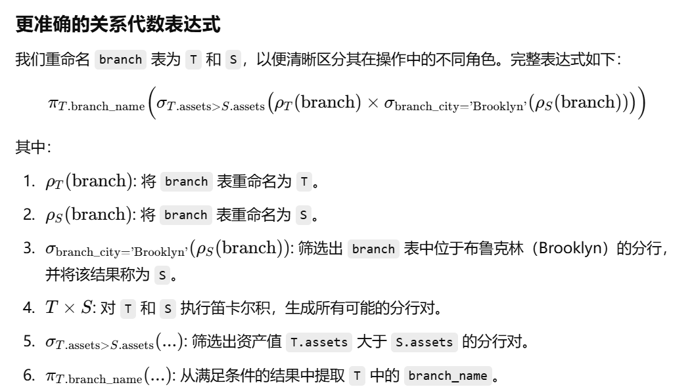

课程：【CMU 15-445】数据库系统
课本：Database System Concepts, 7th Edition, by Silberschatz, Korth, and Sudarshan
# Chapter 1
- A database-management system (DBMS) consists of a collection of interrelated data and a collection of programs to access those data. The data describe one particular enterprise

>ACID 是数据库管理系统（DBMS）中事务处理的四个关键属性的首字母缩写，分别代表原子性（Atomicity）、一致性（Consistency）、隔离性（Isolation）和持久性（Durability）。这些属性确保了数据库事务的可靠性和数据的完整性。
>**原子性（Atomicity）：**
原子性确保事务中的所有操作要么全部完成，要么全部不完成。换句话说，事务是不可分割的最小工作单元。如果事务中的任何一个操作失败，整个事务将回滚到事务开始前的状态。
例如，在银行转账操作中，资金从一个账户扣除并添加到另一个账户，这两个操作要么都成功，要么都不执行。
>**一致性（Consistency）：**
一致性确保事务在完成时，数据库从一个一致状态转换到另一个一致状态。事务的执行不能违反数据库的完整性约束。
例如，如果数据库有一个约束规定账户余额不能为负数，那么在事务完成后，这个约束仍然必须成立。
>**隔离性（Isolation）：**
隔离性确保并发执行的事务彼此之间不互相干扰。每个事务的中间状态对其他事务是不可见的，事务之间的操作是隔离的。
例如，在一个事务完成之前，其他事务不能看到它的未提交数据。
>**持久性（Durability）：**
持久性确保一旦事务提交，其结果将永久保存在数据库中，即使系统发生故障（如电源故障或崩溃），事务的结果也不会丢失。
例如，一旦银行转账操作成功提交，即使系统崩溃，转账结果也会被保留。
## view of Data
### Data Modles
A collection of tools for describing **data**, **data relationships**, **data semantics**, and consistency **constraints**.
#### Relational Model 关系模型
本文的大部分内容都集中在关系模型上，因为它是大多数数据库应用程序的基础。

关系模型使用一组表来表示数据和这些数据之间的关系。每个表有多个列，每个列有一个惟一的名称。表也被称为关系。关系模型是基于记录的模型的一个例子。基于记录的模型之所以如此命名，是因为数据库是由几种类型的固定格式记录构成的。每个表包含特定类型的记录。每个记录类型定义了固定数量的字段或属性。表的列对应于记录类型的属性。关系数据模型是使用最广泛的数据模型，目前绝大多数数据库系统都是基于关系模型的。

第2章和第7章详细介绍了关系模型
#### Entity-Relationship Model 实体关系（E-R）模型
实体-关系(E-R)数据模型使用一组称为实体的基本对象，以及这些对象之间的关系。实体是现实世界中有别于其他对象的“事物”或“对象”。实体-关系模型在数据库设计中应用广泛。第六章对此进行了详细的探讨。
#### Semi-structured Data Model 半结构化数据模型
半结构化数据模型允许对数据进行规范，其中相同类型的单个数据项可能具有不同的属性集。这与前面提到的数据模型相反，在数据模型中，特定类型的每个数据项必须具有相同的一组属性。JSON和可扩展标记语言(XML)是广泛使用的半结构化数据表示。第8章将详细探讨半结构化数据模型。
#### Object-Based Data Model 基于对象的数据模型
面向对象编程(特别是在Java、c++或c#中)已经成为占主导地位的软件开发方法。这最初导致了一种独特的面向对象数据模型的开发，但是今天对象的概念已经很好地集成到关系数据库中。存在将对象存储在关系表中的标准。数据库系统允许将过程存储在数据库系统中，并由数据库系统执行。这可以看作是用封装、方法和对象标识的概念扩展关系模型。第8章总结了基于对象的数据模型。

### Relational Model
在关系模型中，数据以表的形式表示。每个表有多个列，每个列有一个惟一的名称。表格的每一行代表一条信息。图1.1给出了一个示例关系数据库，其中包含两个表:一个表显示大学教师的详细信息，另一个表显示大学各个院系的详细信息。

例如，第一个表是教员表，它显示了一个ID为22222、名叫Einstein的教员，他是物理系的一员，年薪为95,000美元。例如，第二张表格“部门”显示生物系位于沃森大楼，预算为9万美元。当然，现实世界中的大学会有更多的院系和教师。我们在课文中用小表格来说明概念。可以在网上找到相同模式的更大示例。

### Data Abstraction
图1.2显示了三个抽象层次之间的关系。

数据库系统允许应用程序开发人员使用数据模型的抽象来存储和检索数据，并将抽象操作转换为低级实现上的操作。

对编程语言中数据类型概念的类比可以澄清抽象级别之间的区别。许多高级编程语言都支持结构化类型的概念。例如C中的结构体，C++中的类，Java中的类。结构化类型允许程序员定义新的数据类型，这些数据类型由多个字段组成。

在物理层，教员、院系或学生的记录可以被描述为一个连续的字节块。编译器对程序员隐藏了这一层次的细节。类似地，数据库系统对数据库程序员隐藏了许多最底层的存储细节。另一方面，数据库管理员可能知道数据的物理组织的某些细节。例如，有许多可能的方法将表存储在文件中。一种方法是将表存储为文件中的记录序列，使用特殊字符(例如逗号)来分隔记录的不同属性，并且可以使用另一个特殊字符(例如换行字符)来分隔记录。如果所有属性都有固定的长度，那么属性的长度可以单独存储，并且可以从文件中省略分隔符。可变长度属性可以通过存储长度，然后存储数据来处理。数据库使用一种称为索引的数据结构来支持对记录的有效检索;这些也构成了物理层的一部分。

在逻辑级别上，每个这样的记录由类型定义描述，如前面的代码段所示。这些记录类型的相互关系也在逻辑级别上定义;教员记录的部门名称值必须出现在部门表中的要求就是这种相互关系的一个例子。使用编程语言的程序员在这个抽象层次上工作。类似地，数据库管理员通常在这个抽象级别上工作。

最后，在视图层，计算机用户看到一组隐藏数据类型细节的应用程序。在视图级别，定义了数据库的几个视图，数据库用户可以看到其中的一些或全部视图。除了隐藏数据库逻辑级别的详细信息外，视图还提供了一种安全机制，以防止用户访问数据库的某些部分。例如，大学注册办公室的职员只能看到数据库中有学生信息的那部分;他们无法获得有关教师工资的信息。
### Instances and Schemas 实例和模式
数据库随着信息的插入和删除而变化。在特定时刻存储在数据库中的信息集合称为数据库的实例。数据库的总体设计称为数据库模式。数据库模式和实例的概念可以类比为用编程语言编写的程序来理解。数据库模式对应于程序中的变量声明(以及相关的类型定义)。每个变量在给定的时刻都有一个特定的值。程序中变量的值在某个时间点对应于数据库模式的实例。

数据库系统有几个模式，根据抽象级别进行分区。物理模式在物理层描述数据库设计，而逻辑模式在逻辑层描述数据库设计。数据库在视图级别也可能有多个模式(有时称为子模式)，它们描述数据库的不同视图。

## Database Languages
数据库系统提供数据定义语言DDL (data-definition language)来指定数据库模式，提供数据操作语言DML (data-manipulation language)来表达数据库查询和更新。实际上，数据定义语言和数据操作语言并不是两种独立的语言;相反，它们只是构成单一数据库语言的一部分，比如SQL语言。几乎所有的关系数据库系统都使用SQL语言，我们将在第3章、第4章和第5章详细介绍。
### DDL
我们通过一组由称为数据定义语言(DDL)的特殊语言表示的定义来指定数据库模式。DDL还用于指定数据的其他属性。

我们通过一组语句指定数据库系统使用的存储结构和访问方法，这些语句使用一种称为数据存储和定义语言的特殊DDL类型。这些语句定义了数据库模式的实现细节，这些细节通常对用户是隐藏的。

存储在数据库中的数据值必须满足一定的一致性约束。

例如，假设大学要求某个部门的账户余额永远不能为负。DDL提供了指定此类约束的工具。数据库系统在每次更新数据库时检查这些约束。通常，约束可以是属于数据库的任意谓词。但是，任意谓词的测试成本可能很高。因此，数据库系统只实现那些可以用最小开销测试的完整性约束:
- Domain constraints: 指定每个属性的允许值的范围。
每个属性（例如，整数类型、字符类型、日期/时间类型）都必须与一个可能值的域相关联。将属性声明为特定域可作为对其可采用的值的约束。域约束是完整性约束的最基本形式。每当有新数据项输入数据库时​​，系统都可以轻松地测试它们。
- Referential integrity: 指定两个关系之间的参照完整性。
在某些情况下，我们希望确保出现在给定属性集的一个关系中的值也出现在另一个关系中的某组属性中（参照完整性）。例如，每门课程列出的部门必须是大学中实际存在的部门。更准确地说，课程记录中的部门名称值必须出现在部门关系中某些记录的部门名称属性中。数据库修改可能导致违反参照完整性。当违反参照完整性约束时，正常程序是拒绝导致违规的操作。
- Authorization: 指定哪些用户有权访问数据。
我们可能希望根据用户对数据库中各种数据值的访问权限类型来区分用户。这些区别以授权的形式表达，最常见的是：读取授权，允许读取数据，但不允许修改数据；插入授权，允许插入新数据，但不允许修改现有数据；更新授权，允许修改数据，但不允许删除数据；删除授权，允许删除数据。我们可以为用户分配所有、不分配或这些类型的授权的组合。

DDL 语句的处理，就像任何其他编程语言的语句一样，会产生一些输出。DDL 的输出放在数据字典中，其中包含元数据，即有关数据的数据。数据字典被视为一种特殊类型的表，只能由数据库系统本身（而不是普通用户）访问和更新。数据库系统在读取或修改实际数据之前会查阅数据字典。
### The SQL Data-Definition Language
最常见的sql文件中的语句。略。
###  Data-Manipulation Language
数据操作语言(DML)是一种使用户能够访问或操作由适当数据模型组织的数据的语言。访问的类型有:
- 检索存储在数据库中的信息。
- 将新信息插入数据库。
- 删除数据库中的信息。
- 修改存储在数据库中的信息。
基本上有两种类型的数据操作语言:
- Declarative DMLs （过程性 DML） 要求用户指定需要什么数据以及如何获得这些数据。
- Declarative DMLs （声明性 DML，也称为非过程性dml）要求用户指定需要哪些数据，而不指定如何获取这些数据。
###  Database Access from Application Programs
数据库系统提供了一种接口，使应用程序可以访问数据库。这种接口允许应用程序员指定数据库操作，而不必关心数据存储和检索的细节。

非过程查询语言（例如 SQL）不如通用图灵机强大；也就是说，有些计算可以使用通用编程语言进行，但使用 SQL 则无法完成。SQL 也不支持用户输入、显示输出或网络通信等操作。此类计算和操作必须用宿主语言（例如 C/C++、Java 或 Python）编写，并嵌入 SQL 查询以访问数据库中的数据。

应用程序是用于以这种方式与数据库交互的程序。大学系统中的示例是允许学生注册课程、生成班级名册、计算学生 GPA、生成工资支票和执行其他任务的程序。

要访问数据库，需要将DML语句从主机发送到数据库，在那里它们将被执行。这通常是通过使用应用程序编程接口来实现的，该接口可用于向数据库发送DML和DDL语句并检索结果。开放数据库连接(Open Database Connectivity, ODBC)标准定义了与C和其他几种语言一起使用的应用程序编程接口。Java数据库连接(JDBC)标准为Java语言定义了相应的接口。

## Database Design
高级数据模型为数据库设计人员提供了一个概念框架，用于指定数据库用户的数据需求以及如何构建数据库以满足这些需求。数据库设计的初始阶段是充分描述潜在数据库用户的数据需求。数据库设计人员需要与领域专家和用户进行广泛的互动才能完成这项任务。此阶段的结果是用户需求的规范。接下来，设计人员选择一个数据模型，并通过应用所选数据模型的概念，将这些需求转化为数据库的概念模式。在此概念设计阶段开发的模式提供了企业的详细概述。设计人员审查该模式以确认所有数据需求确实得到满足并且彼此不冲突。设计人员还可以检查设计以删除任何冗余功能。此时的重点是描述数据及其关系，而不是指定物理存储细节。

就关系模型而言，概念设计过程涉及到我们希望在数据库中捕获哪些属性以及如何将这些属性分组以形成各种表的决策。“What”部分基本上是一个业务决策，我们将在本文中进一步讨论它。“How”部分主要是一个计算机科学问题。解决这个问题主要有两种方法。第一种是使用实体-关系模型(第6章);另一种是采用一组算法(统称为规范化)，将所有属性集合作为输入并生成一组表(第7章)。

一个完全开发的概念模式表明了企业的功能需求。在功能需求规范中，用户描述将对数据执行的操作（或事务）类型。示例操作包括修改或更新数据、搜索和检索特定数据以及删除数据。在概念设计的这个阶段，设计人员可以检查模式以确保它满足功能要求。从抽象数据模型转移到数据库实现的过程分为两个最终设计阶段。在逻辑设计阶段，设计人员将高级概念模式映射到将要使用的数据库系统的实现数据模型上。设计人员在随后的物理设计阶段使用生成的系统特定数据库模式，在此阶段指定数据库的物理特性。这些特性包括文件组织形式和内部存储结构；它们将在第 13 章中讨论。

## Database Engine
数据库系统被划分为处理整个系统各项职责的模块。数据库系统的功能组件大致可分为**存储管理器、查询处理器组件和事务管理组件**。

**The storage manager** 存储管理器非常重要，因为数据库通常需要大量的存储空间。企业数据库的大小通常从数百 GB 到数 TB 不等。1 GB 大约等于 10 亿字节，即 1000 兆字节（更准确地说是 1024 兆字节），而 TB 大约等于 1 万亿字节或 100 万兆字节（更准确地说是 1024 GB）。最大的企业拥有的数据库达到数 PB 级（1 PB 等于 1024 TB）。由于计算机的主内存无法存储这么多信息，并且主内存的内容在系统崩溃时会丢失，因此信息存储在磁盘上。数据会根据需要在磁盘存储和主内存之间移动。由于数据进出磁盘的移动速度相对于中央处理器的速度较慢，因此数据库系统必须对数据进行结构化，以尽量减少在磁盘和主内存之间移动数据的需要。固态磁盘 (SSD) 越来越多地用于数据库存储。SSD 比传统磁盘更快，但成本也更高。

**The query processor** 查询处理器很重要，因为它帮助数据库系统简化和方便对数据的访问。查询处理器允许数据库用户获得良好的性能，同时能够在视图级别上工作，而不必负担理解系统实现的物理层细节。数据库系统的工作是在逻辑层将用非过程性语言编写的更新和查询转换为物理层的高效操作序列。

**The transaction manager** 事务管理器很重要，因为它允许应用程序开发人员将一系列数据库访问视为一个单元，要么全部发生，要么根本不发生。这允许应用程序开发人员在更高层次上思考应用程序，而无需关心管理并发访问数据和系统故障的影响的较低层次的细节。

虽然数据库引擎传统上是集中式计算机系统，但如今并行处理是高效处理大量数据的关键。现代数据库引擎非常重视并行数据存储和并行查询处理。
### Storage Manager
存储管理器子系统提供数据库中存储的低级数据与提交给系统的应用程序和查询之间的接口。
- Authorization and integrity manager 授权和完整性管理器，用于测试是否满足完整性约束并检查用户访问数据的权限。

- Transaction manager 事务管理器，它确保数据库在系统故障时保持一致(正确)状态，并发事务执行无冲突地进行。

- File manager 文件管理器，它管理磁盘存储空间的分配和用于表示存储在磁盘上的信息的数据结构。

- Buffer manager 缓冲区管理器，负责从磁盘存储中提取数据到主存，并决定在主存中缓存哪些数据。缓冲区管理器是数据库系统的关键部分，因为它使数据库能够处理比主内存大得多的数据大小。

存储管理器在物理系统实现过程中实现了几种数据结构：
- Data files 数据文件，用于存储数据库本身。
- Data dictionary 数据字典，用于存储有关数据库结构（特别是数据库模式）的元数据。
- Indices 索引，用于快速访问数据项。与本教科书中的索引一样，数据库索引提供指向包含特定值的数据项的指针。
例如，我们可以使用索引查找具有特定 ID 的讲师记录，或具有特定名称的所有讲师记录。
我们在第 12 章和第 13 章中讨论了存储介质、文件结构和缓冲区管理。第 14 章讨论了有效访问数据的方法
### Query Processor
查询处理器子系统编译并执行 DDL 和 DML 语句。
查询处理器组件包括：
- DDL interpreter DDL 解释器，解释 DDL 语句并将定义记录在
数据字典中。
- DML compiler DML 编译器，将查询语言中的 DML 语句转换为由查询评估引擎
理解的低级指令组成的评估计划。查询通常可以转换为许多备选评估计划中的任何一个，这些计划都给出相同的结果。DML 编译器还执行**查询优化**；也就是说，它从备选方案中选择成本最低的评估计划。
- Query evaluation engine 查询评估引擎，执行由 DML 编译器生成的低级指令

Query evaluation 将在第15章中介绍，而查询优化器从可能的求值策略中选择的方法将在第16章中讨论
### Transaction Manager
事务管理确保数据库在系统发生故障时仍保持一致（正确）状态。事务管理器确保并发事务执行不会发生冲突。

事务是数据库应用程序中执行单个逻辑功能的操作的集合。每个事务都是原子性和一致性的单位。因此，我们要求事务不违反任何数据库一致性约束。也就是说，如果事务开始时数据库是一致的，则事务成功终止时数据库也必须是一致的。但是，在执行事务期间，可能需要暂时允许不一致，因为 A 的借记或 B 的贷记必须先于另一个完成。这种暂时的不一致虽然是必要的，但如果发生故障，可能会导致困难。

确保原子性和持久性属性是数据库系统本身的责任 - 具体来说，是**恢复管理器**的责任。在没有故障的情况下，所有事务都会成功完成，并且很容易实现原子性。但是，由于各种类型的故障，事务可能并不总是成功完成其执行。如果我们要确保原子性属性，则失败的事务必须对数据库的状态没有影响。因此，必须将数据库恢复到相关事务开始执行之前的状态。因此，数据库系统必须执行故障恢复，即它必须检测系统故障并将数据库恢复到故障发生之前的状态。

最后，当多个事务同时更新数据库时，即使每个单独的事务都是正确的，数据的一致性也可能不再得到保持。并发控制管理器负责控制并发事务之间的交互，以确保数据库的一致性。

事务管理器由并发控制管理器和恢复管理器组成(concurrency-control manager and the recovery manager)。

第 17 章介绍了事务处理的基本概念。第 18 章介绍了并发事务的管理。第 19 章详细介绍了故障恢复。

事务的概念已广泛应用于数据库系统和应用程序中。虽然事务最初是在金融应用程序中使用，但现在该概念已用于电信的实时应用程序，以及产品设计或管理工作流等长期活动的管理。
## Database and Application Architecture

图 1.3 所示的集中式架构适用于共享内存服务器架构，这种架构具有多个 CPU 并利用并行处理，但所有 CPU 都访问一个公共共享内存。为了扩展到更大的数据量和更高的处理速度，并行数据库被设计为在由多台机器组成的集群上运行。此外，分布式数据库允许跨多个地理上分离的机器进行数据存储和查询处理。

在第20章中，我们将介绍现代计算机系统的一般结构，重点是并行系统体系结构。第21章和第22章描述了如何实现查询处理来利用并行和分布式处理。第23章介绍了在并行或分布式数据库中处理事务时出现的一些问题，并描述了如何处理每个问题。这些问题包括如何存储数据、如何确保在多个站点执行的事务的原子性、如何执行并发控制以及如何在出现故障时提供高可用性。


我们现在考虑使用数据库作为后端的应用程序的体系结构。数据库应用程序可以划分为两个或三个部分，如图1.4所示。早期的数据库应用程序使用两层体系结构，其中应用程序驻留在客户机机器上，并通过查询语言语句调用服务器机器上的数据库系统功能。


相比之下，现代数据库应用程序使用三层体系结构，其中客户机仅充当前端，不包含任何直接的数据库调用;Web浏览器和移动应用程序是当今最常用的应用程序客户机。前端与应用服务器通信。反过来，应用服务器与数据库系统通信以访问数据。应用程序的业务逻辑(说明在什么条件下执行什么操作)嵌入到应用程序服务器中，而不是分布在多个客户机上。三层应用程序比两层应用程序提供更好的安全性和性能。

## Database Users and Administrators
数据库系统的主要目标是从数据库中检索信息并将新信息存储在数据库中。使用数据库的人可以分为数据库用户或数据库管理员。
### Database Users and User Interfaces
有四种不同类型的数据库系统用户，根据他们期望与系统交互的方式进行区分。针对不同类型的用户，设计了不同类型的用户界面。
- Native 用户是通过使用预定义的用户界面(如web或移动应用程序)与系统交互的简单用户。Native 用户的典型用户界面是 web 表单界面，用户可以在其中填写表单的适当字段。Native 用户还可以查看从数据库生成的已读报告。
- 应用程序程序员是编写应用程序的计算机专业人员。应用程序程序员可以从许多工具中选择开发用户界面。
- 资深用户无需编写程序即可与系统交互。相反，他们使用数据库查询语言或使用数据分析软件等工具来形成请求。提交查询以探索数据库中的数据的分析师属于这一类
### Database Administrator
使用 DBMS 的主要原因之一是可以集中控制数据和访问这些数据的程序。对系统具有这种集中控制权的人称为数据库管理员 (DBA)。DBA 的功能包括：
- Schema definition. 模式定义。DBA 通过执行 DDL 中的一组数据定义语句来创建原始数据库模式。
- 存储结构和访问方法定义。DBA 可以指定一些与数据的物理组织和要创建的索引有关的参数。
- Schema and physical-organization modification. 模式和物理组织修改。DBA 对模式和物理组织进行更改以反映组织不断变化的需求，或更改物理组织以提高性能。
- Granting of authorization for data access. 授予数据访问授权。通过授予不同类型的授权，数据库管理员可以规定不同用户可以访问数据库的哪些部分。授权信息保存在一个特殊的系统结构中，每当用户尝试访问系统中的数据时，数据库系统都会查阅该结构。
- Routine maintenance. 日常维护。数据库管理员的日常维护活动示例包括：    
    - 定期将数据库备份到远程服务器，以防止在发生洪水等灾难时丢失数据。
    - 确保有足够的可用磁盘空间用于正常操作，并根据需要升级磁盘空间。
    - 监控数据库上运行的作业，并确保性能不会因某些用户提交的非常昂贵的任务而降低。
## History of Database Systems
20 世纪 70 年代末和 80 年代：尽管关系模型在学术上很有趣，但由于其性能缺陷，最初并未在实践中使用；关系数据库无法与现有的网络和层次化数据库的性能相匹配。随着 System R 的出现，这种情况发生了改变，这是 IBM 研究部门的一个开创性项目，开发了构建高效关系数据库系统的技术。功能齐全的 System R 原型促成了 IBM 的第一款关系数据库产品 SQL/DS 的诞生。与此同时，加州大学伯克利分校正在开发 Ingres 系统。它促成了同名的商业产品。同样在这个时候，Oracle 的第一个版本也发布了。最初的商业关系数据库系统（如 IBM DB2、Oracle、Ingres 和 DEC Rdb）在推进高效处理声明式查询的技术方面发挥了重要作用。到 20 世纪 80 年代初，关系数据库甚至在性能方面也与网络和分层数据库系统相媲美。关系数据库非常易于使用，最终取代了网络和分层数据库。

2000 年代：在此期间，存储在数据库系统中的数据类型发展迅速。半结构化数据变得越来越重要。XML 成为数据交换标准。JSON 是一种更紧凑的数据交换格式，非常适合存储来自 JavaScript 或其他编程语言的对象，随后变得越来越重要。随着主要商业系统增加了对 XML 和 JSON 格式的支持，越来越多的此类数据存储在关系数据库系统中。空间数据（即包含地理信息的数据）在导航系统和高级应用程序中得到广泛使用。数据库系统增加了对此类数据的支持。开源数据库系统（尤其是 PostgreSQL 和 MySQL）的使用率不断提高。数据库系统添加了“自动管理”功能，以便自动重新配置以适应不断变化的工作负载。这有助于减少管理数据库的人工工作量。

社交网络平台发展迅速，需要管理有关人们与其发布数据之间联系的数据，而这些数据并不适合表格行列格式。这导致了图形数据库的发展。
在本世纪后期，数据分析和数据挖掘在企业中的使用变得无处不在。数据库系统是专门为服务于这个市场而开发的。这些系统具有适合分析处理的物理数据组织，例如“列存储”，其中表格按列存储，而不是主要商业数据库系统的传统行式存储。
庞大的数据量，以及用于分析的大部分数据是文本或半结构化数据的事实，导致了 map-reduce 等编程框架的开发，以方便应用程序程序员使用并行性来分析数据。随着时间的推移，对这些功能的支持迁移到了传统数据库系统中。即使在 2010 年代后期，数据库研究界仍在争论一个数据库系统同时服务于传统事务处理应用程序和较新的数据分析应用程序与为这些角色维护单独的系统之间的相对优缺点。

各种新的数据密集型应用程序和快速开发的需求，尤其是初创公司的需求，导致了提供轻量级数据管理形式的“NoSQL”系统的出现。这个名字源于这些系统缺乏对无处不在的数据库查询语言 SQL 的支持，尽管这个名字现在通常被视为“不仅仅是 SQL”。由于缺乏基于关系模型的高级查询语言，程序员可以更灵活地处理新类型的数据。由于传统数据库系统不支持严格的数据一致性，因此应用程序使用分布式数据存储时可以更加灵活。NoSQL 的“最终一致性”模型允许数据的分布式副本不一致，只要它们最终会在没有进一步更新的情况下收敛即可。

# Chapter 2: Introduction to the Relational Model

## Structure of Relational Databases
关系数据库由一组表组成，每个表都有一个唯一的名称。

因此，在关系模型中，术语关系用于指代表，而术语元组用于指代行。类似地，术语属性指的是表中的一列。

我们使用术语“关系实例”来指代关系的特定实例，也就是说，它包含一组特定的行。图2.1所示的教员实例有12个元组，对应12个教员。

我们要求，对于所有关系r, r的所有属性的域都是原子的。

如果域的元素被认为是不可分割的单元，那么域就是原子的。

例如，假设表教练有一个属性电话号码，该属性可以存储与教练对应的一组电话号码。那么电话号码的域就不是原子的，因为域的元素是电话号码的集合，并且它有子部分，即集合中的单个电话号码。

重要的问题不是域本身是什么，而是我们如何在数据库中使用域元素。现在假设电话号码属性存储单个电话号码。即使这样，如果我们将电话号码属性的值拆分为国家代码、地区代码和本地号码，我们也会将其视为非原子值。如果我们将每个电话号码视为单个不可分割的单元，那么属性电话号码将具有一个原子域。

null值是一个特殊值，表示该值未知或不存在。例如，假设和前面一样，我们在教员关系中包含了属性电话号码。可能是教师根本没有电话号码，或者电话号码没有列出。然后，我们必须使用空值来表示该值未知或不存在。稍后我们将看到，当我们访问或更新数据库时，空值会导致许多困难，因此应该尽可能消除空值。我们首先假定空值不存在，在第3.6节中，我们将描述空值对不同操作的影响。

我们将看到，相对严格的关系结构在数据存储和处理方面带来了几个重要的实际优势。这种严格的结构适合定义良好且相对静态的应用程序，但不太适合不仅数据而且这些数据的类型和结构都随时间变化的应用程序。现代企业需要在结构化数据的效率和预定结构受限的情况之间找到良好的平衡。
## Database Schema
当我们谈论数据库时，我们必须区分数据库模式和数据库实例，前者是数据库的逻辑设计，后者是数据库中数据在给定时刻的快照。

关系（relation）的概念对应于变量的编程语言概念，而关系模式（relation schema）的概念对应于类型定义的编程语言概念。给定变量的值可能随时间变化;类似地，关系实例的内容可能随着关系的更新而改变。相反，关系的模式通常不会改变。

## Keys
我们必须有一种方法来指定如何区分给定关系中的元组。

这是用它们的属性来表示的。也就是说，元组的属性值的值必须能够唯一地标识该元组。换句话说，关系中的两个元组不允许对所有属性具有完全相同的值。**超键是一个或多个属性的集合，这些属性使我们能够在关系中唯一地标识一个元组。** 例如，关系 instructor 的 ID 属性足以区分一个 instructor 元组和另一个 instructor 元组。因此，ID 是一个超级键。另一方面，instructor 的 name 属性不是超级键，因为多个讲师可能具有相同的名称。

形式上，设 R 表示关系 R 模式中的属性集。如果我们说 R 的子集 K 是 R 的超键，我们将考虑限制在关系 R 的实例上，其中没有两个不同的元组在 K 的所有属性上具有相同的值。

也就是说，如果t1和t2在r中并且t1≠t2，那么t1。K≠t2。

A **superkey** may contain extraneous attributes. For example, the combination of ID and name is a superkey for the relation instructor. If K is a superkey, then so is any superset of K. We are often interested in superkeys for which no proper subset is a superkey. **Such minimal superkeys are called candidate keys.** 如果K是一个超键，那么K的任何超集也是一个超键。我们经常感兴趣的是那些没有合适子集是超键的超键。这样的最小超键称为候选键。

可能有几个不同的属性集可以作为候选键。

假设名称和部门名称的组合足以区分教员关系的成员。然后，{ID}和{name, dept name}都是候选键。虽然属性ID和name一起可以区分讲师元组，但它们的组合{ID, name}并不能形成候选键，因为属性ID本身就是一个候选键。

We shall use the term **primary key** to denote a candidate key that is chosen by the database designer as the principal means of dentifying tuples within a relation. A key (whether **primary**, **candidate**, or **super**) is a property of the entire relation, rather than of the individual tuples. Any two individual tuples in the relation are prohibited from having the same value on the key attributes at the same time. The designation of a key represents a constraint in the real-world enterprise being modeled. Thus, **primary keys are also referred to as primary key constraints**.

接下来，我们考虑对关系内容的另一种类型的约束，称为外键约束（foreign-key constraint）。考虑讲师关系的属性dept name。如果讲师中的元组的dept name值与部门关系中的部门不对应，则没有意义。因此，在任何数据库实例中，给定教员关系中的任意元组(例如ta)，在部门关系中必须存在某个元组(例如tb)，使得ta的dept name属性的值与tb的主键dept name的值相同。

A **foreign-key constraint** from attribute(s) A of relation r1 to the primary-key B of relation r2 states that on any database instance, the value of A for each tuple in r1 must also be the value of B for some tuple in r2. Attribute set A is called a **foreign key** from r1, referencing r2. The relation r1 is also called the **referencing relation** of the foreign-key constraint, and r2 is called the **referenced relation**.

注意，在外键约束中，被引用的属性必须是被引用关系的主键。更一般的情况是，引用完整性约束（referential integrity constraint）放宽了引用属性构成引用关系主键的要求。

**引用完整性约束（Referential Integrity Constraint）** 的基本概念：引用完整性约束确保数据库中的关系（表）之间的数据一致性。具体来说，它要求在一个关系（表）中的某些属性（列）中的值必须在另一个关系（表）中的某些属性（列）中存在。

- 引用关系（Referencing Relation）：
    - 这是包含外键（Foreign Key）的关系（表）。外键是一个或多个属性（列），它们引用另一个关系（表）的主键（Primary Key）。
- 被引用关系（Referenced Relation）：
    - 这是被外键引用的关系（表）。被引用的属性通常是主键或具有唯一约束的属性。

引用完整性约束的要求
- 外键约束：在引用关系中的外键属性的值必须在被引用关系的主键属性中存在。
- 数据一致性：这确保了引用关系中的每个外键值都能在被引用关系中找到对应的主键值。

事实上，外键约束是引用完整性约束的一种特殊情况，其中引用的属性构成引用关系的主键。目前的数据库系统通常支持外键约束，但是它们不支持引用的属性不是主键的引用完整性约束。

## Schema Diagrams
数据库模式以及主键和外键约束可以通过模式图来描述。图2.9显示了我们大学组织的架构图。每个关系显示为一个框，关系名称以蓝色显示在顶部，框内列出了属性。

主键属性用下划线显示。外键约束以箭头的形式显示，从引用关系的外键属性指向被引用关系的主键。我们使用双头箭头(而不是单头箭头)来指示不是外键约束的引用完整性约束。


我们将在第6章详细讨论模式的另一种图解表示，称为实体-关系图;虽然在外观上有一些相似之处，但这两种符号有很大的不同，不应相互混淆。

## Relational Query Languages
查询语言是用户从数据库请求信息时使用的语言。

这些语言通常在比标准编程语言更高的级别上。查询语言可以分为**命令式、函数式和声明式**。

在**命令式查询语言**中，用户指示系统对数据库执行特定的操作序列以计算期望的结果;这种语言通常有状态变量的概念，在计算过程中更新状态变量。

在**函数查询语言**中，计算被表示为对可能对数据库中的数据或对其他函数的结果进行操作的函数的求值;函数没有副作用，也不会更新程序状态在声明性查询语言中，用户描述所需的信息，而不给出获取该信息的特定步骤序列或函数调用;所需的信息通常使用某种形式的数学逻辑来描述。如何获取所需的信息是数据库系统的工作。


有许多“纯”查询语言。

- 我们在2.6节中描述的关系代数是一种函数式查询语言关系代数构成了SQL查询语言的理论基础。

- 我们在第27章描述的元组关系演算和域关系演算是声明性的。

这些查询语言简洁而正式，缺乏商业语言的“语法糖”，但它们演示了从数据库中提取数据的基本技术。

在实践中使用的查询语言，如SQL查询语言，包括命令式、函数式和声明式方法的元素。在第三章到第五章中，我们会学习使用非常广泛的查询语言SQL。

## The Relational Algebra 关系代数


### The Select Operation
select操作返回一个关系，该关系包含从输入关系中选择的元组。这些元组由选择条件指定。如果选择条件为空，则输出关系将包含与输入关系相同的元组。如果输入关系为空，则输出关系也为空。
### The Project Operation
project操作返回一个关系，该关系包含从输入关系中选择的属性的元组。这些属性由属性列表指定。如果输入关系中有多个元组具有相同的属性值，则输出关系中只包含一个这样的元组。如果属性列表为空，则输出关系将包含一个元组，该元组的属性值为空。如果输入关系为空，则输出关系也为空。
### Composition of Relational Operations
关系代数操作可以组合在一起。例如，可以将选择操作和投影操作组合在一起，以便选择一个关系的属性的子集，并且只包含满足某些条件的元组。这种组合称为查询计划。查询计划是一个关系代数表达式，它描述了如何从输入关系生成输出关系。查询计划可以包含一个或多个关系代数操作，这些操作以某种顺序应用于输入关系。例如，可以选择一个关系的属性的子集，然后选择满足某些条件的元组。这种组合称为查询计划。查询计划是一个关系代数表达式，它描述了如何从输入关系生成输出关系。查询计划可以包含一个或多个关系代数操作，这些操作以某种顺序应用于输入关系。
### The Cartesian-Product Operation
笛卡尔积操作返回一个关系，该关系包含两个输入关系的所有可能的元组的组合。笛卡尔积操作是关系代数中最基本的操作之一。如果两个输入关系都为空，则输出关系也为空。
### The Join Operation
join操作返回一个关系，该关系包含两个输入关系的元组的连接。连接是两个元组的笛卡尔积的子集，这两个元组满足某些连接条件。连接条件是两个关系的属性之间的等式。如果两个关系的属性之间没有等式，则连接条件为空，输出关系将包含两个输入关系的笛卡尔积。如果两个输入关系都为空，则输出关系也为空。
### Set Operations
关系代数支持集合操作，例如并集、交集和差集。并集操作返回两个关系的并集，交集操作返回两个关系的交集，差集操作返回两个关系的差集
### The Assignment Operation
assignment操作将一个关系的结果分配给一个关系变量。关系变量是一个关系的名称，它可以用于表示关系的结果。关系变量可以用作关系代数表达式的输入。例如，可以将一个关系的结果分配给一个关系变量，然后使用该关系变量作为另一个关系的输入。关系变量可以用作关系代数表达式的输入。例如，可以将一个关系的结果分配给一个关系变量，然后使用该关系变量作为另一个关系的输入。
### The Rename Operation
rename操作返回一个关系，该关系与输入关系相同，但是属性的名称可能不同。重命名操作用于更改属性的名称。如果输入关系为空，则输出关系也为空。
### Equivalent Queries
在关系代数中，可以使用等价关系代数表达式来表示相同的查询。等价关系代数表达式是指两个关系代数表达式，它们返回相同的结果。例如，可以使用选择操作和投影操作来表示一个查询，也可以使用连接操作来表示该查询。在关系代数中，可以使用等价关系代数表达式来表示相同的查询。等价关系代数表达式是指两个关系代数表达式，它们返回相同的结果。例如，可以使用选择操作和投影操作来表示一个查询，也可以使用连接操作来表示该查询。
## chapter 27 Other Data Models
### Document Data Model
The document data model is a collection of record documents containing a hierarchy of named field/value
pairs. A field’s value can be either a scalar type, an array of values, or a pointer to another document.
Modern implementations use JSON. Older systems use XML or custom object representations.
The document model avoid ”relation-object impedance mismatch” by tightly coupling objects and database.
While there are certainly use cases for this model, it still runs into many of the problems discussed in the
flat file strawman example discussed earlier.
### Vector Data Model
The vector data model represents one-dimensional arrays used for nearest-neighbor search (exact or approximate). Vector databases are generally used for semantic search on embeddings generated by MLtrained transformer models (think ChatGPT), and native integration with modern ML tools and APIs (e.g.,
LangChain, OpenAI). At their core, these systems use specialized indexes to perform NN searches quickly.
Recently, many relational DBMSs have shipped vector index features or extensions (pgvector) that allow
NN search within the relational model
# Chapter 3: Introduction to SQL
## 3.1 Overview of the SQL Query Language
The SQL language has several parts:
- Data-definition language (DDL). The SQL DDL provides commands for defining relation schemas, deleting relations, and modifying relation schemas.
- Data-manipulation language (DML). The SQL DML provides the ability to query information from the database and to insert tuples into, delete tuples from, and modify tuples in the database.
- Integrity. The SQL DDL includes commands for specifying integrity constraints that the data stored in the database must satisfy. Updates that violate integrity constraints are disallowed. SQL DDL包括用于指定存储在数据库中的数据必须满足的完整性约束的命令。不允许违反完整性约束的更新。
- View definition. The SQL DDL includes commands for defining views. SQL DDL包括用于定义视图的命令。
- Transaction control. SQL includes commands for specifying the beginning and end points of transactions. SQL包括用于指定事务开始点和结束点的命令。
- Embedded SQL and dynamic SQL. Embedded and dynamic SQL define how SQL statements can be embedded within general-purpose programming languages, such as C, C++, and Java. 嵌入式和动态SQL定义了如何将SQL语句嵌入到通用编程语言(如C、c++和Java)中
- Authorization. The SQL DDL includes commands for specifying access rights to relations and views. SQL DDL包括用于指定对关系和视图的访问权限的命令。
## 3.2 SQL Data Definition
The set of relations in a database are specified using a data-definition language (DDL).
The SQL DDL allows specification of not only a set of relations, but also information about each relation, including:
- The schema for each relation.
- The types of values associated with each attribute.
- The integrity constraints.
- The set of indices to be maintained for each relation.
- The security and authorization information for each relation.
- The physical storage structure of each relation on disk.

我们在这里讨论基本模式定义和基本类型;我们把对其他SQL DDL特性的讨论推迟到第4章和第5章。
### Basic Types

### Basic Schema Definition
SQL支持许多不同的完整性约束。在本节中，我们只讨论其中的几个:
- 主键约束
- 外键约束
- not null 约束
create、drop、delete、alter
## 3.3 Basic Structure of SQL Queries
SQL查询的基本结构由三个子句组成:select、from和where。

查询将from子句中列出的关系作为输入，按照where和select子句中指定的方式对它们进行操作，然后生成一个关系作为结果。我们将通过示例介绍SQL语法，并在后面描述SQL查询的一般结构。

我们使用alter table命令向现有关系添加属性。关系中的所有元组都被指定为null作为新属性的值。alter table命令的形式是
### Queries on a Single Relation

### Queries on Multiple Relations
查询通常需要访问来自多个关系的信息。
例如，假设我们想要回答“检索所有教员的姓名，以及他们的部门名称和部门大楼名称”这个查询。查看关系指导器的模式，我们意识到可以从属性dept name获得部门名称，但是部门构建名称出现在关系部门的属性构建中。要回答查询，教员关系中的每个元组必须与部门关系中dept name值与教员元组的dept name值匹配的元组相匹配。

在SQL中，为了回答上述查询，我们在from子句中列出需要访问的关系，并在where子句中指定匹配条件。上面的查询可以用SQL编写为
```SQL
select name, instructor.dept name, building
from instructor, department
where instructor.dept name= department.dept name;
```
#### join
#### natural join
没有公共属性的时候退化为笛卡尔积
##### danger of nartual join
## 3.4 Additional Basic Operations
### the rename operation
使用 as 闭包
### String Operations
### Attribute Specification in the Select Clause
### Ordering the Display of Tuples
### Set Operations
## 3.6 Null Values
由于where子句中的谓词可以涉及布尔操作，如and、or，而不是对比较的结果，因此布尔操作的定义被扩展为处理 unknown。
1. The result of any arithmetic expression involving null is null 任何包含 null 的算术表达式的结果都是 null
2. Any comparison with null returns unknown，如 `1<null` 是unknown 任何与 null 的比较都返回 unknown

 - and: The result of `true and unknown` is `unknown`, `false and unknown` is `false`, while `unknown and unknown` is `unknown`.
- or: The result of `true or unknown` is `true`, `false or unknown` is `unknown`, while `unknown or unknown` is `unknown`.
- not: The result of `not unknown` is `unknown`
## 3.7 Aggregate Functions
聚合函数是接受值的集合(一组或多组)作为输入并返回单个值的函数。SQL提供了五个标准的内置聚合函数:
- Average: avg
- Minimum: min
- Maximum: max
- Total: sum
- Count: count
sum和avg的输入必须是数字的集合，但其他操作符也可以操作非数字数据类型的集合，比如字符串。
### Basic Aggregation
### Aggregation with Grouping
```sql
select dept name, avg (salary) as avg salary
from instructor
group by dept_name;
```

当SQL查询使用分组时，重要的是要确保出现在select语句中而不被聚合的属性是那些出现在group by子句中的属性。换句话说，group by子句中没有出现的任何属性都可能只作为聚合函数的参数出现在select子句中，否则该查询将被视为错误。例如，下面的查询是错误的，因为ID没有出现在group by子句中，但是它出现在select子句中而没有被聚合:
```sql
/* erroneous query */
select dept name, ID, avg (salary)
from instructor
group by dept name;
```
在前面的查询中，特定组(由dept name定义)中的每个教练可以有不同的ID，并且由于每个组只输出一个元组，因此没有唯一的方法来选择输出哪个ID值。因此，SQL不允许这样的情况。
### The Having Clause
有时，声明一个**适用于组而不是元组的条件**是有用的。例如，我们可能只对教师平均工资超过4.2万美元的院系感兴趣。此条件不适用于单个元组；相反，它适用于group by子句构造的每个组。为了表达这样的查询，我们使用SQL的having子句。SQL在组形成后在having子句中应用谓词，**因此可以在having子句中使用聚合函数**。
```sql
select dept name, avg (salary) as avg salary
from instructor
group by dept name
having avg (salary) > 42000;
```
 > SQL关键字执行顺序
>```sql
>slect A1, agg_fun as X
>from a,b
>where P1
>gruop by A1
>Having P2
>```

### Aggregation with Null and Boolean Values
## 3.8 Nested Subqueries
### Set Membership
SQL allows testing tuples for membership **in** a relation. The in connective tests for set membership, where the set is a collection of values produced by a select clause. The **not in** connective tests for the absence of set membership.
### Set Comparison
### Test for Empty Relations
SQL包含一个特性，用于测试子查询的结果中是否有任何元组。如果参数子查询非空，exists构造返回值true。使用exists结构，我们可以用另一种方式编写查询“查找2017年秋季学期和2018年春季学期教授的所有课程”:
```sql
select course id
from section as S
where semester= 'Fall' and year= 2017 and
    exists(select *
        from section as T
        where semester= 'Spring' and year= 2018 and 
        S.course id= T.course_id);
```
上面的查询还说明了SQL的一个特性，即可以在where子句中的子查询中使用来自外部查询(上面查询中的S)的关联名称。

使用来自外部查询的关联名称的子查询称为相关子查询。
### Test for the Absence of Duplicate Tuples
todo!()
### Subqueries in the From Clause
todo!()

### The With Clause
with子句提供了一种定义临时关系的方法，该临时关系的定义仅对出现with子句的查询可用。
考虑以下查询，该查询查找预算最大的部门。
```sql
with max budget (value) as
(select max(budget)
from department)
select budget
from department, max budget
where department.budget = max budget.value;
```
当然，我们可以创建一个不使用with子句的等效查询，但这样做会更复杂，也更难以理解。您可以编写等效的查询作为练习。
### Scalar Subqueries
只要允许表达式返回值，SQL就允许子查询，只要子查询**只返回一个包含单个属性的元组**；这样的子查询称为**标量子查询**。例如，可以在 select 子句中使用子查询，如下面的示例所示，该子查询列出了所有部门以及每个部门的教师数量:
```sql
select dept name,
(select count(*)
from instructor
where department.dept name = instructor.dept name)
as num instructors
from department;
```

```sql
select count (distinct ID)
from takes
where (course_id,sec_id,semester,year) in
(select course_id, sec_id, semester, year from teaches
where teaches.1D= 10101);
```
用with子句重写
```sql
with T as
(select course id, sec id, semester, year
from teaches
where teaches.ID= 10101)
select count (distinct ID)
from takes
where (course_id, sec_id, semester, year) in T;
```

### Scalar Without a From Clause
某些查询需要计算，但不需要引用任何关系。类似地，某些查询可能具有包含from子句的子查询，而顶级查询不需要from子句。

作为一个例子，假设我们希望找到每个教师教授的平均节数(无论学年或学期)，每个教师计算一次由多个教师教授的节数。我们需要计算教学中的元组数量来找到教学的总节数，并计算教师中的元组数量来找到教师的数量。然后一个简单的除法就得到了我们想要的结果。可以这样写:
```sql
select count(*) / (select count(*) from instructor) as avg class size
from teaches;
```
## 3.9 Modification of the Database
### Deletion
注意，虽然一次只能从一个关系中删除元组，但是可以在delete的where子句中嵌套的select-from-where中引用任意数量的关系。删除请求可以包含一个嵌套的选择，该选择引用要从中删除元组的关系。例如，假设我们想要删除所有工资低于大学平均水平的教师的记录。我们可以这样写:
```sql
delete from instructor
where salary < (select avg (salary) from instructor);
```
delete语句首先测试关系教员中的每个元组，以检查其工资是否低于大学教员的平均工资。然后，删除所有通过测试的元组(即代表工资低于平均水平的教员)。**在执行任何删除之前执行所有测试是很重要的——如果在测试其他元组之前删除了一些元组，则平均薪水可能会发生变化，并且删除的最终结果将取决于处理元组的顺序！**
### Insertion

### Update


## HW1
- 列出文件处理系统和DBMS之间的四个重要区别。
数据库管理系统和文件处理系统之间的一些主要区别是:
1. 两个系统都包含数据集合和访问该数据的一组程序。数据库管理系统协调对数据的物理访问和逻辑访问，而文件处理系统只协调物理访问。
2. 数据库管理系统通过确保物理数据对所有被授权访问它的程序可用来减少数据重复的数量，而一个程序在文件处理系统中写入的数据可能无法被另一个程序读取。
3. 数据库管理系统被设计为允许灵活访问数据(即查询)，而文件处理系统被设计为允许预先确定访问数据(即编译程序)。
4. 数据库管理系统旨在协调多个用户同时访问相同的数据。文件处理系统通常被设计成允许一个或多个程序同时访问不同的数据文件。在文件处理系统中，只有当两个程序都对文件具有只读访问权限时，两个程序才能并发地访问该文件

- 请列出至少两个原因，说明为什么数据库系统支持使用声明性查询语言(如SQL)进行数据操作，而不是仅仅提供C或c++函数库来执行数据操作。
a.声明式语言对于程序员来说更容易学习和使用(对于非程序员来说更是如此)。
b.程序员不必担心如何编写查询来确保查询的高效执行;选择一种有效的执行技术留给数据库系统。声明性规范使数据库系统更容易做出正确的执行技术选择。

- 数据库管理员的五个主要功能是什么?
1. 备份数据
2. 在某些情况下，创建模式定义
3. 定义存储结构和访问方法
4. 在必要时修改模式和/或物理组织
5. 授予数据访问授权
6. 指定完整性约束

# chapter 4：Intermediate SQL
## 4.1 Join Expressions
### join condition
考虑下面的查询，它有一个包含on条件的连接表达式。
```sql
select *
from student join takes on student.ID= takes.ID;
```
上面的 on 条件指定，如果 student 的元组与 takes 的元组 ID 值相等，则这两个元组匹配。本例中的连接表达式与 student 自然连接 takes 的连接表达式几乎相同，因为自然连接操作也要求 student 元组和 takes 元组匹配。唯一的区别是，在连接结果中，结果的 ID 属性列出了两次，一次是 student，一次是 takes，尽管它们的 ID 值必须相同。

In fact, the above query is equivalent to the following query (in other words, they generate exactly the same results):
```sql
select *
from student, takes
where student.ID= takes.ID;
```

**on条件可以表示任何SQL谓词(predicate)**，因此使用on条件的连接表达式可以表示比自然连接更丰富的连接条件类。但是，正如前面的示例所示，**使用带on条件的连接表达式的查询可以被不带on条件的等效表达式替换**，并将on子句中的谓词移动到where子句中。因此，on条件似乎是SQL的一个冗余特性。

然而，引入on条件有两个很好的理由。首先，我们将很快看到，对于一种称为外连接的连接，on条件的行为方式与where条件不同。其次，**如果在on子句中指定连接条件，而其余条件出现在where子句中，那么SQL查询通常更容易被人读懂。**
### outer joins
假设我们希望显示所有学生的列表，显示他们的ID、姓名、专业名称、学分以及他们修过的课程。下面的SQL查询可以检索所需的信息:
```sql
select * from student natural join takes;
```
不幸的是，上面的查询并没有像预期的那样工作。假设有一个学生没有上过课。那么，该特定学生的student关系中的元组将不满足与takes关系中的任何元组进行自然连接的条件，并且该学生的数据将不会出现在结果中。因此，我们不会看到没有参加考试的学生的任何信息

更一般地说，**连接的关系中的一个或两个关系中的一些元组可能会以这种方式“丢失”**。外部连接操作的工作方式类似于我们已经研究过的连接操作，但是通过**在结果中创建包含空值的元组来保留那些在连接中丢失的元组**。外部连接操作有三种类型:左外连接、右外连接和完全外连接。
- 左外连接仅在左外连接操作之前(在其左边)命名的关系中保留元组。
- 右外连接仅在以右外连接操作的右侧命名的关系中保留元组。
- 完整的外部连接保留两个关系中的元组。
### left outer join

### right outer join

### full outer join
完全外连接是左外连接和右外连接类型的组合。

操作计算出内连接的结果后，它会将左侧关系中与右侧关系中不匹配的元组扩展为空值，并将它们添加到结果中。同样，它会将右侧关系中与左侧关系中不匹配的元组扩展为空值，并将它们添加到结果中。

作为使用完整外部连接的一个示例，请考虑以下查询:“显示Comp. Sci.数据库中所有学生的列表。”以及他们在2009年春季修过的课程部分(如果有的话);从2009年春季开始的所有课程部分必须显示，即使没有学生来自 the Comp.Sci。系里已经有了课程部分。”这个查询可以写成:
```sql
select *
from (select *
from student
where dept name= ’Comp. Sci’)
natural full outer join
(select *
from takes
where semester = ’Spring’ and year = 2009);
```
### inner join
我们前面研究的不保留不匹配元组的连接操作称为内部连接操作，以区别于外部连接操作。
### Join Types and Conditions
为了区分普通连接和外部连接，**普通连接在SQL中称为内连接**。因此，join clause 可以指定内部连接而不是外部连接，以指定要使用普通连接。**关键字 inner 是可选的**。**当不使用外部前缀的连接子句时，默认的连接类型是内部连接**。

类似地，**natural join is equivalent to natural inner join**。

图4.6显示了我们讨论过的各种连接类型的完整列表。

从图中可以看出，任何形式的连接(内连接、左外连接、右外连接或全外连接)都可以与任何连接条件(自然连接、使用连接或on连接)组合。
## 4.2 Views
到目前为止，在我们的示例中，我们一直在逻辑模型级别进行操作。也就是说，我们假设给定的集合中的关系是存储在数据库中的实际关系。

除了安全问题之外，我们可能希望创建一个个性化的关系集合，它比逻辑模型更符合特定用户的直觉。

可以计算并存储查询的结果，然后将存储的关系提供给用户。但是，如果我们这样做了，并且关系讲师、课程或部分中的基础数据发生了变化，那么存储的查询结果将不再与对关系重新执行查询的结果相匹配。一般来说，计算和存储诸如上述示例中的查询结果是一个坏主意(尽管有一些例外，我们将在后面研究)。

相反，SQL允许查询定义“虚拟关系”，并且关系在概念上包含查询的结果。虚拟关系不是预先计算和存储的，而是在使用虚拟关系时通过执行查询来计算的。

任何这样的关系，如果不是逻辑模型的一部分，但作为虚拟关系对用户可见，则称为视图。在任何给定的一组实际关系之上支持大量视图是可能的。

### View Definition
我们使用create view命令在SQL中定义视图。要定义视图，我们必须给视图一个名称，并且必须说明计算视图的查询。create view命令的格式是:
```sql
create view v as <query expression>;
```
### Using Views in SQL Queries
一个视图可以在定义另一个视图的表达式中使用。
### Materialized Views 物化视图
物化视图是数据库中的一种特殊视图，它将视图查询的结果存储在磁盘上，而不是像普通视图一样每次查询时动态计算结果。物化视图常用于提高复杂查询的性能，尤其是在处理需要频繁执行、代价较高的查询时。

某些数据库系统允许存储视图关系，但它们确保，如果视图定义中使用的实际关系发生变化，则视图保持最新状态。这样的视图称为物化视图。

例如，考虑视图部门的总工资。如果实现了上述视图，其结果将存储在数据库中。但是，如果向讲师关系添加或删除了讲师元组，则定义视图的查询结果将发生变化，因此必须更新物化视图的内容。类似地，如果更新了教员的工资，则必须更新与该教员所在部门相对应的部门总工资中的元组。

物化视图需要与基础表数据保持一致性，更新方式主要有以下两种：
- 即时刷新（Immediate Refresh）：在基础表发生更新时立即更新视图。
- 延迟刷新（Deferred Refresh）：定期或按需刷新视图。
一些数据库系统允许数据库管理员控制对每个物化视图使用上述方法中的哪一个。

与普通视图的区别：
| 特点     | 普通视图                     | 物化视图                     |
|----------|------------------------------|------------------------------|
| 数据存储 | 不存储数据，动态生成查询结果 | 存储查询结果，数据物化       |
| 性能     | 查询速度取决于实时计算       | 查询速度快，因为直接读取已存储结果 |
| 一致性   | 始终与基础表数据一致         | 需要通过刷新机制保持一致性   |

### Update of a View
虽然视图是查询的有用工具，但是如果用视图表示更新、插入或删除，则会出现严重的问题。困难在于，用视图表示的对数据库的修改必须转换为对数据库逻辑模型中实际关系的修改。

由于诸如此类的问题，通常不允许修改视图关系，除非在有限的情况下。不同的数据库系统指定不同的条件来允许视图关系的更新;详细信息请参见数据库系统手册。通过视图修改数据库的一般问题一直是大量研究的主题，书目注释提供了一些这方面研究的指针。

一般来说，如果定义视图的查询满足以下条件，则SQL视图是可更新的(即可以在视图上应用插入、更新或删除操作):
- select子句只包含关系的属性名，不包含任何表达式、聚合或不同的规范。
- 任何未在select子句中列出的属性都可以设置为null;也就是说，它没有非空约束，也不是主键的一部分。
- 查询中没有group by或having子句

> 即使有了可更新性的条件，以下问题仍然存在。
假设用户试图将元组(' 25566 '，' Brown '， ' Biology '， 100000)插入到历史教师视图中。这个元组可以插入到讲师关系中，但它不会出现在历史讲师视图中，因为它不满足视图强加的选择。
默认情况下，SQL将允许进行上述更新。但是，可以在视图定义的末尾使用with check选项子句来定义视图;然后，如果插入到视图中的元组不满足视图的where子句条件，则数据库系统将拒绝插入。同样，如果新值不满足where子句条件，则拒绝更新。
SQL:1999对于在视图上执行插入、更新和删除操作有更复杂的规则集，这允许通过更大的视图类进行更新;然而，这些规则太复杂了，无法在这里讨论。
## Transactions
事务由一系列查询和/或更新语句组成。SQL标准指定在执行SQL语句时隐式地开始事务。下列SQL语句之一必须结束事务:

- Commit work
提交当前事务;也就是说，它使事务执行的更新在数据库中成为永久性的。事务提交后，将自动启动一个新事务。
- Rollback work
导致当前事务回滚;也就是说，它撤销事务中SQL语句执行的所有更新。因此，数据库状态将恢复到执行事务的第一条语句之前的状态。
## Integrity Constraints
完整性约束确保授权用户对数据库所做的更改不会导致数据一致性的丢失。因此，完整性约束可以防止对数据库的意外损坏。

通常，完整性约束可以是属于数据库的任意谓词。但是，任意谓词的测试成本可能很高。因此，大多数数据库系统允许指定可以用最小开销测试的完整性约束。

完整性约束通常被标识为数据库模式设计过程的一部分，并作为用于创建关系的create table命令的一部分声明。但是，也可以使用alter table table-name add constraint命令将完整性约束添加到现有关系中，其中的约束可以是关系上的任何约束。当执行这样的命令时，系统首先确保关系满足指定的约束。如果是，则将约束添加到关系中;如果不是，则拒绝该命令。
### Constraints on a Single Relation
### Not Null Constraint
### Unique Constraint
### The check Clause
### Referential Integrity
- 级联 cascade
```sql
create table t_user(
    id int not null primary key,
    name varchar(20),
    group_id int,
    foreign key (group_id) references t_group(id) on delete cascade on update cascade
);
```
那么
```sql
delete from t_group where id=2; // 从表中有相关引用，导致 t_user 中 groupid 为2的记录，被删除
update t_group set id=2 where id=1; // 从表中有相关引用，导致 t_user 中 groupid 为1的记录，被级联修改为2
```
- 置空 set null
```sql
create table t_user(
    id int not null primary key,
    name varchar(20),
    group_id int,
    foreign key (group_id) references t_group(id) on delete set null on update set null
);
```
那么
```sql
delete from t_group where id=2; // 从表中有相关引用，导致 t_user 中 groupid 为2的记录，groupid 被设置为NULL
update t_group set id=2 where id=1; // 从表中有相关引用，导致 t_user 中 groupid 为1的记录，groupid 被设置为NULL
```
- 禁止 no action
```sql
create table t_user(
    id int not null primary key,
    name varchar(20),
    group_id int,
    foreign key (group_id) references t_group(id) on delete no action on update no action
);
```
那么
```sql
delete from t_group where id=1; // 错误，从表中有相关引用，因此主表中无法删除
update t_group set id=2 where id=1; // 错误，从表中有相关引用，因此主表中无法更新
```

### integrity constraints Violations During Transactions
事务可能由几个步骤组成，并且在一个步骤之后可能会暂时违反完整性约束，但是后面的步骤可能会删除该违反。

为了处理这种情况，SQL标准允许将最初延迟的子句添加到约束规范中;然后在事务结束时检查约束，而不是在中间步骤中检查约束。约束也可以指定为可延迟的，这意味着默认情况下立即检查约束，但在需要时可以延迟。对于声明为可延迟的约束，执行作为事务一部分延迟的语句set constraints constraint-list会导致对指定约束的检查延迟到该事务的末尾。

但是，您应该意识到默认行为是立即检查约束，并且许多数据库实现不支持延迟约束检查。
```sql
```

### Build in
?
## SQL Data Types and Schemas

### Date and Time Types in SQL
### Default Values
SQL允许为属性指定默认值，如下面的create table语句所示:
```sql
create table student
(ID varchar (5),
name varchar (20) not null,
dept name varchar (20),
tot cred numeric (3,0) default 0,
primary key (ID));
```
将tottcred属性的默认值声明为0。因此，当将元组插入到student关系中时，如果没有为tottcred属性提供值，则将其值设置为0。下面的插入语句说明了插入如何省略tottcred属性的值。
```sql
insert into student values ('12345', 'Smith', 'Biology');
```
### Index Creation
许多查询只引用文件中一小部分记录。例如，像“查找物理系的所有教师”或“查找ID为22201的学生的学分值”这样的查询只引用学生记录的一小部分。对于系统来说，读取每条记录并检查ID字段是否为ID“32556”，或者检查building字段是否为值“Physics”是低效的。

关系属性上的索引是一种数据结构，它允许数据库系统在关系中有效地找到具有该属性指定值的元组，而无需扫描关系的所有元组。

例如，如果我们在student关系的属性ID上创建索引，数据库系统可以直接找到具有任意指定ID值的记录，例如22201或44553，而无需读取student关系的所有元组。索引还可以在属性列表上创建，例如属性名称和学生的部门名称。

稍后，我们将在第11章中学习索引是如何实际实现的，包括一种特别广泛使用的索引，称为B+树索引。

尽管SQL语言没有正式定义任何用于创建索引的语法，但是许多数据库支持使用下面所示的语法创建索引。

```sql
create index studentID index on student(ID);
```

上面的语句在关系student的属性ID上创建了一个名为studentID的索引。

当用户提交可以从使用索引中获益的SQL查询时，SQL查询处理器将自动使用该索引。例如，给定一个选择ID为22201的学生元组的SQL查询，SQL查询处理器将使用上面定义的索引studententid索引来查找所需的元组，而无需读取整个关系。

### Large-Object Types
当前一代的许多数据库应用程序需要存储的属性可能很大(数千字节)，例如照片，也可能非常大(许多兆字节甚至千兆字节)，例如高分辨率医学图像或视频剪辑。因此SQL为字符数据(clob)和二进制数据(blob)提供了大对象数据类型。这些数据类型中的字母“lob”代表“大型对象”。clob和blob数据类型的值可以存储在数据库中，也可以存储在数据库外部的文件中。在后一种情况下，数据库中存储的值是指向外部文件的指针。
```sql
book review clob(10KB)
../image/image blob(10MB)
movie blob(2GB)
```
对于包含大型对象(多个兆字节到千兆字节)的结果元组，将整个大型对象检索到内存中是低效或不切实际的。相反，应用程序通常使用SQL查询来检索大型对象的“定位器”，然后使用定位器从编写应用程序本身的宿主语言操作该对象。例如，JDBC应用程序接口(见5.1.1节)允许获取一个定位符，而不是整个大对象;然后，可以使用定位器来获取小块的大对象，而不是一次性全部获取，这很像使用read函数调用从操作系统文件读取数据。
### User-Defined Types
SQL支持两种形式的用户定义数据类型。我们在这里讨论的第一种形式被称为不同类型。另一种形式，称为结构化数据类型，允许创建复杂的数据类型，包括嵌套的记录结构、数组和多重集。本章不涉及结构化数据类型。

同样，将直接以美元表示的货币价值与以英镑表示的货币价值进行比较也几乎肯定是一个编程错误。一个好的类型系统应该能够检测到这样的赋值或比较。为了支持这种检查，SQL提供了不同类型的概念。

create type子句可用于定义新类型。例如，下列语句:
```sql
create type Dollars as numeric(12,2) final;
create type Pounds as numeric(12,2) final;
```
(关键字finalis在这种情况下并没有真正的意义，但SQL:1999标准要求它，原因我们在这里不讨论;有些实现允许省略final关键字。)然后可以使用新创建的类型，例如，作为关系的属性类型。例如，我们可以将部门表声明为:
```sql
create table department
(dept name varchar (20),
building varchar (15),
budget Dollars);
```
尝试将类型为dollar的值赋给类型为Pounds的变量会导致编译时错误，尽管两者是相同的数字类型。这样的赋值很可能是由于程序员的错误，程序员忘记了货币的差异。为不同的货币声明不同的类型有助于捕获此类错误。

SQL provides drop type and alter type clauses to drop or modify types that
have been created earlier.

#### Domain Types
甚至在将用户定义类型添加到SQL之前(在SQL:1999中)，SQL就有一个类似但略有不同的域概念(在SQL-92中引入)，它可以向底层类型添加完整性约束。例如，我们可以像下面这样定义域ddollar。
```sql
create domain DDollars as numeric(12,2) not null;
```

域ddollar可以用作属性类型，就像我们使用类型dollar一样。然而，类型和领域之间存在两个显著差异:
1. Domain 可以在其上指定约束，例如非null，并且可以为域类型的变量定义默认值，而 User-Defined Types 不能在其上指定约束或默认值。User-Defined Types 不仅用于指定属性类型，而且还用于可能无法强制执行约束的SQL过程扩展。

2. Domain 不是强类型的。**因此，只要底层类型兼容，一种域类型的值就可以分配给另一种域类型的值。**

当应用于域时，check子句允许模式设计器指定一个谓词，声明来自该域的任何属性都必须满足该谓词。

### Create Table Extensions
应用程序通常需要创建与现有表具有相同模式的表。SQL提供了一个类似创建表的扩展来支持这个任务。
```sql
create table temp instructor like instructor;
```

当编写一个复杂的查询时，将查询结果存储为一个新表通常是有用的;这个表通常是临时的。需要两条语句，一条用于创建表(包含适当的列)，第二条用于将查询结果插入到表中。SQL:2003提供了一种更简单的技术来创建包含查询结果的表。例如，下面的语句创建了一个包含查询结果的表t1。
```sql
create table t1 as
(select *
from instructor
where dept name= ’Music’)
with data;
```
根据SQL:2003标准的定义，如果省略with data子句，则创建表，但不填充数据。然而，即使省略了with data子句，也有许多实现在默认情况下用数据填充表。

上面的 `create table ... as` 语句与 `create view` 语句非常相似，两者都是通过查询定义的。主要区别在于表的内容是在创建表时设置的，而视图的内容总是反映当前查询结果。

## Authorization
### Granting and Revoking of Privileges
SQL标准包括**选择、插入、更新和删除**特权。特权all privileges可以用作所有允许的特权的缩写形式。
```sql
grant <privilege list> on <relation name> to <user list>;
```
要撤销授权，可以使用revoke语句。它的形式几乎与grant相同:
```sql
revoke <privilege list> on <relation name> from <user list>;
```
### roles
在数据库中创建了一组角色。可以将授权授予角色，其方式与授予单个用户的方式完全相同。每个数据库用户被授予一组角色(可能是空的)，她被授权执行这些角色。
```sql
create role <role name>;
grant <privilege list> on <relation name> to <role name>;
grant <role name> to <user list>;
```
请注意，可以有一个角色链;例如，教学助理的角色可以授予所有教师。反过来，讲师的角色被授予所有院长。

因此，除了直接授予院长的特权外，院长角色继承了授予讲师和助教角色的所有特权。

### Authorization on Views
### Authorizations on Schema
### Transfer of Privileges
### Revoking of Privileges

# chapter 6: Database Design and the E-R Model
## The Entity-Relationship Model
### Entity Sets

### Relationship Sets

## E-R Diagrams
E-R图可以用图形表达数据库的整体逻辑结构。E-R图简单而清晰，这在很大程度上解释了E-R模型被广泛使用的原因。

### Basic Structure
- **分成两部分的矩形**表示**实体集**。第一部分(在本教科书中是蓝色阴影部分)包含实体集的名称。第二部分包含实体集的所有属性的名称。
- **菱形**表示**关系集**。
- **未分割的矩形**表示**关系集的属性**。作为主键一部分的属性加下划线。
- **双菱形**表示链接到**弱实体集的识别关系集**
- **线**将*实体集***链接**到*关系集*
- **虚线**将*关系集*的属性**链接**到*关系集*。
- **双线**表示**关系集中实体的全部参与**。
- 弱实体集
一个实体集合，**其存在取决于另一个实体集合的存在**。弱实体集合的实体通常没有唯一标识符，或者它们的唯一标识符是与其所属的实体集合的标识符相关的。
### Mapping Cardinality
一对一、一对多、多对一、多对多


类似于uml的类图，E-R图还提供了一种方法来指示关系集中每个实体参与关系的次数的更复杂约束。一行可以有关联的最小和最大基数，如l..h所示，其中l是最小基数，h是最大基数。最小值为1表示实体集在关系集中的总参与;也就是说，实体集中的每个实体至少出现在该关系集中的一个关系中。最大值为1表示实体最多参与一个关系，而最大值*表示没有限制。

## Complex Attributes
- simple and composite attributes 简单和复合属性
  - composite attributes 能够被分解为更小的子属性，使得相关属性聚集起来，模型更加清晰
- single-valued and multivalued attributes 单值和多值属性
  - 一个实体的属性可能有多个值，比如一个人可能有多个电话号码。这样的属性称为多值属性。为了区分多值属性和单值属性，我们用大括号括起来，如{电话号码}。在适当的情况下，可以对一个多值属性的取值数目设置上下界。
- derived 派生属性
  - 这类属性的值可以从别的相关属性或实体派生出来。比如，一个人的年龄可以从出生日期和当前日期计算出来。派生属性的值不存储，而是在需要的时候计算出来。

图7.11还演示了一个多值属性电话号码，用“{电话号码}”表示，以及一个派生属性年龄，用“age()”表示。
建表的时候，多值属性的和主键单独建张表，其他剩下的统一建表。
### roles
我们通过标记连接菱形和矩形的线来指示E-R图中的角色。课程实体集和prereq关系集之间的角色指标course id和prereq id如图7.12所示。

### Weak Entity Sets

- 弱实体的鉴别符用虚线下划线，而不是实线。
- 连接弱实体集和识别强实体集的关系集用双菱形表示

## Reduction to Relational Schemas
### Representation of Strong Entity Sets with Simple Attributes
### Representation of Strong Entity Sets with Complex Attributes
### Representation of Weak Entity Sets
### Representation of Relationship Sets
#### Redundancy of Schemas
将弱实体集连接到相应的强实体集的关系集被特殊处理。正如我们在第7.5.6节中提到的，这些关系是多对一的，没有描述性属性。此外，弱实体集的主键包含强实体集的主键。在图7.14的E-R图中，弱实体集区段通过关系集区段依赖于强实体集区段。section的主键是{course id, sec id, semester, year}， course的主键是course id。由于sec course没有描述性属性，因此sec course模式具有course id、sec id、semester和year属性。实体集部分的模式包括course id、sec id、semester和year(以及其他)属性。sec课程关系中的每个(course id, sec id, semester, year)组合也会出现在模式部分上的关系中，反之亦然。因此，sec课程模式是多余的。

通常，将弱实体集链接到其对应的强实体集的关系集模式是冗余的，并且不需要出现在基于E-R图的关系数据库设计中。
#### Combination of Schemas
Total and partial participation：全参与和部分参与
- 是全体参与的，那么必须合并
- 不是全体参与的，那么可以合并也可以不合并；如果合并，那么属性在某些行上的值将是空值NULL

优化：
- 有全参与的联系要优化
    - course_dept, inst_dept,stu_dept,sec_class,sec_time_slot
    - 去掉冗余 1-1，1-m（remove redundant）
- 标识联系，不参与建表，不优化
    - sec_course
- 部分参与的可保留不优化
    - advisor
- m:n 的联系，建表,不优化
    - takes, teaches
## Entity-Relationship Design Issues

# （6th）chapter 8: Relational Database Design
一般来说，关系数据库设计的目标是生成一组关系模式，这些模式允许我们存储信息而没有不必要的冗余，同时也允许我们轻松地检索信息。这是通过设计具有适当标准形式的模式来实现的。要确定关系模式是否为理想的标准形式之一，我们需要关于我们正在使用数据库建模的真实企业的信息。其中一些信息存在于设计良好的E-R图中，但可能还需要有关企业的其他信息。

在本章中，我们将介绍一种**基于功能依赖概念的关系数据库设计的形式化方法**。然后，我们**根据功能依赖关系和其他类型的数据依赖关系定义标准形式**。然而，首先，我们从由给定 E-R 设计派生的模式的角度来看待关系设计问题。
## 8.1 Features of Good Relational Designs
### Design Alternative: Larger Schemas
### Design Alternative: smaller Schemas
## 8.2 Atomic Domains and First Normal Form

## 8.3 Decomposition Using Functional Dependencies 使用函数依赖进行分解
### 8.3.1 Keys and Functional Dependencies 键和函数依赖
Given an instance of r(R), we say that the instance satisfies the **functional dependency** A → B if for all pairs of tuples t1 and t2 in the instance such that t1[A] = t2[B], it is also the case that t1[A] = t2[B].

我们说函数依赖在模式r(r)上成立，如果在r(r)的每个合法实例中都满足函数依赖。
### 8.3.2 Boyce–Codd Normal Form
我们所能得到的较为理想的范式之一是 Boyce-Codd 范式(BCNF)。**它消除了基于功能依赖可以发现的所有冗余**。
如果对于 $F+$ 中 $α→β$ 形式的所有函数依赖关系，其中 $α⊆R$ 和 $β⊇R$ 至少满足以下条件之一，则关系模式 $R$ 在 BCNF 中与函数依赖关系集 $F$ 相关:
- $α→β$ 是一个非平凡函数依赖（即，$β⊆α$）。
- $α$ 是$R$的一个 Superkey。
### BCNF and Dependency Preservation BCNF和保持依赖
### Third Normal Form
### Higher Normal Forms
## 8.4 Functional-Dependency Theory 函数依赖理论
我们已经看到，作为BCNF或3NF模式测试过程的一部分，能够系统地推断功能依赖关系是很有用的。

### Closure of a Set of Functional Dependencies
设 $F$ 是函数依赖项的集合。$F$ 的闭包用 $F+$ 表示，是由 $F$ 逻辑暗示的所有函数依赖的集合。给定 $F$，我们可以直接从函数依赖的形式定义中计算 $F+$。如果 $F$ 很大，这个过程将是漫长而困难的。这样的 $F+$ 计算需要的参数类型正好用来表明 $a→H$ 在我们的依赖关系示例集的闭包中。

公理或推理规则提供了一种更简单的方法来推理功能依赖性。在接下来的规则中，我们使用希腊字母（$\alpha$，$\beta$， $\gamma$，...）表示属性集，而对于单个属性，则使用字母表开头的大写罗马字母。我们用 $\alpha\beta$ 表示属性集 $\alpha$ 和 $\beta$ 的并集。

我们可以使用以下三个规则来查找逻辑上隐含的功能依赖项。通过重复应用这些规则，我们可以找到给定 $F$ 的所有的 $F+$，这组规则被称为 **Armstrong’s axioms**，以纪念第一个提出它的人。


虽然 Armstrong 的公理是完备的，但是直接用它们来计算 $F+$ 是令人厌烦的。为了进一步简化问题，我们列出了附加规则。


图8.7显示了一个过程，它正式地演示了如何使用 Armstrong 公理来计算 $F+$ 。在这个过程中，当一个函数依赖项被添加到 $F+$ 时，它可能已经存在了，在这种情况下，$F+$ 没有变化。我们将在第8.4.2节看到计算 $F+$ 的另一种方法。

1. 初始化 $F+$，将 $F$ 中已知的函数依加入 $F+$
2. 递归推导，不断应用 Armstrong 公理包括附加规则，直到无法推导出新的依赖为止。
### Closure of Attribute Sets
计算 **属性集的闭包（Closure of Attribute Sets）** 是数据库规范化中的重要步骤，用来确定某个属性集能函数确定的所有属性。这在确定候选键、分解表模式等场景中至关重要。

给定一个属性集 \( X \subseteq R \) 和一组函数依赖 \( F \)，**\( X^+ \)** 是属性集 \( X \) 的闭包，表示由 \( X \) 根据 \( F \) 可以**唯一确定的所有属性集合**。

#### **算法：**
1. **初始化闭包：**
   将 \( X^+ \) 初始化为 \( X \)，即 \( X^+ = X \)。

2. **逐步扩展闭包：**
   对 \( F \) 中的每个函数依赖 \( Y \to Z \)：
   - 如果 \( Y \subseteq X^+ \)，则将 \( Z \) 加入 \( X^+ \)。

3. **重复检查：**
   - 不断重复步骤 2，直到 \( X^+ \) 不再扩展。

4. **停止条件：**
   - 当所有函数依赖 \( Y \to Z \) 中，\( Z \subseteq X^+ \) 时结束。


### Computing the Canonical Cover
要计算关系模式的规范覆盖（Canonical Cover），我们必须简化一个函数依赖集，使其既保持原来依赖集的功能，又去除多余的部分。规范覆盖主要包括以下三步：

1. 去除多余属性（Redundant Attributes）：将函数依赖的右边简化，使其最小化。
2. 去除多余依赖（Redundant Dependencies）：去除重复或可以从其他依赖推导出来的依赖。
3. 确保每个依赖左边没有多余的属性。
我们一步步来详细解释。我们以给定的关系 
𝑅=(𝐴,𝐵,𝐶)，依赖集 𝐹={𝐴→𝐵𝐶,𝐵→𝐶,𝐴→𝐵,𝐴𝐵→𝐶} 为例。

#### 第一步：将函数依赖分解为单个属性
首先，我们将依赖关系右边有多个属性的依赖拆分成每个属性独立的依赖。这一步是为了确保每个依赖右边只包含一个属性。

给定的依赖集是：𝐹={𝐴→𝐵𝐶,𝐵→𝐶,𝐴→𝐵,𝐴𝐵→𝐶}。将 𝐴→𝐵𝐶 拆分为两个依赖：𝐴→𝐵,𝐴→𝐶 ，保持其他依赖不变。

拆分后的依赖集变为： 𝐹′={𝐴→𝐵,𝐴→𝐶,𝐵→𝐶,𝐴𝐵→𝐶}

#### 第二步：消除左边的多余属性
现在我们要检查是否可以从左边的属性集中删除一些多余的属性，使依赖仍然成立。对每个依赖，我们尝试去除左边的属性，看看是否可以通过其他依赖推导出来。

检查 𝐴𝐵→𝐶 是否有多余的属性。

如果我们去掉 𝐴，即变为 𝐵→𝐶，但我们已经有 𝐵→𝐶这个依赖。所以，𝐴是多余的。因此，𝐴𝐵→𝐶 简化为 𝐵→𝐶。这时的依赖集变为：

𝐹′′={𝐴→𝐵,𝐴→𝐶,𝐵→𝐶}

#### 第三步：去除多余的依赖
接下来，我们检查是否有多余的依赖，也就是可以通过其他依赖推导出的依赖。

检查 𝐴→𝐶 是否可以通过其他依赖推导出：

已知 𝐴→𝐵 和 𝐵→𝐶，所以可以通过这两个依赖推导出 𝐴→𝐶。因此，𝐴→𝐶 是多余的，可以删除。

最终的依赖集为：𝐹′′′={𝐴→𝐵,𝐵→𝐶}

#### 最终的规范覆盖
经过简化，我们得到了一个包含最小依赖的集合，即规范覆盖：𝐹𝑐𝑎𝑛𝑜𝑛𝑖𝑐𝑎𝑙={𝐴→𝐵,𝐵→𝐶}
#### 总结
- 分解右边属性：将多属性的依赖拆分为单属性。
- 检查左边属性：删除多余的左边属性。
- 去除多余依赖：删除可以由其他依赖推导出的冗余依赖。

对于这个例子，原始的依赖集 𝐹={𝐴→𝐵𝐶,𝐵→𝐶,𝐴→𝐵,𝐴𝐵→𝐶}最终被简化为  𝐹𝑐𝑎𝑛𝑜𝑛𝑖𝑐𝑎𝑙={𝐴→𝐵,𝐵→𝐶}. 这个集合称为规范覆盖。


### Fourth Normal Form
4NF和BCNF之间的主要区别在于，4NF要求每个多值依赖都是一个超键，而BCNF要求每个非平凡多值依赖都是一个超键。因此，BCNF是4NF的一个特例。

## 8.4
lossy decompositions：有损分解

### 8.4.4 Lossless Decomposition

# chapter 10

# chapter 11
## basic concept
- Search Key - attribute to set of attributes used to look up records in a file. / 用于查找文件中记录的属性或属性集。
- An index file consists of records (called index entries) of the form / 索引文件由以下形式的记录（称为索引条目）：
    - <search-key, pointer> pairs
    - <search-key, list of pointers> pairs
Index files are typically much smaller than the original file 
- Two basic kinds of indices:
    - **Ordered indices**:  search keys are stored in sorted order / 搜索键按排序顺序存储
    - **Hash indices**:  search keys are distributed uniformly across “buckets” using a "hash function" / 使用哈希函数将搜索键均匀分布在“桶”中
- Access types supported efficiently.  E.g., 
    - 特值查找: records with a specified value in the attribute
    - 范围查找:  or records with an attribute value falling in a specified range of values.
- Access time
- Insertion time
- Deletion time
- Space overhead
## Ordered Indices 有序索引
In an ordered index, index entries are sorted on the search key value.  E.g., author catalog in library.
- **Primary index**: in a sequentially ordered file, the index whose search key specifies the sequential order of the file. / 在顺序文件中，指定文件顺序的搜索键的索引。
    - Also called **clustering index(聚集索引)**
    - The search key of a primary index is usually but not necessarily the primary key. / 主索引的搜索键通常但不一定是主键。
- **Secondary index**: an index whose search key specifies an order different from the sequential order of the file.  Also called **non-clustering index**. / 搜索键指定与文件的顺序不同的顺序的索引。也称为非聚集索引。
    - 一个文件可以有多个二级索引
- Index-sequential file: ordered sequential file with a primary index. / 具有主索引的有序顺序文件。

### clustering index

### sencondary index

- 索引记录指向一个存储桶，该存储桶包含指向具有该特定 search-key 值的所有实际记录的指针
- 二级索引必须密集
### Dense Index Files
Dense index — Index record appears for every search-key value in the file. 
### Sparse Index Files
Sparse Index:  contains index records for only some search-key values. 包含了部分搜索键值的索引记录。
**Applicable when records are sequentially ordered on search-key**，即当记录按搜索键顺序排列时，稀疏索引是适用的。

要查找搜索键值为 K 的记录，请执行下列操作：
- 查找搜索键值最大的索引记录 < K
- 从索引记录指向的记录开始按顺序搜索文件


与 Dense Index 相比：
- 更少的空间和更少的插入和删除维护开销。
- 查找记录的速度通常比 dense 索引慢。

Good tradeoff：稀疏索引，文件中每个块都有一个索引条目，对应于块中的最小 search-key 值。


### Multilevel Index 多级索引
- 如果 primary index 不适合内存，则访问成本会变得很高。
- 解决方案：将保存在磁盘上的 primary index 视为顺序文件，并在其上构建稀疏索引。
    - outer index – 主索引的稀疏索引
    - inner index （内部索引） – 主索引文件
- 如果 outer index 太大而无法放入主内存，则可以创建另一级索引，依此类推。
- 从文件中插入或删除时，必须更新所有级别的索引。


### Index Update：Deletion
- 单级索引条目删除：
    - 密集索引，删除 search-key 类似于文件记录删除。
    - 稀疏索引
    - 如果索引中存在搜索键的条目，则通过将索引中的条目替换为文件中的下一个搜索键值（按搜索键顺序）来删除该条目。 
    - 如果下一个 search-key 值已具有索引条目，则删除该条目，而不是替换该条目。
### Index Update：Insertion
- 单级索引插入：
    - 使用要插入的记录中显示的 search-key 值执行查找。
- Dense indices （密集索引） – 如果 search-key 值未出现在索引中，请插入它。
- Sparse indices – 如果 index 为文件的每个块存储一个条目，则除非创建新块，否则无需对索引进行任何更改。 
    - 如果创建了新块，则新块中出现的第一个 search-key 值将插入到索引中。
- 多级插入和删除：算法是单级算法的简单扩展
### B+-Tree Index Files

(Click的指针位置错了，要放到前面一个位置，每个块的最后一个指针指向下一个块)

#### Observations about B+-trees
#### Queries on B+-Trees
## hash index
### static hash
### dynamic hash

InnoDB
myisam
# chapter 12 Query Processing
查询处理是指从数据库中提取数据所涉及的一系列活动。这些活动包括将高级数据库语言中的查询转换为可用于文件系统物理层的表达式、各种查询优化转换以及查询的实际求值。
## 12.1 Overview
处理查询所涉及的步骤如图12.1所示。
基本步骤是：
1. 解析和翻译
2. 优化
3. 评估

在开始查询处理之前，系统必须将查询转换为可用的形式。像SQL这样的语言适合人类使用，但不适合作为查询的系统内部表示。更有用的内部表示是基于扩展关系代数的表示。


因此，系统在查询处理中必须采取的第一个动作是将给定的查询转换为其内部形式。这个翻译过程类似于编译器的解析器所执行的工作。在生成查询的内部形式时，解析器检查用户查询的语法，验证查询中出现的关系名称是否为数据库中关系的名称，等等。系统构造查询的解析树表示，然后将其转换为关系代数表达式。如果查询是用视图表示的，那么转换阶段还会用定义视图的关系代数表达式替换视图的所有使用。


## 12.2 Measures of Query Cost
The cost of query evaluation can be measured in terms of a number of different resources, including disk accesses, CPU time to execute a query, and, in
a distributed or parallel database system, the cost of communication (which we
discuss later, in Chapters 18 and 19).

在大型数据库系统中，从磁盘访问数据的成本通常是最重要的成本，因为与内存操作相比，磁盘访问速度较慢。


此外，CPU速度的提高比磁盘速度快得多。


因此，花费在磁盘活动上的时间很可能继续占执行查询的总时间的主导地位。执行任务所需的CPU时间很难估计，因为它依赖于执行代码的底层细节。尽管现实生活中的查询优化器确实考虑了CPU成本，但为了简单起见，在本书中我们忽略了CPU成本，只使用磁盘访问成本来衡量查询评估计划的成本。

We use **the number of block transfers from disk** and **the number of disk seeks**
**to estimate the cost of a query-evaluation plan**. If the disk subsystem takes an
average of \(t_T\) seconds to transfer a block of data, and has an average block-access
time (disk seek time plus rotational latency) of \(t_S\) seconds, then an operation that
transfers \(b\) blocks and performs \(S\) seeks would take \(b ∗ t_T + S ∗ t_S\) seconds. The
values of \(t_T\) and \(t_S\) must be calibrated for the disk system used, but typical values
for high-end disks today would be \(t_S\) = 4 milliseconds and \(t_T\) = 0.1 milliseconds,
assuming a **4-kilobyte block size** and **a transfer rate of 40 megabytes per second**.

## 12.3 Selection Operation
## 12.4 sort
## 12.5 JOIN Operation
1. **Nested-loop Join**（嵌套循环连接）
这个是最基础的 Join 算法。可以把它理解为**双重循环**，像我们在编程中用到的嵌套循环一样。基本的执行流程是：
    1. 外循环（Outer loop） 遍历表 A 中的每一行。
    2. 内循环（Inner loop） 对于表 A 的每一行，逐一检查表 B 中的每一行，看它们是否满足 JOIN 条件。
- 类比：
想象你是一家公司的 HR，手上有两张表：一张是全公司的员工列表（表 A），另一张是各部门的经理名单（表 B）。你需要匹配每个员工对应的部门经理。

首先，你从员工列表（表 A）中取出一个员工。
然后，你在经理名单（表 B）中挨个找，看有没有一个经理的部门与这个员工的部门匹配。
一旦找到了匹配的，就记录下来并继续处理下一个员工。
- 效率分析：
如果表 A 有 1000 行，表 B 有 500 行，那么最坏的情况下，数据库需要做 1000 × 500 = 500,000 次比较。这是非常低效的，尤其当表非常大时。
时间复杂度是 O(M×N)，其中 M 是表 A 的行数，N 是表 B 的行数。
2. **Block Nested-loop Join**（块嵌套循环连接）
Block Nested-loop join 是对 Nested-loop join 的一种改进，目的是减少 I/O 操作。**普通的嵌套循环每次处理一行，而 Block Nested-loop join 则一次性从表 A 中读取多个行（一个块），然后与表 B 进行比较**。这种方法试图通过批量读取和减少磁盘访问来提高效率。

- 类比：
还是刚才的 HR 场景。这次，HR 更聪明了。他不再每次只取一个员工来匹配，而是一次拿出一个部门的所有员工名单（比如 50 个员工），然后在经理名单中查找他们的部门经理。

这样一来，你可以一次性完成对多个员工的匹配，大大减少了翻阅记录的次数。
虽然你依旧需要对表 B 进行逐行扫描，但你能用更少的步骤完成多个人的匹配。

- 效率分析：
I/O 更少：由于每次批量读取表 A 中的行，减少了对表 A 的多次读取操作，从而降低了数据库的 I/O 负载.
虽然在理论上时间复杂度仍然是 O(M×N)，但实际性能会明显好于基本的嵌套循环连接。
3. **Index Nested-loop Join**（索引嵌套循环连接）
Index Nested-loop join 进一步提升了效率，尤其是在表 B 上有索引时。它的核心思想是：

1. 外循环遍历表 A 的每一行。
2. 但这次，内循环不再需要一行一行扫描表 B，而是借助表 B 上的索引来快速定位匹配的行。
- 类比：
假设现在 HR 拿到的经理名单（表 B）是一本经过精心整理的书，每个部门的经理名字都按部门字母顺序排好（即表 B 上有索引）。HR 想匹配员工时，不再需要一页一页地翻阅经理名单了，而是可以直接根据部门名称迅速找到对应的经理。

比如，要找“市场部”的经理，HR 直接跳到书中“市场部”部分，而不必翻阅所有经理。
索引加速了查找过程，使得 HR 处理每个员工的时间大大缩短。

- 效率分析：
时间复杂度降到了 O(M×log(N))，因为借助索引，查找 B 表中的记录不再需要线性时间，而是可以在接近对数时间内完成（如同在字典中查字）。
前提是表 B 上有适当的索引。如果没有索引，性能优势就无法体现。

4. **Sort-Merge Join**（排序合并连接）
Sort-Merge Join 是一种适合 大数据集 的连接算法，尤其当要连接的两张表已经是有序的（按 Join 列排序）。它的主要步骤分为两部分：

1. 排序：如果两张表没有预先排序，首先需要对两张表按连接列进行排序。
2. 合并：当两张表都排序后，它们像是两条已经排好序的火车，每个火车车厢按顺序出站。你可以同时从两张表的开头开始逐行比较，找到匹配的行。因为表是按顺序排列的，比较过的行就不需要再次检查。
- 类比：
假设你有两组员工名单，一组是员工的名字按字母顺序排列的（表 A），另一组是这些员工的工资信息，也按员工名字排列（表 B）。你想把这两个表匹配起来：

你先从表 A 和表 B 的第一行开始。
比较第一个员工的名字，看看是否一致。
如果匹配，就把两张表中的信息结合起来；如果不匹配，跳过名字较小的那一行，继续比较下一行。
因为每次只需要比较排序后的行，所以这个过程可以非常高效。

- 效率分析：
如果两张表已经排序，那么 Sort-Merge Join 只需要线性扫描一次，时间复杂度为 O(M+N)，其中 M 和 N 是两张表的行数。
如果表没有排序，还需要先对表进行排序，这个过程的时间复杂度是 O(MlogM+NlogN)。
Sort-Merge Join 的优势在于：当表已经有序时，它几乎是最优的选择。
5. **Hash Join**（哈希连接）
Hash Join 是另一种非常高效的连接算法，尤其当表比较大时。它的基本思路是：

构建哈希表：首先，选择较小的那张表（假设是表 A），然后将其按 Join 列创建一个哈希表。在这个哈希表中，键是 Join 列的值，值是该行的所有数据。
探测哈希表：然后，遍历表 B 的每一行，使用表 B 的 Join 列值在哈希表中进行查找，找到匹配的行。
- 类比：
想象你现在是一名 HR，手上有两组员工数据。你首先把员工的名字（表 A）放进一个分类很好的档案柜（哈希表），每个名字都有一个明确的抽屉位置。然后，当你拿着另一组员工数据（表 B）时，直接去对应的抽屉里检查是否有匹配的名字，这样你不用再逐行扫描所有数据。

- 效率分析：
构建哈希表的时间复杂度是 O(M)，然后探测每个行的时间复杂度是 O(1)，所以总的时间复杂度是 O(M+N)，这是非常高效的。
- 优势：Hash Join 在表 B 很大的时候非常高效，因为哈希表可以让你直接跳到匹配行，而不必扫描整个表。
局限性：如果表的大小超过了内存，Hash Join 的性能会下降，因为需要大量的磁盘 I/O。哈希表的构建也依赖于 Join 列的分布，碰撞过多会降低效率。
### 不同 Join 算法的对比
| 算法     | 特点       | 适用场景    |
|-----------------------|------------------------------------|-----------------------------------------------|
| Nested-loop Join      | 逐行对比，简单但低效     | 小表或没有索引的场景                          |
| Block Nested-loop Join| 批量读取多行，减少 I/O   | 表较大且没有索引，但可以优化 I/O 的场景       |
| Index Nested-loop Join| 利用索引加速查找         | 表 B 上有索引的场景                         |
| Sort-Merge Join       | 两张表按连接列排序后逐行合并，线性扫描 | 两表已经有序或易于排序的大型数据集  |
| Hash Join             | 通过哈希表加速查找，快速而高效  | 数据量大但无法索引的场景，特别是内存足够大时  |

### 开销分析
不同的 JOIN 策略在执行过程中分为几个阶段，不同阶段会产生磁盘传输（transfer）和磁盘查找（seek）开销。以下是详细分析与总结，各阶段的开销与关系变量说明。

---

#### 1. **嵌套循环连接 (Nested-Loop Join)**
##### 阶段：
1. **外层扫描**：逐块读取关系 \( r1 \)。
2. **内层扫描**：对每个 \( r1 \) 块，扫描 \( r2 \) 的所有块。

##### 开销：
- **传输开销**：  
  \( B(r1) + B(r1) \times B(r2) \)  
  * \( B(r1) \)：扫描 \( r1 \) 一次。  
  * \( B(r1) \times B(r2) \)：每个 \( r1 \) 块都扫描 \( r2 \)。
  
- **查找开销**：  
  \( B(r1) \times B(r2) \)  
  每次从 \( r2 \) 的第一个块开始，需要一次查找。

##### 变量关系：
- 传输和查找开销直接与 \( B(r1) \) 和 \( B(r2) \) 成乘积关系。数据块越多，开销越大。

---

#### 2. **块嵌套循环连接 (Block Nested-Loop Join)**
##### 阶段：
1. **外层块组扫描**：每次读取 \( r1 \) 的多个块组成 "块组"（大小由内存容量 \( M \) 决定）。
2. **内层扫描**：对每个块组，扫描 \( r2 \) 的所有块。

##### 开销：
- **传输开销**：  
  \( \lceil B(r1) / M \rceil \times B(r2) + B(r1) \)  
  * \( \lceil B(r1) / M \rceil \)：\( r1 \) 的块组数。  
  * \( \lceil B(r1) / M \rceil \times B(r2) \)：每个块组扫描 \( r2 \)。  
  * \( B(r1) \)：读取 \( r1 \) 的所有块。
  
- **查找开销**：  
  \( \lceil B(r1) / M \rceil + B(r2) \)  
  * 每个块组从磁盘加载时，需要一次查找。  
  * \( r2 \) 只需查找一次。

##### 变量关系：
- \( M \) 越大（内存容量越大），块组越少，传输和查找开销越低。  
- \( B(r2) \) 对每个块组的内层扫描影响较大。

---

#### 3. **排序-合并连接 (Merge Join)**
##### 阶段：
1. **排序阶段**：对 \( r1 \) 和 \( r2 \) 按连接键排序（通常使用外部排序）。
2. **合并阶段**：顺序扫描已排序的 \( r1 \) 和 \( r2 \)。

##### 开销：
- **传输开销**：  
  \( 3(B(r1) + B(r2)) \)  
  * 排序阶段：读取和写回 \( r1 \)、\( r2 \) 的所有块各一次。  
  * 合并阶段：扫描 \( r1 \) 和 \( r2 \) 一次。
  
- **查找开销**：  
  \( 2(B(r1) + B(r2)) \)  
  * 排序阶段：读取和写入每个块需要查找两次。  
  * 合并阶段：顺序扫描，几乎不需要额外查找。

##### 变量关系：
- 数据大小 \( B(r1) \) 和 \( B(r2) \) 决定排序阶段的传输和查找开销。  
- 若数据已排序或能内存中排序，可省略排序阶段。

---

#### 4. **哈希连接 (Hash Join)**
##### 阶段：
1. **分区阶段**：对 \( r1 \) 和 \( r2 \) 根据连接键进行哈希分区。
2. **连接阶段**：对每对分区执行连接。

##### 开销：
- **传输开销**：  
  \( 3(B(r1) + B(r2)) \)  
  * 分区阶段：读取和写回 \( r1 \)、\( r2 \) 的所有块各一次。  
  * 连接阶段：扫描所有分区。
  
- **查找开销**：  
  \( 2(B(r1) + B(r2)) \)  
  * 分区阶段：读取和写入每个块需查找两次。  
  * 连接阶段：每个分区按顺序读取，查找开销小。

##### 变量关系：
- \( B(r1) \) 和 \( B(r2) \) 决定分区和连接阶段的开销。  
- 分区数受内存大小 \( M \) 限制，分区较多会增加分区阶段的开销。

---

#### 总结对比表

| Join 策略              | 磁盘传输开销                          | 磁盘查找开销                     | 主要变量及关系 |
|------------------------|---------------------------------------|----------------------------------|--------------|
| **嵌套循环**           | \( B(r1) \times B(r2) \)             | \( B(r1) \times B(r2) \)         | \( B(r1), B(r2) \)，乘积关系 |
| **块嵌套循环**         | \( \lceil B(r1)/M \rceil \times B(r2) + B(r1) \) | \( \lceil B(r1)/M \rceil + B(r2) \) | \( M \) 增大减少开销 |
| **排序-合并**           | \( 3(B(r1) + B(r2)) \)               | \( 2(B(r1) + B(r2)) \)           | \( B(r1), B(r2) \)，排序影响大 |
| **哈希连接**           | \( 3(B(r1) + B(r2)) \)               | \( 2(B(r1) + B(r2)) \)           | \( M \) 和分区数影响大 |

---

#### 选择策略的关键
1. **数据大小**：
   - 小数据集：嵌套循环可能足够简单直接。
   - 大数据集：排序-合并或哈希连接更高效。
   
2. **内存大小**：
   - 块嵌套循环和哈希连接对内存敏感，更多内存可减少分区数和块组数。

3. **数据特点**：
   - 已排序或易排序数据适合排序-合并。
   - 哈希冲突少时，哈希连接效果最好。

### 课后习题
1. 12.2


---
2. 12.3
To estimate the **number of block transfers and seeks** for the join \( r1 \bowtie r2 \), let's analyze each join strategy given the properties:

#### Assumptions and Calculations
1. **Tuples per block**:
   - \( r1 \): 25 tuples per block → \( \text{blocks for } r1 = \lceil 20000 / 25 \rceil = 800 \) blocks.
   - \( r2 \): 30 tuples per block → \( \text{blocks for } r2 = \lceil 45000 / 30 \rceil = 1500 \) blocks.

2. **I/O cost components**:
   - **Block transfer**: The number of block reads/writes from/to disk.
   - **Seeks**: The number of disk head movements required to access blocks.

#### a. Nested-Loop Join
**Algorithm**:
1. For each block of \( r1 \) (outer relation):
   - Read all blocks of \( r2 \) (inner relation).
2. Compare tuples and output matches.

**I/O cost**:
- \( r1 \) requires \( 800 \) block transfers (read once).
- For each block of \( r1 \), all \( 1500 \) blocks of \( r2 \) are read:
  \[
  \text{Total transfers} = 800 + (800 \times 1500) = 1,200,800 \text{ block transfers}.
  \]
- Seeks:
  - 1 seek for each block of \( r_1 \) (\( 800 \) seeks).
  - 1 seek for each pass over \( r_2 \) (\( 800 \times 1 = 800 \) seeks).
  \[
  \text{Total seeks} = 800 + 800 = 1,600.
  \]

#### b. Block Nested-Loop Join
**Algorithm**:
1. Divide \( r1 \) into \( B-2 \) blocks, where \( B \) is the number of available buffer blocks.
2. For each group of \( B-2 \) blocks of \( r1 \), scan all blocks of \( r2 \).

**Assume** \( B = 10 \) buffer blocks (\( 8 \) for \( r1 \), \( 1 \) for \( r2 \), and \( 1 \) for output).

- **Outer relation**: \( \lceil 800 / 8 \rceil = 100 \) passes over \( r1 \).
- **Inner relation**: \( r2 \) (1500 blocks) is scanned during each pass.

**I/O cost**:
- \( r1 \): Read once, \( 800 \) blocks.
- \( r2 \): Read once per pass of \( r1 \):
  \[
  \text{Total transfers} = 800 + (100 \times 1500) = 150,800 \text{ block transfers}.
  \]
- Seeks:
  - \( r1 \): \( 800 \) seeks.
  - \( r2 \): \( 100 \) seeks (1 seek per pass).
  \[
  \text{Total seeks} = 800 + 100 = 900.
  \]

#### c. Merge Join
**Algorithm**:
1. Sort \( r1 \) and \( r2 \) on \( C \).
2. Merge the sorted relations.

**Sorting Cost**:
- **External sorting** (2-pass, assume sufficient memory for \( \sqrt{B} \)):
  - \( r1 \): \( 2 \times 800 = 1600 \) block transfers.
  - \( r2 \): \( 2 \times 1500 = 3000 \) block transfers.
  \[
  \text{Total sorting cost} = 1600 + 3000 = 4600 \text{ block transfers}.
  \]

**Merge Cost**:
- Both relations are scanned once.
  \[
  \text{Total merge cost} = 800 + 1500 = 2300 \text{ block transfers}.
  \]

**I/O cost**:
\[
\text{Total transfers} = 4600 + 2300 = 6900 \text{ block transfers}.
\]

**Seeks**:
- Sorting: 1 seek per block (1600 for \( r1 \), 3000 for \( r2 \)).
- Merge: 1 seek per block (800 for \( r1 \), 1500 for \( r2 \)).
  \[
  \text{Total seeks} = 1600 + 3000 + 800 + 1500 = 6900.
  \]


#### d. Hash Join
**Algorithm**:
1. Partition \( r1 \) and \( r2 \) into buckets using a hash function.
2. Join tuples from matching buckets.

**Cost**:
- Partition phase:
  - \( r1 \): Read and write \( 800 \) blocks → \( 2 \times 800 = 1600 \) block transfers.
  - \( r2 \): Read and write \( 1500 \) blocks → \( 2 \times 1500 = 3000 \) block transfers.
- Probing phase:
  - Both relations are scanned once:
    \[
    \text{Total probing cost} = 800 + 1500 = 2300 \text{ block transfers}.
    \]

**I/O cost**:
\[
\text{Total transfers} = 1600 + 3000 + 2300 = 6900 \text{ block transfers}.
\]

**Seeks**:
- Partition phase: 1 seek per block (1600 for \( r1 \), 3000 for \( r2 \)).
- Probing phase: 1 seek per block (800 for \( r1 \), 1500 for \( r2 \)).
  \[
  \text{Total seeks} = 1600 + 3000 + 800 + 1500 = 6900.
  \]


#### Summary of Costs
| Join Strategy       | Block Transfers | Seeks   |
|---------------------|-----------------|---------|
| Nested-Loop Join    | 1,200,800       | 1,600   |
| Block Nested-Loop Join | 150,800       | 900     |
| Merge Join          | 6,900           | 6,900   |
| Hash Join           | 6,900           | 6,900   |

---

# chapter 13 Query Optimization


# chapter 16 Recovery System
## 16.4 Recovery Algorithm
### 16.4.1 Transaction Rollback
### 16.4.2 Recovery After a System Crash


# chapter 17 Transactions
## Serializability / 串行
在考虑数据库系统的并发控制组件如何确保可序列化性之前，我们先考虑如何确定一个调度何时是可序列化的。当然，串行调度是可串行化的，但是如果多个事务的步骤是交错的，则很难确定调度是否可串行化。
# chapter 18 Concurrency Control 并发控制
## Lock-Based Protocols
### The Two-Phase Locking Protocol


# 真题解析
## 17年
### part2
1. (a) Explain what is view materialization. (b) Please define a view in SQL num_employed(company_name, num), giving the number of the employess in each company.
2. (a) Explain what is sequential index. (b) Compare sequential index with hash index, and describe the advantanges and disadvantage of sequential index.
3. (a) Nested block loop join algorithm is one effective algorithm to inplement the JOIN operation in database processing. Please explain the main steps of the algorithm. (b) Please estimate the cost of the relational algebra by using the nested block loop join algorithm : visitor natural join teaches. Suppose the relation vistructor has 1000 block. The relation teaches has 500 blocks. The main memory has 5 data blocks. The cost is measured in number of block transfer and disk seeks.

4. (a) explain what is a serializable schedule. (b) Detect if the following schedule of two transactions is serializable. Please justify your answer.

| Step | T1 Operations                | T2 Operations                          |
|------|------------------------------|----------------------------------------|
| 1    | Read(A)                      |                                        |
| 2    | Read(B)                      |                                        |
| 3    | if A = 0 then B = B + 1      |                                        |
| 4    |                              | Read(B)                                |
| 5    |                              | Read(A)                                |
| 6    | Write(B)                     |                                        |
| 7    |                              | if B = 0 then A = A + 1                |
| 8    |                              | Write(A)                               |

### part3
1. 
2. 