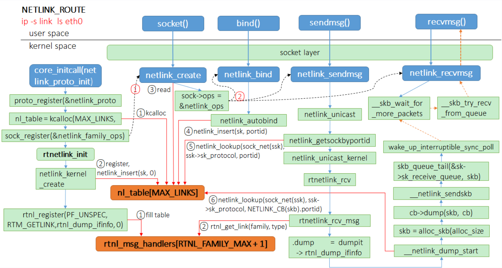
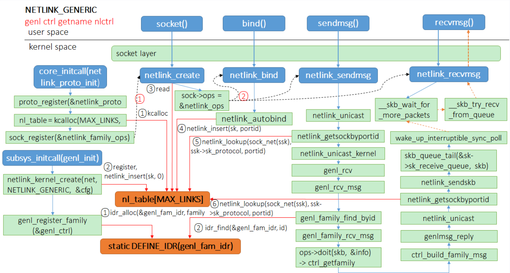

# Netlink 协议和 uevent 机制的作用原理与设计实现解析
> **Mentioned issue：#653: sysfs 支持 uevent**

主要工作目录：
- kernel/src/driver/base/uevent
- kernel/src/net/socket/netlink

## uevent 机制
> 关联：设备驱动模型

- uevent（ user space event）是 内核与用户空间的一种基于netlink机制通信机制，主要用于设备驱动模型，常用于设备的热插拔。

- uevent 是 kobject 的一部分，用于在 kobject 状态发生改变时，例如增加、移除等，通知用户空间程序。用户空间程序收到这样的事件后，会做相应的处理。
    >例如：U盘插入后，USB相关的驱动软件会动态创建用于表示该U盘的device结构（相应的也包括其中的kobject），并告知用户空间程序，为该U盘动态的创建/dev/目录下的设备节点；更进一步，可以通知其它的应用程序，将该U盘设备mount到系统中，从而动态的支持该设备。
- Uevent 是通过 Netlink 套接字发送的一些特殊格式的字符串。

uevent 的机制是比较简单的，设备模型中任何设备有事件需要上报时，会触发 uevent 提供的接口。uevent模块准备好上报事件的格式后，可以通过两个途径把事件上报到用户空间：
- 一种是通过 kmod 模块，直接调用用户空间的可执行文件；
- 另一种是通过 netlink 通信机制，将事件从内核空间传递给用户空间。

其中：

- `netlink` 是一种socket，专门用来进行内核空间和用户空间的通信；
- `kmod` 是管理内核模块的工具集，类似`busybox`，我们熟悉的`lsmod`，`insmod`等是指向`kmod`的链接。

### 工作原理
#### 设备事件生成：
当内核中的设备状态发生变化（如设备插入、移除或属性变化）时，内核会生成一个 uevent 事件。
通过 netlink 发送事件：
内核通过 netlink 套接字将 uevent 事件发送到用户空间。netlink 是一种用于内核和用户空间进程之间通信的机制。
#### 用户空间处理：
用户空间的进程（如 udevd 或其他监听 uevent 事件的进程）接收到 uevent 事件后，可以根据事件类型和内容执行相应的操作，如加载驱动程序、创建设备节点或更新设备配置。
#### 关键组件
##### sysfs：
sysfs 是一个虚拟文件系统，提供了内核对象的视图。设备的属性和状态可以通过 sysfs 文件系统进行访问和修改。
##### netlink：
netlink 是一种 IPC（进程间通信）机制，允许内核和用户空间进程之间进行双向通信。uevent 事件通过 netlink 套接字发送到用户空间。
##### uevent 文件：
每个设备在 sysfs 中都有一个 uevent 文件，当写入该文件时，可以触发 uevent 事件。

## Netlink 协议
Netlink 是 Linux 内核和用户空间之间进行通信的一种机制。它最初是为网络子系统设计的，但现在已经扩展到支持各种内核子系统。Netlink 提供了一种双向通信的方式，使得内核和用户空间进程可以相互发送和接收消息。

- 双向通信：
Netlink 支持内核和用户空间之间的双向通信，允许内核向用户空间发送消息，也允许用户空间向内核发送请求。
- 多种协议：
Netlink 支持多种协议，每种协议用于不同的内核子系统。例如，NETLINK_ROUTE 用于路由表和网络接口配置，NETLINK_KOBJECT_UEVENT 用于设备事件通知。
### Netlink 的工作原理
#### 创建 Netlink 套接字：
用户空间进程和内核模块都可以创建 Netlink 套接字，用于发送和接收 Netlink 消息。
#### 发送和接收消息：
用户空间进程可以通过 Netlink 套接字向内核发送请求，内核处理请求后通过 Netlink 套接字返回响应。
内核也可以主动向用户空间发送消息，通知用户空间某些事件的发生。
#### 消息格式：
Netlink 消息由消息头和消息体组成。消息头包含消息的元数据，如消息类型、消息长度等。消息体包含实际的数据。
#### 常见的 Netlink 协议
- NETLINK_ROUTE：用于路由表和网络接口配置。
- NETLINK_KOBJECT_UEVENT：用于设备事件通知（如设备插入、移除等）。
- NETLINK_GENERIC：通用的 Netlink 协议，可以用于自定义的内核和用户空间通信。
### 在用户空间使用 netlink 套接字和内核通信
在用户空间使用 netlink 套接字和内核通信，和传统的套接字有所区别。**相同的都是需要首先使用 socket 系统调用，创建用户空间套接字，不同的是内核也要创建对应的内核套接字，两者通过 nl_table 链表进行绑定**； nl_table 是 netlink 机制的核心数据结构，围绕此结构的内核活动有：

用户空间应用程序使用 **socket 系统调用**创建用户空间的套接字，然后在 **bind 系统调用**时，内核 **netlink_bind**函数将调用 netlink_insert (sk, portid) 将此用户态套接字和应用程序的进程 pid 插入 nl_table，这里参数 portid 就是进程 pid；
创建内核套接字时，调用 netlink_insert(sk, 0) 将此用户态套接字插入 nl_table（因为是内核套接字，这里 portid 是0）；
用户空间向内核发送 netlink 消息时，调用 netlink_lookup 函数，根据协议簇和 portid 在nl_table 快速查找对应的内核套接字对象；
当内核空间向用户空间发送 netlink 消息时，调用调用 netlink_lookup 函数，根据协议簇和 portid 在 nl_table 快速查找对应的用户套接字对象.

# 目前设计实现的具体方案
## trait 和 struct
- trait NetlinkSocket
- Struct NetlinkSock
- Struct NetlinkTable
Linux 6.1.9 中 hash 字段使用的是自己实现的 rhashtable，由于自己实现 rhashtable 以及相关接口比较繁杂，暂时使用了功能近似的 hashmap 替代。
- NL_TABLE: RwLock<Vec>
- Struct SkBuff
SkBuff 第一版实现，原本使用的是 smoltcp 库中的 PacketBuffer<'a> 封装，但由于生命周期标注的存在，会影响到上层很多其他结构的生命周期，并且由于缺少很多必要的 trait 和 属性，最终参照 aya_ebpf 的 __sk_buff 实现了现有的 SkBuff 。
- struct UeventSock
- struct nlmsghdr
- struct NetlinkBroadcastData
## function
- netlink_bind
- netlink_lookup
- kobject_uevent
- kobject_uevent_env
- uevent_net_broadcast_untagged
## 备注
### 相关讨论
inet没有实现网络协议族的操作集。https://code.dragonos.org.cn/xref/linux-6.1.9/include/net/sock.h#1230
### 对比Linux 6.1.9，未实现的部分功能
- struct Net：网络命名空间
### 未来拓展
netlink 协议族有其他的类别，例如 NETLINK_ROUTE 和 generic netlink
> classic netlink 还是 generic netlink？
generic netlink 使用 classic netlink 的API。generic netlink 是 netlink 的一种扩展，它支持1023个子协议号，弥补了 netlink 协议类型较少的缺陷。generic netlink 基于 netlink，但是在内核中，generic netlink 的接口与 netlink 并不相同。generic netlink 的API是通过netlink 的API来实现的，因此 generic netlink 使用 classic netlink 的API。
经典 Netlink 和通用 Netlink 之间的主要区别是子系统标识符的动态分配和自省的可用性。 在理论上，协议没有显著的区别，然而，在实践中，经典 Netlink 实验了通用 Netlink 中被放弃的概念(实际上，它们通常只在一个单一子系统的一小角落中使用)。