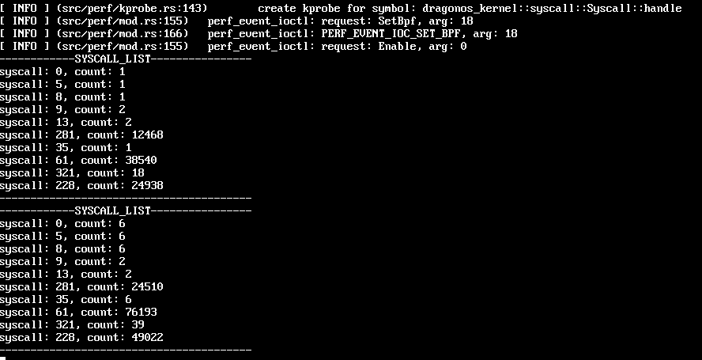
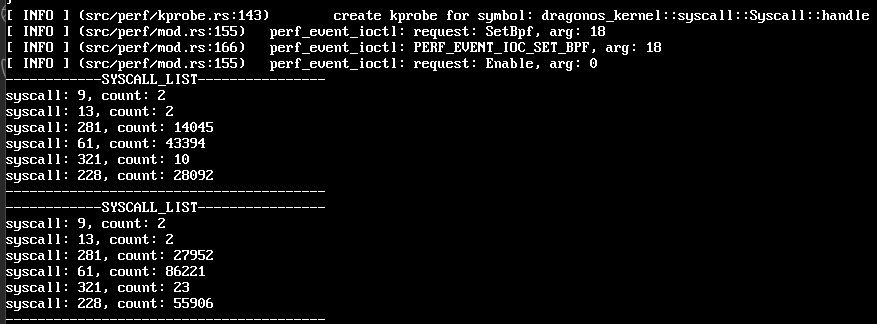
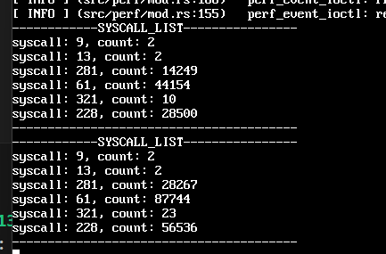
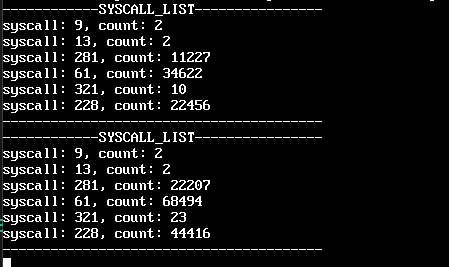

issue: https://github.com/DragonOS-Community/DragonReach/issues/46
目前dragonreach是单线程逻辑，主循环中主要处理以下事务：
```rust
// 启动完服务后进入主循环
loop {
    // 检查各服务运行状态
    Manager::check_running_status();
    // 检查cmd进程状态
    Manager::check_cmd_proc();
    // 检查计时器任务
    TimerManager::check_timer_task();
    // 监听systemctl
    Systemctl::ctl_listen();
}
```
主线程逻辑会一直循环，但是真正执行任务的时间很短，导致大量的cpu资源浪费。
需求：用更优雅的方式去处理主循环：
- 阻塞读命令管道
- 子进程状态以及计时器任务可以使用信号等机制优化

方案設計：
- 在主线程中使用多线程，阻塞读取命令管道，如此主线程就不是 IO 密集型，而是 CPU 密集型
- 用信号机制处理子进程状态以及计时器任务，减少一直遍历然后计算时间消耗的计算量
- 既然用信号机制处理了子进程状态和计时器任务，主线程中要使用多线程还是tokio协程呢？在这个场景中后者有什么好处吗？


1028
- 0: read 读取管道描述符文件
- 5: fstat 获取文件状态
- 8: lseek 文件定位
目标：单独开一个线程来处理命令管道，主线程只处理信号机制，这样主线程就不是 IO 密集型，而是 CPU 密集型
```rust
// 监听systemctl
        thread::spawn(move || {
            loop {
                // 监听systemctl
                Systemctl::ctl_listen();
                thread::sleep(Duration::from_secs(1));
            }
        });
```
test_ebpf 发现调用特别多的系统调用：
- 281: epoll_pwait，等待事件发生
- 61: wait4 多线程等待子进程结束（Manager::check_running_status()）
- 228: clock_gettime，获取时间ben

除了读命令管道那个会调用文件IO相关的0,5,8系统调用，还有检查各服务运行状态会调用很多 wait4 之外，281: epoll_pwait 和 clock_gettime 好像都不是 dragonreach 的原因？在主进程的loop中把这几个服务全注释了也有这两个系统调用的大量调用。


实验
1. 读取管道单独开一个线程，但是不加 thread::sleep(Duration::from_secs(1))，看看系统调用情况
```rust
// 监听systemctl
    thread::spawn(move || {
        loop {
            // 监听systemctl
            Systemctl::ctl_listen();
        }
    });
    // 启动完服务后进入主循环
    loop {
        // 检查各服务运行状态
        Manager::check_running_status();
        // 检查cmd进程状态
        Manager::check_cmd_proc();
        // 检查计时器任务
        TimerManager::check_timer();
    }
```
结果：test_ebpf 无响应

2. 读取管道单独开一个线程，加 thread::sleep(Duration::from_secs(1))，看看系统调用情况
```rust
// 监听systemctl
    thread::spawn(move || {
        loop {
            // 监听systemctl
            Systemctl::ctl_listen();
            // 等待一段时间
            thread::sleep(Duration::from_secs(1));
        }
    });
    // 启动完服务后进入主循环
    loop {
        // 检查各服务运行状态
        Manager::check_running_status();
        // 检查cmd进程状态
        Manager::check_cmd_proc();
        // 检查计时器任务
        TimerManager::check_timer();
    }
```
结果：

test_bpf是每五秒钟调用一次。每秒增加一次0,5,8的系统调用，说明每秒钟调用一次Systemctl::ctl_listen()，都调用了系统调用。

3. 读取管道单独开一个线程，加 thread::sleep(Duration::from_secs(1))，删除 size = 0的判断。

结果：

根本没有0,5,8的系统调用，说明Systemctl::ctl_listen()没有调用系统调用?

4. 去掉子线程中的loop
```rust
thread::spawn(move || {
        // 监听 systemctl
        Systemctl::ctl_listen();
    });
```
结果跟3一样，根本没有0,5,8的系统调用.

5. 去掉子线程中的loop，在函数中使用loop


6. 去掉子线程中的loop，在函数中使用条件变量



大量的61主要来自Manager::check_running_status();
281，228