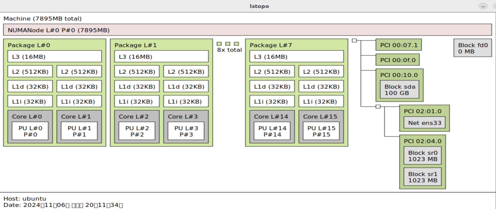
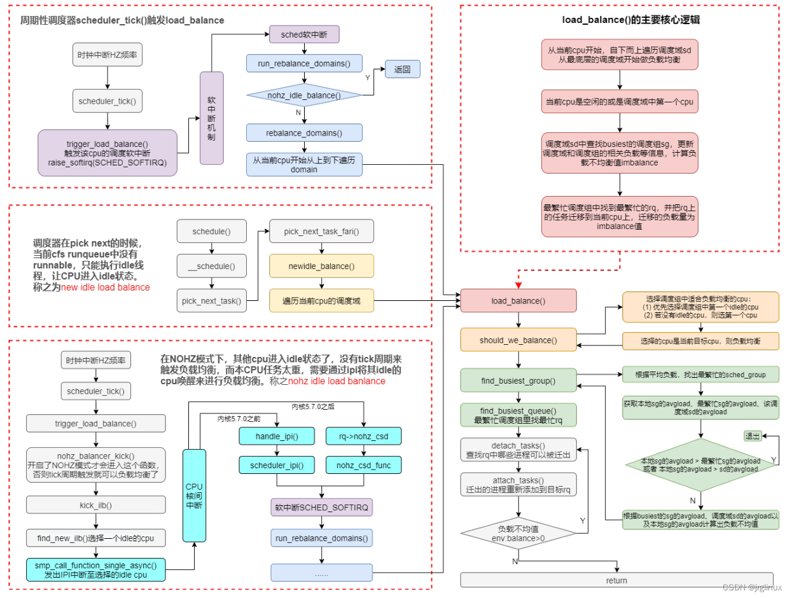
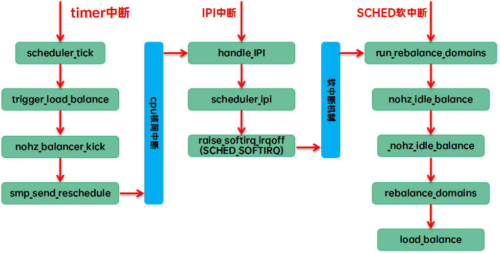

## 多级反馈队列 (MLFQ)
- 优先级高的任务先执行
- 优先级相同的任务按照时间片轮转（Round Robin）
- 新任务默认进入最高优先级队列
- 若任务再执行时配额用尽，则将其移动至下一级优先级队列。队列已用配额累计记录。
- 若任务在配额用尽前自愿放弃CPU，则保持在当前优先级队列
- 每隔一段时间，将所有任务移动至最高优先级队列
配额：任务在每个优先级队列中可以执行的时间片数量

## CFS (Completely Fair Scheduler)
"让系统里的多有进程尽可能公平地共享处理器"
- 为每个进程记录精确的运行时间
- 中断/异常发生后，切换到运行时间最少的进程执行
    - 下次中断/异常后，当前进程可能就不是运行时间最少的了
- Linux 的选择：通过红黑树实现
    - 键是进程的运行时间
    - 节点是进程
    - 左子树是运行时间更少的进程
    - 右子树是运行时间更多的进程
    - 根节点是运行时间最少的进程
- 优先级翻转
    - Linus："没法解决，CFS凑合用吧"

## IDLE

## 多处理器调度的挑战
既不能简单地分配线程到处理器，也不能简单地“谁空分给谁”
多处理器调度的两难境地：
- 迁移开销
- 不迁移可能导致负载不均衡

## 其他补充知识
lstopo - 查看系统拓扑结构

### 大小核（big.LITTLE）架构
- 一种异构多核处理器架构
- 由高性能核心（big）和低功耗核心（LITTLE）组成
- 旨在提供高性能和低功耗的平衡
- 例如，高性能核心用于运行计算密集型任务，低功耗核心用于运行轻量级任务

### NUMA（Non-Uniform Memory Access）
- 非一致性内存访问
- 每个处理器核心连接到一个或多个内存控制器
- 每个内存控制器管理一部分内存
- 处理器核心访问本地内存的延迟比访问远程内存的延迟低
- NUMA 架构旨在减少内存访问延迟，提高系统性能

### SMP（Symmetric Multiprocessor）
- 对称多处理器
- 一种多处理器系统架构
- 所有处理器核心共享同一内存
- 每个处理器核心可以访问所有内存区域
- SMP 架构旨在提高系统的整体性能和可伸缩性

### 什么是 per-CPU 变量？
在 Linux 内核中，per-CPU 变量（也称 per-processor 变量）是为每个 CPU 核心分配一份独立存储空间的变量。这种变量允许每个 CPU 核心拥有自己的拷贝，而不会与其他核心共享数据，避免了竞争条件和锁机制的开销，从而提升性能。

#### 核心特点
- 每个 CPU 有独立的变量实例：
  - 每个 CPU 都可以独立访问和修改自己的那份数据，而不需要担心其他 CPU 的干扰。
- 提高性能：
  - 避免了不同 CPU 之间的数据共享和锁定（如 spinlock），减少了访问开销。
- 适用于线程本地数据：
  - 用于存储与 CPU 密切相关的局部数据，例如中断计数、调度信息等。
- 自动分配和管理：
  - 使用专门的宏和函数进行声明和操作，内核会根据 CPU 核心数动态分配内存。

## 实现跨核负载均衡
### Per-Entity Load Tracking（PELT）
- 类型：负载跟踪机制，不是独立的调度算法，但用于多核调度。
- 原理：PELT负责追踪每个任务的负载情况，以帮助调度器（如CFS）实现多核环境中的合理分配。通过指数衰减追踪任务负载，PELT为每个任务计算出一个负载因子。
- 特点：PELT使得调度器在多核系统中动态评估任务负载，并协助负载迁移，从而实现更合理的核心利用。
- 局限：PELT只是负载追踪的一部分，而不是独立的调度算法，它通常在CFS等多核调度算法中被用到。

参考：
- https://lwn.net/Articles/531853/
- https://code.dragonos.org.cn/xref/linux-6.6.21/kernel/sched/pelt.c
- https://mp.weixin.qq.com/s/pNZ9I88cjwIuErfP74RSHg

TODO:
- __update_load_avg_blocked_se
- __update_load_avg_cfs_rq: 此函数用于更新 cfs_rq 的负载平均值，是PELT和CFS交互的重要接口。PELT需要实现负载更新逻辑，并在该方法中应用指数衰减和滑动窗口计算。
- __update_load_avg_se
- enqueue_entity() / dequeue_entity()：这些函数在任务进入或退出CFS调度队列时调用。PELT需要在这些函数中重新计算 sched_entity 的负载，将新任务的负载纳入调度队列的总负载中。好像已经完成了？
### CPU调度性能测试工具/程序
- GNU time + taskset
- perf
- top, htop

#### CPU 亲和性
CPU的亲和性，进程要在某个给定的 CPU 上尽量长时间地运行而不被迁移到其他处理器的倾向性，进程迁移的频率小就意味着产生的负载小。亲和性一词是从 affinity翻译来的，实际可以称为 CPU 绑定。

在多核运行的机器上，每个CPU本身自己会有缓存，在缓存中存着进程使用的数据，而没有绑定CPU的话，进程可能会被操作系统调度到其他CPU上，如此CPU cache（高速缓冲存储器）命中率就低了，也就是说调到的CPU缓存区没有这类数据，要先把内存或硬盘的数据载入缓存。而当缓存区绑定CPU后，程序就会一直在指定的CPU执行，不会被操作系统调度到其他CPU，性能上会有一定的提高。

另外一种使用CPU绑定考虑的是将关键的进程隔离开，对于部分实时进程调度优先级提高，可以将其绑定到一个指定CPU核上，可以保证实时进程的调度，也可以避免其他CPU上进程被该实时进程干扰。

我们可以手动地为其分配CPU核，而不会过多的占用同一个CPU，所以设置CPU亲和性可以使某些程序提高性能。

在Linux内核中，所有的进程都有一个相关的数据结构，称为 task_struct。这个结构非常重要，其中与 亲和性（affinity）相关度最高的是 cpus_allowed 位掩码。这个位掩码由 n 位组成，与系统中的 n 个逻辑处理器对应。 具有 4 个物理 CPU 的系统可以有 4 位。如果这些 CPU 都启用了超线程，那么这个系统就有8个位掩码。 如果为给定的进程设置了给定的位，那么这个进程就可以在相关的 CPU 上运行。因此，如果一个进程可以在任何 CPU 上运行，并且能够根据需要在处理器之间进行迁移，那么位掩码就全是 1。这是 Linux 中进程的预设状态!

Linux 内核 API 提供了一些方法，让用户可以修改位掩码或查看当前的位掩码，控制和绑定进程在特定的CPU：

- sched_set_affinity() （用来修改位掩码）
- sched_get_affinity() （用来查看当前的位掩码）
- cpus_allowed（用于控制进程可以在哪里处理器上运行）
- sched_setaffinity（用于某个进程绑定到一个特定的CPU）
###  CFS 工作流程（结合PELT）
- 任务创建：初始化 sched_entity，并通过 init_entity_runnable_average() 初始化PELT负载数据。
- 任务入队：通过 enqueue_entity() 将任务插入 cfs_rq，并在 update_load_avg() 中更新PELT的负载信息。
- 任务调度：通过 pick_next_entity() 选择最合适的任务。PELT提供的负载数据保证了调度公平性。
- 调度周期更新：在每个调度周期结束时，task_tick_fair() 会更新任务和调度队列的负载数据。
- 任务休眠/唤醒：通过 dequeue_entity() 和 enqueue_entity() 处理任务的休眠和唤醒，PELT继续追踪任务负载。
- 负载均衡：在多核系统中，load_balance() 使用PELT负载数据实现跨核心负载均衡。
- 任务完成：任务退出时通过 dequeue_entity() 清除 sched_entity 并更新负载。


### 跨核负载均衡的关键工作流程

在Linux的 CFS（Completely Fair Scheduler）中，跨核负载均衡的实现依赖于一系列关键函数。这些函数共同作用，在多核系统中对不同CPU核心上的任务进行监控、判断和迁移，从而实现动态、实时的负载均衡。Linux的跨核负载均衡功能主要通过调度器周期性地检查各核心的负载情况，并根据需要在核心之间迁移任务来达成。

以下是实现跨核负载均衡的几个关键函数：

1. `load_balance()`
- 作用：`load_balance()` 是整个跨核负载均衡过程的核心函数。它在调度器周期性触发的负载均衡活动中被调用，用于检查当前CPU的负载是否平衡，并在必要时将任务迁移到其他CPU。
- 工作原理：load_balance() 会遍历所有的调度队列（cfs_rq），查看各CPU上的负载情况，通过负载追踪（依赖PELT的 load_avg 值）来判断是否存在负载不均衡。一旦确定需要迁移任务，它会调用任务迁移相关函数来执行实际的负载均衡。
- 使用场景：该函数通常在某个CPU负载过高或过低时被调用，确保系统在运行过程中保持均衡的资源分配。
2. `find_busiest_group()`
- 作用：find_busiest_group() 是 load_balance() 的辅助函数，用于在负载均衡时找到负载最高的调度组（即CPU核心或CPU组），从而确定需要迁移任务的源CPU。
- 工作原理：该函数会遍历系统中的所有CPU组（如NUMA节点或逻辑CPU集群），计算每个组的总负载，并通过 load_avg 值来确定负载最高的组。它会根据负载和运行队列的信息，返回需要进行负载均衡的目标组。
- 使用场景：当某个CPU负载过高时，load_balance() 会调用 find_busiest_group() **找到适合迁移任务的高负载组**，从而缓解过载。
3. `find_busiest_queue()`
- 作用：find_busiest_queue() 是 find_busiest_group() 的辅助函数，用于**找到负载最高的调度队列（cfs_rq）或CPU**，从而进一步确定负载均衡的源队列。
- 工作原理：在找到负载最高的CPU组后，find_busiest_queue() 会在该组内的CPU之间比较每个CPU上的 cfs_rq 负载（通过 load_avg 值判断），并返回负载最高的队列。
- 使用场景：该函数在负载均衡的过程中用于精细化选择负载源，从而保证任务迁移的准确性。
4. `can_migrate_task()`
- 作用：can_migrate_task() 用于判断某个任务是否适合被迁移到另一个CPU核心上。
- 工作原理：该函数会检查任务的状态、CPU亲和性、调度策略等属性，确保只有符合迁移条件的任务才会被选中。对于某些高优先级或有特殊CPU亲和性的任务，can_migrate_task() 会阻止它们被迁移，以避免性能或响应时间的下降。
- 使用场景：在 load_balance() 中尝试迁移任务时，can_migrate_task() **被用于筛选可迁移的任务**，确保负载均衡过程中不影响系统稳定性或任务性能。
5. `move_queued_task()`
- 作用：move_queued_task() **负责将符合条件的任务从一个CPU的调度队列中移除，并加入到目标CPU的调度队列中，以完成实际的迁移操作**。
- 工作原理：该函数会对任务的调度实体（sched_entity）进行锁定，确保任务状态不发生冲突，然后将任务从源 cfs_rq 中移出，加入目标 cfs_rq。在PELT负载追踪的支持下，move_queued_task() 会更新任务的负载数据，以反映任务迁移后的负载变化。
- 使用场景：此函数在负载均衡的过程中被频繁调用，**用于在两个CPU核心之间执行任务的实际迁移**。
6. `update_sg_lb_stats()`
- 作用：update_sg_lb_stats() 用于**收集当前调度组的负载信息，并将这些信息用于负载均衡的决策**。
- 工作原理：该函数会遍历所有CPU的调度队列（cfs_rq），获取各个 cfs_rq 的负载和利用率数据。PELT的 load_avg 和 util_avg 值在这里被用作负载计算的主要依据，确保负载均衡决策基于实时数据。
- 使用场景：在 load_balance() 函数中用于初始化当前系统的负载统计数据，从而支持后续的负载均衡判断。
7. `rebalance_domains()`
- 作用：rebalance_domains() 是**跨核负载均衡的调度入口函数**，它**负责调用 load_balance() 和其他辅助函数**。
- 工作原理：该函数会遍历每个调度域（sched_domain），判断是否需要进行负载均衡。如果需要，它会调用 load_balance() 执行跨核负载均衡操作。rebalance_domains() **由调度器的定时器周期性触发，使得负载均衡成为一个周期性任务**。
- 使用场景：该函数是负载均衡的触发点，通常在定时器触发或特定事件发生时被调用。
8. `attach_entity_load_avg()` 和 `detach_entity_load_avg()`
- 作用：这些函数用于**在任务加入或移出调度队列时，更新调度实体（sched_entity）的负载数据。**
- 工作原理：
attach_entity_load_avg() 会将新任务的负载值加入到 cfs_rq 中，使目标CPU核心的调度队列负载信息得到更新。
detach_entity_load_avg() 则在任务迁出时将任务的负载数据从原调度队列中移除，防止原CPU核心的负载统计被错误计算。
- 使用场景：在任务迁移的过程中，attach_entity_load_avg() 和 detach_entity_load_avg() 确保源和目标 cfs_rq 的负载值实时更新，使得跨核负载均衡基于准确的负载数据。
#### 总结
跨核负载均衡的关键函数如下：
- rebalance_domains()：负载均衡的触发函数。
- load_balance()：负载均衡的主函数，负责平衡各核心负载。
- find_busiest_group()：找到负载最高的调度组。
- find_busiest_queue()：在调度组中找到负载最高的队列。
- can_migrate_task()：检查任务是否可迁移。
- move_queued_task()：执行任务的实际迁移。
- update_sg_lb_stats()：收集负载均衡的统计信息。
- attach_entity_load_avg() / detach_entity_load_avg()：更新任务迁移的负载数据。
这些函数在 PELT（负载追踪）的支持下，通过实时更新和统计各个CPU核心上的负载，使 CFS 调度器能够有效地实现多核系统中的跨核负载均衡。

### 跨核负载均衡的定时器任务

在Linux内核中，跨核负载均衡的定时器任务实际上是通过一个周期性触发的调度软中断（softirq）机制来实现的。具体来说，跨核负载均衡的触发是由调度器周期性 tick 定时器（也称为 sched_tick）驱动的，而 rebalance_domains() 函数通常是在这个定时器触发的上下文中被调用。

1. scheduler_tick() 函数
调度器的周期性 tick 定时器是由 scheduler_tick() 函数触发的，它负责周期性地为各个 CPU 核心运行负载均衡操作。

位置：scheduler_tick() 函数的定义位于 kernel/sched/core.c 文件中。
作用：scheduler_tick() 在每个时间片结束时触发，会调用与负载均衡相关的函数来判断是否需要重新平衡负载。
2. 调用 rebalance_domains() 的流程
scheduler_tick() 函数并不会直接调用 rebalance_domains()。而是通过 run_rebalance_domains() 函数来间接完成负载均衡。

具体流程：
scheduler_tick() -> trigger_load_balance() -> run_rebalance_domains()
其中，trigger_load_balance() 会检查当前 CPU 是否需要负载均衡，并在必要时触发 run_rebalance_domains() 执行。

3. run_rebalance_domains() 函数
位置：run_rebalance_domains() 的实现位于 kernel/sched/fair.c 文件中。
作用：这个函数负责实际调用 rebalance_domains() 来完成跨核负载均衡。
执行逻辑：run_rebalance_domains() 会遍历所有的 sched_domain（调度域），并对每个调度域调用 rebalance_domains() 函数来进行跨核负载均衡。
4. 定时任务的注册：sched_tick 和 NO_HZ 模式
在多核系统中，每个 CPU 核心都有自己的调度 tick 定时器来触发 scheduler_tick()。

5. 小结
跨核负载均衡的周期性触发机制由 scheduler_tick() 定时器驱动，通过 trigger_load_balance() -> run_rebalance_domains() -> rebalance_domains() 这一流程来完成周期性的负载均衡操作。这个过程通过调度 tick 定时器的触发而实现，确保每个 CPU 核心的负载能够在系统运行过程中保持均衡。


#### trigger_load_balance
```C
void trigger_load_balance(struct rq *rq)
{
	/*
	 * Don't need to rebalance while attached to NULL domain or
	 * runqueue CPU is not active
	 */
	if (unlikely(on_null_domain(rq) || !cpu_active(cpu_of(rq))))
		return;

	if (time_after_eq(jiffies, rq->next_balance))
		raise_softirq(SCHED_SOFTIRQ);

	nohz_balancer_kick(rq);
}
```

在kernel/sched/core.c中，trigger_load_balance()在每个CPU上通过scheduler_tick()周期执行。在当前运行队列下一个定期调度再平衡事件到达后，它引发一个软中断。负载均衡真正
的工作由run_rebalance_domains()->rebalance_domains()完成，在软中断上下文中执行（SCHED_SOFTIRQ）。

后一个函数有两个入参：当前CPU的运行队列、它在scheduler_tick()调用时是否空闲。函数会从当前CPU所在的基调度域开始迭代执行，并沿着parent指针链向上进入更高层级的调度域。在迭代
过程中，函数会检查当前调度域是否已经耗尽了再平衡的时间间隔，如果是，它在该调度域运行load_balance()。接下来它检查父调度域（如果存在），再后来父调度域的父调度域，以此类推。

起初，load_balance()查找当前调度域中最繁忙的调度组。如果成功，在该调度组管辖的全部CPU的运行队列中找出最繁忙的运行队列。如能找到，对当前的CPU运行队列和新找到的最繁忙运行
队列均加锁，并把任务从最繁忙队列中迁移到当前CPU上。被迁移的任务数量等于在先前迭代执行中计算出的该调度域的调度组的不均衡值。

&emsp;&emsp;当我们需要注册一个新的软中断时，需要为软中断处理程序实现`SoftirqVec`特征，然后调用`register_softirq`函数，将软中断处理程序注册到软中断机制内。

&emsp;&emsp;请注意，由于软中断的可重入、可并发性，所以软中断处理程序需要自己保证线程安全。

### 调度域和调度组
一个任务在小核cluster上的CPU之间的迁移所带来的性能开销一定是小于任务从小核cluster的CPU迁移到大核cluster的开销。因此，为了更好的执行负载均衡，我们需要构建和CPU拓扑相关的数据结构，也就是调度域和调度组的概念。

- 调度域
调度域是CPU拓扑中某一层级里面，与某个逻辑CPU关联（该CPU称为主权CPU）的所有逻辑CPU的集合。

- 调度组
某一层级调度域中所包括的下级实体（一个逻辑CPU的集合）。

- 调度域和调度组的区别
  - 调度域允许重叠交叉，调度组不允许重叠交叉。
  - 一个调度域包含一个或多个调度组，一个调度组从属于一个或多个调度域。
  - 同属于一个逻辑CPU的各级调度域通过parent/child指针组织成双向链表，同一级调度域的所有调度组通过next指针形成一个单向链表。

一句话概括：从一个主权CPU出发，该CPU在每个拓扑层级拥有一个调度域（每个调度域覆盖一个目标CPU集合），该调度域拥有若干个调度组（每个调度组包含一个目标CPU集合）。

调度域和调度组的设计主要是用于CPU负载均衡。

- CPU 负载均衡

CPU负载均衡的含义是最大化全局性能，使各个CPU的负载维持在一个基本相同的水平。
负载均衡的时候必然牵涉到进程迁移（从相对繁忙的逻辑CPU迁移到相对空闲的逻辑CPU），而进程迁移是有代价的，这种代价就是性能损失。逻辑CPU之间共享的资源越少，迁移的代价就越大。
也就是说，线程组内的迁移代价最小（共享流水线、高速缓存和内存通道），多核组内的迁移代价次之（共享高速缓存和内存通道），封装组内再次（共享内存通道），而跨NUMA节点的代价通常是很大的。

于是，负载均衡时优先考虑低级调度域内部的均衡（在同一级调度域的各个调度组之间比较负载，如果负载相差过大就迁移进程），然后再逐级往上用同样的方式操作每一级调度域，直到最终达到全局的负载均衡。
#### sched_domain 的设计与实现
https://code.dragonos.org.cn/xref/linux-6.6.21/Documentation/translations/zh_CN/scheduler/sched-domains.rst#37

要基于 PELT（Per-Entity Load Tracking） 实现负载均衡，一定需要先实现调度域 (sched_domain, 简称 sd)，因为：

调度域是负载均衡的基础逻辑单元：

- sched_domain 是 Linux 调度器中定义负载均衡范围的核心数据结构。
- PELT 作为任务负载追踪算法，其目标是为任务分配最合适的 CPU，而调度域提供了 PELT 算法执行的上下文（即在哪些 CPU 间进行任务迁移）。

负载均衡依赖调度域描述 CPU 拓扑结构：

- 调度器需要了解 CPU 的分组关系、共享资源（如缓存）和其他拓扑信息，而这些都是通过 sched_domain 来描述的。
- 没有 sched_domain，调度器无法知道 PELT 算法的负载均衡应该在什么范围内生效。

PELT 的数据统计和 sched_domain 配合：

- PELT 追踪每个任务的负载（如 CPU 使用率），并将这些负载聚合到每个 sched_group 和 sched_domain。
- 没有 sched_domain，负载无法在 CPU 间有效汇总，也无法决定在哪些 CPU 间迁移任务以实现均衡。

如何结合 sched_domain 和 PELT 实现负载均衡？

实现负载均衡主要包含以下关键步骤：

1. 构建调度域 (sched_domain)
   - 根据硬件拓扑创建调度域层次结构：
     - 顶层调度域覆盖整个系统的所有 CPU。
     - 中间层和底层调度域覆盖共享缓存或 NUMA 节点内的 CPU。
   - 调用 sched_init_domains() 初始化所有调度域。

2. 使用 PELT 追踪负载
   - PELT 是 Linux 调度器中用于计算任务负载的主要算法。
   - 每个任务（task_struct）和 CPU 运行队列（rq）都有一个负载统计值，定期通过 PELT 更新。
   - PELT 的核心是指数衰减算法，可快速反映负载的变化趋势。
   - 在每次调度时更新任务和运行队列的 PELT 值。

3. 执行负载均衡
   - 基于 PELT 数据和调度域信息，决定是否需要迁移任务：
     - 负载计算：通过 PELT 聚合每个 CPU 的负载，计算调度组或调度域的负载不均衡程度。
     - 迁移决策：选择负载高的 CPU，尝试将任务迁移到负载低的 CPU。
   - 核心函数包括：
     - load_balance(): 在调度域内执行负载均衡逻辑。
     - find_busiest_group() 和 find_idlest_group(): 查找负载最高和最低的调度组。

4. 集成 NoHZ 和 CFS（完全公平调度器）
   - 在支持 NoHZ 模式（某些 CPU 不处理定时中断）的情况下，需要使用 sched_domain 数据来唤醒相关 CPU 进行负载均衡。
   - 与 CFS 的深度集成，使用 PELT 和调度域信息优化任务的分配。

实现建议

先实现调度域 (sched_domain) 的基础功能：

- 定义 CPU 的分组和层次结构。
- 确保 sched_domain 数据结构的基本功能完整，比如父子域连接和 CPU 覆盖范围。

结合 PELT 数据：

- 确保每个运行队列的负载数据通过 PELT 正确更新。
- 在 rq 和任务的 PELT 数据上增加调试代码，验证负载更新是否符合预期。

逐步实现负载均衡逻辑：

- 从简单的均匀分配开始，在低层调度域（如共享缓存）测试迁移逻辑。
- 扩展到高层调度域（如 NUMA 节点间）。
### 周期性负载均衡
周期性负载均衡（periodic load balance或者tick load balance）是指在tick中，周期性的检测系统的负载均衡状况。周期性负载均衡是一个自底向上的均衡过程。即从该CPU对应的base sched domain开始，向上直到顶层sched domain，在各个level的domain上进行负载均衡。具体在某个特定的domain上进行负载均衡是比较简单，找到domain中负载最重的group和CPU，将其上的runnable任务拉到本CPU以便让该domain上各个group的负载处于均衡的状态。由于Linux上的负载均衡仅支持任务拉取，周期性负载均衡只能在busy cpu之间均衡，不能把任务push到其他空闲CPU上，要想让系统中的idle cpu“燥起来”就需要借助idle load balance。


#### 找出最繁忙的调度组
这个表格描述了在不同情况下，调度器如何进行负载均衡决策。表格的行和列分别表示 

- **行**：表示 local group
- **列**：表示 busiest group


- 状态解释
  - **Has spare**：有空闲资源。
  - **Fully busy**：完全忙碌，没有空闲资源。
  - **misfit**：不匹配的任务，可能需要强制迁移。
  - **imbalanced**：不平衡，需要进行负载均衡。
  - **overloaded**：过载，需要强制迁移任务。

- 决策解释
  - **Nr idle**：不需要进行负载均衡，因为有空闲资源。
  - **balanced**：系统已经平衡，不需要进行负载均衡。
  - **force**：强制进行负载均衡，迁移任务以达到平衡。
  - **Avg load**：根据平均负载进行负载均衡。

|                | Has spare | Fully busy | misfit | imbalanced | overloaded |
|----------------|-----------|------------|--------|------------|------------|
| **Has spare**  | Nr idle   | balanced   | N/A    | balanced   | balanced   |
| **Fully busy** | Nr idle   | Nr idle    | N/A    | balanced   | balanced   |
| **misfit**     | force     | N/A        | N/A    | force      | force      |
| **imbalanced** | force     | force      | N/A    | force      | force      |
| **overloaded** | force     | force      | N/A    | force      | Avg load   |

### 参考
http://www.wowotech.net/process_management/load_balance_function.html