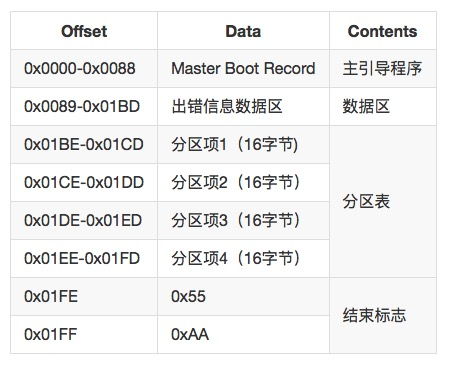

# 什么是块设备
https://olegkutkov.me/2020/02/10/linux-block-device-driver/
## 块设备vs字符设备
字符设备：以字符为单位进行I/O操作，如键盘、鼠标、串口等
块设备：以块为单位进行I/O操作，如硬盘、U盘等

- 读写单元：字符设备是字节流，块设备是块
- 访问方式：字符设备是顺序访问，块设备是随机访问
- 缓存：字符设备不缓存，块设备缓存
##  设备驱动
设备驱动表
## 磁盘分区
MBR和GPT都是硬盘分区表，在硬盘分区表之后才是我们日常使用的文件系统比如NTFS，FAT32，EXT等。虽然现在MBR已经是一个不常用的硬盘分区表了，但是GPT为了兼容老的硬盘分区表所以在GPT的结构头部加入了MBR。

### MBR的组成
硬盘首一个扇区存放MBR表，由4个部分组成，分别是主引导记录(Master Boot Record)、数据区、分区表（包含4个分区项）以及结束标志。

在下面表格中展示了这4个部分的偏移位置和简介:

- Master Boot Record 是硬盘分区表的引导程序和数据区，一共占用446个字节，BIOS 读取并执行这段代码，如果被破坏系统就无法读取到硬盘上的数据导致，系统无法启动。
- 结束标识是MBR的结束位，如果错误就会读取出错。
### MBR的限制
MBR存储数据在4个分区上，这些分区称为主分区。分区采用“柱面/磁头/扇区”标记法，即CHS标记法。前面的结构体中beghead、begsect、begcyl分别表示分区起始的磁头、扇区和柱面，endhead、endsect、endcyl分别表示分区结束的磁头、扇区和柱面。每个扇区的大小是512B，因此它最多只能描述8G的磁盘区域。

>有使用MBR分区经验的同学可能会觉得奇怪，怎么会只能表示8G? 实际装系统分区的时候，明明轻轻松松分出了一个几百G的分区啊。这是因为，现代的BIOS对超过8G的磁盘使用LBA模式，对于超出的部分，CHS值通常设为0xFEFFFF，并加以忽略，直接使用Offset 0x08-0x0c的4字节相对值，再进行内部转换。
但是LBA用relsect(32位)来描述起始扇区号，relsect + numsect表示结束扇区号，由于都是用32位数寻址导致整个硬盘大小不能超过2TB个数据。

除了这个2TB问题之外，MBR 还有其他困难。主要困难是4个主分区的限制。要克服这个限制，可能的方法是将一个主分区放到一边，作为一个占位符（称为扩展分区），用于容纳任意数量的附加分区（称为逻辑分区）。
MBR 还有数据完整性问题。它是一个单一数据结构，容易受到误操作和磁盘故障的损坏。另外，由于逻辑分区以一种链接表结构定义，如果一个逻辑分区损坏，就会阻止对剩余的逻辑分区的访问。
### GPT的组成

# code review
