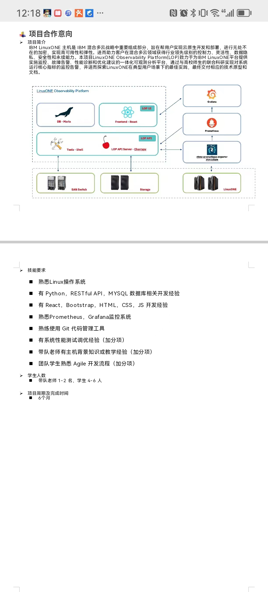
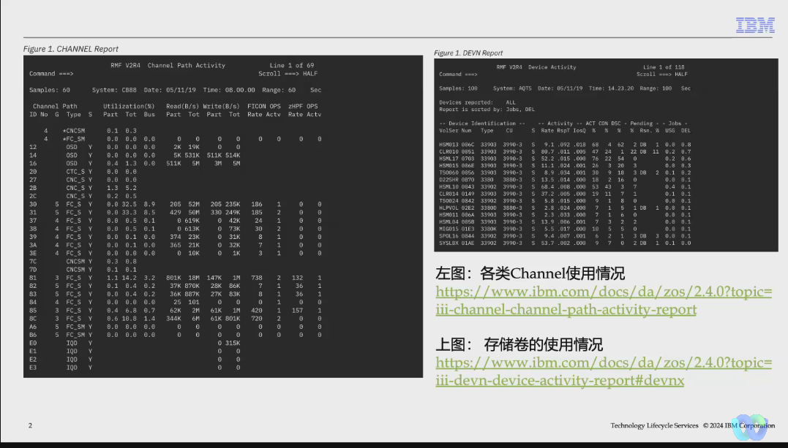
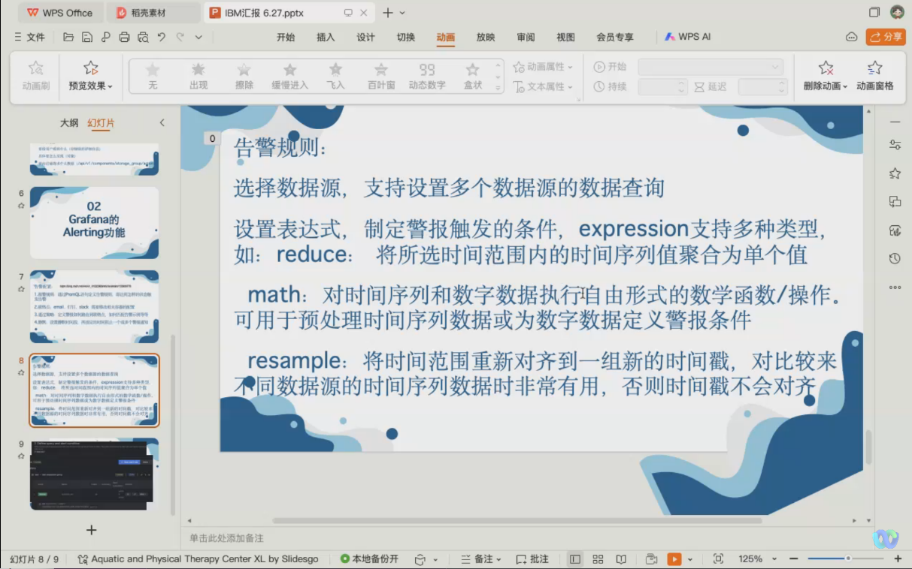
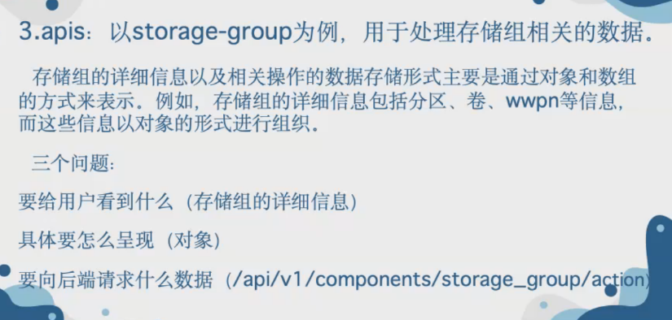

# 技术栈要求
- Linux
- Python, Restful API,MySQL数据库相关
- React, bootstrap, HTML, CSS, JavaScript前端三件套
- prometheus, grafana
- git
- 系统测试调优
- 敏捷开发流程
# 会议记录
## 第一周线下会议

机会难得，适应企业节奏（企业不放假），要求有进度。

PPT或者视频汇报。

### 线上会议
介绍ibm的老师：

tina 团队

hardware

optimization

何磊，朱华，来自TLS团队。针对用户售后服务。运维等。

谢强老师：技术上的问题可以问谢强。

何雷，joes：
技术服务部，解决方案总监。
之前十年在软件开发中心工作。2020转技术服务团队。

朱华老师：
技术服务团队。Linuxone，监控的方面，虚拟化。各个不同的层次把需求理清楚。

江南老师：
IT团队，开发中心和信息中心的运维。监控方面和监控工具相关的团队可以问江南老师。

陈沁悦老师：
主机性能相关的工作。
开发测试方面的问题可以问陈沁悦老师。

李敬喆老师：

zbrink团队：ljz，tina，llj；

### 项目介绍
#### 项目总体
项目名称：linuxone可观测平台

客户没有观测和报警的系统。

使用的时候，并没有很好的调优的指导意见。

重要的运行时指标进行检测，提供手段进行设置边界条件，告警。

deliver：
- 可观测。可靠性。
- 指标分析，给出用户比较合理的调优建议

项目架构：

- 系统边界：Linuxone可观测平台
- 采集指标给到prometheus，prometheus给到grafana。
- 前端可以集成grafana。
- 如果取出来的数据，并不能完全满足要求，需要获取存储端（存储交换机和存储本身）的数据，使用shell再去获取数据。进行分析。
- 通过把采集的指标训练一个模型。（附加）项目开始的时候可以同步展开。

#### 指导老师的侧重：
- 前端：谢强
- 后端：李敬喆
- 可观测：江南

#### 用户需求和痛点：
朱华：

靶子：airpart 虚机的监控已经比较成熟，我们需要的是物理机的监控。

数据是存在的，怎么去找到。

监控的是最底层的物理卡。逻辑连接，端到端映射模型。物理机和虚机之间的关系，怎么去映射起来，这个是第二层。

对于设备、channel 的监控还是比较欠缺。

#### 分组
先分组学习，学长们准备环境，都准备好了之后就可以开始开发。

##### 前端开发 - 2+1人
任务：根据业务需求完成前端页面设计开发工作，完成项目验收展示视频制作（中期后期两个）
技能：Git、React、Docker、Nginx

##### 后端开发 - 2+1人
任务：为前端提供 RestfulAPI 服务，与 Prometheus、Grafana交互获取数据并分析
技能：Git、Python（CherryPy 框架）、Docker、Mariadb、Prometheus、Grafana

##### AI 算法 - 2+1人
任务：调研当下 AIOps 领域的预测、数据分析解决方案，寻找适合模型及训练方法
技能：Git、拥有训练模型、调整模型参数的经验

#### 任务
前端组：
任务1 了解下什么是 restful API。参考： https://restfulapi.net/
任务2 学习React框架，完成一个helloworld页面。参考： https://react.docschina.org/
任务3 学习编译React工程，并将编译结果部署在Nginx中启动。

后端组：
任务1 了解下什么是 restful API。参考： https://restfulapi.net/
任务2 学习使用框架cherrypy，利用框架在本机完成一个helloworld的api接口。参考：https://cherrypy.dev/
任务3 学习使用apidoc为自己的接口生成文档。参考：https://apidocjs.com/

AI组：从两个方面逐步清晰我们的目标
任务1、调研在AIOps中，通常可以对哪些东西预测，输入是什么，如何预测，输出是什么。抛砖引玉：https://segmentfault.com/a/1190000041851035?utm_source=sf-similar-article
任务2、调研哪些产品在预测这里做的比较好

下周汇报学习进展
## 第二周汇报
- 加强沟通
- 看源码
## 第三周汇报
前端组Q：A主机的node_exporter，不能联通B机器的Prometheus？
改变配置，指向B机器的Prometheus。

虚拟机网络复杂可能要配置一下Prometheus的配置文件 防火墙、selinux要关闭

谢强老师(前端)：
- 前后端后面需要talk关于api
- axios
- ant-design组件库
- dockerfile打包成../image/image发布
- mock数据

## 第四周考试停工
## 第五周汇报
- ljy：警告信息返回流程，根据模板生成警告信息
- frt：构建看板监控数据，找到指标
    - CPC维度
    - Partition维度 
    - Network维度
    - 磁盘和磁盘IO？
    - 反馈：改善数据的展示，数据的展示要更加直观，把这些指标找到合理的组织方式
- hyk：utils
- dyr：告警规则
    
    

- api协同
- 目前还没有详细的需求，前端同学的工作重点是方法论，形而上

## 第六周汇报
后端：
- ljy：slack bot
- hyk：prometheus util
- ylw：adapter view
前端：
- frt：grafana 面板嵌入前端
- dyr：grafana接口获取
- zzx：后端接口调用
AI：
- 算法demo
## 第七周
后端
ljy：
- 模板表
- 增删改查
- 模糊搜索
hyk：
- 获取指定指标下某个属性的值
- message controller
ylw：
- CPC/Adapter view
- Adapter/Partition view
前端
frt：
- 用户过滤选择
- 分享 grafana view 的具体设置
dyr：
- 页面的色彩元素啥的，后续需要替换为 IBM 现有的产品搭配
zzx：
- message page
- 封装后端API提供给其他前端组员

AI：
模型训练，得到一系列参数文件在目录下；
预测的过程中一段时间后workload如果总是偏移，已经不适合了，那么拿着最新的值再去训练，参数覆盖，重新加载模型
如果偏移超出容忍值，自动触发训练覆盖模型，重新加载模型

## 第八周
参考开源套件：alter-manager

## 项目结束总结
后续项目推荐：
- 华为合作大型工业软件
    - 工业课程
    - 数据平台iDME开发、应用
    - 实训
- 学校大数据教研项目
    - 编写教材
    - 案例应用
- 谷歌技术栈项目
    - 每年6月份，以学生为主导的申请
    - 使用谷歌的开源项目开发应用，提前准备
    - 经费，每个项目 2w
- srp
    - 中文歧义理解
    - 数据集构造，大模型评测
- 许可老师的实验室个性化推荐项目
    - 心理学结合，好奇心对于个性化推荐的影响
    - 数据挖掘顶刊TKDE
    - 结合对比学习，CPR，类似BPR