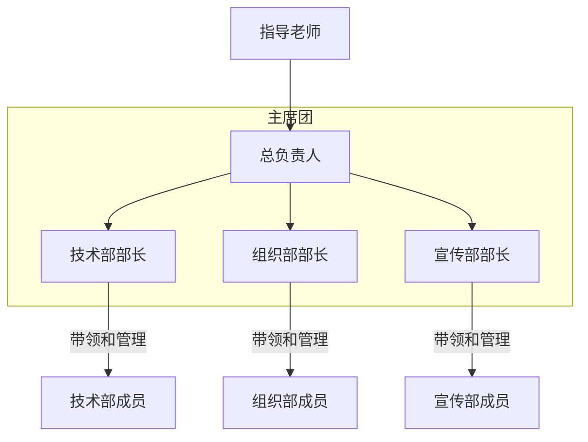
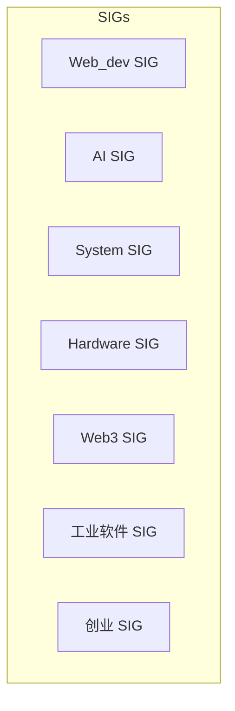

## 俱乐部简介
todo!()
## 俱乐部组织架构

### 职能介绍
>职能只是锻炼和发挥你长处的机会，无论是否有职务，大家都有同等机会享受俱乐部的资源，但相对来说对于俱乐部的发展更重要。

下分三个部门，技术部、宣传部和组织部。每个部门有**1到2位部长**，**5到6个成员**。招新总人数15人左右，可以小范围增加。
- **技术部**
技术部致力于提升俱乐部内部的整体技术水平。负责组织开展俱乐部内部的技术交流活动。包括但不限于**开展内部的技术交流活动，组织项目组队，举办内部比赛，打卡沙龙**等内容的组织和策划。
- **宣传部**
宣传部致力于让俱乐部在软件学院打响名声。负责俱乐部的**内外宣传，包括海报，推文，物料等的制作，以及公众号的运营等**。
- **组织部**
组织部致力于让俱乐部的组织建设，让俱乐部的**重大活动**都能圆满举行。负责俱乐部内外的大小活动的组织，例如**团建筹划，招新筹备，邀请校外合作企业的老师或者组织开展讲座活动**等。
## SIG 制度
在俱乐部中引入**SIG（Special Interest Group，特别兴趣小组）制度**，允许成员自由选择加入特定的兴趣小组。

### SIG 的组织形式
由于 SIG 的形式比较自由，同时分类可能较多，每个SIG设置群聊可能会造成人员重叠过多、组织管理冗余以及冷场的局面。所以 SIG 不单独设置群组，建议将后面提到的**博客沙龙或者每周技术报告**作为 SIG 的常态化形式。
## 目前的活动建议
- **博客沙龙**
技术积累对于一位学习者来说是非常重要的。每周挑选一道两篇同学所写的优秀技术博客(可以是课外技术知识，也可以是学校课程某个章节整理的笔记等)进行分享，并记入贡献榜中。

- **每周技术报告**
为了培养大家的科技前沿嗅觉和优秀的学习习惯，可以考虑建立一个轮流制度，每周每个 SIG 都要内部组织收集本周该SIG对应的相关热点新闻、技术趋势或者技术、知识理论帖子的链接和总结，组织成简报的形式发表，并记入贡献榜中。

> 上述分享渠道可以是微信群、公众号或者官网（待上线）。

- **算法题能力提升**
组织算法题周赛或者刷题打卡活动，设立奖励机制，调动积极性

- 百步梯项目立项等

## 关于往届成员的参与
以上新的组织架构是主要是面向当前在读的大一大二年级的同学，但是SIG比较自由，更多的大三大四乃至毕业的俱乐部成员，欢迎选择加入我们 SIG 成为**技术顾问或者作为俱乐部的 SIG 普通成员**继续参与我们的日常活动，给予我们指导和建议，建立持久的友谊。如果你们正在创业需要宣传、招人或者有就业的学长学姐有任何内推消息、行业经验等都欢迎在群里发布。

### 贡献记录制度
我们希望把历届成员的贡献和风采记录在官网展示，来让大家了解我们的社团历史和发展。