# 前置工作
## 环境配置
### Prometheus+Grafana
环境：Ubuntu 22.04
- 参考：
    https://www.jianshu.com/p/8d2c020313f0
    https://www.cnblogs.com/crazymakercircle/p/16768535.html
    https://blog.csdn.net/qq_31725371/article/details/114697770
#### Prometheus 安装
https://prometheus.io/download/
#### Grafana 安装
https://grafana.com/grafana/download
#### exporter 安装
- node_exporter为例
    https://github.com/prometheus/node_exporter/releases/tag/v1.8.0

#### tips
如果Grafana是用docker安装的，prometheus是在本地环境中直接安装的话，添加数据源时，prometheus的地址不能直接填写`http://localhost:9090`，需要填写本机的ip地址，因为docker中的Grafana是一个独立的容器，localhost指的是容器内部的地址，而不是本机的地址。同理如果prometheus也是在docker中安装的，那么也需要填写docker的ip地址。


如果都安装在本地上，那么直接使用localhost:9090即可（Prometheus运行在9090，node_exporter 运行在9100，Grafana运行在3000）

## Prometheus使用
参考：https://zhuanlan.zhihu.com/p/351995351
## Grafana使用
官方教程：https://grafana.com/tutorials/?utm_source=grafana_gettingstarted


# 每周学习/开发报告
## 第一周
后端组：
- 任务1 了解下什么是restful API。参考： https://restfulapi.net/
- 任务2 学习使用框架cherrypy，利用框架在本机完成一个helloworld的api接口。参考：https://cherrypy.dev/
- 任务3 学习使用apidoc为自己的接口生成文档。参考：https://apidocjs.com/
### 什么是restful API
RESTful API 是一种设计风格，用于构建 Web 服务。REST 是 Representational State Transfer 的缩写，它是一种设计风格，用于构建 Web 服务。RESTful API 是基于 REST 架构设计的 API，它使用 HTTP 请求来进行通信，并遵循 REST 的设计原则。

RESTful API 的设计原则包括以下几点：

- 使用 HTTP 方法（GET、POST、PUT、DELETE）来操作资源。
- 使用 URL 来标识资源。
- 使用 JSON 或 XML 格式来传输数据。
- 使用状态码来表示请求的结果。

RESTful API 的优点包括：

- 简单：RESTful API 使用 HTTP 方法来操作资源，使得 API 的设计更加简单。
- 易于理解：RESTful API 使用 URL 来标识资源，使得 API 的使用更加直观。
- 易于扩展：RESTful API 使用 JSON 或 XML 格式来传输数据，使得 API 的扩展更加容易。
- 易于测试：RESTful API 使用状态码来表示请求的结果，使得 API 的测试更加简单。

RESTful API 的缺点包括：

- 缺乏标准：RESTful API 没有统一的标准，使得 API 的设计更加随意。
- 缺乏安全性：RESTful API 没有内置的安全机制，使得 API 的安全性更加脆弱。
- 缺乏性能：RESTful API 使用 HTTP 协议来通信，使得 API 的性能更加有限。
### cherrypy
官方仓库的tutorials：https://github.com/cherrypy/cherrypy/blob/main/docs/tutorials.rst
- 安装
    ```shell
    pip install cherrypy
    ```
- 示例代码
    ```python
    import cherrypy

    class HelloWorld(object):
        @cherrypy.expose
        def index(self):
            return "Hello World!"

    cherrypy.quickstart(HelloWorld())
    ```
- 运行
    ```shell
    python helloworld.py
    ```

`cherrypy`是一个Python库，用于创建Web应用程序。它是一个最小主义的框架，提供了HTTP服务器和一个路由系统。

在helloworld.py中，`cherrypy`做了以下几件事：

1. 提供了一个装饰器`@cherrypy.expose`，这个装饰器用于将Python函数公开为Web应用程序的一部分。在你的代码中，`index`函数被公开，当用户访问应用程序的根URL（例如`http://localhost:8080/`）时，将调用此函数。

2. 提供了一个函数`cherrypy.quickstart`，用于启动Web应用程序。在你的代码中，这个函数

#### 用py编写一个简单的restful API
```python
# api.py
import cherrypy

# 创建一个图书类，用于模拟数据库中的数据
class Book:
    def __init__(self, title, author, id=None):
        self.id = id
        self.title = title
        self.author = author

    # 用于检索图书的方法
    @classmethod
    def get_book_by_id(cls, id):
        # 在实际应用中，这里会是查询数据库的地方
        books = [book for book in ALL_BOOKS if book.id == id]
        return books[0] if books else None

    # 用于获取所有图书的方法
    @classmethod
    def get_all_books(cls):
        return ALL_BOOKS

    # 用于添加图书的方法
    def save(self):
        ALL_BOOKS.append(self)
        return self

    # 用于删除图书的方法
    def delete(self):
        ALL_BOOKS = [book for book in ALL_BOOKS if book.id != self.id]
        return self

# 模拟数据库中所有的图书记录
ALL_BOOKS = []

# 创建一个RESTful API来处理图书信息的CRUD操作
class LibraryAPI(object):
    @cherrypy.expose
    def index(self):
        return "This is a simple RESTful API for managing books."

    @cherrypy.expose
    @cherrypy.tools.json_out()
    def get_books(self):
        return Book.get_all_books()

    @cherrypy.expose
    @cherrypy.tools.json_in()
    @cherrypy.tools.json_out()
    def post_books(self):
        book_data = cherrypy.request.json
        new_book = Book(book_data['title'], book_data['author'])
        return new_book.save()

    @cherrypy.expose
    @cherrypy.tools.json_in()
    @cherrypy.tools.json_out()
    def put_books(self, id):
        book = Book.get_book_by_id(id)
        if book is None:
            raise cherrypy.HTTPError(404, "Book not found")
        book_data = cherrypy.request.json
        book.title = book_data['title']
        book.author = book_data['author']
        return book.save()

    @cherrypy.expose
    @cherrypy.tools.json_out()
    def delete_books(self, id):
        book = Book.get_book_by_id(id)
        if book is None:
            raise cherrypy.HTTPError(404, "Book not found")
        return book.delete()

# 设置CherryPy服务器
if __name__ == '__main__':
    cherrypy.config.update({'server.socket_host': '0.0.0.0',
                            'server.socket_port': 8080})
    cherrypy.quickstart(LibraryAPI())
```
这段代码创建了一个简单的RESTful API，包含以下端点：

``` js
GET /books：获取所有图书的信息。
POST /books：添加一本新书到数据库。
PUT /books/<id>：更新指定ID的图书信息。
DELETE /books/<id>：删除指定ID的图书。
```

要运行这个API，只需要执行以下命令：
```shell
curl http://localhost:8080/books
```

#### tutorials
##### Tutorial 4: Submit this form
如何处理HTML表单
```python
import random
import string

import cherrypy


class StringGenerator(object):
    @cherrypy.expose
    def index(self):
        return """<html>
          <head></head>
          <body>
            <form method="get" action="generate">
              <input type="text" value="8" name="length" />
              <button type="submit">Give it now!</button>
            </form>
          </body>
        </html>"""

    @cherrypy.expose
    def generate(self, length=8):
        return ''.join(random.sample(string.hexdigits, int(length)))


if __name__ == '__main__':
    cherrypy.quickstart(StringGenerator())
```
##### Tutorial 5: Track my end-user's activity
代码30-34展示了如何在CherryPy应用程序中启用会话支持。默认情况下，CherryPy将在进程的内存中保存会话。它还支持更持久的会话存储方式。
```python
import random
import string

import cherrypy


class StringGenerator(object):
    @cherrypy.expose
    def index(self):
        return """<html>
          <head></head>
          <body>
            <form method="get" action="generate">
              <input type="text" value="8" name="length" />
              <button type="submit">Give it now!</button>
            </form>
          </body>
        </html>"""

    @cherrypy.expose
    def generate(self, length=8):
        some_string = ''.join(random.sample(string.hexdigits, int(length)))
        cherrypy.session['mystring'] = some_string
        return some_string

    @cherrypy.expose
    def display(self):
        return cherrypy.session['mystring']


if __name__ == '__main__':
    conf = {
        '/': {
            'tools.sessions.on': True
        }
    }
    cherrypy.quickstart(StringGenerator(), '/', conf)
```
##### Tutorial 7: Give us a REST
一个非常基本的遵循 REST 原则的 Web API 示例
```python
import random
import string

import cherrypy


@cherrypy.expose
class StringGeneratorWebService(object):

    @cherrypy.tools.accept(media='text/plain')
    def GET(self):
        return cherrypy.session['mystring']

    def POST(self, length=8):
        some_string = ''.join(random.sample(string.hexdigits, int(length)))
        cherrypy.session['mystring'] = some_string
        return some_string

    def PUT(self, another_string):
        cherrypy.session['mystring'] = another_string

    def DELETE(self):
        cherrypy.session.pop('mystring', None)


if __name__ == '__main__':
    conf = {
        '/': {
            'request.dispatch': cherrypy.dispatch.MethodDispatcher(),
            'tools.sessions.on': True,
            'tools.response_headers.on': True,
            'tools.response_headers.headers': [('Content-Type', 'text/plain')],
        }
    }
    cherrypy.quickstart(StringGeneratorWebService(), '/', conf)
```

We use the Session interface of requests so that it takes care of carrying the session id stored in the request cookie in each subsequent request. That is handy.
我们使用 requests 的 Session 接口，这样它会在每个后续请求中负责携带存储在请求 Cookie 中的会话 ID。这很方便。

使用python客户端进行web api测试，而不是浏览器。这是因为浏览器只支持GET和POST请求，而我们的API还支持PUT和DELETE请求。
```shell
>>> import requests
>>> s = requests.Session()
>>> r = s.get('http://127.0.0.1:8080/')
>>> r.status_code
500
>>> r = s.post('http://127.0.0.1:8080/')
>>> r.status_code, r.text
(200, u'04A92138')
>>> r = s.get('http://127.0.0.1:8080/')
>>> r.status_code, r.text
(200, u'04A92138')
>>> r = s.get('http://127.0.0.1:8080/', headers={'Accept': 'application/json'})
>>> r.status_code
406
>>> r = s.put('http://127.0.0.1:8080/', params={'another_string': 'hello'})
>>> r = s.get('http://127.0.0.1:8080/')
>>> r.status_code, r.text
(200, u'hello')
>>> r = s.delete('http://127.0.0.1:8080/')
>>> r = s.get('http://127.0.0.1:8080/')
>>> r.status_code
500
```
##### Tutorial 9: Data is all my life
作为教程，为了简单起见，选择Python直接支持的数据库—— sqlite

>不幸的是，Python中的sqlite不允许我们在多线程之间共享连接。由于CherryPy是一个多线程服务器，因此这会成为一个问题。这就是为什么我们在每次调用时都会打开和关闭数据库连接的原因。这显然并不真正适合生产环境，最好还是使用更可靠的数据库引擎或更高级的库，如SQLAlchemy，以更好地满足应用程序的需求。

我们的应用程序将把会话中生成的字符串存储到SQLite数据库中。该应用程序将具有与 tutorial 08 <tut08> 相同的HTML代码。因此，让我们仅关注应用程序本身的代码.
```python
import os, os.path
import random
import sqlite3
import string
import time

import cherrypy

DB_STRING = "my.db"


class StringGenerator(object):
    @cherrypy.expose
    def index(self):
        return open('public\index.html')


@cherrypy.expose
class StringGeneratorWebService(object):

    @cherrypy.tools.accept(media='text/plain')
    def GET(self):
        with sqlite3.connect(DB_STRING) as c:
            cherrypy.session['ts'] = time.time()
            r = c.execute("SELECT value FROM user_string WHERE session_id=?",
                          [cherrypy.session.id])
            return r.fetchone()

    def POST(self, length=8):
        some_string = ''.join(random.sample(string.hexdigits, int(length)))
        with sqlite3.connect(DB_STRING) as c:
            cherrypy.session['ts'] = time.time()
            c.execute("INSERT INTO user_string VALUES (?, ?)",
                      [cherrypy.session.id, some_string])
        return some_string

    def PUT(self, another_string):
        with sqlite3.connect(DB_STRING) as c:
            cherrypy.session['ts'] = time.time()
            c.execute("UPDATE user_string SET value=? WHERE session_id=?",
                      [another_string, cherrypy.session.id])

    def DELETE(self):
        cherrypy.session.pop('ts', None)
        with sqlite3.connect(DB_STRING) as c:
            c.execute("DELETE FROM user_string WHERE session_id=?",
                      [cherrypy.session.id])


def setup_database():
    """
    Create the `user_string` table in the database
    on server startup
    """
    with sqlite3.connect(DB_STRING) as con:
        con.execute("CREATE TABLE user_string (session_id, value)")


def cleanup_database():
    """
    Destroy the `user_string` table from the database
    on server shutdown.
    """
    with sqlite3.connect(DB_STRING) as con:
        con.execute("DROP TABLE user_string")


if __name__ == '__main__':
    conf = {
        '/': {
            'tools.sessions.on': True,
            'tools.staticdir.root': os.path.abspath(os.getcwd())
        },
        '/generator': {
            'request.dispatch': cherrypy.dispatch.MethodDispatcher(),
            'tools.response_headers.on': True,
            'tools.response_headers.headers': [('Content-Type', 'text/plain')],
        },
        '/static': {
            'tools.staticdir.on': True,
            'tools.staticdir.dir': './public'
        }
    }

    cherrypy.engine.subscribe('start', setup_database)
    cherrypy.engine.subscribe('stop', cleanup_database)

    webapp = StringGenerator()
    webapp.generator = StringGeneratorWebService()
    cherrypy.quickstart(webapp, '/', conf)
```
##### Tutorial 11: Organize my code
CherryPy comes with a powerful architecture that helps you organizing your code in a way that should make it easier to maintain and more flexible.
CherryPy 提供了一个强大的架构，可以帮助您以一种更易于维护和更具灵活性的方式组织代码。

Several mechanisms are at your disposal, this tutorial will focus on the three main ones:
本教程将为您介绍几种可用的机制，重点介绍其中三种主要机制：

- dispatchers <dispatchers>
- tools <tools>
- plugins <busplugins>

###### dispatchers
为了支持不同场景下需要设置一个收银台，也就是这些用例，CherryPy提供了一种称为“路由器（dispatcher）”的机制。路由器在请求处理过程中较早执行，以确定哪个代码片段将处理即将到来的请求。或者，继续使用商店的比喻，路由器将决定将顾客引导到哪个收银台。
###### tools
我们假设你的商店决定举办一次折扣促销活动，但仅针对特定类别的顾客。CherryPy可以通过一种名为“筛选器”（ tool <tools> ）的机制来处理此类用例。

A tool is a piece of code that runs on a per-request basis in order to perform additional work. Usually a tool is a simple Python function that is executed at a given point during the process of the request by CherryPy.
工具是一种在每个请求的基础上运行的代码，用于执行额外的工作。通常，工具是一个简单的Python函数，在请求处理过程中的某个特定点由CherryPy执行。
###### plugins
In the CherryPy world, this translates into having functions that run outside of any request life-cycle. These functions should take care of background tasks, long lived connections (such as those to a database for instance), etc.
在CherryPy的世界中，这意味着需要一些在请求生命周期之外运行的函数。这些函数应该负责处理后台任务、长期连接（例如与数据库的连接）等。

`Plugins <busplugins>` are called that way because they work along with the CherryPy `engine <cpengine>` and extend it with your operations.
它们之所以被称为“CherryPy扩展”，是因为它们与CherryPy框架协同工作，并通过添加自己的操作来扩展该框架。

##### Tutorial 12: Using pytest and code coverage
为以下程序编写测试程序：
```python
import random
import string

import cherrypy


class StringGenerator(object):
    @cherrypy.expose
    def index(self):
        return "Hello world!"

    @cherrypy.expose
    def generate(self):
        return ''.join(random.sample(string.hexdigits, 8))


if __name__ == '__main__':  # pragma: no cover
    cherrypy.quickstart(StringGenerator())
```
测试程序：
```python
import cherrypy
from cherrypy.test import helper

from tut12 import StringGenerator

class SimpleCPTest(helper.CPWebCase):
    @staticmethod
    def setup_server():
        cherrypy.tree.mount(StringGenerator(), '/', {})

    def test_index(self):
        self.getPage("/")
        self.assertStatus('200 OK')
    def test_generate(self):
        self.getPage("/generate")
        self.assertStatus('200 OK')
```
pytest：
```shell
pytest -v test_tut12.py
```

pytest-cov：
```shell
pytest --cov=tut12 --cov-report term-missing test_tut12.py
```
这两个命令都是用于运行Python的pytest测试框架的。

1. `pytest -v test_tut12.py`：这个命令用于运行名为`test_tut12.py`的测试文件。`-v`参数是`--verbose`的简写，它会使得pytest输出更详细的测试执行信息。

2. `pytest --cov=tut12 --cov-report term-missing test_tut12.py`：这个命令使用了pytest的一个插件pytest-cov，用于计算测试覆盖率。`--cov=tut12`指定了要计算覆盖率的代码模块，这里是`tut12`模块。`--cov-report term-missing`指定了覆盖率报告的格式和输出方式，`term-missing`表示在终端输出报告，并列出未被测试覆盖的代码行。

### APIDOC
- Install: `npm install apidoc -g`
- Run: `apidoc -i src -o apidoc`
    > Creates an apiDoc of all files within dir src, using the default template, and puts all output to apidoc directory.

在我们刚刚编写的RESTful API中，我们可以使用apidoc来生成API文档。
### 关于可观测
可观测性包括 Metrics、Traces、Logs 3 个维度。可观测能力帮助我们在复杂的分布式系统中快速排查、定位问题，是分布式系统中必不可少的运维工具。

在性能压测领域中，可观测能力更为重要，除了有助于定位性能问题，其中Metrics性能指标更直接决定了压测是否通过，对系统上线有决定性左右，具体如下：

#### Metrics，监控指标

系统性能指标，包括请求成功率、系统吞吐量、响应时长

资源性能指标，衡量系统软硬件资源使用情况，配合系统性能指标，观察系统资源水位

#### Logs，日志

施压引擎日志，观察施压引擎是否健康，压测脚本执行是否有报错

采样日志，采样记录 API 的请求和响应详情，辅助排查压测过程中的一些出错请求的参数是否正常，并通过响应详情，查看完整的错误信息

#### Traces，追踪
分布式链路追踪用于性能问题诊断阶段，通过追踪请求在系统中的调用链路，

定位报错 API 的报错系统和报错堆栈，快速定位性能问题点

本篇阐述如何使用 Prometheus 实现性能压测 Metrics 的可观测性。

### 下周目标
- 再次学习使用Prometheus+Grafana监控一个node并在grafana中展示
- 读LOP-API脚手架的源码
- cherrypy + MariaDB
- Linuxone基础知识入门
## 第二周
前端组 后端组 ：
任务1 学习docker的基本用法，熟悉container，image操作相关命令，使用一个简单的dockerfile build一个image并启动。
任务2 搭建node_exporter+prometheus+grafana监控一个node并在grafana中展示，展示面板用这个就可以https://grafana.com/grafana/dashboards/1860-node-exporter-full/ （每组合作完成一套环境搭建，最好在linux环境下完成）
任务3 进一步熟悉代码框架（后面对应指导老师会有专题讲座）
任务4 linuxone基础知识入门 （后面叶老师会有专题讲座，并有学习资料给到大家）
### 在虚拟机上用docker拉取镜像
由于之前是在Linux实体机上搭建了非dockers的Prometheus+Grafana环境，感觉不是很方便，但是在Windows环境上由于虚拟机的VT支持跟wsl2冲突了，我没法同时在Windows上用dockers以及在虚拟机里面搭建虚拟平台（某些课程和内核项目偶尔的需要），所以我打算直接在虚拟机里用dockers。所以这次我将在虚拟机Ubuntu22.04环境中用docker搭建Prometheus+Grafana环境。

首先遇到了第一个问题：
- 修改ssh配置，用vsc远程控制虚拟机
- 在虚拟机上用dockers拉取镜像的时候居然报错了！
> Error response from daemon: Get "https://registry-1.docker.io/v2/": dial tcp: lookup registry-1.docker.io on 127.0.0.53:53: server misbehaving.

筛查了一下，发现是因为虚拟机的DNS设置有问题，一开始尝试修改了`/etc/dockers/daemon.json`，没有作用；后来的解决方法是修改`/etc/resolv.conf`文件，将`nameserver 127.0.0.53:53`改为`nameserver 8.8.8.8`（我也不知道为什么一开始是这个地址），然后重启网络服务`sudo service network-manager restart`再重新拉取镜像就可以了。

> 小插曲，刚好在配置的这两天，国外的dockers hub被墙了，所以我还需要更换国内的镜像源。

在`/etc/dockers/daemon.json`中更换docker hub的国内镜像，成功拉取
```json
{
"registry-mirrors": ["https://docker.mirrors.ustc.edu.cn/","https://hub-mirror.c.163.com","https://registry.docker-cn.com"],
"insecure-registries": ["10.0.0.12:5000"]
}
```

### 在Ubuntu上安装配置Maria DB
在 Ubuntu 上安装和配置 MariaDB 的步骤如下：

#### 步骤 1: 安装 MariaDB

1. **更新包索引**:
   ```bash
   sudo apt update
   ```

2. **安装 MariaDB 服务器**:
   ```bash
   sudo apt install mariadb-server
   ```

#### 步骤 2: 安全配置 MariaDB

MariaDB 安装完成后，运行 `mysql_secure_installation` 脚本来设置 root 密码，移除匿名用户，禁止 root 用户远程登录，并删除测试数据库。

1. **运行安全脚本**:
   ```bash
   sudo mysql_secure_installation
   ```

   按照提示操作：
   - 设置 root 密码。
   - 移除匿名用户。
   - 禁止 root 用户远程登录。
   - 删除测试数据库并访问它。
   - 重新加载权限表。

#### 步骤 3: 配置 MariaDB 用户（可选）

为了更安全地操作数据库，建议创建一个新的数据库用户。

1. **登录 MariaDB**:
   ```bash
   sudo mysql -u root -p
   ```

2. **创建新用户**:
   替换 `your_new_user` 和 `user_password` 为你的用户名和密码。
   ```sql
   CREATE USER 'your_new_user'@'localhost' IDENTIFIED BY 'user_password';
   ```

3. **授权新用户**:
   为用户授权，允许访问和操作数据库。替换 `database_name` 为你的数据库名。
   ```sql
   GRANT ALL PRIVILEGES ON database_name.* TO 'your_new_user'@'localhost';
   ```

4. **刷新权限** 并 **退出**:
   ```sql
   FLUSH PRIVILEGES;
   EXIT;
   ```

#### 步骤 4: 测试 MariaDB 安装

1. **登录 MariaDB**:
   使用新创建的用户登录（如果已创建）。
   ```bash
   mysql -u your_new_user -p
   ```

2. **查看 MariaDB 版本**:
   ```sql
   SELECT version();
   ```

完成以上步骤后，MariaDB 就安装并配置好了。你现在可以开始创建数据库和表，进行数据管理操作了。


### 配置dockers环境过程中遇到启动了容器但是访问不到端口的问题
不管是虚拟机还是宿主机都访问不到。先说结论：重启docker服务......

尝试过程：
初步了解并排除了docker-compose.yml和prometheus.yml的问题。
```shell
val213@ubuntu:~$ curl 192.168.77.128:3000
curl: (7) Failed to connect to 192.168.77.128 port 3000 after 21025 ms: Connection refused

val213@ubuntu:~$ curl localhost:3000
curl: (56) Recv failure: Connection reset by peer
```

#### docker-compose.yml
这个文件是一个配置文件，用来定义和运行多容器的 Docker 应用程序。通过这个文件，可以使用 `docker-compose` 命令来启动、停止、删除多个容器，还可以一键启动多个容器。

docker-compose.yml文件是基于项目的，也就是说，每个项目都可以有一个对应的docker-compose.yml文件。这个文件通常放在项目的根目录下，用来定义项目的容器、网络、卷等信息。
#### prometheus.yml
这个文件是 Prometheus 的配置文件，用来定义 Prometheus 的配置信息。通过这个文件，可以配置 Prometheus 的抓取规则、告警规则、存储配置等信息。

**启动 prometheus 容器的时候，使用-v参数将prometheus.yml文件挂载到容器内的/etc/prometheus目录下，这样 prometheus 就会读取这个配置文件。**

prometheus.yml文件是允许存在多个的，可以根据需要创建多个配置文件，然后在启动 prometheus 容器的时候指定不同的配置文件。
#### docker/daemon.json
这个是docker的配置文件，用来配置docker的一些参数，比如镜像加速器、日志配置等。我没有在这个文件中配置DNS，所以在排查问题的过程中，运行
```shell
val213@ubuntu:~$ docker exec -it a55d25c92e6f ping google.com
ping: bad address 'google.com'
val213@ubuntu:~$ docker exec -it a55d25c92e6f ping baidu.com
ping: bad address 'baidu.com'
val213@ubuntu:~$ docker exec -it a55d25c92e6f ping www.baidu.com
ping: bad address 'www.baidu.com'
```
加上DNS:
```json
{
  "registry-mirrors": ["https://docker.mirrors.ustc.edu.cn/", "https://hub-mirror.c.163.com", "https://registry.docker-cn.com"],
  "insecure-registries": ["10.0.0.12:5000"],
  "dns": ["8.8.8.8", "8.8.4.4"]
}
```
#### 内核级别的包过滤系统
`sudo iptables -A INPUT -p tcp --dport 3000 -j ACCEPT`
`sudo iptables -A INPUT -p tcp --dport 9090 -j ACCEPT`
即使您没有主动使用防火墙软件，Linux系统中的`iptables`仍然是内核级别的包过滤系统，用于控制进出网络数据包的行为。`iptables`规则决定了如何处理经过网络接口的数据包。下面是对您提到的命令的解释：

```bash
sudo iptables -A INPUT -p tcp --dport 9090 -j ACCEPT
```

- `iptables`: 调用iptables工具，它用于设置、查看和修改Linux内核的网络包过滤和NAT规则。
- `-A INPUT`: `-A`参数用于向指定链（这里是`INPUT`链）添加一条规则。`INPUT`链处理进入本机的数据包。
- `-p tcp`: 指定规则适用于TCP协议的数据包。`-p`参数用于指定数据包的协议类型。
- `--dport 9090`: 指定目的端口为9090。`--dport`参数用于匹配目的地端口号，这里表示规则只适用于目标端口为9090的数据包。
- `-j ACCEPT`: `-j`参数指定如果数据包匹配这条规则，应该采取的动作（"jump to"）。`ACCEPT`表示允许数据包通过，即不对符合条件的数据包进行任何阻止。

**原理**：
- 当数据包到达您的系统时，`iptables`根据预设的规则来决定如何处理这些数据包。这些规则按照它们被添加到链中的顺序进行匹配。
- 如果一个进入的TCP数据包的目的端口是9090，这条规则会匹配该数据包，并允许它进入您的系统，而不是被丢弃或拒绝。
- 即使您没有主动配置或启用复杂的防火墙规则，`iptables`仍然在后台运行，根据其配置（包括默认规则和策略）处理网络流量。通过添加这条规则，您确保了所有尝试访问端口9090的TCP连接都不会被防火墙阻止。

最终结果：虚拟机和宿主机都可以访问到Prometheus和Grafana的端口了！

#### 学到了其他的一些命令
- `docker inspect a55d25c92e6f`命令，可以查看容器的详细信息，包括网络配置等。
- 在Docker中，如果在启动容器时没有指定容器名称（`container_name`），Docker会自动生成一个随机的名称。这个名称通常由一个形容词和一个著名科学家或工程师的名字组成，例如`quizzical_ganguly`。

    然而，当使用`docker-compose`并在`docker-compose.yml`文件中为服务指定了`container_name`属性时，容器将使用这个指定的名称，而不是生成一个随机名称。例如`docker-compose.yml`文件片段中，Prometheus服务被明确命名为`prometheus`：
```dockercompose
services:
prometheus:
    container_name: prometheus
```
这意味着，当使用这个`docker-compose.yml`文件启动容器时，Prometheus容器的名称应该是`prometheus`，而不是一个随机生成的名称。如果容器名称是随机的，可能是因为容器是直接通过`docker run`命令启动的，而不是通过`docker-compose up`，或者是使用了不同的`docker-compose.yml`文件。
#### 真正的解决方法！
以上都是虚假的解决方法，因为等我第二天重新打开访问端口的时候，又不行了！
我开始慢慢尝试之前试过的指令，最后发现，其实——真正的解决方法是重启docker服务！
```shell
sudo systemctl restart docker
```
### node_exporter部署
node_exporter是一个用于收集系统性能指标的代理，它会定期从系统中收集各种指标，并将这些指标暴露给Prometheus。Prometheus可以通过查询node_exporter来获取系统的性能指标，然后将这些指标存储在时间序列数据库中，以便后续分析和可视化。

node_exporter的部署有两种方式，一种是直接在系统上运行node_exporter二进制文件，另一种是使用Docker容器运行node_exporter。在这里，我们将选择在宿主机上运行node_exporter二进制文件的方式。

推荐理由：

- 优点:

    1. 完整的系统指标：直接在宿主机上运行Node Exporter可以访问更多的系统指标，包括磁盘IO、网络状态、进程信息等。
    2. 简化网络配置：不需要特别配置网络，Prometheus可以直接通过宿主机的网络访问Node Exporter。
#### 在宿主机上部署node_exporter
1. **下载node_exporter二进制文件**:
下载最新发行版，截止2024.6.10，最新版本是1.8.1。
要在宿主机上安装Node Exporter，可以遵循以下步骤。这些步骤假设使用的是基于Linux的系统：

1. **下载Node Exporter**:
   首先，访问[Prometheus官方下载页面](https://prometheus.io/download/#node_exporter)以获取最新版本的Node Exporter。找到适合操作系统和架构的版本。以下命令示例将下载并解压Linux系统的最新版本（根据实际情况替换版本号）：

```bash
wget https://github.com/prometheus/node_exporter/releases/download/v*/node_exporter-1.8.1.linux-amd64.tar.gz

 tar -xvf node_exporter-1.8.1.linux-amd64.tar.gz
```


2. **安装Node Exporter**:
   解压后，将Node Exporter二进制文件移动到执行路径中：

```bash
sudo mv node_exporter-1.8.1.linux-amd64/node_exporter /usr/local/bin
```

3. **创建Systemd服务**:
   为了让Node Exporter作为服务运行，可以创建一个Systemd服务文件。这样可以方便地管理Node Exporter的启动、停止和自动重启。

   创建一个新的Systemd服务文件：

```bash
sudo nano /etc/systemd/system/node_exporter.service
```

然后，将以下内容粘贴到文件中：

```ini
[Unit]
Description=Node Exporter
Wants=network-online.target
After=network-online.target

[Service]
User=nobody
Group=nogroup
Type=simple
ExecStart=/usr/local/bin/node_exporter

[Install]
WantedBy=multi-user.target
```

保存并关闭文件。

4. **启动Node Exporter服务**:
   重新加载Systemd以识别新的服务文件，启动Node Exporter服务，并设置为开机自启：

```bash
sudo systemctl daemon-reload
sudo systemctl start node_exporter
sudo systemctl enable node_exporter
```

5. **验证Node Exporter运行情况**:
   检查Node Exporter服务的状态，确保它正在运行：

```bash
sudo systemctl status node_exporter
```

也可以通过访问`http://<宿主机IP地址>:9100/metrics`在浏览器中查看Node Exporter暴露的指标，以验证它是否正确运行。

完成以上步骤后，Node Exporter将在宿主机上作为服务运行，Prometheus可以配置为从这个端点抓取指标。


##### 关于Prometheus访问不到node_exporter的问题
问题描述：在Prometheus配置文件中添加了node_exporter的target，但是在Prometheus的web界面中无法访问到node_exporter的指标。
```yml
- job_name: 'node_exporter'
    static_configs:
      - targets: ['node_exporter:9100']
  - job_name: 'mariaDB'
    static_configs:
      - targets: ['localhost:9104']
```
这两个target都是down，并且报错：`Get "http://localhost:9104/metrics": dial tcp 127.0.0.1:9104: connect: connection refused`和`Get "http://node_exporter:9100/metrics": dial tcp: lookup node_exporter on 8.8.8.8:53: no such host`
**因为我是在虚拟机中部署node_exporter的**，所以得修改`prometheus.yml`文件，把`target`的IP地址改为虚拟机的IP地址(不能是`localhost`或者`node_exporter`，后者应该是在哪个教程粘贴的时候没注意，这玩意DNS根本解析不了)。同时要注意yml文件的格式，冒号后面要有空格。不然就会一启动容器就自动退出到`EXIT`状态。

##### tips：
- 创建容器的时候用 `--name` 指定名字
```
docker run -d \
  --name=prometheus_new \
  -p 9090:9090 \
  -v /home/val213/LOP-learn/prometheus.yml:/etc/prometheus/prometheus.yml \
  prom/prometheus
```
- 查看容器的日志
```shell
docker logs <container_id/name>
```
- 重启prometheus容器
    - 如果修改了Prometheus的配置文件（prometheus.yml）并希望应用这些更改，那么在这种情况下，需要重新加载Prometheus的配置或重启Prometheus容器。Prometheus支持在不重启的情况下重新加载其配置，可以通过发送SIGHUP信号到Prometheus进程来实现：
    - `docker kill --signal=SIGHUP prometheus_new`
    - 这将指示Prometheus重新加载其配置文件(注意这里的`prometheus_new`是我的容器的名字，你得换成你自己的)。如果出于某种原因这不起作用，或者您更倾向于简单的方法，您可以安全地重启Prometheus容器：
    - `docker restart prometheus_new`
    - 重启后，Prometheus将使用最新的配置启动，包括任何对抓取目标的更改。
### Grafana展示面板
当Grafana和Prometheus都在容器中运行时，您可以通过以下步骤为Grafana添加Prometheus作为数据源：

#### 步骤1: 确定Prometheus容器的网络访问地址

确定Prometheus容器的网络访问地址，因为Grafana需要通过这个地址来访问Prometheus。如果Grafana和Prometheus在同一个Docker网络中，您可以使用容器名称作为目标地址。确保两个容器都连接到同一个自定义网络（而不是默认的`bridge`网络），这样它们就可以通过容器名称相互访问了。

如果您还没有创建自定义网络，可以通过以下命令创建一个：

```bash
docker network create my-monitoring-network
```

然后，确保启动Prometheus和Grafana容器时将它们连接到这个网络。例如：

```bash
docker run -d \
  --network=my-monitoring-network \
  --name=prometheus_new \
  -p 9090:9090 \
  -v /home/val213/LOP-learn/prometheus.yml:/etc/prometheus/prometheus.yml \
  prom/prometheus
```

```bash
docker run -d \
  --network=my-monitoring-network \
  --name=grafana_new \
  -p 3000:3000 \
  grafana/grafana
```

#### 步骤2: 为Grafana添加Prometheus数据源

1. **登录到Grafana**：在浏览器中打开Grafana的UI（默认是`http://localhost:3000`），使用默认的`admin/admin`作为用户名和密码登录。

2. **打开数据源设置**：登录后，点击左侧菜单栏的齿轮图标（设置），然后选择“Data Sources”。

3. **添加数据源**：点击页面上的“Add data source”按钮，然后从列表中选择“Prometheus”。

4. **配置Prometheus数据源**：
   - 在“HTTP”部分的“URL”字段中，输入Prometheus的访问地址。如果Grafana和Prometheus在同一个Docker网络中，这将是`http://prometheus:9090`，其中`prometheus`是Prometheus容器的名称，`9090`是Prometheus默认的端口号。
   - 其他设置可以保留默认值。

5. **保存并测试**：点击页面底部的“Save & Test”按钮。Grafana将尝试连接到指定的Prometheus实例。如果配置正确，您将看到一个绿色的成功消息。

完成这些步骤后，您就成功地将Prometheus添加为Grafana的数据源了，现在可以开始创建仪表板来可视化Prometheus收集的指标数据。
### 尝试监控MariaDB
要在Prometheus中监控MariaDB，您可以使用`mysqld_exporter`，这是一个官方的exporter，用于抓取MySQL和MariaDB服务器的指标并使其可供Prometheus监控。以下是配置过程的概述：

#### 步骤1: 下载并安装`mysqld_exporter`

1. 访问[mysqld_exporter的GitHub发布页面](https://github.com/prometheus/mysqld_exporter/releases)下载最新版本的`mysqld_exporter`。
2. 解压下载的文件到合适的目录。
3. 赋予`mysqld_exporter`可执行权限。

   ```bash
   chmod +x mysqld_exporter
   ```

#### 步骤2: 配置MariaDB访问权限

为了让`mysqld_exporter`能够访问MariaDB的指标，您需要为其创建一个具有限制权限的用户。

1. 登录到MariaDB：

   ```sql
   mysql -u root -p
   ```

2. 创建一个新用户并授予必要的权限：

   ```sql
   CREATE USER 'exporter'@'localhost' IDENTIFIED BY 'YourPassword';
   GRANT PROCESS, SLAVE MONITOR, REPLICATION CLIENT,  SELECT ON *.* TO 'exporter'@'localhost';
   FLUSH PRIVILEGES;
   ```

   替换`YourPassword`为您选择的密码。

#### 步骤3: 配置`mysqld_exporter`

1. 创建一个名为`.my.cnf`的配置文件，包含用于登录MariaDB的凭据：

```
[client]
user=exporter
password=YourPassword
```

2. 确保此文件的权限足够安全，仅`mysqld_exporter`和必要的管理员用户可读。

#### 步骤4: 运行`mysqld_exporter`

使用以下命令启动`mysqld_exporter`，并指定配置文件：


```shell
./mysqld_exporter --config.my-cnf="/home/val213/LOP-learn/.my.cnf"
```

#### 步骤5: 配置Prometheus监控`mysqld_exporter`

1. 编辑Prometheus的配置文件`prometheus.yml`，添加`mysqld_exporter`作为一个抓取目标：

   ```yaml
   scrape_configs:
     - job_name: 'mysql'
       static_configs:
         - targets: ['localhost:9104']
   ```

2. 重启Prometheus以应用新的配置。

#### 步骤6: 在Grafana中创建仪表板
略去这一步，但是记得node_exporter_full是看不到mysql的监控的，要换一个支持mysql的监控仪表板。例如`https://grafana.com/grafana/dashboards/13106-galera-mariadb-overview/`。

### 任务三 研读LOP-API脚手架的源码

### 任务四 Linuxone基础知识入门
>IBM LinuxONE is an enterprise-grade Linux® server that brings together the IBM expertise in building enterprise systems with the openness of the Linux operating system.
>IBM LinuxONE是一款企业级Linux®服务器，它将IBM在构建企业级系统方面的专业知识与Linux操作系统的开放性结合在一起。
>
>LinuxONE offers a sustainable and cyber-resilient platform for hybrid cloud and AI applications, which can also help reduce total cost of ownership through workload consolidation. 
>LinuxONE提供了一个可持续且具备网络弹性的平台，可用于混合云和AI应用程序，通过工作负载整合，还可以帮助降低总体拥有成本。

## Linuxone基础知识讲座
### 基础介绍
#### 什么是Linuxone

#### 发展历史

#### Rockhopper Ⅱ and Emperor Ⅱ
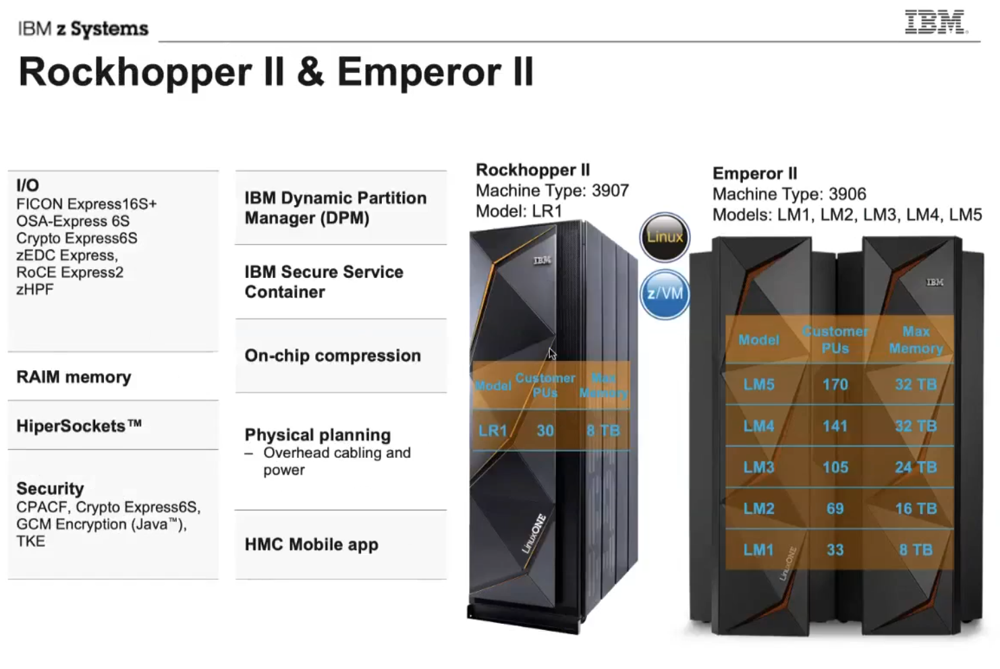
#### IBM z14 frame layout
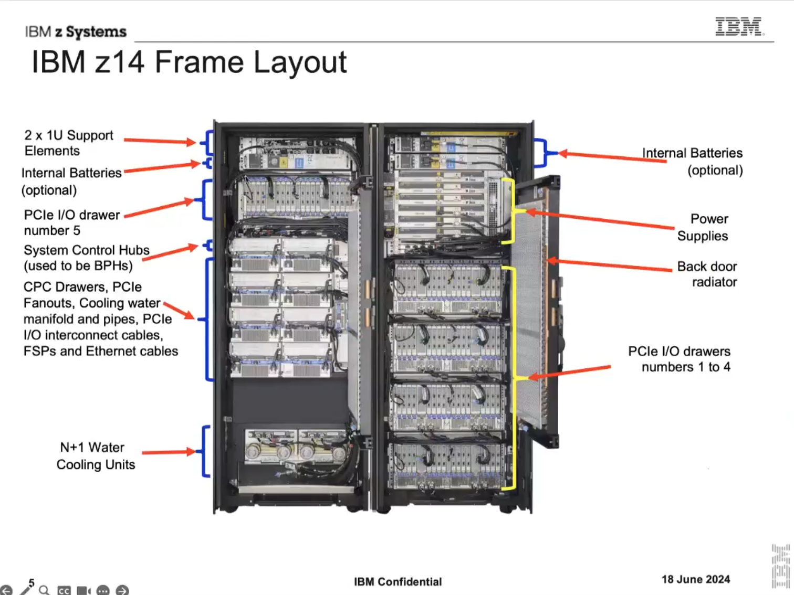
- ibmZ**不提供磁盘** 
### DPM (Dynamic Partition Manager)

- 资源管理工具，降低了解门槛
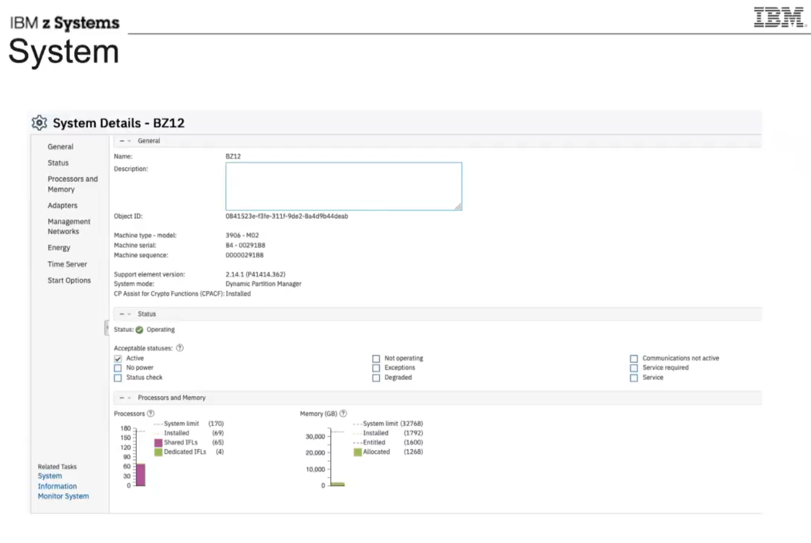
#### process and memory
- 划分逻辑资源LPAR
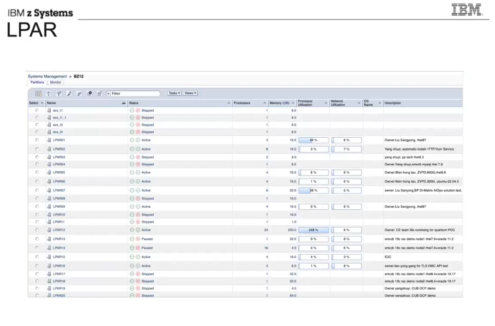
- 双柜可以分80个分区
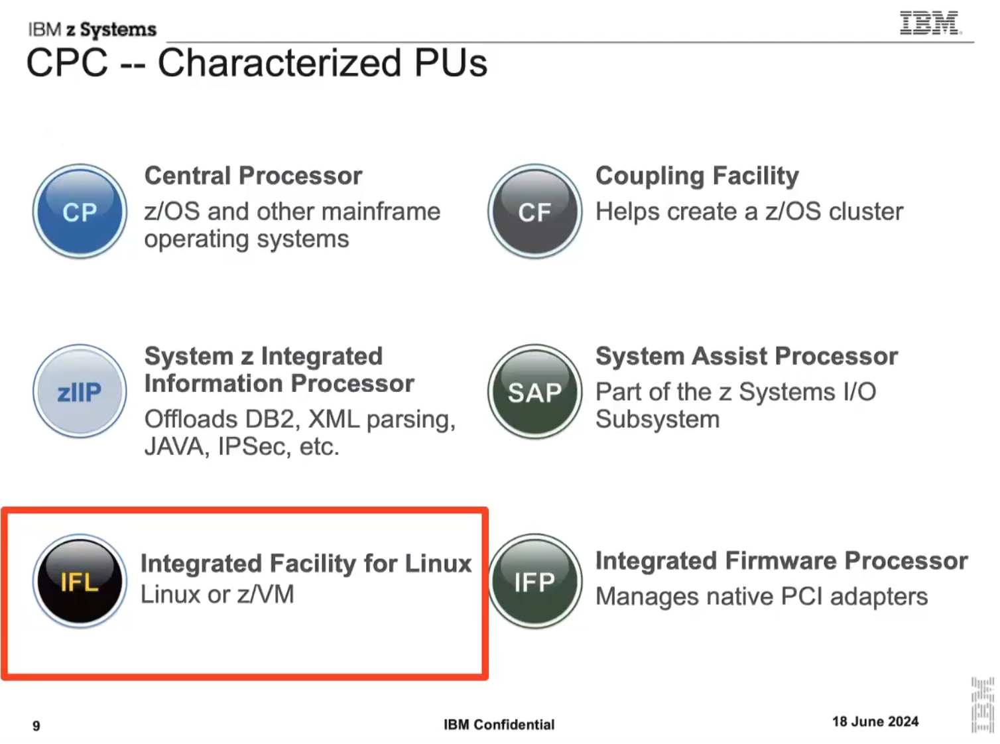
### CPU
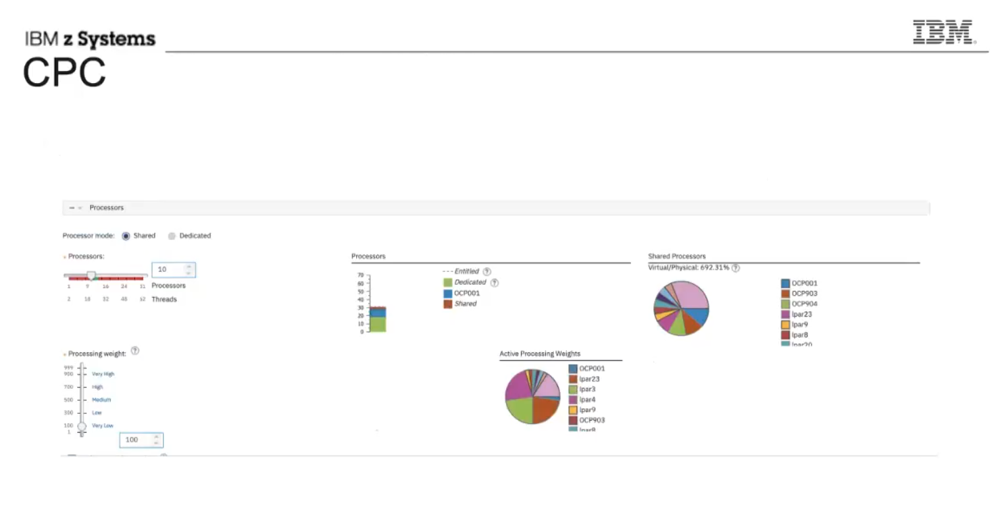
- shared：一个CPU被多个分区共享
- dedicated：一个CPU被一个分区独占
- 频分比：一个CPU被多个分区共享时，每个分区的CPU时间比例
### Memory
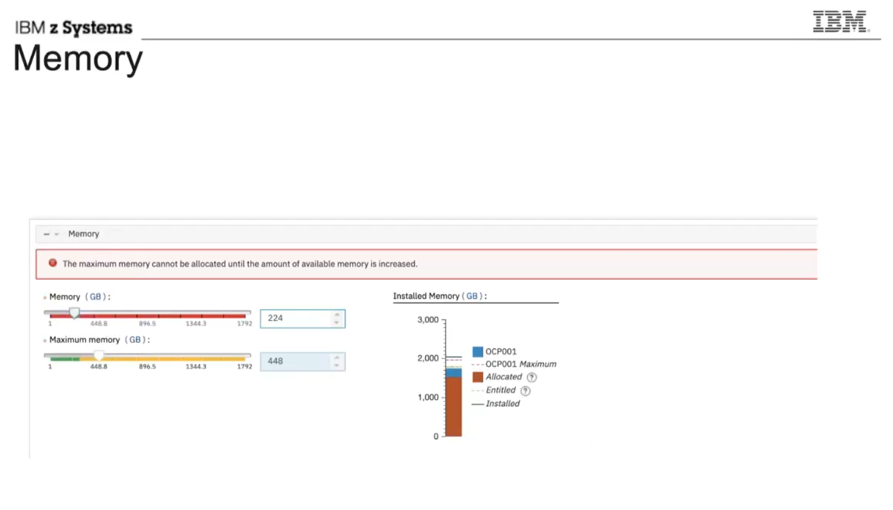
- 计划任务
### Storage
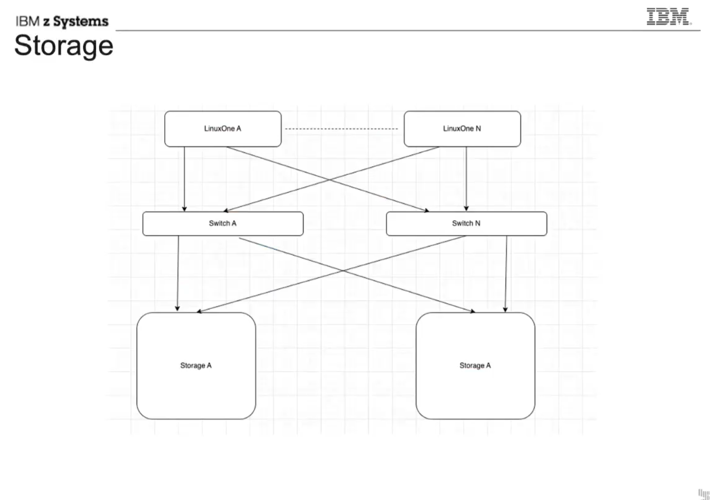
- Linux one不提供磁盘，存储来自于外部存储
- 通过光纤交换机看到存储
- path：注意到路径的变化情况，说明了一些可能原因
- 存储类型
    - boot 用来装OS
    - data 用来装数据，不能装OS
- Storage Group
    - 单个存储是storage volume，一个或者多个storage volume集合成group
    - 每个SG可以同时map到多个area part，也可以只map到一个area part
- FCP 光纤通道协议
    - WWPN
    - 世界范围唯一的光纤通道地址
    - 类比MAC地址
- VHBA
    - 虚拟HBA
    - 需要交换机支持
    - 把网卡虚拟出多个网卡
    - 用来连接存储
### Network
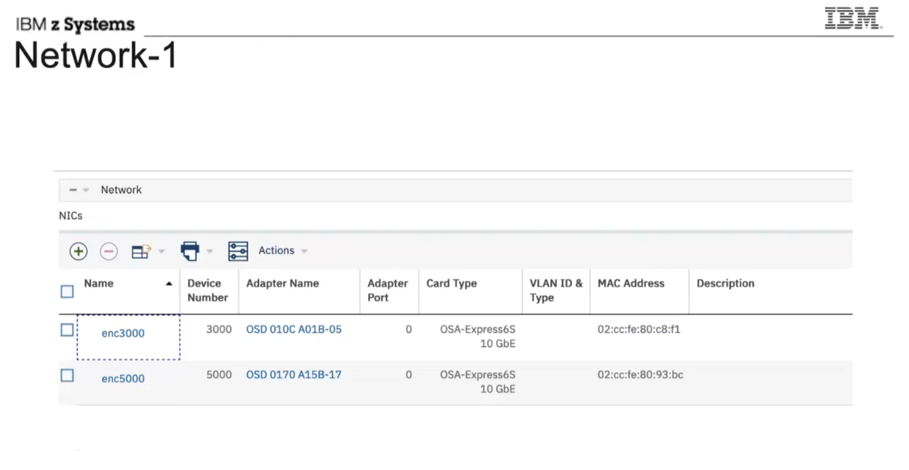
- 10GB的卡叫OSD：Open System Adapter
- 25GB的卡叫RoCE：
同样可以划分逻辑资源，例如：
- 05的卡被以下的partition共享：
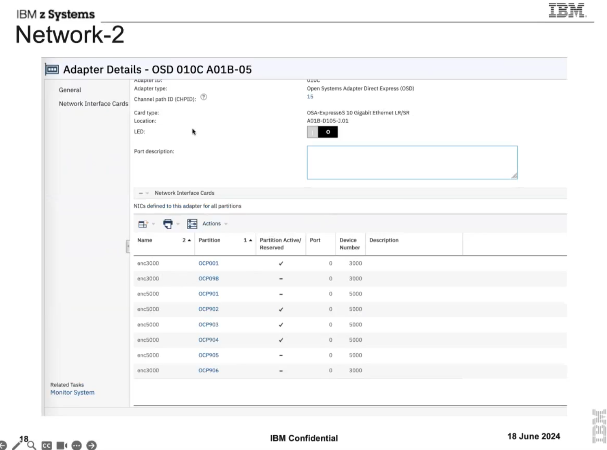
- 17的卡被以下的partition独占：

### Monitor
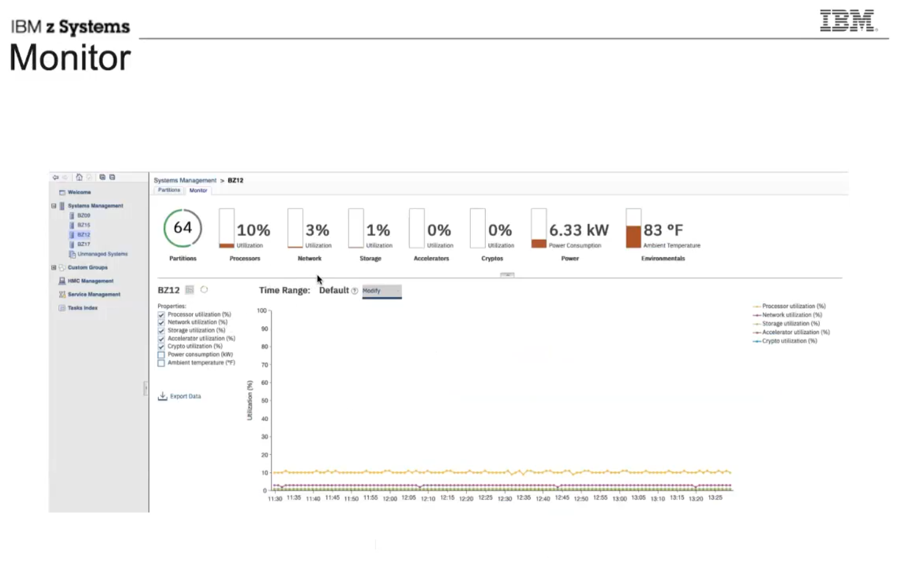


## 第三周考试周
搭建本地API测试server
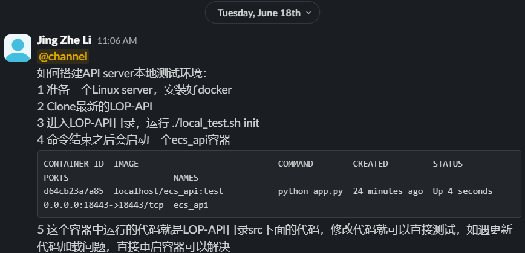
途中遇到了几个问题：
1. `./local_test.sh init` 的时候，遇到报错
    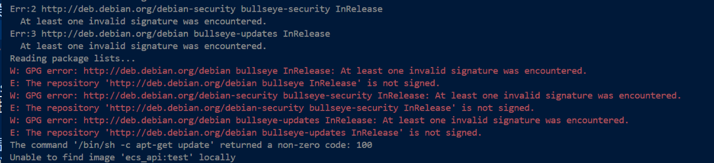
    - 解决方法：
    查阅资料[stackoverflow: At least one invalid signature was encountered
](https://stackoverflow.com/questions/62473932/at-least-one-invalid-signature-was-encountered)后进行尝试和排查，发现应该是磁盘空间不足了，进行虚拟机磁盘扩容
2. 扩容后虚拟机启动不起来了：原因是因为虚拟机的磁盘扩容后，虚拟机的分区表没有更新，所以虚拟机无法识别新的磁盘空间。
    - 解决方法：
    [VMWare中给Ubuntu 虚拟机硬盘扩容后无法正常开机的相关问题](https://blog.csdn.net/Alan_Walker688/article/details/131889313)
3. 启动之后网络不通，ens33网卡状态异常。连不到dockerhub，vscode也ssh不到
    - 解决方法：
    [Ubuntu上不了网：ifconfig查看只有lo,没有ens33问题解决参考方法](https://blog.csdn.net/qq_41969790/article/details/103222251)

> [vscode连接不上问题和解决方法合集](https://blog.csdn.net/White_lies/article/details/124093530)
后来又遇到过一次 `Got error from ssh: spawn C:\Windows\System32\WindowsPowerShell\v1.0\ssh.exe ENOENT`

## 第四周
任务分配： https://github.com/JasonCrash/LOP-API/issues/4

### 什么是 `zhmc-prometheus-exporter` ?
HMC：硬件管理控制台

`zhmc-prometheus-exporter` 包含了 `zhmcclient` 作为其依赖库。它在内部使用 `zhmcclient` 的 API 来与 HMC 进行交互，并定期调用这些 API 获取最新的监控数据。

`zhmc-prometheus-exporter` 支持ZHMC提供的所有指标以及一些基于HMC资源属性（如LPAR的内存或CPU权重）的有用指标。基于资源属性的指标在后台通过HMC发出的更改通知以及不支持更改通知的属性的异步检索获得。

[available-metrics](https://zhmc-prometheus-exporter.readthedocs.io/en/stable/usage.html#available-metrics)


The following table shows the mapping between  `exporter metric groups` and `exported Prometheus metrics` in `the standard metric definition`. 请注意，集合和 zBX 相关的度量不在标准度量定义范围内（z15 版本已移除了对它们的支持）。有关 HMC 度量的更多信息，请参见 HMC API 手册中的“度量组”部分。有关 CPC 和分区（DPM 模式）以及逻辑分区（经典模式）的资源属性的更多信息，请参见 HMC API 手册中的相应数据模型。

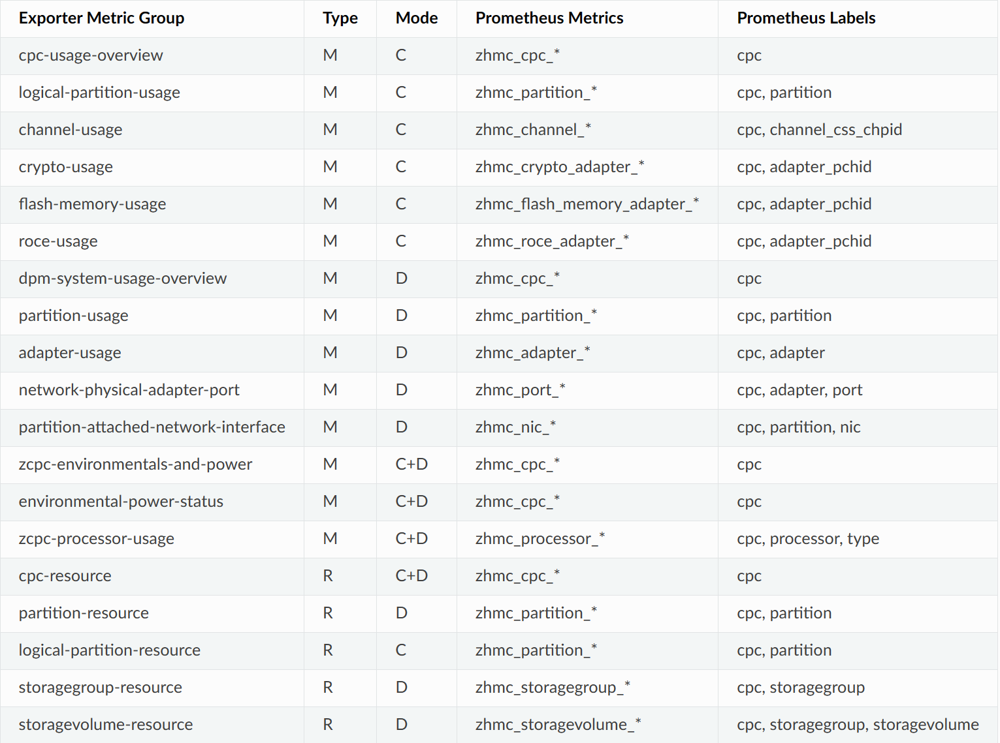

Legend:
- Type: The type of the metric group: M=metric service, R=resource property
类型：度量组的类型：M=度量服务，R=资源属性
- Mode: The operational mode of the CPC: C=Classic, D=DPM
模式：CPC的操作模式：C=经典模式，D=DPM模式

As you can see, the `zhmc_cpc_*` and `zhmc_partition_*` metrics are used for both `DPM mode` and `classic` mode. The names of the metrics are equal if and only if they have the same meaning in both modes.

- hmccreds.yaml
>Provide an HMC credentials file for use by the exporter.
为exporter提供一个HMC证书文件。
The HMC credentials file tells the exporter which HMC to talk to for obtaining metrics, and which userid and password to use for logging on to the HMC.
HMC 认证文件告诉exporter要与哪个 HMC 进行通信以获取指标，以及要使用哪个用户 ID 和密码登录到 HMC。
It also defines whether HTTP or HTTPS is used for Prometheus, and HTTPS related certificates and keys.
它还定义了Prometheus使用的是HTTP还是HTTPS，以及与HTTPS相关的证书和密钥。
Download the Sample HMC credentials file as hmccreds.yaml and edit that copy accordingly.
下载 Sample HMC 凭据文件，然后根据需要进行编辑。
For details, see HMC credentials file.
详细信息请参见HMC凭据文件。


- matrics.yaml
>Provide a metric definition file for use by the exporter.
为 exporter 提供一个度量定义文件。
The metric definition file maps the metrics returned by the HMC to metrics exported to Prometheus.
度量定义文件将HMC返回的度量映射到Prometheus可导出的度量。
Furthermore, the metric definition file allows optimizing the access time to the HMC by disabling the fetching of metrics that are not needed.
此外，度量定义文件允许通过禁用不需要的度量来优化对HMC的访问时间。
Download the Sample metric definition file as metrics.yaml. It can be used as it is and will have all metrics enabled and mapped properly. You only need to edit the file if you want to adjust the metric names, labels, or metric descriptions, or if you want to optimize access time by disabling metrics not needed.
下载示例度量定义文件，将其保存为。该文件可以直接使用，并且会启用所有度量并正确映射。如果您想更改度量名称、标签或描述，或者想通过禁用不需要的度量来优化访问时间，只需编辑该文件即可。
For details, see Metric definition file.
详细信息请参见度量定义文件。

**在这个文件中，exporter_name 是用来标识每个度量指标（metric）的唯一名称，它代表了特定的监控数据点。这些名称通常用于 Prometheus 配置中，以便于 Prometheus 识别和收集相应的指标数据。**
### Demo setup with Grafana
部署图
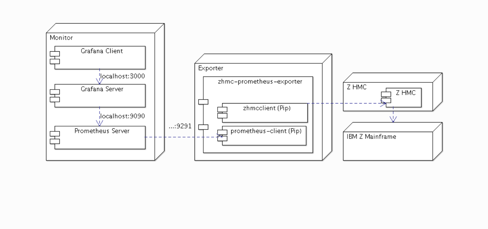
### prometheus metrics类型

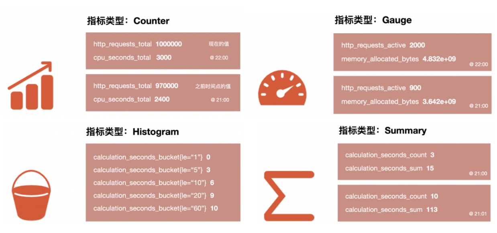

|Metric 类型|	说明	|常用指标|
|---|---|---|
|Counter|Counter 类型的指标和计数器一样，只增不减（除非系统发生重置）。常见的监控指标，例如http_requests_total，node_cpu_seconds_total 都是 Counter 类型的监控指标。Counter 类型的指标名称常使用 _total 作为后缀。Counter 是一个简单但强大的指标，但需要明确的是，某项指标的累计值，对于用户了解系统状态来说，没什么直接的价值。因此，Counter 指标常搭配 rate 或 increase 函数，通过取 范围向量（range vector） 来使用。|CPU 使用时间，网络流量，请求量|
|Gauge|	与 Counter 类型不同，Gauge 类型的指标侧重于反应系统的当前状态。因此这类指标的样本数据可增可减。例如 node_memory_MemFree_bytes（主机当前空闲的内存大小）、container_memory_usage_bytes （容器当前内存大小）都是 Gauge 类型的监控指标。|内存用量，硬盘空间，服务运行状态|
|Histogram|Counter 指标存在一个问题：它只能被计算为均值。而对于类似 接口请求延迟 类的数据，仅仅有平均值还不够。还需要看到数据的分布情况，甚至计算百分位数（quantile）。对于这类数据，Prometheus 提供了 2 种指标类型：histogram 和 Summary。其中，Histogram 的原理是提前定义多个buckets，覆盖所有可能的样本；采集到新样本时，这个样本会落入某个 bucket 内。使用时，我们可以利用样本在各个 bucket 的分布情况计算 quantile。展示时，histogram 尤其适合绘制火焰图（heat map）。|各类延迟、耗时类指标|
|Summary|Summary 与 Histogram 一样，可以用来查看数据的分布情况。但与 Histogram 不同的是，Summary 返回的是计算后数据（中位数的具体值）。因此，它相比 Histogram 省略了在查询时的计算消耗，但是也丢失了原始的样本数据。|各类延迟、耗时类指标|

### 核心指标
zhmc-prometheus-exporter的核心指标是什么？
#### 整理概念
首先理清楚几个概念和文件之间的关系。

`metrics.yaml` 里定义了一批 **metrics group** 和对应的 **metrics**，metrics group 是一组相关的 metrics，metrics 是具体的指标，比如 `zhmc_cpc_processor_usage_ratio` 是一个metrics，属于 `cpc-usage-overview` 这个 metrics group。在 `metrics.yaml` 文件中，定义了 metrics group 和 metrics 之间的关系，以及 metrics 的一些属性，比如是否启用、是否需要计算、是否需要计算rate等。其中有一个属性是`exporter_name`，这个属性是用来标识每个度量指标（metric）的唯一名称，它代表了特定的监控数据点。这些名称通常用于 Prometheus 配置中，以便于 Prometheus 识别和收集相应的指标数据。可以通过 metrics group 和 exporter_name 来唯一确定 **mapping** 到的具体的 Prometheus metrics。


参考前端同学的用到的部分Prometheus Metrics：
- zhmc_cpc_processor_usage_ratio: Usage ratio across all processors of the CPC
- zhmc_cpc_network_adapter_usage_ratio
- zhmc_cpc_storage_adapter_usage_ratio
- zhmc_partition_processor_usage_ratio
- zhmc_partition_network_adapter_usage_ratio
- zhmc_partition_storage_adapter_usage_ratio


### investigate how to get network usage through zhmc exporter

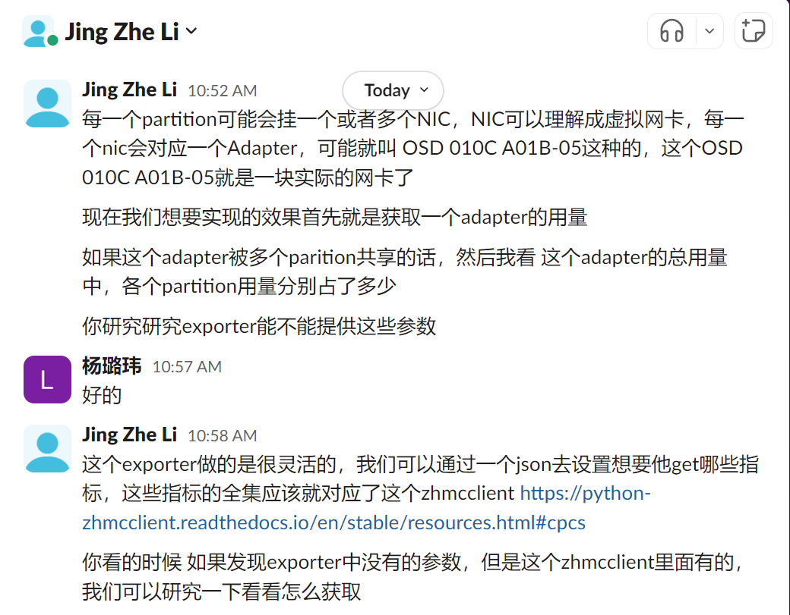

CPC（Central Processing Complex）可以看作是一台机器，其中划分了多个分区（partitions）。每个分区可能会连接一个或多个网络接口控制器（NIC），这些NIC可以理解为虚拟网卡。每个NIC又对应一个网络适配器（Adapter），其名称可能类似于OSD 010CA01B-05，而这个OSD 010CA01B-05实际上就是一块实际的物理网卡。

我们目前的目标是实现以下效果：首先，获取一个网络适配器的使用量。如果这个网络适配器被多个分区共享，我们需要知道该适配器的总使用量，并且明确各个分区在总使用量中分别占据的份额。

首先看看有哪些相关的metrics：


- `zhmc_cpc_network_adapter_usage_ratio	`: Usage ratio across all network adapters of the CPC. CPC 所有网络适配器的使用率。

- `zhmc_partition_network_adapter_usage_ratio`: Usage ratio of all network adapters of the partition. 该分区所有网卡的使用率。
```yaml
partition-usage:
    network-usage:
        percent: true
        exporter_name: network_adapter_usage_ratio
        exporter_desc: Usage ratio of all network adapters of the partition
```

- `partition-attached-network-interface` : 分区附加网络接口
    - zhmc_nic_bytes_sent_count 已发送的单播数据包的字节数
    - zhmc_nic_bytes_received_count 已接收的单播数据包的字节数
    - zhmc_nic_packets_sent_count 已发送的单播数据包数
    - zhmc_nic_packets_received_count 已接收的单播数据包数
    - zhmc_nic_packets_sent_dropped_count 已丢弃的发送数据包数（资源短缺）
    - zhmc_nic_packets_received_dropped_count 已丢弃的接收数据包数（资源短缺）
    - zhmc_nic_packets_sent_discarded_count 已发送但被丢弃的数据包数量（格式错误）
    - zhmc_nic_packets_received_discarded_count 已接收但被丢弃的数据包数量（格式错误）
    - zhmc_nic_multicast_packets_sent_count 已发送的多播数据包数量
    - zhmc_nic_multicast_packets_received_count 已接收的多播数据包数量
    - zhmc_nic_broadcast_packets_sent_count 已发送的广播数据包数量
    - zhmc_nic_broadcast_packets_received_count 已接收的广播数据包数量
    - zhmc_nic_data_sent_bytes 通过集合发送的数据量间隔
    - zhmc_nic_data_received_bytes 收集间隔内接收的数据量
    - zhmc_nic_data_rate_sent_bytes_per_second 收集间隔内发送的数据速率
    - zhmc_nic_data_rate_received_bytes_per_second 收集间隔内接收的数据速率

#### zhmcclient 的 NIC 类
https://python-zhmcclient.readthedocs.io/en/stable/resources.html#nics

A NIC (Network Interface Card) is a logical entity that provides a Partition with access to external communication networks through a Network Adapter. More specifically, a NIC connects a Partition with a Network Port, or with a Virtual Switch which then connects to the Network Port.
NIC（网络接口卡）是一种逻辑实体，它通过网络适配器为分区提供访问外部通信网络的途径。更确切地说，NIC将分区连接到网络端口或虚拟交换机，然后虚拟交换机再连接到网络端口。

NIC resources are contained in Partition resources.
NIC 资源包含在分区资源中。

NICs only exist in CPCs that are in DPM mode.
NICs只存在于处于DPM模式的CPC中。


提供接口：
- list List the NICs in this Partition.
列出此分区中的 NIC。
可以在过滤器参数中指定任何资源属性。有关过滤器参数的详细信息，请参阅过滤。
资源列表以优化的方式处理：
如果此管理器启用了自动更新，则使用本地维护的资源列表（通过 HMC 的库存通知自动更新）并应用提供的过滤器参数。
否则，如果过滤器参数将资源名称指定为具有直接匹配字符串的单个过滤器参数（即没有正则表达式），则根据本地维护的名称 URI 缓存执行优化查找。
否则，将使用父对象中此资源的相应数组属性来列出资源，并应用提供的过滤器参数。
- create
在此分区中创建并配置 NIC。
NIC 必须由适配器端口（在 OSA、ROCE 或 Hipersockets 适配器上）支持。

此方法的“properties”参数中指定支持适配器端口的方式取决于适配器类型，如下所示：

对于 OSA 和 Hipersockets 适配器，“virtual-switch-uri”属性用于指定与支持适配器端口关联的虚拟交换机的 URI。

此虚拟交换机是一种资源，只要适配器资源存在，它就会自动存在。请注意，这些虚拟交换机不会显示在 HMC GUI 中；但它们会显示在 HMC REST API 中，因此也会显示在 zhmcclient API 中，作为 VirtualSwitch 类。

“virtual-switch-uri”属性的值可以根据给定的适配器名称和端口索引确定。
#### zhmcclient 的 nic
- delete
Delete this NIC.
- update_properties
Update writeable properties of this NIC.

This method serializes with other methods that access or change properties on the same Python object.


#### 思路
##### 针对roCE和cna
1. zhmcclient 来 list 出 CPCs 中每个 CPC 的partition list
2. 获取每个 CPC 的网络适配器及其端口信息。
3. 针对 partition list 中的每个 partition，获取其 NICs 和每个 NIC 对应的可用属性 network-adapter-port-uri，得到每一个 NIC 映射到的 adapter，也就是所有虚拟网卡和物理网卡的映射
4. 通过获取每个分区的NIC使用统计信息来计算更具体的分区使用量

##### 针对osd和iqd
1. zhmcclient 来 list 出 CPCs 中每个 CPC 的partition list
2. 遍历所有CPC，获取每个CPC的虚拟交换机。对每个虚拟交换机，获取其关联的物理网卡和端口信息。
3. 通过 virtual-switch-uri 找到对应的虚拟交换机。通过虚拟交换机找到对应的物理网卡
4. 针对 partition list 中的每个 partition，获取其 NICs 和每个 NIC 对应的 virtual-switch-uri，找到对应的虚拟交换机。通过虚拟交换机找到对应的物理网卡，得到每一个 NIC 映射到的 adapter，也就是所有虚拟网卡和物理网卡的映射
5. 通过获取每个分区的NIC使用统计信息来计算更具体的分区使用量


NIC的属性：[Data model - NIC element object](https://www.ibm.com/docs/en/systems-hardware/zsystems/Z16M-A01?topic=model-data-nic-element-object#epm_partitionobj_datamodel_nic)


（linuxone 和 zsystem的api有些是一样的）
[IBM SC27-2642-02, IBM Z Hardware Management Console Web Services API (Version 2.16.0)](https://www.ibm.com/docs/en/module_1675371155154/pdf/SC27-2642-02.pdf)


The type of the NIC. The value of this property is derived implicitly from the backing adapter associated with this NIC on the Create NIC operation. Valid values are:
• "roce" - RDMA over Converged Ethernet.
• "iqd" - Internal Queued Direct.
• "osd" - OSA Direct Express
• "cna" - Cloud Network Adapter

这四种网络接口卡（NIC）类型分别代表了不同的网络技术和用途：

1. **"roce" - RDMA over Converged Ethernet**：
   - RDMA over Converged Ethernet（RoCE）是一种网络技术，允许远程直接内存访问（RDMA）操作在以太网上执行。这意味着数据可以直接从一个服务器的内存传输到另一个服务器的内存，而无需CPU介入，从而减少延迟，提高数据传输效率。RoCE特别适用于高性能计算（HPC）和企业数据中心。

2. **"iqd" - Internal Queued Direct**：
   - Internal Queued Direct（IQD）是一种专为高速数据处理设计的内部队列直接传输技术。它通常用于处理大量数据包或高速数据流，通过优化数据路径来减少延迟和提高吞吐量。IQD技术适用于需要高速数据处理能力的场景，如网络分析、高频交易等。

3. **"osd" - OSA Direct Express**：
   - OSA Direct Express是指OSA（Open Systems Adapter）直接快速模式，是一种专为IBM Z系列计算机设计的网络适配器技术。它提供了高速、低延迟的网络通信能力，支持多种网络协议和服务。OSA Direct Express适用于需要高性能网络连接的大型企业环境。

4. **"cna" - Cloud Network Adapter**：
   - Cloud Network Adapter（CNA）是一种专为云计算环境设计的网络接口卡。它支持虚拟化和多租户技术，能够提供灵活的网络配置和优化的数据流量管理。CNA旨在提高云数据中心的网络性能和效率，支持大规模虚拟化部署和云服务。

每种类型的NIC都针对特定的网络需求和应用场景进行了优化，从高性能计算到云计算环境，提供了不同的网络解决方案。

NIC element object的有关属性：
|Name|Qualifier|Type|Description|
|---|---|---|---|
network-adapter-port-uri|(w)(pc)|String/URI|The canonical URI path for the associated Network Port element object.Only present when type is **"roce" or "cna"**.|
|virtual-switch-uri |(w)(pc)|String/URI|The canonical URI path for the associated Virtual Switch object. **Only present when type is "osd" or "iqd".** Constraint: If type is "iqd" and the Partition belongs to a CPC with API feature dpm-hipersockets-partition-link management available, this property is not writable. [Updated by feature dpm-hipersockets-partition-link-management]|


底层原理
- network-adapter-port-uri
    - 每个NIC在创建时都会与一个特定的物理适配器端口关联，这个关联信息通过network-adapter-port-uri属性保存。底层的原理是通过URI路径唯一标识了物理适配器的端口。通过查询这个URI路径，可以定位到具体的物理适配器及其端口。
    - 例如：
        - NIC A的network-adapter-port-uri是/api/adapters/adapter1/ports/port1。
        - 这个URI路径直接指向物理适配器adapter1的port1，因此可以确定NIC A使用了物理适配器adapter1的port1。
- virtual-switch-uri
    - 虚拟交换机（virtual switch）在底层实现了多个虚拟网卡（NIC）到物理网卡的连接。每个虚拟交换机都有一个唯一的URI路径，通过这个URI路径，可以找到连接到该交换机的所有NICs。
    - 虚拟交换机的作用是将多个分区的虚拟网络流量汇聚到一起，并将其分配给一个或多个物理网络适配器。因此，通过查询虚拟交换机的URI路径，可以间接找到与该交换机关联的所有物理适配器。
    - 例如：
        - 虚拟交换机S的virtual-switch-uri是/api/virtual-switches/switch1。
        - 连接到交换机S的所有NICs（如NIC B和NIC C）共享同一个virtual-switch-uri。
        - 查询虚拟交换机switch1的配置，可以找到其底层连接的物理适配器，从而确定NIC B和NIC C使用的物理适配器。
- 利用network-adapter-port-uri和virtual-switch-uri属性，可以从虚拟的NIC对象追溯到实际的物理网络适配器。这两个属性在确定NIC与物理网卡的关联性方面非常有用，能够帮助我们实现物理网卡的总用量监控，并进一步细化到每个分区的用量监控。
#### virtual switch
- 虚拟交换机是将 NIC 与网络端口连接起来的虚拟化网络交换机。每次检测到并配置新的网络适配器时，都会自动生成虚拟交换机。
- 虚拟交换机资源包含在 CPC 资源中。
- 虚拟交换机仅存在于处于 DPM 模式的 CPC 中。

## 第五周
### 思路形成的py脚本（并不适用，只用来理解思路）
```python
from zhmcclient import Session

# 初始化 HMC 连接
session = Session('hmc_host', 'hmc_user', 'hmc_password')
client = session.client

# 获取所有 CPC
cpcs = client.cpcs.list()

# 初始化数据结构
adapter_usage = {}

# 获取所有虚拟交换机及其关联的物理网卡
virtual_switches = []
for cpc in cpcs:
    v_switches = cpc.virtual_switches.list()
    virtual_switches.extend(v_switches)
    for v_switch in v_switches:
        adapters = v_switch.adapters.list()
        for adapter in adapters:
            ports = adapter.ports.list()
            for port in ports:
                adapter_usage[port.uri] = {'total_sent_bytes': 0, 'total_received_bytes': 0, 'partitions': {}}

# 获取所有分区及其NIC信息，并收集使用统计信息
for cpc in cpcs:
    partitions = cpc.partitions.list()
    for partition in partitions:
        nics = partition.nics.list()
        for nic in nics:
            v_switch_uri = nic.get('virtual-switch-uri')
            if v_switch_uri:
                # 通过虚拟交换机找到对应的物理网卡
                v_switch = next((vs for vs in virtual_switches if vs.uri == v_switch_uri), None)
                if v_switch:
                    adapters = v_switch.adapters.list()
                    for adapter in adapters:
                        ports = adapter.ports.list()
                        for port in ports:
                            if port.uri in adapter_usage:
                                # 获取NIC的使用统计信息
                                sent_bytes = get_prometheus_metric(f'zhmc_nic_bytes_sent_count{{nic="{nic.name}"}}')
                                received_bytes = get_prometheus_metric(f'zhmc_nic_bytes_received_count{{nic="{nic.name}"}}')
                                
                                # 更新物理网卡的总用量
                                adapter_usage[port.uri]['total_sent_bytes'] += sent_bytes
                                adapter_usage[port.uri]['total_received_bytes'] += received_bytes
                                
                                # 更新分区的使用信息
                                if partition.name not in adapter_usage[port.uri]['partitions']:
                                    adapter_usage[port.uri]['partitions'][partition.name] = {'sent_bytes': 0, 'received_bytes': 0}
                                adapter_usage[port.uri]['partitions'][partition.name]['sent_bytes'] += sent_bytes
                                adapter_usage[port.uri]['partitions'][partition.name]['received_bytes'] += received_bytes

# 输出结果
for port_uri, usage in adapter_usage.items():
    print(f"Adapter Port URI: {port_uri}")
    print(f"Total Sent Bytes: {usage['total_sent_bytes']}")
    print(f"Total Received Bytes: {usage['total_received_bytes']}")
    for partition_name, partition_usage in usage['partitions'].items():
        print(f"  Partition: {partition_name}, Sent Bytes: {partition_usage['sent_bytes']}, Received Bytes: {partition_usage['received_bytes']}")
```

> 文档：The exporter code is agnostic to the actual set of metrics supported by the HMC. A new metric exposed by the HMC metric service or a new property added to one of the auto-updated resources can immediately be supported by just adding it to the Metric definition file.

本来想看看测试机上exporter的文件怎么配置的, 用find命令找到了三个metrics.yaml:
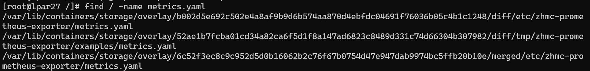
不小心 attach 到 `zhmc_promethues_exporter` 容器,然后误操作用 `ctrl z` 和 `ctrl c` 命令把容器的进程给中断了, 没想到容器直接被删除了(docker ps -a也没有)..
控制台操作日志如下:
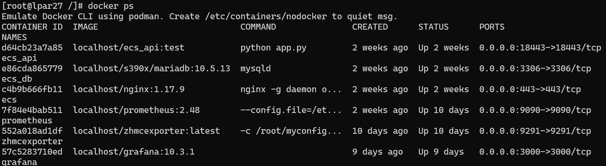
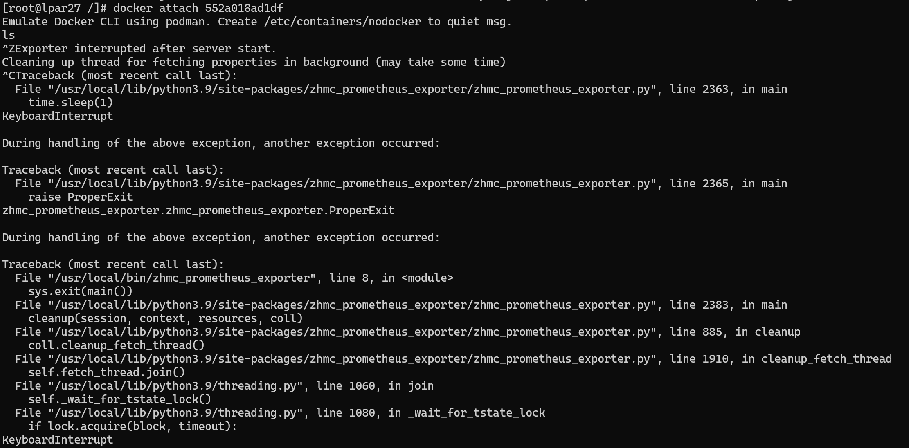
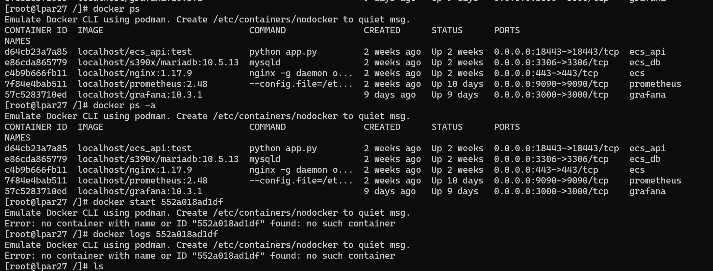
马上参照官方文档: 用docker(实际上是podman)运行zhmc_prometheus_exporter,再找到本机上的hmccreds.yaml文件,把hmccreds.yaml文件挂载到容器中,并且把容器的端口映射到本机的端口,启动容器.
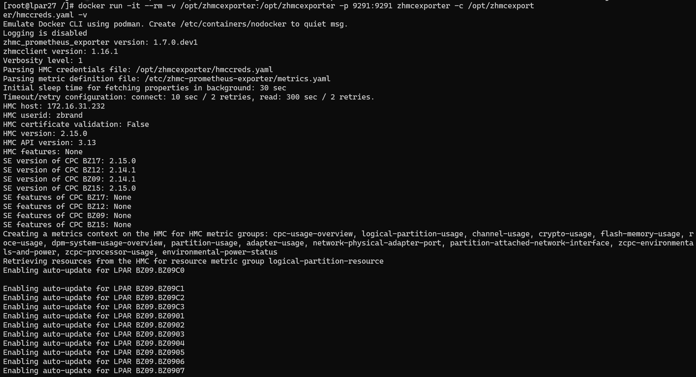
重新启动成功后, 端口映射成功, 可以通过浏览器访问到zhmc_prometheus_exporter的web页面, 并且可以看到metrics数据. 同时Prometheus和Grafana也可以通过配置文件访问到zhmc_prometheus_exporter的metrics数据. 大概上是复原了.

后来和fulong老师交流了一下，给我多开了一个跑exporter容器来用于有需要修改metrics.yaml的时候进行测试。


### 疑惑1
讨论的核心是如何有效地向 Prometheus 和 Grafana 提供所需的指标数据，以支持分析和监控。老师提出，通过修改 exporter 配置来直接获取所需的参数，并让这些参数被 Prometheus 抓取，是一种更自动化和高效的方法。这样做可以避免重复造轮子，即避免自己编写脚本去收集数据，因为这相当于重新实现 exporter 的功能。确认了后端代码将只与 Prometheus 交互，而不是直接与 zhmcclient 或 exporter 打交道，即使某些参数可以通过后端代码简单获取，最终仍然需要考虑如何将这些数据发送给 Prometheus。如果不这样做，应用程序将需要处理来自两个数据源的数据，这会增加数据整合和一致性的复杂性。

结论是，为了简化数据流和避免不必要的复杂性，决定保持单一的数据源，即通过配置 exporter 来自动化地向 Prometheus 提供所需的指标数据，而不是在后端代码中自己处理数据收集和发送的任务。这种方法有助于保持系统的整洁和可维护性。
### 可能需要调动的API：
#### CPC
- CPCManager(client)
    - List(): List the CPCs managed by the HMC this client is connected to.
- CPC
    - partitions: Access to the Partitions in this CPC.
    - adapters: Access to the Adapters in this CPC.
    - virtual_switches: Access to the Virtual Switches in this CPC.
#### Virtual Switch
- VirtualSwitchManager(cpc)
    - List(): List the Virtual Switches in this CPC.
- VirtualSwitch
    - List the NICs connected to this Virtual Switch.
#### Adapter
- AdapterManager(cpc)
    - List(): List the Adapters in this CPC.
- Adapter
    - ports: Access to the Ports in this Adapter.
#### Port
- PortManager(adapter, port_type)
    - List(): List the Ports in this Adapter.
- port
    - manager
#### Partition
- PartitionManager(cpc)
    - List(): List the Partitions in this CPC.
- Partition
    - nics: Access to the NICs in this Partition.
#### NIC
- NicManager(partition)
    - List(): List the NICs in this Partition.
- NIC
    - backing_port(): Return the backing adapter port of the NIC.
    - get_property(name): Get the value of a property of this NIC.
    - property:
        - network_adapter_port_uri: The URI of the Network Adapter Port associated with this NIC.
        - virtual_switch_uri: The URI of the Virtual Switch associated with this NIC.


NIC 必须由适配器端口（在 OSA、ROCE 或 Hipersockets 适配器上）支持。

此方法的“properties”参数中指定支持适配器端口的方式取决于适配器类型，如下所示：

对于 OSA 和 Hipersockets 适配器，“virtual-switch-uri”属性用于指定与支持适配器端口关联的虚拟交换机的 URI。

此虚拟交换机是一种资源，只要适配器资源存在，它就会自动存在。请注意，这些虚拟交换机不会显示在 HMC GUI 中；但它们会显示在 HMC REST API 中，因此也会显示在 zhmcclient API 中，作为 VirtualSwitch 类。

“virtual-switch-uri”属性的值可以根据给定的适配器名称和端口索引确定。

### 疑惑2
- 类似于list的API有没有作为指标提供？似乎没有。
- 如何提供作为指标？似乎不是量化的，跟原有的指标不一样，因为不是简单的数字
- 是属于资源指标吗？跟量化指标不一样吗？
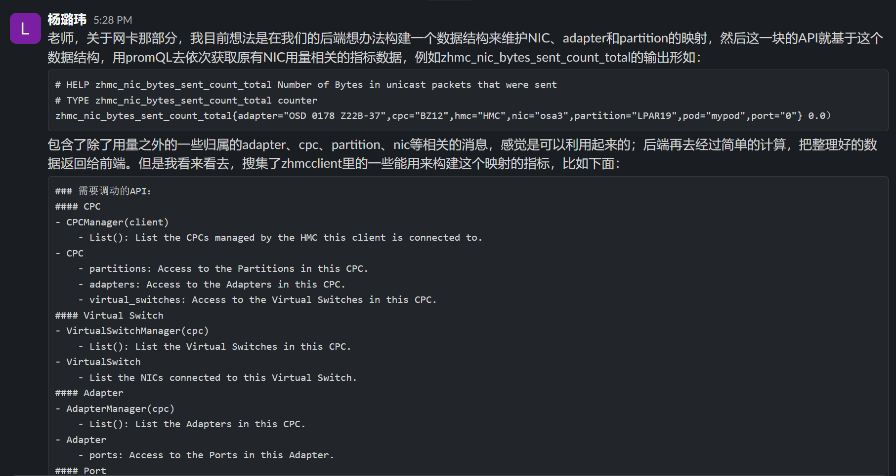
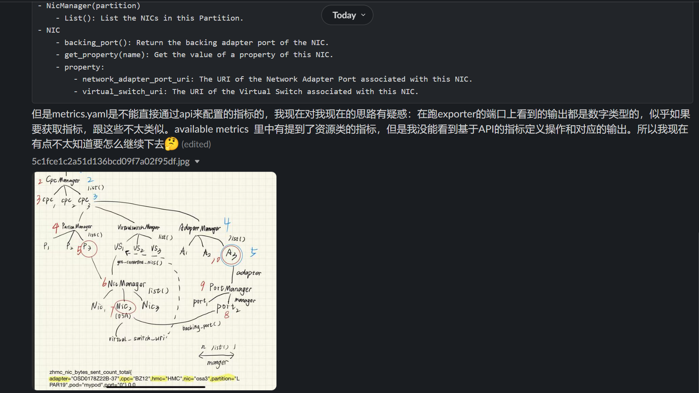
和李老师交流了一下，重新确认了需求和思路：
- 一方面，获取拓扑结构相关的东西这个公司以前都是有的，但是直接拿出来不合规；
- 另一方面，拓扑结构和数据可能存在不一致的可能：
    - listen同步机制，理论上是一致的，但是可能存在更新的时间节点不一样的情况。数据不一致的时候两个数据源可能还需要取舍等等。而且如果发生错误，定位错误的时候会比较麻烦。
- 所以调整思路：就只从exporter的角度出发，不要从拓扑结构出发，也不需要zhmcclient的API了，原有的指标输出就已足够。
- 接下来的问题是怎么展示（[issue16](https://github.com/JasonCrash/LOP-API/issues/16)）：
    - adapter的用量总数和每个partition的用量
    - 比如机器上有一百张卡，要怎么展示视图？
        - 所有的网卡的实时流量数据，点一下detail，展示所有的用到的partition的流量数据
- 明确业务开发逻辑：grafana的作用是可以通过promQL给前端提供视图；而后端可以通过promQL给前端提供API来获取数据。

### 最终解决方案
最终，使用一部分可用的指标，通过grafana中的promQL来展示视图，而不是直接从zhmcclient中获取数据。
在Grafana上新建一个Adapter view，里面有一个表格panel，点击可以实时调整packets和bytes这两个panel，展示对应adapter的具体用量分配情况。

具体如何使用grafana进行满足需求的配置和操作。
- dashboard variable：设置dashboard 范围内的变量 `$adapter_name`，可以在整个 dashboard 中使用，可以用query从数据源中的指标标签中获取变量允许的值。
- data link：支持数据点作为链接，点击可以跳转到设置的url
    - url设置格式：( `Field` 是adapter名称那一列的表头名称，用 `${__data.fields.Field}` 获取)：
        - `http://172.16.36.127:3000/d/aa37fb63-90cd-46ef-abf1-861f71b31745/adapter-view?var-adapter_name=${__data.fields.Field}`
- 目标panel的query语句中使用变量：
    - `sum(zhmc_nic_packets_sent_count_total{adapter="$adapter_name"}) by (partition)`
## 第六周
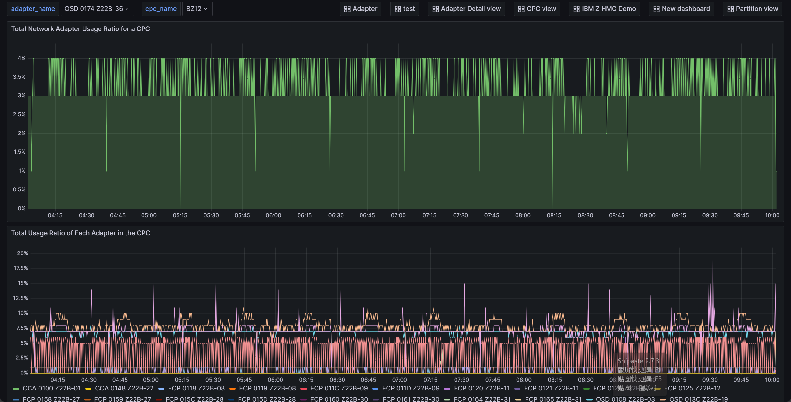

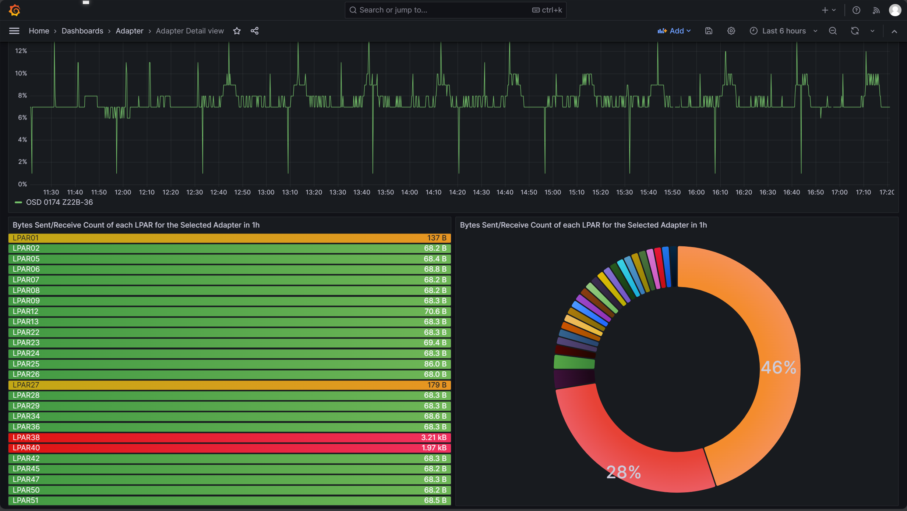
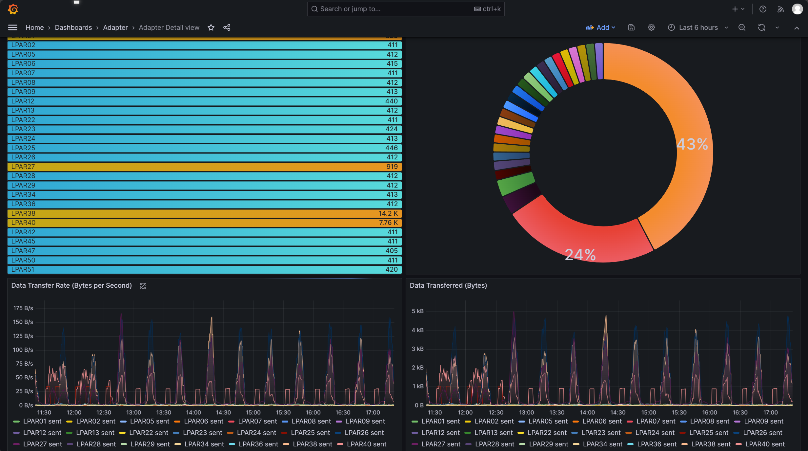
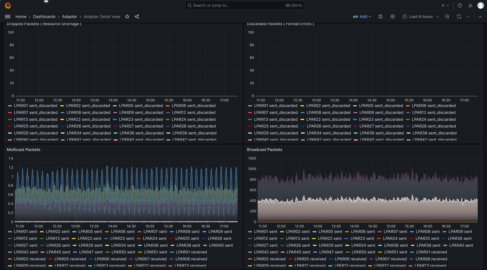
### 相似产品调研
- Zabbix 
- Nagios 预览版需要下载部署
- SolarWinds
    - [interactive-demos 主页](https://www.solarwinds.com/interactive-demos)
    - [Hybrid Cloud Observability](https://hco.demo.solarwinds.com/Orion/SummaryView.aspx?viewkey=Summary+Home+Narrow)
    - [SolarWinds Observability](https://demo.na-01.cloud.solarwinds.com/?program=999&campaign=7012J000001J8VVQA0&parentCampaign=7012J000001J8VVQA0&duration=3600)
        
        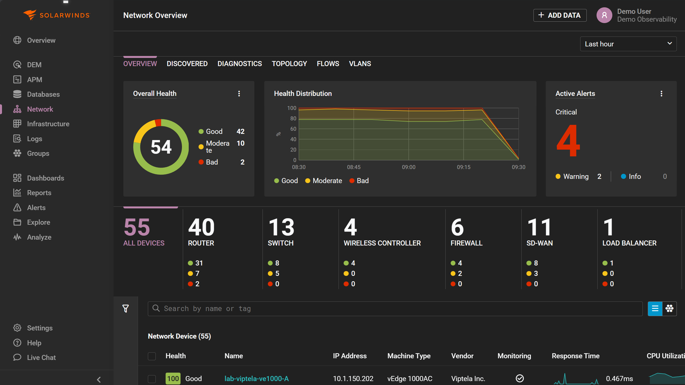
- PRTG? 
- Netdata
    - [Netdata console](https://app.netdata.cloud/spaces/netdata-demo/rooms/all-nodes/overview?_gl=1*hdpqyi*_gcl_au*NzM1NDE2NjQ0LjE3MjEwMjc4NjE.*_ga*Mzc5NjA0NTQ1LjE3MjEwMjc4NjE.*_ga_J69Z2JCTFB*MTcyMTAyNzg2MS4xLjEuMTcyMTAyNzg2MS42MC4wLjA.#metrics_correlation=false&after=-900&before=0&utc=Asia%2FShanghai&offset=%2B8&timezoneName=Beijing%2C%20Chongqing%2C%20Hong%20Kong%2C%20Urumqi&modal=&modalTab=&modalParams=&selectedIntegrationCategory=deploy.operating-systems&force_play=false&d8a4e0c5-7c79-4145-900e-83a9f06fcb6a--chartName-val=menu_system)
    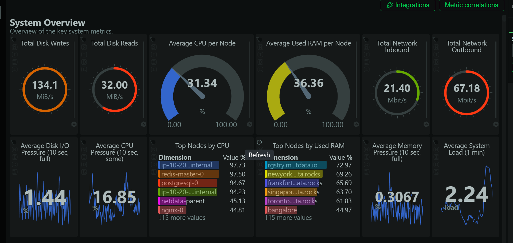
    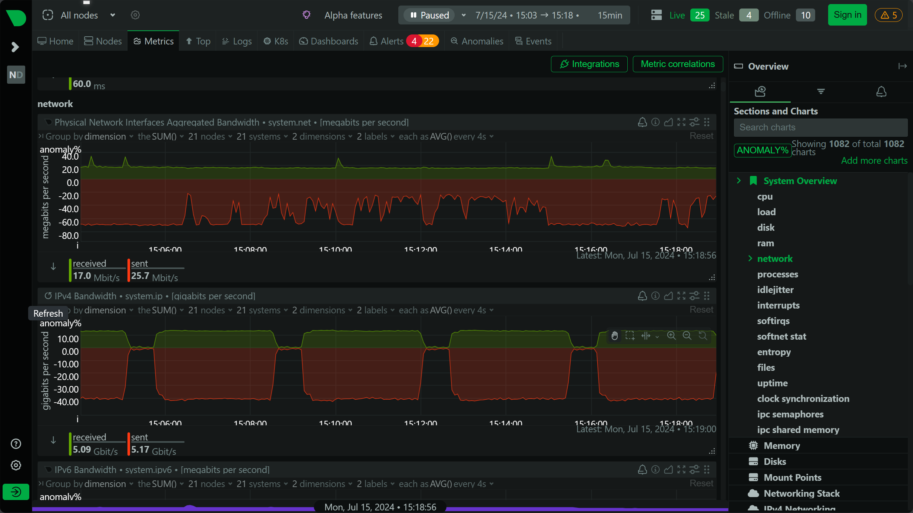
    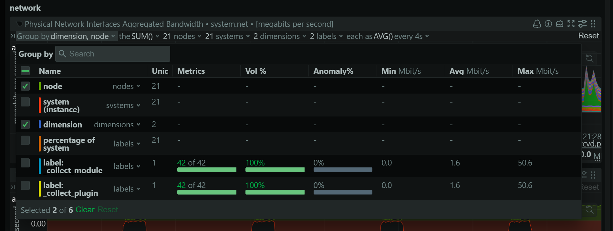

### 展示
比如你是一个用户，你现在打开页面看到什么，查看每一个网卡具体内容的时候具体有哪些内容，页面大体长什么样子，你可以简单用ppt画两个框，说明一下问题。
### 重新迭代
- 重新设计 CPC/Adapter view，Adapter/Partition view
- 调整 stat panel 进行排序
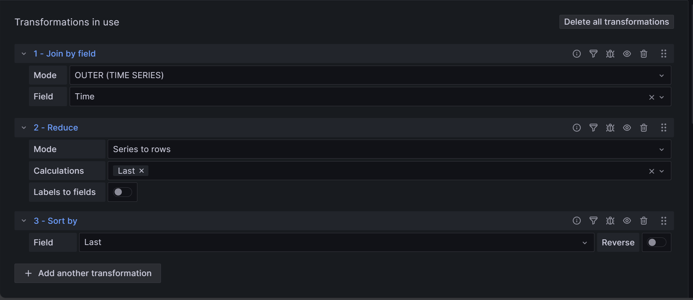
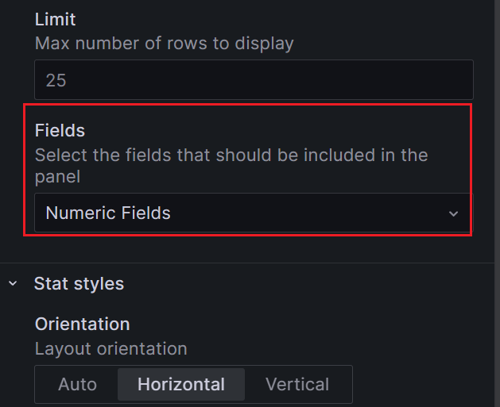
- 优化饼状图
    - 记得选中 Legend
- 三个 panel
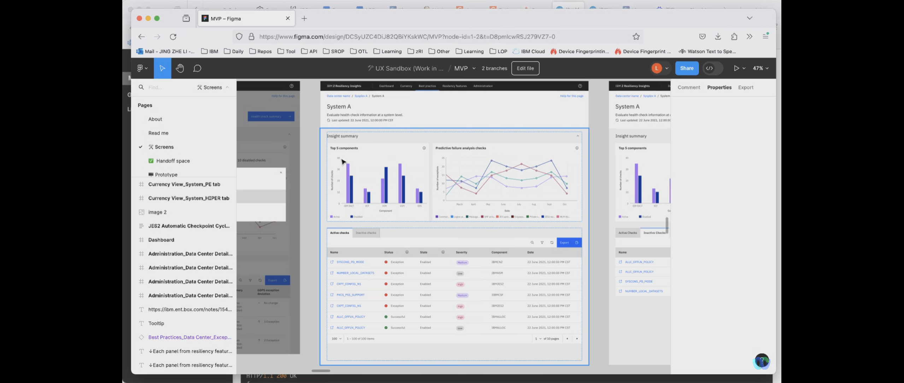
    - 时间序列
    - 指标数据 top5 的 Adapter 时间序列展示
        - 合理利用 grafana 的内置变量和 promQL 的函数，如 `topk`、`__range`、`__interval` 等
        ```PromQL
        topk(5, sum(rate(zhmc_adapter_usage_ratio{cpc="$cpc_name"}[$__range])) by (adapter))
        ```
        - [内置变量官方文档](https://grafana.com/docs/grafana/latest/dashboards/variables/add-template-variables/#global-variables)
        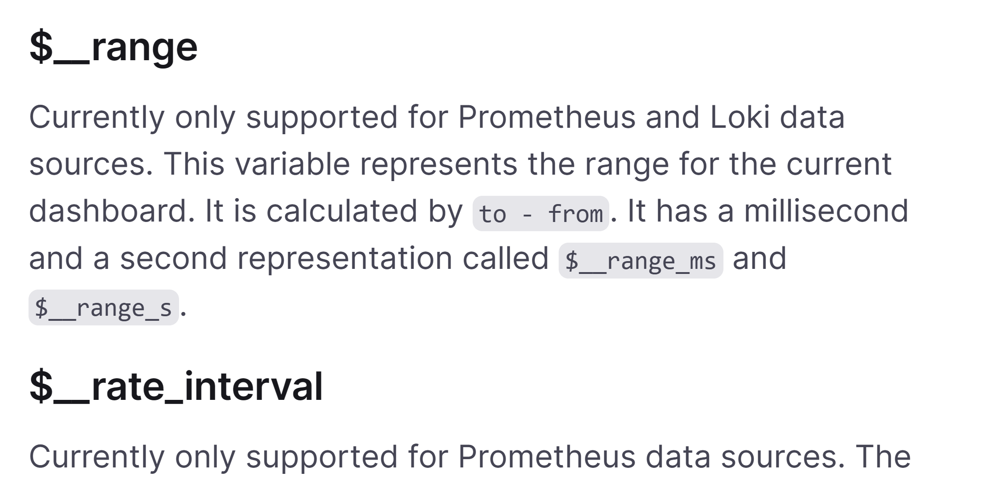
    - 大表格细节展示
        - **Data Transform 可以针对每一个查询的结果进行处理！**
            - reduce：用来简化时间序列
            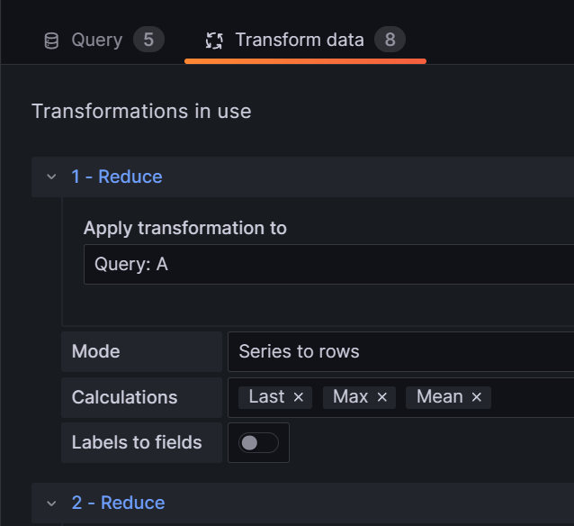
            - join by fileds：可以将两个查询的结果按照某个字段进行合并
            -  Filter data by values：可以根据某个字段的值进行过滤
            - organize fields：可以对table中的列进行排序、重命名
        - override fields：可以对table中具体某一列进行特殊处理，例如设置别名、单位、空值处理等
#### 迭代历程：

## 第七周
### nvestigate how to call own API through grafana alert #35
grafana 一旦触发了 alert 之后，如何调用让 grafana 调用我们自己的接口？

设置告警条件来触发alter：
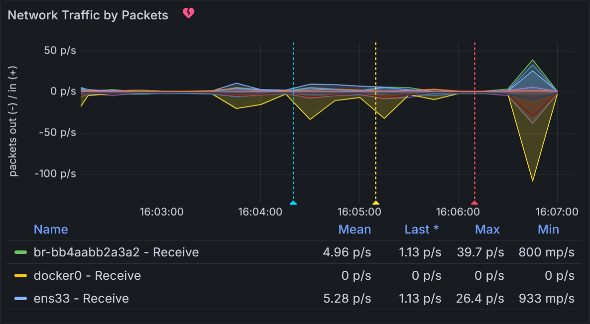
Contact points：
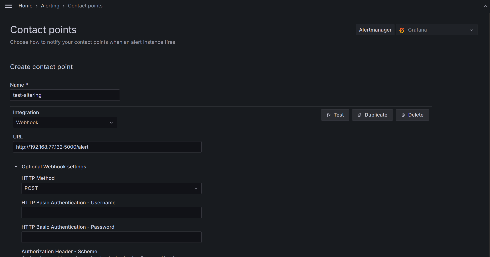
测试：
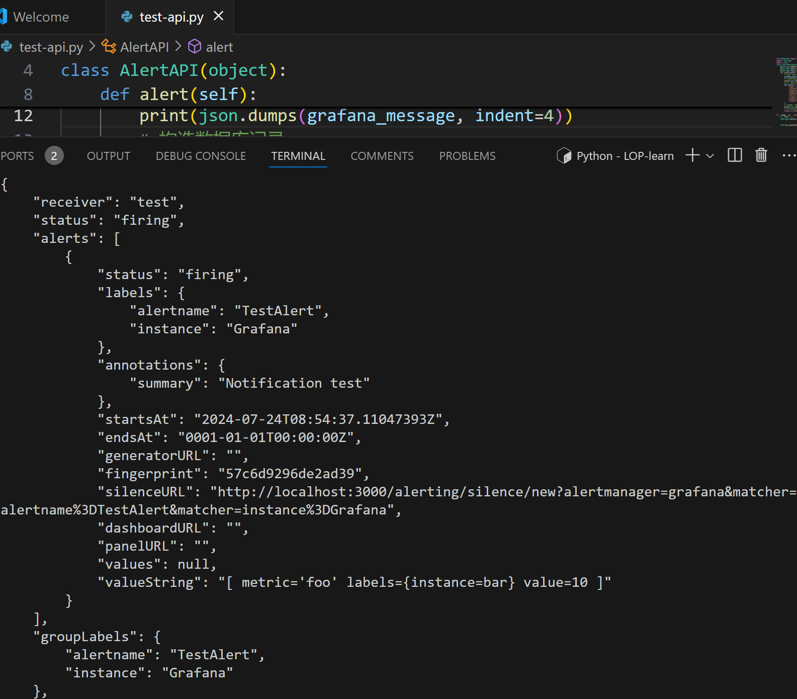

### Design API for alert #36
设计一个我们自己的接口，这个接口的作用是收到grafana 的信息之后，把这个信息转换成我们自己的message，保存数据库

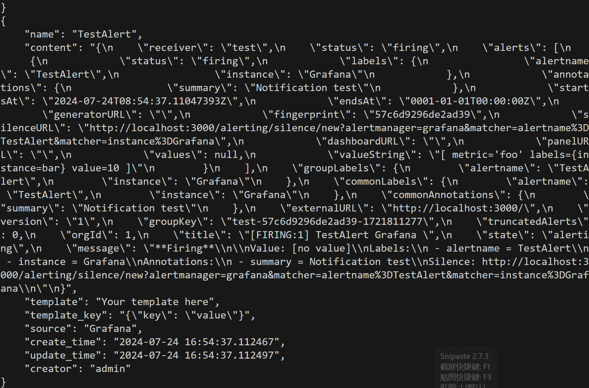

这里面涉及到的是后端我们自己的 message 的数据格式。

接口设计出来之后，要写 API doc，找钥开问一下

接口具体实现后面再说
### 配合前端集成页面
## 第八周
### 重建 Grafana 的 dashboard
很不幸，被覆盖了
### Alert-Manager
- [Alertmanager](https://prometheus.io/docs/alerting/alertmanager/)
## 第九周
在 value 里面 传 cpc name，partition name， cpu rate，还有一个时间戳，这样就能够明确说明 哪个cpc里面的哪个partition在什么时间cpu利用率过高 高达X%

- add alter_controller
- modify message_service

### 备份grafana
## 第十周
grafana 的 webhook 还是 altermanager 的 webhook？

grafana

### 业务逻辑梳理：
后续前后端可能要有一个 alter 接口，用于前端页面显示，点一下跳转前端的 message 页面
前端一般提供给用户来查看 metrics 的时候
后端异步告警，前端查询后端，从后端获取告警信息，提示用户

### 测试过程中的问题及其解决
#### 关于远程的测试机无法访问我本地的服务：
- 使用 ngrok 暴露本地服务端口到公网供测试访问

```shell
ngrok http https://localhost:18443
```
注意：免费版ip不稳定，每次运行都会变。
#### 关于证书的问题：
1. 证书过期了
```shell
# grafana 报错
Failed to send test alert.: Post
"https://xxx:18443/api/v1/message": tls: failed to verifycertificate: x509: certificate has expired or is not yet valid: current time2024-08-09T03:47:01Zis after 2022-06-22T02:58:48Z
```
日志：
```shell
# 容器日志
ssl.SSLError: [SSL: SSLV3_ALERT_BAD_CERTIFICATE] sslv3 alert bad certificate (_ssl.c:1131)
```
```shell
# 容器日志
server.go:3214: http: TLS handshake error from 10.0.2.23:57123: remote error: tls: unknown certificate
```
x.509 证书过期或者未启用，而 grafana 不支持绕过 tls 验证。
重新生成证书，替换之后，遇到新的问题。
2. 证书中不包含IP地址
```shell
# grafana 报错
Failed to send test alert.: Post
"https://xxx:18443/api/v1/auth/token": tls: failed to verifycertificate: x509: cannot validate certificate for xxx because itdoesn't contain any IP SANs
```

- 在 openssl.cnf 中配置 IP 的信息
```shell
[ alt_names ]   
# one Common Name   
DNS.1 = test.ibm.com 
# other extra DNS name   
IP.1 = xx.xx.xx.xx
```
然后基于更新后的 openssl.cnf 重新生成自签名证书。
```sh
openssl req -new -nodes -keyout server.key -out server.csr -config openssl.cnf
openssl x509 -req -days 3650 -in server.csr -signkey server.key -out server.crt -extensions v3_req -extfile openssl.cnf
```

3. 然后报错信息变化了：提示证书是自签名的，不是由可信的CA签发的：
```shell
# grafana 报错
Failed to send test alert.: Post"https://xxx:18443/api/v1/auth/token": tls: failed to verifycertificate: x509: certificate signed by unknown authority (possiblybecause of "crypto/rsa: verification error" while trying to verifycandidate authority certificate "Default Company Ltd"")
```
接下来要做的就是让 grafana 认可我们自己的 CA 证书，这样就可以通过自签名证书来解决问题了。具体来说，需要将自签名证书的 CA 证书添加到 grafana 容器的信任证书列表中。
```shell
docker cp ca.crt grafana:/etc/ssl/certs/ca.crt
docker exec -it grafana /bin/bash
update-ca-certificates
```

问题解决。

### 研究 grafana webhook 提供具体信息的具体设置

https://grafana.com/docs/grafana/latest/alerting/alerting-rules/templating-labels-annotations/

#### alert rules
- 根据查询返回的指标字段，自动提取识别labels，供自定义配置使用
- 告警规则如何针对多个对象？
    - 因为告警规则是在没有仪表板上下文的环境中执行的。因此，你需要修改查询以支持多维度告警，这样 Grafana 可以在告警规则中根据每个分区的 CPU 使用率自动生成告警实例。
- TODO!在同一个告警规则中，如果设置了label不同的多条查询语句，会有明明查询到了非零值，annotation 里却显示为0的问
#### contact points
- 与 alert rules 的关系是多对一
- 只支持的账号密码验证和 token 验证，而且两者不能同时使用
- 不支持绕过 tls 检验
#### notification policies
#### code
- constant.py 新增字典映射，匹配 alertname 到 template_name
- status 的含义是该消息已读/未读
- value 的拼装，labels + value + timestamp + 分析调优建议

## 第十一、十二周（休假）
### 一键备份 grafana 配置
[grafana-backup-tool](https://github.com/ysde/grafana-backup-tool)
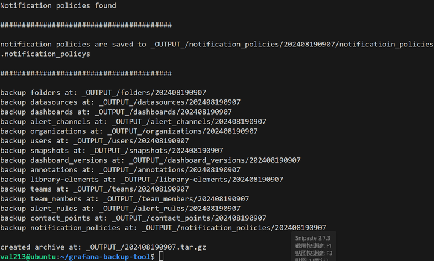
```
docker run --user $(id -u):$(id -g) --rm --name grafana-backup-tool \
           -e GRAFANA_TOKEN= YOUR_TOKEN \
           -e GRAFANA_URL= YOUR_API \
           -e GRAFANA_ADMIN_ACCOUNT= USER \
           -e GRAFANA_ADMIN_PASSWORD= PASSWORD \
           -e VERIFY_SSL= False \
           -v /tmp/backup/ : /opt/grafana-backup-tool/_OUTPUT_  \
           ysde/docker-grafana-backup-tool
```

## 第不知道第几周，项目重启！目标：十月中旬完成MVP和汇报视频
### 后端开发需求设想
#### AI模块
- 【需求对接】跟前端同学商量好以什么形式展示机器学习算法提供的预测结果，这一块可以调研一下其他产品
- 【接口实现】后端利用AI组提供的接口调用，基于上述调研结果形成的需求实现一套提供给前端用户用于跟AI模块交互的接口
- 【AI-后端-前端联调】

#### message模块接口结构优化
如果有时间，后端可以考虑重构一下 message_service 的 process_alter 这个api，提供一个更加通用的接口，不仅能支持CPUAlter，也能支持NetworkAlter等等。

#### grafana 配置network的告警规则
如果时间允许的话能完成这一块，就可以在汇报视频中展示更多的告警规则和情节。也更能满足原先说的客户的需求，不知道能不能搞到更多钱？（）
#### 结项视频制作
- 视频脚本的编写：设置一个情景，讲好一个故事，让观众能够更好地理解项目的背景、需求、解决方案和成果
- 动画制作：通过动画的形式展示项目的流程和结果，让观众更加直观地了解项目的实现过程和效果
- 配音录制：录制配音，为视频增添声音
- 视频剪辑：将录制好的视频和配音进行剪辑，制作成最终的成品

### 数据库连接
```
docker exec -it ecs_db /bin/bash
mysql -h localhost -P 3306 -u root -p
SHOW DATABASES;
USE ecs_api;
SHOW TABLES;
```

### 性能优化
用了https之后网页打开速度特别慢