课程：【CMU 15-445】数据库系统
课本：Database System Concepts, 7th Edition, by Silberschatz, Korth, and Sudarshan
# Chapter 1
- A database-management system (DBMS) consists of a collection of interrelated data and a collection of programs to access those data. The data describe one particular enterprise

>ACID 是数据库管理系统（DBMS）中事务处理的四个关键属性的首字母缩写，分别代表原子性（Atomicity）、一致性（Consistency）、隔离性（Isolation）和持久性（Durability）。这些属性确保了数据库事务的可靠性和数据的完整性。
>**原子性（Atomicity）：**
原子性确保事务中的所有操作要么全部完成，要么全部不完成。换句话说，事务是不可分割的最小工作单元。如果事务中的任何一个操作失败，整个事务将回滚到事务开始前的状态。
例如，在银行转账操作中，资金从一个账户扣除并添加到另一个账户，这两个操作要么都成功，要么都不执行。
>**一致性（Consistency）：**
一致性确保事务在完成时，数据库从一个一致状态转换到另一个一致状态。事务的执行不能违反数据库的完整性约束。
例如，如果数据库有一个约束规定账户余额不能为负数，那么在事务完成后，这个约束仍然必须成立。
>**隔离性（Isolation）：**
隔离性确保并发执行的事务彼此之间不互相干扰。每个事务的中间状态对其他事务是不可见的，事务之间的操作是隔离的。
例如，在一个事务完成之前，其他事务不能看到它的未提交数据。
>**持久性（Durability）：**
持久性确保一旦事务提交，其结果将永久保存在数据库中，即使系统发生故障（如电源故障或崩溃），事务的结果也不会丢失。
例如，一旦银行转账操作成功提交，即使系统崩溃，转账结果也会被保留。
## view of Data
### Data Modles
A collection of tools for describing **data**, **data relationships**, **data semantics**, and consistency **constraints**.
#### Relational Model 关系模型
本文的大部分内容都集中在关系模型上，因为它是大多数数据库应用程序的基础。

关系模型使用一组表来表示数据和这些数据之间的关系。每个表有多个列，每个列有一个惟一的名称。表也被称为关系。关系模型是基于记录的模型的一个例子。基于记录的模型之所以如此命名，是因为数据库是由几种类型的固定格式记录构成的。每个表包含特定类型的记录。每个记录类型定义了固定数量的字段或属性。表的列对应于记录类型的属性。关系数据模型是使用最广泛的数据模型，目前绝大多数数据库系统都是基于关系模型的。

第2章和第7章详细介绍了关系模型
#### Entity-Relationship Model 实体关系（E-R）模型
实体-关系(E-R)数据模型使用一组称为实体的基本对象，以及这些对象之间的关系。实体是现实世界中有别于其他对象的“事物”或“对象”。实体-关系模型在数据库设计中应用广泛。第六章对此进行了详细的探讨。
#### Semi-structured Data Model 半结构化数据模型
半结构化数据模型允许对数据进行规范，其中相同类型的单个数据项可能具有不同的属性集。这与前面提到的数据模型相反，在数据模型中，特定类型的每个数据项必须具有相同的一组属性。JSON和可扩展标记语言(XML)是广泛使用的半结构化数据表示。第8章将详细探讨半结构化数据模型。
#### Object-Based Data Model 基于对象的数据模型
面向对象编程(特别是在Java、c++或c#中)已经成为占主导地位的软件开发方法。这最初导致了一种独特的面向对象数据模型的开发，但是今天对象的概念已经很好地集成到关系数据库中。存在将对象存储在关系表中的标准。数据库系统允许将过程存储在数据库系统中，并由数据库系统执行。这可以看作是用封装、方法和对象标识的概念扩展关系模型。第8章总结了基于对象的数据模型。

### Relational Model
在关系模型中，数据以表的形式表示。每个表有多个列，每个列有一个惟一的名称。表格的每一行代表一条信息。图1.1给出了一个示例关系数据库，其中包含两个表:一个表显示大学教师的详细信息，另一个表显示大学各个院系的详细信息。

例如，第一个表是教员表，它显示了一个ID为22222、名叫Einstein的教员，他是物理系的一员，年薪为95,000美元。例如，第二张表格“部门”显示生物系位于沃森大楼，预算为9万美元。当然，现实世界中的大学会有更多的院系和教师。我们在课文中用小表格来说明概念。可以在网上找到相同模式的更大示例。
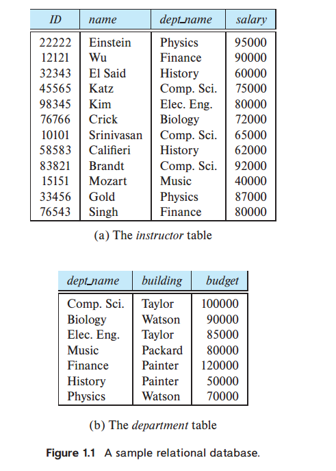
### Data Abstraction
图1.2显示了三个抽象层次之间的关系。
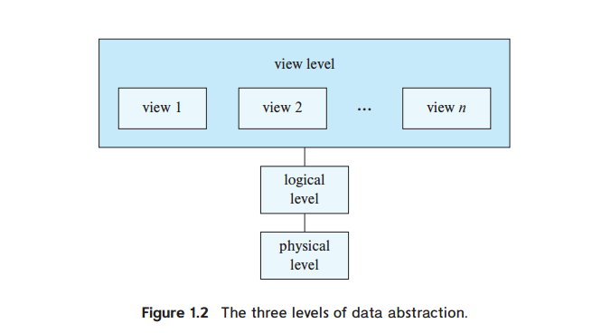
数据库系统允许应用程序开发人员使用数据模型的抽象来存储和检索数据，并将抽象操作转换为低级实现上的操作。

对编程语言中数据类型概念的类比可以澄清抽象级别之间的区别。许多高级编程语言都支持结构化类型的概念。例如C中的结构体，C++中的类，Java中的类。结构化类型允许程序员定义新的数据类型，这些数据类型由多个字段组成。

在物理层，教员、院系或学生的记录可以被描述为一个连续的字节块。编译器对程序员隐藏了这一层次的细节。类似地，数据库系统对数据库程序员隐藏了许多最底层的存储细节。另一方面，数据库管理员可能知道数据的物理组织的某些细节。例如，有许多可能的方法将表存储在文件中。一种方法是将表存储为文件中的记录序列，使用特殊字符(例如逗号)来分隔记录的不同属性，并且可以使用另一个特殊字符(例如换行字符)来分隔记录。如果所有属性都有固定的长度，那么属性的长度可以单独存储，并且可以从文件中省略分隔符。可变长度属性可以通过存储长度，然后存储数据来处理。数据库使用一种称为索引的数据结构来支持对记录的有效检索;这些也构成了物理层的一部分。

在逻辑级别上，每个这样的记录由类型定义描述，如前面的代码段所示。这些记录类型的相互关系也在逻辑级别上定义;教员记录的部门名称值必须出现在部门表中的要求就是这种相互关系的一个例子。使用编程语言的程序员在这个抽象层次上工作。类似地，数据库管理员通常在这个抽象级别上工作。

最后，在视图层，计算机用户看到一组隐藏数据类型细节的应用程序。在视图级别，定义了数据库的几个视图，数据库用户可以看到其中的一些或全部视图。除了隐藏数据库逻辑级别的详细信息外，视图还提供了一种安全机制，以防止用户访问数据库的某些部分。例如，大学注册办公室的职员只能看到数据库中有学生信息的那部分;他们无法获得有关教师工资的信息。
### Instances and Schemas 实例和模式
数据库随着信息的插入和删除而变化。在特定时刻存储在数据库中的信息集合称为数据库的实例。数据库的总体设计称为数据库模式。数据库模式和实例的概念可以类比为用编程语言编写的程序来理解。数据库模式对应于程序中的变量声明(以及相关的类型定义)。每个变量在给定的时刻都有一个特定的值。程序中变量的值在某个时间点对应于数据库模式的实例。

数据库系统有几个模式，根据抽象级别进行分区。物理模式在物理层描述数据库设计，而逻辑模式在逻辑层描述数据库设计。数据库在视图级别也可能有多个模式(有时称为子模式)，它们描述数据库的不同视图。

## Database Languages
数据库系统提供数据定义语言DDL (data-definition language)来指定数据库模式，提供数据操作语言DML (data-manipulation language)来表达数据库查询和更新。实际上，数据定义语言和数据操作语言并不是两种独立的语言;相反，它们只是构成单一数据库语言的一部分，比如SQL语言。几乎所有的关系数据库系统都使用SQL语言，我们将在第3章、第4章和第5章详细介绍。
### DDL
我们通过一组由称为数据定义语言(DDL)的特殊语言表示的定义来指定数据库模式。DDL还用于指定数据的其他属性。

我们通过一组语句指定数据库系统使用的存储结构和访问方法，这些语句使用一种称为数据存储和定义语言的特殊DDL类型。这些语句定义了数据库模式的实现细节，这些细节通常对用户是隐藏的。

存储在数据库中的数据值必须满足一定的一致性约束。

例如，假设大学要求某个部门的账户余额永远不能为负。DDL提供了指定此类约束的工具。数据库系统在每次更新数据库时检查这些约束。通常，约束可以是属于数据库的任意谓词。但是，任意谓词的测试成本可能很高。因此，数据库系统只实现那些可以用最小开销测试的完整性约束:
- Domain constraints: 指定每个属性的允许值的范围。
每个属性（例如，整数类型、字符类型、日期/时间类型）都必须与一个可能值的域相关联。将属性声明为特定域可作为对其可采用的值的约束。域约束是完整性约束的最基本形式。每当有新数据项输入数据库时​​，系统都可以轻松地测试它们。
- Referential integrity: 指定两个关系之间的参照完整性。
在某些情况下，我们希望确保出现在给定属性集的一个关系中的值也出现在另一个关系中的某组属性中（参照完整性）。例如，每门课程列出的部门必须是大学中实际存在的部门。更准确地说，课程记录中的部门名称值必须出现在部门关系中某些记录的部门名称属性中。数据库修改可能导致违反参照完整性。当违反参照完整性约束时，正常程序是拒绝导致违规的操作。
- Authorization: 指定哪些用户有权访问数据。
我们可能希望根据用户对数据库中各种数据值的访问权限类型来区分用户。这些区别以授权的形式表达，最常见的是：读取授权，允许读取数据，但不允许修改数据；插入授权，允许插入新数据，但不允许修改现有数据；更新授权，允许修改数据，但不允许删除数据；删除授权，允许删除数据。我们可以为用户分配所有、不分配或这些类型的授权的组合。

DDL 语句的处理，就像任何其他编程语言的语句一样，会产生一些输出。DDL 的输出放在数据字典中，其中包含元数据，即有关数据的数据。数据字典被视为一种特殊类型的表，只能由数据库系统本身（而不是普通用户）访问和更新。数据库系统在读取或修改实际数据之前会查阅数据字典。
### The SQL Data-Definition Language
最常见的sql文件中的语句。略。
###  Data-Manipulation Language
数据操作语言(DML)是一种使用户能够访问或操作由适当数据模型组织的数据的语言。访问的类型有:
- 检索存储在数据库中的信息。
- 将新信息插入数据库。
- 删除数据库中的信息。
- 修改存储在数据库中的信息。
基本上有两种类型的数据操作语言:
- Declarative DMLs （过程性 DML） 要求用户指定需要什么数据以及如何获得这些数据。
- Declarative DMLs （声明性 DML，也称为非过程性dml）要求用户指定需要哪些数据，而不指定如何获取这些数据。
###  Database Access from Application Programs
数据库系统提供了一种接口，使应用程序可以访问数据库。这种接口允许应用程序员指定数据库操作，而不必关心数据存储和检索的细节。

非过程查询语言（例如 SQL）不如通用图灵机强大；也就是说，有些计算可以使用通用编程语言进行，但使用 SQL 则无法完成。SQL 也不支持用户输入、显示输出或网络通信等操作。此类计算和操作必须用宿主语言（例如 C/C++、Java 或 Python）编写，并嵌入 SQL 查询以访问数据库中的数据。

应用程序是用于以这种方式与数据库交互的程序。大学系统中的示例是允许学生注册课程、生成班级名册、计算学生 GPA、生成工资支票和执行其他任务的程序。

要访问数据库，需要将DML语句从主机发送到数据库，在那里它们将被执行。这通常是通过使用应用程序编程接口来实现的，该接口可用于向数据库发送DML和DDL语句并检索结果。开放数据库连接(Open Database Connectivity, ODBC)标准定义了与C和其他几种语言一起使用的应用程序编程接口。Java数据库连接(JDBC)标准为Java语言定义了相应的接口。

## Database Design
高级数据模型为数据库设计人员提供了一个概念框架，用于指定数据库用户的数据需求以及如何构建数据库以满足这些需求。数据库设计的初始阶段是充分描述潜在数据库用户的数据需求。数据库设计人员需要与领域专家和用户进行广泛的互动才能完成这项任务。此阶段的结果是用户需求的规范。接下来，设计人员选择一个数据模型，并通过应用所选数据模型的概念，将这些需求转化为数据库的概念模式。在此概念设计阶段开发的模式提供了企业的详细概述。设计人员审查该模式以确认所有数据需求确实得到满足并且彼此不冲突。设计人员还可以检查设计以删除任何冗余功能。此时的重点是描述数据及其关系，而不是指定物理存储细节。

就关系模型而言，概念设计过程涉及到我们希望在数据库中捕获哪些属性以及如何将这些属性分组以形成各种表的决策。“What”部分基本上是一个业务决策，我们将在本文中进一步讨论它。“How”部分主要是一个计算机科学问题。解决这个问题主要有两种方法。第一种是使用实体-关系模型(第6章);另一种是采用一组算法(统称为规范化)，将所有属性集合作为输入并生成一组表(第7章)。

一个完全开发的概念模式表明了企业的功能需求。在功能需求规范中，用户描述将对数据执行的操作（或事务）类型。示例操作包括修改或更新数据、搜索和检索特定数据以及删除数据。在概念设计的这个阶段，设计人员可以检查模式以确保它满足功能要求。从抽象数据模型转移到数据库实现的过程分为两个最终设计阶段。在逻辑设计阶段，设计人员将高级概念模式映射到将要使用的数据库系统的实现数据模型上。设计人员在随后的物理设计阶段使用生成的系统特定数据库模式，在此阶段指定数据库的物理特性。这些特性包括文件组织形式和内部存储结构；它们将在第 13 章中讨论。

## Database Engine
数据库系统被划分为处理整个系统各项职责的模块。数据库系统的功能组件大致可分为**存储管理器、查询处理器组件和事务管理组件**。

**The storage manager** 存储管理器非常重要，因为数据库通常需要大量的存储空间。企业数据库的大小通常从数百 GB 到数 TB 不等。1 GB 大约等于 10 亿字节，即 1000 兆字节（更准确地说是 1024 兆字节），而 TB 大约等于 1 万亿字节或 100 万兆字节（更准确地说是 1024 GB）。最大的企业拥有的数据库达到数 PB 级（1 PB 等于 1024 TB）。由于计算机的主内存无法存储这么多信息，并且主内存的内容在系统崩溃时会丢失，因此信息存储在磁盘上。数据会根据需要在磁盘存储和主内存之间移动。由于数据进出磁盘的移动速度相对于中央处理器的速度较慢，因此数据库系统必须对数据进行结构化，以尽量减少在磁盘和主内存之间移动数据的需要。固态磁盘 (SSD) 越来越多地用于数据库存储。SSD 比传统磁盘更快，但成本也更高。

**The query processor** 查询处理器很重要，因为它帮助数据库系统简化和方便对数据的访问。查询处理器允许数据库用户获得良好的性能，同时能够在视图级别上工作，而不必负担理解系统实现的物理层细节。数据库系统的工作是在逻辑层将用非过程性语言编写的更新和查询转换为物理层的高效操作序列。

**The transaction manager** 事务管理器很重要，因为它允许应用程序开发人员将一系列数据库访问视为一个单元，要么全部发生，要么根本不发生。这允许应用程序开发人员在更高层次上思考应用程序，而无需关心管理并发访问数据和系统故障的影响的较低层次的细节。

虽然数据库引擎传统上是集中式计算机系统，但如今并行处理是高效处理大量数据的关键。现代数据库引擎非常重视并行数据存储和并行查询处理。
### Storage Manager
存储管理器子系统提供数据库中存储的低级数据与提交给系统的应用程序和查询之间的接口。
- Authorization and integrity manager 授权和完整性管理器，用于测试是否满足完整性约束并检查用户访问数据的权限。

- Transaction manager 事务管理器，它确保数据库在系统故障时保持一致(正确)状态，并发事务执行无冲突地进行。

- File manager 文件管理器，它管理磁盘存储空间的分配和用于表示存储在磁盘上的信息的数据结构。

- Buffer manager 缓冲区管理器，负责从磁盘存储中提取数据到主存，并决定在主存中缓存哪些数据。缓冲区管理器是数据库系统的关键部分，因为它使数据库能够处理比主内存大得多的数据大小。

存储管理器在物理系统实现过程中实现了几种数据结构：
- Data files 数据文件，用于存储数据库本身。
- Data dictionary 数据字典，用于存储有关数据库结构（特别是数据库模式）的元数据。
- Indices 索引，用于快速访问数据项。与本教科书中的索引一样，数据库索引提供指向包含特定值的数据项的指针。
例如，我们可以使用索引查找具有特定 ID 的讲师记录，或具有特定名称的所有讲师记录。
我们在第 12 章和第 13 章中讨论了存储介质、文件结构和缓冲区管理。第 14 章讨论了有效访问数据的方法
### Query Processor
查询处理器子系统编译并执行 DDL 和 DML 语句。
查询处理器组件包括：
- DDL interpreter DDL 解释器，解释 DDL 语句并将定义记录在
数据字典中。
- DML compiler DML 编译器，将查询语言中的 DML 语句转换为由查询评估引擎
理解的低级指令组成的评估计划。查询通常可以转换为许多备选评估计划中的任何一个，这些计划都给出相同的结果。DML 编译器还执行**查询优化**；也就是说，它从备选方案中选择成本最低的评估计划。
- Query evaluation engine 查询评估引擎，执行由 DML 编译器生成的低级指令

Query evaluation 将在第15章中介绍，而查询优化器从可能的求值策略中选择的方法将在第16章中讨论
### Transaction Manager
事务管理确保数据库在系统发生故障时仍保持一致（正确）状态。事务管理器确保并发事务执行不会发生冲突。

事务是数据库应用程序中执行单个逻辑功能的操作的集合。每个事务都是原子性和一致性的单位。因此，我们要求事务不违反任何数据库一致性约束。也就是说，如果事务开始时数据库是一致的，则事务成功终止时数据库也必须是一致的。但是，在执行事务期间，可能需要暂时允许不一致，因为 A 的借记或 B 的贷记必须先于另一个完成。这种暂时的不一致虽然是必要的，但如果发生故障，可能会导致困难。

确保原子性和持久性属性是数据库系统本身的责任 - 具体来说，是**恢复管理器**的责任。在没有故障的情况下，所有事务都会成功完成，并且很容易实现原子性。但是，由于各种类型的故障，事务可能并不总是成功完成其执行。如果我们要确保原子性属性，则失败的事务必须对数据库的状态没有影响。因此，必须将数据库恢复到相关事务开始执行之前的状态。因此，数据库系统必须执行故障恢复，即它必须检测系统故障并将数据库恢复到故障发生之前的状态。

最后，当多个事务同时更新数据库时，即使每个单独的事务都是正确的，数据的一致性也可能不再得到保持。并发控制管理器负责控制并发事务之间的交互，以确保数据库的一致性。

事务管理器由并发控制管理器和恢复管理器组成(concurrency-control manager and the recovery manager)。

第 17 章介绍了事务处理的基本概念。第 18 章介绍了并发事务的管理。第 19 章详细介绍了故障恢复。

事务的概念已广泛应用于数据库系统和应用程序中。虽然事务最初是在金融应用程序中使用，但现在该概念已用于电信的实时应用程序，以及产品设计或管理工作流等长期活动的管理。
## Database and Application Architecture
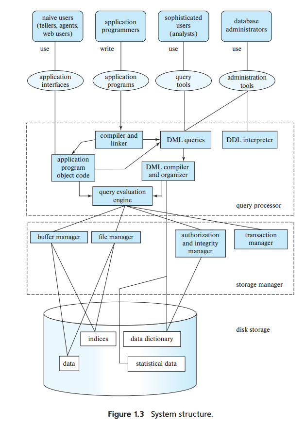
图 1.3 所示的集中式架构适用于共享内存服务器架构，这种架构具有多个 CPU 并利用并行处理，但所有 CPU 都访问一个公共共享内存。为了扩展到更大的数据量和更高的处理速度，并行数据库被设计为在由多台机器组成的集群上运行。此外，分布式数据库允许跨多个地理上分离的机器进行数据存储和查询处理。

在第20章中，我们将介绍现代计算机系统的一般结构，重点是并行系统体系结构。第21章和第22章描述了如何实现查询处理来利用并行和分布式处理。第23章介绍了在并行或分布式数据库中处理事务时出现的一些问题，并描述了如何处理每个问题。这些问题包括如何存储数据、如何确保在多个站点执行的事务的原子性、如何执行并发控制以及如何在出现故障时提供高可用性。


我们现在考虑使用数据库作为后端的应用程序的体系结构。数据库应用程序可以划分为两个或三个部分，如图1.4所示。早期的数据库应用程序使用两层体系结构，其中应用程序驻留在客户机机器上，并通过查询语言语句调用服务器机器上的数据库系统功能。


相比之下，现代数据库应用程序使用三层体系结构，其中客户机仅充当前端，不包含任何直接的数据库调用;Web浏览器和移动应用程序是当今最常用的应用程序客户机。前端与应用服务器通信。反过来，应用服务器与数据库系统通信以访问数据。应用程序的业务逻辑(说明在什么条件下执行什么操作)嵌入到应用程序服务器中，而不是分布在多个客户机上。三层应用程序比两层应用程序提供更好的安全性和性能。
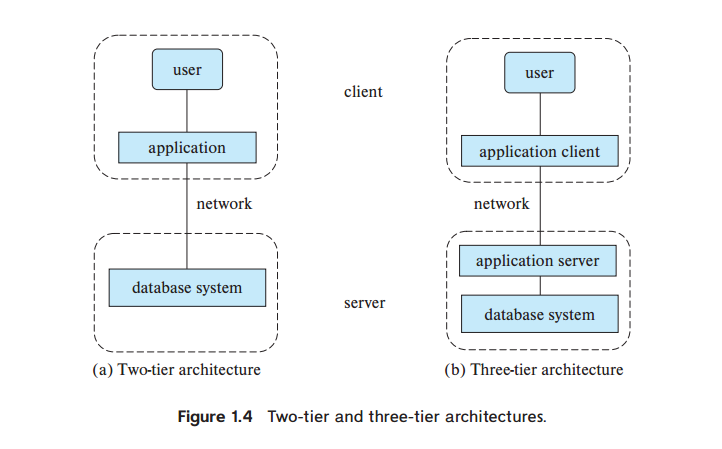
## Database Users and Administrators
数据库系统的主要目标是从数据库中检索信息并将新信息存储在数据库中。使用数据库的人可以分为数据库用户或数据库管理员。
### Database Users and User Interfaces
有四种不同类型的数据库系统用户，根据他们期望与系统交互的方式进行区分。针对不同类型的用户，设计了不同类型的用户界面。
- Native 用户是通过使用预定义的用户界面(如web或移动应用程序)与系统交互的简单用户。Native 用户的典型用户界面是 web 表单界面，用户可以在其中填写表单的适当字段。Native 用户还可以查看从数据库生成的已读报告。
- 应用程序程序员是编写应用程序的计算机专业人员。应用程序程序员可以从许多工具中选择开发用户界面。
- 资深用户无需编写程序即可与系统交互。相反，他们使用数据库查询语言或使用数据分析软件等工具来形成请求。提交查询以探索数据库中的数据的分析师属于这一类
### Database Administrator
使用 DBMS 的主要原因之一是可以集中控制数据和访问这些数据的程序。对系统具有这种集中控制权的人称为数据库管理员 (DBA)。DBA 的功能包括：
- Schema definition. 模式定义。DBA 通过执行 DDL 中的一组数据定义语句来创建原始数据库模式。
- 存储结构和访问方法定义。DBA 可以指定一些与数据的物理组织和要创建的索引有关的参数。
- Schema and physical-organization modification. 模式和物理组织修改。DBA 对模式和物理组织进行更改以反映组织不断变化的需求，或更改物理组织以提高性能。
- Granting of authorization for data access. 授予数据访问授权。通过授予不同类型的授权，数据库管理员可以规定不同用户可以访问数据库的哪些部分。授权信息保存在一个特殊的系统结构中，每当用户尝试访问系统中的数据时，数据库系统都会查阅该结构。
- Routine maintenance. 日常维护。数据库管理员的日常维护活动示例包括：    
    - 定期将数据库备份到远程服务器，以防止在发生洪水等灾难时丢失数据。
    - 确保有足够的可用磁盘空间用于正常操作，并根据需要升级磁盘空间。
    - 监控数据库上运行的作业，并确保性能不会因某些用户提交的非常昂贵的任务而降低。
## History of Database Systems
20 世纪 70 年代末和 80 年代：尽管关系模型在学术上很有趣，但由于其性能缺陷，最初并未在实践中使用；关系数据库无法与现有的网络和层次化数据库的性能相匹配。随着 System R 的出现，这种情况发生了改变，这是 IBM 研究部门的一个开创性项目，开发了构建高效关系数据库系统的技术。功能齐全的 System R 原型促成了 IBM 的第一款关系数据库产品 SQL/DS 的诞生。与此同时，加州大学伯克利分校正在开发 Ingres 系统。它促成了同名的商业产品。同样在这个时候，Oracle 的第一个版本也发布了。最初的商业关系数据库系统（如 IBM DB2、Oracle、Ingres 和 DEC Rdb）在推进高效处理声明式查询的技术方面发挥了重要作用。到 20 世纪 80 年代初，关系数据库甚至在性能方面也与网络和分层数据库系统相媲美。关系数据库非常易于使用，最终取代了网络和分层数据库。

2000 年代：在此期间，存储在数据库系统中的数据类型发展迅速。半结构化数据变得越来越重要。XML 成为数据交换标准。JSON 是一种更紧凑的数据交换格式，非常适合存储来自 JavaScript 或其他编程语言的对象，随后变得越来越重要。随着主要商业系统增加了对 XML 和 JSON 格式的支持，越来越多的此类数据存储在关系数据库系统中。空间数据（即包含地理信息的数据）在导航系统和高级应用程序中得到广泛使用。数据库系统增加了对此类数据的支持。开源数据库系统（尤其是 PostgreSQL 和 MySQL）的使用率不断提高。数据库系统添加了“自动管理”功能，以便自动重新配置以适应不断变化的工作负载。这有助于减少管理数据库的人工工作量。

社交网络平台发展迅速，需要管理有关人们与其发布数据之间联系的数据，而这些数据并不适合表格行列格式。这导致了图形数据库的发展。
在本世纪后期，数据分析和数据挖掘在企业中的使用变得无处不在。数据库系统是专门为服务于这个市场而开发的。这些系统具有适合分析处理的物理数据组织，例如“列存储”，其中表格按列存储，而不是主要商业数据库系统的传统行式存储。
庞大的数据量，以及用于分析的大部分数据是文本或半结构化数据的事实，导致了 map-reduce 等编程框架的开发，以方便应用程序程序员使用并行性来分析数据。随着时间的推移，对这些功能的支持迁移到了传统数据库系统中。即使在 2010 年代后期，数据库研究界仍在争论一个数据库系统同时服务于传统事务处理应用程序和较新的数据分析应用程序与为这些角色维护单独的系统之间的相对优缺点。

各种新的数据密集型应用程序和快速开发的需求，尤其是初创公司的需求，导致了提供轻量级数据管理形式的“NoSQL”系统的出现。这个名字源于这些系统缺乏对无处不在的数据库查询语言 SQL 的支持，尽管这个名字现在通常被视为“不仅仅是 SQL”。由于缺乏基于关系模型的高级查询语言，程序员可以更灵活地处理新类型的数据。由于传统数据库系统不支持严格的数据一致性，因此应用程序使用分布式数据存储时可以更加灵活。NoSQL 的“最终一致性”模型允许数据的分布式副本不一致，只要它们最终会在没有进一步更新的情况下收敛即可。

# Chapter 2: Introduction to the Relational Model

## Structure of Relational Databases
关系数据库由一组表组成，每个表都有一个唯一的名称。

因此，在关系模型中，术语关系用于指代表，而术语元组用于指代行。类似地，术语属性指的是表中的一列。

我们使用术语“关系实例”来指代关系的特定实例，也就是说，它包含一组特定的行。图2.1所示的教员实例有12个元组，对应12个教员。

我们要求，对于所有关系r, r的所有属性的域都是原子的。

如果域的元素被认为是不可分割的单元，那么域就是原子的。

例如，假设表教练有一个属性电话号码，该属性可以存储与教练对应的一组电话号码。那么电话号码的域就不是原子的，因为域的元素是电话号码的集合，并且它有子部分，即集合中的单个电话号码。

重要的问题不是域本身是什么，而是我们如何在数据库中使用域元素。现在假设电话号码属性存储单个电话号码。即使这样，如果我们将电话号码属性的值拆分为国家代码、地区代码和本地号码，我们也会将其视为非原子值。如果我们将每个电话号码视为单个不可分割的单元，那么属性电话号码将具有一个原子域。

null值是一个特殊值，表示该值未知或不存在。例如，假设和前面一样，我们在教员关系中包含了属性电话号码。可能是教师根本没有电话号码，或者电话号码没有列出。然后，我们必须使用空值来表示该值未知或不存在。稍后我们将看到，当我们访问或更新数据库时，空值会导致许多困难，因此应该尽可能消除空值。我们首先假定空值不存在，在第3.6节中，我们将描述空值对不同操作的影响。

我们将看到，相对严格的关系结构在数据存储和处理方面带来了几个重要的实际优势。这种严格的结构适合定义良好且相对静态的应用程序，但不太适合不仅数据而且这些数据的类型和结构都随时间变化的应用程序。现代企业需要在结构化数据的效率和预定结构受限的情况之间找到良好的平衡。
## Database Schema
当我们谈论数据库时，我们必须区分数据库模式和数据库实例，前者是数据库的逻辑设计，后者是数据库中数据在给定时刻的快照。

关系（relation）的概念对应于变量的编程语言概念，而关系模式（relation schema）的概念对应于类型定义的编程语言概念。给定变量的值可能随时间变化;类似地，关系实例的内容可能随着关系的更新而改变。相反，关系的模式通常不会改变。

## Keys
我们必须有一种方法来指定如何区分给定关系中的元组。

这是用它们的属性来表示的。也就是说，元组的属性值的值必须能够唯一地标识该元组。换句话说，关系中的两个元组不允许对所有属性具有完全相同的值超键是一个或多个属性的集合，这些属性使我们能够在关系中唯一地标识一个元组。例如，关系指示器的ID属性足以区分一个指示器元组和另一个指示器元组。因此，ID是一个超级键。另一方面，instructor的name属性不是超级键，因为多个讲师可能具有相同的名称。

形式上，设R表示关系R模式中的属性集。如果我们说R的子集K是R的超键，我们将考虑限制在关系R的实例上，其中没有两个不同的元组在K的所有属性上具有相同的值。

也就是说，如果t1和t2在r中并且t1≠t2，那么t1。K≠t2。

A **superkey** may contain extraneous attributes. For example, the combination of ID and name is a superkey for the relation instructor. If K is a superkey, then so is any superset of K. We are often interested in superkeys for which no proper subset is a superkey. Such minimal superkeys are called candidate keys. 如果K是一个超键，那么K的任何超集也是一个超键。我们经常感兴趣的是那些没有合适子集是超键的超键。这样的最小超键称为候选键。

可能有几个不同的属性集可以作为候选键。

假设名称和部门名称的组合足以区分教员关系的成员。然后，{ID}和{name, dept name}都是候选键。虽然属性ID和name一起可以区分讲师元组，但它们的组合{ID, name}并不能形成候选键，因为属性ID本身就是一个候选键。

We shall use the term **primary key** to denote a candidate key that is chosen by the database designer as the principal means of dentifying tuples within a relation. A key (whether **primary**, **candidate**, or **super**) is a property of the entire relation, rather than of the individual tuples. Any two individual tuples in the relation are prohibited from having the same value on the key attributes at the same time. The designation of a key represents a constraint in the real-world enterprise being modeled. Thus, **primary keys are also referred to as primary key constraints**.

接下来，我们考虑对关系内容的另一种类型的约束，称为外键约束（foreign-key constraint）。考虑讲师关系的属性dept name。如果讲师中的元组的dept name值与部门关系中的部门不对应，则没有意义。因此，在任何数据库实例中，给定教员关系中的任意元组(例如ta)，在部门关系中必须存在某个元组(例如tb)，使得ta的dept name属性的值与tb的主键dept name的值相同。

A **foreign-key constraint** from attribute(s) A of relation r1 to the primary-key B of relation r2 states that on any database instance, the value of A for each tuple in r1 must also be the value of B for some tuple in r2. Attribute set A is called a **foreign key** from r1, referencing r2. The relation r1 is also called the **referencing relation** of the foreign-key constraint, and r2 is called the **referenced relation**.

注意，在外键约束中，被引用的属性必须是被引用关系的主键。更一般的情况是，引用完整性约束（referential integrity constraint）放宽了引用属性构成引用关系主键的要求。

**引用完整性约束（Referential Integrity Constraint）** 的基本概念：引用完整性约束确保数据库中的关系（表）之间的数据一致性。具体来说，它要求在一个关系（表）中的某些属性（列）中的值必须在另一个关系（表）中的某些属性（列）中存在。

- 引用关系（Referencing Relation）：
    - 这是包含外键（Foreign Key）的关系（表）。外键是一个或多个属性（列），它们引用另一个关系（表）的主键（Primary Key）。
- 被引用关系（Referenced Relation）：
    - 这是被外键引用的关系（表）。被引用的属性通常是主键或具有唯一约束的属性。

引用完整性约束的要求
- 外键约束：在引用关系中的外键属性的值必须在被引用关系的主键属性中存在。
- 数据一致性：这确保了引用关系中的每个外键值都能在被引用关系中找到对应的主键值。

事实上，外键约束是引用完整性约束的一种特殊情况，其中引用的属性构成引用关系的主键。目前的数据库系统通常支持外键约束，但是它们不支持引用的属性不是主键的引用完整性约束。

## Schema Diagrams
数据库模式以及主键和外键约束可以通过模式图来描述。图2.9显示了我们大学组织的架构图。每个关系显示为一个框，关系名称以蓝色显示在顶部，框内列出了属性。

主键属性用下划线显示。外键约束以箭头的形式显示，从引用关系的外键属性指向被引用关系的主键。我们使用双头箭头(而不是单头箭头)来指示不是外键约束的引用完整性约束。

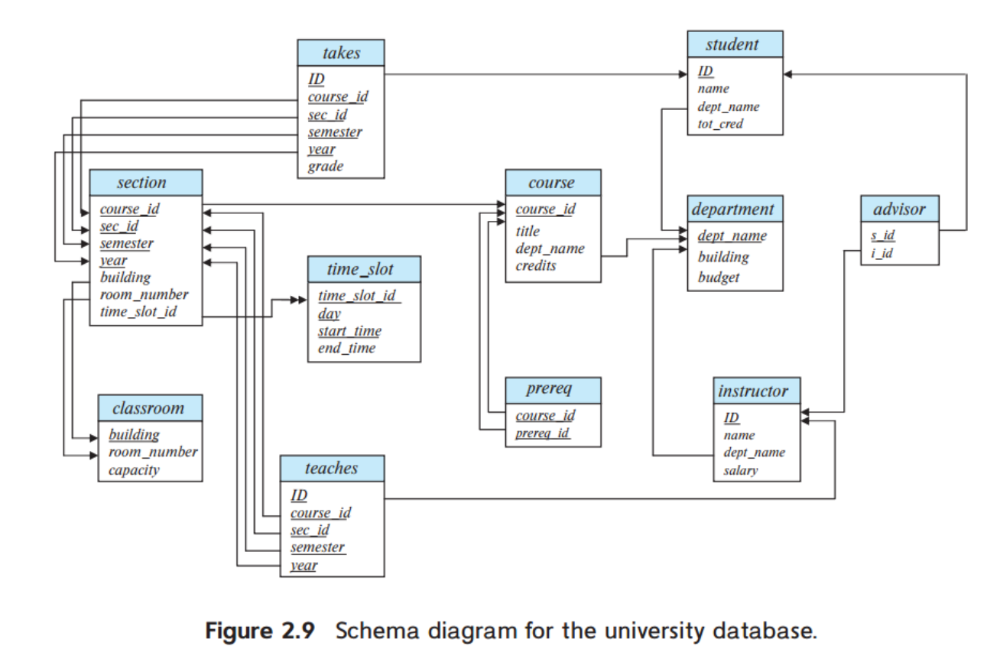

我们将在第6章详细讨论模式的另一种图解表示，称为实体-关系图;虽然在外观上有一些相似之处，但这两种符号有很大的不同，不应相互混淆。

## Relational Query Languages
查询语言是用户从数据库请求信息时使用的语言。

这些语言通常在比标准编程语言更高的级别上。查询语言可以分为**命令式、函数式和声明式**。

在**命令式查询语言**中，用户指示系统对数据库执行特定的操作序列以计算期望的结果;这种语言通常有状态变量的概念，在计算过程中更新状态变量。

在**函数查询语言**中，计算被表示为对可能对数据库中的数据或对其他函数的结果进行操作的函数的求值;函数没有副作用，也不会更新程序状态在声明性查询语言中，用户描述所需的信息，而不给出获取该信息的特定步骤序列或函数调用;所需的信息通常使用某种形式的数学逻辑来描述。如何获取所需的信息是数据库系统的工作。


有许多“纯”查询语言。

- 我们在2.6节中描述的关系代数是一种函数式查询语言关系代数构成了SQL查询语言的理论基础。

- 我们在第27章描述的元组关系演算和域关系演算是声明性的。

这些查询语言简洁而正式，缺乏商业语言的“语法糖”，但它们演示了从数据库中提取数据的基本技术。

在实践中使用的查询语言，如SQL查询语言，包括命令式、函数式和声明式方法的元素。在第三章到第五章中，我们会学习使用非常广泛的查询语言SQL。

## The Relational Algebra 关系代数
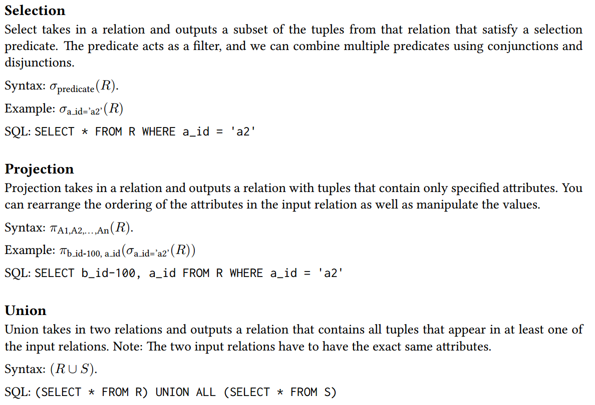
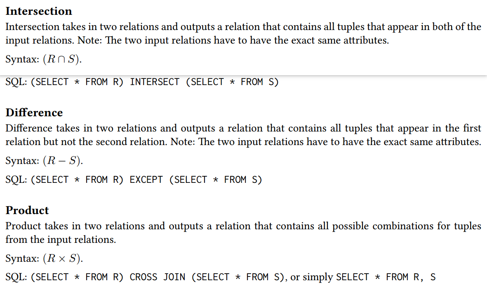
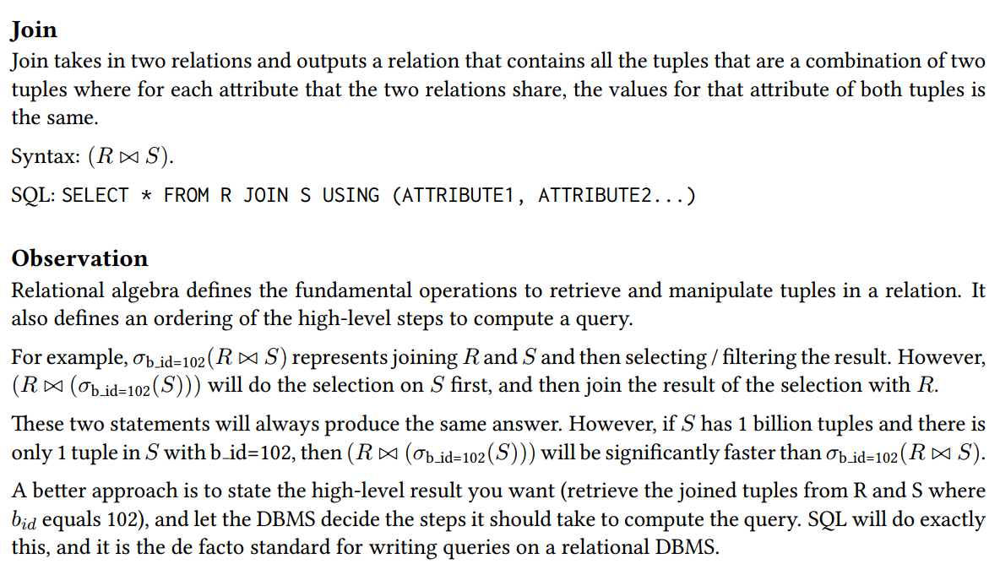
### The Select Operation
select操作返回一个关系，该关系包含从输入关系中选择的元组。这些元组由选择条件指定。如果选择条件为空，则输出关系将包含与输入关系相同的元组。如果输入关系为空，则输出关系也为空。
### The Project Operation
project操作返回一个关系，该关系包含从输入关系中选择的属性的元组。这些属性由属性列表指定。如果输入关系中有多个元组具有相同的属性值，则输出关系中只包含一个这样的元组。如果属性列表为空，则输出关系将包含一个元组，该元组的属性值为空。如果输入关系为空，则输出关系也为空。
### Composition of Relational Operations
关系代数操作可以组合在一起。例如，可以将选择操作和投影操作组合在一起，以便选择一个关系的属性的子集，并且只包含满足某些条件的元组。这种组合称为查询计划。查询计划是一个关系代数表达式，它描述了如何从输入关系生成输出关系。查询计划可以包含一个或多个关系代数操作，这些操作以某种顺序应用于输入关系。例如，可以选择一个关系的属性的子集，然后选择满足某些条件的元组。这种组合称为查询计划。查询计划是一个关系代数表达式，它描述了如何从输入关系生成输出关系。查询计划可以包含一个或多个关系代数操作，这些操作以某种顺序应用于输入关系。
### The Cartesian-Product Operation
笛卡尔积操作返回一个关系，该关系包含两个输入关系的所有可能的元组的组合。笛卡尔积操作是关系代数中最基本的操作之一。如果两个输入关系都为空，则输出关系也为空。
### The Join Operation
join操作返回一个关系，该关系包含两个输入关系的元组的连接。连接是两个元组的笛卡尔积的子集，这两个元组满足某些连接条件。连接条件是两个关系的属性之间的等式。如果两个关系的属性之间没有等式，则连接条件为空，输出关系将包含两个输入关系的笛卡尔积。如果两个输入关系都为空，则输出关系也为空。
### Set Operations
关系代数支持集合操作，例如并集、交集和差集。并集操作返回两个关系的并集，交集操作返回两个关系的交集，差集操作返回两个关系的差集
### The Assignment Operation
assignment操作将一个关系的结果分配给一个关系变量。关系变量是一个关系的名称，它可以用于表示关系的结果。关系变量可以用作关系代数表达式的输入。例如，可以将一个关系的结果分配给一个关系变量，然后使用该关系变量作为另一个关系的输入。关系变量可以用作关系代数表达式的输入。例如，可以将一个关系的结果分配给一个关系变量，然后使用该关系变量作为另一个关系的输入。
### The Rename Operation
rename操作返回一个关系，该关系与输入关系相同，但是属性的名称可能不同。重命名操作用于更改属性的名称。如果输入关系为空，则输出关系也为空。
### Equivalent Queries
在关系代数中，可以使用等价关系代数表达式来表示相同的查询。等价关系代数表达式是指两个关系代数表达式，它们返回相同的结果。例如，可以使用选择操作和投影操作来表示一个查询，也可以使用连接操作来表示该查询。在关系代数中，可以使用等价关系代数表达式来表示相同的查询。等价关系代数表达式是指两个关系代数表达式，它们返回相同的结果。例如，可以使用选择操作和投影操作来表示一个查询，也可以使用连接操作来表示该查询。
## chapter 27 Other Data Models
### Document Data Model
The document data model is a collection of record documents containing a hierarchy of named field/value
pairs. A field’s value can be either a scalar type, an array of values, or a pointer to another document.
Modern implementations use JSON. Older systems use XML or custom object representations.
The document model avoid ”relation-object impedance mismatch” by tightly coupling objects and database.
While there are certainly use cases for this model, it still runs into many of the problems discussed in the
flat file strawman example discussed earlier.
### Vector Data Model
The vector data model represents one-dimensional arrays used for nearest-neighbor search (exact or approximate). Vector databases are generally used for semantic search on embeddings generated by MLtrained transformer models (think ChatGPT), and native integration with modern ML tools and APIs (e.g.,
LangChain, OpenAI). At their core, these systems use specialized indexes to perform NN searches quickly.
Recently, many relational DBMSs have shipped vector index features or extensions (pgvector) that allow
NN search within the relational model
# Chapter 3: Introduction to SQL
## 3.1 Overview of the SQL Query Language
The SQL language has several parts:
- Data-definition language (DDL). The SQL DDL provides commands for defining relation schemas, deleting relations, and modifying relation schemas.
- Data-manipulation language (DML). The SQL DML provides the ability to query information from the database and to insert tuples into, delete tuples from, and modify tuples in the database.
- Integrity. The SQL DDL includes commands for specifying integrity constraints that the data stored in the database must satisfy. Updates that violate integrity constraints are disallowed. SQL DDL包括用于指定存储在数据库中的数据必须满足的完整性约束的命令。不允许违反完整性约束的更新。
- View definition. The SQL DDL includes commands for defining views. SQL DDL包括用于定义视图的命令。
- Transaction control. SQL includes commands for specifying the beginning and end points of transactions. SQL包括用于指定事务开始点和结束点的命令。
- Embedded SQL and dynamic SQL. Embedded and dynamic SQL define how SQL statements can be embedded within general-purpose programming languages, such as C, C++, and Java. 嵌入式和动态SQL定义了如何将SQL语句嵌入到通用编程语言(如C、c++和Java)中
- Authorization. The SQL DDL includes commands for specifying access rights to relations and views. SQL DDL包括用于指定对关系和视图的访问权限的命令。
## 3.2 SQL Data Definition
The set of relations in a database are specified using a data-definition language (DDL).
The SQL DDL allows specification of not only a set of relations, but also information about each relation, including:
- The schema for each relation.
- The types of values associated with each attribute.
- The integrity constraints.
- The set of indices to be maintained for each relation.
- The security and authorization information for each relation.
- The physical storage structure of each relation on disk.

我们在这里讨论基本模式定义和基本类型;我们把对其他SQL DDL特性的讨论推迟到第4章和第5章。
### Basic Types
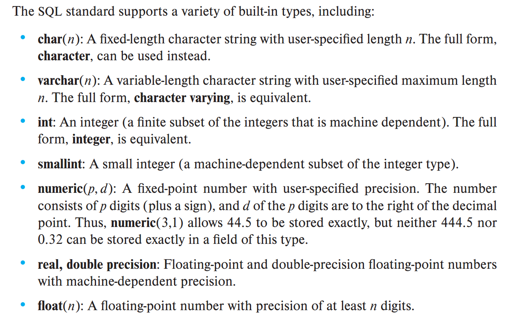
### Basic Schema Definition
SQL支持许多不同的完整性约束。在本节中，我们只讨论其中的几个:
- 主键约束
- 外键约束
- not null 约束
create、drop、delete、alter
## 3.3 Basic Structure of SQL Queries
SQL查询的基本结构由三个子句组成:select、from和where。

查询将from子句中列出的关系作为输入，按照where和select子句中指定的方式对它们进行操作，然后生成一个关系作为结果。我们将通过示例介绍SQL语法，并在后面描述SQL查询的一般结构。

我们使用alter table命令向现有关系添加属性。关系中的所有元组都被指定为null作为新属性的值。alter table命令的形式是
### Queries on a Single Relation

### Queries on Multiple Relations
查询通常需要访问来自多个关系的信息。
例如，假设我们想要回答“检索所有教员的姓名，以及他们的部门名称和部门大楼名称”这个查询。查看关系指导器的模式，我们意识到可以从属性dept name获得部门名称，但是部门构建名称出现在关系部门的属性构建中。要回答查询，教员关系中的每个元组必须与部门关系中dept name值与教员元组的dept name值匹配的元组相匹配。

在SQL中，为了回答上述查询，我们在from子句中列出需要访问的关系，并在where子句中指定匹配条件。上面的查询可以用SQL编写为
```SQL
select name, instructor.dept name, building
from instructor, department
where instructor.dept name= department.dept name;
```
#### join
#### natural join
没有公共属性的时候退化为笛卡尔积
##### danger of nartual join
## 3.4 Additional Basic Operations
### the rename operation
使用 as 闭包
### String Operations
### Attribute Specification in the Select Clause
### Ordering the Display of Tuples
### Set Operations
## 3.6 Null Values
由于where子句中的谓词可以涉及布尔操作，如and、or，而不是对比较的结果，因此布尔操作的定义被扩展为处理 unknown。
## 3.7 Aggregate Functions
聚合函数是接受值的集合(一组或多组)作为输入并返回单个值的函数。SQL提供了五个标准的内置聚合函数:
- Average: avg
- Minimum: min
- Maximum: max
- Total: sum
- Count: count
sum和avg的输入必须是数字的集合，但其他操作符也可以操作非数字数据类型的集合，比如字符串。
### Basic Aggregation
### Aggregation with Grouping
```sql
select dept name, avg (salary) as avg salary
from instructor
group by dept_name;
```

当SQL查询使用分组时，重要的是要确保出现在select语句中而不被聚合的属性是那些出现在group by子句中的属性。换句话说，group by子句中没有出现的任何属性都可能只作为聚合函数的参数出现在select子句中，否则该查询将被视为错误。例如，下面的查询是错误的，因为ID没有出现在group by子句中，但是它出现在select子句中而没有被聚合:
```sql
/* erroneous query */
select dept name, ID, avg (salary)
from instructor
group by dept name;
```
在前面的查询中，特定组(由dept name定义)中的每个教练可以有不同的ID，并且由于每个组只输出一个元组，因此没有唯一的方法来选择输出哪个ID值。因此，SQL不允许这样的情况。
### The Having Clause
有时，声明一个**适用于组而不是元组的条件**是有用的。例如，我们可能只对教师平均工资超过4.2万美元的院系感兴趣。此条件不适用于单个元组；相反，它适用于group by子句构造的每个组。为了表达这样的查询，我们使用SQL的having子句。SQL在组形成后在having子句中应用谓词，**因此可以在having子句中使用聚合函数**。
```sql
select dept name, avg (salary) as avg salary
from instructor
group by dept name
having avg (salary) > 42000;
```
 > SQL关键字执行顺序
>```sql
>slect A1, agg_fun as X
>from a,b
>where P1
>gruop by A1
>Having P2
>```
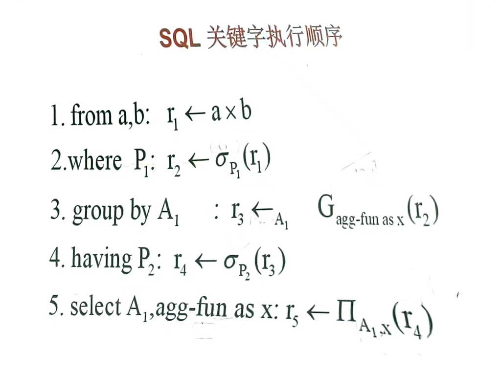
### Aggregation with Null and Boolean Values
## 3.8 Nested Subqueries
### Set Membership
SQL allows testing tuples for membership **in** a relation. The in connective tests for set membership, where the set is a collection of values produced by a select clause. The **not in** connective tests for the absence of set membership.
### Set Comparison
### Test for Empty Relations
SQL包含一个特性，用于测试子查询的结果中是否有任何元组。如果参数子查询非空，exists构造返回值true。使用exists结构，我们可以用另一种方式编写查询“查找2017年秋季学期和2018年春季学期教授的所有课程”:
```sql
select course id
from section as S
where semester= 'Fall' and year= 2017 and
    exists(select *
        from section as T
        where semester= 'Spring' and year= 2018 and 
        S.course id= T.course_id);
```
上面的查询还说明了SQL的一个特性，即可以在where子句中的子查询中使用来自外部查询(上面查询中的S)的关联名称。

使用来自外部查询的关联名称的子查询称为相关子查询。
### Test for the Absence of Duplicate Tuples
todo!()
### Subqueries in the From Clause
todo!()

### The With Clause
with子句提供了一种定义临时关系的方法，该临时关系的定义仅对出现with子句的查询可用。
考虑以下查询，该查询查找预算最大的部门。
```sql
with max budget (value) as
(select max(budget)
from department)
select budget
from department, max budget
where department.budget = max budget.value;
```
当然，我们可以创建一个不使用with子句的等效查询，但这样做会更复杂，也更难以理解。您可以编写等效的查询作为练习。
### Scalar Subqueries
只要允许表达式返回值，SQL就允许子查询，只要子查询**只返回一个包含单个属性的元组**；这样的子查询称为**标量子查询**。例如，可以在 select 子句中使用子查询，如下面的示例所示，该子查询列出了所有部门以及每个部门的教师数量:
```sql
select dept name,
(select count(*)
from instructor
where department.dept name = instructor.dept name)
as num instructors
from department;
```
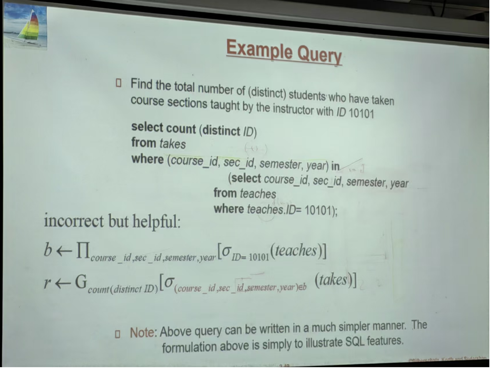
```sql
select count (distinct ID)
from takes
where (course_id,sec_id,semester,year) in
(select course_id, sec_id, semester, year from teaches
where teaches.1D= 10101);
```
用with子句重写
```sql
with T as
(select course id, sec id, semester, year
from teaches
where teaches.ID= 10101)
select count (distinct ID)
from takes
where (course_id, sec_id, semester, year) in T;
```

### Scalar Without a From Clause
某些查询需要计算，但不需要引用任何关系。类似地，某些查询可能具有包含from子句的子查询，而顶级查询不需要from子句。

作为一个例子，假设我们希望找到每个教师教授的平均节数(无论学年或学期)，每个教师计算一次由多个教师教授的节数。我们需要计算教学中的元组数量来找到教学的总节数，并计算教师中的元组数量来找到教师的数量。然后一个简单的除法就得到了我们想要的结果。可以这样写:
```sql
select count(*) / (select count(*) from instructor) as avg class size
from teaches;
```
## 3.9 Modification of the Database
### Deletion
注意，虽然一次只能从一个关系中删除元组，但是可以在delete的where子句中嵌套的select-from-where中引用任意数量的关系。删除请求可以包含一个嵌套的选择，该选择引用要从中删除元组的关系。例如，假设我们想要删除所有工资低于大学平均水平的教师的记录。我们可以这样写:
```sql
delete from instructor
where salary < (select avg (salary) from instructor);
```
delete语句首先测试关系教员中的每个元组，以检查其工资是否低于大学教员的平均工资。然后，删除所有通过测试的元组(即代表工资低于平均水平的教员)。**在执行任何删除之前执行所有测试是很重要的——如果在测试其他元组之前删除了一些元组，则平均薪水可能会发生变化，并且删除的最终结果将取决于处理元组的顺序！**
### Insertion

### Update


## HW1
- 列出文件处理系统和DBMS之间的四个重要区别。
数据库管理系统和文件处理系统之间的一些主要区别是:
1. 两个系统都包含数据集合和访问该数据的一组程序。数据库管理系统协调对数据的物理访问和逻辑访问，而文件处理系统只协调物理访问。
2. 数据库管理系统通过确保物理数据对所有被授权访问它的程序可用来减少数据重复的数量，而一个程序在文件处理系统中写入的数据可能无法被另一个程序读取。
3. 数据库管理系统被设计为允许灵活访问数据(即查询)，而文件处理系统被设计为允许预先确定访问数据(即编译程序)。
4. 数据库管理系统旨在协调多个用户同时访问相同的数据。文件处理系统通常被设计成允许一个或多个程序同时访问不同的数据文件。在文件处理系统中，只有当两个程序都对文件具有只读访问权限时，两个程序才能并发地访问该文件

- 请列出至少两个原因，说明为什么数据库系统支持使用声明性查询语言(如SQL)进行数据操作，而不是仅仅提供C或c++函数库来执行数据操作。
a.声明式语言对于程序员来说更容易学习和使用(对于非程序员来说更是如此)。
b.程序员不必担心如何编写查询来确保查询的高效执行;选择一种有效的执行技术留给数据库系统。声明性规范使数据库系统更容易做出正确的执行技术选择。

- 数据库管理员的五个主要功能是什么?
1. 备份数据
2. 在某些情况下，创建模式定义
3. 定义存储结构和访问方法
4. 在必要时修改模式和/或物理组织
5. 授予数据访问授权
6. 指定完整性约束

# chapter 4：Intermediate SQL
## 4.1 Join Expressions
### join condition
考虑下面的查询，它有一个包含on条件的连接表达式。
```sql
select *
from student join takes on student.ID= takes.ID;
```
上面的 on 条件指定，如果 student 的元组与 takes 的元组 ID 值相等，则这两个元组匹配。本例中的连接表达式与 student 自然连接 takes 的连接表达式几乎相同，因为自然连接操作也要求 student 元组和 takes 元组匹配。唯一的区别是，在连接结果中，结果的 ID 属性列出了两次，一次是 student，一次是 takes，尽管它们的 ID 值必须相同。

In fact, the above query is equivalent to the following query (in other words, they generate exactly the same results):
```sql
select *
from student, takes
where student.ID= takes.ID;
```

**on条件可以表示任何SQL谓词(predicate)**，因此使用on条件的连接表达式可以表示比自然连接更丰富的连接条件类。但是，正如前面的示例所示，**使用带on条件的连接表达式的查询可以被不带on条件的等效表达式替换**，并将on子句中的谓词移动到where子句中。因此，on条件似乎是SQL的一个冗余特性。

然而，引入on条件有两个很好的理由。首先，我们将很快看到，对于一种称为外连接的连接，on条件的行为方式与where条件不同。其次，**如果在on子句中指定连接条件，而其余条件出现在where子句中，那么SQL查询通常更容易被人读懂。**
### outer joins
假设我们希望显示所有学生的列表，显示他们的ID、姓名、专业名称、学分以及他们修过的课程。下面的SQL查询可以检索所需的信息:
```sql
select * from student natural join takes;
```
不幸的是，上面的查询并没有像预期的那样工作。假设有一个学生没有上过课。那么，该特定学生的student关系中的元组将不满足与takes关系中的任何元组进行自然连接的条件，并且该学生的数据将不会出现在结果中。因此，我们不会看到没有参加考试的学生的任何信息

更一般地说，**连接的关系中的一个或两个关系中的一些元组可能会以这种方式“丢失”**。外部连接操作的工作方式类似于我们已经研究过的连接操作，但是通过**在结果中创建包含空值的元组来保留那些在连接中丢失的元组**。外部连接操作有三种类型:左外连接、右外连接和完全外连接。
- 左外连接仅在左外连接操作之前(在其左边)命名的关系中保留元组。
- 右外连接仅在以右外连接操作的右侧命名的关系中保留元组。
- 完整的外部连接保留两个关系中的元组。
### left outer join
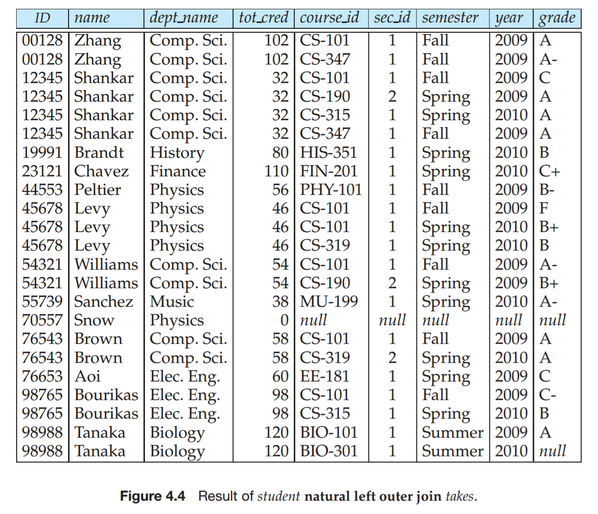
### right outer join
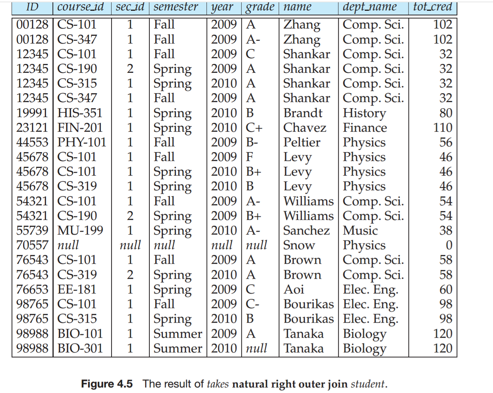
### full outer join
完全外连接是左外连接和右外连接类型的组合。

操作计算出内连接的结果后，它会将左侧关系中与右侧关系中不匹配的元组扩展为空值，并将它们添加到结果中。同样，它会将右侧关系中与左侧关系中不匹配的元组扩展为空值，并将它们添加到结果中。

作为使用完整外部连接的一个示例，请考虑以下查询:“显示Comp. Sci.数据库中所有学生的列表。”以及他们在2009年春季修过的课程部分(如果有的话);从2009年春季开始的所有课程部分必须显示，即使没有学生来自 the Comp.Sci。系里已经有了课程部分。”这个查询可以写成:
```sql
select *
from (select *
from student
where dept name= ’Comp. Sci’)
natural full outer join
(select *
from takes
where semester = ’Spring’ and year = 2009);
```
### inner join
我们前面研究的不保留不匹配元组的连接操作称为内部连接操作，以区别于外部连接操作。
### Join Types and Conditions
为了区分普通连接和外部连接，**普通连接在SQL中称为内连接**。因此，join clause 可以指定内部连接而不是外部连接，以指定要使用普通连接。**关键字 inner 是可选的**。**当不使用外部前缀的连接子句时，默认的连接类型是内部连接**。

类似地，**natural join is equivalent to natural inner join**。

图4.6显示了我们讨论过的各种连接类型的完整列表。
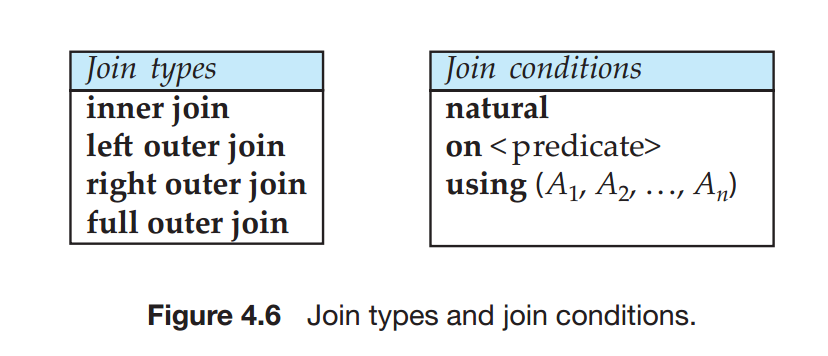
从图中可以看出，任何形式的连接(内连接、左外连接、右外连接或全外连接)都可以与任何连接条件(自然连接、使用连接或on连接)组合。
## 4.2 Views
到目前为止，在我们的示例中，我们一直在逻辑模型级别进行操作。也就是说，我们假设给定的集合中的关系是存储在数据库中的实际关系。

除了安全问题之外，我们可能希望创建一个个性化的关系集合，它比逻辑模型更符合特定用户的直觉。

可以计算并存储查询的结果，然后将存储的关系提供给用户。但是，如果我们这样做了，并且关系讲师、课程或部分中的基础数据发生了变化，那么存储的查询结果将不再与对关系重新执行查询的结果相匹配。一般来说，计算和存储诸如上述示例中的查询结果是一个坏主意(尽管有一些例外，我们将在后面研究)。

相反，SQL允许查询定义“虚拟关系”，并且关系在概念上包含查询的结果。虚拟关系不是预先计算和存储的，而是在使用虚拟关系时通过执行查询来计算的。

任何这样的关系，如果不是逻辑模型的一部分，但作为虚拟关系对用户可见，则称为视图。在任何给定的一组实际关系之上支持大量视图是可能的。

### View Definition
我们使用create view命令在SQL中定义视图。要定义视图，我们必须给视图一个名称，并且必须说明计算视图的查询。create view命令的格式是:
```sql
create view v as <query expression>;
```
### Using Views in SQL Queries
一个视图可以在定义另一个视图的表达式中使用。
### Materialized Views
某些数据库系统允许存储视图关系，但它们确保，如果视图定义中使用的实际关系发生变化，则视图保持最新状态。这样的视图称为物化视图。

例如，考虑视图部门的总工资。如果实现了上述视图，其结果将存储在数据库中。但是，如果向讲师关系添加或删除了讲师元组，则定义视图的查询结果将发生变化，因此必须更新物化视图的内容。类似地，如果更新了教员的工资，则必须更新与该教员所在部门相对应的部门总工资中的元组。

当定义视图的任何关系更新时，可以立即进行视图维护。但是，有些数据库系统在访问视图时执行视图维护是惰性的。有些系统只是周期性地更新物化视图;在这种情况下，物化视图的内容在使用时可能是陈旧的，也就是说，不是最新的，如果应用程序需要最新的数据，就不应该使用它。一些数据库系统允许数据库管理员控制对每个物化视图使用上述方法中的哪一个。


### Update of a View
虽然视图是查询的有用工具，但是如果用视图表示更新、插入或删除，则会出现严重的问题。困难在于，用视图表示的对数据库的修改必须转换为对数据库逻辑模型中实际关系的修改。

由于诸如此类的问题，通常不允许修改视图关系，除非在有限的情况下。不同的数据库系统指定不同的条件来允许视图关系的更新;详细信息请参见数据库系统手册。通过视图修改数据库的一般问题一直是大量研究的主题，书目注释提供了一些这方面研究的指针。

一般来说，如果定义视图的查询满足以下条件，则SQL视图是可更新的(即可以在视图上应用插入、更新或删除操作):
- select子句只包含关系的属性名，不包含任何表达式、聚合或不同的规范。
- 任何未在select子句中列出的属性都可以设置为null;也就是说，它没有非空约束，也不是主键的一部分。
- 查询中没有group by或having子句

> 即使有了可更新性的条件，以下问题仍然存在。
假设用户试图将元组(' 25566 '，' Brown '， ' Biology '， 100000)插入到历史教师视图中。这个元组可以插入到讲师关系中，但它不会出现在历史讲师视图中，因为它不满足视图强加的选择。
默认情况下，SQL将允许进行上述更新。但是，可以在视图定义的末尾使用with check选项子句来定义视图;然后，如果插入到视图中的元组不满足视图的where子句条件，则数据库系统将拒绝插入。同样，如果新值不满足where子句条件，则拒绝更新。
SQL:1999对于在视图上执行插入、更新和删除操作有更复杂的规则集，这允许通过更大的视图类进行更新;然而，这些规则太复杂了，无法在这里讨论。
## Transactions
事务由一系列查询和/或更新语句组成。SQL标准指定在执行SQL语句时隐式地开始事务。下列SQL语句之一必须结束事务:

- Commit work
提交当前事务;也就是说，它使事务执行的更新在数据库中成为永久性的。事务提交后，将自动启动一个新事务。
- Rollback work
导致当前事务回滚;也就是说，它撤销事务中SQL语句执行的所有更新。因此，数据库状态将恢复到执行事务的第一条语句之前的状态。
## Integrity Constraints
完整性约束确保授权用户对数据库所做的更改不会导致数据一致性的丢失。因此，完整性约束可以防止对数据库的意外损坏。

通常，完整性约束可以是属于数据库的任意谓词。但是，任意谓词的测试成本可能很高。因此，大多数数据库系统允许指定可以用最小开销测试的完整性约束。

完整性约束通常被标识为数据库模式设计过程的一部分，并作为用于创建关系的create table命令的一部分声明。但是，也可以使用alter table table-name add constraint命令将完整性约束添加到现有关系中，其中的约束可以是关系上的任何约束。当执行这样的命令时，系统首先确保关系满足指定的约束。如果是，则将约束添加到关系中;如果不是，则拒绝该命令。
### Constraints on a Single Relation
### Not Null Constraint
### Unique Constraint
### The check Clause
### Referential Integrity