# Sig-Main例会会议记录
## 第一次会议 0801
### blocklayer
#### speaker：谢润霖
#### 开发目的：
- 支持多类型磁盘设备共存
- 为 I/O 调度提供统一的接口
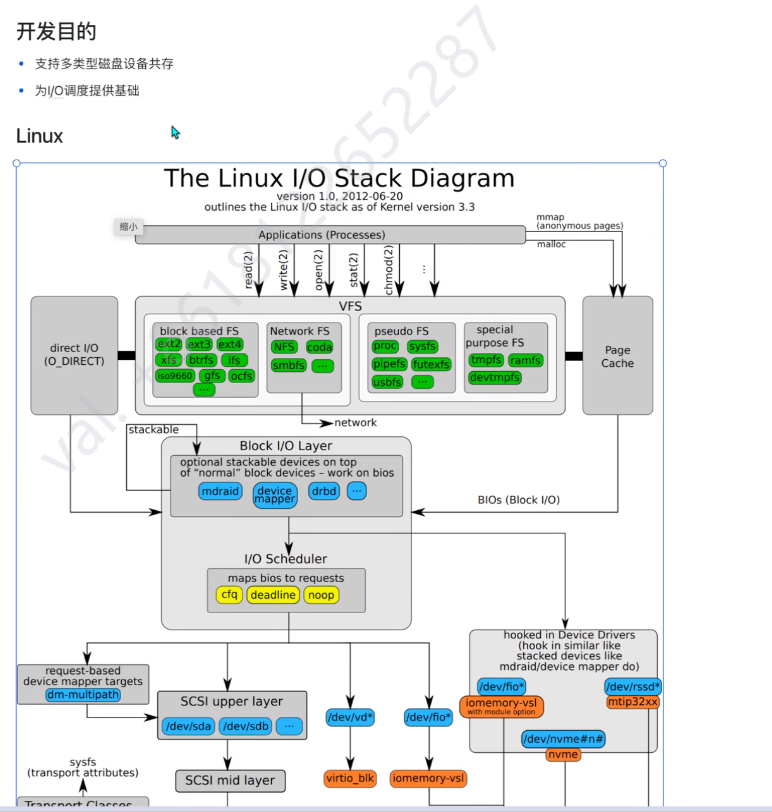
#### 核心数据结构：
- 对单个块 I/O 设备的抽象-bio
- 请求优化后，即将发往设备的请求-request
- 全局请求队列-request_queue

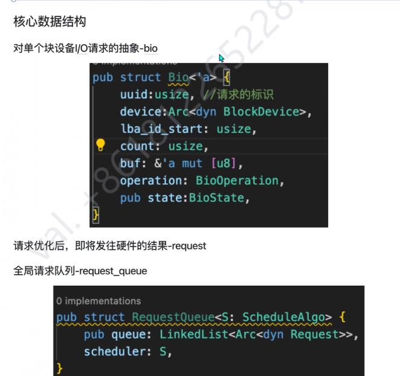
#### 主要流程
1. 进程通过系统调用发起I/0操作并阻塞
2. 文件系统将进程谐求转换为bio，将其发送到全局请求队列中
3. 向全局请求队列添加bio将会触发调度，调度程序将新增的bio转换为request，或者将其与队列中的reqeust合并
4. 全局请求队列被定时器timeout触发，向硬件队列发送队列中的请求，然后将已发送的请求缓存在辅助队列中5. 硬件队列中的请求将被驱动程序拉取处理，并通过请求中的状态位储存处理的结果
6. 值守线程定期轮询辅助队列，唤醒已完成请求对应的线程
#### 预期施工地点：
kernel/src/driver/block
kernel/src/disk/ahci

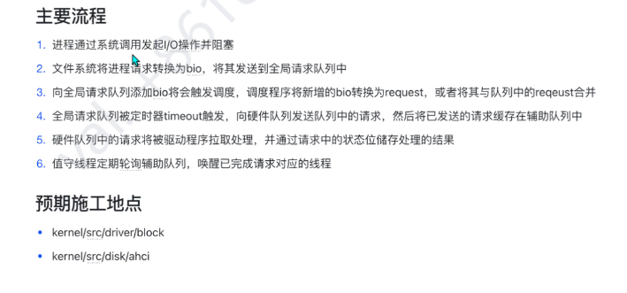
### kprobe 设计与实现 讨论
#### speaker：陈林峰
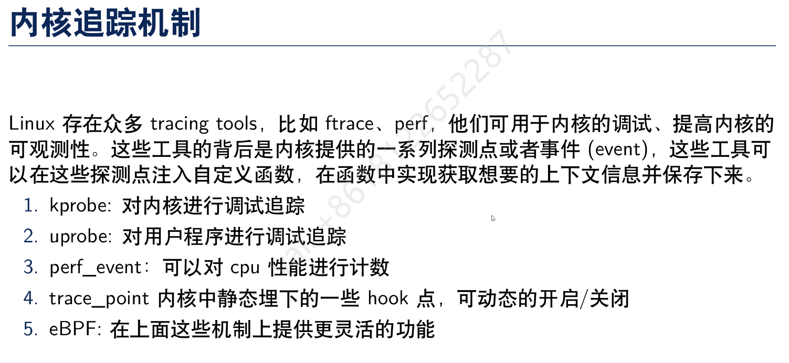
#### 内核追踪机制
Linux存在众多 tracing tools，比如 ftrace、perf，他们可用于内核的调试提高内核的可观测性。这些工具的背后是内核提供的一系列探测点或者事件(event)，这些工具可以在这些探测点注入自定义函数，在函数中实现获取想要的上下文信息并保存下来。
1. kprobe:对内核进行调试追踪
2. uprobe: 对用户程序进行调试追踪
3. perf_event:可以对 cpu 性能进行计数
4. trace point 内核中静态埋下的一些 hook 点，可动态的开启/关闭
5. eBPF:在上面这些机制上提供更灵活的功能
可以基于kprobe实现eBPF。
#### Kprobe 内核接口

#### Kprobe 内核模块代码示例
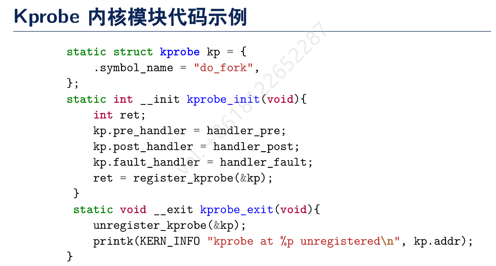
#### Kprobe 实现原理
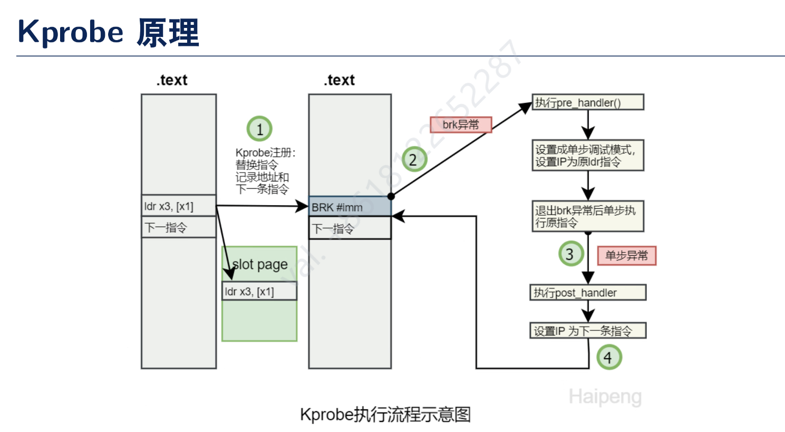
#### Kprobe 不同架构的差异
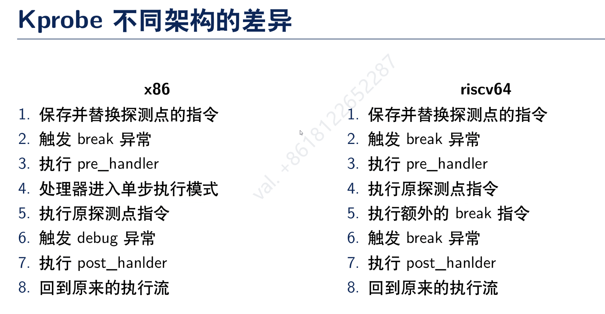
#### Kprobe 实现 register
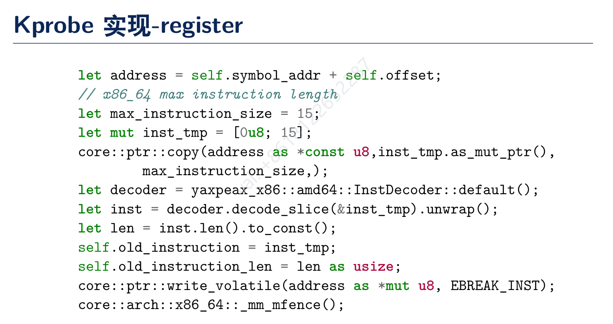
#### Kprobe 实现 unregister
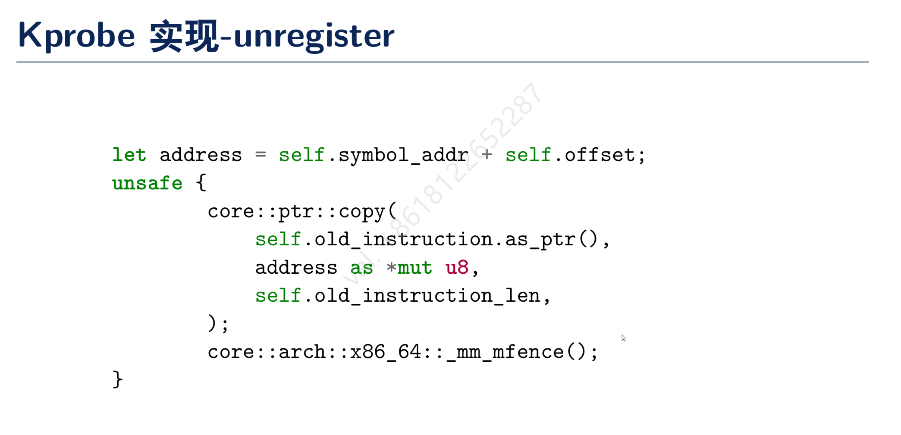
#### Kprobe 实现 riscv64
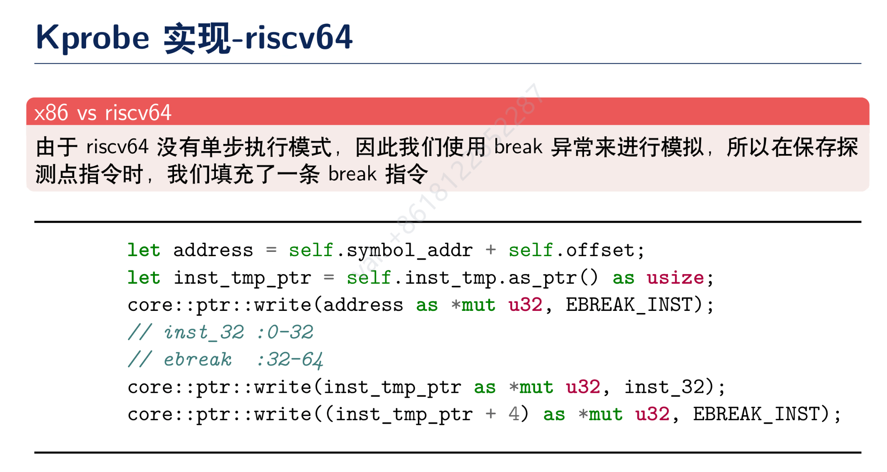
#### Kprobe 内核实现
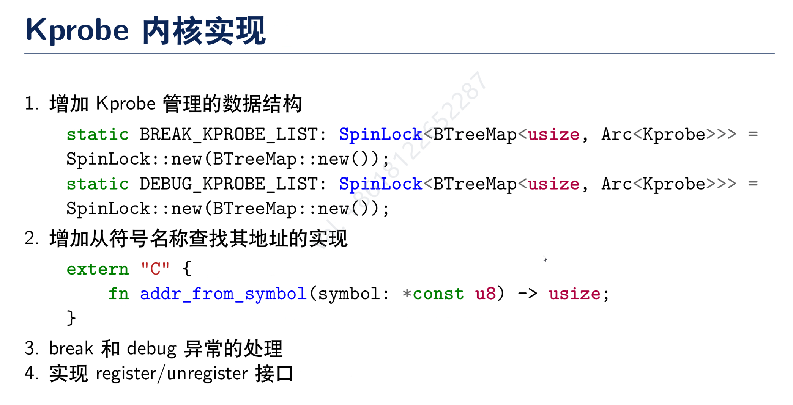
1. 增加 Kprobe 管理的数据结构
2. 增加从符号名称查找其地址的实现
3. break 和 debug 的实现
4. 实现 register 和 unregister
#### 问题讨论
- Q1：多个 Kprobe 注册再同一个探测点
只需要稍微的改一下数据结构和实现
- Q2：Rust 名称混淆问题
由于 rust 和 C 的函数的命名的方式不一样，rust不同的文件里面可以具有相同名称的函数。
此外，最终生成的 symbol 并不是函数的名字本身，而是通过mangle 之后的函数名。不同版本的 rust 工具链生成的函数名有可能是不一样的，kprobe 的实现也不可能限定于某一个版本的工具链。这个问题会导致我们无法通过函数名来找到函数的地址。这个名称混淆的问题如何解决？如果不加 no-mangle 的话（注：no-mangle 是一个编译器的指令，用于告诉编译器不要修改函数名），如果要定位到某一个函数，则需要带上模块，trait，函数名，参数类型，返回值类型等信息，这样才能唯一确定一个函数。

gdb：不用具体的字符串

rust-gdb 解析符号表
cargo.toml debug = true 
内核不携带调试信息
既然 Linux Kprobe 是和他的符号表强绑定的，不如用另一种方式，
不一定是传一个symbol
demangle：解析符号表
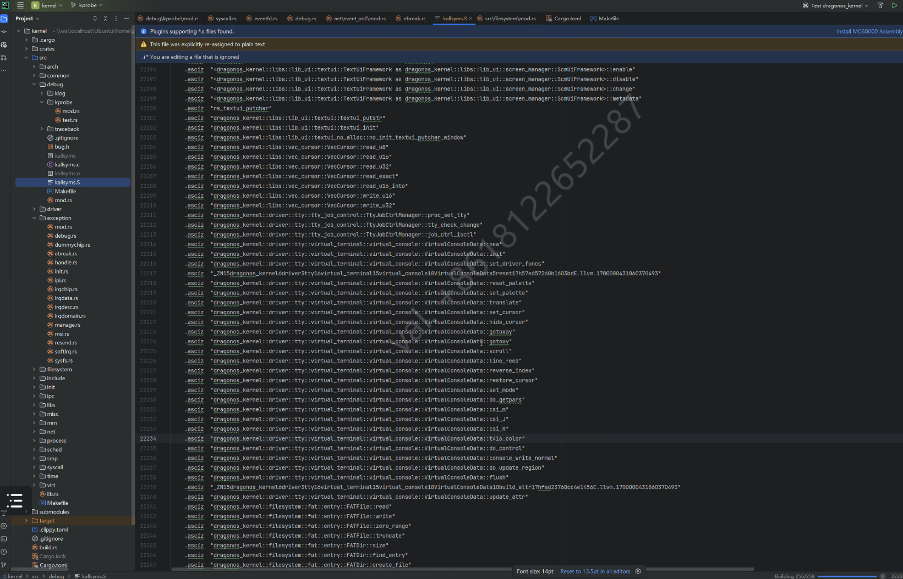
这个函数被多个模块所使用怎么办呢？

核心点是建立一个到最终函数的名字的映射，传进内核要传进一个完整符合规范的名字。由此确定了一个方案：封装一个库，省略拼接的细节，便于让用户直接指定一个函数的地址。

### 需求讨论（包含sig-observation还有和虚拟化的）
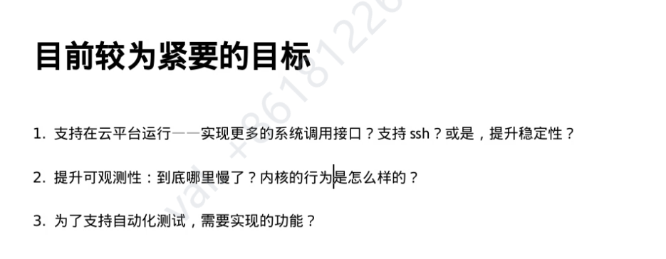
明确目标
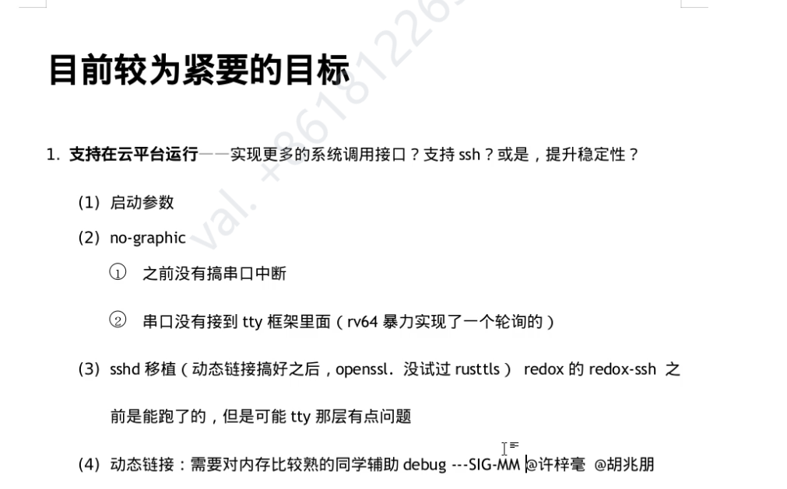
性能。好像不是调度问题
### kvm
跑起来只
内存那一块，文件映射
kvm的数据结构映射到用户空间
共享内存
qemu 调试
### sig-net
smoltcp

syscall table

### 编辑器部分
基础组 
功能组 按键映射啥的

### 内核的编译流程？
确实很慢
只编译内核 make kernel
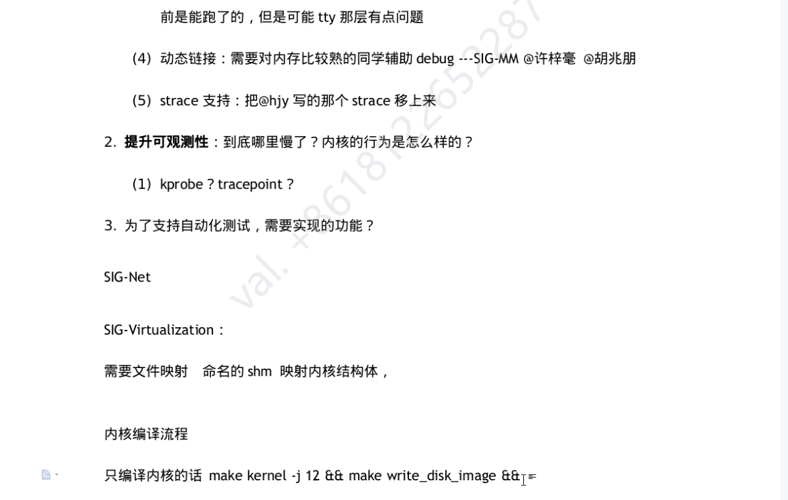

musl
tokio 运行时跑得了
## 第二次会议-筹备 0815
分享人：
1. 操丰毅 OS支持容器底层namespace的设计与实现
2. 杨璐玮 netlink 和 uevent 的设计与实现
主要内容：跟进上次会议所讨论的需求和工作的进展以及相关的问题讨论
## 第三次会议 0829
