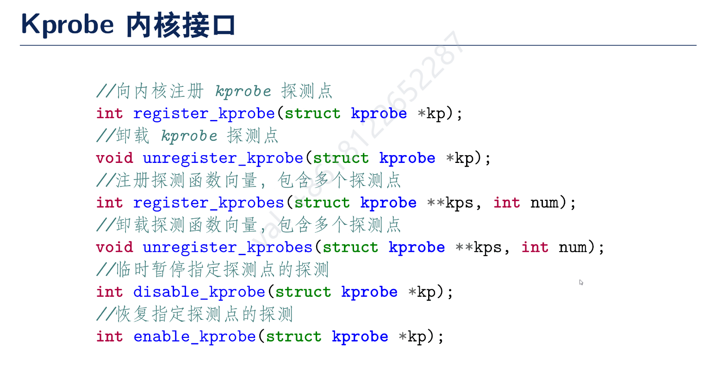
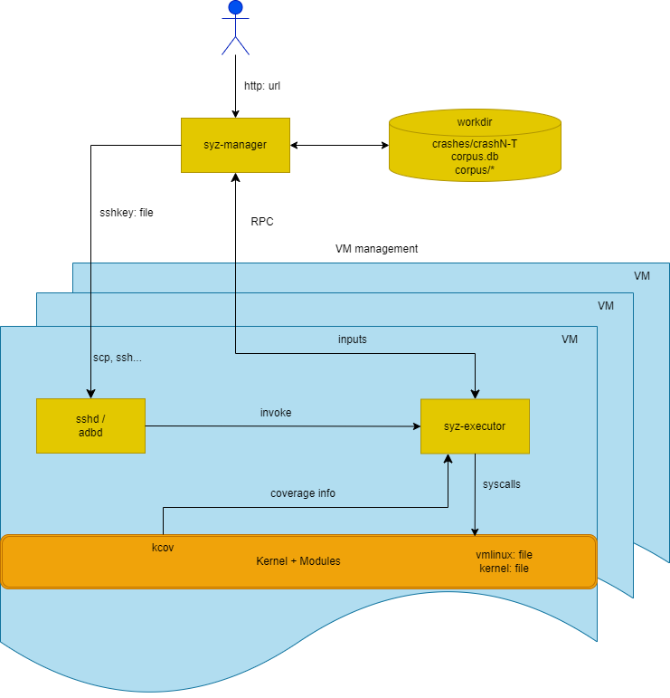

# Sig-Main例会会议记录
## 第一次会议 0801
### blocklayer
#### speaker：谢润霖
#### 开发目的：
- 支持多类型磁盘设备共存
- 为 I/O 调度提供统一的接口

#### 核心数据结构：
- 对单个块 I/O 设备的抽象-bio
- 请求优化后，即将发往设备的请求-request
- 全局请求队列-request_queue

#### 主要流程
1. 进程通过系统调用发起I/0操作并阻塞
2. 文件系统将进程谐求转换为bio，将其发送到全局请求队列中
3. 向全局请求队列添加bio将会触发调度，调度程序将新增的bio转换为request，或者将其与队列中的reqeust合并
4. 全局请求队列被定时器timeout触发，向硬件队列发送队列中的请求，然后将已发送的请求缓存在辅助队列中5. 硬件队列中的请求将被驱动程序拉取处理，并通过请求中的状态位储存处理的结果
6. 值守线程定期轮询辅助队列，唤醒已完成请求对应的线程
#### 预期施工地点：
kernel/src/driver/block
kernel/src/disk/ahci

### kprobe 设计与实现 讨论
#### speaker：陈林峰

#### 内核追踪机制
Linux存在众多 tracing tools，比如 ftrace、perf，他们可用于内核的调试提高内核的可观测性。这些工具的背后是内核提供的一系列探测点或者事件(event)，这些工具可以在这些探测点注入自定义函数，在函数中实现获取想要的上下文信息并保存下来。
1. kprobe:对内核进行调试追踪
2. uprobe: 对用户程序进行调试追踪
3. perf_event:可以对 cpu 性能进行计数
4. trace point 内核中静态埋下的一些 hook 点，可动态的开启/关闭
5. eBPF:在上面这些机制上提供更灵活的功能
可以基于kprobe实现eBPF。
#### Kprobe 内核接口

#### Kprobe 内核模块代码示例

#### Kprobe 实现原理

#### Kprobe 不同架构的差异

#### Kprobe 实现 register

#### Kprobe 实现 unregister

#### Kprobe 实现 riscv64

#### Kprobe 内核实现

1. 增加 Kprobe 管理的数据结构
2. 增加从符号名称查找其地址的实现
3. break 和 debug 的实现
4. 实现 register 和 unregister
#### 问题讨论
- Q1：多个 Kprobe 注册再同一个探测点
只需要稍微的改一下数据结构和实现
- Q2：Rust 名称混淆问题
由于 rust 和 C 的函数的命名的方式不一样，rust不同的文件里面可以具有相同名称的函数。
此外，最终生成的 symbol 并不是函数的名字本身，而是通过mangle 之后的函数名。不同版本的 rust 工具链生成的函数名有可能是不一样的，kprobe 的实现也不可能限定于某一个版本的工具链。这个问题会导致我们无法通过函数名来找到函数的地址。这个名称混淆的问题如何解决？如果不加 no-mangle 的话（注：no-mangle 是一个编译器的指令，用于告诉编译器不要修改函数名），如果要定位到某一个函数，则需要带上模块，trait，函数名，参数类型，返回值类型等信息，这样才能唯一确定一个函数。

gdb：不用具体的字符串

rust-gdb 解析符号表
cargo.toml debug = true 
内核不携带调试信息
既然 Linux Kprobe 是和他的符号表强绑定的，不如用另一种方式，
不一定是传一个symbol
demangle：解析符号表

这个函数被多个模块所使用怎么办呢？

核心点是建立一个到最终函数的名字的映射，传进内核要传进一个完整符合规范的名字。由此确定了一个方案：封装一个库，省略拼接的细节，便于让用户直接指定一个函数的地址。

### 需求讨论（包含sig-observation还有和虚拟化的）

明确目标

性能。好像不是调度问题
### kvm
跑起来只
内存那一块，文件映射
kvm的数据结构映射到用户空间
共享内存
qemu 调试
### sig-net
smoltcp

syscall table

### 编辑器部分
基础组 
功能组 按键映射啥的

### 内核的编译流程？
确实很慢
只编译内核 make kernel

musl
tokio 运行时跑得了
## 第二次会议-筹备 0815
分享人：
1. 操丰毅 OS支持容器底层namespace的设计与实现
2. 杨璐玮 netlink 和 uevent 的设计与实现
主要内容：跟进上次会议所讨论的需求和工作的进展以及相关的问题讨论
## 第三次会议总结 0829（0901）
分享人： 池克俭
主题：关于引入自动化内核测试的设想
### 关于引入自动化内核测试的方案设想
- **内部测试：syzkaller模糊测试**
Syzkaller 是一个无监督的、覆盖率引导的内核模糊测试工具，它能够自动化地生成随机的系统调用序列，并将其作为测试用例输入到内核中，以此来发现内核中可能存在的漏洞。syzkaller 是谷歌开源的，业界使用的解决方案。

- **外部测试：基于固定用例与UI的测试**
模拟开发者的行为，例如可以通过 VNC 拿到 QEMU 里面的数据，在启动阶段定时每隔一小段时间来截一次图，判断现在这个状态是卡住了，还是说崩了，还是说正确正常的进入到了系统里面。
而当然这里其实有可能可以做更多的工作，比如说基于用例的去做，进到系统之后，可以跑一些现有的拿来做单元测试的用户空间的测试程序。好处是这是一个固定用测试用例的，对比起模糊测试，会更加精准，能清楚的知道各个模块的测试覆盖情况；并且时间上开销也比较小。
可能需要使用 AI 或者 OCR 来辅助实现这样的需求。
#### 讨论关于引入syzkaller模糊测试的方案
在使用 Syzkaller 进行模糊测试时，需要被测的内核处于运行状态。Syzkaller 通过生成系统调用并将其发送到运行中的内核来执行测试。这些系统调用序列是随机生成的，目的是尽可能覆盖内核代码的各种执行路径，以便发现潜在的错误或漏洞。

Syzkaller 的工作流程通常包括以下几个步骤：

1. 启动 Syzkaller 管理器（syz-manager），它会根据配置文件启动一个或多个虚拟机（QEMU）或物理机。
管理器会将 Syzkaller 生成的测试用例（系统调用序列）发送到虚拟机或物理机上运行的内核中。
内核执行这些系统调用，并产生执行结果，如正常返回、异常、崩溃等。
2. Syzkaller 收集执行结果，并根据结果更新其测试策略，优先执行那些能够增加代码覆盖率的测试用例。
通过持续的测试和反馈，Syzkaller 能够发现并报告内核中的错误。
3. 在实际应用中，Syzkaller 可以配置为在隔离的环境下运行，例如通过 SSH 连接到远程物理机或使用虚拟机。在这种情况下，被测内核需要在目标机器上运行，并且 Syzkaller 需要能够通过网络与之通信。
- 明确引入syzkaller框架的方式是在测试环境（Linux）物理机上使用 qemu，远程（使用ssh等方式）在DragonOS里面跑一个进程，或者说启动相应的测试程序，捕获对应的信息。
##### 需要引入基础支持
- 需要考虑重新考察支持 no-graphic 
- sshd的支持
##### 打包磁盘镜像的问题
- 调查能否在非特权级下完成磁盘进行打包
- 调查特权级打包磁盘镜像后是否能够在 GitHub CI上运行
- 参考 asterinas 调研一下是怎么完成这个流程的
- 相关的讨论：
    - https://bbs.dragonos.org.cn/t/topic/341
    - https://bbs.dragonos.org.cn/t/topic/343/1