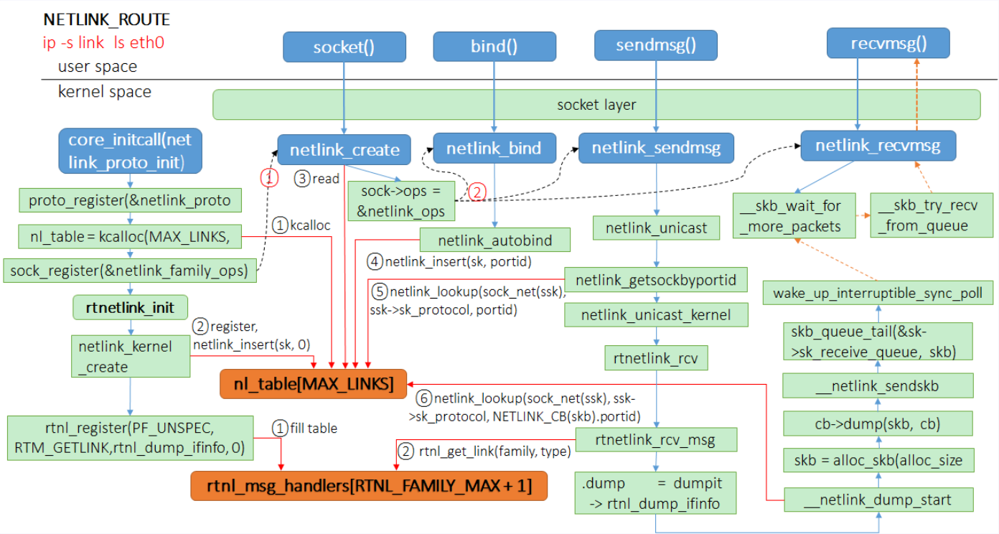
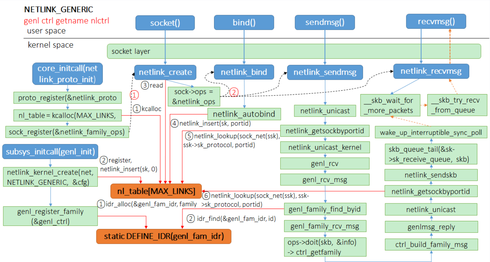
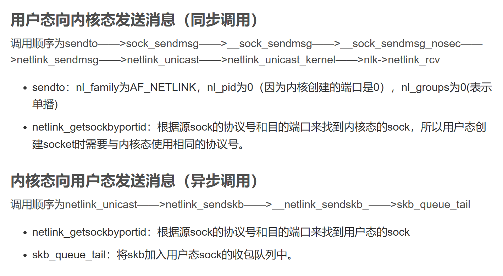

# 需求
- 在`sysfs`中实现`uevent`的逻辑，并在设备驱动模型中，发送通用的`uevent`.
- 然后用户测试程序能够通过`epoll`感知到这些`uevent`，并输出。
# 前置知识
https://www.cnblogs.com/schips/p/linux_device_model.html


Linux内核中设备管理和事件通知机制。
## sysfs
要分析sysfs，首先就要分析kobject和kset，因为驱动设备的层次结构的构成就是由这两个东东来完成的。sysfs与kobject密不可分。
### kobject
kobject是组成设备模型的基本结构，是所有用来描述设备模型的数据结构的基类。

kobject是一个对象的抽象，它用于管理对象。
### kset
### ktype


## 设备驱动模型
(Linux Device Driver Model，LDDM)
[](https://img2020.cnblogs.com/blog/2120938/202106/2120938-20210619100658987-1899674438.png)
## uevent
Uevent只是通过netlink套接字发送的一些特殊格式的字符串。

uevent是kobject的一部分，用于在kobject状态发生改变时，例如增加、移除等，通知用户空间程序。用户空间程序收到这样的事件后，会做相应的处理。

uevent（ user space event）是 内核与用户空间的一种基于netlink机制通信机制，主要用于设备驱动模型，常用于设备的热插拔。

>例如：U盘插入后，USB相关的驱动软件会动态创建用于表示该U盘的device结构（相应的也包括其中的kobject），并告知用户空间程序，为该U盘动态的创建/dev/目录下的设备节点；更进一步，可以通知其它的应用程序，将该U盘设备mount到系统中，从而动态的支持该设备。

uevent的机制是比较简单的，设备模型中任何设备有事件需要上报时，会触发uevent提供的接口。uevent模块准备好上报事件的格式后，可以通过两个途径把事件上报到用户空间：
- 一种是通过kmod模块，直接调用用户空间的可执行文件；
- 另一种是通过netlink通信机制，将事件从内核空间传递给用户空间。

其中：

- `netlink` 是一种socket，专门用来进行内核空间和用户空间的通信；
- `kmod` 是管理内核模块的工具集，类似`busybox`，我们熟悉的`lsmod`，`insmod`等是指向`kmod`的链接。


## udev
udev是用户空间的守护进程，它监听从内核发送过来的uevent消息，并负责管理设备节点（在/dev目录下），加载所需的驱动程序，以及执行相关的配置脚本和规则。udev确保了设备在用户空间的表示与内核中的状态同步。

## mdev
mdev是一个轻量级的udev替代品，它是busybox的一部分，用于在嵌入式系统中管理设备节点。mdev的功能与udev类似，但是更加简单和轻量级，适用于资源有限的嵌入式系统。
```txt
# docs/mdev.txt
Mdev has two primary uses: initial population and dynamic updates.  Both 
require sysfs support in the kernel and have it mounted at /sys.  For dynamic 
updates, you also need to have hotplugging enabled in your kernel.

Here's a typical code snippet from the init script: 
[0] mount -t proc proc /proc 
[1] mount -t sysfs sysfs /sys 
[2] echo /sbin/mdev > /proc/sys/kernel/hotplug 
[3] mdev -s

Alternatively, without procfs the above becomes: 
[1] mount -t sysfs sysfs /sys 
[2] sysctl -w kernel.hotplug=/sbin/mdev 
[3] mdev -s

Of course, a more "full" setup would entail executing this before the previous 
code snippet: 
[4] mount -t tmpfs -o size=64k,mode=0755 tmpfs /dev 
[5] mkdir /dev/pts 
[6] mount -t devpts devpts /dev/pts
The simple explanation here is that [1] you need to have /sys mounted before 
executing mdev.  Then you [2] instruct the kernel to execute /sbin/mdev whenever 
a device is added or removed so that the device node can be created or destroyed.  
Then you [3] seed /dev with all the device nodes that were created while the system 
was booting.

For the "full" setup, you want to [4] make sure /dev is a tmpfs filesystem 
(assuming you're running out of flash).  Then you want to [5] create the 
/dev/pts mount point and finally [6] mount the devpts filesystem on it.
```

# Linux源码分析
https://www.kernel.org/doc/html/next/userspace-api/netlink/intro.html
https://www.man7.org/linux/man-pages/man7/netlink.7.html
https://code.dragonos.org.cn/xref/linux-6.1.9/net/netlink/
## 目录结构
在Linux内核源代码中，drivers目录包含了为硬件设备提供支持的所有驱动程序。这个目录按照设备类型和功能进行了组织，以便于管理和维护。下面是一些常见的子目录及其包含的模块功能和目的概述：

- acpi
包含高级配置和电源接口（ACPI）的驱动程序，用于电源管理和设备配置。
- **base**
包含核心的设备、总线、和驱动模型的基础代码，这是Linux设备驱动架构的基础。
    - 
- block
包含块设备驱动程序，比如硬盘驱动和控制器。
- bluetooth
包含蓝牙设备的驱动程序。
- bus
提供对不同总线技术的支持，例如PCI、USB等。
- cdrom
包含CD-ROM驱动程序。
- char
包含字符设备的驱动程序，如串口和键盘驱动。
- crypto
提供加密算法的驱动程序，用于支持各种加密硬件。
- gpu
包含图形处理单元（GPU）驱动程序，支持不同的图形硬件。
- hid
包含人机接口设备（HID），如键盘、鼠标的驱动程序。
- i2c
提供I²C总线及其设备的驱动程序。
- input
管理输入设备的驱动程序，如键盘、鼠标、触摸屏。
- media
包含多媒体设备，如视频捕捉卡和电视卡的驱动程序。
- mfd
针对多功能设备（MFD）的驱动程序，这些设备包含多个功能集成在一个物理设备上。
- net
包含网络接口卡（NIC）和其他网络设备的驱动程序。
- pci
提供PCI总线及其设备的驱动程序。
- platform
包含为特定平台或硬件设计的驱动程序，通常是指嵌入式设备或特定硬件平台。
- scsi
包含SCSI设备的驱动程序，如硬盘和扫描仪。
- sound
包含声卡和其他音频接口的驱动程序。
- usb
提供USB控制器和设备的驱动程序。
- video
包含视频设备的驱动程序，如摄像头和视频采集卡。

这个列表只是一个概述，Linux内核支持的设备和驱动程序非常广泛，各个目录下的内容会随着新硬件的支持和旧硬件的淘汰而变化。每个子目录下通常都有一个或多个驱动程序，这些驱动程序负责与特定的硬件设备通信，确保设备的功能能够被操作系统和应用程序使用。

## kobject.h
### kobject_action事件类型
```c
// include/linux/kobject.h
/*
 * The actions here must match the index to the string array
 * in lib/kobject_uevent.c
 *
 * Do not add new actions here without checking with the driver-core
 * maintainers. Action strings are not meant to express subsystem
 * or device specific properties. In most cases you want to send a
 * kobject_uevent_env(kobj, KOBJ_CHANGE, env) with additional event
 * specific variables added to the event environment.
 */
 enum kobject_action {
 	KOBJ_ADD,
 	KOBJ_REMOVE,
  	KOBJ_CHANGE,
 	KOBJ_MOVE,
  	KOBJ_ONLINE,
  	KOBJ_OFFLINE,
 	KOBJ_BIND,
  	KOBJ_UNBIND,
  };

// lib/kobject_uevent.c
/* the strings here must match the enum in include/linux/kobject.h */
static const char *kobject_actions[] = {
    [KOBJ_ADD] =        "add",
    [KOBJ_REMOVE] =     "remove",
    [KOBJ_CHANGE] =     "change",
    [KOBJ_MOVE] =       "move",
    [KOBJ_ONLINE] =     "online",
    [KOBJ_OFFLINE] =    "offline",
};
```
`kobject_action`定义了`event`的类型，包括：
|action|意义|
|---|---|
|KOBJ_ADD|表示一个kobject被添加到系统中。这通常意味着一个新的设备被注册或一个新的内核组件被初始化。|
|KOBJ_REMOVE|表示一个kobject从系统中移除。这可能是因为设备被卸载或某个内核组件被销毁。|
|KOBJ_CHANGE|表示一个kobject的状态发生了变化。这个状态的变化可以是很广泛的，比如设备的属性改变。|
|KOBJ_MOVE|表示一个kobject在系统中的位置或归属关系发生了变化。这在设备移动到不同的位置或改变其层次结构时可能发生。|
|KOBJ_ONLINE|表示一个kobject变为在线状态，即它变得可用或激活。这对于需要管理的在线和离线状态的资源特别有用，比如CPU或内存页。|
|KOBJ_OFFLINE|与KOBJ_ONLINE相对，表示一个kobject变为离线状态，即它不再可用或被禁用。|
|KOBJ_MAX|这不是一个实际的操作，而是枚举值的数量。它通常用于数组声明或循环的边界条件，确保处理的操作不会超出定义的范围|
### kobject_uevent_env用户环境
```c
// include/linux/kobject.h

#define UEVENT_NUM_ENVP         32    /* number of env pointers */
#define UEVENT_BUFFER_SIZE      2048  /* buffer for the variables */

struct kobj_uevent_env {
    // 指针数组，用于保存每个环境变量
    char *envp[UEVENT_NUM_ENVP];
    // 用于访问 环境变量指针 数组下标
    int envp_idx;
    // 保存环境变量的buffer与长度
    char buf[UEVENT_BUFFER_SIZE];
    int buflen;
};
```
在通过kmod向用户空间上报event事件时，会直接执行用户空间的可执行文件。

而在Linux系统中，可执行文件的执行，依赖于环境变量，因此kobj_uevent_env用于组织此次事件上报时的环境变量。

### kset_uevent_ops与策略
```c
// include/linux/kobject.h
struct kset_uevent_ops {
    int (* const filter)(struct kset *kset, struct kobject *kobj);
    const char *(* const name)(struct kset *kset, struct kobject *kobj);
    int (* const uevent)(struct kset *kset, struct kobject *kobj,
              struct kobj_uevent_env *env);
};
```
- `filter：`
  - 参数：struct kset *kset, struct kobject *kobj
  - 返回值：整数
  - 功能：
    - 这个回调函数用于过滤哪些kobject应该生成uevent通知。在该函数中，您可以根据kset和kobject的信息来决定是否应该生成uevent通知。如果返回值为0，则表示不生成uevent通知；如果返回值为非0，则表示生成uevent通知。
    - 当任何kobject需要上报uevent时，它所属的kset可以通过该接口过滤，阻止不希望上报的event，从而达到从整体上管理的目的。


- `name：`
  - 参数：struct kset *kset, struct kobject *kobj
  - 返回值：指向常量字符的指针（const char *）
  - 功能：
    - 这个回调函数用于提供生成的uevent通知中的设备名称。它返回一个字符串指针，该字符串指定了与kobject关联的设备的名称。通常，这个名称将在uevent中作为DEVNAME环境变量的值。
    - 该接口可以返回kset的名称。如果一个kset没有合法的名称，则其下的所有Kobject将不允许上报

- `uevent：`
  - 参数：struct kset *kset, struct kobject *kobj, struct kobj_uevent_env *env
  - 返回值：整数
  - 功能：
    - 这个回调函数用于生成uevent通知。它接收kset、kobject和一个指向kobj_uevent_env结构体的指针作为参数。kobj_uevent_env结构体包含了uevent通知的环境变量信息。在这个回调函数中，您可以设置uevent通知的各种环境变量，例如设备的属性信息。如果生成uevent通知成功，则返回0；否则返回负数。
    - 当任何kobject需要上报uevent时，它所属的kset可以通过该接口统一为这些event添加环境变量。因为很多时候上报uevent时的环境变量都是相同的，因此可以由kset统一处理，就不需要让每个kobject独自添加了。


当设备加载或卸载时，是怎么通过这几个uevent的核心类通知用户空间的呢？

通过前面的分析，大家应该知道，设备加载或卸载最直观的体现在/sys下目录的变化，/sys下的目录和kobject是对应的，因此还得从kobject说起。


## netlink
- https://www.cnblogs.com/ssyfj/p/16230540.html

目前 netlink 协议族支持32种协议类型，它们定义在 include/uapi/linux/netlink.h 中.

内核Netlink的初始化在系统启动阶段完成，初始化代码在`af_netlink.c`的`netlink_proto_init()`函数
### /af_netlink.c
#### _netlink_proto_init()

本初始化函数`首先向内核注册netlink协议`；

然后`创建并初始化了nl_table表数组`，
```c
nl_table = kcalloc(MAX_LINKS, sizeof(*nl_table), GFP_KERNEL);
```
这个表是整个netlink实现的最关键的一步，**每种协议类型占数组中的一项**，后续内核中创建的不同种协议类型的netlink都将保存在这个表中，由该表统一维护

#### sock_register(&netlink_family_ops)
调用**sock_register向内核注册协议处理函数**，即**将netlink的socket创建处理函数注册到内核中**，如此以后**应用层创建netlink类型的socket时将会调用该协议处理函数**

#### register_pernet_subsys(&netlink_net_ops)
调用`register_pernet_subsys`向**内核所有的网络命名空间注册”子系统“的初始化和去初始化函数**，这里的"子系统”并非指的是netlink子系统，而是一种通用的处理方式，在网络命名空间创建和注销时会调用这里注册的初始化和去初始化函数，当然对于已经存在的网络命名空间，在注册的过程中也会调用其初始化函数。

##### 网络命名空间
名称空间将全局系统资源包装在一个抽象中，使名称空间中的进程看起来拥有自己的全局资源的独立实例。对全局资源的更改对作为命名空间成员的其他进程可见，但对其他进程不可见。名称空间的一个用途是实现容器。(摘录自Linux man page中对namespace的介绍)

`Network namespace`允许你在Linux中创建相互隔离的网络视图，**每个网络名字空间都有自己独立的网络配置**，包括：网络设备、路由表、IPTables规则，路由表、网络协议栈等。新建的网络名字空间与主机默认网络名字空间之间是隔离的。我们平时默认操作的是主机的默认网络名字空间。

### rtnetlink_init()
调用`rtnetlink_init()`创建`NETLINK_ROUTE协议类型的netlink`，该种类型的netlink才是**当初内核设计netlink的初衷**，它用来传递网络路由子系统、邻居子系统、接口设置、防火墙等消息。**至此整个netlink子系统初始化完成**。

### 内核netlink配置结构：struct netlink_kernel_cfg
### netlink属性头：struct nlattr
netlink的消息头后面跟着的是消息的有效载荷部分，它采用的是格式为“类型——长度——值”，简写TLV。

其中类型和长度使用属性头nlattr来表示。其中nla_len表示属性长度；nla_type表示属性类型，它可以取值为以下几种类型（定义在include\net\netlink.h中）。

### netlink有效性策略：struct nla_policy
netlink协议可以根据消息属性定义其特定的消息有效性策略，即对于某一种属性，该属性的期望类型是什么，内核将在收到消息以后对该消息的属性进行有效性判断（ 如果不设定len值，就不会执行有效性检查），只有判断一致的消息属性才算是合法的，否则只会默默的丢弃。

这种有效性属性使用nla_policy来描述，一般定义为一个有效性对象数组（当前这种netlink协议中的每一种attr属性（指定不是属性类型，而是用户定义的属性）有一个对应的数组项），这里type值同struct nlattr中的nla_type，len字段表示本属性的有效载荷长度。
### netlink套接字结构：netlink_sock
本结构用于描述一个netlink套接字，其中portid表示本套接字自己绑定的id号，对于内核来说它就是0，dst_portid表示目的id号，ngroups表示协议支持多播组数量，groups保存组位掩码，netlink_rcv保存接收到用户态数据后的处理函数，netlink_bind和netlink_unbind用于协议子协议自身特有的绑定和解绑定处理函数。

### netlink消息报头：struct nlmsghdr
netlink消息同TCP/UDP消息一样，也需要遵循协议要求的格式，每个netlink消息的开头是固定长度的netlink报头，报头后才是实际的载荷。

**netlink报头**一共占16个字节，具体内容即同`struct nlmsghdr`中定义的一样。

（1）nlmsg_len：整个netlink消息的长度（包含消息头）；

（2）nlmsg_type：消息状态，内核在include/uapi/linux/netlink.h中定义了以下4种通用的消息类型。
```C
#define NLMSG_NOOP		0x1	/* Nothing.		*/
#define NLMSG_ERROR		0x2	/* Error		*/
#define NLMSG_DONE		0x3	/* End of a dump	*/
#define NLMSG_OVERRUN		0x4	/* Data lost		*/
```
除了这4种类型的消息以外，不同的netlink协议也可以自行添加自己所特有的消息类型，但是内核定义了类型保留宏（#define NLMSG_MIN_TYPE 0x10），即小于该值的消息类型值由内核保留，不可用。

（3）nlmsg_flags：消息标记，它们用以表示消息的类型，同样定义在include/uapi/linux/netlink.h中

（4）nlmsg_seq：消息序列号，用于标识消息的序列号，用于消息的重传和确认。

（5）nlmsg_pid：发送端口的ID号，对于内核来说该值就是0，对于用户进程来说就是其socket所绑定的ID号。

### socket消息数据包结构：struct msghdr
DragonOS中的rust实现：
```rust
pub struct MsgHdr {
    /// 指向一个SockAddr结构体的指针
    pub msg_name: *mut SockAddr,
    /// SockAddr结构体的大小
    pub msg_namelen: u32,
    /// scatter/gather array
    pub msg_iov: *mut IoVec,
    /// elements in msg_iov
    pub msg_iovlen: usize,
    /// 辅助数据
    pub msg_control: *mut u8,
    /// 辅助数据长度
    pub msg_controllen: usize,
    /// 接收到的消息的标志
    pub msg_flags: u32,
}
```

应用层向内核传递消息可以使用sendto()或sendmsg()函数，其中sendmsg函数需要应用程序手动封装msghdr消息结构，而sendto()函数则会由内核代为分配。其中
（1）msg_name：指向数据包的**目的地址**；

（2）msg_namelen：**目的地址数据结构的长度**；

（3）msg_iov：消息包的**实际数据块**，定义如下：
```c
struct iovec
{
    void *iov_base;    /* BSD uses caddr_t (1003.1g requires void *) */
    __kernel_size_t iov_len; /* Must be size_t (1003.1g) */
};
```
DragonOS中的rust实现：
```rust
pub struct IoVec {
    /// 缓冲区的起始地址
    pub iov_base: *mut u8,
    /// 缓冲区的长度
    pub iov_len: usize,
}
```
- `iov_base`：消息包实际载荷的`首地址`；
- `iov_len`：消息实际载荷的`长度`。
（4）msg_control：消息的辅助数据；

（5）msg_controllen：消息辅助数据的大小；

（6）msg_flags：接收消息的标识。

对于该结构，我们更需要关注的是前三个变量参数，对于netlink数据包来说其中`msg_name`指向的就是目的`sockaddr_nl`地址结构实例的首地址，`iov_base`指向的就是消息实体中的`nlmsghdr`消息头的地址，而iov_len赋值为nlmsghdr中的nlmsg_len即可（消息头+实际数据）。

### netlink消息处理宏
Linux为了处理netlink消息方便，在 include/uapi/linux/netlink.h中定义了以上消息处理宏，用于各种场合。对于Netlink消息来说，处理如下格式（见netlink.h）：
```c
#define NLMSG_ALIGNTO    4U
#define NLMSG_ALIGN(len) ( ((len)+NLMSG_ALIGNTO-1) & ~(NLMSG_ALIGNTO-1) )            /* 对len执行4字节对齐 */
#define NLMSG_HDRLEN     ((int) NLMSG_ALIGN(sizeof(struct nlmsghdr)))                /* netlink消息头长度 */
#define NLMSG_LENGTH(len) ((len) + NLMSG_HDRLEN)                                    /* netlink消息载荷len加上消息头 */
#define NLMSG_SPACE(len) NLMSG_ALIGN(NLMSG_LENGTH(len))                                /* 对netlink消息全长执行字节对齐 */
#define NLMSG_DATA(nlh)  ((void*)(((char*)nlh) + NLMSG_LENGTH(0)))                    /* 获取netlink消息实际载荷位置 */
#define NLMSG_NEXT(nlh,len)     ((len) -= NLMSG_ALIGN((nlh)->nlmsg_len), \
                  (struct nlmsghdr*)(((char*)(nlh)) + NLMSG_ALIGN((nlh)->nlmsg_len)))/* 取得下一个消息的首地址，同时len也减少为剩余消息的总长度 */
#define NLMSG_OK(nlh,len) ((len) >= (int)sizeof(struct nlmsghdr) && \
               (nlh)->nlmsg_len >= sizeof(struct nlmsghdr) && \
               (nlh)->nlmsg_len <= (len))                                            /* 验证消息的长度 */
#define NLMSG_PAYLOAD(nlh,len) ((nlh)->nlmsg_len - NLMSG_SPACE((len)))                /* 返回PAYLOAD的长度 */
```
# 问题分析
- 内核与用户空间的通信：uevent机制是在Linux内核中用来通知用户空间有特定事件发生的一种机制。通常，当内核中的某个驱动发生特定事件时（比如，挂载或卸载文件系统），它会生成一个uevent，并通过netlink socket发送到用户空间。

- Netlink Sockets：Netlink是Linux内核提供的一个机制，允许用户空间程序与内核模块进行双向通信。实现uevent机制时，你需要在内核中创建一个netlink socket，并实现相应的协议来处理消息的发送和接收。

- uevent触发条件：确定何时应该触发uevent，这通常与特定的内核事件相关联，如设备添加、删除、属性变更等。

- 安全性：uevent机制通常涉及到系统安全，因此你需要确保uevent传输过程的安全性，防止未授权访问。

## uevent触发条件
**找到并标记需要触发uevent的地方**，这通常涉及到内核中的特定事件，如设备添加、删除、属性变更等。一旦确定了触发条件，就可以在相应的地方调用uevent机制来发送通知。

## netlink(需要自己实现)
在Linux内核中，netlink是一种用于内核与用户空间通信的机制。它提供了一种可靠的、高效的通信方式，允许用户空间程序与内核模块进行双向通信。在实现uevent机制时，需要使用netlink socket来发送和接收uevent消息。

配合方式：uevent和Netlink之间的配合主要体现在uevent消息的发送和接收。当内核检测到一个热插拔事件时，它会创建一个Netlink套接字，并通过该套接字向用户空间发送uevent消息。

参考：
- https://github.com/rust-netlink


generic netlink是netlink的一种扩展。etlink仅支持32种协议类型，这在实际应用中可能并不足够。因此产生了generic netlink（以下简称为genl）。

generic netlink支持1023个子协议号，弥补了netlink协议类型较少的缺陷。支持协议号自动分配。它基于netlink，但是在内核中，generic netlink的接口与netlink并不相同。
https://www.cnblogs.com/CasonChan/p/4867587.html

### netlink socket开发进度
Netlink 是一种特殊的 socket，它是 Linux 所特有的，类似于 BSD 中的AF_ROUTE 但又远比它的功能强大，目前在Linux 内核中使用netlink 进行应用与内核通信的应用很多; 包括：路由 daemon（NETLINK_ROUTE），用户态 socket 协议（NETLINK_USERSOCK）.

Netlink 是一种在内核与用户应用间进行双向数据传输的非常好的方式，用户态应用使用标准的 socket API 就可以使用 netlink 提供的强大功能，内核态需要使用专门的内核 API 来使用 netlink。

防火墙（NETLINK_FIREWALL），netfilter 子系统（NETLINK_NETFILTER），内核事件向用户态通知（NETLINK_KOBJECT_UEVENT），通用 netlink（NETLINK_GENERIC）等。
#### 数据结构
- [已有] msghdr: 用于发送和接收消息的数据结构。
- [X] sockaddr_nl: 用于指定netlink地址的数据结构。
- [X] nlmsghdr: Netlink的报文由消息头和消息体构成，struct nlmsghdr即为消息头。消息头定义在文件里，由结构体nlmsghdr表示
- `struct net`网络设备命名空间指针。

- `struct sock`是套接口在网络层的表示。

- `struct sk_buff`结构是Linux网络代码中重要的数据结构，它管理和控制接收或发送数据包的信息。

- `struct sockaddr_nl`是netlink通信地址。

- `struct netlink_kernel_cfg` netlink的配置结构体。

- `struct nlmsghdr`是netlink提供的协议头，netlink协议是面向消息的，需要定义自己的协议。自定义协议按照协议头格式填充协议头内容，并定义自己的payload，通常自定义的协议体包含自定义协议头与额外的属性。


#### 用户空间Netlink socket API
- [已有] socket: 创建一个netlink socket。
- [已有] bind: 将socket绑定到一个netlink地址。
- [已有] sendto: 发送消息到指定的netlink地址。
- [已有] recvfrom: 从指定的netlink地址接收消息。
- ...

#### 内核空间Netlink socket API
- [x] netlink_kernel_create()/netlink_kernel_release() 创建/销毁struct sock
- [x] netlink_unicast: 发送单播消息
- [√] netlink_broadcast: 发送广播消息 


#### 测试
对netlink的测试分为两部分，一部分是内核提供接收用户空间消息，并响应发送功能；另一部分是用户空间发送netlink到内核，并等待回复。


## uevent机制
uevent使用的netlink协议是：`pub const NETLINK_KOBJECT_UEVENT: u32 = 15;`

### 设计思路
#### trait `NetlinkSocket` 
`NetlinkSocket`是netlink机制特定的内核抽象，不同于原本内核中实现的trait `Socket`，他们之间没有继承关系。
```rust
// netlink机制特定的内核抽象，不同于标准的trait Socket
pub trait NetlinkSocket :Sync + Send + Debug + Any{
    // fn sk_prot(&self) -> &dyn proto;
    fn sk_family(&self) -> i32;
    fn sk_state(&self) -> i32;
    fn sk_protocol(&self) -> usize;
    fn is_kernel(&self) -> bool;
    fn equals(&self, other: &dyn NetlinkSocket) -> bool;
}
```
#### struct `NetlinkSock` 
`NetlinkSock`实现了`PartialEq`、自己的一套作为`socket`特有的经典的收发、绑定、解绑和注册等方法。
```rust
/* linux：struct sock has to be the first member of netlink_sock */
#[derive(Debug)]
pub struct NetlinkSock {
    sk: Box<dyn NetlinkSocket>,
    portid: u32,
    dst_portid: u32,
    dst_group: u32,
    flags: u32,
    subscriptions: u32,
    ngroups: u64,
    groups: Vec<u64>,
    state: u64,
    max_recvmsg_len: usize,
    dump_done_errno: i32,
    cb_running: bool,
}
```
#### struct `UeventSock`
`UeventSock`结构体包含了一个`NetlinkSock`结构体对象字段，这是因为在linux内核中，uevent socket属于一种特殊的netlinksocket，用于接收内核的uevent消息。因此把`UeventSock`定义为一种特殊的`NetlinkSock`。他作为NetlinkSock的一种，也需要实现`NetlinkSocket`的trait。
```rust
#[derive(Debug)]
pub struct UeventSock {
    netlinksock:NetlinkSock,
    list: Vec<ListHead>,
}
```

### 一些暂时不支持的特性
- struct Net 网络空间命名

### 与linux实现不同的地方
- gfp_mask: 内核中的gfp_mask是一个用于内存分配的标志，用于指定内存分配的行为。在Rust中，我们可以使用`Box`或`Rc`来分配内存，而不需要使用gfp_mask。


## 总结转译Linux代码的方法
以kobject为例，我们可以通过以下几个步骤来转译Linux内核代码：
1. 根据继承关系来转译结构体中的数据成员。通过**行为继承（fn）来实现数据继承**
- 数据成员结构体（如`struct kobject: *parent`和`struct ket:*ket`）->fn
```rust
fn parent(&self) -> Option<Weak<dyn KObject>>;

/// 设置当前kobject的parent kobject（不一定与kset相同）
fn set_parent(&self, parent: Option<Weak<dyn KObject>>);
```
- 函数指针-> fn
- trait->
- struct->
- goto->闭包？


### 数据类型对应关系替代
- 整型 (Integers)

    char (C 中的无符号字符): char 在 Rust 中是无符号的，范围通常在 0 到 255 之间。
    - short->i16,
    - int->i32,
    - long->i64,
    - long long ->i128,
    - unsigned char->u8,
    - unsigned short-> u16,
    - unsigned int-> u32,
    - unsigned long-> u64,
    - unsigned long long (C 中的无符号整数)->u128

- 浮点型 (Floating-Point Numbers)

    float, double, long double (C 中的浮点数): Rust 中的相应类型是 f32, f64, f64 是 Rust 的默认浮点数精度。

- 布尔型 (Booleans)

    _Bool (C 中的布尔类型): Rust 中的 bool 类型。

- 字符串 (Strings)

    C 中的字符串通常是 char* 或 const char* 类型。Rust 使用 String 类型，这是一个可变的、动态大小的字符串类型，通常使用 String::from 或 String::new 创建。

- 指针 (Pointers)

    C 中的指针通过 Rust 中的引用和 Box 来实现。普通引用用于可变或不可变的值，而 Box<T> 是 Rust 的堆分配机制。


### 关于引用和所有权等
在Rust中，函数参数的类型（值、共享引用或引用计数）取决于函数需要做什么。以下是一些一般的指导原则：

1. 如果函数只需要读取参数的值，不需要修改它，那么你应该使用共享引用（`&T`）。这样，函数可以读取值，但不能修改它。这也意味着你可以在函数调用后继续使用这个值。

2. 如果函数需要修改参数的值，那么你应该使用可变引用（`&mut T`）。这样，函数可以读取和修改值。但是，你不能在函数调用后继续使用这个值，除非你再次借用它。

3. 如果函数需要拥有参数的所有权，那么你应该使用值（`T`）。这样，函数可以读取、修改和销毁值。但是，你不能在函数调用后继续使用这个值，因为它的所有权已经被移动。

4. 如果函数需要共享参数的所有权，那么你应该使用引用计数（`Arc<T>`或`Rc<T>`）。**这样，函数可以读取和修改值，而且你可以在函数调用后继续使用这个值，因为它的所有权被共享，而不是被移动。

关于所有权的规划，Rust的所有权规则是为了保证内存安全而设计的。以下是一些一般的指导原则：

1. 尽量避免克隆值。克隆值会消耗额外的内存和CPU时间。如果可能，你应该使用引用或引用计数。

2. 尽量避免使用`Rc<T>`或`Arc<T>`。虽然它们可以让你共享所有权，但是它们会增加引用计数的开销，并且可能导致循环引用。如果可能，你应该使用引用。

3. 尽量避免使用`RefCell<T>`或`Mutex<T>`。虽然它们可以让你在运行时检查借用规则，但是它们会增加运行时的开销。如果可能，你应该在编译时检查借用规则。

4. 尽量让函数拥有它们需要的所有权。这样，你可以避免不必要的引用和克隆。但是，你也需要确保你在函数调用后不再需要这个值。

5. 尽量让结构体拥有它们的字段的所有权。这样，你可以避免不必要的引用和克隆。但是，你也需要确保你在结构体被销毁后不再需要这些字段。

6. 尽量让变量拥有它们的值的所有权。这样，你可以避免不必要的引用和克隆。但是，你也需要确保你在变量离开作用域后不再需要这个值。

以上的指导原则并不是绝对的。在某些情况下，你可能需要违反这些原则，例如，为了避免数据竞争，你可能需要使用`Mutex<T>`，或者为了共享大型数据结构，你可能需要使用`Arc<T>`。你应该根据你的具体需求来决定使用哪种类型。


## 问题
- Arc<RefCell<T>>不是线程安全的
> 这个错误信息表明你尝试在多线程环境中使用了一个不满足线程安全要求的`Arc`。`Arc`是用于提供线程安全引用计数的智能指针，但是它包含的类型也必须是线程安全的。在Rust中，线程安全主要通过`Send`和`Sync`这两个trait来保证：
>- `Send`表示类型的所有权可以安全地从一个线程传递到另一个线程。
>- `Sync`表示类型的不可变引用可以安全地在多个线程之间共享。
`RefCell<T>`并不是线程安全的，因为它允许在运行时对借用的数据进行可变访问，而没有编译时的线程安全保证。因此，`RefCell<T>`不实现`Sync`trait，这意味着`Arc<RefCell<T>>`也不是线程安全的。
错误信息建议的解决方案有两个：
>1. **使用`Rc`代替`Arc`**：如果你的代码实际上不需要跨线程共享这个`RefCell`，你可以使用`Rc`代替`Arc`。`Rc`是一个非线程安全的引用计数指针，适用于单线程场景。但是，如果你的应用确实需要跨线程共享数据，这个方法就不适用了。
>2. **使用`Mutex`或`RwLock`来包装内部类型**：如果你需要在多线程环境中共享和修改`SkBuff`，你可以使用`Mutex<T>`或`RwLock<T>`来包装`SkBuff`。这两个类型提供了线程安全的内部可变性，使得`Arc<Mutex<SkBuff>>`或`Arc<RwLock<SkBuff>>`可以安全地在多个线程之间共享和修改。
下面是使用`Mutex`的示例代码：
>```rust
>use std::sync::{Arc, Mutex};
>use std::cell::RefCell;
>
>let skb = Arc::new(Mutex::new(SkBuff::new()));
>```
>这样，你就可以在多线程环境中安全地共享和修改`SkBuff`了。

- mutex不支持borrow()和borrow_mut()方法，遂采用Rc<RefCell<T>>的方式。

- 参考driver解决nlk_sk的问题
- inet没有实现网络协议族的操作集。https://code.dragonos.org.cn/xref/linux-6.1.9/include/net/sock.h#1230
- classic netlink还是generic netlink？
    - generic netlink使用classic netlink的API。generic netlink是netlink的一种扩展，它支持1023个子协议号，弥补了netlink协议类型较少的缺陷。generic netlink基于netlink，但是在内核中，generic netlink的接口与netlink并不相同。generic netlink的API是通过netlink的API来实现的，因此generic netlink使用classic netlink的API。
    - 经典Netlink和通用Netlink之间的主要区别是子系统标识符的动态分配和自省的可用性。 在理论上，协议没有显著的区别，然而，在实践中，经典Netlink实验了通用Netlink中被放弃的概念(实际上，它们通常只在一个单一子系统的一小角落中使用)。本节旨在解释一些这样的概念， 其明确的目标是让通用Netlink用户在阅读uAPI头时有信心忽略它们。
- 图解NETLINK_ROUTE和NETLINK_GENERIC调用过程


- kset_uevent_ops结构体
 ```
 struct kset_uevent_ops {
     int (* const filter)(struct kset *kset, struct kobject *kobj);
		//filter，当任何Kobject需要上报uevent时，它所属的kset可以通过该接口过滤，
		//阻止不希望上报的event，从而达到从整体上管理的目的。
     const char *(* const name)(struct kset *kset, struct kobject *kobj);
		//name，该接口可以返回kset的名称。如果一个kset没有合法的名称，
		//则其下的所有Kobject将不允许上报uvent
     int (* const uevent)(struct kset *kset, struct kobject *kobj,
         struct kobj_uevent_env *env);
	//uevent，当任何Kobject需要上报uevent时，它所属的kset可以通过该接口统一为这些event添加环境变量。
	//因为很多时候上报uevent时的环境变量都是相同的，因此可以由kset统一处理，就不需要让每个Kobject独自添加了。
 };
 ```

- 用户空间使用netlink套接字和内核通信，和传统的套接字是一样首先使用socket系统调用要创建用户空间套接字，不同的是内核也要创建对应的内核套接字，两者通过 nl_table 链表进行绑定；创建内核套接字时，要定义接收用户空间 netlink 消息的 input 函数，如 NETLINK_ROUTE 簇的 input 函数就是 rtnetlink_rcv。 nl_table 是 netlink 机制的核心数据结构，围绕此结构的内核活动有：
    -  用户空间应用程序使用 socket 系统调用创建套接字，然后在 bind 系统调用时，内核netlink_bind 函数将调用 netlink_insert(sk, portid) 将此用户态套接字和应用程序的进程 pid 插入 nl_table，这里参数 portid 就是进程 pid；
    - 创建内核套接字时，调用 netlink_insert(sk, 0) 将此用户态套接字插入 nl_table（因为是内核套接字，这里 portid 是0）； 
    - 用户空间向内核发送 netlink 消息时，调用 netlink_lookup 函数，根据协议簇和 portid 在nl_table 快速查找对应的内核套接字对象；
    - 当内核空间向用户空间发送 netlink 消息时，调用调用netlink_lookup 函数，根据协议簇和 portid 在 nl_table 快速查找对应的用户套接字对象.

- 初始化数组nl_table 每个netlink协议簇对应nl_table数组的一个条目（struct netlink_table类型），一共32个。nl_table是netlink子系统的实现的一个关键表结构，其实是一个hash链结构，只要创建netlink套接字，不管是内核的还是用户空间的，都要调用netlink_insert将netlink套接字本身和它的信息一并插入到这个链表结构中（用户态套接字在bind系统调用的时候调用netlink_insert插入nl_table；内核套接字是在创建的时候调用netlink_insert插入nl_table），然后在发送时，只要调用netlink_lookup遍历这个表就可以快速定位要发送的目标套接字。
- 在Linux6.1.9中，netlink_table 的 hash 是重新实现的 rhashtable，为了方便先使用 HashMap 实现，后续如果有需要再替换为 rhashtable。


- lazy<>初始化的问题
- nltable 如果用 Arc 无法修改，转为使用RWLock
- 如何借鉴rust-netlink？
- 借鉴rust for linux？
- 关于sk_buff的实现，原本是在 PacketBuffer 的基础上封装了一层，但是缺少需要的接口和字段（如 len() 和 sk），因此需要调研一下是否需要重新封装或者用别的库。
- skb的类型 `Arc<RwLock<>>` 
- sk的类型 `Arc<dyn NetlinkSocket>`? -> `Arc<RwLock<Box<dyn NetlinkSocket>>>`，解决了Arc内部可变性
- Borrowed data escapes outside of function
    - 更换SkBuff的实现方式
- new方法循环初始化
    - 解决方法：Option<Weak>初始化为None
- 套接字中的回调函数为 sk_data_ready()
    - 默认的 ->sk_data_ready() 回调函数是 sock_def_readable()。
```c
void sock_init_data(struct socket *sock, struct sock *sk) 
{
    sk->sk_data_ready   =   sock_def_readable;
    sk->sk_write_space  =   sock_def_write_space;
    sk->sk_error_report =   sock_def_error_report;
}
```
```c
static void sock_def_readable(struct sock *sk, int len)
{                       
        struct socket_wq *wq;

        rcu_read_lock();
        wq = rcu_dereference(sk->sk_wq);
        if (wq_has_sleeper(wq))
                wake_up_interruptible_sync_poll(&wq->wait, POLLIN | POLLPRI |
                                                POLLRDNORM | POLLRDBAND);
        sk_wake_async(sk, SOCK_WAKE_WAITD, POLL_IN);
        rcu_read_unlock();
}
```
- 回调函数是否需要通知链？
- 