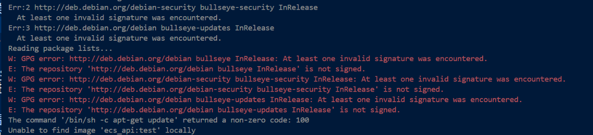

# 磁盘相关
1. 执行某个操作例如某脚本`./local_test.sh init` 的时候，遇到报错
    
    - 解决方法：
        - 查阅资料[stackoverflow: At least one invalid signature was encountered
](https://stackoverflow.com/questions/62473932/at-least-one-invalid-signature-was-encountered)后进行尝试和排查，发现应该是磁盘空间不足了，进行虚拟机磁盘扩容
# 网络相关
1. ssh连接不上，有很多原因
    1. 扩容后虚拟机启动不起来了：原因是因为虚拟机的磁盘扩容后，虚拟机的分区表没有更新，所以虚拟机无法识别新的磁盘空间。
        - 解决方法：
    [VMWare中给Ubuntu 虚拟机硬盘扩容后无法正常开机的相关问题](https://blog.csdn.net/Alan_Walker688/article/details/131889313)
    2. 启动之后网络不通，ens33网卡状态异常。连不到dockerhub，vscode也ssh不到
        - 解决方法：
    [Ubuntu上不了网：ifconfig查看只有lo,没有ens33问题解决参考方法](https://blog.csdn.net/qq_41969790/article/details/103222251)
    - [vscode连接不上问题和解决方法合集](https://blog.csdn.net/White_lies/article/details/124093530)
# GUI相关
1. GUI突然消失，只能进入tty1，并且 `startx` 报错；运行 gdm3 相关的命令报错 `gdm3 is broken or not fully installed`
    - https://askubuntu.com/questions/1050672/gdm3-does-not-start-in-ubuntu-18-04
    - 解决方法：