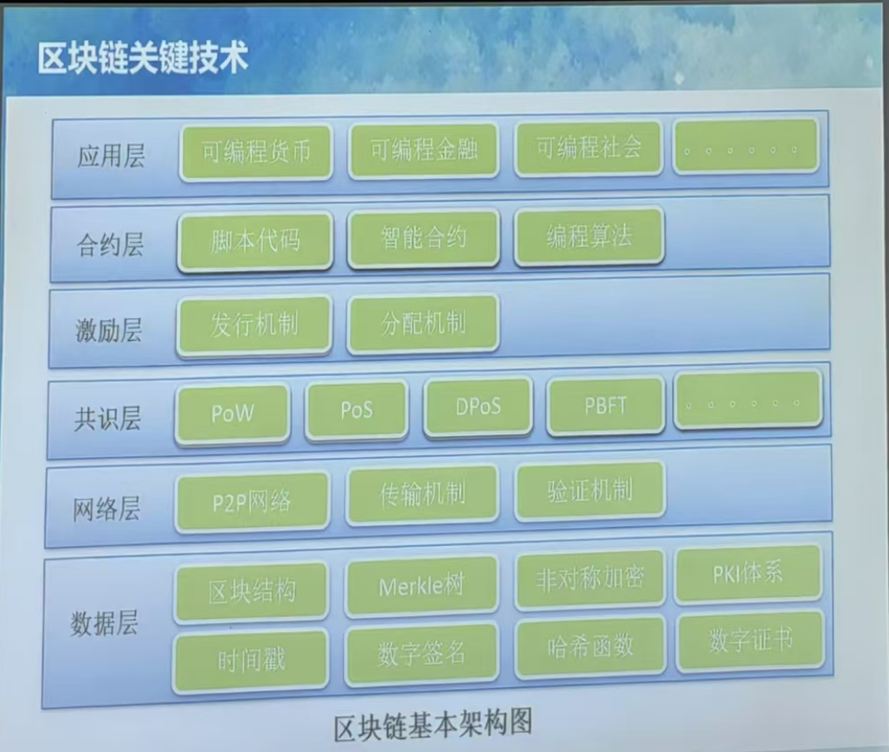
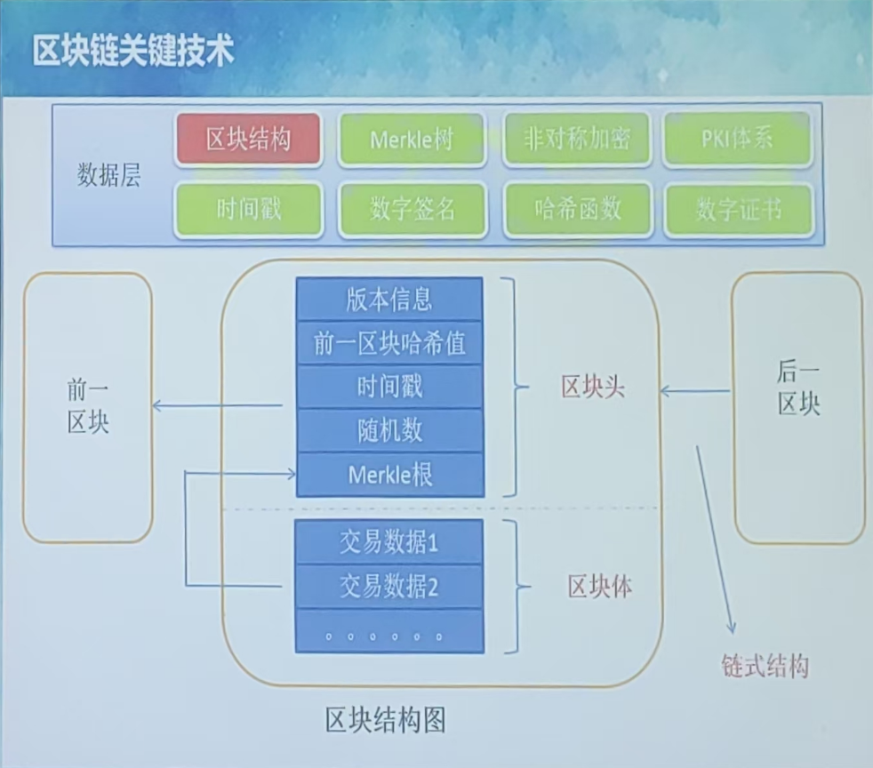
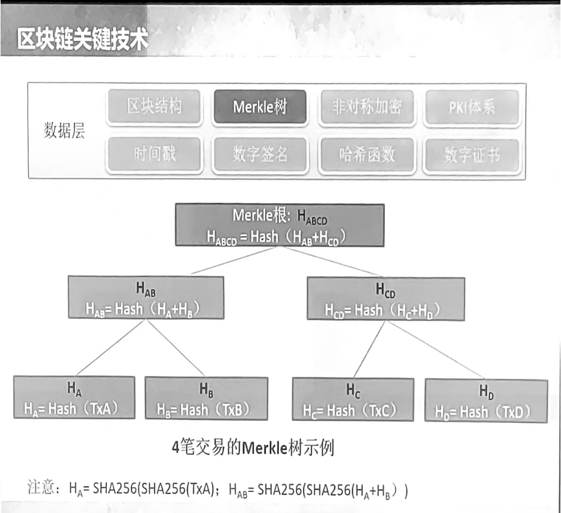

课程报告；
# 区块链技术与应用
## 区块链关键技术
### 区块链架构

数据层、网络层、共识层、激励层、合约层、应用层
### 区块结构

### Merkle树

通过Merkle树如何对区块中的交易进行验证？
做哈希的次数是log2(n)，n是交易数量，次数多了，速度慢了，但是校验的速度更快。
### 非对称加密
#### 分组对称加密算法
- DES
- AES
- IDEA
#### 非对称加解密算法
对比：对称加密算法只有一个密钥，非对称加密算法有两个密钥，公钥和私钥。
- RSA，基于大数质因子分解很困难的特性
- ECC（椭圆曲线加密算法）
- SM2（国密算法），基于椭圆曲线离散对数问题，加密强度高于RSA系列
优缺点：非对称加密算法加密速度慢，但是安全性高，对称加密算法加密速度快，但是安全性低。
#### 混合加密
对称加密算法加密数据，非对称加密算法加密对称加密算法的密钥。
先用非对称加密算法协商出一个临时的对称加密密钥（也称会话密钥），然后用对称加密算法加密数据。
典型的应用场景是HTTPS。
#### 数字签名

#### 数字证书

#### 鲍勃和爱丽丝的故事
鲍勃有两把钥匙，一把是公钥，另一把是私钥。

鲍勃把公钥送给他的朋友们----帕蒂、道格、苏珊----每人一把。

苏珊要给鲍勃写一封保密的信。她写完后用鲍勃的公钥加密，就可以达到保密的效果。

鲍勃收信后，用私钥解密，就看到了信件内容。这里要强调的是，只要鲍勃的私钥不泄露，这封信就是安全的，即使落在别人手里，也无法解密。

鲍勃给苏珊回信，决定采用"数字签名"。他写完后先用Hash函数，生成信件的摘要（digest）。

然后，鲍勃使用私钥，对这个摘要加密，生成"数字签名"（signature）。

鲍勃将这个签名，附在信件下面，一起发给苏珊。

苏珊收信后，取下数字签名，用鲍勃的公钥解密，得到信件的摘要。由此证明，这封信确实是鲍勃发出的。

苏珊再对信件本身使用Hash函数，将得到的结果，与上一步得到的摘要进行对比。如果两者一致，就证明这封信未被修改过。

复杂的情况出现了。道格想欺骗苏珊，他偷偷使用了苏珊的电脑，用自己的公钥换走了鲍勃的公钥。此时，苏珊实际拥有的是道格的公钥，但是还以为这是鲍勃的公钥。因此，道格就可以冒充鲍勃，用自己的私钥做成"数字签名"，写信给苏珊，让苏珊用假的鲍勃公钥进行解密。

后来，苏珊感觉不对劲，发现自己无法确定公钥是否真的属于鲍勃。她想到了一个办法，要求鲍勃去找"证书中心"（certificate authority，简称CA），为公钥做认证。证书中心用自己的私钥，对鲍勃的公钥和一些相关信息一起加密，生成"数字证书"（Digital Certificate）。

鲍勃拿到数字证书以后，就可以放心了。以后再给苏珊写信，只要在签名的同时，再附上数字证书就行了。

苏珊收信后，用CA的公钥解开数字证书，就可以拿到鲍勃真实的公钥了，然后就能证明"数字签名"是否真的是鲍勃签的。
### 网络层
P2P网络
### 共识层
共识层的作用是在不同的应用场景下，通过使用不同的共识算法，在决策权高度分散的来保证区块链网络中的节点之间能够达成一致，从而保证区块链网络的安全性和稳定性。
#### POW
工作量证明（Proof of Work）是一种通过解决数学问题来证明工作量的方法，是比特币的共识算法。
#### POS
权益证明（Proof of Stake）是一种通过持有货币来证明权益的方法，是以太坊的共识算法。
#### DPOS
股份授权证明（Delegated Proof of Stake）是一种通过持有货币来证明权益的方法，是EOS的共识算法。
#### PBFT
拜占庭容错（Practical Byzantine Fault Tolerance）是一种容错算法，是联盟链的共识算法。
### 激励层
激励层存在的必要性取决于
### 合约层
智能合约是一种特殊的协议，它是一种在区块链上运行的计算机程序，可以自动执行合约的条款。
#### 脚本代码
#### 智能合约
智能合约是区块链被称为去中心化的重要原因，它允许交易各方在不需要第三方见证的情况下，执行可追溯、不可逆转和安全的交易。
#### 编程算法
## Hyperledger社区
### hyperledger fabric
fabric 最早是由IBM公司提出的，是一个企业级的区块链解决方案，它是一个模块化的、可扩展的区块链架构，支持智能合约，支持多种共识算法，支持多种加密算法，支持多种身份验证机制，支持多种数据存储方式，支持多种链码编程语言。
