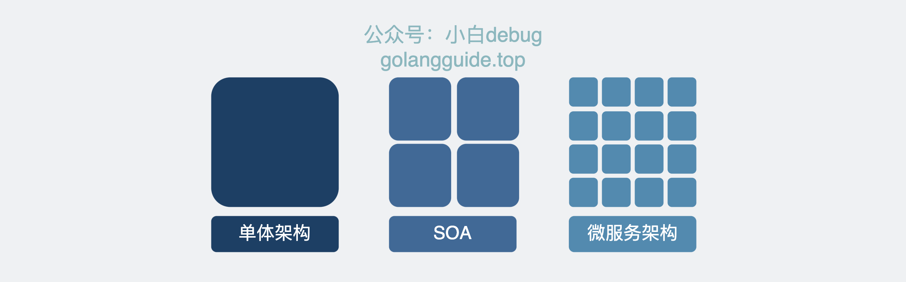

# 软件架构
## 单体 SOA 微服务
- 单体架构：将所有功能模块集成在一个应用中，开发、部署、维护都比较简单，但是随着业务的发展，单体应用会变得越来越庞大，开发效率低下，部署困难，维护成本高。
- SOA 架构：面向服务的架构，将应用拆分成多个服务，每个服务都是一个独立的功能模块，服务之间通过接口进行通信，服务之间的耦合度低，易于维护和扩展。
- 微服务架构：微服务架构是 SOA 架构的一种演进，将服务拆分的更细，每个服务都是一个独立的进程，服务之间通过 HTTP、RPC 等方式进行通信，每个服务都有自己的数据库，服务之间的耦合度更低，易于部署和扩展。

一句话解释：微服务架构是一种将应用程序拆分为小而自治的服务的软件架构模式。每个服务专注于执行特定的业务功能，并通过轻量级的通信机制进行交互。它提供了独立开发、可扩展和技术多样性的优势。

在微服务架构中，应用程序被拆分为一组小型、独立的服务，每个服务都专注于执行特定的业务功能。这些服务之间通过轻量级的通信机制进行交互，例如使用 HTTP/REST、消息队列或者事件总线。


每个微服务都有自己的代码库、数据库和部署单元。它们可以使用不同的编程语言和技术栈，根据自己的需求进行独立开发、测试和部署。每个微服务负责处理特定的业务领域，例如用户管理、订单处理或支付服务。

通过将应用程序拆分为多个小而自治的服务，微服务架构提供了一些优势：

独立开发和部署：每个微服务都可以独立开发、测试和部署，使团队能够更快速地迭代和交付功能。

松耦合和可扩展性：微服务之间通过轻量级的通信进行交互，它们之间的耦合度较低。这使得系统更容易扩展，可以根据需要对实例进行扩缩容。

技术多样性：由于每个微服务可以使用不同的技术栈，团队可以选择最适合其需求的技术和工具。

弹性和容错性：由于每个微服务是独立的，一个微服务的故障不会影响整个系统的稳定性，系统可以更好地应对故障和恢复。

虽然有许多优势，但同时也引入了不少复杂性和管理开销。微服务架构需要**服务发现、负载均衡、监控和日志等基础设施的支持**。同时由于服务个数变多，传统的运维方式效率完全跟不上，因此一般还需要一个开发同学能点点两下就完成部署运维的**devops平台(基于Kubenetters)**。
## 微服务网关
## api网关
# docker 镜像管理
## 主要特点
### 分层

### 写时复制

### 内容寻址

- registry：
- manifest：

虚悬镜像：没有被任何容器引用的镜像
中间层镜像：被多个镜像引用的镜像

commit：将容器的修改提交为一个新的镜像


数据卷：持久化存储
为什么需要数据卷：容器的可读写层是临时的，容器删除后数据会丢失，数据卷可以将数据持久化存储
如何增加数据卷


# k8s 集群管理


# actix web


# API blueprint
## 示例
```apib
# Group Message
## Message [/message]
### 发送消息 [POST]
+ Request (application/json)
    + Attributes
        + message: "Hello, World!" (string) - The message to send
+ Response 200 (application/json)
    + Attributes
        + message: "Message sent" (string) - The response message
```
## 语法
- `#`：标题
- `##`：子标题
- `###`：子子标题
- `+`：属性
- `+ Request`：请求
- `+ Response`：响应
- `+ Attributes`：属性列表
- `+ message: "Hello, World!" (string) - The message to send`：属性项
- `+ Request (application/json)`：请求类型
- `+ Response 200 (application/json)`：响应类型
