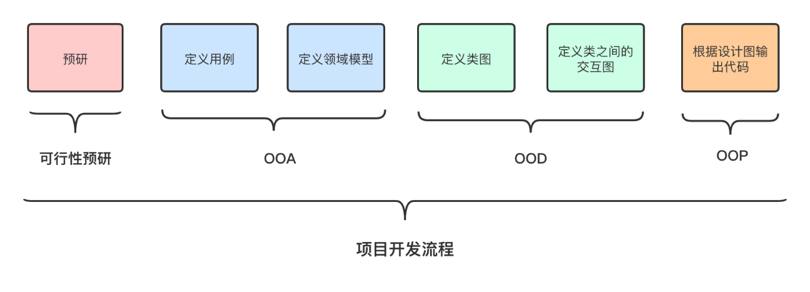

考点思维导图：https://mindline.cn/webapp?file=6CUH8M
# 名词表
如下表所示：
|英文|中文|
|---|---|
|artifacts|工件|
|Low Coupling|低耦合|
|High Cohesion|高内聚|
|monopoly game|大富翁游戏|
|SalesLineItem|销售订单项目|

# 知识点复习
## 名词解释todo
- 什么是OOD和OOP？

- 什么是软件设计模式？

## RUP（统一软件开发过程）
### 核心概念
RUP中定义的核心概念主要有角色、活动和工作

（1）角色：RUP预先定义了许多角色，角色描述了在项目开发中，一个人或者一个开发团队的工作职能与任务。

（2）活动：它是一个有明确功能的独立模块，反映了系统的某个功能。

（3）工件：是在活动进行过程中产生、创建或修改的一段信息，同时也是项目开发的文档资料
### 开发过程
RUP中的软件生命周期在时间上被分解为四个顺序的阶段，分别是：初始阶段、细化阶段、构造阶段和交付阶段。每个阶段结束于一个主要的里程碑。每个阶段本质上是两个里程碑之间的时间跨度。在每个阶段的结尾执行一次评估以确定这个阶段的目标是否已经满足。如果评估结

#### 初始阶段
（1）对需求有大概了解，确定系统中大多数角色和用例。

（2）划分主要子系统，给出系统的体系结构概貌

（3）分析整个项目进行中的业务和需求方面的主要风险，评价项目可行性。

（4）考虑时间、经费、技术、项目规模和效益等因素

（5）制定开发计划

（6）初始阶段结束时是第一个重要的里程碑：生命周期目标里程碑。生命周期目标里程碑评价项目基本的生存能力。
#### 细化阶段

（1）进行需求风险分析。考虑项目目标是否偏离用户需求

（2）进行技术风险分析。通过建立原型等方法，考虑所选技术方案可行性

（3）进行技能风险分析。考虑实施项目人员素质能否胜任项目要求

（4）进行政策风险分析。考虑政策性因素对项目的影响

（5）进行高层分析和设计，并作出结构性决策。

（6）产生简要体系结构，包括用例列表、领域概念模型和技术平台等

（7）为构造制定计划

（8）同时为项目建立支持环境，包括创建开发案例，创建模板、准则并准备工具。

（9）细化阶段结束时第二个重要的里程碑：生命周期结构里程碑。生命周期结构里程碑为系统的结构建立了管理基准并使项目小组能够在构建阶段中进行衡量。此刻，要检验详细的系统目标和范围、结构的选择以及主要风险的解决方案

 

#### 构造阶段

（1）构建阶段是一个制造过程，其重点放在管理资源及控制运作以优化成本、进度和质量，迭代增量的开发一个完整的软件系统。

（2）在构建阶段，所有剩余的构件和应用程序功能被开发并集成为产品，所有的功能被详细测试。

（3）构建阶段结束时是第三个重要的里程碑：初始功能里程碑。初始功能里程碑决定了产品是否可以在测试环境中进行部署。此刻，要确定软件、环境、用户是否可以开始系统的运作。此时的产品版本也常被称为“beta”版

 

#### 交付阶段

（1）交付阶段的重点是确保软件对最终用户是可用的。

（2）交付阶段可以跨越几次迭代，包括为发布做准备的产品测试，基于用户反馈的少量的调整。用户反馈应主要集中在产品调整，设置、安装和可用性问题，所有主要的结构问题应该已经在项目生命周期的早期阶段解决了。

（3）在交付阶段的终点是第四个里程碑：产品发布里程碑。此时，要确定目标是否实现，是否应该开始另一个开发周期。在一些情况下这个里程碑可能与下一个周期的初始阶段的结束重合

### 迭代思想
在软件开发的初期就想完全、准确地获得用户的需求基本是不可能的。实际上，设计者常常碰到的问题是需求在整个软件开发过程中经常会发生变化。而迭代式开发允许每次迭代开发过程中需求发生变化，它正是通过不断迭代来细化对问题的理解。这样，迭代式开发大大降低了项目开发的风险，提高了软件开发的效率。

### 敏捷开发todo
敏捷开发以用户的需求进化为核心，采用迭代、循序渐进的方法进行软件开发。

在敏捷开发中，软件项目在构建初期被切分成多个子项目，各个子项目的成果都经过测试，具备可视、可集成和可运行使用的特征。换言之，就是把一个大项目分为多个相互联系，但也可独立运行的小项目，并分别完成，在此过程中软件一直处于可使用状态。
### 部署图（针对计算节点）
### 迭代过程
### 增长过程
## OOA/OOD/OOP
一般我们我们接到产品经理的需求后，开发阶段分如何几个步骤

- 可行性预研阶段，此阶段评估需求是否合理，能否实现。
- OOA阶段，此阶段分析用例，定义领域模型。
- OOD阶段，此阶段定义类图，类之间的交互图（时序图等等）。
- OOP阶段，根据OOD设计的类图，类之间的交互图输出代码

### OOA
OOA全拼为Object-Oriented Analysis，面向对象分析。此过程是把现实的需求转义为领域模型（Domain Model）问题，以及输出领域模型（Domain Model）。第一步是根据需求输出用例，用例为一个一个场景，用户与App交互的场景。第二步是根据用例输出领域模型（Domian Model），领域模型（Domain Model）也就是我们常说的业务逻辑。会输出概念类，概念类的交互的关系，这部分概念类一般直接反应现实的事物。

### OOD
OOD全拼为Object-Oriented Design，面向对象设计。此过程是把我们的领域模型转为逻辑架构，类图，类之间的关系。
如何分层，如何分包，如何保证高内聚低耦合都是这部分要考虑的问题。这个阶段输出类图，时序图，包图等等。

### OOP
OOP全程为Object-oriented programming，面向对象编程。是把我们OOD的设计结果转为代码。

## GRASP原则
GRASP是一种面向对象设计的原则，全称为`General Responsibility Assignment Software Patterns`，即`通用职责分配软件模式`。GRASP是一种设计模式，它是一种用于面向对象设计的指导性原则，它提供了一种设计方法，帮助我们在设计过程中确定类的职责。GRASP的目的是帮助我们在设计过程中确定类的职责，以及确定类之间的交互关系。

Responsibilities and RDD 
RDD – Responsibility-Driven Design（职责驱动设计）
- Responsibilities are related to the obligation of an object in terms of its behavior
- Knowing responsibilities:
- Doing responsibilities: 

• GRASP are patterns to assign responsibilities to objects
• Interaction diagram (通信图) is often used as a tool to assign responsibilities to an object

### 1、Creator（创建者）

如果一个类创建了另外一个类，那么这两个类之间就有了耦合，也可以说产生了依赖关系。依赖或耦合本身是没有错误的，但是他们带来的问题就是在以后的维护中产生连锁反应，而必要的耦合是逃不掉的，我们能做的就是正确的创建耦合关系，不要随便建立类之间的依赖关系，那么该如何去做呢？就是要遵守创建者模式规定的基本原则，凡是不符合以下条件的，都不能随便用 A 创建 B。

谁负责创建类？在Java和C++中对应调用new或者对象构造函数。这个还比较容易理解，谁负责创建，则可以考虑将被创建者组合为创建者的一个属性（属性可见），或者创建者的某个函数中创建被创建者（局部可见）。
**Problem:**
Who should be responsible for creating a new instance of some class?
**Solution:**
Assign class B the responsibility to create an instance of class A if one of these is true (the more the better):
- B “contains” or compositely aggregates A
- B records A
- B closely uses A
- B has the initializing data for A

例子：
- 订单是商品的容器，订单应该负责创建商品

如果创建对象需要处理很多复杂性，例如使用回收的实例，或者根据某个外部属性值有条件地从一系列相似的类中创建实例，那么最好将创建对象的任务委托给一个叫做“工厂”的辅助类。

在这种情况下，工厂类会根据提供的信息决定创建哪种类的实例，然后返回这个新创建的实例。这样，工厂模式可以将具体的类名从应用程序代码中解耦，使得应用程序代码可以面向接口编程，而不是面向实现编程。

Low coupling is supported, which implies lower maintenance dependencies and higher opportunities for reuse. 

### ⭐2、Infomation Expert（信息专家）
信息专家模式是面向设计的最基本原则，是我们平时使用最多，应该跟我们的思想融为一体的原则。也就是说，我们设计对象（类）的时候，**如果某个类拥有完成某个职责所需要的所有信息，那么这个职责就应该分配给这个类来实现。这时，这个类就是相对于这个职责的信息专家。**

谁应该对某个行为或者认知负责？谁拥有实现该行为所需要的必须信息，就讲该职责让谁负责。**对应到代码中通常表现为某个行为方法需要定义在哪个类中。**
对于需要在类与类之间发送消息的方法，需要在发送方保留被发送方的指针或者引用。（对象可见性）

**当需要增加某个方法时，找出合适的”信息专家“，把此方法加入到该信息专家中。**

例子：
-  常见的网上商店的购物车（ShopCar），需要让每种商品（SKU）只在购物车内出现一次，购买相同商品，只需要更新商品的数量即可。
-  一个订单（Order）是由多个订单项（OrderItem）组成，订单项是由商品（Product）和数量（quantity）组成的，订单项的总价是商品的单价乘以数量。

### ⭐3、Low coupling（低耦合）
低耦合模式的意思就是要我们尽可能地减少类之间的连接。

一个类尽可能少的和多个类发生关系，尽量少的依赖于其他类。表现在代码上为一个类较少的存在其他类的指针和引用。

其作用非常重要：

低耦合降低了因一个类的变化而影响其他类的范围。

低耦合使用类更容易理解，因为类会变得简单，更内聚。

下面这些情况会造成类A、B之间的耦合：

A 是 B 的属性
A 调用 B 的实例的方法
A 的方法中引用的 B，例如 B 是 A 方法的返回值或参数。
A 是 B 的子类，或者 A 实现 B
关于低耦合，还有下面一些基本原则：

a、Don’t Talk to Strangers 原则

意思就是说，不需要通信的两个对象之间，不要进行无谓的连接，连接了就有可能产生问题，不连接就一了百了了。

b、如果 A 已经和 B 有连接，如果分配 A 的职责给 B 不合适的话（违反信息专家模式），那么就把 B 的职责分配给 A。

c、两个不同模块的内部类之间不能连接

### ⭐4、High cohesion（高内聚）
高内聚的意思是给类尽量分配内聚的职责，也可以说成是功能性内聚的职责。即功能性紧密相关的职责应该放在一个类里，并共同完成有限的功能，那么就是高内聚合。这样更有利于类的理解和重用，也便于类的维护。

高内聚也可以说是一种隔离，就像人体由很多独立的细胞组成，大厦由很多砖头、钢筋、混凝土组成，每一个部分（类）都有自己独立的职责和特性，每一个部分内部发生了问题，也不会影响其他部分，因为高内聚的对象之间是隔离开的。

尽量保持类能够只有单一的事情，只做自己份内的事，不包含过多的职责。表现为对象中的方法只是自己必须完成的工作，对于一些其他不太相关的工作可以委派给其它类，转而建立之间的关联即可。

Some scenarios that illustrate varying degrees of functional cohesion:
• **Very low cohesion** – a class is solely responsible for many things in 
very different functional areas
• **Low cohesion** – a class has sole responsibility for a complex task in 
one functional area
• **High cohesion** – a class has moderate responsibilities in one 
functional area and collaborates with other classes to fulfill tasks

**Problem:** How to keep objects focused, understandable, and manageable, and as a side effect, support Low Coupling? 
**Solution:** Assign responsibilities so that cohesion remains high. Use this to evaluate alternatives

图2额外增加了register到sale的耦合，让register干了杂活 一定程度破坏了它的内聚性。
### ⭐5、Controller（控制器）
控制器模式是指在设计过程中，我们需要确定哪个类应该负责处理用户的请求。在这种情况下，我们应该考虑哪个类拥有处理用户请求所需要的所有信息，然后将处理用户请求的职责分配给这个类。这样，我们就可以避免处理用户请求的职责分散到多个类中，从而提高代码的可维护性。

UI层和领域模型之间的模式应用。主要是为了保持UI层和业务逻辑层不相互污染。通常对应的创建一个代表系统的类或者一个虚构类用于UI层和领域层的消息交互。

**Problem:** What first object beyond the UI layer receives and coordinates (“controls”) a system operation?
**Solution:** Assign the responsibility to an object representing one of these choices:
- Represents the overall “system,” a “root object,” a device that the software is running within, or a major subsystem (these are all variables of a façade controller).
- Represents a use case scenario within which the system operation occurs (a use case or session controller)

感觉就像是Java后端开发的Controller层，负责接收前端的请求，然后调用Service层的方法，最后返回结果给前端。这个Controller层就是一个控制器，负责控制整个请求的流程。
### 6、Polymorphism（多态）
这里的多态跟 OO 三大基本特征之一的“多态”是一个意思。即多个类有一些共同的形态。在代码上表现为替换switch case之类的操作，建立多态关系，通常以抽象超类和接口的形式呈现，子类进行继承。
**Problem:**
How to handle alternatives based on type? How to create pluggable software components?
**Solution:**
When related alternatives or behaviors vary by type (class), assign responsibility for the behavior – using polymorphic operations – to the types for which the 
behavior varies

**Examples:**
• In the **NextGen POS application**, there are multiple external third-party tax calculators that must be supported; the system needs to be able to integrate with different ones
• What objects should be responsible for handling these varying external tax calculator interfaces?

在monopoly game中的例子：player选择根据不同的square类型来执行不同的操作，这里就可以使用多态来实现。

### 7、Pure Fabrication（纯虚构）
这里的纯虚构跟我们常说说的纯虚构函数意思相近。高内聚低耦合，是系统设计的终极目标，但是内聚和耦合永远都是矛盾对立的。高内聚以为这拆分出更多数量的类，但是对象之间需要协作来完成任务，这又造成了高耦合，反过来依然。该如何解决这个矛盾呢？有时候在类与类之间通过构建一个实际并不存在的类用于信息的传递和交换以保持高内聚和低耦合的特点。

把高度内聚的职责分配给虚构出来的一个类，这个类在领域模型里没有对应的概念。
**Problem:**
What object should have the responsibility, when you do not want to violate High Cohesion and Low Coupling, or other goals, but solutions offered by Expert (for 
example) are not appropriate?
**Solution:**
Assign a highly cohesive set of responsibilities to an artificial or convenience class that does not represent a problem domain concept – something made up, to support high cohesion, low coupling, and reuse

例子：
- 持久化存储
    - 解决信息专家模式留下来的问题：在某些情况下，专家建议的解决方案是不可取的，通常是因为耦合和内聚方面的问题。例如，谁应该负责在数据库中保存Sale ?
    - 假设需要支持在关系数据库中保存Sale实例，从Expert获得的解决方案违反了高内聚、低耦合和重用
    - 一个合理的解决方案是创建一个新类，该类单独负责在某种持久存储介质(例如关系数据库)中保存对象
    - • The Sale remain well-designed, with high cohesion and low coupling
    • The PersistentStorage class is itself relatively cohesive, having the sole purpose of storing or inserting objects in a persistent storage medium
    • The PersistentStorage class is a very generic and reusable object
- 在monopoly game中，Handling the Dice：

Many existing object-oriented design patterns are example of Pure Fabrications: Adapter, Strategy, Command, and so on. All GoF design patterns are Pure Fabrications. Virtually all other design patterns are Pure Fabrications
### ⭐8、Indirection（间接）
保持类和类之间的间接关系，减少直接关系，如适配器等。纯虚构就是因为间接性而产生的。

把职责分配到哪里可以避免两个或者多个对象之间的耦合？如何解耦对象以保持较高的可重用性？

把职责分配给一个中介对象，隔离对象与其他构件或者服务，使它们不产生直接耦合。

因为中介对象是一种特殊的作用，一般对象与中间对象之间的直接耦合，相对比较简单。

“间接”顾名思义，就是这个事不能直接来办，需要绕个弯才行。绕个弯的好处就是，本来直接会连接在一起的对象彼此隔离开了，一个变动不会影响另一个。就像我在前面的低耦合模式里说的一样，“两个不同模块的内部类之间不能直接连接”，但是我们可以通过中间类来间接连接两个不同的模块，这样对于这两个模块来说，他们之间仍然是没有耦合/依赖关系的。

**Problem:**
Where to assign a responsibility, to avoid direct coupling between two (or more) things? How to de-couple objects so that low coupling is supported and reuse potential remains higher?
**Solution:**
Assign the responsibility to an intermediate object to mediate between other components or services so that they not directly coupled
### 9、Protected Variations（受保护的变化/防止变异）
只向自己熟悉的对象发送消息，熟悉的对象包括this对象，方法的参数，this属性，this属性中的集合元素，在类方法中创建的对象。

如何设计对象、系统和子系统，使得这些成分里面的变化因素、不稳定因素不会对系统的其余部分造成意想不到的影响？

标识出能够预计的变化点或者不稳定点，职责分配的时候创建一个稳定的接口，把它们与系统的其余部分隔离开来。

预先找出不稳定的变化点，使用统一的接口封装起来，如果未来发生变化的时候，可以通过接口扩展新的功能，而不需要去修改原来旧的实现。也可以把这个模式理解为 OCP（开闭原则），就是说一个软件实体应当对拓展开发，对修改关闭。在设计一个模块的时候，要保证这个模块可以在不需要被修改的前提下可以得到拓展。这样做的好处就是通过拓展给系统提供了新的职责，以满足新的需求，同时又没有改变系统原来的功能。

**Problem:**
How to design objects, subsystems, and systems so that the variations or instability in these elements does not have an undesirable impact on other elements?
**Solution:**
Identify points of predicted variations or instability; assign responsibilities to create a stable interface around them

Benefits
• Extensions required for new variations are easy to add
• New implementations can be introduced without affecting clients
• Coupling is lowered
• The impact or cost of changes can be lowered
## 设计原则
### 1、开闭原则（OCP）
### 2、（里氏）替换原则/利斯科夫可替代原理/Liskov Substitution Principle
使用基类对象指针或引用的函数必须能够在不了解衍生类的条件下使用衍生类的对象。

主要阐述了有关继承的一些原则，也就是什么时候应该使用继承，什么时候不应该使用继承，以及其中的蕴涵的原理。

我们把里氏代换原则解释得更完整一些：**在一个软件系统中，子类应该可以替换任何基类能够出现的地方，并且经过替换以后，代码还能正常工作。**

https://blog.csdn.net/qq_36501591/article/details/114849676

实现开闭原则的关键步骤是抽象化，基类与子类之间的继承关系就是一种抽象化的体现。**因此，里氏代换原则是实现抽象化的一种规范。违反里氏代换原则意味着违反了开闭原则，反之未必。里氏代换原则是使代码符合开闭原则的一个重要保证。**

通过里氏代换原则给我们带来了什么样的启示？
- 类的继承原则：如果一个继承类的对象可能会在基类出现的地方出现运行错误，则该子类不应该从该基类继承，或者说，应该重新设计它们之间的关系。
- 动作正确性保证：符合里氏代换原则的类扩展不会给已有的系统引入新的错误。
### 3、依赖倒置原则（DIP——Dependency Inversion Principle）
抽象不应该依赖于细节。细节应该依赖于抽象。

高层不应该依赖于底层，两者都应该依赖于抽象。

OCP宣扬了目标，DIP宣扬了机制。
### 4、接口隔离原则（ISP）
接口隔离原则（ISP）是指：客户端不应该被迫依赖于它不使用的接口。这个原则的目的是降低类之间的耦合度，降低依赖，提高类的内聚性。
### 5、单一职责原则（SRP）
单一职责原则（SRP）是指：一个类应该只有一个引起它变化的原因。也就是说，一个类应该只有一个职责。如果一个类有多个职责，那么这些职责之间就会耦合在一起，这样就会导致类的职责不清晰，不利于类的维护和扩展。
### 6、迪米特法则（LOD）
迪米特法则（LOD）是指：一个对象应该对其他对象有最少的了解。也就是说，一个对象应该尽可能少地与其他对象发生相互作用。迪米特法则的目的是降低类之间的耦合度，降低依赖，提高类的内聚性。
### 7、合成/聚合复用原则（CARP）
合成/聚合复用原则（CARP）是指：尽量使用合成/聚合，尽量不要使用继承。合成/聚合复用原则的目的是降低类之间的耦合度，降低依赖，提高类的内聚性。
## GoF设计模式todo
GoF设计模式是指Gang of Four Design Patterns，即四人帮设计模式。四人帮是指Erich Gamma、Richard Helm、Ralph Johnson和John Vlissides四位作者，他们在1994年出版了一本名为《设计模式：可复用面向对象软件的基础》的书，这本书总结了23种设计模式，这23种设计模式被称为GoF设计模式。

前面说明了 GoF 的 23 种设计模式的分类，现在对各个模式的功能进行介绍。
1.	**单例（Singleton）模式**：某个类只能生成一个实例，该类提供了一个全局访问点供外部获取该实例，其拓展是有限多例模式。
2.	原型（Prototype）模式：将一个对象作为原型，通过对其进行复制而克隆出多个和原型类似的新实例。
3.	**工厂方法（Factory Method）模式**：定义一个用于创建产品的接口，由子类决定生产什么产品。
4.	抽象工厂（AbstractFactory）模式：提供一个创建产品族的接口，其每个子类可以生产一系列相关的产品。
5.	建造者（Builder）模式：将一个复杂对象分解成多个相对简单的部分，然后根据不同需要分别创建它们，最后构建成该复杂对象。
6.	代理（Proxy）模式：为某对象提供一种代理以控制对该对象的访问。即客户端通过代理间接地访问该对象，从而限制、增强或修改该对象的一些特性。
7.	***适配器（Adapter）模式***：将一个类的接口转换成客户希望的另外一个接口，使得原本由于接口不兼容而不能一起工作的那些类能一起工作。
    - 适配器模型与其他模型有什么关系？有什么相互影响？
        - 适配器模式是一种结构设计模式，它允许对象之间的接口不兼容的情况下能够一起工作。适配器模式通过创建一个适配器类，将一个类的接口转换成客户希望的另外一个接口，使得原本由于接口不兼容而不能一起工作的那些类能一起工作。
        
8.	桥接（Bridge）模式：将抽象与实现分离，使它们可以独立变化。它是用组合关系代替继承关系来实现，从而降低了抽象和实现这两个可变维度的耦合度。
9.	装饰（Decorator）模式：动态的给对象增加一些职责，即增加其额外的功能。
10.	外观（Facade）模式：为多个复杂的子系统提供一个一致的接口，使这些子系统更加容易被访问。
11.	享元（Flyweight）模式：运用共享技术来有效地支持大量细粒度对象的复用。
12.	组合（Composite）模式：将对象组合成树状层次结构，使用户对单个对象和组合对象具有一致的访问性。
13.	模板方法（TemplateMethod）模式：定义一个操作中的算法骨架，而将算法的一些步骤延迟到子类中，使得子类可以不改变该算法结构情况下重定义该算法的某些特定步骤。
14.	***策略（Strategy）模式***：定义了一系列算法，并将每个算法封装起来，使它们可以相互替换，且算法的改变不会影响使用算法的客户。
15.	命令（Command）模式：将一个请求封装为一个对象，使发出请求的责任和执行请求的责任分割开。
16.	职责链（Chain of Responsibility）模式：把请求从链中的一个对象传到下一个对象，直到请求被响应为止。通过这种方式去除对象之间的耦合。
17.	***状态（State）模式***：允许一个对象在其内部状态发生改变时改变其行为能力。
    - 状态模式是一种行为设计模式，它允许一个对象在其内部状态改变时改变它的行为。对象看起来好像修改了它的类。

    - 状态模式的关键是引入了一个抽象类，它可以有多个子类，每个子类表示一个具体的状态。而对象的属性中就保存了一个指向抽象状态类的指针，这样对象就可以动态地改变它的状态。

    - 状态模式的结构：
        - Context（环境类）：环境类是拥有多种状态的对象，它可以是一个电梯、一个游戏角色等。环境类需要维护一个抽象状态类的实例，这个实例定义当前状态。
        - State（抽象状态类）：抽象状态类是一个接口，或者是一个抽象类，它定义了一个接口，用于封装环境对象中的特定状态所对应的行为。
        - ConcreteState（具体状态类）：具体状态类是抽象状态类的子类，它实现了抽象状态类中定义的接口，完成了特定状态下的行为。

    - 状态模式的优点：
        - 状态模式将与特定状态相关的行为局部化，并且将不同状态的行为分割开来。
        - 状态模式使得状态转换显式化，使得状态之间的转换更加明确。

    - 状态模式和状态图和类图的关系：
        - 状态模式是一种设计模式，它是一种行为设计模式，它允许一个对象在其内部状态改变时改变它的行为。
        - 状态图是一种图形化的表示方法，它用来表示一个对象的状态和状态之间的转换关系。
        - 类图是一种图形化的表示方法，它用来表示一个对象的类和类之间的关系。

18.	观察者（Observer）模式：多个对象间存在一对多关系，当一个对象发生改变时，把这种改变通知给其他多个对象，从而影响其他对象的行为。
19.	中介者（Mediator）模式：定义一个中介对象来简化原有对象之间的交互关系，降低系统中对象间的耦合度，使原有对象之间不必相互了解。
20.	迭代器（Iterator）模式：提供一种方法来顺序访问聚合对象中的一系列数据，而不暴露聚合对象的内部表示。
21.	访问者（Visitor）模式：在不改变集合元素的前提下，为一个集合中的每个元素提供多种访问方式，即每个元素有多个访问者对象访问。
22.	备忘录（Memento）模式：在不破坏封装性的前提下，获取并保存一个对象的内部状态，以便以后恢复它。
23.	解释器（Interpreter）模式：提供如何定义语言的文法，以及对语言句子的解释方法，即解释器。

# 建模题，场景+图
- 定义一些类，画类图
- 定一个用例，写用例文本，画用例图
- 针对场景练习：
    - ATM机
    - 银行业务
    - 买股票
    - 火车订票12306
# 综合设计题
## 用例图
用例模型，用例文本
## 领域模型
不写方法，区别于类图
## 状态机图
## 采用GoF的一种设计模式来对状态图或者类图进行修正
从三个场景中选择：
1. 智能家居中的远程控制
2. 汽车租赁，嘀嘀打车
3. 电商拼多多
# 选择题

## 设计模式

### 单例

### 外观

### 工厂

### 代理

### 参考往年

## 活动图

## 状态图

## 类图

## 时序图

## 需求分析，用例图

## 操作

## 描述结构

## 用例分析

## 类中的职责分配：通讯图和时序图