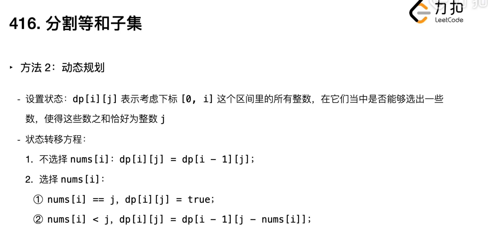
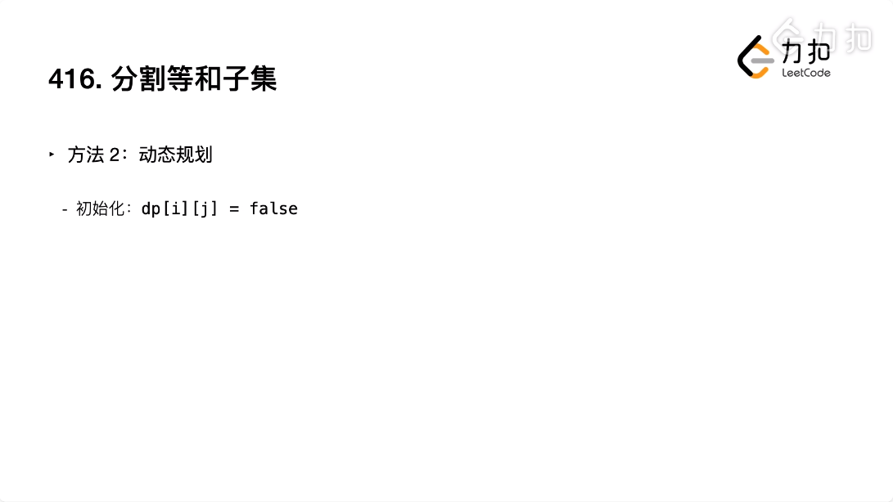
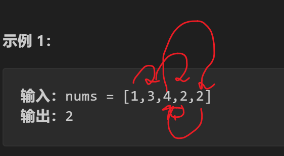
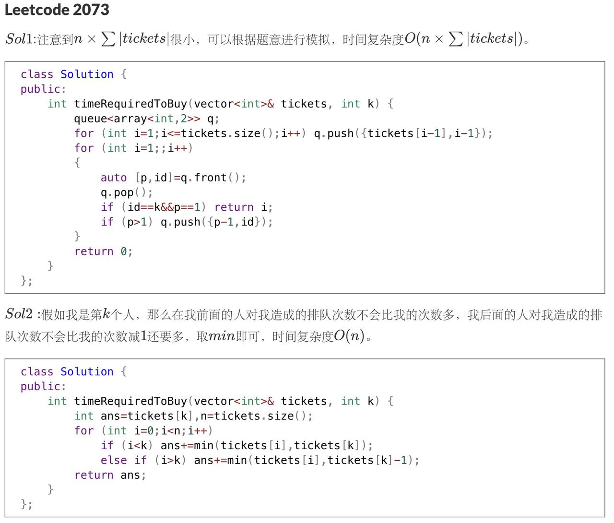

# STL
## vector

## unordered_map

## unordered_set

## queue

## stack

## priority_queue

## pair

## map

## set
set 是 C++ 标准库中的一种关联容器，其底层实现通常是红黑树（Red-Black Tree）。红黑树是一种自平衡二叉搜索树，能够保证插入、删除和查找操作的时间复杂度为 O(log n)。

### 特点：
- 有序性：set 中的元素是有序的，按照键值的升序排列。
- 唯一性：set 中的元素是唯一的，不允许重复。
- 自动平衡：红黑树会在插入和删除操作后自动调整，以保持树的平衡。

### 各种操作的时间复杂度

1. **插入元素 (`insert`)**：
   - 时间复杂度：O(log n)
   - 解释：由于 set 底层实现为红黑树，插入操作需要在树中找到正确的位置并进行平衡调整。

2. **删除元素 (`erase`)**：
   - 时间复杂度：O(log n)
   - 解释：删除操作需要在树中找到元素并进行删除，同时保持树的平衡。

3. **查找元素 (`find`)**：
   - 时间复杂度：O(log n)
   - 解释：查找操作需要在树中进行二分查找。

4. **获取最小元素 (`begin`)**：
   - 时间复杂度：O(1)
   - 解释：红黑树的最左节点即为最小元素，直接访问即可。

5. **获取最大元素 (`rbegin`)**：
   - 时间复杂度：O(1)
   - 解释：红黑树的最右节点即为最大元素，直接访问即可。

6. **检查元素是否存在 (`count`)**：
   - 时间复杂度：O(log n)
   - 解释：`count` 方法实际上是调用 `find` 方法来检查元素是否存在。

7. **遍历元素**：
   - 时间复杂度：O(n)
   - 解释：遍历整个 set 需要访问每个元素一次。

### 使用场景

1. **需要有序集合**：
   - 当你需要一个有序的集合时，set 是一个很好的选择。它可以自动维护元素的顺序，方便进行范围查询和有序输出。

2. **需要唯一性**：
   - 当你需要确保集合中的元素唯一时，set 可以自动处理重复元素的插入，保证集合中没有重复元素。

3. **频繁查找最小/最大元素**：
   - 如果你的应用场景需要频繁查找集合中的最小或最大元素，set 提供了高效的 O(1) 时间复杂度的访问方式。

4. **需要高效的插入和删除操作**：
   - set 提供了 O(log n) 时间复杂度的插入和删除操作，适合需要频繁进行这些操作的场景。


### 常用API：
```C++
#include <set>
#include <iostream>

int main() {
    // 定义
    std::set<int> s;

    // 插入元素-insert
    s.insert(5);
    s.insert(3);
    s.insert(8);

    // 查找元素-find
    auto it = s.find(5);
    if (it != s.end()) {
        std::cout << "Found 5" << std::endl;
    }

    // 获取最小和最大元素-begin, end, rbegin, rend
    // begin() 返回指向第一个元素的迭代器
    // end() 返回指向最后一个元素的下一个位置的迭代器
    // rbegin() 返回指向最后一个元素的迭代器
    // rend() 返回指向第一个元素的前一个位置的迭代器
    int minElement = *s.begin();
    int maxElement = *s.rbegin();
    std::cout << "Min: " << minElement << ", Max: " << maxElement << std::endl;

    // 遍历元素
    for (int x : s) {
        std::cout << x << " ";
    }

    return 0;
}
```
# 杂题
## linked list
### 2. Add Two Numbers
> You are given two non-empty linked lists representing two non-negative integers. The digits are stored in reverse order, and each of their nodes contains a single digit. Add the two numbers and return the sum as a linked list.
> 
> You may assume the two numbers do not contain any leading zero, except the number 0 itself.

这道题原理很简单，就是基础的带进位的加法器，但是需要注意的是链表的使用。

虚拟头节点、指向虚拟头节点的指针`dummy`和临时节点`temp`.

在进入加法循环之前，先利用`ListNode`的无参构造函数创建一个虚拟头指针作为起点，然后再定义一个临时指针`temp`，将`temp`指针初始化为`dummy`指针，即让`temp`指向`dummy`所指向的节点。

也就是说，同一个虚拟头节点拥有两个指向它的指针`dummy`和`temp`，后续`temp`作为临时指针不断移动到下一个新的有效节点，而`dummy`一直指向最开始的虚拟头节点不变。所以最后返回`dummy->next`的时候就是从第一个有效结点开始的链表全体了。


*解决方案的代码由@m_isha_125的回答提供。*
```cpp
/**
 * Definition for singly-linked list.
 * struct ListNode {
 *     int val;
 *     ListNode *next;
 *     ListNode() : val(0), next(nullptr) {}
 *     ListNode(int x) : val(x), next(nullptr) {}
 *     ListNode(int x, ListNode *next) : val(x), next(next) {}
 * };
 */
class Solution {
public:
    ListNode* addTwoNumbers(ListNode* l1, ListNode* l2) {
        ListNode* dummy=new ListNode();
        ListNode* temp=dummy;
        int carry=0;
        while(l1!=NULL || l2!=NULL || carry){
            int sum=0;
            if(l1!=NULL){
                sum+=l1->val;
                l1=l1->next;
            }
            if(l2!=NULL){
                sum+=l2->val;
                l2=l2->next;
            }
            sum+=carry;
            carry=sum/10;
            ListNode* newnode=new ListNode(sum%10);
            temp->next=newnode;
            temp=temp->next;
        }
        return dummy->next;
    }
};
```
#### 内存泄漏的问题
在C++中，`new`和`delete`是成对出现的，如果在使用`new`之后没有使用`delete`，就会造成内存泄漏。在这道题中，如果不使用`delete`，就会造成内存泄漏。
修改：
```cpp
class Solution {
public:
	ListNode* addTwoNumbers(ListNode* l1, ListNode* l2) {
		ListNode* dummy=new ListNode();
		ListNode* temp=dummy;
		int carry=0;
		while(l1!=NULL || l2!=NULL || carry){
			int sum=0;
			if(l1!=NULL){
				sum+=l1->val;
				l1=l1->next;
			}
			if(l2!=NULL){
				sum+=l2->val;
				l2=l2->next;
			}
			sum+=carry;
			carry=sum/10;
			ListNode* newnode=new ListNode(sum%10);
			temp->next=newnode;
			temp=temp->next;
		}
		ListNode* ans=dummy->next;
		delete dummy;
		return ans;
	}
};
```

### 19. Remove Nth Node From End of List
> Given the head of a linked list, remove the nth node from the end of the list and return its head.      
```C++
/**
 * Definition for singly-linked list.
 * struct ListNode {
 *     int val;
 *     ListNode *next;
 *     ListNode() : val(0), next(nullptr) {}
 *     ListNode(int x) : val(x), next(nullptr) {}
 *     ListNode(int x, ListNode *next) : val(x), next(next) {}
 * };
 */
class Solution {
public:
    ListNode* removeNthFromEnd(ListNode* head, int n) {
        ListNode *fast = head, *slow = head;
        for (int i = 0; i < n; i++) fast = fast->next;
        if (!fast) return head->next;
        while (fast->next) fast = fast->next, slow = slow->next;
        slow->next = slow->next->next;
        return head;
    }
};
```
这道题有两个思路。一个是单指针遍历两次链表，但是不太好控制改变后继节点的是哪一个，各种情况很难有一个通用的循环格式（至少我尝试了一会没能成功）；第二种就是双指针，快慢指针，快指针先走n步，然后快慢指针一起走，当快指针走到链表尾部的时候，慢指针就是要删除的节点的前驱节点，然后改变后继节点即可。有一点需要注意就是，fast先走n步是绝对不会越界的，正数倒数都大于等于n个结点。

### 21. Merge Two Sorted Lists
> Merge two sorted linked lists and return it as a sorted list. The list should be made by splicing together the nodes of the first two lists.

原来思路是挨个元素提取出来排序再放回一个新的链表里，但是……

*你的代码有一些错误，我可以帮你指出并改正。首先，你的代码没有考虑两个链表为空的情况，这可能导致空指针异常。其次，你的代码使用了一个额外的 vector 容器来存储两个链表中的元素，然后对其进行排序，这增加了空间复杂度和时间复杂度。最后，你的代码在遍历 vector 时没有创建新的节点，而是直接修改了原来的节点的值，这可能破坏了原来的链表结构，并且可能导致内存泄漏。*

建议答案：
```C++
class Solution {
public:
    ListNode* mergeTwoLists(ListNode* list1, ListNode* list2) {
        // 如果两个链表都为空，直接返回空指针
        if (list1 == nullptr && list2 == nullptr) return nullptr;
        // 创建一个哑节点作为结果链表的头节点
        ListNode* dummy = new ListNode();
        // 创建一个指针指向结果链表的当前节点
        ListNode* curr = dummy;
        // 当两个链表都不为空时，比较它们的头节点的值，将较小的节点添加到结果链表中，并移动对应的指针
        while (list1 != nullptr && list2 != nullptr) {
            if (list1->val < list2->val) {
                curr->next = list1;
                list1 = list1->next;
            } else {
                curr->next = list2;
                list2 = list2->next;
            }
            curr = curr->next;
        }
        // 当跳出循环时，说明有一个链表已经为空，将另一个链表剩余的部分直接接到结果链表中
        curr->next = list1 == nullptr ? list2 : list1;
        // 返回结果链表的头节点
        return dummy->next;
    }
};
```
这个代码的时间复杂度是 O(n+m)，其中 n 和 m 分别是两个链表的长度。空间复杂度是 O(1)，只需要常数级别的额外空间.


### 1071.Greatest Common Divisor of Strings
>For two strings s and t, we say "t divides s" if and only if s = t + ... + t (i.e., t is concatenated with itself one or more times).
>
>Given two strings str1 and str2, return the largest string x such that x divides both str1 and str2.

```C++
class Solution {
public:
    string gcdOfStrings(string str1, string str2) {
        return (str1 + str2 == str2 + str1)? 
        str1.substr(0, gcd(size(str1),size(str2))): "";
    }
};
```
这道题的思路是，如果两个字符串存在最大公约数，那么这个最大公约数一定是两个字符串的前缀，所以只需要找到两个字符串的最大公约数的长度，然后截取其中一个字符串的前缀即可。

>断更了几个月，最近“金三银四”，惊觉自己还没准备好，有的同学准备蓝桥杯已经刷了不少题了，我也打算回来抽空刷刷题。


# Hot 100
## 哈希
1. 两数之和
暴力时间复杂度较高的原因是寻找 target - x 的时间复杂度过高。因此，我们需要一种更优秀的方法，能够快速寻找数组中是否存在目标元素。如果存在，我们需要找出它的索引。
使用哈希表，可以将寻找 target - x 的时间复杂度降低到从 O(N) 降低到 O(1)。
这道题的思路是**使用哈希表来存储每个元素的下标，然后遍历数组**，对于每个元素，查找哈希表中是否存在目标元素，如果存在，返回两个元素的下标。
- 注意哈希表的api。
```C++
class Solution {
public:
    vector<int> twoSum(vector<int>& nums, int target) {
        unordered_map<int,int> hashtable;
        for(int i=0;i<nums.size();i++){
            auto it = hashtable.find(target-nums[i]);
            if (it != hashtable.end()){
                return {it->second,i};
            }
            hashtable[nums[i]]=i;
        }
        return {};
    }
};
```
2. 字母异位词分组
思路1，排序：由于互为字母异位词的两个字符串包含的字母相同，因此对两个字符串分别进行排序之后得到的字符串一定是相同的，故可以将排序之后的字符串作为哈希表的键
思路2，计数：由于互为字母异位词的两个字符串包含的字母相同，因此两个字符串中的相同字母出现的次数一定是相同的，故可以将每个字母出现的次数使用字符串表示，作为哈希表的键。
```C++
class Solution {
public:
    vector<vector<string>> groupAnagrams(vector<string>& strs) {
        unordered_map<string,vector<string>> hash;
        for (string& str: strs){
            string key = str;
            sort(key.begin(),key.end());
            hash[key].emplace_back(str);
        }
        vector<vector<string>> ans;
        for(auto it = hash.begin(); it!=hash.end();it++){
            ans.emplace_back(it->second);
        }
        return ans;
    }
};
```
- 注意哈希表的api。
- `emplace_back()` 函数是C++11中引入的新函数，用于在容器的尾部插入一个元素，与push_back()函数的功能类似，但是效率更高。
3. 最长连续序列
    哈希表，把所有的数放入哈希表中，然后遍历数组中的每个数，如果这个数是连续序列的第一个数，那么就往后找，直到找到连续序列的最后一个数，更新最长连续序列的长度。
    注意用 if 判断中断剪枝。
## 双指针
1. 移动零
>这道题的思路是使用双指针，一个指针a用于遍历数组，另一个指针b用于指向下一个非零元素应该放置的位置。遍历数组，当遇到非零元素时，将其放置到指针指向的位置，然后将指针向后移动一位。遍历结束后，将指针后的所有元素置为 0。
2. 盛最多水的容器
>这道题非常适合使用双指针技巧来解决。这里的双指针主要指的是左右指针。你可以考虑以下思路：
>1. **初始化**：左指针`left`置于数组的开始位置，右指针`right`置于数组的末尾位置。这代表了容器的最大宽度。
>2. **移动规则**：比较左右指针指向的高度，移动较短的一端。因为容器的容量受限于较短的边，移动较长的边不会增加容器的容量，反而可能减少容量，因为容器的宽度在减小。
>3. **计算容量**：在每次指针移动后，计算当前指针所围成的容器的容量，更新最大容量。
>4. **终止条件**：当左指针和右指针相遇时，所有可能的容器都已经考虑过了，算法结束。
>这个方法的关键在于理解为什么移动较短的边可以保证不会错过最大容量的容器。这是因为，如果移动较长的边，无论较长的边的后续高度如何，由于宽度的减少，不可能得到更大的容量。而移动较短的边，有可能会遇到更高的边，从而增加容量。
3. 接雨水
> 方法三：双指针
动态规划的做法中，需要维护两个数组 leftMax 和 rightMax，因此空间复杂度是 O(n)。是否可以将空间复杂度降到 O(1)？
注意到**下标 i 处能接的雨水量由 leftMax[i] 和 rightMax[i] 中的最小值决定**。由于数组 leftMax 是从左往右计算，数组 rightMax 是从右往左计算，因此可以使用双指针和两个变量代替两个数组。
维护两个指针 left 和 right，以及两个变量 leftMax 和 rightMax，初始时 left=0,right=n−1,leftMax=0,rightMax=0。指针 left 只会向右移动，指针 right 只会向左移动，在移动指针的过程中维护两个变量 leftMax 和 rightMax 的值。
当两个指针没有相遇时，进行如下操作：
使用 height[left] 和 height[right] 的值更新 leftMax 和 rightMax 的值；
如果 height[left]<height[right]，则必有 leftMax<rightMax，下标 left 处能接的雨水量等于 leftMax−height[left]，将下标 left 处能接的雨水量加到能接的雨水总量，然后将 left 加 1（即向右移动一位）；
如果 height[left]≥height[right]，则必有 leftMax≥rightMax，下标 right 处能接的雨水量等于 rightMax−height[right]，将下标 right 处能接的雨水量加到能接的雨水总量，然后将 right 减 1（即向左移动一位）。
当两个指针相遇时，即可得到能接的雨水总量。
作者：力扣官方题解
链接：https://leetcode.cn/problems/trapping-rain-water/solutions/692342/jie-yu-shui-by-leetcode-solution-tuvc/
来源：力扣（LeetCode）
著作权归作者所有。商业转载请联系作者获得授权，非商业转载请注明出处。
```C++
class Solution {
public:
    int trap(vector<int>& height) {
        int ans = 0;
        int left = 0, right = height.size() - 1;
        int leftMax = 0, rightMax = 0;
        while (left < right) {
            leftMax = max(leftMax, height[left]);
            rightMax = max(rightMax, height[right]);
            if (height[left] < height[right]) {
                ans += leftMax - height[left];
                ++left;
            } else {
                ans += rightMax - height[right];
                --right;
            }
        }
        return ans;
    }
};

```
## 滑动窗口
1. 无重复字符的最长子串
- 这道题的思路是使用滑动窗口，维**护一个哈希集合，用于存储每个字符的下标**。遍历字符串，当遇到重复字符时，移动左指针，**直到窗口中不再有重复字符**。在遍历的过程中，更新最长子串的长度。
- 如何判断窗口中是否有重复字符？可以使用哈希表来存储窗口中的字符，然后在遍历的过程中，**判断当前字符是否在哈希集合中**。
- 如何检验左指针的移动是否完成？
注意使用哈希集合的接口：
- `unordered_set::erase()`：在哈希集合中删除元素，如果元素存在，返回 1；否则，返回 0。
- `unordered_set::insert()`：在哈希集合中插入元素，如果元素已存在，返回 0；否则，返回 1。
- `unordered_set::count()`：返回哈希集合中元素的个数。
- `unordered_set::find()`：在哈希集合中查找元素，如果找到，返回指向该元素的迭代器；否则，返回指向集合末尾的迭代器。
对比哈希map的接口：

```C++
class Solution {
public:
    int lengthOfLongestSubstring(string s) {
        unordered_set<char> hash;
        int n = s.size();
        int rk = -1;
        int maxans = 0;
        for(int i=0;i<n;i++){
            if (i!=0){
                // 遇到了重复，左边界收缩直到没有重复的
                // 左指针向右移动一格，移除一个字符
                hash.erase(s[i - 1]);
            }
            // 固定左边界，如果没遇到重复的，右边界不断向右扩展
            while(!hash.count(s[rk+1]) && rk+1<n){
                hash.insert(s[rk+1]);
                rk++;
            }
            int ans = rk-i+1;
            maxans = max(maxans,ans);
        }
        return maxans;
    }
};
```
2. 找到字符串中所有字母异位词

滑动窗口类型的题目，通常都是在一个字符串（或数组）上通过滑动窗口来求解的。滑动窗口的思路是这样的：
1. 在字符串上使用两个指针，一个左指针和一个右指针，通常初始化为字符串的开头。
2. 移动右指针，直到找到一个符合条件的窗口，然后移动左指针，直到窗口不再符合条件。
3. 重复第 2 步，直到右指针到达字符串的末尾。

窗口滑动的过程中，需要维护一些数据结构，比如哈希表，来记录窗口中的一些信息。这些信息可以帮助我们判断窗口是否符合条件，以及在滑动窗口的过程中更新答案。

## 子串
1. 和为K的子数组
2. 滑动窗口最大值
>暴力法复杂度是O(n*K)，TLE了，使用双端队列优化，使得每个元素只被操作一次，复杂度是O(n)。
>双端队列的作用是存储当前窗口的最大值的下标，双端队列的头部是当前窗口的最大值的下标。当窗口向右移动时，我们需要把双端队列的头部的元素去掉，直到队列为空或者队列的尾部的元素大于当前元素，然后把当前元素加入队列的尾部。这样，双端队列中的元素就是按照从大到小的顺序排列的，双端队列的头部元素就是当前窗口的最大值的下标。
>一共四步骤：
>1. 移除不在窗口内的元素
>2. 移除所有小于当前元素的值
>3. 添加当前元素索引
>4. 添加当前窗口的最大值
3. 最小覆盖子串
>引入了start，len和valid来判断窗口是否符合条件，以及在滑动窗口的过程中更新答案。

## 普通数组
1. 最大子数组和
2. 合并区间
3. 轮转数组
    - 很巧妙的运用3次reverse实现了原地算法
4. 除自身以外数组的乘积
    - 解决这个问题，我们可以通过构造两个数组来实现，一个用于存储每个元素左侧所有元素的乘积，另一个用于存储每个元素右侧所有元素的乘积。最后，对于数组中的每个位置，我们只需要将这两个数组对应位置的值相乘即可得到除自身以外数组的乘积。但是，这种方法的空间复杂度为O(n)，不满足题目要求。
    - 为了达到O(1)的空间复杂度（不考虑输出数组的空间），我们可以将这两步合并，并且只使用输出数组来存储结果。具体步骤如下：

    1. **初始化输出数组**：首先，初始化一个输出数组`result`，大小与输入数组`nums`相同。`result[i]`最终将存储除 `nums[i]`以外其它所有元素的乘积。

    2. **计算左侧乘积**：从左到右遍历`nums`数组，计算每个元素左侧所有元素的乘积，并存储在`result`中。对于第一个元素，因为它左侧没有元素，所以乘积为1。

    3. **计算右侧乘积并合并**：然后，从右到左遍历 `nums` 数组，同时计算每个元素右侧所有元素的乘积。在这一步中，我们不需要另外的数组来存储右侧乘积，而是直接用一个变量`R`来表示当前元素右侧所有元素的乘积，并且将`R`与`result`数组中已经存储的左侧乘积相乘，即可得到最终结果。
    
    - 通过这种方式，我们只需要遍历两次数组，并且不需要使用额外的空间（除了输出数组），就可以得到每个元素除自身以外的数组乘积。
    - 伪代码
    ```
    初始化输出数组result，大小与nums相同，所有元素初值为1
    初始化左侧乘积为1
    从左到右遍历nums：
        result[i] = 左侧乘积
        左侧乘积 *= nums[i]

    初始化右侧乘积为1
    从右到左遍历nums：
        result[i] *= 右侧乘积
        右侧乘积 *= nums[i]
    返回result
    ```
5. 缺失的第一个正数
    - 原本的思路是将数组排序，然后遍历数组依次和res（初始化为1）比较，直到找到大于res的数，返回res。但是这样的时间复杂度是O(nlogn)，不满足题目要求。
    - 原地哈希的思路是，将数组中的数放到对应的位置上，然后遍历数组，找到第一个不符合的数，返回即可。这种方法只需要对数组进行常数次遍历，因此时间复杂度为O(n)，并且不需要额外的空间，空间复杂度为O(1)。
    - 置换或者标记，两种解法，参见[官方题解](https://leetcode.cn/problems/first-missing-positive/solutions/304743/que-shi-de-di-yi-ge-zheng-shu-by-leetcode-solution/?envType=study-plan-v2&envId=top-100-liked)
## 矩阵
1. 矩阵置零
    - 不考虑最笨的用两个额外矩阵来标识cell需要置零的方法（O(mn)），还有两种空间复杂度依次减小的方法（O(m+n)和O(1)）;
    - O(m+n)的方法是使用两个数组来记录哪些行和列需要置零，然后再次遍历矩阵，将对应的行和列置零；
    - O(1)的方法是先判断矩阵的第一行和第一列是否需要置零，用另外的变量记录，然后使用矩阵的第一行和第一列来记录哪些行和列需要置零，然后再次遍历矩阵，将对应的行和列置零。补充上第一列和第一行的置零情况。
2. 螺旋矩阵
    - 边界法，不断缩小边界，直到边界相遇，结束循环。
3. 旋转图像
    - 要在原地旋转图像，你可以按照以下步骤进行：
    1. **转置矩阵**：首先，将矩阵转置。转置意味着行变成列，列变成行。这可以通过交换`matrix[i][j]`和`matrix[j][i]`来实现，其中`i < j`。
    2. **翻转每一行**：然后，翻转矩阵中的每一行。翻转一行意味着行中的第一个元素和最后一个元素交换，第二个元素和倒数第二个元素交换，以此类推。这可以通过交换`matrix[i][j]`和`matrix[i][n-j-1]`来实现，其中`n`是行的长度。
4. 二维矩阵搜索Ⅱ
    - 暴力法，仿照螺旋矩阵缩减边界的方法，用四个边界变量，时间复杂度是 `O(min(m, n) * (m + n))`，too long；
    - 针对题目240. 搜索二维矩阵 II，有一个更高效的解法，利用矩阵的性质：每行的元素从左到右升序排列，每列的元素从上到下升序排列。这个性质允许我们从矩阵的右上角（或左下角）开始搜索，从而有效地减少搜索空间。
以下是从右上角开始搜索的步骤：
    1. 初始化一个指针在右上角，即`row = 0`和`col = matrix[0].size() - 1`。
    2. 如果当前指向的值等于`target`，返回`true`。
    3. 如果当前指向的值小于`target`，则`target`不可能在当前行，因此`row++`。
    4. 如果当前指向的值大于`target`，则`target`不可能在当前列，因此`col--`。
    5. 重复步骤2-4，直到指针超出矩阵范围。
    6. 如果没有找到`target`，返回`false`。
这种方法的时间复杂度为O(m+n)，其中m是矩阵的行数，n是矩阵的列数。
## 链表
```cpp
/**
 * Definition for singly-linked list.
 * struct ListNode {
 *     int val;
 *     ListNode *next;
 *     ListNode() : val(0), next(nullptr) {}
 *     ListNode(int x) : val(x), next(nullptr) {}
 *     ListNode(int x, ListNode *next) : val(x), next(next) {}
 * };
 */
```
1. 相交链表
    - 第一反应用哈希表来检测重复的节点即为相交的起点，但是需要O(n)的额外空间。时间复杂度为O(n)。
    - 有一种更高效的解法，不需要额外的存储空间。这种方法基于两个观察结果：
        - 两个链表相交后，后面的部分必然相同。
        - 如果同时遍历两个链表，**当一个链表到达末尾时跳到另一个链表的头部继续遍历，另一个链表也是如此**，那么它们会在交点处相遇或在链表末尾的nullptr处相遇（如果不相交）。
        - A 链表 + B 链表，与 B 链表 + A 链表必然是相同的长度，所以一定会同时遍历到结尾
        - 这种方法的时间复杂度为O(N+M)，空间复杂度为O(1)，其中N和M分别是两个链表的长度。
2. 反转链表
    - 递归和迭代两种方法，递归比较直观，迭代比较高效。
    - 使用迭代进行链表反转的操作可以记下来，因为这种方法在其他链表题目中也经常用到。
    ```cpp
    ListNode *prev = nullptr, *curr = head;
        while (curr) {
            ListNode *next = curr->next;
            curr->next = prev;
            prev = curr;
            curr = next;
        }
        return prev;
    ```
3. 回文链表
    - 直接想到用哈希表，没用上回文的性质，空间复杂度O(n)，时间复杂度O(n)；
    - 链表反转一半，反转后检查链表半部分是否一样
    ```C++
        class Solution {
    public:
        // 迭代判断链表是否相等 
        bool Listequals(ListNode* pA, ListNode* pB) {
            while (pA && pB) {
                if (pA->val != pB->val) return false; // 比较值而不是节点本身
                pA = pA->next;
                pB = pB->next;
            }
            return pB == nullptr; // 确保 pB 已经遍历完
        }

        bool isPalindrome(ListNode* head) {
            if (!head || !head->next) return true;

            // 快慢指针先找到链表的中点
            ListNode *fast = head;
            ListNode *slow = head;
            while (fast && fast->next) {
                fast = fast->next->next;// 不用担心fast->next->next，就是要可以是nullptr
                slow = slow->next;
            }

            // 反转后半部分
            ListNode *prev = nullptr, *curr = slow;
            while (curr) {
                ListNode *next = curr->next;
                curr->next = prev;
                prev = curr;
                curr = next;
            }

            // 比较前半部分和反转后的后半部分
            return Listequals(head, prev);
        }
    };
    ```
4. 环形链表
    - 快慢指针
5. 环形链表Ⅱ
    - 比起环形链表，这道题需要找到环的入口，可以用快慢指针，但是需要证明，具体证明可以参考[官方题解](https://leetcode.cn/problems/linked-list-cycle-ii/solutions/12616/linked-list-cycle-ii-kuai-man-zhi-zhen-shuang-zhi-/)
6. 合并两个有序链表
    - 哨兵节点。
    ```cpp
    ListNode dummy(0); // 创建一个哨兵节点
    dummy.next = head;
    ListNode* curr = &dummy; // curr指针指向哨兵节点的地址，用于追踪当前处理的节点对的前一个节点
    ```
    不要混淆节点和指针，节点是链表的基本单元，指针是用于访问节点的引用。在这个问题中，我们只需要一个指针来追踪当前节点，因为我们只需要访问当前节点。
    dummpy是节点，curr是指针。
7. 两数相加
    - 由于输入的两个链表都是逆序存储数字的位数的，因此两个链表中同一位置的数字可以直接相加。我们同时遍历两个链表，逐位计算它们的和，并与当前位置的进位值相加。
    ```cpp
    class Solution {
    public:
        ListNode* addTwoNumbers(ListNode* l1, ListNode* l2) {
            ListNode *head = nullptr, *tail = nullptr;
            int carry = 0;
            while (l1 || l2) {
                int n1 = l1 ? l1->val: 0;
                int n2 = l2 ? l2->val: 0;
                int sum = n1 + n2 + carry;
                if (!head) {
                    head = tail = new ListNode(sum % 10);
                } else {
                    tail->next = new ListNode(sum % 10);
                    tail = tail->next;
                }
                carry = sum / 10;
                if (l1) {
                    l1 = l1->next;
                }
                if (l2) {
                    l2 = l2->next;
                }
            }
            if (carry > 0) {
                tail->next = new ListNode(carry);
            }
            return head;
        }
    };
    ```
8. 删除链表的倒数第N个节点
    - 尝试使用一趟遍历完成
    - 双指针，一个指针先走n步，然后两个指针一起走，直到第一个指针走到末尾，第二个指针就是要删除的节点的前驱节点。
9. 两两交换链表中的节点
    - 节点对
    - 哨兵again，学会用dump，用节点对的前一个节点来开始针对节点对的交换。
10. K个一组反转链表
    - 反转链表的方法作为子函数。
    - 用哨兵节点，prev 和 end 指针来分组处理
    - 细节：
        - end->next = nullptr; 切断分组便于反转
        - 反转后， start->next = nextGroup;
        - 重置 prev 和 end 指针，准备处理下一组
11. 随机链表的复制
    - 方法1，使用哈希表维护原链表和新链表的对应关系，通过两次遍历分别复制 next 和 random 指针。时间复杂度O(n)，空间复杂度O(n)；
    - 方法2，不使用额外空间，将新节点插入到原节点的后面，然后分离新旧链表。时间复杂度O(n)，空间复杂度O(1)。
12. 排序链表
    - "题目要求时间空间复杂度分别为 O(nlogn) 和 O(1)，根据时间复杂度我们自然想到二分法，从而联想到归并排序；"
    - 归并排序的思路是先找到链表的中点，然后递归地对两个子链表进行排序，最后合并两个有序链表。
    - 递归的终止条件是链表的长度小于或等于 1，即当链表为空或者只包含一个节点时，不需要对链表进行排序，直接返回即可。
    - 细节：fast指针从head->next开始，slow指针从head开始，这样可以保证slow指针在中点的前一个节点，方便分割链表。
    - 如果使用自底向上迭代的归并排序，不需要额外的递归栈空间。
13. 合并 K 个升序链表
    - 前置知识：合并两个有序链表
    - 三种方法：
        - 朴素的顺序合并
        - 分治合并
        - 使用优先队列
    - 顺序合并就是每一次合并两个链表，合并后作为一个链表继续和下一个链表合并。时间复杂度是O(k2n)，空间复杂度是O(1)；
    - 分治合并是将k个链表分成两部分，分别合并，然后再合并两个合并后的链表。时间复杂度是O(knlogk)，空间复杂度是O(logk)；
    - 使用优先队列和最小堆的想法来自于合并 k 个升序链表问题的核心需求：在任何时刻，我们都需要从 k 个链表中找到当前最小的节点来进行合并。优先队列和最小堆恰好提供了这样的功能，它们能够保证在对数时间复杂度内完成插入和删除最小元素的操作，这对于解决这个问题非常有效。
14. LRU 缓存
    - 类似操作系统实验的作业，用双向链表和哈希表实现。
    - 通过链表头节点和尾节点的增加删除移动来实现。
    ```cpp
    struct DLinkedNode {
        int key, value; 
        DLinkedNode* prev;
        DLinkedNode* next;
        DLinkedNode(): key(0), value(0), prev(nullptr), next(nullptr) {}
        DLinkedNode(int _key, int _value): key(_key), value(_value), prev(nullptr), next(nullptr) {}
    };

    class LRUCache {
    private:
        unordered_map<int, DLinkedNode*> cache; // 哈希表, key 映射到节点, O(1)时间查找 
        DLinkedNode* head; // 头部伪节点
        DLinkedNode* tail; // 尾部伪节点
        int size; // 当前队列大小
        int capacity; // 最大容量

    public:
        LRUCache(int _capacity): capacity(_capacity), size(0) {
            // 使用伪头部和伪尾部节点
            head = new DLinkedNode();
            tail = new DLinkedNode();
            // 初始化链表，头部指向尾部，尾部指向头部
            head->next = tail;
            tail->prev = head;
        }
        // 从哈希表中查找 key，如果 key 存在，将其移动到链表头部并返回 value，否则返回 -1
        int get(int key) {
            // 如果 key 不存在，返回 -1
            if (!cache.count(key)) {
                return -1;
            }
            // 如果 key 存在，先通过哈希表定位，再移到头部
            DLinkedNode* node = cache[key];
            moveToHead(node);
            return node->value;
        }
        // 如果 key 不存在，返回 -1。如果 key 存在，先通过哈希表定位，修改 value，并移到头部
        void put(int key, int value) {
            if (!cache.count(key)) {
                // 如果 key 不存在，创建一个新的节点
                DLinkedNode* node = new DLinkedNode(key, value);
                // 添加进哈希表
                cache[key] = node;
                // 添加至双向链表的头部
                addToHead(node);
                ++size; // 队列大小加1
                if (size > capacity) {
                    // 如果超出容量，删除双向链表的尾部节点
                    DLinkedNode* removed = removeTail();
                    // 删除哈希表中对应的项
                    cache.erase(removed->key);
                    // 防止内存泄漏, delete 是 C++ 中释放内存的操作
                    delete removed;
                    --size;
                }
            }
            else {
                // 如果 key 存在，先通过哈希表定位，再修改 value，并移到头部
                DLinkedNode* node = cache[key];
                node->value = value;
                moveToHead(node);
            }
        }

        void addToHead(DLinkedNode* node) {
            node->prev = head;
            node->next = head->next;
            head->next->prev = node;
            head->next = node;
        }
        
        void removeNode(DLinkedNode* node) {
            node->prev->next = node->next;
            node->next->prev = node->prev;
        }

        void moveToHead(DLinkedNode* node) {
            removeNode(node);
            addToHead(node);
        }

        DLinkedNode* removeTail() {
            DLinkedNode* node = tail->prev;
            removeNode(node);
            return node;
        }
    };
    ```
## 二叉树
>前序遍历：中，左，右
>中序遍历：左，中，右
>后序遍历：左，右，中
1. 二叉树的中序遍历
    - 三种方法：递归、迭代、Morris遍历
    - 递归比较简单，root不断深入，如果为空则返回，否则递归左子树，放入root结果，递归右子树。但是由于效率低，不推荐使用。时间和最坏空间复杂度都是O(n)。
    - 迭代**显式使用栈stack**。栈的作用是模拟递归的过程，区别在于递归的时候隐式地维护了一个栈。**将递归的过程转化为迭代的过程。在迭代的过程中，我们需要模拟递归的调用栈，因此我们需要手动维护栈**。但是三种遍历的迭代代码不太一样。容易“一看就懂，一写就废”。时间复杂度和空间复杂度都是O(n)。
    - Morris 遍历算法是另一种遍历二叉树的方法，**它能将非递归的中序遍历空间复杂度降为 O(1)**。Morris遍历的思路是利用**线索二叉树**，将二叉树的空闲指针利用起来，将空闲指针指向中序遍历的前驱节点，这样可以在O(1)的空间复杂度内完成中序遍历。
        - **其实整个过程我们就多做一步：假设当前遍历到的节点为 x，将 x 的左子树中最右边的节点的右孩子指向 x，这样在左子树遍历完成后我们通过这个指向走回了 x，且能通过这个指向知晓我们已经遍历完成了左子树，而不用再通过栈来维护，省去了栈的空间复杂度**
        作者：力扣官方题解
        链接：https://leetcode.cn/problems/binary-tree-inorder-traversal/solutions/412886/er-cha-shu-de-zhong-xu-bian-li-by-leetcode-solutio/
    - 其实还有网友的第四种方法：颜色标记法。兼具栈迭代方法的高效，又像递归方法一样简洁易懂，更重要的是，这种方法对于前序、中序、后序遍历，能够写出完全一致的代码。
        - 在栈中使用元组来实现颜色标记节点的状态，新节点为白色，已访问的节点为灰色。如果遇到的节点为白色，则将其标记为灰色，然后将其右子节点、自身、左子节点依次入栈。如果遇到的节点为灰色，则将节点的值输出。
        - https://leetcode.cn/problems/binary-tree-inorder-traversal/solutions/25220/yan-se-biao-ji-fa-yi-chong-tong-yong-qie-jian-ming/?envType=study-plan-v2&envId=top-100-liked
2. 二叉树的最大深度 
    - 深搜递归，时间复杂度O(n)，空间复杂度O(height)；
思路：如果我们知道了左子树和右子树的最大深度 l 和 r，那么该二叉树的最大深度即为 max(l, r) + 1。因此，我们可以递归地计算树的最大深度。
    - 广搜队列迭代
    思路：广度优先搜索的队列里存放的是「**当前层的所有节点**」。每次拓展下一层的时候，不同于广度优先搜索的每次只从队列里拿出一个节点，我们需要将队列里的所有节点都拿出来进行拓展，这样能保证每次拓展完的时候队列里存放的是当前层的所有节点，即我们是一层一层地进行拓展，最后我们**用一个变量 ans 来维护拓展的次数**，该二叉树的最大深度即为 ans。 
        - `queue<TreeNode*> Q`
        - 记录每一层的节点数sz。
        - while(!Q.empty())，每次取出sz个节点，将其左右子节点加入队列，然后sz--，直到sz为0，更新深度。
3. 翻转二叉树
    - 显然，我们从根节点开始，递归地对树进行遍历，并从叶子节点先开始翻转。如果当前遍历到的节点 root 的左右两棵子树都已经翻转，那么我们只需要交换两棵子树的位置，即可完成以 root 为根节点的整棵子树的翻转。
    - 递归
4. 对称二叉树
    思路： 我们可以实现这样一个递归函数，通过「同步移动」两个指针的方法来遍历这棵树，p 指针和 q 指针一开始都指向这棵树的根，随后 p 右移时，q 左移，p 左移时，q 右移。每次检查当前 p 和 q 节点的值是否相等，如果相等再判断左右子树是否对称。
    - 方法1：直接递归比较左右子树的值
        - 递归函数check的参数是左右子树的根节点，然后比较左右子树的值是否相等，再递归比较左子树的左节点和右子树的右节点，左子树的右节点和右子树的左节点。
    - 方法2：翻转左子树后再比较左右子树是否一致（其实没必要，复杂度变高了）
5. 二叉树的直径
    - 递归，递归函数**返回当前节点的深度，然后计算左右子树的深度之和，更新最大直径**。
    - 注意，maxdiameter变量需要定义为全局变量，如果 maxdiameter 变量在 diameterOfBinaryTree 函数中是局部变量，无法在递归过程中累积更新最大直径。
6. 二叉树的层序遍历
    - 广搜，队列迭代，用size表示每一层的节点数。
    - 注意要求返回结果为二维向量的时候，可以 `res.push_back(vector<int>())`;来表示插入新的一层，然后 `res.back().push_back(node->val);` 来插入节点的值。
7. 将有序数组转换为二叉搜索树
    - 递归，每次取中间的数作为根节点，然后递归构建左右子树。
8. 验证二叉搜索树
    - 递归，每次传入上下界，判断左右子树是否满足条件。初始上下界是LONG_MIN, LONG_MAX。
9. 二叉搜索树中第k小的元素
    - **中序遍历**即可，用stack；先找到最小的元素，过程中将左子树的节点入栈，然后出栈，k--，如果找到了第k个就跳出循环；否则再将右子树的节点入栈。
    - 如果你需要频繁地查找第 k 小的值，你将如何优化算法？
        - 在方法一中，我们之所以需要中序遍历前 k 个元素，是因为我们**不知道子树的结点数量**，不得不通过遍历子树的方式来获知。因此，我们可以**记录下以每个结点为根结点的子树的结点数**，并在查找第 k 小的值时，使用如下方法搜索：
        - 令 node 等于根结点，开始搜索。
        对当前结点 node 进行如下操作：
        - 如果 node 的左子树的结点数 left 小于 k−1，则第 k 小的元素一定在 node 的右子树中，令 node 等于其的右子结点，k 等于 k−left−1，并继续搜索；
        - 如果 node 的左子树的结点数 left 等于 k−1，则第 k 小的元素即为 node ，结束搜索并返回 node 即可；
        - 如果 node 的左子树的结点数 left 大于 k−1，则第 k 小的元素一定在 node 的左子树中，令 node 等于其左子结点，并继续搜索。
        在实现中，我们既可以将以每个结点为根结点的子树的结点数存储在结点中，也可以将其记录在哈希表中。
10. 二叉树的右视图
    - 层序遍历的基础上，每次取最右边的节点记录下来即可
11. 二叉树展开为链表
    - 递归，先展开左右子树，然后将左子树插入到右子树的位置，然后将左子树置空，原来的右子树接到新的右子树的最右边。
12. 从前序与中序遍历序列构造二叉树
    - 从前序遍历的第一个节点找到根节点
    - 在中序遍历中找到根节点的位置，得到左右子树的节点数量
    - 递归构建左右子树
13. 路径总和Ⅲ
    - 暴力 On2
    - 前缀和，有点费解（TODO）
14. 二叉树的最近公共祖先
    - 同样是递归遍历，递归函数返回值是当前节点是否包含p或q，然后递归左右子树，如果左右子树都包含p或q，那么当前节点就是最近公共祖先。
15. 二叉树中的最大路径和
    - 递归，递归函数返回当前节点的最大贡献值，即当前节点的值加上左右子树的最大贡献值，然后更新最大路径和。
16. Leetcode 1120：子树的最大平均值
首先考虑递归。通过前序遍历访问整颗二叉树，每次返回当前整个树的所有节点和和节点个数。那么当前树的所有节点和就是左子树的所有节点和加上右子树的所有节点和再加上树根值。而当前树的节点个数就是左子树的节点个数加上右子树的节点个数再加上1（也就是根节点）。
```
class Solution 
{
public:
    double maximumAverageSubtree(TreeNode* root) 
    {
        dfs(root);
        return res;
    }
    
    double res = 0.0;
    pair<int, int> dfs(TreeNode* root)
    {
        if (root == nullptr) return {0, 0};
        auto l = dfs(root->left);
        auto r = dfs(root->right);
        int values = l.first + r.first + root->val;
        int nodes = l.second + r.second + 1;
        res = max(res, values*1.0/nodes);
        return {values, nodes};
    }
};
```
## 图论
1. 岛屿数量
    - 岛屿问题是 网格 DFS 问题的典型代表
    - [岛屿类问题的通用解法、DFS 遍历框架](https://leetcode.cn/problems/number-of-islands/solutions/211211/dao-yu-lei-wen-ti-de-tong-yong-jie-fa-dfs-bian-li-/?source=vscode)
    - 还可以用并查集做，但是似乎有点复杂
2. 腐烂的橘子
    - 考虑多个腐烂的橘子情况
    - 用队列迭代，每次遍历一层，直到队列为空
    - 用一个变量记录新鲜橘子的数量，如果最后新鲜橘子数量不为0，返回-1
    - 可以用方向数组来把四个方向的if写的优雅一点（）
3. 课程表
    - 检查图是否成环
    - 队列层序遍历，每次将入度为0的节点加入队列，然后更新入度，直到队列为空
    - 图的存储：邻接表
    - 有向图的拓扑排序
4. 实现trie（前缀树）
    - unordered_map<char, Trie*> children;
    - bool isEnd;
    - TrieNode() : isEnd(false) {}    
## 回溯
回溯算法非常适合解决这类枚举所有可能解的问题。
通用方法：
- 递归回溯。递归之前将当前元素加入路径，递归之后将当前元素从路径中移除。
- 返回条件时把路径加入结果。
1. 全排列
    - 递归回溯。递归之前将当前元素加入路径，递归之后将当前元素从路径中移除。
    - 用depth变量控制递归的深度，当深度等于数字串的长度时，返回。
    - 返回时把路径加入结果。
2. 子集
    - 递归回溯。递归之前将当前元素加入路径，递归之后将当前元素从路径中移除。
    - 通过start变量控制递归的起始位置，避免重复。
3. 电话号码的字母组合
    - 遍历每个数字对应的字母，递归回溯。
    - 用depth变量控制递归的深度，当深度等于数字串的长度时，将路径加入结果。
4. 组合总和
    - 每一次回溯把 target 减去选中的数，当 target 小于 0 时，说明当前路径不合法，直接返回
    - 由于每个数字可以被重复选取，所以从当前数字开始继续遍历
5. 括号生成
    - 递归终止条件, 当左右括号数量都等于 n 时，说明已经找到了一个合法的括号组合
    - 当左括号数量小于 n 时，可以继续添加左括号，当右括号数量小于左括号数量时，可以继续添加右括号
6. 单词搜索
    - 在二维 board 里搜索字符串 word，从第一个匹配的字符开始，递归搜索上下左右四个方向。
    - 在回溯前后标记已访问的元素，避免重复访问。回溯返回后，需要恢复原来的状态。
7. 分割回文串
    - 递归逻辑：从 start 开始，尝试所有可能的分割点。对于每一个分割点，判断 start 到当前分割点之间的子字符串是否是回文：
        - 如果是回文，则将这个子字符串加入到 current 中，并从当前分割点的下一个位置继续递归搜索。
        - 完成递归后，需要撤销上一步的选择（即从 current 中移除最后添加的子字符串），以便尝试其他的分割方案。

    - 常规思路，判断回文的时候用数组索引，复杂度比较高
    - 更优的解法：dp记忆化搜索
        - 初始化记忆化数组：创建一个二维数组dp，其中dp[i][j]表示字符串从索引i到j的子串是否是回文。这个数组可以在算法开始前预先计算填充，以避免在回溯过程中的重复计算。
        - 预处理填充dp数组：通过双重循环遍历所有可能的子串，使用动态规划的方法填充dp数组。状态转移方程为：如果s[i] == s[j]且(j-i <= 2 || dp[i+1][j-1])，则dp[i][j] = true，表示子串是回文。
        - 修改回溯函数：在回溯函数中，使用dp数组来判断子串是否是回文，而不是每次都调用isPalindrome函数。
8. N皇后
    - 从第一行开始，尝试在每一列放置皇后。
    - 对于每个位置，检查放置皇后是否合法（即该位置的同行、同列、两个对角线上没有其他皇后）。
    - 如果当前位置合法，将其标记为'Q'，并递归尝试放置下一行的皇后。
    - 如果在当前行的所有列都无法放置皇后或已经成功放置所有皇后，则回溯到上一行，移动皇后到下一个位置
## 二分查找
- 搜索插入位置
    - 二分的一般方法，双指针，mid = left + (right - left) / 2
    - 当 mid < target 时，left 被设置为 mid + 1 而不是 mid，原因如下：
        - 避免无限循环：如果我们将 left 设置为 mid 而不是 mid + 1，并且 target 大于 nums[mid]，那么下一次循环时，left 和 mid 可能会保持不变，导致循环无法进展。通过设置 left 为 mid + 1，我们确保搜索区间在每次迭代时都会缩小，从而避免了无限循环。
        - 逻辑上的正确性：当 nums[mid] < target 时，意味着 target 一定不在当前的 left 到 mid 区间内（包括 mid），因为 mid 的值都小于 target。所以，下一次搜索应该从 mid + 1 开始，即排除了当前 mid 及其左侧的所有元素。
- 搜索二维矩阵
    - 同上，转化为二维其实是一维的问题，多了一步用除法和取余数来转化坐标
- 在排序数组中查找元素的第一个和最后一个位置
    - 使用二分搜索算法两次来找到排序数组中元素的第一个和最后一个位置：
        - 第一个位置：通过调整二分搜索的条件，当找到目标值 target 时，不立即返回，而是继续缩小右边界 right 至 mid，以尝试找到目标值的最左侧边界。这样做可以确保如果目标值有多个，我们能找到第一个位置。
        - 最后一个位置：当找到目标值时，调整左边界 left 至 mid + 1
- 搜索旋转排序数组
    - 思路1：通过某种遍历找出旋转点的下标，从此以后下标都基于此都特殊处理，照常进行二分查找
    - 思路2：找出旋转体的下标，然后使用旋转点将数组分为两部分，每部分内部仍然是有序的。确定 target 应该在哪一部分进行查找。在确定的部分内使用二分查找寻找 target。
    - 思路3：直接二分查找，根据mid和left、right的大小关系判断target在哪一部分，然后继续二分查找
- 寻找旋转排序数组中的最小值
    - 修改一下普通二分查找的模板
    - 总结经验：
        - 不带等号的判断条件下，结果mid不加1；带等号的判断条件下，结果mid加1
- 寻找两个正序数组的中位数
    - 暴力排序、归并排序法略，时间复杂度O(m+n)
    - 二分法
        - 分割线法
            - [官方题解视频](https://www.bilibili.com/video/BV1DL4y1E7ai/?spm_id_from=333.337.search-card.all.click&vd_source=847221b55474b08239f9c09c5099e6ac)
            - 假设两个数组的长度分别为 m 和 n。我们需要找到合并后数组中第 (m+n+1)/2 位置和 (m+n+2)/2 位置的数（对于奇数和偶数情况都适用，如果是奇数两个位置是同一个）。
            - 我们在较短的数组上进行二分查找，假设在 nums1 中查找，找到一个位置 i，使得 nums1[i-1] <= nums2[j] 且 nums2[j-1] <= nums1[i]，其中 j = (m + n + 1) / 2 - i。这样，nums1[i-1]、nums1[i]、nums2[j-1]、nums2[j] 就围成了一个“窗口”（在分割线左右的四个数），中位数就在这个窗口中产生。
            - 注意处理边界情况，比如 i=0，i=m，j=0，j=n
## 栈
- 有效的括号
    - 栈的经典应用，条件检查
- 最小栈
    - 用一个辅助栈来存储最小值，pop的时候也要按照需要pop辅助栈
- 字符串解码
    - 法1，直接按照题目逻辑，不是 `]` 就都入栈，是 `]` 就出栈，直到遇到 `[`，然后根据 `[` 前的数字重复字符串，再入栈
    - 法2，使用一个额外的栈来存储数字，避免将数字和字符混合在同一个栈中。时间和空间复杂度都有提升
- 每日温度
    - 栈中存储的是下标，理解 while 块内会把所有小于当前遍历的温度的下标都弹出，然后计算温度差，再把当前温度的下标入栈
- 柱状图中最大的矩形，（TODO，还不太懂）
    - 法0：暴力枚举，拓展每一个柱子的高度 
    - 法1：单调栈
    - 法2：单调栈 + 常数优化
## 堆
- 数组中的第K个最大元素
    - 快速选择（？TODO）
    - 大根堆，时间复杂度O(n log k)
    - 但是时间复杂度都是O(n)的话，只能用桶排序
- 前K个高频元素
    - 哈希表统计频率，然后用小根堆
    - priority_queue.emplace()，emplace() 函数是 C++11 中引入的一个新函数，它的作用是在堆中构造一个元素，而不是拷贝一个元素。这样可以避免拷贝构造函数的调用，提高效率。
- 数据流的中位数
    - 使用两个堆（一个最大堆和一个最小堆）可以轻松找到数据流的中位数。这种方法的基本思想是保持两个堆的元素数量相差不超过1（或者维持大根堆比小根堆多1或者相等），这样中位数要么是两个堆顶元素的平均值（当元素总数为偶数时），要么是元素数量较多的那个堆的堆顶元素（当元素总数为奇数时）。
    - 每次插入的时候调整两个堆的大小
## 贪心算法
- 买卖股票的最佳时机
    - 一次遍历：找到最小值，然后算最大利润
- 跳跃游戏
    - 一次遍历：如果当前位置小于最远距离，可以作为起跳点；则计算更新最远距离，**如果当前位置大于最远距离**，说明无法到达，返回false
- 跳跃游戏 II
    - 通过比较当前的位置 i 和当前能到达的最远的位置 currentEnd 来判断是否应该更新 currentEnd 和 jumps
- 划分字母区间
    - 两次遍历，第一次遍历得到每个字母最后出现的位置，第二次遍历根据最后出现的位置划分区间，维护一个 end 变量，不断更新为遍历到的字母的最后出现位置。当遍历到的位置等于end时，说明当前区间结束。计算 len 将区间长度加入结果，更新 start 为下一个区间的起始位置。
## 动态规划
### 方法论
类型题：
1. 动规基础
2. 背包问题
3. 打家劫舍
4. 股票问题
5. 子序列问题
五部曲：
1. 确定 dp 数组（dp table）以及下标的含义
2. 确定递推公式
3. dp 数组如何初始化
4. 确定遍历顺序
5. 打印 dp 数组
### 类型技巧总结：
1. 数字型: 例如“完全平方数”和“零钱兑换”。
### 题目
- 爬楼梯
    - 在每次循环中，计算当前阶梯c的方法数（c = a + b），然后更新a和b的值以便于下一次迭代。a被更新为b的值（即上一阶的方法数），b被更新为c的值（即当前阶的方法数）。
    - 可以用「滚动数组思想」把空间复杂度优化成 O(1): `p = q; 
            q = r; 
            r = p + q;`
- 杨辉三角
    - c[i].resize(i + 1, 1); // 初始化二维数组
    - res[i][j] = res[i-1][j-1] + res[i-1][j]
- 打家劫舍
    - 确定 dp 数组以及下标的含义
        - **dp[i]表示到第i个房子时能够偷窃到的最大金额**。注意，这里的i是从0开始的。
    - 确定递推公式
        - 对于第i个房子，**有两种选择：偷或不偷**。
        - 如果偷，**那么最大金额是第i-2个房子的最大金额加上当前房子的金额**，因为不能偷相邻的房子，即dp[i] = dp[i-2] + nums[i]。
        - 如果不偷，**那么最大金额就是到第i-1个房子为止的最大金额**，即dp[i] = dp[i-1]。
    - 综上，递推公式是dp[i] = max(dp[i-1], dp[i-2] + nums[i])。
    - 注意C++中vector的接口。`vector<int> dp = vector<int>(size, 0);`
- 完全平方数
    - **dp[i]表示i的最少完全平方数的个数**
    - 双层for循环，dp[i] = min(dp[i], dp[i - j * j] + 1)
- 零钱兑换
    - 注意条件判断，if (i-coins[j] >= 0)
    - 如果 i-coins[j] >= 0，说明可以用coins[j]这个硬币; dp[i - coins[j]] != -1，说明i - coins[j]这个金额是可以被凑成的
    - 返回结果：return dp[amount] == Max ? -1 : dp[amount];，如果 dp[amount] 仍然是初始值 Max，说明无法凑成该金额，返回 -1；否则返回 dp[amount]。
- 单词拆分
    - 注意 vector 中 find 函数的用法，find(begin, end, value)
    - substr(beginIndex, len)
    - dp[i] 表示字符串 s[0:i] 能否拆分成 wordDict 中的单词
- 最长递增子序列
    - 注意子序列的定义，不要和子数组搞混
    - dp[i]表示以nums[0:i]中最长递增子序列的长度
    - 注意 `return *max_element(dp.begin(), dp.end());` 中*max_element 的用法
    - 有一种更高效的方法来解决这个问题，即通过二分查找来优化，能将时间复杂度降低到 O(nlogn)。
        - 维护一个数组 tails，其中 tails[i] 存储长度为 i+1 的最长递增子序列的最后一个元素。
        - 对于 nums 中每个元素 x，如果它大于 tails 中的最后一个元素，就将 x 添加到 tails 后，否则用 x 替换 tails 中第一个大于等于 x 的元素。这样，tails 数组保持有序，且长度为最长递增子序列的长度。
        - 有些费解，推荐看总结和详细证明：[最长递增子序列（nlogn 二分法、DAG 模型 和 延伸问题）](https://writings.sh/post/longest-increasing-subsequence-revisited#footnote-1)
- 乘积最大子数组
    - 需要考虑负负得正的情况！
    - 用两个变量记录最大值和最小值，因为负负得正，所以需要同时记录最大值和最小值
    - dp_max[i] = max(max(dp_max[i - 1] * nums[i], dp_min[i - 1] * nums[i]), nums[i]); 要么是乘以前一个最大值，要么是乘以前一个最小值，要么是自己
    - 新增了一个测试样例，[0,10,10,10,10,10,10,10,10,10,-10,10,10,10,10,10,10,10,10,10,0]，用 long long不行，得用 double !!!
- 分割等和子集
    - > 本题是经典的「NP 完全问题」，也就是说，如果你发现了该问题的一个多项式算法，那么恭喜你证明出了 P=NP，可以期待一下图灵奖了。
    正因如此，我们不应期望该问题有多项式时间复杂度的解法。我们能想到的，例如基于贪心算法的「将数组降序排序后，依次将每个元素添加至当前元素和较小的子集中」之类的方法都是错误的，可以轻松地举出反例。因此，我们必须尝试非多项式时间复杂度的算法，例如时间复杂度与元素大小相关的动态规划。—— 力扣官方题解
- 
- 
**插播：**
NP完全问题（NP-Complete problem）是计算机科学中的一个概念，用于描述一类特定的问题。这里的“NP”代表“非确定性多项式时间”（Nondeterministic Polynomial time）。要理解NP完全问题，首先需要了解以下几个关键概念：
1. **P类问题**：可以在多项式时间内找到解决方案的问题，即存在一个有效的算法，该算法可以在多项式时间内解决问题。

2. **NP类问题**：可以在多项式时间内验证一个给定解决方案的正确性的问题。换句话说，如果给你一个解决方案，你可以快速（在多项式时间内）检查这个解决方案是否正确，但找到这个解决方案可能非常困难。

3. **NP难问题**（NP-Hard）：至少和NP中最难的问题一样难的问题。这意味着，如果你能找到解决一个NP难问题的有效方法，那么你就能用它来解决所有NP问题。

4. **NP完全问题**（NP-Complete）：同时满足NP类问题和NP难问题条件的问题。这意味着，一个问题是NP完全的，如果它是NP问题，并且所有的NP问题都可以在多项式时间内归约到它上面。简单来说，NP完全问题是NP问题中最难的问题。

NP完全问题的一个关键特性是，目前没有已知的多项式时间算法可以解决所有这些问题，这意味着它们被认为是计算上非常困难的。然而，如果能证明P=NP（即所有NP问题都可以在多项式时间内解决），那么NP完全问题也可以在多项式时间内解决。P=NP问题是计算机科学中的一个未解之谜，是七个千禧年奖问题之一。

例如，旅行商问题（TSP）、背包问题、分割等和子集问题等都是著名的NP完全问题。对于这些问题，现有的解决方案通常依赖于启发式算法、近似算法或者是特定问题的特殊情况，这些算法可能无法总是找到最优解，但在实践中往往足够好。

- 最长有效括号
    - dp[i]表示以下标i字符**结尾**的最长有效括号的长度
    - 如果 s[i] = ')' 且 s[i - 1] = '('，也就是字符串形如"……()"，那么dp[i] = dp[i - 2] + 2
    - 如果 s[i] = ')' 且 s[i - 1] = ')'，也就是字符串形如"……))"，那么如果 s[i - dp[i - 1] - 1] = '('，那么dp[i] = dp[i - 1] + dp[i - dp[i - 1] - 2] + 2
## 多维动态规划
- 不同路径
    - 这种题要思考从最终状态的上一步到达最终状态有几种情况，然后列出状态转移方程
    - dp[i][j]表示从起点到这个（i,j）的路径数量。
    - dp[i][j] = dp[i - 1][j] + dp[i][j - 1]
- 最小路径和
    - dp[i][j]表示从起点到这个（i,j）的最小路径和。
    - 状态转移方程其实和上一题一样，只是多了一个取上边或者左边来的最小值。dp[i][j] = min(dp[i - 1][j], dp[i][j - 1]) + grid[i][j]
- 最长回文子串
    - 这是另外一种类型，要考虑回文串的特性，dp[i][j]表示s[i, j]是否是回文串 
    - dp[i][j]表示s[i, j]是否是回文串
    - 注意初始化的时候要处理边界条件：
        - 长度为1的子串显然是回文串，因此可以直接初始化 dp[i][i] = 1。
        - **长度为2的子串需要单独处理**，因为它们的回文性质只取决于两个字符是否相等，而不需要依赖更短的子串。
    - dp[i][j] = dp[i + 1][j - 1] && s[i] == s[j]
- 最长公共子序列
    - dp[i][j]表示text1[0:i]和text2[0:j]的最长公共子序列
    - dp[i][j] = dp[i - 1][j - 1] + 1, 当text1[i] == text2[j]
    - dp[i][j] = max(dp[i - 1][j], dp[i][j - 1]), 当text1[i] != text2[j]
- 编辑距离
    - dp[i][j]表示将 word1 的前 i 个字符转换为 word2 的前 j 个字符所需的最少操作次数
    - 状态转移方程如下，需要理解一下：
    - 如果 word1[i-1] == word2[j-1]，则 dp[i][j] = dp[i-1][j-1]。
    - 否则，dp[i][j] = min(dp[i-1][j] + 1, dp[i][j-1] + 1, dp[i-1][j-1] + 1)，分别对应删除、插入和替换操作
## 技巧
- 只出现一次的数字
    - 常规解法哈希表计算出现次数不满足线性时间和常量额外空间的要求
    - 位运算，用 0 去依次异或所有数字，最后剩下的就是只出现一次的数字
- 多数元素
    - 这道题至少有5种方法：暴力法、哈希表、排序取中位数、随机化和 Boyer-Moore 投票算法
    - 投票算法：
        - 维护一个候选多数元素 candidate 和一个计数器 count。
        - 遍历数组：如果 count 为 0，更新 candidate 为当前元素，并将 count 设为 1。
        - 如果当前元素等于 candidate，将 count 增加 1。否则，将 count 减少 1。
        - 最终，candidate 就是多数元素。
- 颜色分类
    - 可以使用 `荷兰国旗问题` 的解决方案来实现仅使用常数空间的一趟扫描算法。这个算法通过维护三个指针来对数组进行排序：
        - low 指针：指向当前 0 的位置。
        - mid 指针：指向当前元素的位置。
        - high 指针：指向当前 2 的位置
- 下一个排列
    - 从右往左找到第一个递减的数，再从右往左找一个你比他大的数，交换后，将后面的数逆序reverse。这样右边变成递增的也是最小的序列；同时也能处理边界条件：也就是最大的最后一个排列，变成最小的第一个排列
- 寻找重复数
    - 要求线性时间，常量额外空间，不考虑哈希表。
    - 快慢指针，把数组元素的值看成索引的值，不断寻路，最终会形成一个环，找到环的入口；
    
    - 将 fast 重新指向数组的第一个元素，然后两个指针每次都移动一步，直到它们再次相遇。相遇点就是重复数字。
    - 跟某一道找链表重合点的题目有点像，可以证明这么处理快慢指针一定会在环的入口处相遇

# 面试150
## 数学
- 回文数
```c++
class Solution {
public:
    bool isPalindrome(int x) {
        // 思路一，转换为字符串，反转后半部分比较，不行，还有正负的判断，不够优雅，肯定不是最优
        // 思路二，利用除法和取余来获得每一位的数字？但问题是如何判定
        // 首先判断是否有符号，筛除
        if (x<0) return false;
        // 特判0
        if (x==0) return true;
        // 此外，个位数为0的也应该筛除
        if (x%10==0) return false;
        
        // 在思路二的基础上思考怎么反转一半，如何判断到达中点了
        // 当原始数字小于或等于反转后的数字时，就已经到达一半了
        // 反转后的后半部分数字
        int y = 0;// 
        while(x>y){
            y=y*10+x%10; 
            x/=10;
        }
        if (x==y||x==y/10) return true;
        else return false;
    }
};
```
- 加一
```c++
class Solution {
public:
    vector<int> plusOne(vector<int>& digits) {
        // 思路1，定位到最后一位元素，+1，如果有进位就一直往前加
        int sz = digits.size();
        int carry = 1;
        int i = sz-1;
        for (int i = sz - 1; i >= 0; --i) {
            digits[i] += carry;
            if (digits[i] >= 10) {
                digits[i] -= 10;
                carry = 1;
            } else {
                carry = 0;
                break; // 无需再继续处理
            }
        }
        if (carry) {
            // 如果最后还有进位，则在最前面插入1
            digits.insert(digits.begin(), 1); 
        }
        return digits;
    }
};
```
- x 的平方根
```c++
class Solution {
public:
    int mySqrt(int x) {
        if (x==0) return 0;
        if  (x==1||x==2) return 1;
        // 二分查找该平方根的上下界
        int left = 0;
        int right = x;
        int ans = -1;
        while(left<=right){
            int mid = left+(right-left)/2;
            if((long long)mid*mid<=x) {
                left = mid+1;
                ans = mid;
            }
            else{
                right = mid-1;
            }
        }
        return ans;
    }
};
```
- pow(x, n)
```c++
// 递归版本
class Solution {
public:
    double quickMul(double x, long n){
        if (n==0){
            return 1.0;
        }
        // 快速幂的思路是，从n入手，拆分出多个数的平方或者平方乘上x，最终的积是x^n
        // 递归分治
        double y =  quickMul(x,n/2);
        // 如果n/2不是整数
        if (n%2) return y*y*x;
        else return y*y;
    }

    double myPow(double x, int n) {
        // 没啥思路，好像是什么快速幂算法？直接看题解
        // 快速幂+递归
        // 注意把-n转换一下
        long N = n;
        return N >= 0?quickMul(x,N):1.0/quickMul(x,-N);
    }
};
```
由于递归需要使用额外的栈空间，我们试着将递归转写为迭代。
迭代的方法涉及到二进制的位运算，我们可以将 N 的二进制表示看做是 1 的指数相乘。例如，如果 N = 9，其二进制表示为 1001，那么 x^9 = x^{2^3} * x^{2^0} = x^8 * x^1。通过二进制的位运算，我们就可以得到 x^{2^3} 和 x^{2^0}。

那么就有
```c++
class Solution {
public:
    double myPow(double x, int n) {
        // 处理 n 为负数的情况
        long long N = n;
        if (N < 0) {
            x = 1 / x;
            N = -N;
        }

        double result = 1.0;
        double current_product = x;

        while (N > 0) {
            // 如果 N 是奇数（即 N % 2 == 1），则将 result 乘以 current_product。这是因为在二进制表示中，奇数的最低位是 1，这意味着我们需要将当前的 current_product 乘到 result 中
            if (N % 2 == 1) {
                result *= current_product;
            }
            // 将 current_product 值乘以自身，来到更高位的指数
            current_product *= current_product;
            // 将 N 右移一位（即除以 2）。这是因为我们已经处理了当前的最低位，现在需要处理更高位的指数。
            N /= 2;
        }

        return result;
    }
};
```
- 直线上最多的点数
```c++
// 枚举直线 + 枚举统计 ON^3
class Solution {
public:
    int maxPoints(vector<vector<int>>& points) {
        int n = points.size(), ans = 1;
        for (int i = 0; i < n; i++) {
            vector<int> x = points[i];
            for (int j = i + 1; j < n; j++) {
                vector<int> y = points[j];
                // 枚举点对 (i,j) 并统计有多少点在该线上, 起始 cnt = 2 代表只有 i 和 j 两个点在此线上
                int cnt = 2;
                for (int k = j + 1; k < n; k++) {
                    vector<int> p = points[k];
                    int s1 = (y[1] - x[1]) * (p[0] - y[0]);
                    int s2 = (p[1] - y[1]) * (y[0] - x[0]);
                    if (s1 == s2) cnt++;
                }
                ans = max(ans, cnt);
            }
        }
        return ans;
    }
};
```

```c++
// 枚举直线 + 哈希表统计，通过哈希表统计每个斜率的点数 ON^2
class Solution {
public:
    int maxPoints(vector<vector<int>>& points) {
        int n = points.size(), ans = 1;
        for (int i = 0; i < n; i++) {
            map<string, int> map;
            int maxv = 0;
            for (int j = i + 1; j < n; j++) {
                int x1 = points[i][0], y1 = points[i][1], x2 = points[j][0], y2 = points[j][1];
                int a = x1 - x2, b = y1 - y2;
                int k = gcd(a, b);
                string key = to_string(a / k) + "_" + to_string(b / k);
                map[key]++;
                maxv = max(maxv, map[key]);
            }
            ans = max(ans, maxv + 1);
        }
        return ans;
    }
    int gcd(int a, int b) {
        return b == 0 ? a : gcd(b, a % b);
    }
};

```

## 数组
- 移除元素
```c++
class Solution {
public:
    int removeElement(vector<int>& nums, int val) {
        // 双指针，一个从前面找val，一个从后面找非val，都找到就交换
        int l = 0;
        int r = nums.size()-1;
        int k = 0;
        while(l<=r){
            // 忘记加 l<=r 的条件
            while (l <= r && nums[l]!=val) {
                k++;
                l++;
            }
            // 忘记加 l<=r 的条件
            while (l <= r && nums[r]==val) r--;
            // 只有 l < r 才能交换，避免不必要的交换和重复计数
            if (l < r) {
                swap(nums[l], nums[r]);
                l++;
                r--;
                k++;
            }
        }
        return k;
    }
};
```

- 双指针优化：
```c++
class Solution {
public:
    int removeElement(vector<int>& nums, int val) {
        int left = 0, right = nums.size();
        while (left < right) {
            if (nums[left] == val) {
                nums[left] = nums[right - 1];
                right--;
            } else {
                left++;
            }
        }
        return left;
    }
};
```

- 删除有序数组中的重复项
```c++
class Solution {
public:
    int removeDuplicates(vector<int>& nums) {
        // 快慢指针，快指针（遍历），覆盖
        int slow = 0;
        for (auto num:nums){
            if (slow < 1 || num!=nums[slow-1]){
                nums[slow++]=num;
            }
        }
        return slow;
    }
};
```
- 删除排序数组中的重复项 II
原本的想法不好，试图用一个字段来记录重复的次数，其实没有必要；没有利用到数组是有序的特性，结合双指针，比较的时候多往前比较一位就行，然后多加一点细节的优化。
```c++
class Solution {
public:
    int removeDuplicates(vector<int>& nums) {
        if (nums.size() <= 2) return nums.size(); // 如果数组长度小于等于2，直接返回长度

        int slow = 2; // 从第三个元素开始处理
        for (int fast = 2; fast < nums.size(); fast++) {
            if (nums[fast] != nums[slow - 2]) {
                nums[slow++] = nums[fast];
            }
        }
        return slow;
    }
};
// 为了让解法更具有一般性，我们还可以将原问题的「保留 2 位」修改为「保留 k 位」。只需要将 if (nums[fast] != nums[slow - 2]) 修改为 if (nums[fast] != nums[slow - k]) 即可。
```
- 多数元素
第二次做这道题，只能想到用哈希表，不过这样空间复杂度不是O(1)。看了题解，对下面三种方法再加深一下印象：
1. 随机化
因为超过一半的元素被众数占据了，这样我们随机挑选一个下标对应的元素并验证，有很大的概率能找到众数。理论上最坏情况下的时间复杂度为 O(∞)，因为如果我们的运气很差，这个算法会一直找不到众数，随机挑选无穷多次，所以最坏时间复杂度是没有上限的。然而，**运行的期望时间是线性的（期望的随机次数是常数2）**。为了更简单地分析，先说服你自己：由于众数占据 超过 数组一半的位置，期望的随机次数会小于众数占据数组恰好一半的情况。随机方法只需要常数级别的额外空间。
```cpp
class Solution {
public:
    int majorityElement(vector<int>& nums) {
        while (true) {
            int candidate = nums[rand() % nums.size()];
            int count = 0;
            for (int num : nums)
                if (num == candidate)
                    ++count;
            if (count > nums.size() / 2)
                return candidate;
        }
        return -1;
    }
};
```
2. 分治
如果数 a 是数组 nums 的众数，如果我们将 nums 分成两部分，那么 a 必定是至少一部分的众数。这样以来，我们就可以使用分治法解决这个问题：将数组分成左右两部分，分别求出左半部分的众数 a1 以及右半部分的众数 a2，随后在 a1 和 a2 中选出正确的众数。我们使用经典的分治算法递归求解，直到所有的子问题都是长度为 1 的数组。长度为 1 的子数组中唯一的数显然是众数，直接返回即可。

尽管分治算法没有直接分配额外的数组空间，但在递归的过程中使用了额外的栈空间。算法每次将数组从中间分成两部分，所以数组长度变为 1 之前需要进行 O(logn) 次递归，即空间复杂度为 O(logn)。
```C++
class Solution {
    int count_in_range(vector<int>& nums, int taget, int low,int high){
        int count = 0;
        for(int i = low; i<=high;i++){
            if (nums[i]== taget) count ++;
        }
        return count;
    }
    int majority_element_rec(vector<int>& nums, int low, int high){
        if (low == high) return nums[low];
        int mid = (low + high)/2;
        // 得到左右范围两个众数
        int left = majority_element_rec(nums,low,mid);
        int right = majority_element_rec(nums,mid+1,high);
        // 如果其中某个众数在范围内的数量超过一半，他就是这个范围的众数
        if (count_in_range(nums,left,low,high) > (high-low+1)/2) return left;
        if (count_in_range(nums,right,low,high) > (high-low+1)/2) return right;
        else return -1;
    }
public:
    int majorityElement(vector<int>& nums) {
        // 分治
        return majority_element_rec(nums,0,nums.size() -1);
    }
};
```

3. Boyer-Moore 投票算法
这个算法只对数组进行了一次遍历，只需要常数级别的额外空间。
```c++
class Solution {
public:
    int majorityElement(vector<int>& nums) {
        int n =  nums.size();
        if (n==1||n==2) return nums[0];

        // 投票算法
        int maj;
        int cnt = 0;
        for(auto num:nums){
            if (cnt == 0){
                maj = num;
            }
            if (num == maj) cnt ++;
            else cnt --;
        }
        return maj;
    }
};
```

- 轮转数组
```c++
// 自己写的空间O1的版本，下面有更漂亮的解法
class Solution {
public:
    void rotate(vector<int>& nums, int k) {
        int n = nums.size();
        if (n<=1) return;
        // 处理反转次数
        k%=n;
        // 首先反转整个数组
        for (int i=0;i<n/2;i++){
            swap(nums[i],nums[n-1-i]);
        }
        // 然后分别反转前k个和后n-k个元素
        for (int i =0;i<k/2;i++){
            swap(nums[i],nums[k-1-i]);
        }
        for (int i = k,j=0;i<(k+n)/2;i++,j++){
            swap(nums[i],nums[n-1-j]);
        }
    }
};
```

```c++
// 更漂亮的解法
class Solution {
public:
    void reverse(vector<int>& nums, int start, int end) {
        while (start < end) {
            swap(nums[start], nums[end]);
            start += 1;
            end -= 1;
        }
    }

    void rotate(vector<int>& nums, int k) {
        k %= nums.size();
        reverse(nums, 0, nums.size() - 1);
        reverse(nums, 0, k - 1);
        reverse(nums, k, nums.size() - 1);
    }
};
```
还有一种环状替换的方法，这个方法是把数组看成一个环，每次移动一个位置，直到回到起点，这样就能把所有的元素都移动到正确的位置。需要一个额外的变量记录当前位置的元素，只有常量的额外空间。
```c++
class Solution {
public:
    void rotate(vector<int>& nums, int k) {
        int n = nums.size();
        k = k % n;
        int count = gcd(k, n);
        for (int start = 0; start < count; ++start) {
            int current = start;
            int prev = nums[start];
            do {
                int next = (current + k) % n;
                swap(nums[next], prev);
                current = next;
            } while (start != current);
        }
    }
};
```
- 买卖股票的最佳时机
用一个dp数组来根本不需要，只需要一个变量来记录最小值，然后不断更新最大利润即可。
```c++
class Solution {
public:
    int maxProfit(vector<int>& prices) {
        int inf = 1e9;
        int minprice = inf, maxprofit = 0;
        for (int price: prices) {
            maxprofit = max(maxprofit, price - minprice);
            minprice = min(price, minprice);
        }
        return maxprofit;
    }
};
```
- 买卖股票的最佳时机 II
累计每一次涨幅即可
```c++
class Solution {
public:
    int maxProfit(vector<int>& prices) {
        // 累计每一次涨幅就是最大利润
        int n = prices.size();
        if (n<=1) return 0;
        int maxProfit = 0;
        for(int i=1; i<n;i++){
            if (prices[i]>prices[i-1]) maxProfit +=prices[i]-prices[i-1];
        }
        return maxProfit;
    }
};
```
- 跳跃游戏
```c++
class Solution {
public:
    bool canJump(vector<int>& nums) {
        int n = nums.size();
        if (n<=1) return true;
        int maxdis = 0;
        // 维护能跳到的最远距离，大于数组长度即可
        // 递归？不需要，只需要记录比较maxdis和计算nums[i]+i即可
        for (int i =0;i<n;i++)
        {
            // 检查当前索引 i 是否超过了当前能跳到的最远距离 maxdis
            if (i>maxdis) return false;
            maxdis = max(maxdis,nums[i]+i);
        }
        return true;
        
    }
};
```
- ※跳跃游戏 II
返回到达 nums[n - 1] 的最小跳跃次数。生成的测试用例可以到达 nums[n - 1]

**只有每次跳槽都选择能够帮助你升级最多的公司，才能以最少的跳槽次数到达最高级别的公司**。

```c++
class Solution {
    public int jump(int[] nums) {
        int ans = 0; //跳槽次数
        int curUnlock = 0; //当前你的水平能入职的最高公司级别
        int maxUnlock = 0; //当前可选公司最多能帮你提到几级
        for (int i = 0; i < nums.length - 1; i++) { //从前向后遍历公司，最高级公司(nums.length-1)是目标，入职后不再跳槽，所以不用看，故遍历范围是左闭右开区间[0,nums.length-1)
            maxUnlock = Math.max(maxUnlock, i + nums[i]); //计算该公司最多能帮你提到几级(公司级别i+成长空间nums[i])，与之前的提级最高记录比较，打破记录则更新记录
            if (i == curUnlock) { // 把你当前水平级别能选的公司都看完了，你选择跳槽到记录中给你提级最多的公司，以解锁更高级公司的入职权限
                curUnlock = maxUnlock; // 你跳槽到了该公司，你的水平级别被提升了
                ans++; //这里记录你跳槽了一次
            }
        }
        return ans; //返回跳槽总次数
    }
}
```
- H指数

```c++
class Solution {
public:
    int hIndex(vector<int>& citations) {
        // 排序后判断citations[i]后面有没有多于等于citations[i]个元素
        int n = citations.size();
        if (n==0) return 0;
        sort(citations.begin(),citations.end());
        for(int i = n-1; i>0 ;i--){
            // citations[i] 引用第n-i的被引数
            if (citations[i] <= n-i) return citations[i];
        }
        // [100],[0]
        return citations[0]>0?min(n,citations[0]):0;
        // [4,4,0,0]
    }
};
// 边界条件处理不当：

// 当 citations[i] 恰好等于 n-i 时，代码会返回 citations[i]，但这并不总是正确的。例如，对于输入 [0, 1, 3, 5, 6]，正确的 h-index 应该是 3，但代码会返回 1。
// 循环条件错误：

// 循环条件 for(int i = n-1; i>0 ;i--) 应该是 i >= 0，否则会漏掉 i = 0 的情况。
// 返回值逻辑错误：

// 最后的返回值逻辑 return citations[0]>0?min(n,citations[0]):0; 也有问题，因为它没有考虑到所有可能的情况。
```

- O(1)时间插入、删除和获取随机元素
```c++
class RandomizedSet {
private:
    unordered_map<int,int> map;
public:
    RandomizedSet(){

    }
    
    bool insert(int val) {
        if (map.find(val)!=map.end()) return false;
        else {
            map.emplace(val);
            return true;
        }
    }
    
    bool remove(int val) {
        if (map.find(val) != map.end()){
            map.erase(map.find(val));
            return true;
        }
        else return false;
    }
    
    int getRandom() {
        // 随机返回集合中一项
        std::random_device rd; // 用于获取随机数种子
        std::mt19937 gen(rd()); // 创建随机数生成器
        std::uniform_int_distribution<> dis(1, map.size()); // 定义一个范围在 1 到 10 之间的均匀分布

        int n = dis(gen); // 生成一个随机数
        return map.at(n);
    }
};

/**
    这个代码有几个问题：

    unordered_map 的 emplace 用法错误：

    unordered_map::emplace 需要两个参数：键和值。当前代码只传递了一个参数。
    getRandom 方法的实现有问题：

    unordered_map 是无序的，不能通过索引直接访问元素。
    随机数生成的范围应该是从 0 到 map.size() - 1。
    需要一种方法来随机访问 unordered_map 中的元素。
    性能问题：

    getRandom 方法的实现效率较低，因为它需要遍历 unordered_map。
    修正后的代码
    为了修正这些问题，可以使用一个 vector 来存储元素，并使用 unordered_map 来存储元素及其在 vector 中的位置。这样可以在 O(1) 时间复杂度内实现插入、删除和随机访问。
 */ 
 ```

```c++
#include <unordered_map>
#include <vector>
#include <random>

class RandomizedSet {
private:
    std::unordered_map<int, int> map; // 存储值及其在 vector 中的位置
    std::vector<int> values; // 存储所有值
public:
    RandomizedSet() {}

    bool insert(int val) {
        if (map.find(val) != map.end()) return false;
        map[val] = values.size();
        values.push_back(val);
        return true;
    }

    bool remove(int val) {
        // 与最后一个元素交换，然后删除
        if (map.find(val) == map.end()) return false;
        int lastElement = values.back();
        int idx = map[val];
        values[idx] = lastElement;
        map[lastElement] = idx;
        values.pop_back();
        map.erase(val);
        return true;
    }

    int getRandom() {
        std::random_device rd;
        std::mt19937 gen(rd());
        std::uniform_int_distribution<> dis(0, values.size() - 1);
        return values[dis(gen)];
    }
};

/**
 * Your RandomizedSet object will be instantiated and called as such:
 * RandomizedSet* obj = new RandomizedSet();
 * bool param_1 = obj->insert(val);
 * bool param_2 = obj->remove(val);
 * int param_3 = obj->getRandom();
 */
```

- 除自身以外数组的乘积
```c++
// 一种看不懂的写法
std::vector<int> productExceptSelf2(std::vector<int>& nums) {
    std::vector<int> answer(nums.size(), 1);
    int left = 0, right = nums.size() - 1;
    int lp = 1, rp = 1;
    while (right >= 0 && left < nums.size()) {
        answer[right] *= rp;
        answer[left] *= lp;
        lp *= nums[left++];
        rp *= nums[right--];
    }
    return answer;
}
```

- 加油站
```c++

```
# 每日一题
- 0927 每种字符至少取k个
（字符串，哈希表，滑动窗口）
思路：
比如 s 中有 3 个 a，4 个 b，5 个 c，k=2，每种字母至少取走 2 个，**等价于剩下的字母至多有** 1 个 a，2 个 b 和 3 个 c。

由于只能从 s 最左侧和最右侧取走字母，所以**剩下的字母是 s 的子串**。

**由于子串越短越能满足要求，越长越不能满足要求，有单调性，可以用滑动窗口解决**。

```C++
class Solution {
public:
    int takeCharacters(string s, int k) {
        // 最长字串
        // 正难则反，等价于找到最长的字串，满足被取走的字母个数都不少于K个
        // 维护滑动窗口外（被取走的）字母个数
        // 一开始全部取走，记录数量
        int cnt[3]{};
        for(char c:s){
            cnt[c-'a']++;
        }
        // 如果字母原本的数量就不足以取出k个，直接返回-1
        if (cnt[0] <k || cnt[1]<k || cnt[2]<k){
            return -1;
        }

        int mx = 0,left = 0;
        // 遍历
        for (int right = 0; right<s.length(); right++){
            // left：滑动窗口的左边界，表示当前窗口的起始位置。
            // right：滑动窗口的右边界，表示当前窗口的结束位置。
            // 尝试从左往右放回字母
            // char c 是s串中从左往右遍历的字母
            char c = s[right] -'a';
            // 放回
            cnt[c]--;
            // 只要此时取走的字母c少于k，就不断取走，收缩左边界
            while(cnt[c]<k){
                cnt[s[left]-'a']++;// 取走左边界上的字母
                left++;// 左边界向右滑动，直到被取走的cnt[c]不少于k个，又一次到达满足条件的窗口
            }
            // 此时被取走的cnt[c]不少于k个
            // mx 更新为最新窗口的最长长度，即维护一个满足条件的最长窗口
            mx = max(mx,right-left+1);
            // 右边界向右扩张，继续尝试放回下一个字母
        }
        // 要求返回取走的最少次数，也就是字符数量，原长度减去最长字串长度即可
        return s.length()-mx;
    }
};
```
- 0928 以组为单位订音乐会的门票
线段树

- 0929 买票的时间
法1队列模拟，法2遍历一次计数

参考吕浩天同学的题解：


- 0930 座位预约管理系统
```c++
class SeatManager {
private:
set<int> s;
public:
    SeatManager(int n) {
        // 初始化 set
        for (int i = 1; i <= n; i++) {
            s.insert(i);
        }
    }
    
    int reserve() {
        // 找到未被预约的最小值
        int res = *s.begin(); // O(1)
        s.erase(s.begin());   // O(log n)
        return res;
    }
    
    void unreserve(int seatNumber) {
        // 需要支持随机访问的数据结构，将对应的座位重置为零
        s.insert(seatNumber); // O(log n)
    }
};
```

优先队列实现
```c++
#include <queue>
#include <vector>

class SeatManager {
private:
    std::priority_queue<int, std::vector<int>, std::greater<int>> pq; // 小顶堆
public:
    SeatManager(int n) {
        // 初始化优先队列
        for (int i = 1; i <= n; ++i) {
            pq.push(i);
        }
    }
    
    int reserve() {
        // 找到未被预约的最小值
        int res = pq.top(); // O(1)
        pq.pop();           // O(log n)
        return res;
    }
    
    void unreserve(int seatNumber) {
        // 将对应的座位重置为可用
        pq.push(seatNumber); // O(log n)
    }
};
```
吕浩天同学版本的手写堆：
```c++
#include <iostream>
#include <vector>
#include <algorithm>

class SeatManager {
private:
    std::vector<int> h; // 最小堆
    int s; // 堆的大小

    void up(int k) {
        while (k / 2 && h[k / 2] > h[k]) {
            std::swap(h[k / 2], h[k]);
            k /= 2;
        }
    }

    void down(int u) {
        int k = u;
        if ((u << 1) <= s && h[k] > h[u << 1]) k = u << 1;
        if ((u << 1 | 1) <= s && h[k] > h[u << 1 | 1]) k = u << 1 | 1;
        if (k != u) {
            std::swap(h[k], h[u]);
            down(k);
        }
    }

public:
    SeatManager(int n) : h(n + 1), s(n) {
        std::ios::sync_with_stdio(false);
        std::cin.tie(nullptr);
        for (int i = 1; i <= n; ++i) h[i] = i;
        for (int i = n / 2; i; --i) down(i);
    }

    int reserve() {
        int x = h[1];
        h[1] = h[s--];
        down(1);
        return x;
    }

    void unreserve(int seatNumber) {
        h[++s] = seatNumber;
        up(s);
    }
};
```
# 企业题库
- 字符串转换整数 (atoi)
    自动状态机。推导出自动状态机的状态转移表，然后用unordered_map存储状态转移表，然后遍历字符串，根据当前状态和字符，更新状态和结果。(分别对应输入为' '	+/-	number	other)
    ```C++
    unordered_map<string, vector<string>> table = {
        {"start", {"start", "signed", "in_number", "end"}},
        {"signed", {"end", "end", "in_number", "end"}},
        {"in_number", {"end", "end", "in_number", "end"}},
        {"end", {"end", "end", "end", "end"}}
    };
    ```

本题可能产生溢出的步骤在于推入、乘以 10 操作和累加操作都可能造成溢出。对于溢出的处理方式通常可以转换为 INT_MAX 的逆操作。比如判断某数乘以 10 是否会溢出，那么就把该数和 INT_MAX 除以 10 进行比较。

- 寻找旋转排序数组中的最小值
    - 二分查找
    - 二分查找的关键在于判断左右两边哪个是有序的，然后根据有序的一边判断目标值在不在这一边，然后更新左右边界
    - 二分查找的模板：
    ```C++
    while (left < right) {
        int mid = left + (right - left) / 2;
        if (nums[mid] < nums[right]) {
            right = mid;
        } else {
            left = mid + 1;
        }
    }

- 用 Rand7() 实现 Rand10()
>已知 rand_N() 可以等概率的生成[1, N]范围的随机数,那么：(rand_X() - 1) × Y + rand_Y() ==> 可以等概率的生成[1, X * Y]范围的随机数,即实现了 rand_XY()
```c++
class Solution extends SolBase {
    public int rand10() {
        while(true) {
            int num = (rand7() - 1) * 7 + rand7(); // 等概率生成[1,49]范围的随机数
            if(num <= 40) return num % 10 + 1; // 拒绝采样，并返回[1,10]范围的随机数
        }
    }
}
```

## wxg一面
- Q1：lc172. 阶乘后的零 medium 数学题
    给定一个整数n，返回n!的结果中尾随零的数量。（0 <= n <= 10^4）
    - 朴素想法：计算n!，然后计算末尾有多少个0。但是这样会溢出。int32的范围是[-2^31, 2^31-1]，n最大为10^4，10^4!的位数是35660，所以不能直接计算n!。
    - **首先末尾有多少个 0 ，只需要给当前数乘以一个 10 就可以加一个 0**。
    再具体对于 5!，也就是 5 * 4 * 3 * 2 * 1 = 120，我们发现结果会有一个 0，原因就是 2 和 5 相乘构成了一个 10。而**对于 10 的话，其实也只有 2 * 5 可以构成**。有 2 的因子每两个出现一次，含有 5 的因子每 5 个出现一次，所有 2 出现的个数远远多于 5，换言之**找到一个 5，一定能找到一个 2 与之配对。所以我们只需要找有多少个 5**。直接的，我们**只需要判断每个累乘的数有多少个 5 的因子**即可。
    - 进一步分析：但还没有结束，继续分析。`... * (1 * 5) * ... * (1 * 5 * 5) * ... * (2 * 5 * 5) * ... * (3 * 5 * 5) * ... * n` 每隔 25 个数字，出现的是两个 5，所以除了每隔 5 个数算作一个 5，每隔 25 个数，还需要多算一个 5。
    - 优化：写程序的话，如果直接按照上边的式子计算，分母可能会造成溢出。所以算 n / 25 的时候，我们先把 n 更新，n = n / 5，然后再计算 n / 5 即可。后边的同理。
    ```C++
    int trailingZeroes(int n) {
        int count = 0;
        for (int i = 5; i <= n; i *= 5) {
            count += n / i;
        }
        return count;
    }
    ```
- Q2：lc1669. 合并两个链表 medium
    给你两个链表 list1 和 list2 ，他们包含的元素分别为n个和m个。请你将list1中下标从 a 到 b 的全部节点都删除，并将list2 接在被删除节点的位置。
    - 直接模拟：找到a的前一个节点，b的后一个节点，然后删除a到b的节点，然后将list2接在a的前一个节点和b的后一个节点之间。但是要注意内存泄漏，要释放删除的节点。
    ```C++
    ListNode* mergeInBetween(ListNode* list1, int a, int b, ListNode* list2) {
        ListNode* dummy = new ListNode(0);
        dummy->next = list1;
        ListNode* pre = dummy;
        
        // 找到第 a 个节点的前一个节点
        for (int i = 0; i < a; i++) {
            pre = pre->next;
        }
        
        // 找到第 b 个节点
        ListNode* cur = pre;
        for (int i = 0; i <= b - a; i++) {
            cur = cur->next;
        }
        
        // 处理被删除的节点
        ListNode* temp = pre->next;
        while (temp != cur->next) {
            ListNode* next = temp->next;
            delete temp;
            temp = next;
        }
        // Update the next pointer of pre to cur->next
        pre->next = cur->next;
        
        // 连接 list2
        pre->next = list2;
        while (list2->next) {
            list2 = list2->next;
        }
        list2->next = cur->next;
        
        ListNode* result = dummy->next;
        delete dummy; // 释放 dummy 节点
        return result;
    }
    ```
- Q3：lc1146. 快照数组 medium
想半天不知道要用什么数据结构形成这个快照数组的结构，最后还是看了题解，有一个答案是：vector<vector<pair<int,int>>> data;意义是data[i]表示第i个快照，data[i][j]表示第i个快照的第j个元素，pair的first是元素的值，second是元素的快照的值。这样就可以实现快照数组的功能。pair的意义是，如果一个元素没有被修改过，那么就不需要存储这个元素，只需要存储这个元素的快照的值即可。
```C++
#include <vector>
#include <map>

class SnapshotArray {
public:
    SnapshotArray(int length) : snap_id(0) {
        data.resize(length);
        for (int i = 0; i < length; ++i) {
            data[i][0] = 0; // 初始时，每个元素都等于 0
        }
    }

    void set(int index, int val) {
        data[index][snap_id] = val;
    }

    int snap() {
        return snap_id++;
    }

    int get(int index, int snap_id) {
        auto it = data[index].upper_bound(snap_id);
        if (it == data[index].begin()) {
            return 0; // 如果没有找到快照，返回初始值 0
        }
        return std::prev(it)->second;
    }

private:
    std::vector<std::map<int, int>> data;
    int snap_id;
};
```