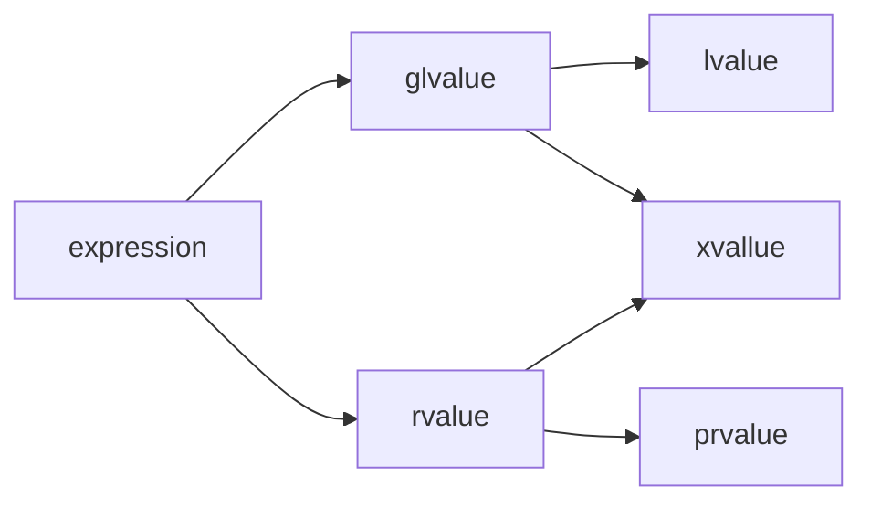

# C++八股文
## C++智能指针
C++标准库中的几种常见智能指针类型包括：

`std::unique_ptr`: 独占所有权，一个对象只能被一个`unique_ptr`所管理，不能被拷贝，只能通过移动语义转移所有权。

`std::shared_ptr`: 共享所有权，多个`shared_ptr`可以同时管理同一个对象，当最后一个引用销毁时，内存才被释放。

`std::weak_ptr`: 辅助`shared_ptr`，不会增加引用计数，避免循环引用（内存泄漏问题），通常用于打破shared_ptr之间的环状依赖。

这些智能指针的核心作用是自动管理动态分配的内存，使得程序员不必手动释放内存，避免内存泄漏等问题。

2. Rust中的引用类型简介
Rust中没有智能指针的概念，但它有一套独特的所有权机制和引用类型来管理内存。常见的引用类型包括：

引用（& 和 &mut）: 借用机制，用于临时访问数据而不转移所有权。&代表不可变引用，&mut代表可变引用。

Box<T>: 类似于C++的`unique_ptr`，表示堆上分配的单一所有权。只有拥有`Box`的地方能销毁这个堆内存。

Rc<T>: 类似于C++的`shared_ptr`，允许多个所有者共享同一个数据。Rc用于单线程环境中。

Arc<T>: 类似于Rc，但用于`多线程`环境。Arc是`原子引用计数`的，保证跨线程安全。

Weak<T>: 类似于C++的`weak_ptr`，辅助Rc或Arc，用于`避免循环引用`。
在 C++ 和 Rust 中，`weak_ptr` 和 `Weak<T>` 分别用于避免循环引用问题。循环引用会导致内存泄漏，因为引用计数器无法降到零，从而导致对象无法被释放。`weak_ptr`/`Weak<T>` 不会增加引用计数，因此不会阻止对象被销毁。

3. 相似之处
- 所有权与自动内存管理:
Rust和C++的核心相似之处是都通过所有权的概念实现自动内存管理。Rust的Box<T>和C++的unique_ptr都表示对资源的独占所有权，自动在对象不再使用时释放内存。
C++的shared_ptr和Rust的Rc/Arc则都用于共享资源的场景，并通过引用计数（reference counting）来决定何时释放内存。
- 弱引用:
C++的weak_ptr与Rust的Weak<T>功能相似，都是为了避免共享资源时的循环引用问题，防止内存泄漏。
4. 不同之处
- 语言机制:
C++中的智能指针是库中的工具，程序员需要手动选择并使用智能指针管理内存。C++没有强制性的所有权检查或引用规则。

Rust的所有权系统是内置在语言中的，编译器通过`借用检查器`（`borrow checker`）在编译期严格保证内存安全，强制程序员遵循所有权规则。

- 可变性和借用检查:
Rust通过 `&` 和 `&mut` **引入了明确的可变性借用规则，编译期保证同一时刻只能有一个可变引用或者多个不可变引用**。这是Rust防止数据竞争和悬垂指针的一个关键机制。

C++的智能指针没有类似的编译时检查机制。虽然 `shared_ptr` 和 `weak_ptr` 可以用来共享资源，但没有Rust那样严格的规则来防止多线程竞争等问题，程序员需要自行保证线程安全。

- 多线程安全:
Rust中的 `Arc` 是线程安全的，保证了引用计数的原子性，适合在多线程环境中共享数据。

C++中的 `shared_ptr` 在多线程环境中是`非线程安全`的，**必须手动添加锁或使用其他同步机制**。

- 内存管理方式:
Rust通过**编译期静态检查内存的生命周期，减少了运行时开销**。大部分的所有权和借用问题在编译时被检测到，避免了潜在的运行时错误。

**C++的智能指针则是在运行时进行引用计数和内存管理**。这意味着在性能上，Rust的机制可能更高效，尤其是在没有共享引用的场景下。
5. 总结

在C++中，智能指针是一种帮助程序员更好地管理内存的工具，但它们仍然依赖程序员主动使用和遵循。Rust则将内存管理机制直接融入到了语言的核心设计中，通过所有权系统和借用检查器从编译时就强制保证了内存的安全性。

相似性：两者都提供了工具来管理动态内存，防止内存泄漏和悬垂指针（通过引用计数和弱引用）。

不同点：Rust具有更严格的编译期检查机制，能防止数据竞争和引用问题，而C++的智能指针需要运行时的引用计数，且没有内置的可变性检查。

## C++ 中内存分配情况 
- 栈：由编译器管理分配和回收，存放局部变量和函数参数。
- 堆：由程序员管理，需要⼿动 new malloc delete free 进⾏分配和回收，空间较⼤，但可能会出现内存泄漏和空闲碎片的情况。
- 全局/静态存储区：分为初始化和未初始化两个相邻区域，存储初始化和未初始化的全局变量和静态变量。
- 常量存储区：存储常量，一般不允许修改。
- 代码区：存放程序的⼆进制代码。

## C++ 和 Java 区别（语⾔特性，垃圾回收，应用场景等） 
- 指针：Java 语⾔让程序员没法找到指针来直接访问内存，没有指针的概念，并有内存的⾃动管理功能，从而有效的
防止了 C++ 语⾔中的指针操作失误的影响。但并非 Java 中没有指针，JVM 内部中还是用了指针，保证了 Java 程序的安全。
- 多继承：C++ ⽀持多继承但 Java 不⽀持，但支持一个类继承多个接⼝，实现 C++ 中多继承的功能，⼜避免
了 C++ 的多继承带来的不便。
- 数据类型和类：Java 是完全面向对象的语⾔，所有的函数和变量必须是类的一部分。除了基本数据类型之外，其余
的都作为类对象，对象将数据和方法结合起来，把它们封装在类中，这样每个对象都可以实现自己的特点和行为。

Java 中取消了 C++ 中的 struct 和 union 。
- 自动内存管理：Java 程序中所有对象都是用 new 操作符建立在内存堆栈上，Java 自动进行无用内存回收操作，不
需要程序员进行手动删除。而 C++ 中必须由程序员释放内存资源，增加了程序设计者的负担。
Java 中当一个对象不再被用到时， 无用内存回收器将给他们加上标签。Java 里无用内存回收程序是以线程方式在后台运行的，利用空闲时间工作来删除。
- Java 不⽀持操作符重载。操作符重载被认为是 C++ 的突出特性。

- Java 不支持预处理功能。C++ 在编译过程中都有一个预编译阶段，Java 没有预处理器，但它提供了 import 与 C++ 预处理器具有类似功能。
- 类型转换：C++ 中有数据类型隐含转换的机制，Java 中需要限时强制类型转换。

- 字符串：C++中字符串是以 Null 终⽌符代表字符串的结束，而 Java 的字符串 是用类对象（string 和 
stringBuffer）来实现的。
- Java 中不提供 goto 语句，虽然指定 goto 作为关键字，但不支持它的使用，使程序简洁易读。
- Java 的异常机制用于捕获例外事件，增强系统容错能力。

## 说一下 const 修饰指针如何区分？ 
下⾯都是合法的声明，但是含义⼤不同：
> - const int * p1; //指向整形常量的指针，它指向的值不能修改
> - int * const p2; //指向整形的常ᰁ指针 ，它不能在指向别的变量，但指向（变量）的值可以修改。 
> - const int *const p3; //指向整形常量 的 常量指针 。它既不能再指向别的常量，指向的值也不能修改。
理解这些声明的技巧在于，查看关键字const右边来确定什么被声明为常量，如果该关键字的右边是类型，则值是
常量；如果关键字的右边是指针变量，则指针本身是常量。

## 函数指针 
从定义和用途两方面来说下理解：
首先是定义：函数指针是指向函数的指针变量。函数指针本身首先是一个指针变量，该指针变量指向一个具体的函数。这正如用指针变量可指向整型变量、字符型、数组一样，这⾥是指向函数。

在编译时，每一个函数都有一个入口地址，该入口地址就是函数指针所指向的地址。有了指向函数的指针变量后，可用该指针变量调用函数，就如同用指针变量可引用其他类型变量一样，在这些概念上是大体一致的。
其次是用途：调用函数和做函数的参数，比如回调函数。
示例：
```cpp
char * fun(char * p) {…} // 函数fun
char * (*pf)(char * p); // 函数指针pf
pf = fun; // 函数指针pf指向函数fun
pf(p); // 通过函数指针pf调用函数fun
```

## 堆和栈区别 
### 栈
由编译器进⾏管理，在需要时由编译器⾃动分配空间，在不需要时候自动回收空间，一般保存的是局部变量和函数参数等。
连续的内存空间，在函数调用的时候，首先入栈的主函数的下一条可执行指令的地址，然后是函数的各个参数。
大多数编译器中，**参数是从右向左入栈**（这种顺序是为了让程序员在使用C/C++的“函数参数长度可变”这个特性时更方便。如果是从左向右压栈，第一个参数（即描述可变参数表各变类量型的那个参数）将被放在栈底，由于可变参的函数第一步就需要解析可变参数表的各参数类型，即第一步就需要得到上述参数，因此，将它放在栈底是很不方便的。）本次函数调用结束时，局部变量先出栈，然后是参数，最后是栈顶指针最开始存放的地址，程序由该点继续运行，不会产⽣碎片。
栈是高地址向低地址扩展，栈低高地址，空间较小。

### 堆
由程序员管理，需要手动 new malloc delete free 进⾏分配和回收，如果不回收的话，会造成内存泄漏的问题。
不连续的空间，实际上系统中有一个空闲链表，当有程序申请的时候，系统遍历空闲链表找到第一个⼤于等于申请大小的空间分配给程序，一般在分配程序的时候，也会空间头部写⼊内存大小，方便 delete 回收空间大小。当然如果有剩余的，也会将剩余的插⼊到空闲链表中，这也是产⽣内存碎⽚的原因。
堆是低地址向高地址扩展，空间交⼤，较为灵活。

## new / delete ，malloc / free 区别 
都可以用来在堆上分配和回收空间。**new /delete 是操作符，malloc/free 是库函数**。
**执行 new 实际上有两个过程**：
1. 分配未初始化的内存空间（**malloc**）；
2. 使用对象的**构造函数**对空间进行初始化；返回空间的首地址。

如果在第一步分配空间中出现问题，则抛出  `std::bad_alloc` 异常，或被某个设定的异常处理函数捕获处理；如果在第⼆步构造对象时出现异常，则自动调用 delete 释放内存。

**执行 delete 实际上也有两个过程**：
1. 使用析构函数对对象进行析构；
2. 回收内存空间（free）。

以上也可以看出 new 和 malloc 的区别，**new 得到的是经过初始化的空间，而且 malloc 得到的是未初始化的空间**。
所以 **new 是 new 一个类型，而 malloc 则是malloc 一个字节长度的空间**。delete 和 free 同理，delete 不仅释放空间还析构对象，delete 一个类型，free 一个字节长度的空间。

为什么有了 malloc／free 还需要 new／delete？因为**对于非内部数据类型， malloc／free 无法满足动态对象的要求。对象在创建的同时需要自动调用构造函数，对象在消亡以前要自动调用析构函数。**由于 mallo／free 是库函数不是运算符，**不在编译器控制权限之内，不能够把执行的构造函数和析构函数的任务强加于** malloc／free，所以有了 new／delete 操作符。

- new 和 new[] 是类型安全的，不需要进行类型转换。
- malloc 返回 void*，需要进行类型转换。

- new[] 和 delete[] 专门用于数组的分配和释放。
- malloc 和 free 没有专门的数组分配和释放函数。

- new 和 new[] 在分配失败时会抛出 std::bad_alloc 异常。
- malloc 在分配失败时返回 NULL。

## volatile 和 extern 关键字 
### volatile 三个特性
- 易变性：在汇编层⾯反映出来，就是两条语句，下一条语句不会直接使用上一条语句对应的 volatile 变量的寄存器内容，而是重新从内存中读取。
- 不可优化性：volatile 告诉编译器，不要对我这个变量进⾏各种激进的优化，甚⾄将变量直接消除，保证程序员写在代码中的指令，一定会被执⾏。
顺序性：能够保证 volatile 变量之间的顺序性，编译器不会乱序优化。
### extern 
在 C 语⾔中，修饰符 extern 用在变量或者函数的声明前，用来说明 “此变量/函数是在别处定义的，要在此处引用”。
注意 extern 声明的位置对其作用域也有关系，如果是在 main 函数中进行声明的，则只能在 main 函数中调用，**在其它函数中不能调用**。其实要调用其它⽂件中的函数和变量，只需把该文件用 #include 包含进来即可，为啥要用 extern？**因为 extern 会加速程序的编译过程，这样能节省时间**。

在 C++ 中 extern 还有另外一种作用，**用于指示 C 或者 C＋＋函数的调用规范。比如在 C＋＋ 中调用 C 库函数，就需要在 C＋＋ 程序中用 extern “C” 声明要引用的函数。这是给链接器用的，告诉链接器在链接的时候用 C 函数规范来链接。主要原因是 C＋＋ 和 C 程序编译完成后在目标代码中命名规则不同，用此来解决名字匹配的问题。**

### define 和 const 区别（编译阶段、安全性、内存占用等） 
对于 define 来说，宏定义实际上是在预编译阶段进行处理，没有类型，也就没有类型检查，仅仅做的是遇到宏定义进⾏字符串的展开，遇到多少次就展开多少次，而且这个简单的展开过程中，很容易出现边界效应，达不到预期的效果。因为 define 宏定义仅仅是展开，因此**运行时系统并不为宏定义分配内存**，但是从汇编 的角度来讲，define 却**以立即数的方式保留了多份数据的拷贝**。

对于 const 来说，const 是在编译期间处理的，const 有类型，也有类型检查，**程序运行时系统会为 const 常量分配内存**，而且**从汇编的角度讲，const 常量在出现的地方保留的是真正数据的内存地址，只保留了一份数据的拷贝**，省去了不必要的内存空间。而且，有时编译器不会为普通的 const 常量分配内存，而是**直接将 const 常量添加到符号表中**，省去了读取和写⼊内存的操作，效率更⾼。
## 虚函数相关（虚函数表，虚函数指针），虚函数的实现原理 
构造函数不能为虚函数。原因有两个：⼀是构造函数在对象构造时调用，对象构造时虚函数表还没有构造，所以不能为虚函数；二是构造函数是静态的，虚函数是动态绑定的，构造函数构造对象实例的时候，对象的类型还没有确定，无法决定是使用什么函数，静态函数不能是虚函数。

虚函数指针的位置是在对象的内存空间的最前面4个字节，具体在内存的那个区域取决于对象是创建在栈上还是堆上。虚函数表是在代码段，是全局的，存放的是虚函数的地址。

⾸先我们来说一下，C++中多态的表象，在基类的函数前加上 **virtual** 关键字，在派生类中重写该函数，运xing 时将会根据对象的实际类型来调用相应的函数。如果对象类型是派⽣类，就调用派生类的函数，如果是基类，就调用基类的函数。
**实际上，当一个类中包含虚函数时，编译器会为该类生成一个虚函数表，保存该类中虚函数的地址**，同样，派生类继承基类，派生类中自然一定有虚函数，所以编译器也会为派生类生成自己的虚函数表。当我们定义一个派生类对象时，编译器检测该类型有虚函数，所以为这个派⽣类对象生成一个虚函数指针，指向该类型的虚函数表，这个虚函数指针的初始化是在构造函数中完成的。

后续如果有一个基类类型的指针，指向派生类，那么当调用虚函数时，就会根据所指真正对象的虚函数表指针去寻找虚函数的地址，也就可以调用派生类的虚函数表中的虚函数以此实现多态。

补充：如果基类中没有定义成 virtual，那么进行 Base B; Derived D; Base *p = D; p->function(); 这种情况下调用的则是 Base 中的 function()。**因为基类和派生类中都没有虚函数的定义，那么编译器就会认为不用留给动态多态的机会**，就事先进⾏函数地址的绑定（早绑定），详述过程就是，定义了一个派生类对象，首先要构造基类的空间，然后构造派生类的自身内容，形成一个派生类对象，那么在进行类型转换时，直接截取基类的部分的内存，编译器认为类型就是基类，那么（函数符号表［不同于虚函数表的另一个表］中）绑定的函数地址也就是基类中函数的地址，所以执行的是基类的函数。
## 对于派生类来说，编译器建立虚函数表的过程其实一共是三个步骤： 
拷贝基类的虚函数表，如果是多继承，就拷贝每个有虚函数基类的虚函数表。

当然还有一个基类的虚函数表和派⽣类⾃身的虚函数表共用了一个虚函数表，也称为某个基类为派⽣类的主基类。

查看派生类中是否有重写基类中的虚函数， 如果有，就替换成已经重写的虚函数地址；查看派生类是否有自己的虚函数，如果有，就追加自身的虚函数到自身的虚函数表中。

Derived *pd = new D(); B *pb = pd; C *pc = pd; 

其中 pb，pd，pc 的指针位置是不同的，要注意的是派生类的自身的内容要追加在主基类的内存块后

## 析构函数一般写成虚函数的原因 
直观的讲：是为了降低内存泄漏的可能性。

举例来说就是，一个基类的指针指向一个派生类的对象，在使用完毕准备销毁时，如果基类的析构函数没有定义成虚函数，那么编译器根据指针类型就会认为当前对象的类型是基类，调用基类的析构函数 （该对象的析构函数的函数地址早就被绑定为基类的析构函数），仅执行基类的析构，派生类的自身内容将无法被析构，造成内存泄漏。

如果基类的析构函数定义成虚函数，那么编译器就可以根据实际对象，执行派⽣类的析构函数，再执行基类的析构函数，成功释放内存。


## i++和++i


## 介绍一下 fork 的流程
`fork()` 函数是 Unix 和类 Unix 操作系统中用于创建进程的系统调用。它属于进程控制的一部分，用于复制当前进程（称为父进程），创建一个新的子进程。`fork()` 的基本流程如下：

1. **调用 fork()**：
   - 父进程调用 `fork()` 函数。

2. **系统分配资源**：
   - 操作系统为新的子进程分配必要的资源，如内存空间、文件描述符等。

3. **复制进程**：
   - 操作系统复制父进程的地址空间、堆、栈等内存内容到子进程。这通常涉及到写时复制（Copy-On-Write，COW）技术，以减少内存的复制开销。

4. **返回值**：
   - `fork()` 函数在父进程中返回新创建的子进程的进程ID（PID）。
   - `fork()` 函数在子进程中返回0。

5. **执行流程分支**：
   - 父进程和子进程从 `fork()` 调用之后开始执行不同的代码路径。通常，父进程会使用返回的子进程PID来对子进程进行进一步的操作，如等待子进程结束（`wait()` 系统调用）。
   - 子进程通常会使用返回的0来确认自己的身份，并执行特定的任务。

6. **进程调度**：
   - 操作系统的调度器根据调度策略决定哪个进程（父进程或子进程）继续执行。

7. **进程终止**：
   - 当子进程执行完毕，它会通过 `exit()` 函数或返回语句来结束自己的执行。
   - 父进程可以通过 `wait()` 或 `waitpid()` 函数来等待子进程结束，获取子进程的退出状态。

8. **资源回收**：
   - 子进程结束后，操作系统会回收其占用的资源，包括内存、文件描述符等。

`fork()` 函数的使用需要注意一些问题，比如避免在子进程中进行可能改变父进程状态的操作，以及正确处理 `fork()` 调用失败的情况（通常返回 -1）。此外，`fork()` 在多线程程序中的行为可能会更加复杂，因为它可能会创建包含所有线程副本的子进程。

## 介绍一下 copy-on-write（COW）技术
写时复制（Copy-On-Write，COW）是一种计算机程序设计中的优化策略，用于减少内存复制的开销。这种技术在创建进程、线程或者进行内存分配时特别有用。写时复制的核心思想是，**只有在原始数据需要被修改时，才进行数据的复制**。

### 写时复制的工作原理：

1. **共享数据**：
   - 当一个进程或者线程需要创建一个新的进程或线程时，它首先会共享其内存空间，而不是立即复制。这意味着新创建的进程或线程最初会使用相同的物理内存页。

2. **检测写操作**：
   - 操作系统会监控这些共享的内存页。如果检测到任何写操作（即尝试修改这些内存页），操作系统会立即将这些页复制到新的物理内存地址。

3. **复制内存页**：
   - 当检测到写操作时，操作系统会创建这些内存页的副本，并将副本分配给执行写操作的进程或线程。这样，原始的进程或线程仍然可以访问原始数据，而执行写操作的进程或线程则在修改其自己的数据副本。

4. **更新页表**：
   - 操作系统更新页表，使得执行写操作的进程或线程的虚拟地址指向新的物理内存地址（即复制后的内存页），而其他进程或线程的虚拟地址仍然指向原始的物理内存地址。

### 写时复制的优点：

- **节省内存**：在数据被修改之前，不需要复制整个内存空间，从而节省了内存资源。
- **提高性能**：减少了不必要的数据复制，可以提高程序的执行效率。

### 写时复制的应用场景：

1. **进程创建**：在 `fork()` 系统调用中，写时复制技术可以减少创建子进程时的内存复制开销。
2. **线程创建**：在创建线程时，可以使用写时复制来共享数据，只有在数据需要被修改时才进行复制。
3. **内存分配**：在某些内存分配策略中，写时复制可以用来优化内存的使用和分配。

### 注意事项：

- **同步问题**：由于多个进程或线程可能共享相同的内存页，因此需要妥善处理同步问题，以避免数据竞争和一致性问题。
- **性能影响**：虽然写时复制可以减少内存复制的开销，但在高负载或频繁写操作的情况下，可能会增加系统的页错误率，从而影响性能。

写时复制是一种有效的内存管理技术，它在需要共享和复制大量数据时提供了一种高效的解决方案。

## fork、vfork 和 clone 的区别
`fork()`, `vfork()`, 和 `clone()` 都是 Unix 和类 Unix 操作系统中用于创建进程的系统调用，但它们在创建进程的方式和使用场景上有所不同。

### fork()
- **用途**：`fork()` 用于创建一个与父进程几乎完全相同的子进程。
- **内存**：子进程获得父进程数据段、堆和栈的副本。在 `fork()` 之后，父子进程拥有独立的地址空间，但开始时这些空间的内容是相同的。
- **行为**：`fork()` 之后，父进程和子进程从 `fork()` 调用之后的代码开始独立执行。
- **返回值**：在父进程中返回子进程的 PID，在子进程中返回 0。

### vfork()
- **用途**：`vfork()` 用于创建一个子进程，这个子进程与父进程共享地址空间。
- **内存**：子进程和父进程共享相同的内存空间，直到子进程调用 `exec()` 系列函数或者退出。这使得 `vfork()` 比 `fork()` 更高效，因为它避免了复制父进程的地址空间。
- **行为**：`vfork()` 创建的子进程在父进程之前执行，并且子进程应该尽快调用 `exec()` 系列函数或者退出，以避免对父进程的潜在破坏。
- **返回值**：与 `fork()` 类似，父进程中返回子进程的 PID，在子进程中返回 0。

### clone()
- **用途**：`clone()` 是一个更通用的进程创建机制，它提供了比 `fork()` 和 `vfork()` 更多的控制。
- **内存**：`clone()` 允许调用者指定是否与父进程共享地址空间。通过设置 `CLONE_VM` 标志，可以实现与 `fork()` 相似的行为；如果不设置，则可以实现与 `vfork()` 相似的行为。
- **行为**：`clone()` 允许调用者指定子进程的栈空间和栈内容，以及子进程的调度策略等。
- **返回值**：在父进程中返回子进程的 PID 或者错误码，在子进程中返回 0。

### 区别总结
- **内存共享**：`fork()` 创建独立的地址空间，`vfork()` 创建共享地址空间，而 `clone()` 可以通过标志控制是否共享。
- **效率**：`vfork()` 通常比 `fork()` 更高效，因为它避免了复制父进程的地址空间，但使用时需要小心，以避免对父进程造成影响。`clone()` 可以根据需要调整，以达到最优的性能。
- **灵活性**：`clone()` 提供了最大的灵活性，允许调用者精确控制子进程的创建过程。

在实际应用中，选择哪种方式取决于具体的需求和性能考虑。例如，如果需要快速创建一个子进程并且子进程将立即执行一个新的程序，`vfork()` 或者带有 `CLONE_VM` 标志的 `clone()` 可能是更好的选择。如果需要创建一个与父进程完全独立的子进程，`fork()` 或者不共享地址空间的 `clone()` 更合适。

## 介绍一下进程间通信（IPC）的方式

## 僵尸进程
僵尸进程（Zombie Process）是Linux系统中的一种特殊进程状态。当一个进程完成其执行并退出时，它会向其父进程发送退出信号，父进程应该通过调用`wait()`或`waitpid()`函数来获取子进程的退出状态，从而释放子进程占用的资源。如果父进程没有正确地回收子进程的资源，那么子进程虽然已经终止，但仍然会保留在系统中，这种状态的进程被称为僵尸进程。

僵尸进程的危害主要体现在它们会占用系统资源，尤其是进程ID。由于系统能够创建的进程数量是有限的，如果僵尸进程过多，可能会导致系统无法创建新的进程，从而影响系统的正常运行。

僵尸进程的产生通常是因为父进程没有及时回收子进程的资源。这可能是因为父进程在忙于其他任务，或者父进程本身已经退出，没有其他进程来回收子进程的资源。在某些情况下，如果父进程退出，init进程（通常是系统的第一个进程，PID为1）会接管并回收孤儿进程的资源。

处理僵尸进程的方法通常包括：
1. 确保父进程调用`wait()`或`waitpid()`来回收子进程的资源。
2. 为父进程设置`SIGCHLD`信号的处理函数，在子进程退出时及时进行资源回收。
3. 如果父进程不关心子进程的退出状态，可以使用`signal(SIGCHLD, SIG_IGN)`来忽略`SIGCHLD`信号，让init进程来回收子进程的资源。

在Linux系统中，可以使用`ps`命令结合`grep`来查找僵尸进程，例如使用`ps aux | grep 'Z'`命令。如果需要杀死僵尸进程，通常的做法是杀死其父进程，因为这样会使得僵尸进程变为孤儿进程，然后由init进程接管并回收资源。如果僵尸进程的父进程是init，那么僵尸进程将自动被回收。

总的来说，僵尸进程是Linux系统中的一种正常现象，通常不会对系统造成太大影响，但如果数量过多，就需要通过上述方法进行处理。

## 左值和右值
C++ 11/14引入了右值引用和移动语义，这两个概念是为了解决传统的左值和右值的问题。在C++中，左值和右值是表达式的属性，它们与赋值操作符的左右位置无关。

### 定义
- 所有表达式的结果不是左值就是右值。
- 左值(lvalue)是一个函数或者对象实例
- 失效值(xvalue)是生命期即将结束的对象
- 广义左值是左值和失效值的统称
- 右值(rvalue)包括失效值、临时对象和不关联任何对象的值（字面常量）
- 纯右值是非失效值的右值


### 右值引用
右值引用是C++11引入的新特性，用于绑定到右值。右值引用的语法是`T&&`，其中`T`是类型。右值引用可以绑定到临时对象、右值和失效值，但不能绑定到左值。而左值引用`T&`只能绑定到左值。

对一个对象使用右值引用，意味着显式标记这个对象是个右值，可以被转移来优化。同时相当于给他添加了一个临时的名字，生命周期得到了延长，不会在表达式结束时消失，而是和右值引用绑定在了一起。

const T&& 没有意义，因为右值引用的目的是为了转移资源，而const则是为了保护资源不被修改。

#### 引用折叠
- `T& &` -> `T&`
- `T& &&` -> `T&`
- `T&& &` -> `T&`
- `T&& &&` -> `T&&`
对引用类型TR(左/右引用)进行左引用操作，结果是T&；对引用类型TR(左/右引用)进行右引用操作，结果不变。这条规则是实现转移语义和完美转发的基础。

### 移动语义

### 完美转发
## 自动类型推导
C++11引入了`auto`关键字，用于自动推导变量的类型。`auto`关键字可以根据变量的初始化表达式推导出变量的类型，从而简化代码编写。`auto`关键字的使用方法如下：

```cpp
auto var = expr;
```

'decltype'关键字可以用于获取表达式的类型，通常与`auto`关键字一起使用，用于推导表达式的类型。`decltype`关键字的使用方法如下：

```cpp
decltype(expr) var;
```

decltype 和 sizeof 在技术和用法上非常相似，都是需要编译器在编译期计算类型，但是 sizeof 是在编译期计算类型的大小，而 decltype 是在编译期计算类型。

decltype(expr) 会返回表达式 expr 的类型，包括 const 和引用等限定符。

### decltype(auto)

## 惊群效应
惊群效应（Thundering Herd Problem）是指在多进程或多线程环境中，当多个进程或线程等待同一个事件（如网络连接请求）时，事件发生后会唤醒所有等待的进程或线程，但通常只有一个能够获得事件并进行处理，其余的进程或线程在尝试获取事件失败后会重新进入等待状态。这个过程会导致不必要的上下文切换和系统资源浪费，从而影响系统性能。

在Linux系统中，惊群效应主要出现在网络服务的监听和接受连接的场景。例如，在使用`accept`函数处理TCP连接时，如果有多个进程在同一个监听socket上调用`accept`，那么当新的连接请求到达时，所有阻塞在`accept`上的进程都会被唤醒，但实际上只有一个进程能够成功建立连接，其他进程则需要重新等待。

再举个例子，linux内核中的等待队列，等待队列中的等待节点有两种状态，一种是互斥等待，一种是非互斥等待。如果某个事件一发生，会唤醒对应的等待队列中的所有非互斥等待节点，而如果是互斥等待节点的话，可以选择唤醒所有节点，也可以选择唤醒指定个节点。Pthread线程库里面也有一个很好的例子，pthread_cond_signal与pthread_cond_broadcast，signal只通知一个信号量，而broadcast会通知所有信号量。但是有时候就绪的事件只能满足一个用户，如果选择广播的话就会通知所有用户，然后最终只有一个用户可以得到满足，其他用户还是被阻塞导致不必要的性能浪费。

为了解决惊群效应，可以采取以下措施：

1. **使用锁机制**：在应用层实现互斥锁，确保同一时间只有一个进程或线程处理事件。例如，Nginx使用`accept_mutex`来控制对`accept`调用的访问，从而避免惊群效应。

2. **利用`EPOLLEXCLUSIVE`**：在较新的Linux内核版本中，`epoll`的`EPOLLEXCLUSIVE`标志可以用来减少惊群现象，它确保一次只有一个进程被唤醒来处理事件。

3. **使用`SO_REUSEPORT`套接字选项**：这个选项允许多个进程或线程绑定到同一个端口，内核会负责在它们之间分配传入的连接请求，从而避免惊群效应。

4. **优化进程/线程数量**：合理配置进程或线程的数量，避免过多的并发进程或线程导致频繁的惊群效应。

5. **使用线程池**：通过线程池来管理线程，减少线程竞争和上下文切换，提高资源利用率。

在Linux 2.6版本之后，内核已经解决了`accept`函数的惊群效应，但`epoll`的惊群效应仍然可能存在，特别是在多个进程或线程使用`epoll_wait`监听同一个socket时。Nginx等服务器软件通过内部机制来解决这个问题，以提高性能和资源利用率。

## IDT和TSS
中断描述符表（Interrupt Descriptor Table, IDT）和任务状态段（Task State Segment, TSS）是与x86架构相关的两个重要概念，它们在操作系统的中断处理和任务切换中起着核心作用。

1. **中断描述符表（IDT）**：
   - IDT是一张由中断门、陷阱门和系统门组成的表，用于存储中断和异常的处理器入口点。
   - IDT中的每个条目都是一个描述符，包含了中断处理程序或异常处理程序的地址、段选择器以及访问权限等信息。
   - 当CPU响应一个中断或异常时，会使用IDT中的信息来确定应该执行哪个处理程序，以及在哪个特权级下执行。
   - IDT的条目通常包括中断处理程序、异常处理程序、系统调用处理程序等。
   - 在现代操作系统中，IDT是实现硬件中断、软件中断（如系统调用）和异常处理的关键数据结构。

2. **任务状态段（TSS）**：
   - TSS是一种特殊的数据结构，用于存储处理器在执行任务切换时需要的信息。
   - TSS包含了当前任务的上下文信息，如寄存器值、堆栈指针、程序状态字（Program Status Word, PSW）等。
   - 在多任务操作系统中，每个任务（线程或进程）都有自己的TSS，以便在任务切换时能够保存和恢复任务的状态。
   - TSS中还可以包含I/O权限位图，用于控制任务对I/O设备的访问权限。
   - TSS通过任务门（Task Gate）与IDT关联，任务门包含了指向TSS的指针，当执行任务切换指令（如`jmp`、`call`、`ret`等）时，CPU会通过任务门找到相应的TSS，并使用TSS中的信息来完成上下文切换。

在现代操作系统中，IDT和TSS是实现中断驱动编程和多任务处理的关键机制。IDT使得操作系统能够定义和处理各种中断和异常，而TSS则使得操作系统能够在任务之间高效地切换，从而实现多任务并发执行。随着操作系统的发展，一些新的机制（如x64架构中的长模式）可能不再使用TSS，而是采用了更高效的任务切换方法。

## 何在共享内存上使用stl标准库？
提问者澄清说，他想要的是std::vector的元素都存储在共享内存中，即使是动态添加的新元素也应该存储在共享内存中。

提出了一个解决方案。在C++中，std::vector和其他容器可以使用自定义的分配器（allocator）来管理内存分配。分配器是一个模板参数，用于定义容器如何分配和释放内存。
回答者建议重写一个自定义的分配器，使其使用共享内存。这可以通过继承标准库中的std::allocator类并重写其内存分配和释放方法来实现。自定义分配器可以使用共享内存作为内存池，当std::vector需要分配或释放内存时，这个分配器会从共享内存池中分配或回收内存。
这样，当多个进程都使用这个自定义分配器创建std::vector时，它们的元素就会存储在共享内存中，从而实现跨进程的数据共享。

## System V ABI
System V ABI（Application Binary Interface）是一种用于x86架构的二进制接口标准，定义了操作系统和应用程序之间的接口规范，包括函数调用约定、寄存器使用、内存布局等方面。System V ABI是一种通用的ABI标准，适用于多种操作系统，如Linux、Solaris等。

## 栈溢出的原因和防范措施
栈溢出（Stack Overflow）是指程序运行时，栈区内存发生溢出，导致数据覆盖到其他内存区域，从而破坏程序的正常执行。栈溢出通常是由以下原因导致的：
栈溢出主要可能是由以下原因导致的：
- **递归调用**：递归调用层次过深，导致栈空间不足。
- **局部变量过多**：函数内部定义了大量的局部变量，占用了大量的栈空间。
- **无限循环**：循环内部没有终止条件，导致栈空间不断增长。
- **缓冲区溢出**：输入数据超出了缓冲区的大小，覆盖了栈中的其他数据。

## STL相关
频繁的对vector进行 `push_back` 操作，会导致内存的频繁分配和释放，从而影响程序的性能。为了避免这种情况，可以使用`reserve()`函数来预分配vector的内存空间，从而减少内存分配和释放的次数。

`reserve()`函数可以在插入大量元素之前，预先分配vector的内存空间，避免频繁的内存分配和释放。例如，可以使用`reserve(n)`来预分配至少能容纳n个元素的内存空间，这样在后续的插入操作中，就不需要频繁地重新分配内存。

`emplace_back()`函数是C++11引入的新函数，用于在vector的末尾直接构造元素，避免了临时对象的创建和拷贝。与`push_back()`函数不同，`emplace_back()`函数可以直接在vector的末尾构造元素，而不需要创建临时对象，从而提高了性能。

为什么会有临时对象？因为`push_back()`函数接受的参数是一个对象，而在调用`push_back()`时，会先创建一个临时对象，然后再将这个临时对象拷贝到vector中。而`emplace_back()`函数直接在vector的末尾构造元素，避免了临时对象的创建和拷贝。

## RAII
RAII（Resource Acquisition Is Initialization）是一种资源获取即初始化的编程技术，用于管理资源的生命周期。RAII的核心思想是，通过在对象的构造函数中获取资源，然后在对象的析构函数中释放资源，从而确保资源在对象生命周期结束时被正确释放。
# 数据库
数据库的三个重要范式是关系型数据库设计的基础，它们用于确保数据库结构的合理性和数据的一致性。这三个范式分别是：

1. **第一范式（1NF，First Normal Form）**：
   - 要求数据库表的每一列都是不可分割的基本数据项，即每一列的值都是原子性的，不可再分解。
   - 表中的每个字段值都必须是唯一的，不能有重复的列。
   - 确保每个单元格中只包含单一值，而不是集合或数组。

2. **第二范式（2NF，Second Normal Form）**：
   - 在满足第一范式的基础上，要求表中的每个实例或行必须可以被唯一地区分，即表必须有一个主键。
   - 非主键字段必须完全依赖于主键，没有部分依赖。这意味着表中不存在对主键的部分依赖，所有非主键字段都只能依赖于整个主键，而不是主键的一部分。

3. **第三范式（3NF，Third Normal Form）**：
   - 在满足第二范式的基础上，要求非主键字段之间不能相互依赖，即没有传递依赖。
   - 也就是说，所有非主键字段只能依赖于主键，不能依赖于其他非主键字段。这样可以避免数据冗余和更新异常。

除了这三个基本范式，还有更高级别的范式，如BCNF（巴斯-科德范式）和第五范式（5NF），它们提供了更严格的数据依赖规则，以进一步优化数据库设计。

遵循这些范式可以帮助数据库设计师创建出结构良好、数据冗余最小化且易于维护的数据库。然而，在实际应用中，为了性能或其他考虑，有时可能会有意地违反某些范式规则。

# 计网
## TCP/IP协议族
### TCP 粘包
TCP 粘包（TCP Packet Sticking）是指发送方发送的多个小数据包被接收方合并成一个大数据包的现象。TCP 粘包通常发生在发送方连续发送多个小数据包时，由于网络传输的不确定性，接收方可能会将这些小数据包合并成一个大数据包，从而导致粘包现象。

TCP 粘包的原因主要有以下几点：
1. **Nagle 算法**：Nagle 算法是 TCP 协议中的一种流量控制算法，它会将多个小数据包合并成一个大数据包进行发送，以减少网络传输的开销。当发送方连续发送多个小数据包时，Nagle 算法可能会导致粘包现象。
2. **接收方缓冲区**：接收方的 TCP 缓冲区可能会将多个数据包合并成一个大数据包进行处理，从而导致粘包现象。
3. **网络拥塞**：网络拥塞可能会导致数据包的延迟和乱序，从而导致接收方将多个数据包合并成一个大数据包。

为了解决 TCP 粘包问题，可以采取以下几种方法：
1. **消息边界**：在数据包中添加消息边界标记，接收方根据消息边界标记来划分数据包，从而避免粘包现象。
2. **固定长度**：发送方将数据包固定为固定长度，接收方根据固定长度来划分数据包，从而避免粘包现象。
3. **消息长度**：在数据包中添加消息长度字段，接收方根据消息长度来划分数据包，从而避免粘包现象。
4. **应用层协议**：在应用层协议中定义消息格式和消息边界，从而避免 TCP 粘包问题。

TCP 粘包是 TCP 协议中常见的问题，对于需要保证数据包的完整性和顺序的应用场景，需要采取相应的措施来避免粘包现象。


# 内核驱动
## 中断、软中断、硬中断
- **中断（Interrupt）**：中断是计算机系统中的一种机制，用于处理硬件设备发出的异步事件。当硬件设备发生某种事件（如输入输出请求、时钟中断等）时，会向处理器发送中断信号，处理器会暂停当前任务，转而执行中断处理程序，处理完中断后再返回到原来的任务。

- **硬中断（Hardware Interrupt）**：硬中断是由硬件设备发出的中断信号，用于通知处理器发生了某种事件。硬中断通常由硬件设备的控制器（如中断控制器）发出，处理器在接收到硬中断信号后会暂停当前任务，转而执行硬中断处理程序。

- **软中断（Software Interrupt）**：软中断是由软件发出的中断信号，用于通知处理器执行某种特定的操作。软中断通常由操作系统内核发出，用于执行一些系统调用或内核服务。软中断通常不会打断当前任务的执行，而是在合适的时机执行。

- **中断处理流程**：中断处理流程通常包括以下几个步骤：
   1. 硬件设备发出中断信号。
   2. 处理器接收中断信号，暂停当前任务，保存当前任务的上下文。
   3. 处理器执行中断处理程序，处理中断事件。
   4. 中断处理程序执行完毕后，恢复之前保存的任务上下文，继续执行原来的任务。

中断是计算机系统中的重要机制，用于处理硬件设备的异步事件。硬中断由硬件设备发出，软中断由软件发出，它们共同构成了计算机系统的中断处理机制。

## 内核态、用户态
- **内核态（Kernel Mode）**：内核态是操作系统的特权级别，也称为核心态或系统态。在内核态下，操作系统具有最高的权限，可以访问系统的所有资源和硬件设备，执行特权指令，管理进程和内存等。内核态下的代码运行在特权级别最高的 CPU 模式下，可以执行特权指令，访问所有内存区域，以及执行硬件操作。

- **用户态（User Mode）**：用户态是操作系统的非特权级别，也称为用户态或应用态。在用户态下，应用程序运行在受限的环境中，只能访问受限的资源和内存区域，不能直接访问硬件设备或执行特权指令。用户态下的代码运行在特权级别较低的 CPU 模式下，受到操作系统的保护，无法直接访问系统资源。

操作系统通过内核态和用户态的划分，实现了对系统资源和硬件设备的保护，确保操作系统的稳定性和安全性。内核态和用户态之间的切换是通过系统调用（System Call）和中断（Interrupt）等机制实现的。

## 概念
- **内核线程（Kernel Thread）**：内核线程是由操作系统内核创建和管理的线程，运行在内核态下，具有最高的权限。内核线程通常用于执行操作系统内核的任务，如调度、中断处理、文件系统等。内核线程不依赖于用户空间的进程，可以独立于用户进程而存在。

- **普通线程（User Thread）**：普通线程是由用户空间的进程创建和管理的线程，运行在用户态下，受到操作系统的保护。普通线程通常用于执行应用程序的任务，如计算、I/O 操作等。普通线程依赖于用户空间的进程，与进程共享资源和地址空间。

内核线程和普通线程是操作系统中的两种线程模型，它们分别用于执行不同的任务。内核线程运行在内核态下，具有最高的权限，用于执行操作系统内核的任务；普通线程运行在用户态下，受到操作系统的保护，用于执行应用程序的任务。

- **tasklet** 是一种轻量级的中断处理机制，用于处理一些短小的中断处理程序。tasklet是在中断上下文中执行的，它可以在中断处理程序中调度，但不会立即执行，而是在中断处理程序执行完毕后，由内核调度器来执行。tasklet通常用于处理一些短小的中断处理程序，如更新数据结构、唤醒等待队列等。

- **timer** 是一种定时器机制，用于在一定时间后执行某个操作。timer可以是一次性的，也可以是周期性的。timer通常用于执行一些定时任务，如定时检查系统状态、定时清理资源等。

- **hrtimer** 是一种高精度的定时器机制，用于实现微秒级别的定时操作。hrtimer提供了更高的精度和更灵活的定时功能，可以满足一些对时间精度要求较高的场景。

- **irq** 是中断请求的缩写，是一种异步事件机制，用于处理硬件设备发出的中断信号。irq通常由硬件设备的控制器（如中断控制器）发出，处理器在接收到irq信号后会暂停当前任务，转而执行irq处理程序。

- **preeempt_disable()** 函数用于禁止内核的抢占机制，即禁止内核在当前任务执行期间被其他任务抢占。preeempt_disable()函数通常用于临界区保护，确保在临界区内的代码不会被其他任务打断。

- **local_irq_disable()** 函数用于禁止中断，即禁止处理器响应中断信号。local_irq_disable()函数通常用于临界区保护，确保在临界区内的代码不会被中断打断。

- **spin_lock()** 函数用于获取自旋锁，即在获取锁之前一直自旋等待，直到获取到锁为止。spin_lock()函数通常用于临界区保护，确保在临界区内的代码不会被其他任务打断。

- **schedule()** 函数用于将当前任务放入调度队列，让其他任务有机会执行。schedule()函数通常用于让出 CPU 时间，让其他任务有机会执行，从而实现多任务调度。

- **usleep()** 函数用于让当前任务休眠一段时间，以实现延时操作。usleep()函数通常用于实现定时操作，让当前任务休眠一段时间后再继续执行。

- **wait_event()** 函数用于让当前任务等待某个条件的发生，直到条件满足后再继续执行。wait_event()函数通常用于实现同步机制，让当前任务等待其他任务的通知或事件。

- **workqueue** 是一种工作队列机制，用于在后台执行一些耗时的工作。workqueue通常用于执行一些需要长时间运行的任务，如数据处理、文件操作等。

## 其他问题
- 中断、软中断、tasklet、timer、hrtimer执行环境下，或者“内核线程、普通线程内核态环境下调用了preeempt_disable()/local_irq_disable()/spin_lock()”后，能否调用 schedule() 函数(包括usleep()/wait_event等系列函数)？
- workqueue、kernel thread、普通线程的内核态这些context下i没有调用preempt_disable()禁止抢占和local_irq_disable()禁止中断，能否调用schedule()函数？
- 内核中，schedule()的具体调用点？
- 除了主动调用，lazy_invocation在什么时候？
- preempt_count
- shcedule()真实反映到软硬件的操作？
- 内存管理中，node,zone,free_area,page,free_list[MIGRATE_TYPES]等是什么关系？

## 中断管理
1. 硬件中断号和Linux内核的IRQ号它们是如何映射?
2. 当发生硬件中断之后，ARM64处理器架构做那些工作?
3. 为什么说中断上下文不能执行睡眠操作?
4. 一个硬件中断之后，Linux内核如何响应并处理此中断?
5. 同一类型的软中断是否允许多个CPU并行执行?
6. 软中断上下文包括哪几种情况?
7. 软中断上下文还是进程上下文 的优先级高?为什么?
8. 是否允许同一个tasklet在多个CPU上并行执行?
9. 中断现场保存在什么地方?
10. 什么是中断现场？需要保存哪些内容？
11. 工作队列是运行在中断上下文还是进程上下文?他的回调函数是否允许睡眠?
12. Linux软中断和工作队列的作用是什么？
13. Linux通过什么样的方式实现系统调用？
14. 如果多个work挂入一个工作线程中执行，当某个work的回调函数执行了阻塞操作，那么剩下的work会怎么处理？
15. CMWQ机制如何动态管理工作线程池的线程？
16. Linux系统的ARM系统吧bootloader烧录进去之后，上电后串口没有任何输出反应，应该去检查软件还是硬件问题？


## 同步与并发
1. 为什么spinlock的临界区不能睡眠？
2. 与spinlock相比，信号量的特点是什么？PV操作的原理是什么？
3. 描述信号量是如何实现的？
4. 什么时候用读者/写者信号量，由什么条件决定？
5. 描述MSC锁的实现原理？
6. RCU相比读写锁有什么优势？
7. Linux内核已经实现信号量机制，为什么还要单独设置一个互斥锁？
8. 请解释静态状态和宽限期？
9. PG_LOCKED常见使用方法？


## 伙伴系统
伙伴系统是 Linux 内核中用于管理物理页面的一种内存分配算法。伙伴系统将物理内存划分为大小不等的块，每个块的大小是 2 的幂次方。当需要分配一块大小为 2^N 的物理页面时，伙伴系统会在大小为 2^N 的空闲块中查找可用的块，如果找到则分配给请求者，如果没有则向上合并块，直到找到合适的块为止。

# 后端开发常识
## jwt
### jwt的原理
JWT（JSON Web Token）是一种开放标准（RFC 7519），它定义了一种紧凑且独⽴的方式，可以将各种信息作为 JSON 对象传输。这种信息可以被验证和信任，因为它是数字签名的。JWT 可以使用 HMAC 算法或者是 RSA 的公用/私用密钥对对 JWT 进⾏签名。

### jwt的组成
JWT 由三部分组成，它们之间用点号（.）连接，这三部分分别是：
- Header（头部）
- Payload（负载）
- Signature（签名）

### jwt的使用
1. 客户端向服务端发送用户名和密码。
2. 服务端验证用户名和密码。
3. 服务端返回一个 JWT 给客户端。
4. 客户端（如浏览器或移动应用）将 JWT 存储在本地（如 localStorage 或 sessionStorage），并在每次请求时将 JWT 附加在 HTTP 头部（通常是 Authorization 头部）。
5. 服务端验证 JWT 并返回数据。

### jwt的优缺点
优点：
- JWT 是一个开放的标准，它定义了一种紧凑且独⽴的方式，可以将各种信息作为 JSON 对象传输。
- JWT 是一种紧凑的方式，可以在 HTTP 和 HTML 之间传输。
- JWT 是一种⾼度安全的方式，因为它是数字签名的。

缺点：
- JWT 是一种无状态的认证方式，因此 JWT 本身不存储任何信息，这意味着每次请求都需要携带 JWT。
- JWT 不能被撤销，因为 JWT 是一种无状态的认证方式，所以 JWT 本身不存储任何信息，这意味着 JWT 不能被撤销。

### 能不能主动使jwt失效
JWT 是一种无状态的认证方式，因此 JWT 本身不存储任何信息，这意味着 JWT 不能被撤销。但是，可以通过一些方法来使 JWT 失效，比如：
1. 设置较短的过期时间
在生成 JWT 时，可以设置一个较短的过期时间（exp 字段）。这样，即使 JWT 被泄露，它也会在较短时间内失效。

2. 使用黑名单
在服务器端维护一个黑名单，存储已经失效的 JWT。当用户请求时，检查其 JWT 是否在黑名单中。如果在，则拒绝请求。

3. 更改签名密钥
如果怀疑签名密钥泄露，可以更改签名密钥。这样，使用旧密钥签名的所有 JWT 都会失效。

4. 使用版本控制
在 JWT 的 payload 中添加一个版本号字段（如 ver），并在服务器端维护一个当前有效版本号。当需要使所有旧的 JWT 失效时，只需增加服务器端的版本号。

5. 结合数据库存储
在数据库中存储 JWT 的状态（如是否有效、过期时间等）。每次验证 JWT 时，查询数据库以确定其状态。

### 如何理解jwt的无状态
GitHub Copilot
JWT（JSON Web Token）的无状态特性是指 JWT 本身不依赖于服务器端的存储来保持其状态。具体来说，JWT 是一种自包含的令牌，它包含了所有必要的信息来验证其有效性和权限。服务器可以通过验证签名来确认 JWT 的有效性，而不需要存储任何会话数据。以下是对 JWT 无状态特性的详细解释：

1. 自包含的令牌
JWT 包含了所有必要的信息，包括用户身份、权限、过期时间等。这些信息被编码成一个 JSON 对象，并通过签名进行保护。服务器可以通过验证签名来确保令牌的完整性和真实性，而不需要查询任何外部存储。

2. 无需服务器端存储
传统的会话管理通常依赖于服务器端存储会话数据，例如在数据库或内存中存储会话信息。每次请求时，服务器需要查找会话数据来验证用户身份和权限。相比之下，JWT 不需要在服务器端存储任何会话数据，因为所有信息都包含在令牌本身中。

3. 简化的扩展性
由于 JWT 是无状态的，服务器不需要维护会话数据，这使得系统更容易扩展。多个服务器实例可以共享同一个公钥来验证 JWT，而不需要共享会话数据。这对于分布式系统和微服务架构特别有用。

4. 安全性考虑
虽然 JWT 的无状态特性带来了很多便利，但也需要注意一些安全性问题：

令牌泄露：如果 JWT 被泄露，攻击者可以在令牌有效期内使用它。因此，设置较短的过期时间和使用 HTTPS 传输令牌是必要的。
撤销令牌：由于 JWT 是无状态的，撤销令牌变得更加复杂。可以使用黑名单、版本控制等方法来实现令牌的撤销。
## session和cookie
### session
Session 是一种方法，用来存储有关用户的信息，而这些信息对于应用程序的每个用户都是唯一的。Session 是一种服务器端的方法，用来跟踪用户的状态。Session 是一种方法，用来存储有关用户的信息，而这些信息对于应用程序的每个用户都是唯一的。Session 是一种服务器端的方法，用来跟踪用户的状态。

### cookie
Cookie 是一种方法，用来存储有关用户的信息，而这些信息对于应用程序的每个用户都是唯一的。Cookie 是一种客户端的方法，用来跟踪用户的状态。

### session和cookie的区别
- Session 是一种服务器端的方法，用来跟踪用户的状态，而 Cookie 是一种客户端的方法，用来跟踪用户的状态。
- Session 是一种方法，用来存储有关用户的信息，而这些信息对于应用程序的每个用户都是唯一的，而 Cookie 是一种方法，用来存储有关用户的信息，而这些信息对于应用程序的每个用户都是唯一的。
- Session 是一种服务器端的方法，用来跟踪用户的状态，而 Cookie 是一种客户端的方法，用来跟踪用户的状态。

### seesion和jwt的区别
- Session 是一种服务器端的方法，用来跟踪用户的状态，而 JWT 是一种客户端的方法，用来跟踪用户的状态。 
## 什么是 CSRF 攻击？如何防范 CSRF 攻击？
### CSRF 攻击
CSRF（Cross-Site Request Forgery）跨站请求伪造，是一种常见的 Web 攻击，它利用用户已经登录的身份，在用户不知情的情况下，以用户的名义完成非法操作。CSRF 攻击通常通过伪装成受信任用户的请求，向受信任的应用程序发送恶意请求。

### CSRF 攻击的原理
CSRF 攻击的原理是攻击者引诱用户点击链接或者打开第三方网站，利用用户在受信任网站的身份，完成非法操作。

### CSRF 攻击的防范
- 验证码：在关键操作前，要求用户输入验证码。
- Referer Check：检查请求来源是否合法。
- Token Check：在请求中添加 Token，并验证 Token 的合法性。
- 避免使用 GET 请求提交数据。

## 什么是 XSS 攻击？如何防范 XSS 攻击？
### XSS 攻击
XSS（Cross-Site Scripting）跨站脚本攻击，是一种常见的 Web 攻击，它允许攻击者将恶意脚本注入到网页中，其他用户在浏览时会执行这些恶意脚本。

### XSS 攻击的原理
XSS 攻击的原理是攻击者在网页中注入恶意脚本，当用户浏览网页时，这些恶意脚本会被执行，从而达到攻击的目的。

### XSS 攻击的防范
- 输入检查：对用户输入的数据进行检查，过滤掉不合法的数据。
- 输出检查：对用户输出的数据进行检查，过滤掉不合法的数据。
- 转义字符：对用户输入的数据进行转义，将特殊字符转换为 HTML 实体。
- CSP（Content Security Policy）：设置 Content-Security-Policy 头，限制页面加载的资源。

## 什么是 SQL 注入？如何防范 SQL 注入？
### SQL 注入
SQL 注入是一种常见的 Web 攻击，它允许攻击者通过在应用程序中插入恶意 SQL 语句，从而执行恶意操作。

### SQL 注入的原理
SQL 注入的原理是攻击者在应用程序中插入恶意 SQL 语句，当应用程序执行这些恶意 SQL 语句时，就会执行恶意操作。

### SQL 注入的防范
- 参数化查询：使用参数化查询，将用户输入的数据作为参数传递给 SQL 语句。
- 输入检查：对用户输入的数据进行检查，过滤掉不合法的数据。
- 输出检查：对用户输出的数据进行检查，过滤掉不合法的数据。
- ORM（Object-Relational Mapping）：使用 ORM 框架，避免直接操作 SQL 语句。

## 在 C++中，如果没有borrow check，有什么移动语义的最佳实践？
在 C++ 中，虽然没有像 Rust 那样的借用检查（borrow check），但我们可以通过一些最佳实践来有效地使用移动语义，以确保资源的高效管理和避免不必要的拷贝。以下是一些移动语义的最佳实践：
1. **使用 std::move**
当你确定不再需要某个对象的值时，可以使用 std::move 将其转换为右值引用，从而启用移动语义。
例如，在将对象传递给函数时，如果函数可以通过移动构造函数或移动赋值运算符来处理对象，可以使用 std::move
2. **实现移动构造函数和移动赋值运算符**
为自定义类实现**移动构造函数和移动赋值运算符**，以支持移动语义。
在移动构造函数和移动赋值运算符中，确保正确地转移资源，并将源对象置于有效但未指定的状态。
3. 避免不必要的拷贝
在函数返回值时，尽量返回局部对象的右值引用，以启用移动语义。
使用返回值优化（RVO）和移动语义来避免不必要的拷贝


## 自定义组件：内存池、进程池、线程池、连接池、缓冲池
### 线程池
设计线程池的时候，需要考虑以下几个方面：
1. **线程池的大小**：线程池的大小应该根据系统的负载情况和硬件资源来动态调整，避免过多或过少的线程。
2. **任务队列**：线程池应该有一个任务队列，用于存储待执行的任务，线程从任务队列中获取任务并执行。
3. **线程同步**：线程池中的线程需要进行同步，避免竞争条件和死锁。
4. **任务调度**：线程池需要有一个任务调度器，用于调度任务的执行顺序和优先级。
5. **异常处理**：线程池需要处理任务执行过程中的异常，避免线程崩溃导致整个线程池崩溃。
6. **资源管理**：线程池需要管理线程的生命周期，包括线程的创建、销毁和复用。

### 进程池
## ACE, libev, muduo

## 4cpp

## cmake

## 压力测试工具
webbench，loadrunner，locust

## C++ 协程

## 分布式服务器

## RPC

## DOC

## 微服务
# 简历面试
## 裸指针是什么
裸指针是一种没有任何安全性约束的指针，它可以直接访问内存中的数据，但是使用裸指针需要特别小心，因为裸指针容易导致内存安全问题，如空指针、悬垂指针、野指针等。

## glibc和musl的区别
glibc 是 Linux 系统上的标准 C 库，它是 GNU 项目的一部分，提供了 C 语言的标准库函数。glibc 是 Linux 系统上最常用的 C 库，它提供了丰富的功能和良好的性能。

musl 是一个轻量级的标准 C 库，它专注于简单、高效和可移植。musl 是一个独立的 C 库，它不依赖于 Linux 系统，可以在其他系统上使用。

### 动态链接与静态链接
glibc 是一个动态链接库，它在运行时加载到内存中，程序在运行时调用 glibc 中的函数。musl 是一个静态链接库，它在编译时链接到程序中，程序在运行时不需要加载 musl。

### 动态链接和静态链接各自的优劣势：
- 动态链接：优势是节省内存，多个程序可以共享同一个库，减少了程序的体积。劣势是启动速度慢，程序运行时需要加载库，可能会导致性能问题。

- 静态链接：优势是启动速度快，程序运行时不需要加载库，减少了性能问题。劣势是占用内存，每个程序都需要加载库，增加了程序的体积。

### socket 网络编程


###


valgrind是一个用于检测内存泄漏、内存错误、线程错误的工具，它可以检测程序运行时的内存使用情况，帮助开发人员发现潜在的内存问题。valgrind包括多个工具，如memcheck、helgrind、drd等，每个工具都有不同的功能和用途。

ioctl是Linux系统中的一个系统调用，用于对设备进行控制。ioctl的功能非常强大，可以用于对设备进行各种操作，如设置参数、发送命令、读取状态等。ioctl的使用方法是通过文件描述符和命令号来调用ioctl系统调用，从而实现对设备的控制。

iocp 并发模型
设计线程池


C++不使用多态实现多态效果
静态多态：函数重载、模板
回调函数
指针

拷贝构造函数如果传递的不是引用，会导致无限递归调用拷贝构造函数，最终导致栈溢出。

析构函数定义为虚函数，可以实现多态，当基类指针指向派生类对象时，delete基类指针时，会调用派生类的析构函数。如果定义为非虚函数，delete基类指针时，只会调用基类的析构函数，不会调用派生类的析构函数，导致内存泄漏。