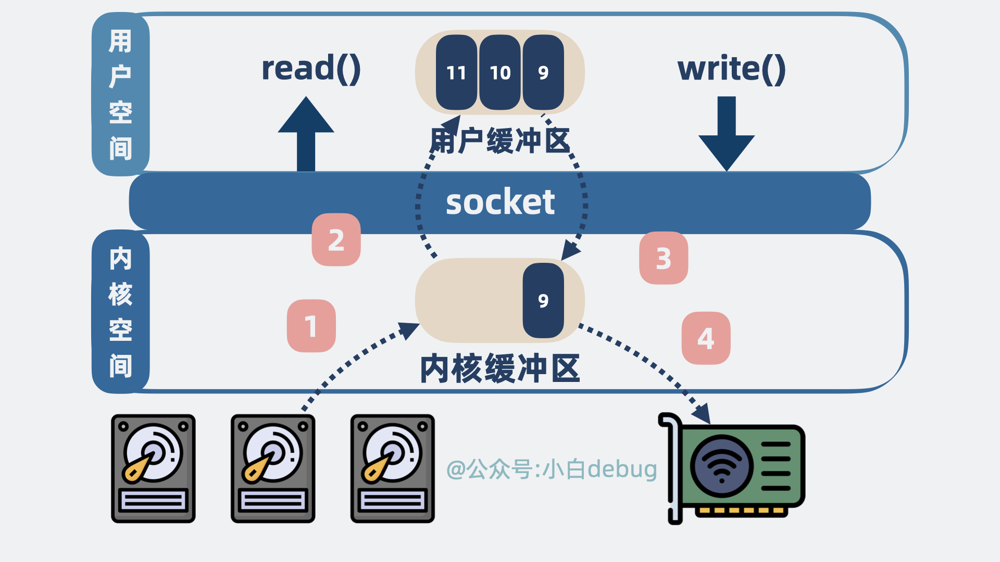
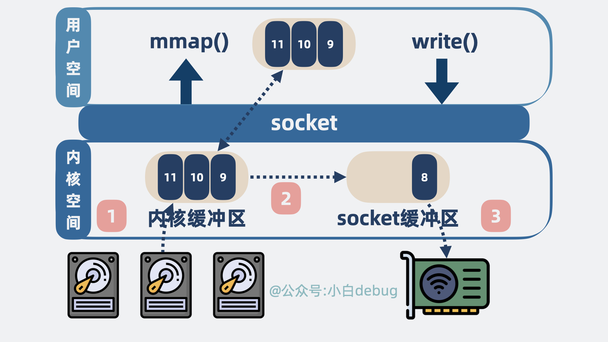
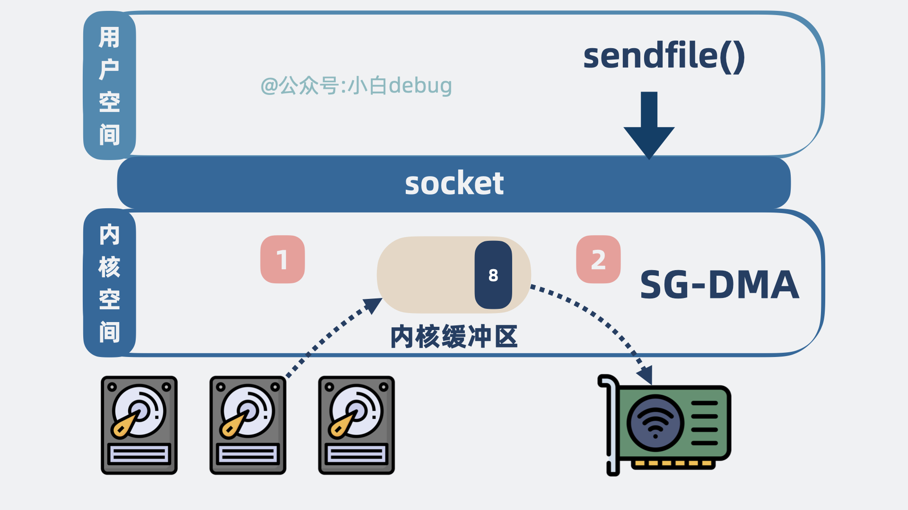
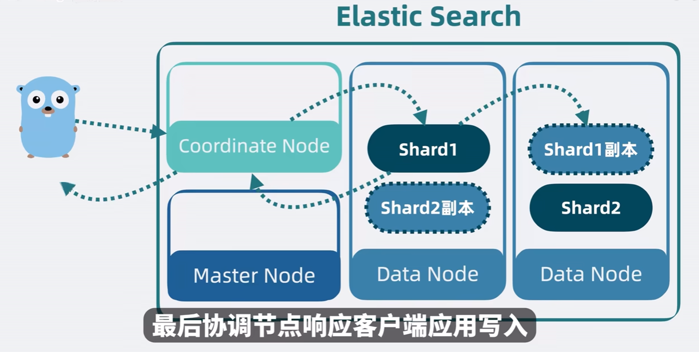
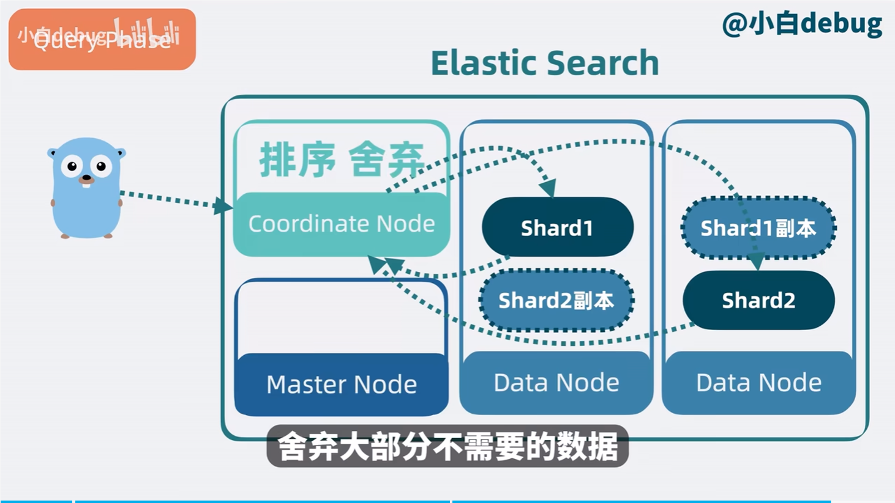
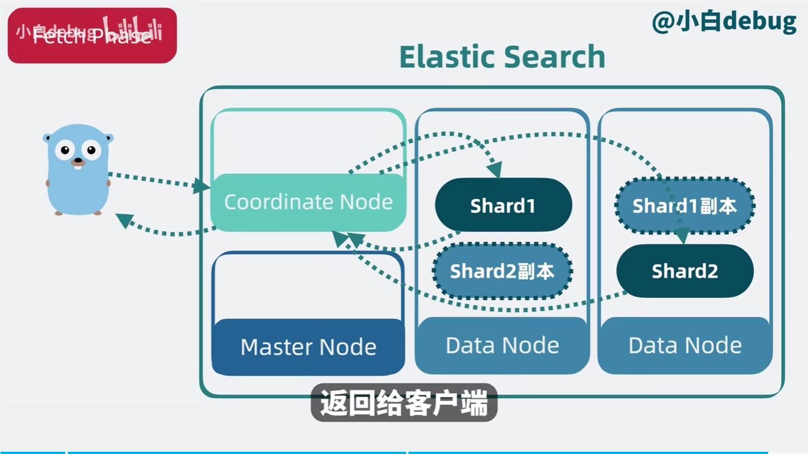

## 线程池
### 线程池的工作机制
线程池的工作机制通常包括以下几个步骤：
1. 提交任务：
当有新任务提交到线程池时，线程池会首先检查核心线程是否有空闲，如果有空闲核心线程，则直接交给核心线程执行。
2. 等待队列：
如果核心线程都在忙碌，线程池会将新任务放入等待队列中。
3. 创建新线程：
如果等待队列已满，且线程池中的线程数还没有达到最大线程数，线程池会创建新的线程来处理任务。
4. 拒绝策略：
如果线程池中的线程数已经达到最大线程数，并且等待队列也已满，线程池会根据预设的拒绝策略来处理新任务，例如抛出异常、丢弃任务或调用自定义的处理逻辑。
### 常见问题
- Q：线程池的核心线程数用完了之后为什么不是直接打到最大线程，而是先进入等待队列？
- A： 
    - 资源管理：
        - 创建和销毁线程是有开销的，频繁地创建和销毁线程会消耗系统资源。通过使用等待队列，可以减少线程的频繁创建和销毁，节省资源。
    - 提高效率：
        - 核心线程数是线程池在正常情况下保持的线程数量，这些线程通常是长期存活的。通过先将任务放入等待队列，可以充分利用现有的核心线程，提高线程的利用率。
    - 避免过载：
        - 如果任务直接创建新的线程，可能会导致系统在短时间内创建大量线程，增加系统负担，甚至导致系统过载。等待队列可以起到缓冲作用，防止系统过载。
- Q：线程池还是 MQ ？
- A：线程池和 MQ 都能实现**异步化和削峰**，而线程池比较易用，不需要维护中间件，但是无法持久化。MQ 原生支持重试，适合用在分布式系统中一致性的解决方案里面。拥有异步任务的堆积能力，可以去集群扩展内存。所以对比线程池，对可靠性和堆积能力要求高的场景就可以选择使用消息队列。
- Q：如何设置最大线程数和核心线程数？
- A：在实际使用中，设置线程池的最大线程数和核心线程数需要根据具体的应用场景和系统资源来进行权衡。以下是一些常见的考虑因素和设置方法：
    1. **CPU 密集型任务**：
   - 对于 CPU 密集型任务，线程数不宜过多，因为过多的线程会导致频繁的上下文切换，反而降低性能。通常建议设置核心线程数接近于 CPU 核心数。

    2. **I/O 密集型任务**：
   - 对于 I/O 密集型任务，可以设置更多的线程，因为这些任务大部分时间在等待 I/O 操作完成。线程数可以设置为 CPU 核心数的几倍。

    3. **系统资源**：
   - 需要考虑系统的内存和 CPU 资源，避免设置过多的线程导致系统资源耗尽。

    4. **任务特性**：
   - 根据任务的执行时间和频率来调整线程数。例如，短时间高频率的任务可以设置更多的线程，而长时间低频率的任务可以设置较少的线程。

在 Java 中，可以使用 `ThreadPoolExecutor` 来设置线程池的核心线程数和最大线程数。以下是一个示例：

```java
import java.util.concurrent.Executors;
import java.util.concurrent.ThreadPoolExecutor;
import java.util.concurrent.TimeUnit;

public class ThreadPoolExample {
    public static void main(String[] args) {
        // 核心线程数
        int corePoolSize = 4;
        // 最大线程数
        int maximumPoolSize = 10;
        // 线程空闲时间
        long keepAliveTime = 60;
        // 时间单位
        TimeUnit unit = TimeUnit.SECONDS;

        // 创建线程池
        ThreadPoolExecutor executor = new ThreadPoolExecutor(
            corePoolSize,
            maximumPoolSize,
            keepAliveTime,
            unit,
            new LinkedBlockingQueue<Runnable>()
        );

        // 提交任务
        for (int i = 0; i < 20; i++) {
            executor.submit(() -> {
                System.out.println("Thread: " + Thread.currentThread().getName());
                try {
                    Thread.sleep(2000);
                } catch (InterruptedException e) {
                    Thread.currentThread().interrupt();
                }
            });
        }

        // 关闭线程池
        executor.shutdown();
    }
}
```
- **核心线程数**：通常设置为 CPU 核心数或稍高一些。
- **最大线程数**：根据任务类型和系统资源进行设置，I/O 密集型任务可以设置为核心线程数的几倍。
- **等待队列**：选择合适的等待队列类型，如 `LinkedBlockingQueue` 或 `SynchronousQueue`。

通过合理设置线程池的核心线程数和最大线程数，可以提高系统的并发性能和资源利用率。

实际开发场景中其实很难判断，更多是根据经验值或者是根据一些研究给出的公式设置。或者是使用动态线程池。
## 锁的分类
## MySQL
## Mybatis
MyBatis 是一款优秀的持久层框架，MyBatis 帮助我们做了很多事情：建立连接、操作 Statment、ResultSet、处理 JDBC 相关异常等，简化了开发流程。
## Redis
## 消息队列 MQ
原生支持重试，适合用在分布式系统中一致性的解决方案里面。
异步任务的堆积能力，可以去集群扩展内存。所以对比线程池，对可靠性和堆积能力要求高的场景就可以选择使用消息队列。
### RabbitMQ 
1. 简介 
RabbitMQ 是一个由 erlang 开发的消息队列。消息队列用于应用间的异步协作。
2. 基本概念 
- Message：由消息头和消息体组成。消息体是不透明的，而消息头则由一系列的可选属性组成，这些属性包括routing-key、priority、delivery-mode（是否持久性存储）等。
- Publisher：消息的生产者。
- Exchange：接收消息并将消息路由到一个或多个Queue。default - exchange 是默认的直连交换机，名字为空字符串，每个新建队列都会自动绑定到默认交换机上，绑定的路由键名称与队列名称相同。
- Binding：通过Binding将Exchange和Queue关联，这样Exchange就知道将消息路由到哪个Queue中。
- Queue：存储消息，队列的特性是先进先出。一个消息可分发到一个或多个队列。
- Virtual host：每个 vhost 本质上就是一个 mini 版的 RabbitMQ 服务器，拥有自己的队列、交换器、绑定和权限机制。vhost 是 AMQP 概念的基础，必须在连接时指定，RabbitMQ 默认的 vhost 是 / 。当多
个不同的用户使用同一个RabbitMQ server提供的服务时，可以划分出多个vhost，每个用户在自己的vhost创建exchange和queue。
- Broker：消息队列服务器实体。
3. 为什么要使用消息队列？ 
总结一下，主要三点原因：解耦、异步、削峰。
1、解耦。比如，用户下单后，订单系统需要通知库存系统，假如库存系统无法访问，则订单减库存将失
败，从而导致订单操作失败。订单系统与库存系统耦合，这个时候如果使用消息队列，可以返回给用户
成功，先把消息持久化，等库存系统恢复后，就可以正常消费减去库存了。
2、异步。将消息写入消息队列，非必要的业务逻辑以异步的方式运行，不影响主流程业务。
3、削峰。消费端慢慢的按照数据库能处理的并发量，从消息队列中慢慢拉取消息。在生产中，这个短暂的高峰期积压是允许的。比如秒杀活动，一般会因为流量过大，从而导致流量暴增，应用挂掉。这个时候加上消息队列，服务器接收到用户的请求后，首先写入消息队列，如果消息队列长度超过最大数量，则直接抛弃用户请求或跳转到错误页面。
4. 使用了消息队列会有什么缺点 
- 系统可用性降低。引入消息队列之后，如果消息队列挂了，可能会影响到业务系统的可用性。
- 系统复杂性增加。加入了消息队列，要多考虑很多方面的问题，比如：一致性问题、如何保证消息不被重复消费、如何保证消息可靠性传输等。
## Apache Kafka
[【kafka 为什么这么快？RocketMQ 哪里不如 Kafka？】](https://www.bilibili.com/video/BV1Zy411e7qY/?share_source=copy_web&vd_source=589ae6273d7e5597533c35b38ecfdb77)
### 零拷贝
零拷贝是什么？
#### 传统 IO
传统 IO 操作，如果用户想要将数据从磁盘发送到网络。那么就会发生下面这几件事：
- 程序会发起系统调用read()，尝试读取磁盘数据，
    - 磁盘数据从设备拷贝到内核空间的缓冲区。
    - 再从内核空间的缓冲区拷贝到用户空间。
- 程序再发起系统调用write()，将读到的数据发到网络：
    - 数据从用户空间拷贝到 socket 发送缓冲区
    - 再从 socket 发送缓冲区拷贝到网卡。

整个过程，本机内发生了 2 次系统调用，对应 4 次用户空间和内核空间的切换，以及 4 次数据拷贝

#### mmap
mmap 是操作系统内核提供的一个方法，可以将内核空间的缓冲区映射到用户空间。
mmap 作为一种零拷贝技术，指的是用户空间到内核空间这个过程不需要拷贝，而不是指数据从磁盘到发送到网卡这个过程零拷贝。
- 程序发起系统调用 mmap()，尝试读取磁盘数据，具体情况如下：
    - 磁盘数据从设备拷贝到内核空间的缓冲区。
    - 内核空间的缓冲区映射到用户空间，这里不需要拷贝。

- 程序再发起系统调用 write()，将读到的数据发到网络：
    - 数据从内核空间缓冲区拷贝到 socket 发送缓冲区。
    - 再从 socket 发送缓冲区拷贝到网卡。

整个过程，发生了 2 次系统调用，对应 4 次用户空间和内核空间的切换，以及 3 次数据拷贝，对比之前，省下一次内核空间到用户空间的拷贝。

#### sendfile
sendfile，也是内核提供的一个方法，从名字可以看出，就是用来发送文件数据的。
程序发起系统调用 sendfile()，内核会尝试读取磁盘数据然后发送，具体情况如下：

- 磁盘数据从设备拷贝到内核空间的缓冲区。
- 内核空间缓冲区里的数据可以直接拷贝到网卡。

整个过程，发生了 1 次系统调用，对应 2 次用户空间和内核空间的切换，以及 2 次数据拷贝。

其实，这里的零拷贝指的是零 CPU拷贝。
也就是说 sendfile 场景下，需要的两次拷贝，都不是 CPU 直接参与的拷贝，而是其他硬件设备技术（SG-DMA）做的拷贝，不耽误我们 CPU 跑程序。
>SG-DMA（Scatter-Gather Direct Memory Access，分散-聚集直接内存访问）是一种高级的 DMA 技术，用于高效地处理非连续内存块的数据传输。与传统的 DMA 不同，SG-DMA 可以在一次传输操作中处理多个不连续的内存块，从而减少了 CPU 的参与，提高了数据传输的效率。
#### RocketMQ为什么不使用sendfile？
聊完两种零拷贝技术，我们回过头来看下 kafka 为什么性能比 RocketMQ 好。
这是因为 RocketMQ 使用的是 mmap 零拷贝技术，而 kafka 使用的是 sendfile。kafka 以更少的拷贝次数以及系统内核切换次数，获得了更高的性能。
但问题又来了，为什么 RocketMQ 不使用 sendfile？

mmap 返回的是数据的具体内容，应用层能获取到消息内容并进行一些逻辑处理。
而 sendfile 返回的则是发送成功了几个字节数，具体发了什么内容，应用层根本不知道。

而 RocketMQ 的一些功能，却需要了解具体这个消息内容，方便二次投递等，比如将消费失败的消息重新投递到死信队列中，如果 RocketMQ 使用 sendfile，那根本没机会获取到消息内容长什么样子，也就没办法实现一些好用的功能了。

RocketMQ 和 kafka 相比，在架构上做了减法，在功能上做了加法
跟 kafka 的架构相比，RocketMQ 简化了协调节点和分区以及备份模型。同时增强了消息过滤、消息回溯和事务能力，加入了延迟队列，死信队列等新特性。
凡事皆有代价，RocketMQ 牺牲了一部分性能，换取了比 kafka 更强大的功能特性。

## 后端接口性能优化有哪些方法？ 
有以下这些方法：
1、优化索引。给where条件的关键字段，或者 order by 后面的排序字段，加索引。
2、优化sql语句。比如避免使用select *、批量操作、避免深分页、提升group by的效率等
3、避免大事务。使用@Transactional注解这种声明式事务的方式提供事务功能，容易造成大事务，引发其他的问题。应该避免在事务中一次性处理太多数据，将一些跟事务无关的逻辑放到事务外面执行。
4、异步处理。剥离主逻辑和副逻辑，副逻辑可以异步执行，异步写库。比如用户购买的商品发货了，需要发短信通知，短信通知是副流程，可以异步执行，以免影响主流程的执行。
5、降低锁粒度。在并发场景下，多个线程同时修改数据，造成数据不一致的情况。这种情况下，一般会加锁解决。但如果锁加得不好，导致锁的粒度太粗，也会非常影响接口性能。
6、加缓存。如果表数据量非常大的话，直接从数据库查询数据，性能会非常差。可以使用Redis 和memcached提升查询性能，从而提高接口性能。
7、分库分表。当系统发展到一定的阶段，用户并发量大，会有大量的数据库请求，需要占用大量的数据库连接，同时会带来磁盘IO的性能瓶颈问题。或者数据库表数据非常大，SQL查询即使走了索引，也很耗时。这时，可以通过分库分表解决。分库用于解决数据库连接资源不足问题，和磁盘IO的性能瓶颈问题。分表用于解决单表数据量太大，sql语句查询数据时，即使走了索引也非常耗时问题。
8、避免在循环中查询数据库。循环查询数据库，非常耗时，最好能在一次查询中获取所有需要的数据。
## Spring AOP
Spring AOP是通过动态代理技术
## SpringBoot
## JVM
## Elastic Search
[【Elastic Search是什么？Lucene是什么？架构是怎么样的？】 ](https://www.bilibili.com/video/BV1yb421J7oX/?share_source=copy_web&vd_source=589ae6273d7e5597533c35b38ecfdb77)
ES 是一个开源的搜索引擎，它提供了一个分布式多用户能力的全文搜索引擎，基于 RESTful web 接口。ES 是用 Java 语言开发的，并作为 Apache 许可条款下的开放源码发布，是当前企业级应用中最受欢迎的搜索引擎之一。
Lucene 是一个全文检索引擎的工具包，而 ElasticSearch 是基于 Lucene 构建的搜索引擎。
- segment 的概念：
segment 是一个复合文件，包含下面四种结构，构成一个拥有完整搜索功能的最小单元。
    - inverted index：倒排索引 = term dictionary + 对应的文档ID列表 posting list。二分查找。但是太大了，只能放在磁盘中
    - 前缀树 term index 减小了term dictionary 的体积，可以存放在内存中
    - stored fields：拥有了分词和文档ID的信息之后，还需要一个存放完整文档的行式存储结构
    - doc values：列式存储结构，空间换时间，用于针对多种不同排序方式返回文档
    - segment 并发读取，为了不耗尽文件句柄，定期merge segment

在 Luence 的基础上，ElasticSearch 实现了高性能、高扩展性、高可用、Node 角色分化和去中心化。
- 高性能：多个针对同一个 Lucene 的读写会造成争抢和等待，浪费时间，那么可以使用 index name 对不同类别的写入信息进行分类，不同的信息写入不同的Lucene ；再在每个 index name 内部进行分片，每个 shard 分片其实都是一个 Lucene 。这样就可以实现多个 Lucene 的并行写入，提高了写入的效率。
- 高拓展性：分片过多，如果都只在一个节点上，那么这个节点的负载会很大，所以可以将每个 shard 分片放在不同的节点上，这样就可以实现分布式的存储，提高了读取的效率。
- 高可用：如果某个节点挂了，那么这个节点上的 shard 分片就会丢失，所以可以设置 replica 副本，将每个 shard 分片的副本放在不同的节点上，这样就可以实现高可用，当某个节点挂了，可以从副本节点上读取数据。
- Node 角色分化：ES 有 Master 节点、Data 节点、Client 节点，Master 节点主要负责集群的管理，Data 节点主要负责数据的存储和检索，Client 节点主要负责客户端的请求转发。如果不去做这个角色分化，那么一个节点上负责的某个功能需要扩容的时候，其他功能也扩容了，就会造成资源的冗余浪费。所以，集群小的时候，可以让一个节点充当多个角色，集群大了之后，最好进行角色分化。
- 去中心化：需要有一个协调机制来同步 Node 之间的数据。如果不想像 kafka 那样维护一个中心节点 zookeeper，那么也可以用去中心化的方法，在 Node 中引入一个魔改的 raft 模块，在节点间相互同步数据，Node 参与选组，还能了解到Node集群中的消息（哪个 Node 挂了等等）

- 流程：
    - 写入：
    
    - 搜索：query phrase + fetch phrase
    
    
## 微服务
SpringCloud 
现在面试基本都会问到微服务相关的内容，最好了解下微服务相关的知识。服务注册与发现、负载均衡、服务降级、API网关等。推荐书籍《spring cloud微服务实战》

## 分布式事务
## 场景设计
## 海量数据场景
