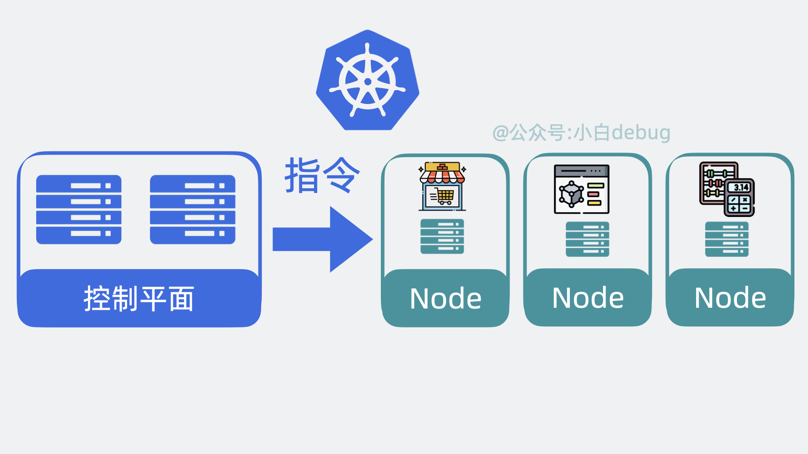
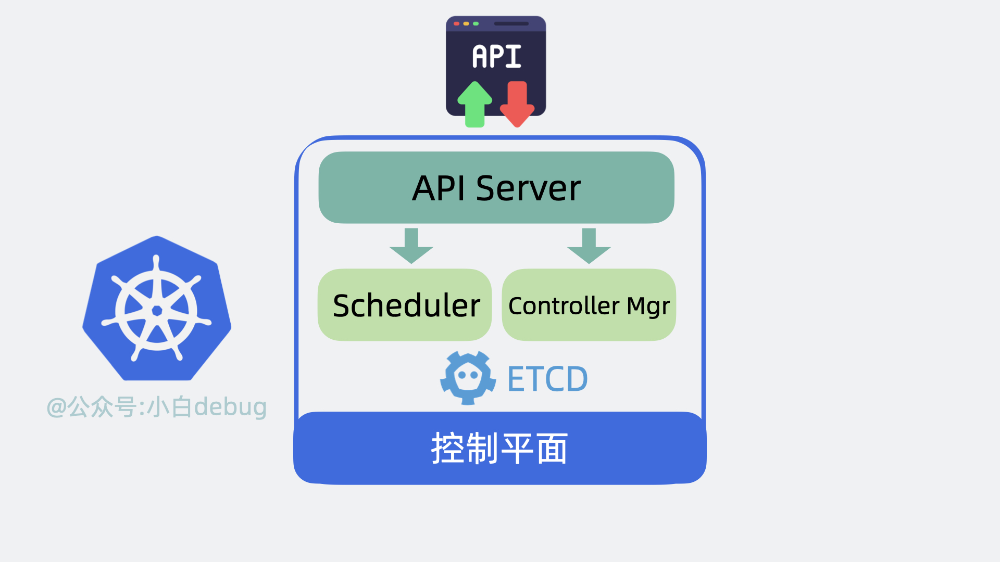
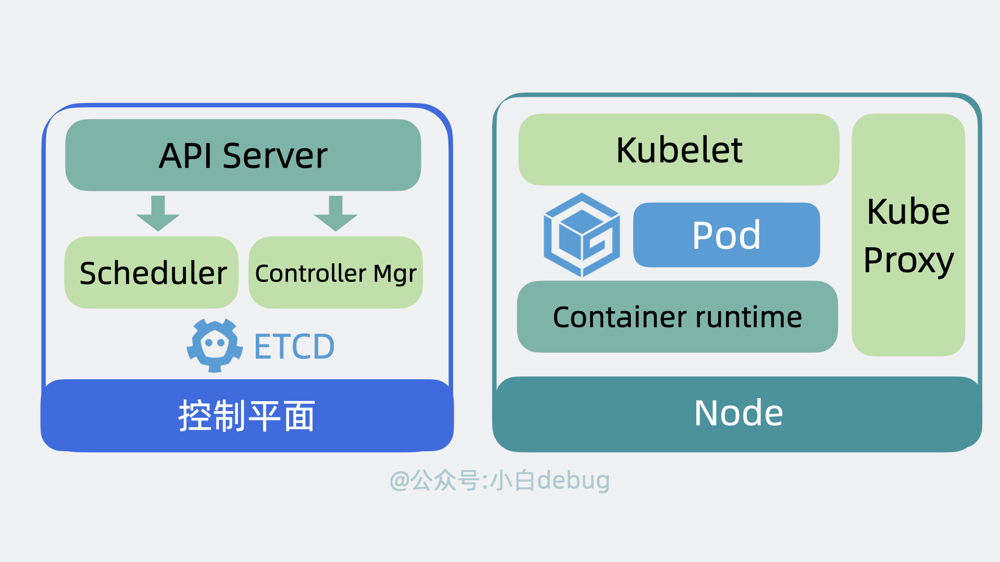
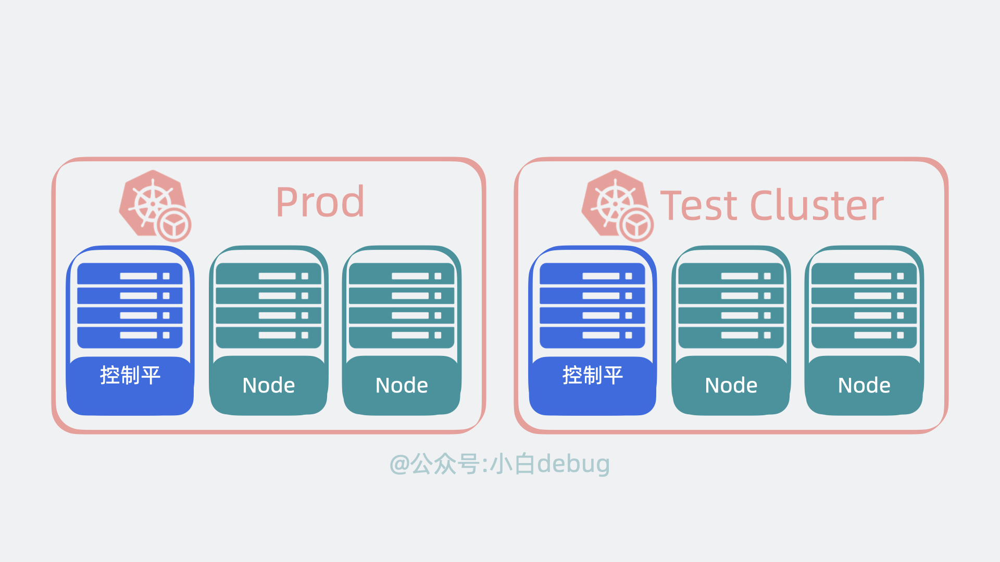
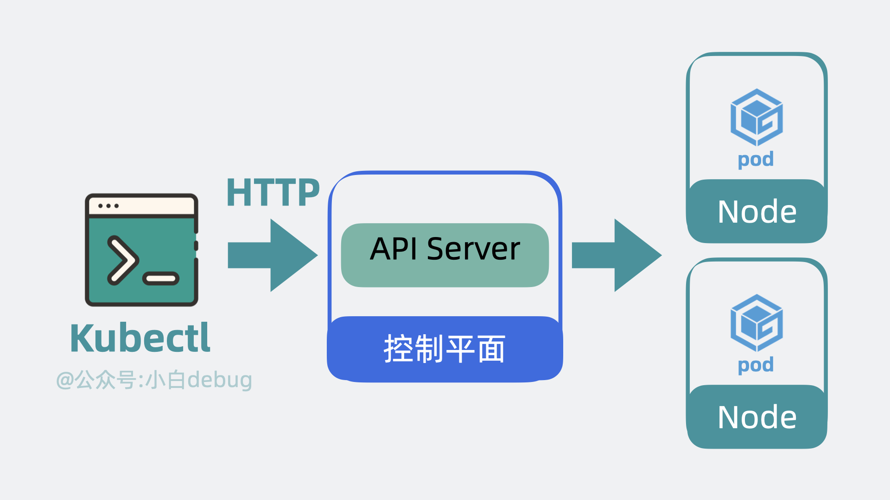
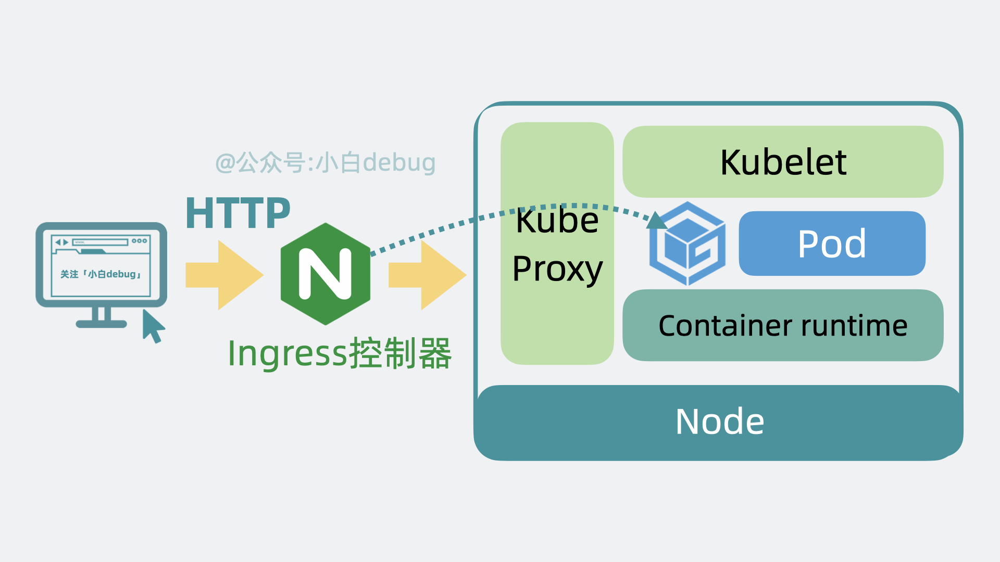
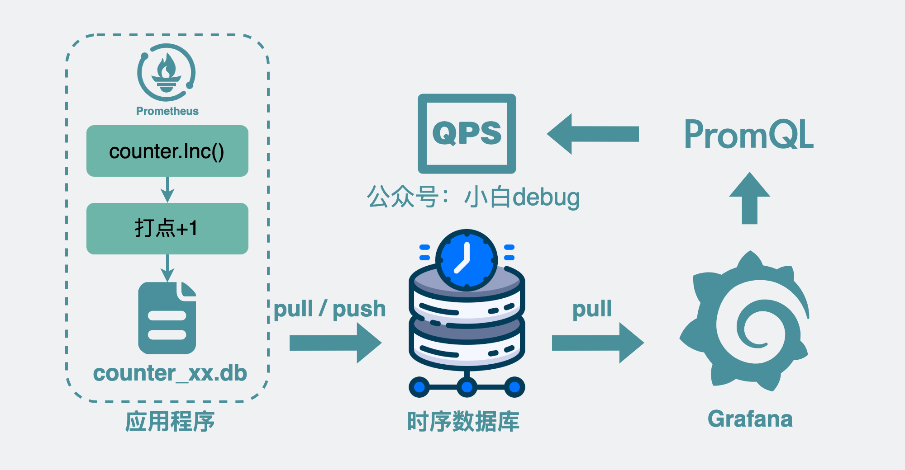
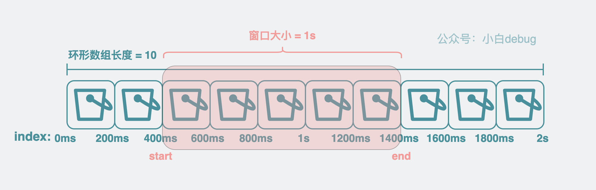
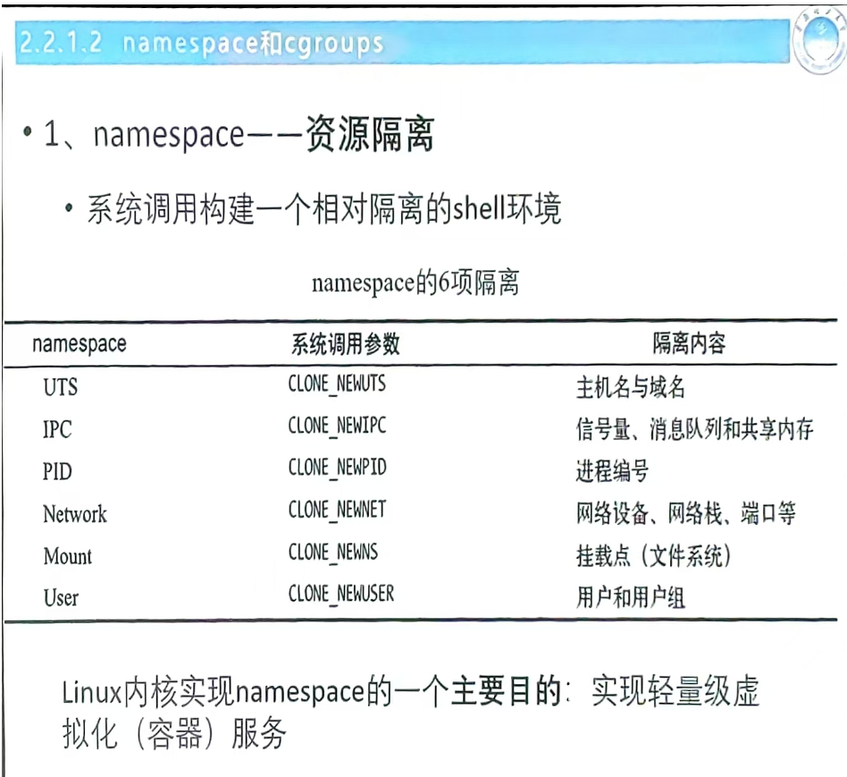

## 线程池
### 线程池的工作机制
线程池的工作机制通常包括以下几个步骤：
1. 提交任务：
当有新任务提交到线程池时，线程池会首先检查核心线程是否有空闲，如果有空闲核心线程，则直接交给核心线程执行。
2. 等待队列：
如果核心线程都在忙碌，线程池会将新任务放入等待队列中。
3. 创建新线程：
如果等待队列已满，且线程池中的线程数还没有达到最大线程数，线程池会创建新的线程来处理任务。
4. 拒绝策略：
如果线程池中的线程数已经达到最大线程数，并且等待队列也已满，线程池会根据预设的拒绝策略来处理新任务，例如抛出异常、丢弃任务或调用自定义的处理逻辑。
### 常见问题
- Q：线程池的核心线程数用完了之后为什么不是直接打到最大线程，而是先进入等待队列？
- A： 
    - 资源管理：
        - 创建和销毁线程是有开销的，频繁地创建和销毁线程会消耗系统资源。通过使用等待队列，可以减少线程的频繁创建和销毁，节省资源。
    - 提高效率：
        - 核心线程数是线程池在正常情况下保持的线程数量，这些线程通常是长期存活的。通过先将任务放入等待队列，可以充分利用现有的核心线程，提高线程的利用率。
    - 避免过载：
        - 如果任务直接创建新的线程，可能会导致系统在短时间内创建大量线程，增加系统负担，甚至导致系统过载。等待队列可以起到缓冲作用，防止系统过载。
- Q：线程池还是 MQ ？
- A：线程池和 MQ 都能实现**异步化和削峰**，而线程池比较易用，不需要维护中间件，但是无法持久化。MQ 原生支持重试，适合用在分布式系统中一致性的解决方案里面。拥有异步任务的堆积能力，可以去集群扩展内存。所以对比线程池，对可靠性和堆积能力要求高的场景就可以选择使用消息队列。
- Q：如何设置最大线程数和核心线程数？
- A：在实际使用中，设置线程池的最大线程数和核心线程数需要根据具体的应用场景和系统资源来进行权衡。以下是一些常见的考虑因素和设置方法：
    1. **CPU 密集型任务**：
   - 对于 CPU 密集型任务，线程数不宜过多，因为过多的线程会导致频繁的上下文切换，反而降低性能。通常建议设置核心线程数接近于 CPU 核心数。

    2. **I/O 密集型任务**：
   - 对于 I/O 密集型任务，可以设置更多的线程，因为这些任务大部分时间在等待 I/O 操作完成。线程数可以设置为 CPU 核心数的几倍。

    3. **系统资源**：
   - 需要考虑系统的内存和 CPU 资源，避免设置过多的线程导致系统资源耗尽。

    4. **任务特性**：
   - 根据任务的执行时间和频率来调整线程数。例如，短时间高频率的任务可以设置更多的线程，而长时间低频率的任务可以设置较少的线程。

在 Java 中，可以使用 `ThreadPoolExecutor` 来设置线程池的核心线程数和最大线程数。以下是一个示例：

```java
import java.util.concurrent.Executors;
import java.util.concurrent.ThreadPoolExecutor;
import java.util.concurrent.TimeUnit;

public class ThreadPoolExample {
    public static void main(String[] args) {
        // 核心线程数
        int corePoolSize = 4;
        // 最大线程数
        int maximumPoolSize = 10;
        // 线程空闲时间
        long keepAliveTime = 60;
        // 时间单位
        TimeUnit unit = TimeUnit.SECONDS;

        // 创建线程池
        ThreadPoolExecutor executor = new ThreadPoolExecutor(
            corePoolSize,
            maximumPoolSize,
            keepAliveTime,
            unit,
            new LinkedBlockingQueue<Runnable>()
        );

        // 提交任务
        for (int i = 0; i < 20; i++) {
            executor.submit(() -> {
                System.out.println("Thread: " + Thread.currentThread().getName());
                try {
                    Thread.sleep(2000);
                } catch (InterruptedException e) {
                    Thread.currentThread().interrupt();
                }
            });
        }

        // 关闭线程池
        executor.shutdown();
    }
}
```
- **核心线程数**：通常设置为 CPU 核心数或稍高一些。
- **最大线程数**：根据任务类型和系统资源进行设置，I/O 密集型任务可以设置为核心线程数的几倍。
- **等待队列**：选择合适的等待队列类型，如 `LinkedBlockingQueue` 或 `SynchronousQueue`。

通过合理设置线程池的核心线程数和最大线程数，可以提高系统的并发性能和资源利用率。

实际开发场景中其实很难判断，更多是根据经验值或者是根据一些研究给出的公式设置。或者是使用动态线程池。
## 锁的分类
## MySQL
## Mybatis
MyBatis 是一款优秀的持久层框架，MyBatis 帮助我们做了很多事情：建立连接、操作 Statment、ResultSet、处理 JDBC 相关异常等，简化了开发流程。
## Redis
## 消息队列 MQ
原生支持重试，适合用在分布式系统中一致性的解决方案里面。
异步任务的堆积能力，可以去集群扩展内存。所以对比线程池，对可靠性和堆积能力要求高的场景就可以选择使用消息队列。
### RabbitMQ 
1. 简介 
RabbitMQ 是一个由 erlang 开发的消息队列。消息队列用于应用间的异步协作。
2. 基本概念 
- Message：由消息头和消息体组成。消息体是不透明的，而消息头则由一系列的可选属性组成，这些属性包括routing-key、priority、delivery-mode（是否持久性存储）等。
- Publisher：消息的生产者。
- Exchange：接收消息并将消息路由到一个或多个Queue。default - exchange 是默认的直连交换机，名字为空字符串，每个新建队列都会自动绑定到默认交换机上，绑定的路由键名称与队列名称相同。
- Binding：通过Binding将Exchange和Queue关联，这样Exchange就知道将消息路由到哪个Queue中。
- Queue：存储消息，队列的特性是先进先出。一个消息可分发到一个或多个队列。
- Virtual host：每个 vhost 本质上就是一个 mini 版的 RabbitMQ 服务器，拥有自己的队列、交换器、绑定和权限机制。vhost 是 AMQP 概念的基础，必须在连接时指定，RabbitMQ 默认的 vhost 是 / 。当多
个不同的用户使用同一个RabbitMQ server提供的服务时，可以划分出多个vhost，每个用户在自己的vhost创建exchange和queue。
- Broker：消息队列服务器实体。
3. 为什么要使用消息队列？ 
总结一下，主要三点原因：解耦、异步、削峰。
1、解耦。比如，用户下单后，订单系统需要通知库存系统，假如库存系统无法访问，则订单减库存将失
败，从而导致订单操作失败。订单系统与库存系统耦合，这个时候如果使用消息队列，可以返回给用户
成功，先把消息持久化，等库存系统恢复后，就可以正常消费减去库存了。
2、异步。将消息写入消息队列，非必要的业务逻辑以异步的方式运行，不影响主流程业务。
3、削峰。消费端慢慢的按照数据库能处理的并发量，从消息队列中慢慢拉取消息。在生产中，这个短暂的高峰期积压是允许的。比如秒杀活动，一般会因为流量过大，从而导致流量暴增，应用挂掉。这个时候加上消息队列，服务器接收到用户的请求后，首先写入消息队列，如果消息队列长度超过最大数量，则直接抛弃用户请求或跳转到错误页面。
4. 使用了消息队列会有什么缺点 
- 系统可用性降低。引入消息队列之后，如果消息队列挂了，可能会影响到业务系统的可用性。
- 系统复杂性增加。加入了消息队列，要多考虑很多方面的问题，比如：一致性问题、如何保证消息不被重复消费、如何保证消息可靠性传输等。
## Apache Kafka
[【kafka 为什么这么快？RocketMQ 哪里不如 Kafka？】](https://www.bilibili.com/video/BV1Zy411e7qY/?share_source=copy_web&vd_source=589ae6273d7e5597533c35b38ecfdb77)
### 零拷贝
零拷贝是什么？
#### 传统 IO
传统 IO 操作，如果用户想要将数据从磁盘发送到网络。那么就会发生下面这几件事：
- 程序会发起系统调用read()，尝试读取磁盘数据，
    - 磁盘数据从设备拷贝到内核空间的缓冲区。
    - 再从内核空间的缓冲区拷贝到用户空间。
- 程序再发起系统调用write()，将读到的数据发到网络：
    - 数据从用户空间拷贝到 socket 发送缓冲区
    - 再从 socket 发送缓冲区拷贝到网卡。

整个过程，本机内发生了 2 次系统调用，对应 4 次用户空间和内核空间的切换，以及 4 次数据拷贝

#### mmap
mmap 是操作系统内核提供的一个方法，可以将内核空间的缓冲区映射到用户空间。
mmap 作为一种零拷贝技术，指的是用户空间到内核空间这个过程不需要拷贝，而不是指数据从磁盘到发送到网卡这个过程零拷贝。
- 程序发起系统调用 mmap()，尝试读取磁盘数据，具体情况如下：
    - 磁盘数据从设备拷贝到内核空间的缓冲区。
    - 内核空间的缓冲区映射到用户空间，这里不需要拷贝。

- 程序再发起系统调用 write()，将读到的数据发到网络：
    - 数据从内核空间缓冲区拷贝到 socket 发送缓冲区。
    - 再从 socket 发送缓冲区拷贝到网卡。

整个过程，发生了 2 次系统调用，对应 4 次用户空间和内核空间的切换，以及 3 次数据拷贝，对比之前，省下一次内核空间到用户空间的拷贝。

#### sendfile
sendfile，也是内核提供的一个方法，从名字可以看出，就是用来发送文件数据的。
程序发起系统调用 sendfile()，内核会尝试读取磁盘数据然后发送，具体情况如下：

- 磁盘数据从设备拷贝到内核空间的缓冲区。
- 内核空间缓冲区里的数据可以直接拷贝到网卡。

整个过程，发生了 1 次系统调用，对应 2 次用户空间和内核空间的切换，以及 2 次数据拷贝。

其实，这里的零拷贝指的是零 CPU拷贝。
也就是说 sendfile 场景下，需要的两次拷贝，都不是 CPU 直接参与的拷贝，而是其他硬件设备技术（SG-DMA）做的拷贝，不耽误我们 CPU 跑程序。
>SG-DMA（Scatter-Gather Direct Memory Access，分散-聚集直接内存访问）是一种高级的 DMA 技术，用于高效地处理非连续内存块的数据传输。与传统的 DMA 不同，SG-DMA 可以在一次传输操作中处理多个不连续的内存块，从而减少了 CPU 的参与，提高了数据传输的效率。
#### RocketMQ为什么不使用sendfile？
聊完两种零拷贝技术，我们回过头来看下 kafka 为什么性能比 RocketMQ 好。
这是因为 RocketMQ 使用的是 mmap 零拷贝技术，而 kafka 使用的是 sendfile。kafka 以更少的拷贝次数以及系统内核切换次数，获得了更高的性能。
但问题又来了，为什么 RocketMQ 不使用 sendfile？

mmap 返回的是数据的具体内容，应用层能获取到消息内容并进行一些逻辑处理。
而 sendfile 返回的则是发送成功了几个字节数，具体发了什么内容，应用层根本不知道。

而 RocketMQ 的一些功能，却需要了解具体这个消息内容，方便二次投递等，比如将消费失败的消息重新投递到死信队列中，如果 RocketMQ 使用 sendfile，那根本没机会获取到消息内容长什么样子，也就没办法实现一些好用的功能了。

RocketMQ 和 kafka 相比，在架构上做了减法，在功能上做了加法
跟 kafka 的架构相比，RocketMQ 简化了协调节点和分区以及备份模型。同时增强了消息过滤、消息回溯和事务能力，加入了延迟队列，死信队列等新特性。
凡事皆有代价，RocketMQ 牺牲了一部分性能，换取了比 kafka 更强大的功能特性。

## 后端接口性能优化有哪些方法？ 
有以下这些方法：
1、优化索引。给where条件的关键字段，或者 order by 后面的排序字段，加索引。
2、优化sql语句。比如避免使用select *、批量操作、避免深分页、提升group by的效率等
3、避免大事务。使用@Transactional注解这种声明式事务的方式提供事务功能，容易造成大事务，引发其他的问题。应该避免在事务中一次性处理太多数据，将一些跟事务无关的逻辑放到事务外面执行。
4、异步处理。剥离主逻辑和副逻辑，副逻辑可以异步执行，异步写库。比如用户购买的商品发货了，需要发短信通知，短信通知是副流程，可以异步执行，以免影响主流程的执行。
5、降低锁粒度。在并发场景下，多个线程同时修改数据，造成数据不一致的情况。这种情况下，一般会加锁解决。但如果锁加得不好，导致锁的粒度太粗，也会非常影响接口性能。
6、加缓存。如果表数据量非常大的话，直接从数据库查询数据，性能会非常差。可以使用Redis 和memcached提升查询性能，从而提高接口性能。
7、分库分表。当系统发展到一定的阶段，用户并发量大，会有大量的数据库请求，需要占用大量的数据库连接，同时会带来磁盘IO的性能瓶颈问题。或者数据库表数据非常大，SQL查询即使走了索引，也很耗时。这时，可以通过分库分表解决。分库用于解决数据库连接资源不足问题，和磁盘IO的性能瓶颈问题。分表用于解决单表数据量太大，sql语句查询数据时，即使走了索引也非常耗时问题。
8、避免在循环中查询数据库。循环查询数据库，非常耗时，最好能在一次查询中获取所有需要的数据。
## Spring AOP
Spring AOP是通过动态代理技术
## SpringBoot
## JVM
## Elastic Search
[【Elastic Search是什么？Lucene是什么？架构是怎么样的？】 ](https://www.bilibili.com/video/BV1yb421J7oX/?share_source=copy_web&vd_source=589ae6273d7e5597533c35b38ecfdb77)
ES 是一个开源的搜索引擎，它提供了一个分布式多用户能力的全文搜索引擎，基于 RESTful web 接口。ES 是用 Java 语言开发的，并作为 Apache 许可条款下的开放源码发布，是当前企业级应用中最受欢迎的搜索引擎之一。
Lucene 是一个全文检索引擎的工具包，而 ElasticSearch 是基于 Lucene 构建的搜索引擎。
- segment 的概念：
segment 是一个复合文件，包含下面四种结构，构成一个拥有完整搜索功能的最小单元。
    - inverted index：倒排索引 = term dictionary + 对应的文档ID列表 posting list。二分查找。但是太大了，只能放在磁盘中
    - 前缀树 term index 减小了term dictionary 的体积，可以存放在内存中
    - stored fields：拥有了分词和文档ID的信息之后，还需要一个存放完整文档的行式存储结构
    - doc values：列式存储结构，空间换时间，用于针对多种不同排序方式返回文档
    - segment 并发读取，为了不耗尽文件句柄，定期merge segment

在 Luence 的基础上，ElasticSearch 实现了高性能、高扩展性、高可用、Node 角色分化和去中心化。
- 高性能：多个针对同一个 Lucene 的读写会造成争抢和等待，浪费时间，那么可以使用 index name 对不同类别的写入信息进行分类，不同的信息写入不同的Lucene ；再在每个 index name 内部进行分片，每个 shard 分片其实都是一个 Lucene 。这样就可以实现多个 Lucene 的并行写入，提高了写入的效率。
- 高拓展性：分片过多，如果都只在一个节点上，那么这个节点的负载会很大，所以可以将每个 shard 分片放在不同的节点上，这样就可以实现分布式的存储，提高了读取的效率。
- 高可用：如果某个节点挂了，那么这个节点上的 shard 分片就会丢失，所以可以设置 replica 副本，将每个 shard 分片的副本放在不同的节点上，这样就可以实现高可用，当某个节点挂了，可以从副本节点上读取数据。
- Node 角色分化：ES 有 Master 节点、Data 节点、Client 节点，Master 节点主要负责集群的管理，Data 节点主要负责数据的存储和检索，Client 节点主要负责客户端的请求转发。如果不去做这个角色分化，那么一个节点上负责的某个功能需要扩容的时候，其他功能也扩容了，就会造成资源的冗余浪费。所以，集群小的时候，可以让一个节点充当多个角色，集群大了之后，最好进行角色分化。
- 去中心化：需要有一个协调机制来同步 Node 之间的数据。如果不想像 kafka 那样维护一个中心节点 zookeeper，那么也可以用去中心化的方法，在 Node 中引入一个魔改的 raft 模块，在节点间相互同步数据，Node 参与选组，还能了解到Node集群中的消息（哪个 Node 挂了等等）

- 流程：
    - 写入：
    
    - 搜索：query phrase + fetch phrase
    
    
## 微服务
SpringCloud 
现在面试基本都会问到微服务相关的内容，最好了解下微服务相关的知识。服务注册与发现、负载均衡、服务降级、API网关等。推荐书籍《spring cloud微服务实战》

## 分布式事务
## 场景设计
## 海量数据场景
## k8s
### Kubernetes 架构原理
Kubernetes 会将我们的服务器划为两部分，一部分叫控制平面（control plane，以前叫 master），另一部分叫工作节点，也就是 Node。
控制平面负责控制和管理各个 Node，而 Node 则负责实际运行各个应用服务。

#### 控制平面内部组件
以前我们需要登录到每台服务器上，手动执行各种命令，现在我们只需要调用 k8s 的提供的 api 接口，就能操作这些服务资源，这些接口都由 **API Server** 组件提供。

以前我们需要到处看下哪台服务器 cpu 和内存资源充足，然后才能部署应用，现在这部分决策逻辑由 **Scheduler**（调度器）来完成。

找到服务器后，以前我们会手动创建，关闭服务，现在这部分功能由 **Controller Manager**（控制器管理器）来负责。

上面的功能都会产生一些数据，这些数据需要被保存起来，方便后续做逻辑，因此 k8s 还会需要一个**存储层**，用来存放各种数据信息，目前是用的 **etcd**，这部分源码实现的很解耦，后续可能会扩展支持其他中间件。


#### Node 内部组件
Node 是实际的工作节点，它既可以是裸机服务器，也可以是虚拟机。它会负责实际运行各个应用服务。多个应用服务共享一台 Node 上的内存和 CPU 等计算资源。

部署多个应用服务的场景，以前我们需要上传代码到服务器，而用了 k8s 之后，我们只需要将服务代码打包成Container Image(容器镜像)，就能一行命令将它部署。

为了下载和部署镜像，Node 中会有一个 Container runtime 组件。

每个应用服务都可以认为是一个 Container（容器）, 并且大多数时候，我们还会为应用服务搭配一个日志收集器 Container 或监控收集器 Container，多个 Container 共同组成一个一个 Pod，它运行在 Node 上。

k8s 可以将 pod 从某个 Node 调度到另一个 Node，还能以 pod 为单位去做重启和动态扩缩容的操作。
所以说 Pod 是 k8s 中最小的调度单位。

另外，前面提到控制平面会用 Controller Manager （通过 API Server）控制 Node 创建和关闭服务，那 Node 也得有个组件能接收到这个命令才能去做这些动作，这个组件叫 **kubelet**，它主要负责管理和监控 Pod。

最后，Node 中还有个 **Kube Proxy** ，它负责 Node 的网络通信功能，有了它，外部请求就能被转发到 Pod 内。


#### cluster
控制平面和 Node 共同构成了一个 Cluster，也就是集群。在公司里，我们一般会构建多个集群, 比如测试环境用一个集群，生产环境用另外一个集群。同时，为了将集群内部的服务暴露给外部用户使用，我们一般还会部署一个入口控制器，比如 **Ingress 控制器（比如 Nginx）**，它可以提供一个入口让外部用户访问集群内部服务。


#### kubectl
k8s 为我们准备了一个命令行工具 kubectl，我们只需要执行命令，它内部就会调用 k8s 的 API。

#### k8s怎么部署服务
首先我们需要编写 YAML 文件，在里面定义 Pod 里用到了哪些镜像，占用多少内存和 CPU 等信息。
然后使用 kubectl 命令行工具执行 `kubectl apply -f xx.yaml` ，此时 kubectl 会读取和解析 YAML 文件，将解析后的对象通过 API 请求发送给 Kubernetes 控制平面内 的 API Server。 API Server 会根据要求，驱使 Scheduler 通过 etcd 提供的数据寻找合适的 Node， Controller Manager 会通过 API Server 控制 Node 创建服务，Node 内部的 kubelet 在收到命令后会开始基于 Container runtime 组件去拉取镜像创建容器，最终完成 Pod 的创建。

至此服务完成创建。

整个过程下来，我们只需要写一遍 yaml 文件，和执行一次 kubectl 命令

#### k8s怎么调用服务
以前外部用户小明，直接在浏览器上发送 http 请求，就能打到我们服务器上的 Nginx，然后转发到部署的服务内。
用了 k8s 之后，外部请求会先到达 k8s 集群的 Ingress 控制器，然后请求会被转发到 k8s 内部的某个 Node 的 Kube Proxy 上，再找到对应的 pod，然后才是转发到内部容器服务中，处理结果原路返回，到这就完成了一次服务调用。


## QPS
QPS（Queries Per Second）,也就是“每秒查询数”，它表示服务器每秒能够处理的请求数量，是一个衡量服务器性能的重要指标。

>带了数据库的服务一般写性能在 5k 以下，读性能一般在 10k 以下，能到 10k 以上的话，那很可能是在数据库前面加了层缓存。如果你的服务还带了个文本算法模型，那使用了 gpu 的情况下 API 一般支持 100~400QPS 左右，如果是个同时支持文本和图片的模型，也就是所谓的多模态模型，那一般在 100QPS 以内。
比如候选人上来就说服务单实例 API 读写性能都有上万 QPS, 那我可以大概猜到这应该是个纯 cpu+内存的 API 链路。但如果候选人还说这里面没做缓存且有数据库调用，那我可能会追问这里头用的是哪款数据库，底层是什么存储引擎？如果候选人还说这里面带了个文本检测的算法模型，那有点违反经验，那我会多聊聊细节，说不定这对我来说是个开眼界的机会。

### 如何计算 QPS ？
#### 监控场景
监控服务 QPS 是最常见的场景，它**对实时性要求不高**。
如果我们想要查看服务的 QPS，可以在服务代码内部接入 Prometheus 的代码库，然后在每个需要计算 QPS 的地方，加入类似 `Counter.Inc()` 这样的代码，意思是函数执行次数加 1。这个过程也就是所谓的打点。

当函数执行到打点函数时，`Prometheus 代码库`内部会计算这个函数的调用次数，将数据写入到 `counter_xx.db` 的文件中，再同步到公司的**时序数据库**中，然后我们可以通过一些监控面板，比如 grafana 调取时序数据库里的打点数据，在监控面板上通过特殊的表达式，也就是 PromQL ，对某段时间里的打点进行求导计算速率，这样就能看到这个函数的调用 QPS 啦。

#### 服务治理场景
跟监控面板查看服务 QPS 不同的是，我们有时候需要以更高的实时性获取 QPS。
比如在服务治理这一块，我们需要在服务内部加入一些中间层，实时计算服务 api 当前的 QPS，当它大于某个阈值时，可以做一些自定义逻辑，比如是直接拒绝掉一些请求，还是将请求排队等一段时间后再处理等等，也就是所谓的限流。
这样的场景都要求我们实时计算出准确的 QPS，那么接下来就来看下这是怎么实现的？

##### 基本思路
计算某个函数的执行 QPS 说白了就是计算每秒内这个函数被执行了多少次。
我们可以参考监控场景的思路，用一个临时变量 cnt 记录某个函数的执行次数，每执行一次就给变量+1，然后计算单位时间内的变化速率。
```sh
QPS = (cnt(t) - cnt(t - Δt)) / Δt
```
##### 引入 bucket
但这样会有个问题，到了第 10 秒的时候，有时候我还想回去知道第 5 和第 6 秒的 QPS，光一个变量的话，数据老早被覆盖了，根本不够用。
于是我们可以将临时变量 cnt，改成了一个数组，数组里每个元素都用来存放(cnt(t) - cnt(t - Δt)) 的值。数组里的每个元素，都叫 bucket
##### 调整 bucket 范围粒度
我们默认每个 bucket 都用来存放 1s 内的数据增量，但这粒度比较粗，我们可以调整为 200ms，这样我们可以获得更细粒度的数据。粒度越细，意味着我们计算 QPS 的组件越灵敏，那基于这个 QPS 做的服务治理能力响应就越快。
于是，原来用 1 个 bucket 存放 1s 内的增量数量，现在就变成要用 5 个 bucket 了。
##### 引入环形数组
但这样又引入一个新的问题，随着时间变长，数组的长度就越长，需要的内存就越多，最终导致进程申请的内存过多，被 oom（Out of Memory） kill 了。
为了解决这个问题，我们可以为数组加入最大长度的限制，超过最大长度的部分，就从头开始写，覆盖掉老的数据。这样的数组，就是所谓的环状数组。

虽然环状数组听起来挺高级了，但说白了就是一个用%取模来确定写入位置的定长数组，没有想象的那么高端。
比如数组长度是 5，数组 index 从 0 开始，要写 index=6 的 bucket， 计算 6%5 = 1，那就是写入 index=1 的位置上。
#### 加入滑动窗口
有了环形数组之后，现在我们想要计算 qps，就需要引入滑动窗口的概念。这玩意听着玄乎，其实就是 start 和 end 两个变量。通过它来圈定我们要计算 qps 的 bucket 数组范围。
将当前时间跟 bucket 的粒度做取模操作，可以大概知道 end 落在哪个 bucket 上，确定了 end 之后，将 end 的时间戳减个 1s就能大概得到 start 在哪个 bucket 上，有了这两个值，再将 start 到 end 范围内的 bucket 取出。对范围内的 bucket 里的 cnt 求和，得到这段时间内的总和，再除以 Δt，也就是 1s。就可以得到 qps。

#### 如何计算平均耗时
既然 qps 可以这么算，那同理，我们也可以计算某个函数的平均耗时，实现也很简单，上面提到 bucket 有个用来统计调用次数的变量 cnt，现在再加个用来统计延时的变量 Latency 。每次执行完函数，就给 bucket 里的 Latency 变量 加上耗时。
再通过滑动窗口获得对应的 bucket 数组范围，计算 Latency 的总和，再除以这些 bucket 里的调用次数 cnt 总和，就能得到平均耗时了。
#### sentinel-golang
sentinel-golang 是阿里巴巴开源的一款 Golang 版本的流量控制组件，它提供了丰富的流量控制功能，比如熔断、限流、降级等。
其实，上面的思路，就是阿里开源的sentinel-golang中 QPS 计算组件的实现方式。
sentinel-golang 是个著名的服务治理库，它会基于 QPS 和 Latency 等信息提供一系列限流熔断策略。
如果你想了解具体的代码实现，可以去看下。链接是：
[sentinel-golang](https://github.com/alibaba/sentinel-golang)

但茫茫码海，从何看起呢？下面给出一些关键词，大家可以作为入口去搜索看下。

首先可以基于 `sliding_window_metric.go` 里的 `GetQPS` 开始看起，它是实时计算 QPS 的入口函数。
这里面会看到很多上面提到的内容细节，其中前面提到的滑动窗口，它在 `sentinel-golang` 中叫 `LeapArray`。
bucket 环形数组，在 `sentinel-golang` 中叫 `AtomicBucketWrapArray`。
环形数组里存放的 `bucket` 在代码里就是 `MetricBucket`，但需要注意的是 `MetricBucket` 里的 count 并不是一个数字类型，而是一个 map 类型，它将上面提到的 `cnt` 和 `Latency` 等都作为一种 key-value 来存放。以后想要新增字段就不需要改代码了，提高了代码扩展性。
## docker
Docker 的架构是经典的 Client/Server 架构。Client 对应 Docker-cli， Server 对应 Docker daemon。

Docker-cli 会解析我们输入的 cmd 命令，然后调用 Docker daemon 守护进程提供的 RESTful API，守护进程收到命令后，会根据指令创建和管理各个容器。
再具体点，Docker Daemon 内部分为 Docker Server、Engine 两层。Docker Server 本质上就是个 HTTP 服务，负责对外提供操作容器和镜像的 api 接口，接收到 API 请求后，会分发任务给 Engine 层，Engine 层负责创建 Job，由 Job 实际执行各种工作。

Docker 本质上就是一个将程序和环境打包并运行的工具软件，而 Docker 容器本质上只是个自带独立运行环境的特殊进程，底层用的其实是宿主机的操作系统内核。
### 实现原理
#### namespaces
系统调用构建一个相对隔离的shell环境，这个环境里的进程只能看到自己的进程，看不到其他进程，这就是namespace的作用。
|namespace|系统调用参数|隔离内容|
|---|---|---|
|UTS|CLONE_NEWUTS|主机名和域名|
|IPC|CLONE_NEWIPC|信号量、消息队列和共享内存|
|PID|CLONE_NEWPID|进程ID|
|NET|CLONE_NEWNET|网络设备、网络栈、端口等|
|MNT|CLONE_NEWNS|文件系统挂载点|
|USER|CLONE_NEWUSER|用户和用户组|


#### cgrops
cgroups是Linux内核提供的一种资源限制和分配的机制，可以限制一个进程组能够使用的资源上限，比如CPU、内存、磁盘IO等。

内核使用cgroup结构体来表示一个control 对一个或者某几个 cgruops 子系统的资源限制。

cgruop树是一个层级结构，每个cgroup都可以有子cgroup，每个cgroup都可以有一个或者多个进程，每个进程只能属于一个cgroup。

### Docker Swarm 是什么？
Docker 解决的是一个容器的部署。
Docker Compose 解决的是多个容器组成的一整套服务的部署。
那 Docker Swarm 就更高维度了，它解决的其实是这一整套服务在多台服务器上的集群部署问题。
比如在 A 服务器坏了，就将服务在 B 服务器上重新部署一套，实现迁移，还能根据需要对服务做扩缩容。
