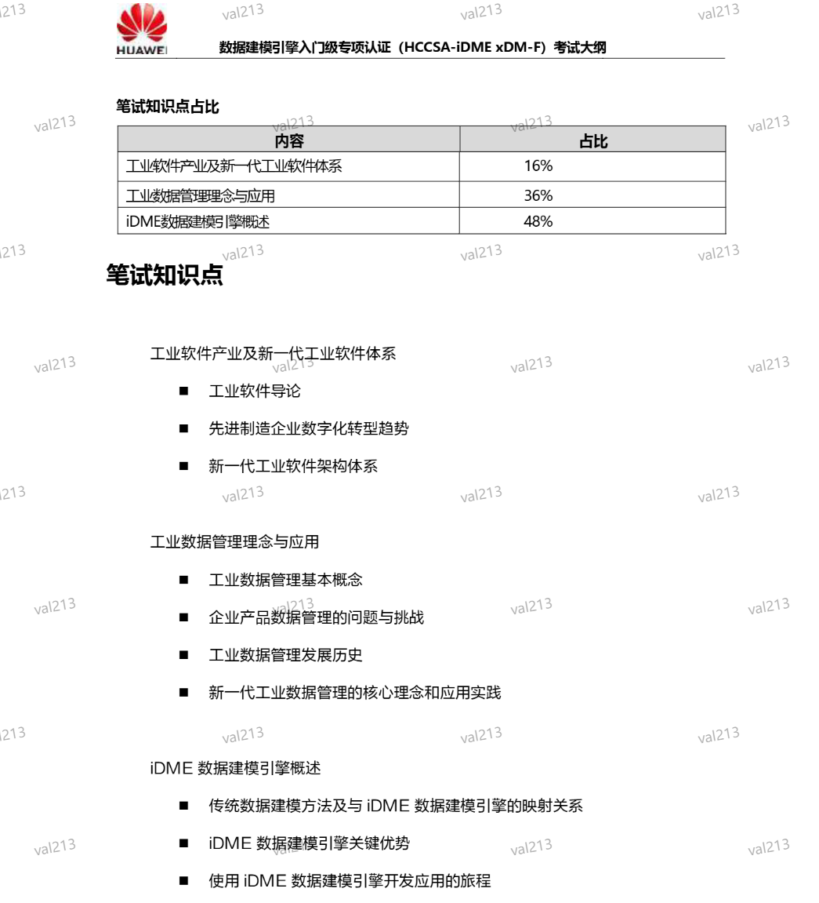
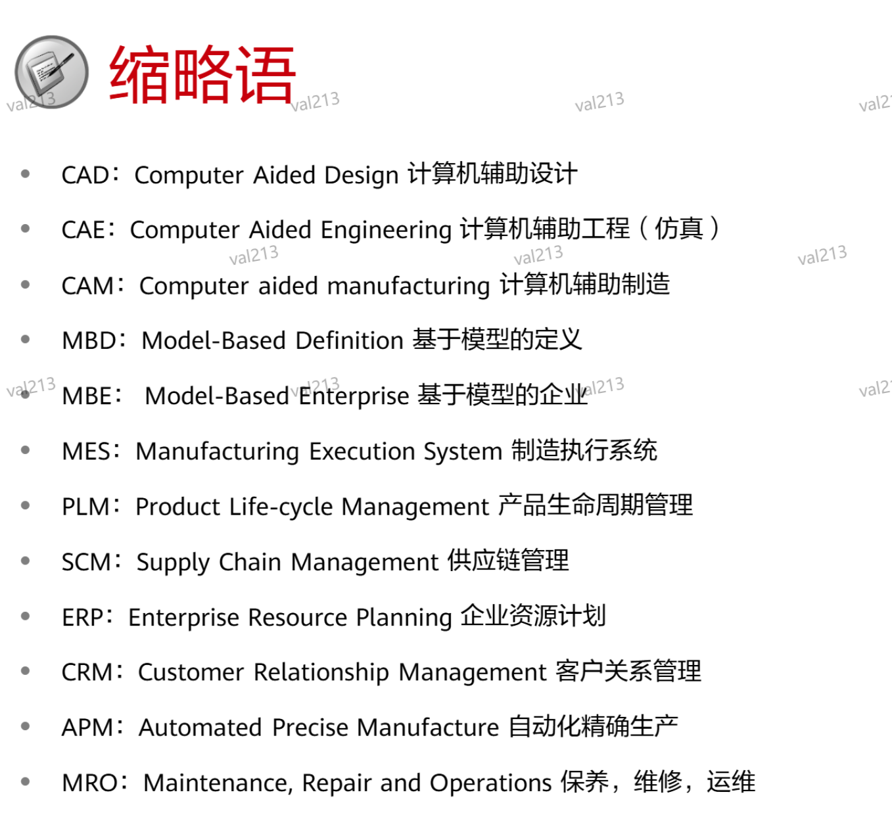
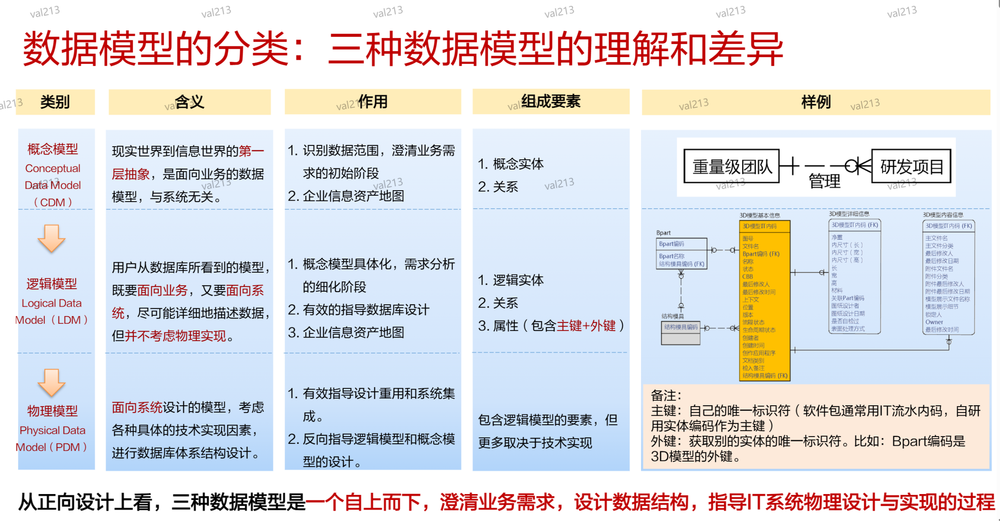
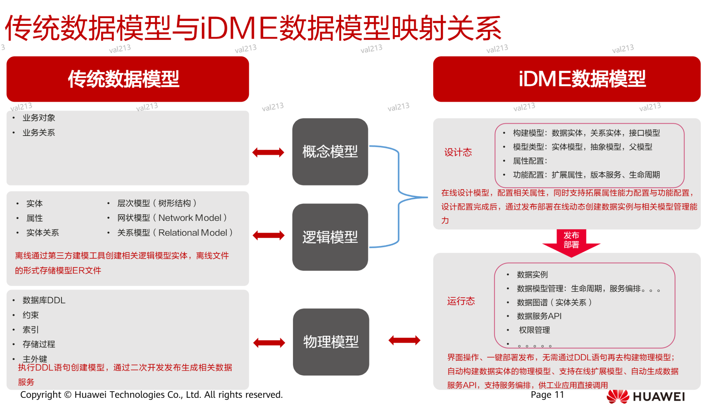

# HCCSA-iDME xMD-F 认证考试

## 工业软件产业及第一代工业软件体系
### 工业软件导论
工业软件的四梁八柱
- 研发设计类软件是四梁之一
- 四梁包括四大类核心的工业软件
研发设计软件是工业软件的皇冠
- 凝结了制造业壁垒最高的多学科知识和机理
CAD——Computer Aided Design 计算机辅助设计
- CAD 是利用计算机进行工程涉及的研发设计类工业软件
3D CAD：技术壁垒高，存在卡脖子风险
CAE：Computer Aided Engineering 计算机辅助工程（仿真）
- CAE 解决工业产品功能性能和机电热控等专业功能性能模拟仿真分析问题
CAE 仿真：认识世界的第三范式
- CAE 软件仿真方法是与理论方法、实验方法并列的人类认识世界的第三大方法
CAE 典型学科及工具软件：涉及学科广
EDA——Electronic Design Automation 电子设计自动化
- EDA 解决了超大规模集成电路(VLSI)芯片的功能设计、综合、验证、物理设计（包括布线、发布、版图、设计规则检查等）等设计问题，相当于电子设计领域CAD、CAE、CAM的综合
智能制造：生产数字孪生、资源（人、机、料）智能AI控制
智能制造：生产数字孪生 供应链智能控制（动态调度为例）

### 先进制造企业数字化转型趋势
- 看技术：工具和装备技术不断进步，有效支撑设备“高精尖”发展，大幅提高企业协同效率
- 看技术：工业软件商业模式从 license 转向 SaaS，一切皆服务。
    - 工业软件云作为后来者和挑战者，其商业模式必须全面发力SaaS，但不拒绝license
- 看产业：工业数字化转型已成为全球战略共识，主要工业国先后推出工业转型产业政策确保领先地位
- 看产业：高端制造业，利用数字化技术，推进工业4.0的企业3个一体化
- 看产业：以两化融合为主线，中国制造2025务实推进制造强国
- 看产业：工业软件产业发展，以工业软件为核心，推动工业数字化转型
    - 信息化、自动化是核心
- 华为通过“业务流程+数字化改革”，应对商业与技术挑战，实现快速成长
- 华为产品数字化目标：实现对象/过程/运行态3个数字化，打造数字化产品为全流程提供同源数据
    - 从面向结果/面向过程->面向业务对象
### 新一代工业软件架构体系
- 中国工业软件的危与机
    - 危：技不如人、人数不如人、投入不如人；根技术壁垒、数据壁垒、工业知识壁垒、生态壁垒
    - 机：新场景、新技术、新架构；有政策、有场景、有队伍、有人才
- 中国工业软件应用市场空间巨大
- 工业软件正处于计算框架变革、由“老九样”向“新九样”转变，行业正在向云化转型。处于“换道超车”历史机遇期
- 达成路径：面向新制造场景，重新定义工业软件体系架构/产业推进模式/内核共性技术
- 华为联合生态伙伴，以云计算技术为核心，共建新一代工业软件体系
- 推进模式：DISA联盟联合全国核心软件生态伙伴260家
- 重新定义工业软件内核共性技术：“数据+工具”的根技术服务，筑牢平台底座
- 工业软件云愿景：集众智聚众力，共建工业软件云，让天下没有难做的产品

## 工业数据管理理念与应用
### 工业数据管理基本概念
- 数据是指对客观事物进行记录并可鉴别的符号。对客观事物进行观察、度量，并按照某种标准将结果进行记录，这些记录就是数据，可以文本数字、图形、图像、声音、视频等格式呈现。
- 数据按照存储和管理方式划分：
    - 结构化：表、关系型数据库
    - 非结构化：文件、文件系统、非关系型数据库
- 数据与元数据
    - 元数据：描述数据的数据
    - 元数据用途：描述数据的属性信息
- 数据模型的定义：是对企业的数据元素及其彼此之间的关系的可视化表示。模型通过帮助在相关业务流程的上下文中定义和精心组织数据，可以为开发有效的信息系统提供支持。借助这些模型，业务和及技术资源可协同决定整个组织中数据的存储、访问、共享、更新和使用方式
- 数据模型的价值：全面优化的数据模型有助于创建简化的逻辑关系，消除冗余数据、减少存储、管理及运维成本并实现高效的检索。
- 数据管理：利用信息技术对数据进行有效的收集、存储、管理和应用
- 工业数据/工业数据管理
    - 工业数据：在工业领域所产生、发展、记录、存储、管理的数据。
### 企业产品数据管理的问题和挑战
- 数据管理痛点：非数字原生企业多年的信息化建设，既给企业带来了成长红利，又给企业带来了数据管理和消费的历史包袱
- 问题1：业务数据共享及转换效率低
- 问题2：业务数据获取周期长
- 问题3：交易侧数据互联互通难，分析侧数据整合、联接、获取难
挑战：数字化运营诉求强

### 工业数据管理发展历史
数据模型：PDM（面向结果）/PLM（面向过程）/Digital Thread（面向对象） 是企业数字化基础性技术

### 新一代工业数据管理的核心理念和应用实践
世界万物都可以抽象成极致简单的元模型
面向对象的数据管理核心理念
- 先完成对象建模，后将对象实例化，数据按照模型关系天生内聚在一起，从而实现数据的不治而顺

工业数据未来发展与应用：采用面向对象的数据管理理念，实现数据的不治而顺
新一代工业数据发展下的历史数据管理方法：基于面向对象的管理思想下的乱而后治
面向对象工业数据管理的应用实践：华为云工业数字模型驱动引擎 iDME
iDME：基于华为数据实践的工业基础大平台，筑牢工业软件根技术底座
iDME 组成：
- 数据建模引擎（xDM Foundation）：数据模型建立，功能可配置、服务可编排、设计即开发的数据管理功能
- 数字主线引擎（LinkX Foundation）：联接业务数据，快速构建主题图谱，按需进行数据治理，并提供数据分析服务
- 工业数据模型模板库（BoX）：提供华为经验积累模型模板库，以及联合工业联盟定义的业界标准和模型
## iDME 数据建模引擎概述
### 传统数据建模方法及与 iDME 数据建模引擎的映射关系

数据模型三要素：实体、属性、实体关系
数据建模三步法：概念模型、逻辑模型、物理模型
- 概念模型设计：业务梳理、数据梳理、归纳整理
    - 概念模型确定模型范围、主题域、数据源、主体域之间的关系、主题域内关键实体之间的关系
- 逻辑模型设计：定义业务需求和范围、定义实体、定义实体属性、定义实体关系
- 物理模型设计：定义数据库、定义表、定义字段、定义关系

### iDME 数据建模引擎关键优势
- 华为自身的数字化改革，亟需解决海量和异构数据的集成、共享和应用
- 华为产品数字化：面向业务对象构建统一的数据模型，形成易于管理的全量数据
关键优势1:元模型驱动能力，实现工业数据标准化建模和不治而顺
关键优势2:强大的工业数据建模能力，效率提升9倍+
关键优势3：28类工业数据模型模板库，开箱即用
关键优势4：预置80+工业数据管理能力，灵活高效配置
关键优势5：企业级流程引擎，自定义工作流和租户级扩展
关键优势6：云原生底座，支撑构建云化SaaS化工业软件
关键优势7：SDK打包带走，灵活定制、部署和运维
关键优势8：工业运维助手，一站式平台让运维更高效
关键优势9：灵活支持公有云、混合云和边缘云（工业云小站）等多种部署方式
关键优势10：全栈自主创新和开放兼容能力，构建产业链韧性
### 使用 iDME 数据建模引擎开发应用的旅程
