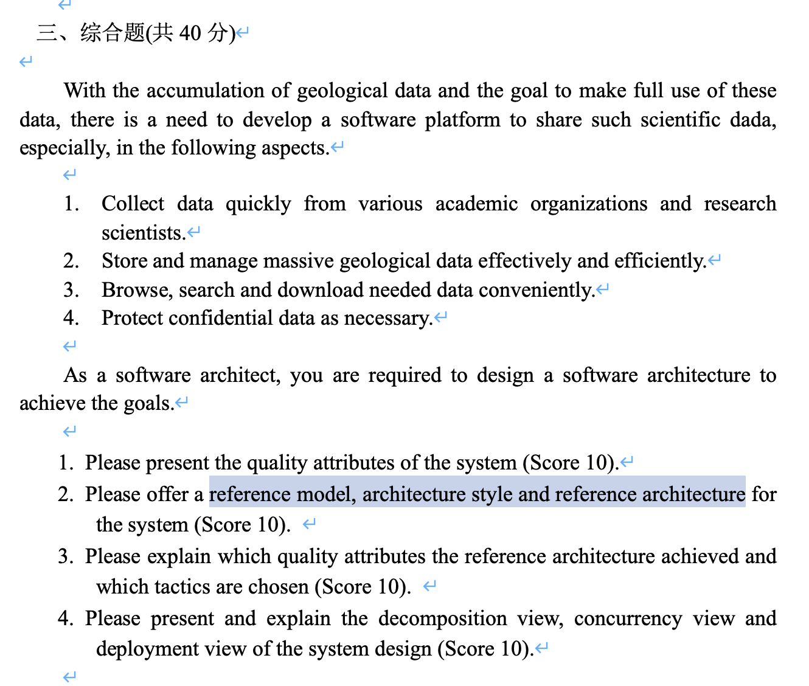

# 2024考试须知

# Part 1：Introduction
## chapter 1：What is Software Architecture?
知识点：
- 软件体系结构的基本概念
- 软件体系架构的重要性

### 🔥什么是软件体系结构？定义、概念
The software architecture of a system is the set of structures needed to 
reason about the system, which comprise software elements, relations 
among them, and properties of both. 一个系统的软件体系结构是推理系统所需的结构集合，包括软件元素、元素之间的关系以及它们的属性。

- 架构是结构的集合
    - 结构是由关系连接在一起的元素集合
    - 软件系统由许多结构组成，没有单一的结构可以称为架构。
- Architecture Is an Abstraction / 架构是一种抽象
- Every Software System Has a Software Architecture / 每个软件系统都有一个软件体系结构
- Architecture Includes Behavior / 架构包括行为
- Not All Architectures Are Good Architectures / 并非所有的架构都是好的架构

A structure is a set of elements and the relations among them. / 一个结构是一组元素及其之间的关系。
A view is a representation of a coherent set of architectural elements, as 
written by and read by system stakeholders. A view is a representation of one or 
more structures / 视图是一组体系结构元素的表示，由系统利益相关者编写和阅读。视图是一个或多个结构的表示。

架构有三个重要的结构类别：
- **Module**
- **Component and Connector**
- **Allocation**

### which structures are architectural?
- 如果一个结构有助于推理系统以及系统的属性，那么该结构就是架构性的。
- 该推理应关注系统的一个属性，该属性对某些利益相关者至关重要。
    - 系统实现的功能
    - 系统在面对故障时的可用性
    - 对系统进行更改的成本
    - 系统对用户请求的响应能力
    - 其他……
### 🔥🔥Module Structure，Allocation Structure，Component and Connector Structure 的定义、概念和类型
- 🔥seven categories of design decisions
    - 见 chapter 4 的 “seven categories of design decisions”
- 🔥its role in project risk reduction?(how to reduce risks?)
    - 见 open disscussion.
#### Module Structure
Module structures embody decisions as to how the system is to be structured as a set of code or data units that have to be constructed or procured.  **模块结构体现了系统如何作为一组代码或数据单元进行构造或采购的决策**。
In any module structure, the elements are modules of some kind (perhaps 
classes, or layers, or merely divisions of functionality, all of which are units of implementation). Modules represent a static way of considering the system. Modules are assigned areas of functional responsibility; there is less emphasis in these structures on how the resulting software manifests itself at runtime.  **在任何模块结构中，元素都是某种类型的模块（也许是类、层，或者仅仅是功能的划分，所有这些都是实现单元）。模块代表了一种静态的考虑系统的方式。模块被分配了功能责任区域；在这些结构中，对结果软件在运行时如何表现的强调较少**。
Module structures allow us to answer questions such as these: 
- What is the primary functional responsibility assigned to each module? / 每个模块被分配了什么主要的功能责任？
- What other software elements is a module allowed to use? / 模块允许使用哪些其他软件元素？
- What other software does it actually use and depend on? / 它实际使用和依赖于哪些其他软件？
- What modules are related to other modules by generalization or specialization (i.e., inheritance) relationships? / 通过一般化或特化（即继承）关系，哪些模块与其他模块相关联？

Module structures convey this information directly, but they can also be used by extension to ask questions about the impact on the system when the responsibilities assigned to each module change. In other words, examining a system’s module structures—that is, looking at its module views—is an excellent way to reason about a system’s modifiability. **模块结构直接传达这些信息，但是当分配给每个模块的职责发生变化时，它们也可以被扩展用来询问对系统的影响。换句话说，检查系统的模块结构（即查看其模块视图）是推断系统可修改性的极好方法。**

Structures partition systems into implementation units called modules.**每一个模块被分配不同的职责和相应的任务**。
- Decomposition 分解
- Uses structure 使用结构 
- Layer structure 层结构
- Class structure 类结构
- Data model 数据模型
##### Decomposition
- 这些单元是通过 is-a-submodule-of 关系连接在一起的。
- 展示了模块如何递归地被分解成更小的模块，直到模块足够小，易于理解。
- 模块通常会有一些产品（接口、规范、代码、测试计划等）与之关联。
- 分解结构在很大程度上决定了系统的可修改性，通过确保可能的变更被局限化来实现。
##### Uses Structure
- 这些单元也是模块，可能是类
- 通过 uses 关系相互关联
- 如果第一个单元的正确性依赖于第二个单元的正确运行，那么第一个单元就使用了第二个单元。
##### Layer Structure
层是一个抽象的“虚拟机”，通过受控接口提供一组有凝聚力的服务。
- 在严格的分层系统中，一个层只能调用比它更低的层，而不能调用比它更高的层。
- 这种结构赋予系统可移植性，能够更换底层的实现而不影响上层。
##### Class Structure
- inherited from 或者 is an instance of 关系
- 可以推理关于重用和功能的增量添加
##### Data Model
- 数据模型通过数据实体及其关系描述静态信息结构
- 例如，银行系统中实体包括账户、客户和贷款。
- 每个实体具体多个属性

#### C & C Structure
Component-and-connector (C&C) Structures：focus on the way the elements interact with each other at runtime to carry out the system’s functions. **关注元素在运行时如何相互交互以执行系统的功能**。

**一个component就是一个runtime entity**。

组件和连接器视图帮助我们回答以下问题：
- What are the major executing components and how do they interact at 
runtime? / 主要执行组件是什么，它们如何在运行时相互交互？
- What are the major shared data stores? / 主要的共享数据存储是什么？
- Which parts of the system are replicated? / 系统的哪些部分是复制的？
- How does data progress through the system? / 数据如何在系统中传递？
- What parts of the system can run in parallel? / 系统的哪些部分可以并行运行？
- Can the system’s structure change as it executes and, if so, how? / 系统的结构在执行时是否可以更改，如果可以，如何更改？

通过扩展，**组件和连接器视图对于询问有关系统运行时属性（如性能、安全性、可用性等）的问题至关重要**。
C & C Structure 具体包括：
- Service structure 服务
- Concurrency structure 并发
##### Service Structure
- 通过例如 SOAP 的服务协调机制相互操作的服务。
- 有助于构建由可能的匿名开发且互相独立 anonymously and independently of each other 的组件组成的系统。
##### Concurrency Structure
- 该结构有助于确定 parallelism and the locations where resource contention(争用) may occur（并行性和定位资源竞争发生的地方）。

#### Allocation Structure
describe the mapping from software structures to the system’s environments，有organizational、developmental、installation、Execution.
**描述了软件结构到系统环境的映射，有组织、开发、安装、执行等**。如：模块被分配给团队进行开发，并被分配到文件结构中用于实现、集成和测试的位置。而 Component 被部署到硬件上。

分配结构体现了系统将如何与其环境中的非软件结构（如cpu、文件系统、网络、开发团队等）相关联的决策。这些结构显示了软件元素和创建和执行软件的一个或多个外部环境中的元素之间的关系。分配视图帮助我们回答如下问题：
- What processor does each software element execute on? / 每个软件元素在哪个处理器上执行？
- In what directories or files is each element stored during development, 
testing, and system building? / 在开发、测试和系统构建期间，每个元素存储在哪些目录或文件中？
- What is the assignment of each software element to development teams?/ 每个软件元素分配给哪个开发团队？

Allocation Structure 具体包括：
- Deployment structure 部署
- Implementation structure 实现
- Work assignment structure 工作分配
##### Deployment Structure
- **how software is assigned to hardware processing and communication elements. 如何将软件分配给硬件处理和通信元素**
- 元素包括软件（C & C 中的实体）和硬件和他们之间的连接（通信通道）
- allocated-to 关系
- 用于推断 performance, data integrity, security, and availability.
- 在分布式和并行系统中，这个结构尤为重要
##### Implementation Structure
- **how software elements (usually modules) are mapped to the file structure(s) in the system’s development, integration, or configuration control environments**. / 用于描述**软件结构如何映射到系统的开发、集成或者配置控制环境中的文件结构**
##### Work Assignment Structure
- **assigns responsibility for implementing and integrating the modules to the teams who will carry it out**. / 用于描述**软件结构如何映射到团队的工作分配**

### Structures Provide Insight
Structures play such an important role in our perspective on software architecture because of the analytical and engineering power they hold. Each structure provides a perspective for reasoning about some of the relevant quality attributes.  **结构在我们对软件体系结构的视角中扮演着如此重要的角色，因为它们具有分析和工程能力。每个结构都提供了一种用于推理有关某些相关质量属性的视角。**
For example:
- The module “uses” structure, which embodies what modules use what other modules, is strongly tied to the ease with which a system can be extended or contracted. / 模块“使用”结构体现了**模块使用哪些其他模块，这与系统的扩展或收缩的容易程度密切相关**。
- The concurrency structure, which embodies parallelism within the system, is strongly tied to the ease with which a system can be made free of deadlock and performance bottlenecks. / **并发结构体现了系统内的并行性，与系统如何摆脱死锁和性能瓶颈的容易程度密切相关**。 
- The deployment structure is strongly tied to the achievement of 
performance, availability, and security goals.  / **部署结构与实现性能、可用性和安全目标密切相关**。

### Architecture Patterns

### Relationship between Pattern and Tactics
架构策略是一个设计决策，影响质量属性的响应。策略的重点是单一质量属性响应。一个策略并不考虑质量属性之间的权衡。

架构模式可以看作是“策略的组合”，会考虑质量属性之间的权衡。

### Achiving quality attributes through tactics
有一组原始设计技术，架构师可以用来实现质量属性的响应。我们将这些称为架构设计原语策略。

### what makes a good architecture?
不存在固有的好和坏的架构。体系架构或多或少适用于某些目的。架构可以被评估，但是只能在特定目标的上下文中进行评估。

然而也有一些 good rules of thumb：
- process
    - The architecture should be the product of a single architect or a small group of architects with an identified leader.  架构应该是一个单一架构师或者一个小团队的产品，并且有一个明确的领导者。
    - 架构师应该设计架构基于 a prioritized list of well-specified quality attribute requirements.  （**明确规定的质量属性需求的优先级列表**。）
    - documented using views
    - 架构应该被评估他的能力到传递这个系统的质量属性。
    - 架构应该适合增量实现
- structure
    - 体系架构应该以定义好的模块为特征，这些模块的功能职责是根据信息隐藏和关注点分离（**information hiding and separation of concerns**）的原则来分配的。
    - 应该使用众所周知的体系架构模式和特定于每个属性的策略来实现质量属性
    - 架构不应该依赖于商业产品或者工具的特定版本
    - 产生数据的模块应该与消费数据的模块分离
    - 不要期望模块和组件之间是一对一的对应关系。例如，在具有并发性的系统中，可能存在并行运行的组件的多个实例，其中每个组件都是从同一个模块构建的。对于具有多个并发线程的系统，每个线程可以使用来自多个组件的服务，每个组件都是由不同的模块构建的。
    - 应该让每个进程都可以轻松更改其对特定处理器的赋值，甚至可能在运行时更改。
    - 体系结构应该提供少量的组件交互方式。也就是说，整个系统应该以同样的方式做同样的事情。这将有助于可理解性，减少开发时间，提高可靠性，并增强可修改性。
    - 体系结构应该包含一组特定的（很小的）资源争用区域，这些争用区域的解析是明确指定和维护的。
## chapter 2：Why is Software Architecture Important?
13个理由：
1. An architecture will inhibit or enable a system’s driving quality attributes. 一个架构会抑制或者促进系统的驱动质量属性。
2. The decisions made in an architecture allow you to reason about and manage change as the system evolves. 架构中的决策使您能够推理和管理系统的演变。
3. The analysis of an architecture enables early prediction of a system’s 
qualities. 架构的分析使您能够早期预测系统的质量。
4. A documented architecture enhances communication among stakeholders. 文档化的架构增强了利益相关者之间的沟通。
5. The architecture is a carrier of the earliest and hence most fundamental, 
hardest-to-change design decisions. 架构是最早的、因此最基本的、最难以改变的设计决策的载体。
6. An architecture defines a set of constraints on subsequent implementation. 架构定义了对后续实现的一组约束。
7. The architecture dictates the structure of an organization, or vice versa. 架构决定了组织的结构，反之亦然。
8. An architecture can provide the basis for evolutionary prototyping. 架构可以为演进式原型提供基础。
9. An architecture is the key artifact that allows the architect and project manager to reason about cost and schedule. 架构是允许架构师和项目经理推理成本和进度的关键工件。
10. An architecture can be created as a transferable, reusable model that forms 
the heart of a product line. 架构可以作为可转移、可重用的模型创建，形成产品线的核心。
11. Architecture-based development focuses attention on the assembly of components, rather than simply on their creation. 基于架构的开发关注组件的组装，而不仅仅是它们的创建。
12. By restricting design alternatives, architecture channels the creativity of 
developers, reducing design and system complexity. 通过限制设计选择，架构引导开发人员的创造力，减少设计和系统复杂性。
13. An architecture can be the foundation for training a new team member. 架构可以成为培训新团队成员的基础。

# Part 2：Quality Attributes
## chapter 4：understanding Quality Attributes
### 描述质量属性场景的六要素
为了总结我们如何指定质量属性需求，我们将它们正式捕获为六部分场景。虽然忽略这六个部分中的一个或多个部分是很常见的，特别是在考虑质量属性的早期阶段，知道所有部分都在那里迫使架构师考虑每个部分是否相关。
In summary, here are the six parts:
1. **Source of stimulus**. This is some entity (a human, a computer system, or any other actuator) that generated the stimulus. 刺激源 。这是产生刺激的某个实体（人类、计算机系统或任何其他执行器）。
2. **Stimulus**. The stimulus is a condition that requires a response when it arrives at a system. 刺激。刺激是一种条件，当它到达系统时需要响应。
3. **Environment**. The stimulus occurs under certain conditions. The system may be in an overload condition or in normal operation, or some other relevant state. For many systems, “normal” operation can refer to one of a number of modes. For these kinds of systems, the environment should specify in which mode the system is executing. 环境。刺激发生在某些条件下。系统可能处于过载状态或正常运行状态，或者其他相关状态。对于许多系统，“正常”操作可能指的是多种模式之一。对于这类系统，环境应指定系统正在执行的模式。
4. **Artifact**. Some artifact is stimulated. This may be a collection of systems, the whole system, or some piece or pieces of it. 工件（产品）。某些工件被刺激。这可能是一组系统、整个系统或其中的一些部分。
5. **Response**. The response is the activity undertaken as the result of the arrival of the stimulus. 响应。响应是作为刺激到达的结果而进行的活动。
6. **Response measure**. When the response occurs, it should be measurable in some fashion so that the requirement can be tested. 响应测量。当响应发生时，它应该以某种方式可测量，以便可以测试需求。
### 🔥seven categories of design decisions
An architectural tactic is a design decision that affects a quality attribute response. 架构策略是影响质量属性响应的设计决策。

策略的重点是单一的质量属性响应。架构模式可以看作是策略的“包”。

架构设计决策的七个类别如下：
The seven categories of architectural **design decisions** are these:
1. Allocation of responsibilities / 职责分配
2. Coordination model / 协调模型
3. Data model / 数据模型
4. Management of resources / 资源管理
5. Mapping among architectural elements / 架构元素之间的映射
6. Binding time decisions / 绑定时间决策
7. Choice of technology / 技术选择
## chaptr 5：Availability

### what is availability?
- Availability refers to a property of software that it is there and ready to carry out its task when you need it to be.  可用性是软件的一种属性，指的是软件在需要时可以随时运行并完成其任务。
- Availability refers to the ability of a system to mask or repair faults such that the cumulative service outage period does not exceed a required value over a specified time interval.  可用性是指系统能够屏蔽或修复故障，使得在指定时间间隔内累计的服务中断时间不超过要求的值。
- Availability is about minimizing service outage time by mitigating faults.  可用性是通过缓解故障来最小化服务中断时间。
### Availability General Scenarios
Stimulus
- Omission. A component fails to respond to an input. / 遗漏。组件未能对输入做出响应。
- Crash. The component repeatedly suffers omission faults. / 崩溃。组件反复遭受遗漏故障。
- Timing. A component responds but the response is early or late. / 时序。组件响应，但响应早了或晚了。
- Response. A component responds with an incorrect value. / 响应。组件以不正确的值做出响应。

|Portion of Scenario| Possible value|
|---|---|
|Source of stimulus| 内/外部：人员、硬件、软件、物理基础设施、物理环境|
|Stimulus| 故障：遗漏、崩溃、时序错误、响应错误|
|Artifact| 处理器、信道、持久存储、进程|
|Environment| 正常运行、启动、关闭、修复模式、降级运行、过载运行|
|Response| 防止故障变成失败 检测故障 从故障中恢复|
|Response measure| 系统必须可用的时间或者时间间隔 可用性百分比 |

The heartbeat monitor detects that the server is nonresponsive during normal operations. The system informs the operator and continues to operate with no downtime. / 心跳监控器检测到服务器在正常运行期间无响应。系统通知操作员，并继续在没有停机的情况下运行。
### 🔥🔥Tactics for Availability

- Input: Fault / 输入：故障
- Output: Fault Masked or Repair Made / 输出：故障被掩盖或修复
#### Fault Detection
- Ping & Echo
    - 节点之间交换的异步请求/响应消息对，用于确定通过相关网络路径的可达性和往返延迟。
- Monitor / 监测
    - 监视器是一个组件，用于监视系统的其他各个部分的健康状态
- Heartbeat / 心跳
    - 在系统监视器和被监视的进程之间使用周期性消息交换。heartbeat 和 ping/echo 之间的最大区别在于谁负责启动运行状况检查——监视器还是组件本身。
- Timestamp / 时间戳
    - 在分布式消息传递系统中检测不正确的事件序列。
- Sanity Checking / 完整性检查
    - 检查组件的特定操作或输出的有效性或合理性。
- Condition Monitoring / 状态监控
    - 检查过程或设备中的条件，或验证设计期间所做的假设。
- Voting / 投票
    - 这种策略最常见的实现被称为三模冗余（triple modular redundancy， TMR），它使用三个做同样事情的组件，每个组件接收相同的输入，并将它们的输出转发给投票逻辑，用于检测三种输出状态之间的任何不一致。
- Exception Detection / 异常检测
    - 对改变正常执行流程的系统状况进行检测。
- Self-Test / 自检
    - 组件（或者更可能是整个子系统）可以运行 procedures 来测试自己的正确操作
#### recover from fault
故障恢复策略被细化为准备与修复策略和重新引入策略。后者关注的是将失效（但已修复）的组件重新引入正常操作。
##### Preparation-and-repair
- Active Redundancy（hot spare）/ 主动冗余（热备）
    - 这是一种配置，其中保护组中的所有节点（活动或冗余备用）并行地接收和处理相同的输入，从而允许冗余备用节点与活动节点保持同步状态。
- Passive Redundancy（warm spare）/ 被动冗余（温备）
    - 只有保护组的活动成员处理输入流量的配置；它们的职责之一是定期更新冗余备用设备的状态。
- Spare（cold spare） / 备用（冷备）
    - 冷备份是指在发生故障转移之前，保护组的冗余备份保持不工作状态，此时在冗余备份上启动上电复位过程，然后再将其投入使用。由于其较差的恢复性能，冷备份更适合于只有高可靠性（MTBF）需求的系统，而不是那些也有高可用性需求的系统。
- Exception Handling / 异常处理
    - 一旦检测到异常，系统必须以某种方式处理它。它能做的最简单的事情就是崩溃。
- Rollback / 回滚
    - 这种策略允许系统在检测到故障后恢复到以前已知的良好状态，称为“rollback line”—回滚时间。一旦达到良好状态，就可以继续执行。此策略通常与主动或被动冗余策略相结合，以便在发生回滚后，将故障组件的备用版本提升到活动状态。回滚依赖于对正在回滚的组件可用的先前良好状态的副本（检查点）。检查点可以存储在固定位置并定期更新，也可以在处理过程中方便或重要的时间更新，例如在完成复杂操作时更新。
- Software Upgrade / 软件升级
    - 其目标是以不影响服务的方式实现对可执行代码映像的服务内升级。
- Retry / 重试
    - 重试策略假定导致失败的故障是暂时的，重新尝试操作可能会成功。这种策略用于网络和服务器群中，在这些地方，故障是预料之中的，也是常见的。
- Ignore Faulty Behavior / 忽略故障行为
    - 这种策略要求当我们确定从特定来源发送的消息是虚假消息时，忽略这些消息。
- Degradation / 降级
    - 在组件失效的情况下保持最关键的系统功能，而放弃不太关键的功能。
- Reconfiguration / 重新配置
    - 将责任重新分配给仍在运行的（可能受到限制的）资源，同时保持尽可能多的功能。
##### Reintroduction 
- Shadow / 影子
    - 将组件恢复到活动角色之前，以“影子模式”在预定义的时间内操作先前失败或正在使用的升级组件。
- State Resynchronization / 状态重新同步
    - 状态重同步是主动冗余和被动冗余准备和修复策略的再引入伙伴。当与主动冗余策略一起使用时，状态重新同步是有机地发生的，因为活动和备用组件都并行地接收和处理相同的输入。在实践中，定期比较主备组件的状态以确保同步。
- Escalating Restart / 升级重启
    - 允许系统通过改变重启组件的粒度来从故障中恢复，并将受影响的服务级别降至最低。
- Non-Stop Forwarding / 不间断转发
    - 是一个起源于路由器设计的概念。在这个设计中，功能分为两个部分：监督或控制平面（管理连接和路由信息）和数据平面（执行从发送方到接收方路由数据包的实际工作）。
#### prevent fault
- Removal from Service / 从服务中移除
    - 暂时将系统组件置于服务外状态，以减轻潜在的系统故障。
- Transactions / 事务
    - 以高可用性服务为目标的系统利用事务语义来确保分布式组件之间交换的异步消息是原子的、一致的、隔离的和持久的。
- Predictive Model / 预测模型
    - 当与监视器结合使用时，使用预测模型来监视系统进程的健康状态，以确保系统在其标称操作参数范围内运行，并在检测到预测未来可能出现故障的条件时采取纠正措施。
- Exception Prevention / 异常预防
    - 这种策略指的是用于防止系统异常发生的技术。异常类的使用允许系统透明地从系统异常中恢复，这在前面已经讨论过了。异常预防的其他示例包括抽象数据类型，如智能指针，以及使用包装器来防止发生错误，如悬空指针和信号量访问违规。智能指针通过对指针进行边界检查来防止异常，并确保在没有数据引用它时自动释放资源。通过这种方式可以避免资源泄漏。
- Increase Competence Set / 增加能力集
    - 增加组件的能力集意味着设计它来处理更多的情况——故障——作为其正常操作的一部分。这种策略的一个例子是在设计网络协议时，将协议设计为在检测到错误时自动重新发送数据包。

## chapter 6：interoperability
### what is interoperability?
Interoperability is about the degree to which two or more systems can usefully exchange meaningful information via interfaces in a particular context. 互操作性是指两个或多个系统在特定上下文中通过接口有效地交换有意义的信息的程度。

Any discussion of a system's interoperability needs to identify with whom, and under what circumstances. 任何关于系统互操作性的讨论都需要明确与谁、以及在什么情况下进行。
### Types of Interoperability / 互操作性的类型
1. Syntactic interoperability / 语法互操作性
- Definition: The ability to exchange data.
定义：数据交换的能力。
2. Semantic interoperability / 语义互操作性
- Definition: The ability to interpret the data being exchanged.
定义：解释交换数据的能力。
### Two Perspectives for Achieving Interoperability / 实现互操作性的两种视角
1. With knowledge about the interfaces of external systems, design that knowledge into the system.
拥有外部系统接口的知识，将该知识设计到系统中。
2. Without knowledge about other systems, design the system to interoperate in a more general fashion.
没有其他系统的知识，设计系统以更通用的方式进行互操作。
### Interoperability General Scenarios
|Portion of Scenario| Possible value|
|---|---|
|Source of stimulus| 一个系统发起一个请求和另一个系统进行交互|
|Stimulus| 系统间交换信息的请求|
|Artifact| 希望进行互操作的系统。|
|Environment| 希望互操作的系统是在运行时发现的，或者是在运行时之前就知道的|
|Response| 互操作的请求导致信息的交换。接收方在语法和语义上都能理解信息。或者，拒绝请求并通知适当的实体。在任何一种情况下，请求都可能被记录。|
|Response measure| 正确处理的信息交换的百分比或正确拒绝的信息交换的百分比。|

### 🔥Tactics for Interoperability

#### Locate
- 🔥Discovery Service / 发现服务
    - 通过搜索已知的目录服务来定位服务。在这个定位过程中可能有多个间接层次——也就是说，一个已知的位置指向另一个可以搜索服务的位置。可以根据服务类型、名称、位置或其他属性来定位服务。
#### Manage Interface
- Orchestrate / 编排
    - 编排是一种策略，它使用控制机制来协调、管理和排序特定服务的调用（这些服务可能彼此不知道）。当互操作系统必须以复杂的方式进行交互以完成复杂的任务时，使用编排；编排将交互“脚本化”。工作流引擎是使用编排策略的一个例子。中介设计模式可以为简单的编排提供此功能。复杂的编排可以用BPEL等语言指定。
- Tailor interface / 定制接口
    - 定制接口是一种向接口添加或删除功能的策略。可以添加翻译、添加缓冲或平滑数据等功能。功能也可能被删除。删除功能的一个例子是向不受信任的用户隐藏特定功能。装饰器模式是定制界面策略的一个例子。
## chapter 7：Modifiability
### Modifiability General Scenarios
|Portion of Scenario| Possible value|
|---|---|
|Source of stimulus| 终端用户，开发者，系统管理员|
|Stimulus| 增删改功能、质量属性、容量、技术的指令|
|Artifact| 代码、数据、接口、组件、资源、配置等|
|Environment| 运行时、编译期，构建期，启动期，设计期|
|Response| 实施/测试/部署修改|
|Response measure| 受影响的工件/人力/时间/钱/功能/质量属性/新缺陷 以及各自的程度|

### Tactics for Modifiability
- **Size of a module 模块大小**. Tactics that split modules will reduce the cost of making a modification to the module that is being split as long as the split is chosen to reflect the type of change that is likely to be made. / 拆分模块的策略将减少对正在拆分的模块进行修改的成本，只要选择的拆分反映了可能进行的更改类型。
- **Coupling 耦合**. Reducing the strength of the coupling between two modules A and B will decrease the expected cost of any modification that affects A. Tactics that reduce coupling are those that place intermediaries of various 
sorts between modules A and B. / 减少两个模块 A 和 B 之间的耦合强度将减少影响 A 的任何修改的预期成本。减少耦合的策略是在模块 A 和 B 之间放置各种中介的策略。
- **Cohesion 内聚**. If module A has a low cohesion, then cohesion can be improved by removing responsibilities unaffected by anticipated changes / 如果模块 A 的内聚性较低，则可以通过删除不受预期更改影响的职责来提高内聚性。
- **Binding time of modification 修改的约束时间**. An architecture that is suitably equipped to accommodate modifications late in the life cycle will, on average, cost less than an architecture that forces the same modification to be made earlier. The preparedness of the system means that some costs will be zero, or very low, for late life-cycle modifications. This, however, neglects the cost of preparing the architecture for the late binding. / 适当准备好以容纳生命周期后期的修改的架构，平均成本将低于强制在较早时期进行相同修改的架构。系统的准备意味着对于生命周期后期的修改，一些成本将为零或非常低。然而，这忽略了为延迟绑定准备架构的成本。

- Input: Change Arrival / 输入：变更到达
- Output: Change Made within Time and Budget / 输出：在时间和预算内完成变更
#### Reduce Size of a Module
- Split Module / 拆分模块
    - If the module being modified includes a great deal of capability, the modification costs will likely be high. Refining the module into several smaller modules should reduce the average cost of future changes. / 如果要修改的模块包含大量功能，则修改成本可能很高。将模块细化为几个较小的模块应该会降低未来更改的平均成本。
#### Increase Cohesion
Several tactics involve moving responsibilities from one module to another. The purpose of moving a responsibility from one module to another is to reduce the likelihood of side effects affecting other responsibilities in the original module. / 几种策略涉及将职责从一个模块移动到另一个模块。将职责从一个模块移动到另一个模块的目的是减少副作用影响原始模块中的其他职责的可能性。
- **Increase semantic coherence 增加语义一致性**. If the responsibilities A and B in a module do not serve the same purpose, they should be placed in different modules. This may involve creating a new module or it may involve moving a responsibility to an existing module. One method for identifying responsibilities to be moved is to hypothesize likely changes that affect a module. If some responsibilities are not affected by these changes, then those responsibilities should probably be removed. / 如果模块中的职责 A 和 B 不服务于相同的目的，它们应该放在不同的模块中。这可能涉及创建一个新模块，也可能涉及将一个职责移动到现有模块中。识别要移动的职责的一种方法是假设可能影响模块的更改。如果某些职责不受这些更改的影响，那么这些职责可能应该被移除。
#### Reduce Coupling
- Encapsulate / 封装
- Use an intermediary / 使用中介
    - breaks a dependency. Given a dependency between responsibility A and responsibility B (for example, carrying out A first requires carrying out B), the dependency can be broken by using an intermediary. 
The type of intermediary depends on the type of dependency. For example, a publish-subscribe intermediary will remove the data producer’s knowledge of its consumers. So will a shared data repository, which separates readers of a piece of data from writers of that data. In a service-oriented architecture in which services discover each other by dynamic lookup, the directory service is an intermediary. / 使用中介打破依赖关系。给定职责 A 和职责 B 之间的依赖关系（例如，首先执行 A 需要执行 B），可以通过使用中介来打破依赖关系。中介的类型取决于依赖关系的类型。例如，发布-订阅中介将消除数据生产者对其消费者的了解。共享数据存储库也是如此，它将数据的读者与写入该数据的写入者分开。在服务导向的架构中，服务通过动态查找发现彼此，目录服务是中介。
- Restrict dependencies / 限制依赖
    - Restrict dependencies is a tactic that restricts the modules that a given module interacts with or depends on. In practice this tactic is achieved by restricting a module’s visibility (when developers cannot see an interface, they cannot employ it) and by authorization (restricting access to only authorized modules). This tactic is seen in layered architectures, in which a layer is only allowed to use lower layers (sometimes only the next lower layer) and in the use of wrappers, where external entities can only see (and hence depend on) the wrapper and not the internal functionality that it wraps. / 限制依赖是一种限制给定模块与之交互或依赖的模块的策略。在实践中，通过限制模块的可见性（当开发人员看不到接口时，他们无法使用它）和授权（仅限制对授权模块的访问）来实现这种策略。这种策略在分层架构中看到，其中一层只允许使用较低的层（有时只允许使用下一层）以及在使用包装器时，外部实体只能看到（因此依赖于）包装器而不是它包装的内部功能。
- Refactor / 重构
- Abstract common services. / 抽象公共服务
    -  In the case where two modules provide notquite-the-same but similar services, it may be cost-effective to implement the services just once in a more general (abstract) form. Any modification to the (common) service would then need to occur just in one place, reducing modification costs. / 在两个模块提供不完全相同但相似的服务的情况下，以更一般（抽象）的形式实现服务可能是经济的。对（公共）服务的任何修改都需要在一个地方进行，从而降低修改成本。
#### Defer Binding / 推迟绑定
Tactics to bind values at compile time or build time include these: / 在编译时或构建时绑定值的策略包括以下内容：
■ Component replacement (for example, in a build script or makefile)
■ Compile-time parameterization
■ Aspects
Tactics to bind values at deployment time include this: / 在部署时绑定值的策略包括以下内容：
■ Configuration-time binding
Tactics to bind values at startup or initialization time include this: / 在启动或初始化时绑定值的策略包括以下内容：
■ Resource files
Tactics to bind values at runtime include these: / 在运行时绑定值的策略包括以下内容：
■ Runtime registration
■ Dynamic lookup (e.g., for services)
■ Interpret parameters
■ Startup time binding
■ Name servers
■ Plug-ins
■ Publish-subscribe
■ Shared repositories
■ Polymorphism
## chapter 8：Performance
### Performance General Scenarios
|Portion of Scenario| Possible value|
|---|---|
|Source of stimulus| 系统内部或外部|
|Stimulus| 周期性、间歇性或随机事件的到来|
|Artifact| 系统或者系统中的一个或多个组组件|
|Environment| 正常、紧急、峰值负荷、超负荷|
|Response| 处理事件、更改服务水平|
|Response measure| 延迟、DDL、吞吐量、jitter（抖动）、miss率|

### 🔥🔥Tactics for Performance

- Input: Event arrival / 输入：事件到达
- Output: response generated within time constraint / 输出：在时间约束内生成响应

响应时间的两个基本因素：处理时间（当系统正在响应时）和阻塞时间（当系统无法响应时）。

#### control resource demand
- manage sampling rate / 管理采样率
    - 如果有可能降低捕获环境数据流的采样频率，那么需求就可以减少，通常伴随着一些保真度的损失。
- limit event response / 限制事件响应
    - 当离散事件到达系统（或元素）的速度太快而无法处理时，必须将事件排队，直到可以处理它们为止。
- prioritize events / 优先处理事件
    - 可以强加一个优先级方案，根据服务事件的重要程度对事件进行排序。
- reduce overhead / 减少开销
    - 减少中间体/分离关注点/将资源放在相同的运行时软件组件中，以避免子例程调用的开销/定期清理效率低下的资源/执行单线程服务器（为了简单和避免争用），并将工作负载分散到它们之间。
- bound execution time / 限制执行时间
    - 对用于响应事件的执行时间设置限制。对于迭代的、依赖于数据的算法，限制迭代次数是限定执行时间的一种方法。成本的计算通常不太准确。如果采用这种策略，则需要评估其对准确性的影响，看看结果是否“足够好”。这种资源管理策略经常与管理采样率策略配对
- increse resource efficiency / 提高资源效率
    - 改进关键区域使用的算法将减少延迟。
#### manage resource
- increase resource / 增加资源
    - 更快的处理器、额外的处理器、额外的内存和更快的网络都有可能减少延迟
- introduce concurrency / 引入并发
    - 如果请求可以并行处理，阻塞时间可以减少。通过在不同的线程上处理不同的事件流，或者通过创建额外的线程来处理不同的活动集，可以引入并发。
- maintain multiple copies of computation / 维护多个计算副本
    - C/S 模式中的多个服务器是计算的副本。使用副本的目的是减少在一台服务器上进行所有计算时可能出现的争用。
- maintain multiple copies of data / 维护多个数据副本
    - 缓存是一种策略，它将数据的副本（可能是另一个副本的子集）保存在具有不同访问速度的存储上。
- bound queue size / 限制队列大小
    - 控制了排队到达的最大数量，从而控制了用于处理到达的资源。如果采用此策略，则需要针对队列溢出时发生的情况采用策略，并决定不响应丢失的事件是否可以接受。这种策略经常与限制事件响应策略搭配使用。
- schedule resources / 资源调度
    - 每当资源存在争用时，必须调度资源。处理器被调度，缓冲区被调度，网络被调度。您的目标是了解每种资源的使用特征，并选择与之兼容的调度策略。
## chapter 9：Security 安全保障
### Security General Scenarios
|Portion of Scenario| Possible value|
|---|---|
|Source of stimulus| 确认/未确认身份的人或系统；内/外部的攻击者|
|Stimulus| 未经授权的服务访问、查改删数据、改变系统行为或者降低可用性的行为|
|Artifact| 系统服务、数据、组件、资源，系统生成/消费的数据|
|Environment| 系统在/离线、联/不联网、有/无防火墙、完全/部分/不可用|
|Response| 阻止行为、辨明身份、记录行为、通知相关实体（人或系统）|
|Response measure| 组件或数据泄露系统受到损害程度；检测攻击时间；抵御攻击次数；恢复时间；易受特定攻击的数据规模|

### 🔥tactics for Security

- Input: Attack / 输入：攻击
- Output: Attack prevented or detected / 输出：System detects, resists, reacts or recovers from attack
#### Detect Attack / 检测攻击
- **Detect Intrusion** / 检测入侵
    -  is the comparison of network traffic or service request patterns within a system to a set of signatures or known patterns of malicious behavior stored in a database. The signatures can be based on protocol, TCP flags, payload sizes, applications, source or destination address, or port number. / 检测入侵是将系统内的网络流量或服务请求模式**与存储在数据库中的恶意行为的一组签名或已知模式进行比较**。签名可以基于协议、TCP 标志、有效载荷大小、应用程序、源地址或目的地址、端口号。
- **Detect Service Denial** / 检测服务拒绝
    - Detect service denial is the comparison of the pattern or signature of network traffic coming into a system to historic profiles of known denial-ofservice attacks.  / 检测服务拒绝是将进入系统的网络流量的模式或签名**与已知拒绝服务攻击的历史概要进行比较**。
- **Verify Message Integrity** / 验证消息完整性
    - Verify message integrity. This tactic employs techniques such as  checksums or hash values to verify the integrity of messages, resource files, deployment files, and configuration files. A checksum is a validation mechanism wherein the system maintains redundant information for configuration files and messages, and uses this redundant information to verify the configuration file or message when it is used. A hash value is a unique string generated by a hashing function whose input could be configuration files or messages. Even a slight change in the original files or messages results in a significant change in the hash value. / 验证消息完整性采用诸如校验和或哈希值之类的技术来验证消息、资源文件、部署文件和配置文件的完整性。校验和是一种验证机制，其中系统为配置文件和消息维护冗余信息，并在使用配置文件或消息时使用此冗余信息来验证配置文件或消息。哈希值是由哈希函数生成的唯一字符串，其输入可以是配置文件或消息。即使原始文件或消息发生轻微更改，哈希值也会发生显着变化。
- **Detect Message Delay** / 检测消息延迟
    - Detect message delay is intended to detect potential man-in-the-middle attacks, where a malicious party is intercepting (and possibly modifying) messages. By checking the time that it takes to deliver a message, it is possible to detect suspicious timing behavior, where the time it takes to deliver a message is highly variable. / 检测消息延迟旨在检测潜在的中间人攻击，其中恶意方拦截（并可能修改）消息。通过检查传递消息所需的时间，可以检测到可疑的时间行为，其中传递消息所需的时间高度可变。
#### Resist Attack / 抵抗攻击
- **identify Actors** / 识别参与者
    - Identifying “actors” is really about identifying the source of any external input to the system. Users are typically identified through user IDs. Other systems may be “identified” through access codes, IP addresses, protocols, ports, and so on. / 识别参与者。识别“参与者”实际上是识别系统的任何外部输入的来源。用户通常通过用户 ID 进行识别。其他系统可以通过访问代码、IP 地址、协议、端口等进行“识别”。
- Authenticate Actors / 验证参与者
    - Authentication means ensuring that an actor (a user or a remote computer) is actually who or what it purports to be. Passwords, one-time passwords, digital certificates, and biometric identification provide a means for authentication / 验证参与者。身份验证意味着确保参与者（用户或远程计算机）实际上是其所声称的人或事物。密码、一次性密码、数字证书和生物识别识别提供了一种身份验证手段。
- Authorize Actors / 授权参与者
    - Authorization means ensuring that an authenticated actor has the rights to access and modify either data or services. This mechanism is usually enabled by providing some access control mechanisms within a system. Access control can be by an actor or by an actor class. Classes of actors can be defined by actor groups, by actor roles, or by lists of individuals / 授权参与者。授权意味着确保经过身份验证的参与者有权访问和修改数据或服务。这种机制通常通过在系统内提供一些访问控制机制来实现。访问控制可以由参与者或参与者类别进行。参与者类别可以由参与者组、参与者角色或个人列表定义。
- Limit Access / 限制访问
    - Limiting access to resources such as memory, network connections, or access points. / 限制对资源（如内存、网络连接或访问点）的访问。
- Limit Exposure / 限制暴露
    - Minimize the attack surface of a system by having the fewest possible number of access points. / 通过减少访问点的数量来最小化系统的攻击面。
    - Example / 示例:
    - Firewall is a single point of access to the intranet. / 防火墙是访问内网的唯一入口。
    - Closing a port. / 关闭端口。
- Encrypt Data / 加密数据
    - Apply some form of encryption to data and communication. / 对数据和通信应用某种形式的加密
- Separate Entities / 分离实体
    - Can be done through physical separation on different servers, or the use of virtual machines.
 / 可以通过在不同服务器上的物理分离，或使用虚拟机来实现。
- Change Default Settings / 更改默认设置
    - Force the user to change settings assigned by default. / 强制用户更改默认分配的设置。
#### React to Attack / 对攻击做出反应
- Revoke Access / 撤销访问权限
    - Limit access to sensitive resources, even for normally legitimate users and uses, if an attack is suspected. / 如果怀疑存在攻击，即使对于通常合法的用户和用途，也要限制对敏感资源的访问。
- Lock Computer / 锁定计算机
    - Limit access to a resource if there are repeated failed attempts to access it. / 如果反复尝试访问资源失败，则限制对资源的访问。
- Inform Actors / 通知参与者
    - Notify operators, other personnel, or cooperating systems when an attack is suspected or detected. / 当怀疑或检测到攻击时，通知操作员、其他人员或合作系统。
#### Recover from Attack / 从攻击中恢复
##### Maintain
- Audit Trail / 审计跟踪
    - In addition to the availability tactics that permit restoration of services, we need to maintain an audit trail. We audit—that is, keep a record of user and system actions and their effects—to help trace the actions of, and to identify, an attacker. We may analyze audit trails to attempt to prosecute attackers, or to create better defenses in the future / 除了允许恢复服务的可用性策略外，我们还需要维护审计跟踪。我们审计——即记录用户和系统操作及其影响——以帮助跟踪攻击者的行为并识别攻击者。我们可能会分析审计跟踪以尝试起诉攻击者，或者为未来创建更好的防御措施。
##### Restore 
- See Avaliability / 参见可用性
## chapter 10：Testability
### Testability General Scenarios
|Portion of Scenario| Possible value|
|---|---|
|Source of stimulus| 各种类型测试者和终端用户，手动或者自动化测试|
|Stimulus| 测试用例（各个层级的）的执行|
|Artifact| 被测试的部分系统|
|Environment| 设计/开发/编译/整合/部署/运行时|
|Response| 捕获测试结果、导致错误的活动、控制和监视系统状态|
|Response measure| 测试用例的覆盖率、检测到的错误数量、测试执行的时间等|

### Tactics for Testability

- Input: Test Executed / 输入：测试执行
- Output: Fault Detected / 输出：检测到故障
#### Control and Observe System State
- Specialized Interfaces / 专用接口
    - To **control or capture variable values** for a component through normal execution / 通过正常执行来控制或捕获组件的变量值
        - A set and get method of variables / 变量的设置和获取方法
        - A report method that returns state of the object / 返回对象状态的报告方法
        - A reset method to set the internal state / 设置内部状态的重置方法
- Record/Playback / 记录/回放
    - Capturing information crossing an interface and **using it as input for further testing**. / 捕获通过接口传递的信息，并将其用作进一步测试的输入。
- Localize State Storage / 本地化状态存储
    - To start a system in an arbitrary state for a test, it is most convenient if that state is stored in a single place. / 为了在测试中以任意状态启动系统，最方便的方法是将该状态存储在一个地方。
- Abstract Data Source / 抽象数据源
    - Abstracting the interfaces lets you substitute test data more easily. For example, if you have a database of customer transactions, you could design your architecture so that it is easy to point your test system at other test databases, or possibly even to files of test data instead, without having to change your functional code. / 抽象接口使您更容易替换测试数据。例如，如果您有一个客户交易数据库，您可以设计您的架构，使得很容易将测试系统指向其他测试数据库，甚至是测试数据文件，而无需更改功能代码。
- Sandbox / 沙箱
    - **Isolate the system from the real world to enable experimentation**. / 使系统与现实世界隔离，以便进行实验。
- Executable Assertions / 可执行断言
    - Assertions are hand coded and placed at desired locations to indicate when and where a program is in a faulty state. / 断言是手工编码的，并放置在所需的位置，以指示程序何时何地处于错误状态。
#### Limit Complexity
- Limit Structural Complexity / 限制结构复杂性
    - This tactic includes avoiding or resolving cyclic dependencies between components, isolating and encapsulating dependencies on the external environment, and reducing dependencies between components in general (for example, reduce the number of external accesses to a module’s public data).  / 此策略包括避免或解决组件之间的循环依赖，隔离和封装对外部环境的依赖，并通常减少组件之间的依赖（例如，减少对模块公共数据的外部访问次数）。
- Limit Nondeterminism / 限制非确定性
    - This tactic involves finding all the sources of nondeterminism, such as 
unconstrained parallelism, and weeding them out as much as possible. Some sources of nondeterminism are unavoidable—for instance, in multithreaded systems that respond to unpredictable events—but for such systems, other tactics (such as record/playback) are available. / 此策略涉及查找所有非确定性的来源，例如无约束的并行性，并尽可能消除它们。一些非确定性的来源是不可避免的——例如，对不可预测事件做出响应的多线程系统——但对于这种系统，还有其他策略（如记录/回放）可用。
## chapter 11：Usability 易用性
### Usability General Scenarios
|Portion of Scenario| Possible value|
|---|---|
|Source of stimulus| 终端用户|
|Stimulus| 用户尝试使用/学会/最小化错误冲击/适应/配置系统|
|Artifact| 系统中与用户交互的部分|
|Environment| 运行/配置时|
|Response| 提供用户所需的特性，预料用户需求|
|Response measure| 任务时间、错误数量、任务完成情况、用户满意度、操作成功率/失败损失等|

### tactics for Usability

#### Support User initiative / 支持用户主动性
- Cancel: the system must listen for the cancel request; the command being canceled must be terminated; resources used must be freed; and collaborating components must be informed. / 取消：系统必须监听取消请求；被取消的命令必须终止；使用的资源必须释放；并且必须通知协作组件。
- Pause/Resume: temporarily free resources so that they may be re-allocated to other tasks. Used for long-running operations. / 暂停/恢复：暂时释放资源，以便它们可以重新分配给其他任务。用于长时间运行的操作。
- Restore: maintain a sufficient amount of information about system state so that an earlier state may be restored. / 恢复：维护足够的系统状态信息，以便可以恢复到早期状态。
- Aggregate: ability to aggregate lower-level objects into a group, so that a user operation may be applied to the group, freeing the user from repetitive operations. / 聚合：能够将低级别的对象聚合成一个组，这样用户操作可以应用于该组，从而免除用户重复操作的麻烦。
#### support System Initiative / 支持系统主动性
• Maintain Task Model: determines context so the system can have some idea of what the user is attempting and provide assistance. / 维护任务模型：确定上下文，以便系统能够了解用户尝试进行的操作并提供帮助。
• Maintain System Model: system maintains an explicit model of itself. This is used to determine expected system behavior so that appropriate feedback can be given to the user. / 维护系统模型：系统维护一个关于自身的明确模型。这用于确定预期的系统行为，以便能够向用户提供适当的反馈。
## chapter 12：other Quality Attributes
- **functional suitability 功能适用性**
    This characteristic represents the degree to which a product or system provides functions that meet stated and implied needs when used under specified conditions. This characteristic is composed of the following sub-characteristics.
    这一特性表示产品或系统在特定条件下提供的功能满足明确和隐含需求的程度。该特性由以下子特性组成。
    - Functional completeness / 功能完整性
    Degree to which the set of functions covers all the specified tasks and intended users' objectives.
    功能集覆盖所有指定任务和预期用户目标的程度。
    - Functional correctness / 功能正确性
    Degree to which a product or system provides accurate results when used by intended users.
    产品或系统在预期用户使用时提供准确结果的程度。
    - Functional appropriateness / 功能适当性
    Degree to which the functions facilitate the accomplishment of specified tasks and objectives.
    功能在完成指定任务和目标中的促进程度。
- **performance efficiency 性能效率**
    This characteristic represents the degree to which a product performs its functions within specified time and throughput parameters and is efficient in the use of resources (such as CPU, memory, storage, network devices, energy, materials, etc.) under specified conditions. This characteristic is composed of the following sub-characteristics.
    这一特性表示产品在特定时间和吞吐量参数内执行其功能的效率，并在特定条件下有效利用资源（如 CPU、内存、存储、网络设备、能源、材料等）。该特性由以下子特性组成。
    - Time behavior / 时间行为
    Degree to which the response time and throughput rates of a product or system, when performing its functions, meet requirements.
    产品或系统在执行功能时，其响应时间和吞吐率满足需求的程度。
    - Resource utilization / 资源利用率
    Degree to which the amounts and types of resources used by a product or system, when performing its functions, meet requirements.
    产品或系统在执行功能时，所使用的资源量和资源类型满足需求的程度。
    - Capacity / 容量
    Degree to which the maximum limits of a product or system parameter meet requirements.
    产品或系统参数的最大限制满足需求的程度。
- **compatibility 兼容性**
    Degree to which a product, system, or component can exchange information with other products, systems, or components, and/or perform its required functions while sharing the same common environment and resources. This characteristic is composed of the following sub-characteristics.
产品、系统或组件在共享相同的公共环境和资源时，与其他产品、系统或组件交换信息或执行所需功能的程度。该特性由以下子特性组成。
    - Co-existence / 共存性
    Degree to which a product can perform its required functions efficiently while sharing a common environment and resources with other products, without detrimental impact on any other product.
    产品在共享公共环境和资源时，与其他产品共存并有效执行所需功能的程度，不对其他产品产生不利影响。
    - Interoperability / 互操作性
    Degree to which a system, product, or component can exchange information with other products and mutually use the information that has been exchanged.
    系统、产品或组件与其他产品交换信息并互相利用已交换信息的程度。
- **Interaction Capability / 交互能力**
Degree to which a product or system can be interacted with by specified users to exchange information via the user interface to complete specific tasks in a variety of contexts of use. This characteristic is composed of the following sub-characteristics.
产品或系统在特定的使用情境下，用户通过用户界面与其交互并完成特定任务的能力。该特性由以下子特性组成。
    - Appropriateness recognizability / 适当性识别度
    Degree to which users can recognize whether a product or system is appropriate for their needs.
    用户识别产品或系统是否适合其需求的程度。
    - Learnability / 可学习性
    Degree to which the functions of a product or system can be learned to be used by specified users within a specified amount of time.
    用户在指定时间内学习并使用产品或系统功能的难易程度。
    - Operability / 可操作性
    Degree to which a product or system has attributes that make it easy to operate and control.
    产品或系统具有易于操作和控制的属性的程度。
    - User error protection / 用户错误保护
    Degree to which a system prevents users from operating errors.
    系统防止用户操作错误的程度。
    - User engagement / 用户参与度
    Degree to which a user interface presents functions and information in an inviting and motivating manner, encouraging continued interaction.
    用户界面以吸引人且激励性的方式呈现功能和信息，鼓励用户持续交互的程度。
    - Inclusivity / 包容性
    Degree to which a product or system can be used by people of various backgrounds (such as people of various ages, abilities, cultures, ethnicities, languages, genders, economic situations, etc.).
    产品或系统能被不同背景（如年龄、能力、文化、民族、语言、性别、经济状况等）的人群使用的程度。
- reliability  可靠性
Degree to which a system, product, or component performs specified functions under specified conditions for a specified period of time. This characteristic is composed of the following sub-characteristics.
系统、产品或组件在特定条件下、在指定时间段内执行指定功能的能力。该特性由以下子特性组成。
    - Faultlessness / 无故障性
    Degree to which a system, product, or component performs specified functions without fault under normal operation.
    系统、产品或组件在正常操作下无故障地执行指定功能的程度。
    - Availability / 可用性
    Degree to which a system, product, or component is operational and accessible when required for use.
    系统、产品或组件在需要时可操作并可以访问的程度。
    - Fault tolerance / 故障容忍性
    Degree to which a system, product, or component operates as intended despite the presence of hardware or software faults.
    系统、产品或组件在硬件或软件故障存在的情况下仍能按预期工作 的程度。
    - Recoverability / 恢复性
    Degree to which, in the event of an interruption or a failure, a product or system can recover the data directly affected and re-establish the desired state of the system.
    在中断或故障发生时，产品或系统能够恢复直接受影响的数据，并重新建立系统的期望状态的程度。
- **safety 安全性**
This characteristic represents the degree to which a product, under defined conditions, avoids a state in which human life, health, property, or the environment is endangered. This characteristic is composed of the following sub-characteristics.
该特性代表产品在特定条件下，避免进入可能危及人类生命、健康、财产或环境的状态的能力。该特性由以下子特性组成。
    - Operational Constraint / 操作约束
    Degree to which a product or system constrains its operation to within safe parameters or states when encountering operational hazards.
    当遇到操作风险时，产品或系统将其操作约束在安全参数或状态范围内的程度。
    - Risk Identification / 风险识别
    Degree to which a product can identify a course of events or operations that can expose life, property, or the environment to unacceptable risk.
    产品能够识别可能将生命、财产或环境暴露于不可接受风险的事件或操作过程的能力。
    - Fail-Safe / 故障安全
    Degree to which a product can automatically place itself in a safe operating mode, or revert to a safe condition in the event of a failure.
    在发生故障时，产品能够自动将自身置于安全操作模式，或恢复到安全状态的能力。
    - Hazard Warning / 危险警告
    Degree to which a product or system provides warnings of unacceptable risks to operations or internal controls so that they can react in sufficient time to sustain safe operations.
    产品或系统能够及时提供关于操作或内部控制不可接受风险的警告，从而使其能够在足够的时间内做出反应，维持安全操作的能力。
    - Safe Integration / 安全集成
    Degree to which a product can maintain safety during and after integration with one or more components.
    在与一个或多个组件集成过程中及之后，产品能够维持安全的能力。
## chapter 13：Architectural Tactics and Patterns
### what is a Pattern?
An architecture pattern is a package of design decisions that is found repeatedly in practice。 一种架构模式是一组在实践中反复出现的设计决策。
它有已知属性 that permits reuse, and describes 一类 architectures。

模式是对环境条件的反应中自发出现的，只要条件发生变化，模式就会自动出现等待人发现。
软件架构师必须决定如何实例化模式，如何使其适合特定的上下文和问题的约束。

- context: 
    A context is A recurring, common situation in the world that gives rise to a problem / 一个在世界上反复出现的常见情况，导致了一个问题。
- problem: 
    The problem, appropriately generalized, that arises in the given context. The pattern description outlines the problem and its variants, and describes any complementary or opposing forces. The description of the problem often includes quality attributes that must be met. /
    在给定环境中产生的问题，适当地概括模式描述概述了问题及其变体，并描述了任何互补或相反的力量。
    问题的描述通常包括必须满足的质量属性。
- solution: 
    对问题的一个成功的架构解决方案，适当地抽象。解决方案描述了解决问题的体系结构，包括如何平衡工作中的多种力量。
    解决方案将描述元素的职责和元素之间的静态关系（使用模块结构），或者描述元素的运行时行为和元素之间的交互（布置组件和连接器或分配结构）。

部分重要的模式（参照复习 PPT）：
定义、基本概念、相关质量属性（例如，可用性和性能）、弱点（如何改进？）、优势和权衡。
### Module Patterns
- Layered pattern 分层模式
### Component and Connector Patterns
- Broker Pattern 经纪人模式
- Model-View-Controller Pattern 模型-视图-控制器模式
- pipe-and-filter Pattern 管道和过滤器模式
- Client-Server Pattern 客户端-服务器模式
- Peer to Peer Pattern 对等模式
- Service-Oriented Architecture Pattern 面向服务的架构模式
- Publish-Subscribe Pattern 发布-订阅模式
- Shared Data Pattern 共享数据模式
### Allocation Patterns
- Map-Reduce Pattern 映射-减少模式
- Multi-tier Pattern 多层模式
- other allocation patterns
#### 🔥🔥p2p
Peer-to-Peer Pattern
##### 定义
- each node can be publisher, subscriber, or broker. / 每个节点可以是发布者、订阅者或经纪人。
- subscribers subscribe to publishers directly, and publishers publish to subscribers directly. Therefore they must maintain knowledge of each other./ 订阅者直接订阅发布者，发布者直接发布给订阅者。因此，它们必须相互了解。
- complex in nature, mechanisms such as DHTs (Distributed Hash Tables) and CHORD are emloyed to locate nodes in the network. 在性质上复杂，机制如DHTs（分布式哈希表）和CHORD被用来定位网络中的节点。
- e.g. java distributed event service.
##### 描述
- Context: Distributed computational entities—each of which is considered equally important in terms of initiating an interaction and each of which provides its own resources—need to cooperate and collaborate to provide a service to a distributed community of users. /
上下文：分布式计算实体——每个实体在发起交互方面被认为是同等重要的，并且每个实体都提供自己的资源——需要合作和协作，为分布式用户群提供服务。
- Problem: How can a set of “equal” distributed computational entities be connected to each other via a common protocol so that they can organize and share their services with high availability and scalability? /
问题：如何通过一个共同的协议将一组“相等”的分布式计算实体连接在一起，以便它们可以组织和共享其具有高可用性和可扩展性的服务？
- Solution: In the peer-to-peer (P2P) pattern, components directly interact as peers. All peers are “equal” and no peer or group of peers can be critical for the health of the system. Peer-to-peer communication is typically a request/reply interaction **without the asymmetry** found in the client-server pattern. 
That is, any component can, in principle, interact with any other component by requesting its services. The interaction may be initiated by either party—that is, in client-server terms, each peer component is both a client and a server. 
Sometimes the interaction is just to forward data without the need for a reply. Each peer provides and consumes similar services and uses the same protocol. Connectors in peer-to-peer systems involve bidirectional interactions, reflecting the two-way communication that may exist between two or more peer-to-peer components. /
解决方案：在对等（P2P）模式中，组件直接作为对等体进行交互。所有对等体都是“相等的”，没有对等体或对等体组可以对系统的健康状况至关重要。对等体之间的通信通常是请求/回复交互，**没有客户端-服务器模式中的不对称性**。也就是说，任何组件原则上都可以通过请求其服务与任何其他组件交互。交互可以由任一方发起——也就是说，在客户端-服务器术语中，每个对等体组件既是客户端又是服务器。有时，交互只是为了转发数据，而不需要回复。每个对等体提供和消耗类似的服务，并使用相同的协议。对等体系统中的连接器涉及双向交互，反映了两个或多个对等体组件之间可能存在的双向通信。
##### weaknesses
- managing data consistency, data/service availability, backup, and recovery are all more complex. / 管理数据一致性、数据/服务可用性、备份和恢复都更加复杂。
- small p2p systems may not be able to achieve quality goals such as performance and availability. / 小型对等系统可能无法实现性能和可用性等质量目标。
#### 🔥pipe-and-filter pattern
Pipe-and-Filter Pattern
- Context: Many systems are required to transform streams of discrete data items, 
from input to output. Many types of transformations occur repeatedly in practice, 
and so it is desirable to create these as independent, reusable parts. /
上下文：许多系统需要将离散数据项流从输入转换为输出。许多类型的转换在实践中反复发生，因此将它们创建为独立的、可重用的部分是可取的。
- Problem: Such systems need to be divided into reusable, loosely coupled components with simple, generic interaction mechanisms. In this way they can be 
flexibly combined with each other. The components, being generic and loosely 
coupled, are easily reused. The components, being independent, can execute in 
parallel. /
问题：这样的系统需要被划分为具有简单、通用交互机制的可重用、松散耦合的组件。通过这种方式，它们可以灵活地相互结合。组件是通用的和松散耦合的，很容易重用。组件是独立的，可以并行执行。
- Solution: The pattern of interaction in the pipe-and-filter pattern is characterized 
by successive transformations of streams of data. Data arrives at a filter’s input 
port(s), is transformed, and then is passed via its output port(s) through a pipe to 
the next filter. A single filter can consume data from, or produce data to, one or 
more ports. /
解决方案：管道-过滤器模式中的交互模式以数据流的连续转换为特征。数据到达过滤器的输入端口，进行转换，然后通过其输出端口通过管道传递到下一个过滤器。单个过滤器可以使用来自一个或多个端口的数据，也可以为其生成数据。
#### 🔥Publish-Subscribe Pattern
Publish-Subscribe Pattern
- Context: There are a number of independent producers and consumers of data 
that must interact. The precise number and nature of the data producers and consumers are not predetermined or fixed, nor is the data that they share.  /
上下文：有许多独立的数据生产者和消费者必须进行交互。数据生产者和消费者的确切数量和性质没有预先确定或固定，它们共享的数据也不确定。
- Problem: How can we create integration mechanisms that support the ability to 
transmit messages among the producers and consumers in such a way that they 
are unaware of each other’s identity, or potentially even their existence?  /
问题：如何创建支持在生产者和消费者之间传递消息的集成机制，以便它们不知道彼此的身份，甚至可能不知道彼此的存在？
- Solution: In the publish-subscribe pattern, summarized in Table 13.8, components interact via announced messages, or events. Components may subscribe 
to a set of events. It is the job of the publish-subscribe runtime infrastructure to 
make sure that each published event is delivered to all subscribers of that event. 
Thus, the main form of connector in these patterns is an event bus. Publisher 
components place events on the bus by announcing them; the connector then delivers those events to the subscriber components that have registered an interest in 
those events. Any component may be both a publisher and a subscriber. /
解决方案：在发布-订阅模式中，组件通过公告消息或事件进行交互。组件可以订阅一组事件。发布-订阅运行时基础设施的工作是确保每个发布的事件都传递给该事件的所有订阅者。因此，这些模式中的主要连接器形式是事件总线。发布者组件通过宣布事件将事件放在总线上；然后连接器将这些事件传递给已注册对这些事件感兴趣的订阅者组件。任何组件都可以是发布者和订阅者。

##### Solution

- weaknesses
    - 发布-订阅在发送者和接收者之间增加了一层间接性。这对延迟和潜在的可伸缩性有负面影响，这取决于它的实现方式。人们通常不希望在必须满足硬实时截止日期的系统中使用发布-订阅，因为它会在消息传递时间中引入不确定性。
    - 此外，发布-订阅模式的缺点在于，它对消息的排序提供的控制较少，并且消息的传递不能得到保证（因为发送方无法知道接收方是否正在侦听）。这可能使发布-订阅模式不适用于共享状态至关重要的复杂交互。

让组件不知道彼此的身份，可以很容易地修改系统（添加或删除数据的生产者和消费者），但这是以牺牲运行时性能为代价的，因为发布-订阅基础设施是一种间接的，这会增加延迟。此外，如果发布-订阅连接器完全失败，这将是整个系统的单点故障。

- 基于列表的发布
    - 订阅是该模式的一种实现，其中每个发布者都维护一个订阅列表——一个已注册对接收事件感兴趣的订阅者列表。正如我们将在下面看到的那样，该模式的这个版本比其他版本解耦更少，因此它没有提供那么多的可修改性，但就运行时开销而言，它可以相当有效。此外，如果组件是分布式的，则不存在单点故障。

- 基于广播的发布
    - 订阅不同于基于列表的发布-订阅，发布者对订阅者的了解更少（或根本没有）。发布者只是发布事件，然后进行广播。订阅者（或在分布式系统中，代表订阅者的服务）在每个事件到达时进行检查，并确定发布的事件是否感兴趣。如果存在大量消息，并且特定订阅者对大多数消息不感兴趣，则此版本可能非常低效。

- 基于内容的发布
    - 订阅与前两种变体不同，前两种变体大致被归类为“基于主题”。主题是预定义的事件或消息，组件订阅主题中的所有事件。另一方面，内容则更为一般化。每个事件都与一组属性相关联，只有当这些属性与订阅者定义的模式匹配时才会传递给订阅者。

在实践中，发布-订阅模式通常由某种形式的面向消息的中间件实现，其中中间件作为代理实现，管理生产者和消费者之间的连接和信息通道。除了路由和有时存储消息外，此中间件通常还负责消息（或消息协议）的转换。因此，发布-订阅模式继承了代理模式的优点和缺点
#### 🔥Model-View-Controller Pattern
Model-View-Controller Pattern
- Context: User interface software is typically the most frequently modified portion 
of an interactive application. For this reason it is important to keep modifications to the user interface software separate from the rest of the system. Users often 
wish to look at data from different perspectives, such as a bar graph or a pie chart. 
These representations should both reflect the current state of the data. /
上下文：用户界面软件通常是交互式应用程序中最经常修改的部分。因此，将对用户界面软件的修改与系统的其余部分分开是很重要的。用户通常希望从不同的角度查看数据，例如条形图或饼图。这些表示应该都反映数据的当前状态。
- Problem: How can user interface functionality be kept separate from application 
functionality and yet still be responsive to user input, or to changes in the underlying application’s data? And how can multiple views of the user interface be created, maintained, and coordinated when the underlying application data changes? /
问题：如何将用户界面功能与应用程序功能分开，同时仍然对用户输入或基础应用程序数据的更改做出响应？当基础应用程序数据发生变化时，如何创建、维护和协调用户界面的多个视图？
- Solution: The model-view-controller (MVC) pattern separates application functionality into three kinds of components: 
    - A model, which contains the application’s data / 包含应用程序数据的模型
    - A view, which displays some portion of the underlying data and interacts 
with the user / 显示底层数据的某些部分并与用户交互的视图
    - A controller, which mediates between the model and the view and manages 
the notifications of state changes / 在模型和视图之间进行调解，并管理状态更改的通知

##### Solution

- weaknesses: 
    - 对于简单的用户界面来说，复杂性可能不值得。
    - 模型、视图和控制器抽象可能不太适合某些用户界面工具包。
### Allocation type patterns
- multi-tier pattern 多层模式
- competence center pattern 能力中心模式
- platform pattern 平台模式
- map-reduce pattern 映射-减少模式
#### 🔥🔥Map-Reduce Pattern
- Context: Businesses have a pressing **need to quickly analyze enormous volumes 
of data** they generate or access, at petabyte scale. Examples include logs of interactions in a social network site, massive document or data repositories, and pairs 
of `<source, target>` web links for a search engine. Programs for the analysis of 
this data should be easy to write, run efficiently, and be resilient with respect to 
hardware failure. /
上下文：企业迫切**需要快速分析它们生成或访问的大量数据**，达到PB级别。例如，社交网络站点中的交互日志、大量文档或数据存储库，以及搜索引擎的 `<source, target>` 网页链接对。用于分析这些数据的程序应易于编写、高效运行，并且对硬件故障具有弹性。
- Problem: For many applications with ultra-large data sets, sorting the data and 
then analyzing the grouped data is sufficient. The problem the map-reduce pattern solves is to efficiently perform a distributed and parallel sort of a large data 
set and provide a simple means for the programmer to specify the analysis to be 
done. /
问题：对于许多具有超大数据集的应用程序，对数据进行排序，然后分析分组数据就足够了。映射-减少模式解决的问题是高效地执行大数据集的分布式和并行排序，并为程序员提供简单的方法来指定要执行的分析。
- Solution: The map-reduce pattern requires three parts: First, a specialized infrastructure takes care of allocating software to the hardware nodes in a massively 
parallel computing environment and handles sorting the data as needed. A node 
may be a standalone processor or a core in a multi-core chip. Second and third are 
two programmer-coded functions called, predictably enough, map and reduce. /
解决方案：映射-减少模式需要三个部分：首先，专门的基础设施负责在大规模并行计算环境中将软件分配给硬件节点，并根据需要处理数据排序。节点可以是独立处理器或多核芯片中的一个核心。第二和第三部分是两个程序员编写的函数，可预见地称为映射和减少。

##### C & C view of map-reduce

##### weaknesses
当然，map-reduce模式并不适用于所有实例。一些反对采用这种模式的考虑是:
- If you do not have large data sets, then the overhead of map-reduce is not 
justified. / 如果您没有大数据集，那么 map-reduce 的开销是不合理的。
- If you cannot divide your data set into similar sized subsets, the advantages 
of parallelism are lost. / 如果您无法将数据集划分为大小相似的子集，那么并行性的优势就会丧失。
- If you have operations that require multiple reduces, this will be complex to 
orchestrate. / 如果您有需要多个减少的操作，那么这将是复杂的编排。

### 🔥Relationship between patterns and tactics
#### Patterns Comprise Tactics
正如13章的介绍中所说的，策略是设计的“构建块”，从中创建了架构模式。战术是原子，模式是分子。大多数模式由几个不同的策略组成（由这些策略构建），尽管这些策略可能都服务于一个共同的目的——例如提高可修改性——但它们经常被选择来提高不同的质量属性。例如，可以选择一种策略，使可用性模式更安全，或者减轻可修改性模式对性能的影响。

举了 layered pattern 的例子来说明。
#### Using Tactics to Augment Patterns
模式被描述为一般上下文中一类问题的解决方案。
当选择和应用模式时，其应用程序的上下文变得非常具体。因此，文档化的模式在特定情况下的应用是不明确的。

要使模式在给定的体系结构上下文中工作，我们需要从两个角度来检查它：
- 模式所做的内在质量属性权衡。模式的存在是为了达到一定的质量属性，我们需要将它们促进（和减少）的模式与我们的需求进行比较。
- 其他与模式没有直接关系的质量属性，但它仍然会影响，并且在我们的应用程序中很重要。

举了 broker pattern 的例子来说明。

### summary
An architectural pattern / 一种架构模式
- **is a package of design decisions that is found repeatedly in practice**, / 是在实践中反复出现的设计决策的包。
- has known properties that permit reuse, and / 具有允许重用的已知属性
- describes a class of architectures. / 描述了一类体系结构。
Because patterns are (by definition) found epeatedly in practice, one does not invent them; one discovers them. / 因为模式（根据定义）在实践中反复出现，所以人们不会发明它们；人们会发现它们。
**Tactics are simpler than patterns**. Tactics typically use just a single structure or computational mechanism, and they are meant to address a single architectural force. For this reason they give more precise control to an architect when making design decisions than patterns, which typically combine multiple design decisions into a package. Tactics are the “building blocks” of design from which architectural patterns are created. Tactics are atoms and patterns are molecules. / 策略比模式简单。策略通常只使用单个结构或计算机制，旨在解决单个体系结构力。因此，与模式将多个设计决策组合成一个包不同，策略为架构师在做设计决策时提供了更精确的控制。策略是设计的“构建块”，从中创建了架构模式。策略是原子，模式是分子。
An architectural pattern establishes a relationship between:
-  A context. A recurring, common situation in the world that gives rise to a problem. / 世界上反复出现的常见情况，引发了一个问题。
-  A problem. The problem, appropriately eneralized, that arises in the given context. / 在给定环境中产生的问题，适当地概括。
-  A solution. A successful architectural resolution to the problem, appropriately abstracted. / 对问题的一个成功的架构解决方案，适当地抽象。
Complex systems exhibit multiple patterns at once. 
Patterns can be categorized by the dominant type of elements that they show: / 模式可以通过它们显示的主要元素类型进行分类：
module patterns show modules, component-and-connector patterns show components and connectors, and allocation patterns show a combination of software elements (modules, components, connectors) and nonsoftware elements. / 模块模式显示模块，组件和连接器模式显示组件和连接器，分配模式显示软件元素（模块、组件、连接器）和非软件元素的组合。
Most published patterns are C&C patterns, but there are module patterns and allocation patterns as well. This chapter showed examples of each type. / 大多数已发布的模式都是 C&C 模式，但也有模块模式和分配模式。本章展示了每种类型的示例。
A pattern is described as a solution to a class of problems in a general context. When a pattern is chosen and applied, the context of its application becomes very specific. A documented pattern is therefore underspecified with respect to applying it in a specific situation. We can make a pattern more specific to our problem by augmenting it with tactics. Applying successive tactics is like moving through a game space, and is a little like chess: the consequences of the next move are important, and looking several moves ahead is helpful.
/ 模式被描述为一般上下文中一类问题的解决方案。当选择和应用模式时，其应用程序的上下文变得非常具体。因此，文档化的模式在应用于特定情况时是不充分的。我们可以通过策略来使模式更具体于我们的问题。应用连续的策略就像在游戏空间中移动一样，有点像国际象棋：下一步的后果很重要，向前看几步是有帮助的。
# Part 3：Architecture in the Life Cycle
🔥Definition, concepts, and steps (procedure) of ATAM, ASRs, ADD, and Utility Tree.
## 🔥🔥ATAM：Architecture Tradeoff Analysis Method 架构权衡分析方法
## Chapter 15：Architecture in Agile Projects
(KSLOC):  thousands of source lines of code 千行代码

These lines show that there is a sweet spot for each project. For the 10 KSLOC project, the sweet spot is at the far left. This says that devoting much, if any, time to up-front work is a waste for a small project (assuming that the inherent domain complexity is the same for all three sets of lines). For the 100 KSLOC project, the sweet spot is at around 20 percent of the project schedule. And for the 1,000 KSLOC project, the sweet spot is at around 40 percent of the project schedule. These results are fairly intuitive. A project with a million lines of code is enormously omplex, and it is difficult to imagine how Agile principles alone can cope with this complexity if there is no architecture to guide and organize the effort / 这些线表明每个项目都有一个甜点。对于 10 KSLOC 项目，甜点在最左边。这表明为小项目（假设所有三组线的固有领域复杂性相同）投入大量时间是浪费的。对于 100 KSLOC 项目，甜点在项目进度的约 20% 处。对于 1,000 KSLOC 项目，甜点在项目进度的约 40% 处。这些结果相当直观。拥有百万行代码的项目是非常复杂的，如果没有架构来指导和组织工作，很难想象敏捷原则单独如何应对这种复杂性。
## 🔥chapter 16: ASRs
**Architecture significant requirement**（ASR）是对体系结构有深远影响的需求——也就是说，如果没有这样的需求，体系结构可能会有很大的不同。
- Gathering ASRs from Requirements Doucmuments
### Gathering ASRs by interviewing stakeholders
- 涉众通常不知道他们在系统中想要什么样的qa，所以他们容易提出不准确的措施以及不合理的要求，而 Architects often have very good ideas about what QAs are reasonable to provide. 
- 采访相关的利益相关者是了解他们所知道和需要的最可靠的方法。项目也应该以系统清晰和可重复的方法收集这些信息。方法有很多，如 QAW(Quality Attribute Workshop)
- The results of stakeholder interviews should include
    - a list of architectural drivers 驱动因素
    - a set of QA scenarios that 涉众（通常一组）优先
这些消息可以用来：细化系统和软件需求、理解并澄清系统的架构驱动、提供基本的设计决策依据、指导原型和模拟的开发和影响架构开发的顺序。

附上：**Quality Attribute Workshop** 
- 定义：QAW **是一种便利的、以涉众为中心的方法，用于在软件架构完成之前生成、确定优先级并细化(refine)质量属性场景**。其关注的是系统级问题，特别是软件在系统中所扮演的角色。
- 步骤：
- Step 1: QAW Presentation and Introductions. 引导者讲述QAW动机，其他人自我介绍。
- Step 2: Business/Mission Presentation. 后文将被细化的质量需求很大来源于它，由业务代表方展示。
- Step 3: Architectural Plan Presentation. 架构师展示一个模糊的
- Step 4: Identification of Architectural Drivers. facilitators 给出在步骤二三中认为的驱动因素，让涉众进一步澄清更正
- Step 5: Scenario Brainstorming 确保每一个架构驱动程序都有一个代表性场景 
- Step 6: Scenario Consolidation 整合.  整合相似的
- Step 7: Scenario Prioritization. 给了30%的选票
- Step 8: Scenario Refinement. 细化 facilitators 帮助涉众将场景置于 QA 的六元素场景形式中。

### Gathering ASRs by understanding the Businesses goals
PALM 是一个由七个步骤组成的方法，名义上是在一个由架构师和涉众参加的研讨会上进行的，他们可以谈论所涉及组织的业务目标。步骤如下：
1. PALM overview presentation / PALM 概述演示
2. Business drivers presentation / 业务驱动程序演示
3. Architecture drivers presentation / 架构驱动程序演示
4. Business goals elicitation / 业务目标引导
5. Identification of potential quality attributesfrom business goals / 从业务目标中识别潜在的质量属性
6. Assignment of pedigree to existing qualityattribute drivers. / 为现有质量属性驱动程序分配谱系
7. Exercise conclusion / 运动的结论 回顾结果、后续步骤和参与者反馈。
### Capture ASRs in a utility tree
将 ASRs 记录在一个地方是很有帮助的，这样这个列表就可以被审查、引用、用来证明设计决策，并随着时间的推移或在主要系统更改的情况下被重新审视。

概括地说，ASR 必须具有以下特征：
- **A profound impact on the architecture**. 对架构的深刻影响。包含此需求很可能会导致与不包含该需求不同的体系结构。
- **A high business or mission value**. 具有很高的商业或使命价值。如果体系结构要满足这一需求——可能会以不满足其他需求为代价——它必须对重要的涉众具有高价值。
#### 🔥🔥Utility Tree
- 🔥定义：**A way to record ASRs （他们在这里通常表现为 scenarios）all in one place**. 
- 根据以下方面确定每个 ASR 的优先级：**对架构的影响**、**业务或使命价值** =>（X,X）
- 关于树：根节点是 “Utility” 这个词，树的第二层包含广泛的QA类别，第三层树细化了这些类别。（一些ASR可能会表达多个质量属性，因此会出现在书上很多地方，但别太多）
- 可以用 H （高，必需要实现） M （中，重要，省去也不会导致项目失败）L（低，好但不值得太多努力）来评估属性
- 注：没有任何ASR的QA不一定有问题但值得警惕。

## chapter 17：Designing an Architecture
### 🔥ADD（The Attrubute Driven Design / 属性驱动设计方法）
- The Attribute-Driven Design (ADD) method is a packaging of the strategies that we have just discussed. **ADD is an iterative method** that, at each iteration, helps the architect to do the following: ADD 是一种迭代方法，每一次迭代中：
    - **Choose a part 选择一部分** of the system to design / 选择系统的一部分进行设计
    - **Marshal 收集** all the architecturally significant requirements (**ASRs**) for that part / 收集该部分的所有架构相关需求
    - **Generate and test a design 生成、测试设计** for that part / 为该部分生成和测试设计

- "ADD does not result in a complete design." / 属性驱动设计（ADD）不会生成完整的设计。
- "Set of containers with responsibilities." / 一组具有责任的容器。
- "Interactions and information flow among containers." / 容器之间的交互和信息流。
- "Does not produce an API for containers." / 不生成容器的 API。

#### Inputs to ADD
- Before beginning a design process, the **requirements—functional, quality, and constraints**—should be known. / 在开始设计过程之前，应该了解需求——功能、质量和约束。
- In addition to the ASRs, input to ADD should include **a context description**. / 除了 ASRs，ADD 的输入还应包括上下文描述。
The context description gives you two vital pieces of information as a designer:
    - **"What are the boundaries of the system being designed?"** / 被设计系统的边界是什么？
    - **"What are the external systems, devices, users, and environment conditions with which the system being designed must interact?"** / 被设计系统必须与哪些外部系统、设备、用户和环境条件进行交互？
#### Outputs of ADD
ADD的输出是一组 sketches of architectural views。
- 这些视图将共同确定一组 Architectural elements and their relationship 体系结构元素及其关系或相互作用。生成的视图之一将是模块分解视图，在该视图中，每个元素将列出其职责的枚举 Responsibility of elements。

- 其他视图将根据沿途选择的设计方案产生。例如，如果在执行方法的某一点上，您为系统的一部分选择了面向服务的体系结构（SOA）模式，那么您将在SOA视图（其范围是您应用了该模式的系统的那一部分）中捕获该模式。

- 元素之间的 Interactions 交互是根据 information being passed between the elements 元素之间传递的信息来描述的。例如，我们可以指定协议名称、同步、异步、加密级别等等。

- 我们在上面提到“草图”的原因是 ADD 没有将设计进行到包含完整的接口规范，甚至没有选择接口程序（方法）的名称和参数类型。那可以以后再说。ADD识别通过接口的信息和信息的重要特征。如果接口的任何方面具有质量属性含义，则将其作为注释捕获。

- 当方法结束时，您将拥有一个 full-fledged architecture that is roughly documented as a set of views.  完整的体系结构，它大致记录为一组视图。然后，您可以对这个集合进行润色，也许可以适当地合并一些视图，以达到项目所需的程度。在敏捷项目中，这组粗略的草图可能是您在相当长一段时间内或在项目的整个生命周期内所需要的。

#### Steps of ADD
ADD is a five-step method:
1. Choose an element of the system to design. / 选择要设计的系统元素。
2. Identify the ASRs for the chosen element. / 识别所选元素的 ASRs。
3. Generate a design solution for the chosen element. / 为所选元素生成设计解决方案。
4. Inventory remaining requirements and select the input for the next iteration. / 列出剩余的需求并选择下一次迭代的输入。
5. Repeat steps 1–4 until all the ASRs have been satisfied. / 重复步骤1-4，直到满足所有ASRs。

##### Step 1: Choose an Element of the System to Design / 步骤 1：选择系统的一个元素进行设计
- "For green field designs, the element chosen is usually the whole system." / 对于全新设计（green field design），通常选择整个系统作为设计元素。
- "For legacy designs, the element is the portion to be added." / 对于遗留系统设计（legacy design），选择的元素是需要添加的部分。
Which Element Comes Next? / 下一个选择哪个元素？

- Two basic refinement strategies: / 两种基本的细化策略：
    - "Breadth first" / 广度优先
    - "Depth first" / 深度优先
- Which one to choose? / 选择哪一个？
    - If using new technology => depth first: explore the implications of using that technology. / 如果使用新技术 => 深度优先：探索使用该技术的影响。
    - If a team needs work => depth first: generate requirements for that team. / 如果团队需要工作 => 深度优先：为该团队生成需求。
    - Otherwise => breadth first. / 否则 => 广度优先。
##### Step 2: Identify the ASRs for the Chosen Element / 步骤 2：识别所选元素的 ASRs
- If the chosen element is the whole system, then use a utility tree (as described earlier). / 如果所选元素是整个系统，则使用效用树（如前所述）。
- If the chosen element is further down the decomposition tree, then generate a utility tree from the requirements for that element. / 如果所选元素位于分解树的更深层次，则从该元素的需求中生成效用树。
##### Step 3: ADD 核心 Generate a Design Solution for the Chosen Element / 步骤 3：为所选元素生成设计解决方案
- "Apply generate and test to the chosen element with its ASRs." / 对所选元素及其架构上重要需求（ASRs）应用生成与测试的方法。
- 对每一个ASR 都检查 checklists、Patterns、tactics 来设计（当然了这三个有可能一下子解决多个ASR）
- The design decisions made in this step now become constraints on all future steps of the method. / 此步骤中做出的设计决策现在将成为该方法未来所有步骤的约束。

##### Step 4: Inventory Remaining Requirements and Select the Input for the Next Iteration / 步骤 4：列出剩余的需求并选择下一次迭代的输入
step3 的设计方案不一定满足了所有 ASR，step4 是一个测试应用于1中选的元素
- "For each functional requirement: / 对每个功能性需求：
  - "Ensure that the requirement has been **satisfied**." / 确保该需求已被满足。
  - "If not, then **add responsibilities** to satisfy the requirement." / 如果未满足，则添加责任来满足该需求。
  - "**Add them to a container** with similar requirements." / 将其添加到具有相似需求的容器中。
  - "If no such container, may need to create a new one or add to a container with dissimilar responsibilities (coherence)." / 如果没有这样的容器，则可能需要创建一个新容器，或将其添加到具有不同责任的容器中（保持一致性）。
  - "If container has too many requirements for a team, **split** it into two portions. Try to achieve loose coupling when splitting." / 如果容器包含的需求对一个团队来说过多，则将其拆分为两个部分。拆分时尽量实现松耦合。

step4 的输出可能是 **backtrack**, meaning that an important requirement was not satisfied and cannot be satisfied by further elaborating this design. In this 
case, the design needs to be reconsidered. / 输出可能是回溯，意味着一个重要的需求没有得到满足，并且不能通过进一步详细设计来满足。在这种情况下，需要重新考虑设计。
The ASRs you have not yet satisfied could be related to the following: / 您尚未满足的 ASRs 可能与以下内容有关：
1. A quality attribute requirement allocated to the parent element / 分配给父元素的质量属性需求
2. A functional responsibility of the parent element / 父元素的功能责任
3. One or more constraints on the parent element / 父元素的一个或多个约束

Either the design in step 3 will satisfy all of the chosen element’s ASRs or it won’t. If it doesn’t, then either they can be allocated to elements that will 
be elaborated in future iterations of ADD, or the existing design is inadequate and we must backtrack. Furthermore, non-ASR requirements will 
either be satisfied, allocated to children, or indicated as not achievable. / 要么步骤 3 中的设计将满足所有所选元素的 ASRs，要么不会。如果不满足，则可以将它们分配给将在 ADD 的未来迭代中详细说明的元素，或者现有设计不足，我们必须回溯。此外，非 ASR 需求将被满足、分配给子元素，或指示为不可实现。
##### Step 5:  Repeat Steps 1–4 Until Done
Repeat steps 1–4 until all the ASRs have been satisfied, or until the architecture has been elaborated sufficiently for the implementers to use it. / 重复步骤 1-4，直到满足所有 ASRs，或者直到体系结构已经详细说明，以便实施者使用它。
## （不考）chapter 18: Documenting Software Architecture
有关各种质量视图的。
## chapter 21: Architecture Evaluation
### 🔥The Architecture Tradeoff Analysis Method (ATAM)
- 架构权衡分析方法（ATAM）已经使用了十多年，用于评估从汽车到金融再到国防等领域的软件架构。ATAM的设计使得评估人员不需要熟悉体系结构或其业务目标，系统还不需要构建好，并且可能有大量的涉众。
#### Participants in the ATAM：需要三组人
- The evaluation team：可能是一个常设单位，定期执行评估。三到五个人; 一个人可以在 ATAM 中扮演多个角色。
    - Team Leader / 团队领导
    - Evaluation Leader / 评估领导
    - Scenario Scribe / 场景记录员
    - Proceedings Scribe / 会议记录员
    - Questioner / 提问者
- Project decision makers：他们通常包括 PM（项目经理），客户。架构师（必须自愿参加）
- Architecture stakeholders：12-15个人，工作是阐明体系结构应该满足的特定质量属性目标，包括开发人员、测试人员、集成商、维护者、性能工程师、用户、构建者等等
#### Outputs of the ATAM
ATAM的产出用于构建最后的书面报告，该报告概述了方法，总结了过程，捕获了场景及其分析，并对结果进行了编目。基于 ATAM 的评估有无形的结果。这些包括涉众之间明显的社区意识，架构师和涉众之间开放的沟通渠道，以及对体系结构的所有参与者及其优缺点的更好的全面理解。虽然这些结果很难衡量，但它们的重要性不亚于其他结果，而且往往是持续时间最长的。

#### 🔥Phases of the ATAM

- Step 0:Partnership and preparation
- Step 1:Evaluation
- Step 2:Evaluation continued
- Step 3:Follow-up
#### Steps of the Evaluation Phases
1. **Present the ATAM** 展示ATAM
    - 评估负责人向与会的项目代表展示ATAM。解释每个人都要遵循的流程为后面的活动设定背景和期望。使用标准的演示，领导简要描述了ATAM的步骤和评估的输出。
2. **Present the Business** Drivers 展示业务驱动
    - 参与评估的每个人都需要了解系统的背景以及激励其开发的主要业务驱动因素。而项目决策者（PM或系统客户）从业务角度呈现系统概述。
   Presentation应有以下内容：系统最重要的功能、任何相关的技术、管理、经济或政治约束、与项目相关的业务目标和上下文、主要stakeholders、The architectural drivers (即ASR)
3. **Present the Architecture** 展示架构
    - 首席架构师(或架构团队)做一个在细节上描述架构的演示，这取决于有多少架构
        架构师负责技术约束，以及系统必须与之交互的其他系统。
        架构师描述用于满足需求的架构方法。
        The architect should present the views that help to reason about the most important quality attribute concerns of the system. 
4. **Identify Architectural Approaches**  确定架构方法
    - ATAM侧重于通过理解体系结构方法(尤其是模式和策略)来分析体系结构。
评估小组对已确定的模式和策略进行编目。
该列表将被公开获取，并将作为以后分析的基础。 
5. **Generate Quality Attribute Utility Tree**  生成质量属性效用树
    - 所考虑的体系结构的重要质量属性目标在步骤2中被命名。
在这个步骤中，评估团队与项目决策者一起工作，以确定、确定优先级，并细化系统最重要的质量属性目标。这些都表示为场景，它们填充实用工具树的叶子。
这些场景被分配了重要性等级(高、中、低)。
6. 🔥Analyze Architectural Approaches
    - 评估小组一次一个地审查排名最高的情景;架构师被要求解释体系结构如何支持每一个，评估团队成员（提问者）探索架构师用于实现场景的体系结构方法。在这个过程中，评估团队记录相关的体系结构决策，并**识别和编录它们的风险、非风险、敏感点和权衡点**，问架构师如何克服弱点获得保证。例如：
    - 心跳的频率影响系统检测故障组件的时间。有些任务将导致该响应的不可接受值-这些都是 **risks**。
    - 并发数据库客户端的数量将影响数据库每秒可以处理的事务数量。因此，客户机到服务器的分配是响应的一个 **sensitivity point**，以每秒事务数来衡量。
    - 心跳的频率决定了检测故障的时间。更高的频率可以提高可用性，但也会消耗更多的处理时间和通信带宽（可能导致性能下降）。这是一种 **tradeoff**。
  这个阶段结束后评估团队应该对整个架构的最重要方面（原理风险、非风险、敏感点和权衡点），有了清晰了解。
    这一分析并不全面。关键是要获得足够的体系结构信息，以便在已经做出的体系结构决策和需要满足的质量属性需求之间建立某种联系。
- Hiatus and Start of Phase 2. 休息和第二阶段的开始
评估小组总结他们所学到的知识，并在一到两周的间隙中与架构师进行非正式的互动（通常是通过电话）。如果需要，在此期间可以分析更多的场景，或者可以解决澄清问题
7. Brainstorm and Prioritize Scenarios
    - 涉众头脑风暴对于涉众的个人角色而言具有操作意义的场景进行讨论。
目的：to understand what system success means for stakeholders 把握涉众脉搏 
 一旦场景被收集，就会通过投票来确定它们的优先级。（每人有场景数30%的票）
    将优先级场景列表与来自效用树练习的列表进行比较。
    - 如果他们同意，这表明架构师的想法和涉众的实际需求之间有很好的一致性。
    - 如果发现额外的驾驶场景，这本身可能是一种风险。涉众和架构师之间的一些分歧。
8. Analyze Architectural Approaches
    - 在此步骤中，评估团队使用最高级（根据第七步）的新生成的场景，执行与步骤6中相同的活动。
    评估团队在执行最高级新场景的过程中指导架构师。
    架构师解释相关的架构决策如何有助于实现每个架构决策。
    如果时间允许，此步骤可能涵盖前5-10个场景。
9. Present Results
1、	基于一些共同的潜在关注或系统缺陷，评估小组私下将风险分组为风险主题。对于每个风险主题，评估团队确定步骤2中列出的哪些业务驱动因素受到影响。这样做将最终结果和最初呈现结合起来形成循环，也能引出管理层注意。
2、	另一方面从评估中收集的信息被总结并呈现给利益相关者。这采取口头演示和幻灯片
3、	负责人将ATAM的步骤和方法中信息概括起来，包括业务环境、驱动因素、约束、架构，然后有输出如下:
- The architectural approaches documented文档化的架构方法
- 从头脑风暴中得出的一组场景及其优先级
- 效用树
- 发现的风险
- The nonrisks documented 无风险文件
- 找到的敏感点和权衡点
- Risk themes and the business drivers threatened by each one 风险主题和每个主题所威胁的业务驱动因素

### Lightweight Architecture Evaluation
Because the participants are all internal to the organization and fewer in 
number than for the ATAM, giving everyone their say and achieving a shared 
understanding takes much less time. Hence the steps and phases of a Lightweight Architecture Evaluation can be carried out more quickly. / 因为参与者都是组织内部的，人数比ATAM少，所以让每个人都发言并达成共识需要的时间要少得多。因此，轻量级架构评估的步骤和阶段可以更快地完成。

# 真题一览
## 选择题

选B，没有 reviewer
>### 3.5 Stakeholders
>Many people and organizations are interested in a software system. We call these 
entities stakeholders. A stakeholder is anyone who has a stake in the success of 
the system: [**the customer, the end users, the developers, the project manager, the maintainers, and even those who market the system, for example**.]
>### 21.2
>... Stakeholders include [**developers, testers, integrators, maintainers, performance engineers, users, builders of systems interacting with the one under consideration, and others listed in Chapter 3**.]

B module structure 是静态结构，因为它们关注系统功能划分和分配给实现团队的方式

D

D

- Which one of the following tactics is for improving availability?
  a. Resource management and scheduling
  b. Increase module cohesion
  c. Passive redundancy √
  d. Discover services

- Modifiablility is about the change and our interest in it is the cost and risk of making the change. Which of the following statements is NOT true about modifiablility?
  a. Using an intermediary can help improve modifiability
  b. The change can be made during the implementation or execution
  c. Making modules bigger can help increase modifiablility √
  d. Publish/Subscribe tactic is used for improving modifiablility

- About Agile architecture, which of the following statements is NOT true?
  a. Large-scale successful projects need a blend of agile and architecture
  b. For small projects with uncertain requirements, spending too much time on architecture design is not a good choice
  c. For large projects with unstable requirements, it is not needed to design architecture at the early phase of project. √
  d. For a large and complex system with stable requirements, it is good to devote much time on the architecture.

lln 发的题目：
1. Which of the following should be included in the consideration of a Allocation Structure? C
A. What are the major executing components and how do they interact at runtime ×
B. what part of the system can run in parallel ×
C. How software is assigned to hardware processing and communication elements. √
D. How does data process through the system ×

2. Which one of the following structures pertains to the C&C Structure? A
A. Service structure
B. Class structure
C. Deployment structure
D. Decomposition structure

3. Which one of the following tactics is for improving the modifiability? C
A. Removal from Service
B. Detect service attack
C. Increase Semantic Coherence
D. Active redundancy 

4. “A User asks for help, and the system provides help for that context” is a scenario of ( ). B
A. Security
B. Usability
C. Performance
D. Availability

5. Which of the following description about pattern and tactic is not true? B
A. Patterns have to be augmented with tactics for the design of real systems
B. If a tactic has side effect, it should not be added into the design of a system
C. Tactics are simpler than patterns 
D. Patterns are built from tactics

6. Boehm and Turner found that projects have a “sweet spot” where up-front architecture planning pays off. For the (   )，the sweet spot is around 40% of the project schedule. / boehm和turner发现，项目有一个“甜蜜点”，在这个点上，前期架构规划是值得的。对于（ ），这个甜蜜点大约是项目进度的40%。D
A. 10KSLOC project
B. 100KSLOC project
C. 1000KSLOC project
D. extremely large projects with very stable requirements

7. The (  ) is focused on system-level concerns and specifically the role that software will play in the system and it is keenly dependent on the participation of system stakeholders. B
A. Utility Tree
B. Quality Attribute Workshop 
C. Attribute Driven Design
D. Architecture Trade-off Analysis Method

8. The testability tactics of“ (   )” refers to isolating an instance of the system from the real world to enable experimentation that is unconstrained by the worry about having to undo the consequences of the experiment.  A
A. Sandbox 
B. Executable Assertions
C. Abstract Data Sources
D. Localize State Storage
  

9. Availability tactics are designed to enable a system to endure system faults so that a service being delivered by the system remains complaint with its specification. A fault happens when the following stimuli occur EXCEPT FOR (  ) D
A. Omission: A component fails to respond to an input
B. Crash:The component repeatedly suffers omission faults
C. Timing: A component responds but the response is early or late.
D. Event arrivals: The stimuli arrive either from external or internal sources.

10. Which of the following statements is NOT TRUE about the CAP theorem? A
A. According to CAP theorem, it is possible to achieve Consistency, Availability and Partition simultaneously (同时地). 
B. The CAP theorem is about the three important properties, which are Consistency, Availability and Partition, of a distributed system managing shared data. 
C. According to CAP theorem, one of the the three important properties, Consistency, Availability and Partition, should be sacrificed.  
D. For many applications, it is a choice to sacrifice consistency and provide immediate availability and eventually consistency. 
## 简答题
12. 阅读材料，结合质量属性场景的知识点回答问题
（1）请你为自动取款机（Automatic Teller Machine）写一组具体的安全性场景？
（2）你会如何修改这个机器的软件设计去满足题（1）提及的场景？
### (1) **安全性场景**

#### 场景 1：**保护ATM的物理安全防范未经授权的访问**
- **Stimulus Source**：攻击者
- **Stimulus**：攻击者尝试绕过ATM机的物理安全措施，如暴力撬开机器或利用硬件漏洞获得对内部存储和通信的访问。
- **Artifact**：ATM机硬件（特别是与卡片读取器、密码键盘及处理模块相关的组件）
- **Environment**：ATM机被放置在公共场所，且没有被监控或容易接触到。
- **Response**：ATM系统启用防篡改保护机制，记录异常的物理访问行为，触发警报并锁定相关功能，暂停交易或要求管理员干预。
- **Response Measure**：检测到未经授权的物理干预时，警报系统发出警告，并且系统自动记录事件日志，包括时间戳、设备状态和潜在的攻击来源。

#### 场景 2：**网络攻击——密码猜测攻击**
- **Stimulus Source**：外部攻击者
- **Stimulus**：攻击者尝试通过暴力破解的方式猜测ATM系统的管理员密码。
- **Artifact**：ATM的网络接口、管理员账户
- **Environment**：ATM通过网络与银行的后台系统连接，暴露于互联网上。
- **Response**：ATM在多次密码输入失败后锁定管理员账户，并要求额外的身份验证步骤（例如，安全问题或二次认证）。
- **Response Measure**：每次错误登录尝试后，系统将该用户的失败尝试次数记录在审计日志中，且对每次失败尝试增加登录延迟，以减缓暴力破解速度。

---

### (2) **修改软件设计以满足安全性场景**

#### 1. **增加物理安全防护与响应**
- **Resist Attack / 抵抗攻击**：
  - **Limit Access**：确保ATM机内部存储卡和敏感硬件组件通过物理加固措施（如防撬外壳）来限制非授权访问。
  - **Separate Entities**：将敏感数据存储与处理模块分开，使用物理隔离的服务器和加密模块，确保即便机器被物理攻破，数据也不会轻易泄露。
  - **Change Default Settings**：默认的设备管理账户和密码应强制修改，避免使用出厂设置。

- **React to Attack / 对攻击做出反应**：
  - **Lock Computer**：设置异常物理访问检测机制，如门禁感应、传感器等，遇到不寻常的物理干扰时系统自动锁定，防止继续操作。
  - **Inform Actors**：当检测到物理入侵时，系统应通知后台管理员，并启动进一步的安全验证步骤。

#### 2. **加强网络安全防护与响应**
- **Detect Attack / 检测攻击**：
  - **Detect Intrusion**：通过监控ATM机与银行系统之间的网络流量，检测是否有暴力破解攻击的迹象，如登录失败的次数过多，或者登录尝试的时间间隔过短。
  - **Detect Service Denial**：如果检测到异常流量或DDoS攻击，立即采取措施，如限制外部IP的请求频率。

- **Resist Attack / 抵抗攻击**：
  - **Authenticate Actors**：加强管理员账户的身份验证机制，采用多因素认证，避免单一密码系统的弱点被利用。
  - **Encrypt Data**：通过强加密方式（如TLS加密）保护ATM与银行系统之间的通信，防止数据泄露和中间人攻击。

- **Recover from Attack / 从攻击中恢复**：
  - **Audit Trail / 审计跟踪**：维护一套详细的审计日志记录所有操作和异常事件，帮助追踪攻击者的行为并为后续的修复和调查提供依据。
  - **Restore**：系统应具备恢复功能，能够在受到攻击后迅速恢复至正常工作状态，避免业务中断。

通过这些设计和安全机制，可以增强ATM在面对物理和网络攻击时的安全性，同时确保在发生攻击时能够迅速响应并恢复。

13. 阅读材料，解决现实生活（非软件开发）问题
寻找一个现实生活（并不是软件开发）的例子，这个例子需要应用每一个管理资源的策略。举个例子，假如你正在管理一个大型超市，请问，你如何使用这些策略使得消费者能更快地通过结账？

## 综合题
模板题，仅供参考：

三、综合题(共40分)
With the accumulation of geological data and the goal to make full use of these
data, there is a need to develop a software platform to share such scientific dada,
especially, in the following aspects. / 随着地质数据的积累和充分利用这些数据的目标，有必要开发一个软件平台来共享这些科学数据，特别是在以下方面。
1. Collect data quickly from various academic organizations and research
scientists. / 从各种学术组织和研究科学家迅速收集数据。
2. Store and manage massive geological data effectively and efficiently. / 有效管理大量地质数据。
3. Browse, search and download needed data conveniently. / 方便地浏览、搜索和下载所需数据。
4. Protect confidential data as necessary. / 根据需要保护机密数据。

As a software architect, you are required to design a software architecture to
achieve the goals. / 作为软件架构师，您需要设计一个软件架构来实现这些目标。
1.  Please present the quality attributes of the system (Score 10) / 请介绍系统的质量属性（得分10）。
2. Please offer a reference model, architecture style and reference architecture forthe system (Score 10). / 请为系统提供参考模型、架构风格和参考架构（得分10）。
3. Please explain which quality attributes the reference architecture achieved andwhich tactics are chosen(Score 10). / 请解释参考架构实现了哪些质量属性以及选择了哪些策略（得分10）。
4. Please present and explain the decomposition view, concurrency view anddeployment view of the system design (Score 10). / 请介绍和解释系统设计的分解视图、并发视图和部署视图（得分10）。

The convergence and integration of information technology and economic society has led to the rapid growth of data. Data has become the basic strategic resources of the country. Big data is increasingly exerting an important influence onglobal production, circulation, distribution, consumption activities, economic operation mechanism, social life style and national governance capacity. / 信息技术与经济社会的融合与整合，导致数据的快速增长。数据已成为国家的基本战略资源。大数据对全球生产、流通、分配、消费活动、经济运行机制、社会生活方式和国家治理能力产生越来越重要的影响。
In order to implement the decision-making and deployment of the Central Government, comprehensively promote the development and application of big dataof Municipal Government X, and enhance the ability of government service andsupervision, Municipai Government X has conducted a special survey on the software systems. / 为了贯彻中央决策部署，全面推进大数据的发展和应用，提升政府服务和监管能力，X市政府对软件系统进行了专项调查。

The following problems were found in the survey:

(1) The systems of its subordinate organizations are relatively scattered, with more than 300 database systems. / 下属机构的系统比较分散，有300多个数据库系统。

(2) The types of database management system are complex. / 数据库管理系统的类型复杂。

(3) Some systems have big data volume close to 1000T. / 一些系统的数据量接近1000T。

(4) A large number of citizens reflect that their information registration systems are numerous, and they often need to fill in personal information repeatedly. They have specific needs and must log in to a specific system. They hope to have a unified platform to handle all business, and the platform can be used on the mobile side. / 大量市民反映，他们的信息登记系统繁多，经常需要重复填写个人信息。他们有特定需求，必须登录到特定系统。他们希望有一个统一的平台来处理所有业务，并且该平台可以在移动端使用。

(5) The database system maintainers of government departments also constantly reflect that there are too many systems related to social security, the phenomenon of data redundancy is serious, and the data interaction between databases is also difficult to achieve. / 政府部门的数据库系统维护人员也不断反映，与社会保障相关的系统太多，数据冗余现象严重，数据库之间的数据交互也难以实现。

(6) Government leaders hope that there will be a platform to automatically generate relevant data reports and data analysis results for their reference, and it is better to give some intelligent decision-making suggestions. / 政府领导希望有一个平台，可以自动生成相关数据报告和数据分析结果供参考，并最好给出一些智能决策建议。

Suppose you're an architect to solve these problems.

14. 请你列出 5 个质量属性及其对应的通用（general）质量属性场景

15. 请你列出 5 个质量属性及其对应的具体 (concrete) 质量属性场景，并结合效能树（Utility Tree）的知识点将其展示出来

16. 为了实现 ASRs （架构重要需求），你将会采用哪些架构方法（architectural approaches）（包括架构模式 (architectural patterns) 和架构策略 (architectural tactics) ）?

17. 请你利用 UML 表示法为预期的系统展示一个 C & C 架构视图

# 记忆准备
## 汇总七大质量属性的场景描述
| 描述             | Availability                                                                 | Interoperability                                                                 | Modifiability                                                                 | Performance                                                                 | Security                                                                 | Testability                                                                 | Usability                                                                 |
| ---------------- | ---------------------------------------------------------------------------- | -------------------------------------------------------------------------------- | ----------------------------------------------------------------------------- | --------------------------------------------------------------------------- | ------------------------------------------------------------------------ | -------------------------------------------------------------------------- | ------------------------------------------------------------------------- |
| Source           | 内/外部：人员、软硬件、物理基础设施、物理环境                            | 一个系统发起一个请求和另一个系统进行交互                                         | 终端用户/开发者/系统管理员                                                  | 系统内/外部                                                            | 确认/未确认身份的人或系统；内/外部的攻击者                                | 各种类型测试者和终端用户，手动/自动化测试                              | 终端用户                                                                  |
| Stimulus         | 故障：遗漏/崩溃/时序错误/响应错误                                          | 系统间交换信息的请求                                                             | 增删改功能/质量属性/容量/技术的指令                                        | 周期性、间歇性或随机事件的到来                                            | 未经授权的服务访问、查改删数据、改变系统行为或者降低可用性的行为          | 测试用例（各个层级的）的执行                                              | 用户尝试使用/学会/最小化错误冲击/适应/配置系统                            |
| Environment      | 正常运行/启动/关闭/修复模式/降级/过载                            | 希望互操作的系统在运行时发现/在运行时之前就知道                     | 运行时/编译/构建/启动/设计期                                        | 正常/紧急/峰值负荷/超负荷                                               | 系统在/离线、联/不联网、有/无防火墙、完全/部分/不可用                      | 设计/开发/编译/整合/部署/运行时                                            | 运行/配置时                                                              |
| Artifact         | 处理器、信道、持久存储、进程                                                  | 希望进行互操作的系统                                                             | 代码/数据/接口/组件/资源/配置等                                          | 系统或者系统中的一个或多个组件                                            | 系统服务、数据、组件、资源，系统生成/消费的数据                            | 被测试的部分系统                                                          | 系统中与用户交互的部分                                                    |
| Response         | 防止故障变成失败 检测故障 从故障中恢复                                        | 互操作的请求导致信息的交换。接收方在语法和语义上都能理解信息。或者，拒绝请求并通知适当的实体。在任何一种情况下，请求都可能被记录。 | 实施/测试/部署修改                                                            | 处理事件、更改服务水平                                                    | 阻止行为、辨明身份、记录行为、通知相关实体（人或系统）                      | 捕获测试结果、导致错误的活动、控制和监视系统状态                          | 提供用户所需的特性，预料用户需求                                          |
| Response Measure | 系统必须可用的时间或者时间间隔 可用性百分比                                   | 正确处理的信息交换的百分比或正确拒绝的信息交换的百分比                           | 受影响的工件/人力/时间/钱/功能/质量属性/新缺陷 以及各自的程度                | 延迟/DDL/吞吐量/jitter（抖动）/miss率                                  | 组件或数据泄露系统受到损害程度；检测攻击时间；抵御攻击次数；恢复时间；易受特定攻击的数据规模 | 测试用例的覆盖率、检测到的错误数量、测试执行的时间等                      | 任务时间、错误数量、任务完成情况、用户满意度、操作成功率/失败损失等        |
| 一句话具体场景 |心跳监控器检测到服务器在正常运行期间无响应。系统通知操作员，并继续在没有停机的情况下运行。| 车辆信息系统将当前位置发送到交通监控系统。交通监控系统将位置信息与其他信息结合，并将这些信息叠加在 Google 地图上，然后广播出去。我们的位置信息正确包含的概率为 99.9%。| 开发者希望通过在设计时修改代码来更改用户界面。修改在三小时内完成，并且没有副作用。| 用户在正常操作下发起交易。系统以平均两秒的延迟处理交易。| 一名不满的员工从远程位置试图在正常操作期间修改工资表。系统保持审计记录，并在一天内恢复正确的数据。| 单元测试员在开发过程中完成一个代码单元，并执行一个测试序列，捕获其结果，并在 3 小时的测试内达到 85% 的路径覆盖率。| 用户下载一个新应用程序，并在两分钟的试验后开始高效使用它。|

## 汇总 Patterns 基本要素
| 要素 | Layered | Broker | MVC | Pipe & Filter | Client-Server | Peer-to-Peer | Service-Oriented-Architecture | Publish-Subscribe | Shared-Data | Map-Reduce | Multi-Tier | 
| ---- | ------- | ------ | --- | ------------- | ------------- | ------------ | --------------------------- | ----------------- | ---------- | --------- | --------- |
| Context | 系统的模块可以独立开发和维护| 许多系统是由分布在多个服务器上的服务集合构建的 | 用户界面软件是交互式应用程序中最常修改的部分，要分离视图和模型| 许多系统需要转换离散数据流，希望这些转换是可独立复用的 | 大量分布式客户端希望访问共享资源和服务。我们希望对其访问或服务质量进行控制 | 分布式计算实体被认为是平等的，都需要协作来为分布式的用户社区提供服务 | 许多服务可以互操作，而无需详细了解其实现 | 数据生产者和消费者的确切数量和性质并不是预先确定或固定的，他们共享的数据也不是固定的 | 各种计算组件需要共享和操作大量数据 | 需要快速分析大量数据 | 将系统的基础结构分布到不同的子集中 |
| Problem | 最大限度地减少不同开发组织之间的交互，并支持可移植性、可修改性和重用性。| 我们如何构建分布式软件，以便服务用户不需要了解服务提供者的性质和位置？| （1）如何使用户界面功能与应用程序功能分开，同时仍然响应用户输入或底层应用程序数据的变化？（2）当底层应用程序数据发生变化时，如何创建、维护和协调用户界面的多个视图？| 这样的系统需要被划分为可重用的、松散耦合的组件，这些组件具有简单、通用的交互机制。如何加快数据处理速度？| 我们希望通过集中控制这些资源和服务来提高可伸缩性和可用性，同时将资源本身分布在多个物理服务器上。| 一组“相等”的分布式计算实体如何通过通用协议相互连接，以至于它们可以组织和共享具有高可用性和可扩展性的服务？| 我们如何支持运行在不同平台上、用不同实现语言编写、由不同组织提供并在互联网上分布的分布式组件的互操作性？我们如何定位服务并将它们组合（并动态地重新组合）成有意义的联盟，同时实现合理的性能、安全性和可用性？| 我们如何创建集成机制，支持在生产者和消费者之间传输消息的能力，以便他们不知道彼此的身份，甚至不知道他们的存在？| 系统如何存储和操作由多个独立组件访问的持久数据? | 有效地对大型数据集进行分布式和并行排序，并为程序员提供一种简单的方法来指定要做的分析。 | 我们如何将系统分割成许多计算上独立的执行结构——软件和硬件组——由一些通信媒体连接？|
| Solution | 为了实现这种关注点的分离，分层模式将软件划分为称为层的单元。每一层都是一组模块，提供一组内聚的服务。层完全划分了一组软件，每个分区都通过公共接口公开。| 代理模式通过插入中介（称为代理）将服务用户（客户端）与服务提供商（服务器）分开。| MVC 模式将应用程序功能分为三种组件：模型，包含应用程序的数据/视图，显示底层数据的某些部分并与用户交互/控制器，在模型和视图之间进行调解并管理状态更改通知| 这个模式中的交互模式的特点是数据流的连续转换，数据到达过滤器的输入端口，被转换后，通过其输出端口通过管道传递到下一个过滤器。| 客户机通过请求服务器的服务进行交互，服务器提供一组服务。有些组件可以同时充当客户机和服务器。可能有一个中央服务器，也可能有多个分布式服务器。| 在点对点 （P2P） 模式中，组件作为对等点直接交互。所有对等节点都是 “相等的” ，任何对等节点或一组对等节点都不能对系统的运行状况至关重要。点对点通信是典型的request/reply交互，没有 asymmetry found in C/S pattern。| 描述了一组提供和/或使用服务的分布式组件。服务提供者和服务使用者通常是独立部署的，并且通常属于不同的系统甚至不同的组织。| 在这个模式，components interact via announced messages, or events. 组件可以订阅一组事件，其运行时的基础工作就是确保每个发布的事件都被传给订阅者。| 在共享数据模式中，交互主要是在多个数据访问器和至少一个共享数据存储之间交换持久数据。交换可以有访问器和数据存储发起，连接器类型是数据读写。| 太多了，看书吧 | 许多系统的执行结构被组织为一组组件的逻辑分组。 每个分组称为一个层。|

# 题库准备
## 简答题
# Open Discussion
- 🔥 The abstract common services tactic is intended to reduce coupling, but it also might reduc cohesion? / 抽象的通用服务策略旨在减少耦合，但它也可能减少内聚？
    - **为什么抽象通用服务可能降低内聚性**？
        - **职责分散**：
        把通用功能抽象出来形成一个共享服务会导致这些功能脱离原本的业务上下文。例如，如果原本属于某个模块的职责被抽取到一个独立服务中，那么模块内部的功能可能变得不完整，无法独立满足某些具体需求，从而导致内聚性下降。
        例子：在一个电商系统中，如果将订单模块的日志记录功能抽象为通用日志服务，那么订单模块本身的职责可能会被弱化，因为它再也无法独立完成所有与订单相关的功能。

        - **通用性 vs. 专用性**：
        为了让抽象服务适用于多个模块，可能会引入更多的通用逻辑和参数化设计。这种通用性有时会使服务的实现变得过于复杂，同时也削弱了其与任何具体模块的直接关联。
        例子：假设一个“通知服务”被设计为支持电子邮件、短信、推送通知等多种方式，那么它可能需要处理大量与具体模块无关的逻辑，从而降低与具体业务模块的内聚性。

        - **过度依赖共享服务**：
        如果系统中多个模块都依赖于同一个通用服务，当该服务的接口或行为发生变化时，会对依赖它的所有模块造成影响。这种情况虽然没有直接破坏模块内聚性，但会破坏模块之间的松散耦合，进一步影响系统的一致性。

    - 如何平衡耦合和内聚性？
        - **明确抽象边界**：
        在抽象通用服务时，要确保这些服务的职责是明确的，尽量保持一个功能上的“单一责任原则（Single Responsibility Principle）”，避免因过度通用化而模糊服务的目标。
        实践：在抽象一个“身份验证服务”时，明确其职责是验证用户的身份，而不涉及用户权限的管理，这样可以减少职责分散的风险。

        - **模块内高内聚，模块间低耦合**：
        抽象服务的设计应该关注于模块间的交互，而不是模块内部的细节。如果某个功能高度依赖于业务上下文，则可以选择将其留在原模块中，而不是抽象为通用服务。
        实践：日志记录功能可以抽象为通用服务，但如果某些日志内容包含特定的业务逻辑（例如订单状态变更的详细记录），则这些特定逻辑应保留在订单模块中。

        - **评估抽象的成本与收益**：
        在决定是否抽象某个通用服务时，需要权衡减少耦合带来的好处和可能降低内聚性的代价。如果抽象会显著影响模块内的完整性和一致性，可能需要重新考虑设计。

    - **结论**
        - 抽象通用服务策略的确可能在减少耦合的同时降低内聚性，但这并不意味着两者必然冲突。**通过合理设计边界、聚焦单一职责和谨慎评估抽象的范围，可以在耦合和内聚性之间找到平衡，使系统在可维护性和功能完整性之间达成最佳状态**。
- 🔥 Discuss the choice of programming language (an example of choice of technology) and its relation to architecture in general. / 讨论编程语言的选择（技术选择的一个例子）及其与架构的一般关系。
    1. **模块化和职责分配**
        编程语言的特性会影响架构中职责的划分和模块化设计的实现。
        - 促进模块化的语言：面向对象的语言（如Java、C++）通过类和接口提供清晰的抽象边界，能够很好地支持模块化和分层架构，使得职责划分更加明确。
        - 挑战模块化的语言：低级语言（如C）缺乏内置的模块化机制，需要开发者自行设计模块边界，可能导致职责分配的复杂性增加。
    2. **并发与协调模型**
        编程语言在并发处理能力和协调模型的支持上有显著差异，这直接影响系统架构的设计选择。
        - 支持并发的语言：Erlang内置了轻量级进程和消息传递机制，适合构建高可用分布式系统。Go语言通过goroutine和channel简化了并发模型的实现。
        - 限制并发的语言：传统单线程语言（如早期的Python）在处理高并发任务时，需要依赖外部库（如threading或asyncio），增加了架构的复杂性。
    3. **数据模型和一致性**
        编程语言决定了数据的表示和操作方式，从而影响系统的数据模型和一致性设计。
        - 促进数据一致性的语言：函数式编程语言（如Haskell）强调不可变性和强类型系统，适用于要求高数据可靠性和一致性的系统（如金融系统）。
        - 灵活但易出错的语言：动态类型语言（如JavaScript）提供了较大的灵活性，但可能导致复杂系统中数据一致性问题的增加。
    4. **资源管理**
        资源管理（如内存管理）是系统性能和稳定性的关键，语言特性在其中起着重要作用。
        - 高效资源管理的语言：Rust通过所有权和借用检查机制提供了安全且高效的内存管理，适合高性能、低延迟的应用场景。
        - 依赖自动化资源管理的语言：Java等语言通过垃圾回收简化了内存管理，但可能引入不可预测的暂停时间，限制了其在实时系统中的应用。
    5. **灵活性与绑定时机**
        语言特性决定了系统在设计时和运行时的灵活性，以及绑定时机的选择（例如编译时绑定还是运行时绑定）。
        - 运行时灵活的语言：动态语言（如Python、Ruby）支持运行时加载模块和动态适配，使得系统可以根据需求灵活调整。
        - 限制运行时灵活性的语言：静态语言（如C++）强调编译时绑定，虽然增强了性能和可预测性，但在动态适配需求较高的架构中可能显得不够灵活。
    6. **性能与架构权衡**
        编程语言的性能特性对架构设计的权衡至关重要。例如，使用解释型语言（如Python）可能更适合快速迭代的开发环境，但在需要极高性能的场景（如高频交易系统）中，可能需要切换到更高效的语言（如C++或Rust）。
    - **总结**
        编程语言的选择既是技术层面的决策，也是架构设计的重要组成部分。**它不仅影响系统实现的细节，还可能限制或拓展架构设计的选择空间**。因此，在选择语言时，需要**综合考虑语言的特性与项目的架构需求，例如模块化程度、并发模型支持、资源管理能力，以及运行时的灵活性等，确保语言与架构目标保持一致**。
- 🔥What is architecture’s role in project risk reduction?(how to reduce risks?)
    软件架构在项目风险降低中扮演关键角色，因为它通过明确系统的结构、关系和属性，为项目的成功提供技术保障和方向指导。以下是架构如何帮助降低风险的几个关键方面：
    1. **需求风险降低**  
    架构通过质量属性（如性能、可用性、可扩展性）的明确定义，确保系统满足关键业务需求，避免因需求不明确或需求变更导致的风险。

    2. **技术风险控制**  
    通过早期的架构设计，识别潜在的技术难点（如并发模型、资源管理等），并选择合适的技术和框架来应对复杂性，从而降低技术实现失败的风险。

    3. **团队协作与责任分工**  
    架构将系统划分为模块或组件，明确了职责分工，减少了团队之间的依赖冲突和沟通失误的风险。

    4. **可维护性和演进性保障**  
    良好的架构设计（如分层结构或松耦合的组件）为后续的系统扩展和维护提供便利，降低因系统变化带来的成本和时间风险。

    5. **早期验证和反馈**  
    通过架构驱动的原型开发，可以在项目早期验证关键设计决策，并快速获得反馈，避免项目后期因架构问题返工的风险。

    总结来说，架构通过规划系统的技术方向、管理复杂性和确保需求对齐，有效降低了项目实施中的各种不确定性和风险。