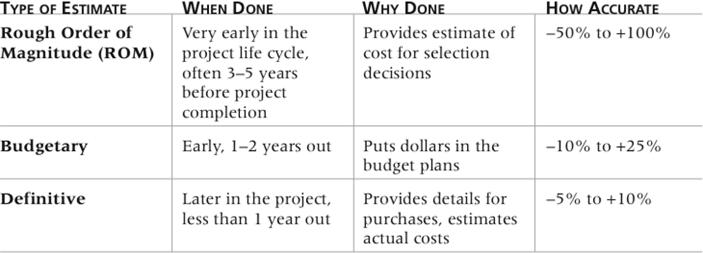

# chapter 1 项目管理概述

# chapter 2 项目管理和IT背景

# chapter 3 项目管理过程组：案例研究

# chapter 4 项目综合管理

# chapter 5 项目范围管理 Project Scope Management
定义：Project scope management includes the processes involved in defining and controlling what is or is not included in a project. / 是指对项目包括什么与不包括什么的界定和控制的过程。它确保团队和项目干系人在项目开发什么产品以及开发产品使用什么过程这两方面达成共识。
项目范围管理涉及的6个主要过程主要是：
**Planing**：
1. Planning scope 范围管理计划: determining how the project’s scope and requirements will be managed/ 确定项目的范围和需求将如何被管理
    - output：范围管理计划、需求管理计划
2. Collecting requirements 收集需求: defining and documenting the features and functions of the products produced during the project as well as the processes used for creating them / 定义和记录项目期间产品的特性和功能，以及用于创建它们的过程
    - output：需求文档、需求跟踪矩阵
3. Defining scope 定义范围: reviewing the project charter, requirements documents, and organizational process assets to create a scope statement / 通过审查项目章程、需求文档和组织过程资产来创建范围说明书
    - output：项目范围说明书、项目文档更新
4. Creating the WBS 创建 WBS: subdividing the major project deliverables into smaller, more manageable components / 将主要项目可交付成果细分为更小、更易管理的组件
    - output：范围基准、项目文档更新

**Monitoring and controlling**：
5. Validating scope 验证范围: formalizing acceptance of the project deliverables / 正式接受项目可交付成果
    - output：验收的可交付成果、变更请求、项目文档更新
6. Controlling scope 控制范围: controlling changes to project scope throughout the life of the project / 在项目生命周期中控制项目范围的变更
    - output：工作绩效信息、变更请求、项目管理计划更新、项目文档更新、组织过程资产更新

## Planning Scope Management
**范围管理计划**包含的信息
- 如何准备一个详细的范围说明书
- 如何创建一个 WBS
- 如何维护和批准 WBS
- 如何获得正式验收已完成的项目可交付成果
- 如何控制项目范围变更的请求
范围管理计划的另外一个重要输出是需求管理计划。
## Collecting Requirements
### Methods for Collecting Requirements
- Interviewing / 采访（成本高耗时长）
- Focus groups and facilitated workshops / 焦点小组和引导式研讨会
- Using group creativity and decision-making techniques / 使用团队创造力和决策技术
- Questionnaires and surveys / 问卷调查
- Observation / 观察
- Prototyping / 原型
- Benchmarking / 基准比较，or generating ideas by comparing specific project practices or product characteristics to those of other projects or products inside or outside the performing organization, can also be used to collect requirements / 通过比较特定项目实践或产品特性与执行组织内部或外部的其他项目或产品的实践或特性来产生想法，也可以用于收集需求

## Defining Scope
项目范围声明应至少包括产品范围描述、产品用户验收标准以及有关所有项目可交付结果的详细信息。记录其他与范围相关的信息（例如，项目边界、约束和假设）也很有帮助。项目范围声明还应引用支持文件，例如产品规格

随着时间的推移，项目的范围应该变得更加清晰和具体
## Creating the Work Breakdown Structure (WBS)
A WBS is a deliverable-oriented grouping of the work involved in a project that defines the total scope of the project. / **WBS 是项目中涉及的工作的交付导向分组，定义了项目的总体范围**。

### Approaches to Developing WBSs
- **Using guidelines 指南**: Some organizations, like the DOD, provide guidelines for preparing WBSs / 一些组织，如美国国防部，提供了准备 WBS 的指南
- **The analogy approach 类比**: Review WBSs of similar projects and tailor to your project / 查看类似项目的 WBS 并根据项目进行调整
- **The top-down approach**: Start with the largest items of the project and break them down / 从项目的最大项目开始并逐步细分
- **The bottom-up approach**: Start with the specific tasks and roll them up / 从具体任务开始并逐步汇总
- **Mind-mapping approach**:  Mind mapping is a technique that uses branches radiating out from a core idea to structure thoughts and ideas / 思维导图是一种技术，它使用从核心思想辐射出来的分支来构建思想和想法

### WBS Dictionary
许多 WBS 任务是模糊的，必须进行更多解释，以便人们知道该做什么，并可以估计完成这项工作需要多长时间和成本
- 定义：**WBS Dictionary** 是描述有关每个 WBS 项目的详细信息的文档。

### Advice for Creating a WBS and WBS Dictionary
- 一个工作单元应仅出现在 WBS 中的一个位置。
- WBS 项的工作内容是其下方的 WBS 项的总和
- 一个 WBS 项目仅由一个人负责，即使可能有很多人在处理它
- WBS 必须与实际执行工作的方式一致;它应该首先为项目团队服务，只有在可行的情况下才能用于其他目的
- 项目团队成员应参与开发 WBS，以确保一致性和支持
- 每个 WBS 项目都必须记录在 WBS 词典中，以确保准确理解该项目包含和不包含的工作范围
- WBS 必须是一个灵活的工具，以适应不可避免的变化，同时根据范围声明适当地保持对项目中工作内容的控制
## Validating Scope
- 为项目创建良好的范围声明和 WBS 非常困难
- 验证项目范围和最小化范围变更更加困难
- 范围验证包括正式接受已完成的项目交付物
- 验收通常是通过客户检查，然后签字关键可交付成果来实现的
## Controlling Scope
- 范围控制涉及控制对项目范围的更改
- 范围控制的目标是
    - 影响导致范围更改的因素
    - 确保变更根据作为集成变更控制的一部分制定的程序进行处理，并且
    - 在更改发生时对其进行管理
- Variance 是计划绩效与实际绩效之间的差
### Best Practices for Avoiding Scope Problems
1. 保持范围真实。不要使项目太大以至于无法完成。将大型项目分解为一系列较小的项目
2. 让用户参与项目范围管理。将关键用户分配给项目团队，并赋予他们需求定义和范围验证的所有权
3. 尽可能使用现成的硬件和软件。许多 IT 人员喜欢使用最新、最出色的技术，但必须优先考虑业务需求，而不是技术趋势
4. 遵循良好的项目管理流程。如本章和其他章节所述，有一些定义明确的流程可用于管理项目范围和项目的其他方面

### Suggestions for Improving User Input
- 制定良好的项目选择流程，并坚持发起人来自用户组织
- 让项目团队中的用户担任重要角色
- 定期召开会议，制定明确的议程，并让用户签署会议上提交的关键可交付成果
- 定期向用户和赞助商交付内容
- 当你知道自己无法交付时，不要承诺交付
- 将用户与开发人员放在同一位置

### Suggestions for Reducing Incomplete and Changing Requirements
- 制定并遵循需求管理流程
- 使用原型设计、用例建模和 JAD 等技术来提高用户参与度
- 将需求写下来并保持最新
- 创建用于记录和控制需求的需求管理数据库
- 在整个项目生命周期中提供足够的测试并进行测试
- 从系统角度查看更改
- 强调完成日期以帮助专注于最重要的事情
- 分配专门用于处理变更请求/增强功能的资源，就像 NWA 对 ResNet 所做的那样
# chapter 6 项目时间管理
定义：确保项目按时完成所需的过程。
## the importance of project schedules
- Managers often cite delivering projects on time as one of their biggest challenges / 管理者经常将按时交付项目列为他们面临的最大挑战之一
- Time has the least amount of flexibility; it passes no matter what happens on a project / 时间的灵活性最小；无论项目发生什么，时间都会流逝
- Schedule issues are the main reason for conflicts on projects, especially during the second half of projects / 进度问题是项目冲突的主要原因，尤其是在项目的后半段

有 7 个主要的过程：
- **Planning schedule management 计划进度管理**: determining the policies, procedures, and documentation that will be used for planning, executing, and controlling the project schedule / 确定将用于规划、执行和控制项目进度的政策、程序和文档
    - output：进度管理计划
- **Defining activities 定义活动**: identifying the specific activities that the project team members and stakeholders must perform to produce the project deliverables / 确定项目团队成员和干系人必须执行的特定活动，以产生项目可交付成果
    - output：活动清单、活动属性、里程碑清单、更新的项目管理计划
- **Sequencing activities 排序活动**: identifying and documenting the relationships between project activities / 确定和记录项目活动之间的关系
    - output：项目进度网络图、更新的项目文档
- **Estimating activity resources 估算活动资源**: estimating how many resources a project team should use to perform project activities / 估计项目团队应该使用多少资源来执行项目活动
    - output：估算资源需求、项目分解结构、更新的项目文档
- **Estimating activity durations 估算活动工期**: estimating the number of work periods that are needed to complete individual activities / 估计完成单个活动所需的工作周期数
    - output：活动工期估算、更新的项目文档
- **Developing the schedule 制定进度计划**: analyzing activity sequences, activity resource estimates, and activity duration estimates to create the project schedule / 分析活动顺序、活动资源估算和活动工期估算，以创建项目进度
    - output：进度基线、项目进度、进度数据、项目日历、更新的项目管理计划和项目文档
monitoring and controlling
- **Controlling the schedule 控制进度**: controlling and managing changes to the project schedule / 控制和管理对项目进度的变更
    - output：工作绩效信息、进度预测、变更请求、项目管理计划更新、项目文档更新、组织过程资产更新

## Planning Schedule Management
The project team uses **expert judgment**, **analytical techniques**, and **meetings** to develop the **schedule management plan**
A **schedule management plan** includes:
- Project schedule model development / 项目进度模型开发
- The scheduling methodology / 计划方法论
- Level of accuracy and units of measure / 精度水平和计量单位
- Control thresholds / 控制阈值
- Rules of performance measurement / 绩效测量规则
- Reporting formats / 报告格式
- Process descriptions / 过程描述

## Defining Activities
- An activity or task is an element of work normally found on the work breakdown structure (WBS) that has an expected duration, a cost, and resource requirements / 活动或任务是通常在工作分解结构（WBS）上找到的工作元素，具有预期工期、成本和资源需求
- Activity definition involves developing a more detailed WBS and supporting explanations to understand all the work to be done so you can develop realistic cost and duration estimates / 活动定义涉及开发更详细的 WBS 和支持性解释，以了解所有要完成的工作，以便您可以开发出真实的成本和工期估算
### Activity List and Attributes
定义：An activity list is **a tabulation of activities to be included on a project schedule** that includes
- the activity name
- an activity identifier or number
- a brief description of the activity

/ 一个活动列表是一个包含在项目进度表上的活动的表格，包括活动名称、活动标识符或编号、活动的简要描述

Activity attributes provide more information such as predecessors, successors, logical relationships, leads and lags, resource requirements, constraints, imposed dates, and assumptions related to the activity / **活动属性提供更多信息，例如前置活动、后续活动、逻辑关系、提前量和滞后量、资源需求、约束、强加日期和与活动相关的假设**

### Milestones
- A milestone is a significant event that normally has no duration
It often takes several activities and a lot of work to complete a milestone / 完成一个里程碑通常需要完成几个活动和大量工作
- They’re useful tools for setting schedule goals and monitoring progress / 它们是设定进度目标和监控进度的有用工具
- Examples include obtaining customer sign-off on key documents or completion of specific products / 例如，获得客户对关键文档的签字或完成特定产品

## Sequencing Activities
- Involves reviewing activities and determining dependencies / 包括审查活动并确定依赖关系
- A dependency or relationship is the sequencing of project activities or tasks / 依赖关系或关系是项目活动或任务的排序
- You must determine dependencies in order to use critical path analysis / 您必须确定依赖关系，以便使用关键路径分析

### Types of Dependencies
- **Mandatory dependencies**: inherent in the nature of the work being performed on a project, sometimes referred to as hard logic
/ 强制依赖关系：固有于项目上正在执行的工作性质中，有时被称为硬逻辑
- **Discretionary dependencies**: defined by the project team.,  sometimes referred to as soft logic and should be used with care since they may limit later scheduling options
/ 自由依赖关系：由项目团队定义，有时被称为软逻辑，应谨慎使用，因为它们可能限制后续的调度选项
- **External dependencies**: involve relationships between project and non-project activities
/ 外部依赖关系：涉及项目和非项目活动之间的关系

### Network Diagrams
- Network diagrams are the preferred technique for showing activity sequencing / 网络图是显示活动排序的首选技术
- A network diagram is a schematic display of the logical relationships among, or sequencing of, project activities / 网络图是项目活动之间的逻辑关系或排序的图示显示
- Two main formats are the arrow and precedence diagramming methods / 两种主要格式是箭头图(ADM)和优先关系图(PDM)

#### Arrow Diagramming Method (ADM)
- Also called **activity-on-arrow (AOA)** network diagrams
- Activities are represented by arrows
- Nodes or circles are the **starting and ending points of activities**
- **Can only show finish-to-start dependencies**

##### Process of Creating an Arrow Diagram
1. Find all of the activities that start at node 1.  Draw their finish nodes and draw arrows between node 1 and those finish nodes.  Put the activity letter or name and duration estimate on the associated arrow
/ 找到所有从节点 1 开始的活动。绘制它们的完成节点，并在节点 1 和这些完成节点之间绘制箭头。在相关的箭头上放置活动字母或名称和持续时间估计 
2. Continuing drawing the network diagram, working from left to right.  Look for bursts and merges.  Bursts occur when a single node is followed by two or more activities.  A merge occurs when two or more nodes precede a single node
/ 继续绘制网络图，从左到右工作。查找突发和合并。突发发生在单个节点后面跟随两个或两个以上的活动时。合并发生在两个或两个以上的节点之前跟随单个节点时
3. Continue drawing the project network diagram until all activities are included on the diagram that have dependencies
/ 继续绘制项目网络图，直到包含所有具有依赖关系的活动为止
4. As a rule of thumb, all arrowheads should face toward the right, and no arrows should cross on an AOA network diagram
/ 作为一个经验法则，所有箭头都应朝向右边，而且在 AOA 网络图上不应该交叉

#### Precedence Diagramming Method (PDM)
- Activities are represented by boxes / 活动由方框表示
- Arrows show relationships between activities / 箭头显示活动之间的关系
- More popular than ADM method and used by project management software / 比 ADM 方法更受欢迎，被项目管理软件使用
- Better at showing different types of dependencies / 更擅长显示不同类型的依赖关系

## Estimating Activity Resources
- Before estimating activity durations, you must have a good idea of the quantity and type of resources that will be assigned to each activity; resources are people, equipment, and materials / 在估算活动工期之前，您必须对将分配给每个活动的资源的数量和类型有一个很好的了解；资源是人员、设备和材料
- Consider important issues in estimating resources
    - How difficult will it be to do specific activities on this project? / 在这个项目中执行特定活动会有多困难？
    - What is the organization’s history in doing similar activities? / 组织在执行类似活动方面的历史如何？
    - Are the required resources available? / 所需资源是否可用？
A resource breakdown structure is a hierarchical structure that identifies the project’s resources by category and type / 资源分解结构是一种层次结构，通过类别和类型识别项目的资源

## Estimating Activity Durations
Duration includes the actual amount of time worked on an activity plus elapsed time / 工期包括在活动上实际工作的时间加上经过的时间
Effort is the number of workdays or work hours required to complete a task / 人工量是完成任务所需的工作日或工作小时数
Effort does not normally equal duration / 人工量通常不等于工期
People doing the work should help create estimates, and an expert should review them / 做工作的人应该帮助创建估算，并且专家应该审查它们

### Three Point Estimates
Instead of providing activity estimates as a discrete number, such as four weeks, it’s often helpful to create a three-point estimate
an estimate that includes an optimistic, most likely, and pessimistic estimate, such as three weeks for the optimistic, four weeks for the most likely, and five weeks for the pessimistic estimate / 一个包括乐观、最可能和悲观估计的估计，例如乐观估计为三周，最可能为四周，悲观估计为五周
Three-point estimates are needed for PERT and Monte Carlo simulations / 需要三点估计用于 PERT 和蒙特卡洛模拟

## Developing the Schedule / 制定进度
Uses results of the other time management processes to determine the start and end date of the project / 使用其他时间管理过程的结果来确定项目的开始和结束日期
Ultimate goal is to create a realistic project schedule that provides a basis for monitoring project progress for the time dimension of the project / 最终目标是创建一个真实的项目进度表，为监控项目进度提供一个基础
Important tools and techniques include Gantt charts, critical path analysis, and critical chain scheduling, and PERT analysis / 重要的工具和技术包括甘特图、关键路径分析和关键链调度，以及 PERT 分析

>PEST分析是指宏观环境的分析，宏观环境又称一般环境，是指影响一切行业和企业的各种宏观力量。对宏观环境因素作分析，不同行业和企业根据自身特点和经营需要，分析的具体内容会有差异，但一般都应对政治（Political）、经济（Economic）、技术（Technological）和社会（Social）这四大类影响企业的主要外部环境因素进行分析。简单而言，称之为PEST分析法。
### Gantt Charts
Gantt charts provide a standard format for displaying project schedule information by listing project activities and their corresponding start and finish dates in a calendar format / 甘特图通过以日历格式列出项目活动及其对应的开始和结束日期，为显示项目进度信息提供了标准格式
Symbols include:
- A black diamond: a milestones  / 黑色菱形：里程碑
- A white diamond: / 白色菱形：完成的时间比计划晚的里程碑
- Thick black bars: summary tasks / 粗黑条：摘要任务
- Lighter horizontal bars: durations of tasks / 较浅的水平条：任务的持续时间
- Arrows: dependencies between tasks / 箭头：任务之间的依赖关系

#### Adding Milestones to Gantt Charts
- Many people like to focus on meeting milestones, especially for large projects / 许多人喜欢专注于达到里程碑，尤其是对于大型项目
- Milestones emphasize important events or accomplishments on projects
Normally create milestone by entering tasks with a zero duration, or you can mark any task as a milestone / 通常通过输入持续时间为零的任务来创建里程碑，或者您可以将任何任务标记为里程碑

SMART原则：具体（Specific）、可衡量（Measurable）、可达成（Achievable）、相关（Relevant）、时限（Time-bound）

项目经理可以通过项目里程碑来降低进度风险，这是一种涉及识别和跟踪项目中的重要点或成就的最佳实践。使用项目里程碑的五个关键点包括：
1. 在项目早期定义里程碑，并将其包含在甘特图中以提供可视化指导
2. 保持里程碑小而频繁
3. 里程碑集必须是包罗万象的
4. 每个里程碑必须是完成或没完成的二元状态
5. 仔细监控关键路径

#### Tracking Gantt Charts
- A tracking Gantt chart is used to compare actual progress to planned progress / 跟踪甘特图用于比较实际进度和计划进度

#### Critical Path Method (CPM)
- CPM is a network diagramming technique used to predict total project duration / CPM 是一种用于预测总项目持续时间的网络图技术
- A critical path for a project is the series of activities that determines the earliest time by which the project can be completed / 项目的关键路径是确定项目可以完成的最早时间的一系列活动
- The critical path is the longest path through the network diagram and has the least amount of slack or float / 关键路径是网络图中最长的路径，具有最少的松弛或浮动
- Slack or float is the amount of time an activity may be delayed without delaying a succeeding activity or the project finish date / 松弛或浮动是活动可能延迟的时间，而不会延迟后续活动或项目完成日期
##### Using Critical Path Analysis to Make Schedule Trade-offs / 使用关键路径分析进行进度权衡
- **Free slack or free float** is the amount of time an activity can be delayed without delaying the early start of any immediately following activities / 自由松弛或自由浮动是活动可以延迟的时间，而不会延迟任何紧随其后的活动的早期开始
- **Total slack or total float** is the amount of time an activity may be delayed from its early start without delaying the planned project finish date / 总松弛或总浮动是活动可以从其早期开始延迟的时间，而不会延迟计划的项目完成日期
- **A forward pass** through the network diagram determines the early start and finish dates / 网络图中的正向传递确定早期开始和完成日期
- **A backward pass** determines the late start and finish dates / 向后传递确定晚期开始和完成日期
##### Using the Critical Path to Shorten a Project Schedule
Three main techniques for shortening schedules
- Shortening durations of critical activities/tasks by adding more resources or changing their scope / 通过增加更多资源或改变范围来缩短关键活动/任务的持续时间
- 赶工 **Crashing** activities by obtaining the greatest amount of schedule compression for the least incremental cost / 通过以最小的增量成本获得最大的进度压缩来压缩活动(**权衡成本和进度以最小成本获取最大进度**)
- 快速跟进 **Fast tracking** activities by doing them in parallel or overlapping them / 通过并行执行或重叠执行活动来加快活动。缺点是可能最后延误项目的进度。
##### Critical Chain Scheduling
- a method of scheduling that considers limited resources when creating a project schedule and includes buffers to protect the project completion date / **一种在创建项目进度表时考虑有限资源的调度方法，并包括缓冲区以保护项目完成日期**
- Uses the Theory of Constraints (TOC) / 使用约束理论（TOC）
    - a management philosophy developed by Eliyahu M. Goldratt and introduced in his book The Goal. / 由 Eliyahu M. Goldratt 开发的管理哲学，并在他的书《目标》中介绍
- Attempts to **minimize multitasking** / 尝试最小化多任务处理
    - when a resource works on more than one task at a time, it can lead to inefficiencies / 当资源同时处理多个任务时，可能会导致低效
    
##### Buffers and Critical Chain / 缓冲区和关键链
- A buffer is additional time to complete a task / 缓冲区是完成任务的额外时间
- Murphy’s Law states that if something can go wrong, it will / 墨菲定律规定，如果有什么事情可能出错，它就会出错
- Parkinson’s Law states that work expands to fill the time allowed / 帕金森定律规定，工作会扩展到填满允许的时间
- In traditional estimates, people often add a buffer to each task and use it if it’s needed or not / 在传统估算中，人们经常为每个任务添加一个缓冲区，并在需要或不需要时使用它
- Critical chain scheduling removes buffers from individual tasks and instead creates / 关键链调度从个别任务中删除缓冲区，而是创建
    - **a project buffer** or additional time added before the project’s due date / 项目缓冲区或在项目到期日期之前添加的额外时间
    - **feeding buffers** or additional time added before tasks on the critical path / 汇入缓冲或在关键路径上的任务之前添加的额外时间
    > FB(feed buffer)是在那些前导是非关键路径任务的关键链任务之前增加的缓冲时间

#### PERT(Program Evaluation and Review Technique)
PERT is a network analysis technique used to estimate project duration when there is a high degree of uncertainty about the individual activity duration estimates / PERT 是一种网络分析技术，用于在对个别活动持续时间估算存在高度不确定性时估算项目持续时间
- PERT uses probabilistic time estimates / PERT 使用概率时间估算
    - duration estimates based on using optimistic, most likely, and pessimistic estimates of activity durations, or a three-point estimate / 持续时间估算是基于使用活动持续时间的乐观、最可能和悲观估算，或三点估算
    - $TE = (O + 4M + P) / 6$
    
## Controlling the Schedule / 控制进度
- Goals are to know the status of the schedule, influence factors that cause schedule changes, determine that the schedule has changed, and manage changes when they occur / 目标是了解进度的状态，影响导致进度变更的因素，确定进度已经发生变化，并在发生变化时管理变化
- Tools and techniques include
    - Progress reports / 进度报告
    - A schedule change control system / 进度变更控制系统
    - Project management software, including schedule comparison charts like the tracking Gantt chart / 项目管理软件，包括进度比较图表，如跟踪甘特图
    - Variance analysis, such as analyzing float or slack / 方差分析，如分析浮动或松弛
    - Performance management, such as earned value (chapter 7) / 绩效管理，如挣值（第 7 章）

### Suggestions for Controlling the Schedule
- Perform reality checks on schedules / 对进度进行现实检查
- Allow for contingencies / 为意外情况留有余地
- Don’t plan for everyone to work at 100% capacity all the time / 不要计划每个人都全天候工作
- Hold progress meetings with stakeholders and be clear and honest in communicating schedule issues / 与干系人举行进度会议，并在沟通进度问题时清晰和诚实

# chapter 7 项目成本管理
## What is Cost and Project Cost Management?
Cost is a resource sacrificed or foregone to achieve a specific objective or something given up in exchange / 成本是为实现特定目标而牺牲或放弃的资源，或者是为了交换而放弃的东西，通常用货币单位（如美元）来衡量
Project cost management includes the processes required to ensure that the project is completed within an approved budget / 项目成本管理包括确保项目在批准的预算内完成所需的过程
## Project Cost Management Processes
- **Planning cost management** :determining the policies, procedures, and documentation that will be used for planning, executing, and controlling project cost. / 计划成本管理：确定将用于规划、执行和控制项目成本的政策、程序和文档
- **Estimating costs**: developing an approximation or estimate of the costs of the resources needed to complete a project / 估算成本：开发完成项目所需资源的成本的近似值或估算
- **Determining the budget**: allocating the overall cost estimate to individual work items to establish a baseline for measuring performance / 确定预算：将整体成本估算分配给各个工作项，以建立衡量绩效的基准
- **Controlling costs**: controlling changes to the project budget / 控制成本：控制对项目预算的更改

## Basic Principles of Cost Management
- Profits are revenues minus expenditures / 利润是收入减去支出
- Profit margin is the ratio of revenues to profits / 利润率是收入与利润的比率
- Life cycle costing considers the total cost of ownership, or development plus support costs, for a project / 生命周期成本考虑项目的所有权总成本，即开发加支持成本
- Cash flow analysis determines the estimated annual costs and benefits for a project and the resulting annual cash flow / 现金流分析确定项目的预计年度成本和收益以及由此产生的年度现金流

## Types of Costs and Benefits
- Tangible costs or benefits are those costs or benefits that an organization can easily measure in dollars / 有形成本或收益是组织可以轻松用美元衡量的成本或收益
- Intangible costs or benefits are costs or benefits that are difficult to measure in monetary terms / 无形成本或收益是难以用货币衡量的成本或收益
- Direct costs are costs that can be directly related to producing the products and services of the project  / 直接成本是可以直接与项目的产品和服务相关联的成本
- Indirect costs are costs that are not directly related to the products or services of the project, but are indirectly related to performing the project / 间接成本是与项目的产品或服务无直接关系，但与执行项目间接相关的成本
- Sunk cost is money that has been spent in the past; when deciding what projects to invest in or continue, you should not include sunk costs / 沉没成本是过去花费的钱；在决定投资或继续哪些项目时，不应包括沉没成本

## Planning Cost Management / 计划成本管理
- The project team uses expert judgment, analytical techniques, and meetings to develop the cost management plan / 项目团队使用专家判断、分析技术和会议来制定成本管理计划
- A cost management plan includes:
    - Level of accuracy and units of measure / 精度水平和计量单位
    - Organizational procedure links / 组织程序链接
    - Control thresholds / 控制阈值
    - Rules of performance measurement / 绩效测量规则
    - Reporting formats / 报告格式
    - Process descriptions / 过程描述
## Estimating Costs / 估算成本
- Project managers must take cost estimates seriously if they want to complete projects within budget constraints / 如果项目经理希望在预算约束内完成项目，他们必须认真对待成本估算
- It’s important to know the types of cost estimates, how to prepare cost estimates, and typical problems associated with IT cost estimates / 了解成本估算的类型、如何准备成本估算以及与 IT 成本估算相关的典型问题是很重要的
### Types of Cost Estimates

- Rough order of magnitude (ROM) / 粗粒度估算
- Budgetary estimate / 预算估算
- Definitive estimate / 确定性估算
### Cost Estimating Tools and Techniques
- Basic tools and techniques for cost estimates:
    - **Analogous** or **top-down** estimates: use the actual cost of a previous, similar project as the basis for estimating the cost of the current project / 类比或自上而下估算：使用先前类似项目的实际成本作为估算当前项目成本的基础
    - **Bottom-up** estimates: involve estimating individual work items or activities and summing them to get a project total / 自下而上估算：涉及估算单个工作项或活动，并将它们相加以获得项目总数 
    - **Parametric modeling** uses project characteristics (parameters) in a mathematical model to estimate project costs / 参数建模使用项目特征（参数）在数学模型中估算项目成本
### Typical Problems with IT Cost Estimates
- Estimates are done too quickly / 估算速度太快
- People lack estimating experience / 人们缺乏估算经验
- Human beings are biased toward underestimation / 人类倾向于低估
- Management desires accuracy / 管理层希望准确
## Determining the Budget / 确定预算
- Cost budgeting involves allocating the project cost estimate to individual work items over time / 成本预算涉及将项目成本估算分配给各个工作项
- The WBS is a required input to the cost budgeting process since it defines the work items / WBS 是成本预算过程的必需输入，因为它定义了工作项
- Important goal is to produce a **cost baseline** / 重要目标是制定成本基准
- a time-phased budget that project managers use to measure and monitor cost performance / 项目经理用来衡量和监控成本绩效的分时预算
## Controlling Costs / 控制成本
- Monitoring cost performance / 监控成本绩效
- Ensuring that only appropriate project changes are included in a revised cost baseline / 确保只有适当的项目变更包含在修订的成本基准中
- Informing project stakeholders of authorized changes to the project that will affect costs / 通知项目干系人授权的项目变更将影响成本

### Earned Value Management (EVM)
- EVM is a project performance measurement technique that integrates scope, time, and cost data / 挣值管理是一种项目绩效测量技术，它整合了范围、时间和成本数据
- Given a baseline (original plan plus approved changes), you can determine how well the project is meeting its goals / 给定基线（原始计划加上批准的变更），您可以确定项目是否达到了其目标
- You must enter actual information periodically to use EVM / 您必须定期输入实际信息以使用挣值管理
- More and more organizations around the world are using EVM to help control project costs / 越来越多的组织在全球范围内使用挣值管理来帮助控制项目成本

#### EVM Terms
- **The planned value (PV)**, formerly called the budgeted cost of work scheduled (BCWS), also called the budget, is that portion of the approved total cost estimate planned to be spent on an activity during a given period / **计划值（PV）**，以前称为计划工作的预算成本（BCWS），也称为预算，是计划在给定期间内花费在活动上的批准总成本估算的部分
- **Actual cost (AC)**, formerly called actual cost of work performed (ACWP), is the total of direct and indirect costs incurred in accomplishing work on an activity during a given period / **实际成本（AC）**，以前称为实际工作成本（ACWP），是在给定期间内完成活动工作所发生的直接和间接成本的总和
- **The earned value (EV)**, formerly called the budgeted cost of work performed (BCWP), is an estimate of the value of the physical work actually completed / **挣值（EV）**，以前称为实际工作成本（BCWP），是实际完成的物理工作价值的估计
- EV is based on the original planned costs for the project or activity and the rate at which the team is completing work on the project or activity to date / **EV 基于项目或活动的原始计划成本以及团队截至目前完成项目或活动工作的速度**
- **Rate of performance (RP)** , is the ratio of actual work completed to the percentage of work planned to have been completed at any given time during the life of the project or activity / **完成百分比（RP）**，是实际完成的工作量与计划在项目或活动生命周期的任何给定时间内应完成的工作量的百分比之比
- **cost variance (CV) 成本偏差**，是$挣值-实际成本$。如果CV为正，表示项目花费低于预算，如果CV为负，表示项目花费高于预算
- **schedule variance (SV) 进度偏差**，是$挣值-计划值$。如果SV为正，表示项目进度超前于计划，如果SV为负，表示项目进度落后于计划
- **cost performance index (CPI) 成本绩效指数**，是$挣值/实际成本$。CPI大于 1 表示项目花费低于预算，CPI小于 1 表示项目花费高于预算
- **schedule performance index (SPI) 进度绩效指数**，是$挣值/计划值$。SPI大于 1 表示项目进度超前于计划，SPI小于 1 表示项目进度落后于计划
- Budget at Completion (BAC) 完工预算，是项目的总预算
- Estimate at Completion (EAC) 完工估算，是完成项目所需的预计总成本

## Project Portfolio Management / 项目组合管理
- Many organizations collect and control an entire suite of projects or investments as one set of interrelated activities in a portfolio / 许多组织将整套项目或投资作为一个投资组合中的一组相互关联的活动进行收集和控制
- Five levels for project portfolio management / 项目组合管理的五个级别，从最低到最高：
    - Put all your projects in one database / 将所有项目放在一个数据库中
    - Prioritize the projects in your database / 为数据库中的项目设置优先级
    - Divide your projects into two or three budgets based on type of investment / 根据投资类型将项目分为两个或三个预算
    - Automate the repository / 自动化存储库
    - Apply modern portfolio theory, including risk-return tools that map project risk on a curve / 应用现代投资组合理论，包括将项目风险映射到曲线上的风险回报工具

# chapter 8 项目质量管理
质量的定义：
- 反映尸体满足明确和隐含需求的能力特性总和（ISO8042:1994）。
- 对一组满足需求固有特性的程度（ISO9000:2000）。
## 什么是项目质量管理？
项目质量管理的目的：确保项目满足他所应满足的需求。

包括三个主要过程：
- **计划质量管理（plan quality management）**
    包括确认与项目有关的质量需求和标准以及如何满足他们。计划质量管理的主要输出结果为：质量管理计划、过程改进计划、质量度量、质量检查表和项目文档更新。**度量标准**是一个测量的标准。常见的度量标准包括产品故障率、产品和服务的可行性以及客户满意度。
- **实施质量保证**
    包括对整体项目绩效进行定期的评估以确保项目能够满足相关的质量标准。质量保证过程包括对整个项目全生命周期过程承担质量责任。高层管理应带头强调全体员工在质量保证活动中发挥作用，尤其是高层管理要发挥作用。这个阶段的主要输出结果是：变更请求、项目管理计划更新和组织过程资产更新。
- **控制质量**
    包括监控特定的项目结果，确保他们遵循了相关质量标准，并确定提高整体质量的方法。常与质量管理所用的工具和技术密切相关，如：帕累托图、质量控制图和统计抽样。主要输出结果：质量控制度量、有效的变更、有效的可交付成功、工作绩效信息、变更请求、项目管理计划更新、项目文档更新和组织过程资产更新。
## 计划质量管理
确保项目质量管理的第一步就是计划。**计划质量管理意味着预测形势和准备措施以获得需要的结果的能力**。

**现代质量管理的要点是，通过选择合适的材料、培训与教导人们的质量观念、计划一个确保产生合适结果的过程来预防缺陷**。在项目质量计划中，重要的是**确定每个独特项目的相关质量标准，把质量设计到项目的产品和管理项目所设计的过程之中**。

**实验设计**是一种质量计划技术，用以**帮助确认哪个变量对一个过程的整体结果影响最大**。了解哪个变量影响过程结果是质量计划的重要部分。

在质量计划中，描述能够直接促成满足客户需求的关键因素是重要的。**组织的质量方针、特定项目的范围说明书和产品描述以及相关标准和规章制度都是质量计划过程的重要输入**。

IT 项目中影响质量的重要范围内容包括：
- 功能性
    - 功能性是一个系统执行其预定功能的程度。
    - **特色 / feature** 是吸引用户的系统特性。
    - 明确系统的哪些功能和特色是必须具备的，哪些是可选的，非常重要。
- 系统输出
    - 系统产生的界面和报告。
- 性能
    - 一个产品或服务如何有效执行客户预期的功能。
- 可靠性
    - 一个产品或服务在正常条件下表现出符合预期情况的能力。
- 可维护性
    - 进行产品维护的容易程度。

**项目经理对项目的质量管理负根本责任**。
## 实施质量保证
质量保证（quality assurances）包括一个项目相应质量标准的所有相关活动。另一个目标的是不断改进质量。

执行质量保证的重要输入是质量管理计划、过程改进计划、质量度量、质量控制度量和项目文档。

- **持续改善（kaizen）**：更好的改善和改变。
- **精益（lean）**：实现客户价值最大化，同时尽量减少浪费。

### 质量保证的工具
- 质量计划中的几个工具也可用于质量保证，如实验设计（书上只提到这个）。
- 基准比较法（benchmarking）：通过将特定的项目实践或产品特性与那些在项目实施组织内部或者外部的其他项目或产品的相应特性进行比较，从中产生质量改进的思想。
- 质量保证的一个重要工具是**质量审计（quality audit）**。质量审计是对特定质量管理活动的结构化审查，帮助确认所取得的经验教训，并可以改进当前或者未来项目的实施情况。
    - 质量审计可以是定期或者随机的，可由公司内部的稽查员或者专门的第三方机构进行。
## 质量控制
虽然质量控制的一个主要目标也是提高质量，但是主要输出是验收决策、返工和过程调整。
- **验收决策（acceptance decision）**：确定作为项目一部分的产品和服务是否通过验收的决策。
- **返工（rework）**：为了使得被拒收的项目达到和满足产品需求、规范或者干系人的其他期望而采取的行动。常常需要请求变更和有效的缺陷修复。
- **过程调整（process adjustment）**：根据质量控制的度量结果，纠正或防止进一步的质量问题而做的调整。过程调整通常根据质量控制的度量结果来建立，经常导致质量基线、组织过程资产和项目管理计划的更新。
## 质量控制的工具和技术
- **因果图 cause-and-effect diagram** / 鱼骨图 （fishbone diagram）/ 石川图（Ishikawa diagram）

- **控制图 control chart**

这里有一个 **seven run rule 七点运行法则** 指出：如果质量控制图上连续的7个点都在平均值以下、平均值以上，或者所有点都呈现出上升或者下降的趋势，那么需要检查这个过程是否有 **非随机** 问题。
- 检查表 checksheet
- 散点图 scatter diagram
- 直方图 histogram
- 帕托累（怕拖累）图 Pareto diagram
- 流程图 flowchart
- 运行图 run chart

### Statistical Sampling 抽样统计
- 统计抽样涉及从感兴趣的总体中选择一部分进行检查
- 样本的大小取决于您希望样本的代表性
- 样本量公式：
    Sample size = $0.25×(可信度因子/可接受误差)^2$
常用的可信度因子

### six sigma
Six Sigma is “a comprehensive and flexible system for achieving, sustaining, and maximizing business success.  Six Sigma is uniquely driven by close understanding of customer needs, disciplined use of facts, data, and statistical analysis, and diligent attention to managing, improving, and reinventing business processes” / 六西格玛是一种全面灵活的系统，用于实现、维持和最大化业务成功。六西格玛是通过对客户需求的深入了解、对事实、数据和统计分析的纪律性使用以及对管理、改进和重塑业务流程的认真关注而推动的。

The term sigma means standard deviation（标准差）.Standard deviation measures how much variation exists in a distribution of data
Standard deviation is a key factor in determining the acceptable number of defective units found in a population

6 Sigma 的完美目标：
- Six Sigma projects strive for no more than 3.4 defects per million opportunities, yet this number is confusing to many statisticians

#### DMAIC 方法：
六西格码项目通常遵循称为 DMAIC 的五阶段改进流程。DMAIC 是一个系统的、闭环的持续改进流程，具有科学性，基于事实。
- **Define** 定义：定义问题/机会、流程和客户要求
- **Measure** 测量：定义度量值，然后收集、编译和显示数据
- **Analyze** 分析：仔细检查流程细节以寻找改进机会
- **Improve** 改进：生成解决方案和想法以改进问题
- **Control** 控制：跟踪和验证改进的稳定性和解决方案的可预测性

#### 6 Sigma 组织结构
6σ管理需要一套合理、高效的人员组织结构来保证改进活动得以顺利实现。在过去，之所以有80%的全面质量管理（Total Quality Management，TQM）实施者失败，最大原因就是缺少这样一个人员组织结构。
- 执行负责人
六西格玛6σ管理的执行负责人由一位副总裁以上的高层领导担任。这是一个至关重要的职位，要求具有较强的综合协调能力的人才能胜任。其具体职责是：为项目设定目标、方向和范围；协调项目所需资源；处理各项目小组之间的重叠和纠纷，加强项目小组之间的沟通等。
- 绿带（Green Belt）
绿带的工作是兼职的，他们经过培训后，将负责一些难度较小项目小组，或成为其他项目小组的成员。
- 黑带（Black Belt）
黑带来源于军事术语，指那些具有精湛技艺和本领的人。黑带是6σ变革的中坚力量。对黑带的认证通常由外部咨询公司配合公司内部有关部门来完成。黑带由企业内部选拔出来，全职实施6σ管理，在接受培训取得认证之后，被授予黑带称号，担任项目小组负责人，领导项目小组实施流程变革，同时负责培训绿带。黑带的候选人应该具备大学数学和定量分析方面的知识基础，需要具有较为丰富的工作经验。
- 黑带大师
这是6σ管理专家的最高级别，其一般是统计方面的专家，负责在6σ管理中提供技术指导。

### Testing
应在 IT 产品开发生命周期的几乎每个阶段进行测试。

#### types of testing
- Unit testing tests each individual component (often a program) to ensure it is as defect-free as possible / 单元测试测试每个单独的组件（通常是一个程序），以确保尽可能无缺陷
- Integration testing occurs between unit and system testing to test functionally grouped components / 集成测试发生在单元测试和系统测试之间，以测试功能分组的组件
- System testing tests the entire system as one entity / 系统测试将整个系统作为一个实体进行测试
- User acceptance testing is an independent test performed by end users prior to accepting the delivered system / 用户验收测试是由最终用户在接受交付的系统之前进行的独立测试

## 现代质量管理
- Requires customer satisfaction / 需要客户满意度
- Prefers prevention to inspection / 更喜欢预防而不是检查
- Recognizes management responsibility for quality / 认识到质量的管理责任
### 值得注意的质量专家
- Deming 以其重建日本的工作和他的 14 点管理而闻名
- Juran 撰写了《质量控制手册》和《质量改进的十个步骤》
- Crosby 撰写了《Quality is Free》一书，并建议组织努力实现零缺陷
- 石川馨 Kaoru Ishikawa 提出了质量圈 quality circle 和鱼骨图的概念
- 田口 Genichi Taguchi 开发了优化工程实验过程的方法
- Feigenbaum 提出了全面质量控制 TQC 的概念
## 提高 IT 项目质量
Several suggestions for improving quality for IT projects include:
- Establish leadership that promotes quality / 建立促进质量的领导
- Understand the cost of quality / 了解质量的成本
- Focus on organizational influences and workplace factors that affect quality / 关注影响质量的组织影响和工作场所因素
- Follow maturity models / 遵循成熟度模型

### Leadership
A large percentage of quality problems are associated with management, not technical issues. / 大部分质量问题与管理有关，而不是技术问题。
### The Cost of Quality
The cost of quality is the cost of conformance plus the cost of nonconformance / 质量成本是符合成本加上不符合成本
- **Conformance** （符合成本）means delivering products that meet requirements and fitness for use / 交付符合要求和适用性的产品
- **Cost of nonconformance** （不符合成本）means taking responsibility for failures or not meeting quality expectations / 承担失败或未达到质量期望的责任 

Five Cost Categories Related to Quality
- **Prevention cost** 预防成本: Cost of planning and executing a project so it is error-free or within an acceptable error range / 计划和执行项目以使其无错误或在可接受的错误范围内的成本
- **Appraisal cost** 评估成本: Cost of evaluating processes and their outputs to ensure quality / 评估过程及其输出的成本以确保质量
- **Internal failure cost** 内部故障成本: Cost incurred to correct an identified defect before the customer receives the product / 在客户收到产品之前纠正已识别的缺陷所产生的成本
- **External failure cost** 外部故障成本: Cost that relates to all errors not detected and corrected before delivery to the customer / 与交付给客户之前未检测和纠正的所有错误有关的成本
- **Measurement and test equipment costs** 测量测试设备成本: Capital cost of equipment used to perform prevention and appraisal activities / 用于执行预防和评估活动的设备的资本成本
### Organizational Influences and Workplace Factors
专用的工作空间和安静的工作环境是提高程序员工作效率的关键因素
### Expectations and Cultural Differences in Quality
项目经理必须了解和管理利益相关者的期望。期望还因以下因素而异：
- 组织文化
- 地理区域
### Maturity Models 成熟度模型
定义： Maturity models are frameworks for helping organizations improve their processes and systems. / 成熟度模型是帮助组织改进其流程和系统的框架

The Software Quality Function Deployment Model focuses on defining user requirements and planning software projects. / 软件质量功能部署模型侧重于定义用户需求和规划软件项目。

The Software Engineering Institute’s **Capability Maturity Model Integration（CMMI）** is a process improvement approach that provides organizations with the essential elements of effective processes. / 软件工程研究所的能力成熟度模型集成是一种过程改进方法，为组织提供了有效流程的基本要素。
#### CMII
CMMI levels, from lowest to highest, are:
1. Incomplete / 不完整
2. Performed / 执行
3. Managed / 管理
4. Defined / 定义
5. Quantitatively Managed  / 量化管理
6. Optimizing / 优化

Companies may not get to bid on government projects unless they have a CMMI Level 3
#### PMI’s Maturity Model
PMI 于 2003 年 12 月发布了组织项目管理成熟度模型 （OPM3）
# chapter 9 项目人力资源管理
## 什么是项目人力资源管理
Making the most effective use of human and physical resources involved with the project. / 项目人力资源管理包含使项目涉及的人员得到最有效利用的全部过程。

人力资源管理包括所有项目干系人：赞助商、客户、项目团队成员、后勤员工、项目供应商等。

项目人力资源管理包括下列4个过程：
- 人力资源规划
- 组建(accuqire)项目团队
- 开发项目团队
- 管理项目团队

## 管理员工的关键所在
### motivation theories 激励理论
- intrinsic motivation 内在动机
- extrinsic motivation 外在动机
#### Maslow's hierarchy of needs 马斯洛的需求层次理论
Maslow developed a hierarchy of needs which states that people’s behaviors are guided or motivated by a sequence of needs. / 马斯洛提出了一个需求层次理论，该理论认为人们的行为是由一系列需求引导或激励的。

满足团队成员的个人目标和需求能够产生积极的动力，促进团队发挥最大的作用。
#### Herzberg’s Motivational and Hygiene （激励-保健）Factors \ 赫茨伯格的激励-保健因素理论
其将工作动机分为激励因素和保健因素：

- **motivational factors**: achievement, recognition, the work itself, responsibility, advancement, and growth, which produce job satisfaction 能产生工作满意度的因素，如成就、认可、工作本身、责任、晋升和成长。
- **hygiene factors**: cause dissatisfaction if not present, but do not motivate workers to do more. Examples include larger salaries, more supervision, and a more attractive work environment. 没满足会造成员工不满的因素，满足了也不会激励。例如更高的薪水、更多的监督和更有吸引力的工作环境。

#### McClelland’s Acquired-Needs（获得-需求） Theory \ 麦克莱兰的获得-需求（后天需要）理论
McClelland 认为个人的特定需求是通过后天培养或者是长期学习、由生活经验形成的。获得需求理论包括：**成就需求、归属需求、权力需求**。一般情况下，有一种或者两种需求占个人需求的主要地位。

- **Achievement (nAch)**:  Achievers like challenging projects with achievable goals and lots of feedback.（喜欢具有挑战性的项目，有可实现的目标和大量的反馈）
- **Affiliation (nAff)**:  People with high nAff desire harmonious relationships and need to feel accepted by others, so managers should try to create a cooperative work environment for them. （需要和谐的关系，需要被他人接受，所以经理应该为他们创造一个合作的工作环境）
- **Power (nPow)**: People with a need for power desire either personal power (not good) or institutional power  (good for the organization).  Provide institutional power seekers with management opportunities （给他们管理别人的机会）

#### McGregor’s Theory X and Y  麦克格雷戈的X理论和Y理论
- 相信 **X 理论**的经理认为：workers dislike and avoid work, so managers must use coercion, threats and various control schemes. 员工不喜欢并且设法逃避工作，所以经理必须使用强制、威胁和各种控制方案。
- **Y 理论**（也叫人际关系理论）: individuals consider work as natural as play or rest and enjoy the satisfaction of esteem and self-actualization needs. 人非天生懒惰和不喜欢工作，只是有时需要放松和休息。应该如马斯洛所说，满足员工的需求，使他们能够实现自我价值。这也是 McGregor 所倡导的。

- **Z 理论**：一种新的管理方法，参考日本激励员工的方法，强调信任、质量、集体决策和文化价值，**不同于 X 和 Y 只强调管理者如何看待员工，Z 也强调员工如何看待管理者**。应该相信员工们能最大限度发挥能力去做好他们的工作，只要他们相信管理者能支持他们并为他们谋福利。（by William Ouchi）

### influence and power 影响和权力
#### Influence
9种项目经理可用的 influence：
1. **Authority 权威**: the legitimate hierarchical right to issue orders 发布命令
2. **Assignment 委派**: the project manager's perceived ability to influence a worker's later work assignments 影响员工日后工作指派内容
3. **Budget 预算**: the project manager's perceived ability to authorize others' use of discretionary funds 授权某人自由支配预算
4. **Promotion 升迁**: the ability to improve a worker's position 提拔员工
5. **Money 金钱**: the ability to increase a worker's pay and benefits
6. **Penalty 处罚**: the project manager's ability to cause punishment 惩罚/免除惩罚
7. **Work challenge**: the ability to assign work that capitalizes on a worker's enjoyment of doing a particular task 使员工能够享受工作
8. **Expertise 专长**: the project manager's perceived special knowledge that others deem important 项目经理的专业知识
9. **Friendship 友谊**: the ability to establish friendly personal relationships between the project manager and others 

>注：经理应更应该用 Expertise、work challenge 来影响员工，不应太过于依赖：Authority、Money、Penalty 

#### Power
Power is the potential ability to influence behavior to get people to do things they would not otherwise do. /
权力是影响行为的潜在能力，让人们做他们本来不会做的事情。

五种权力类型：
- **Coercive** 强制权力：用处罚强迫人
- **Legitimate** 法定权力：通过职位赋予的权力去指挥员工做事。类似于影响的 Authority
- **Expert** 专家权力：利用个人知识让人改变行为
- **Reward** 奖励：很多专家认为只有几种特定的奖励（工作挑战、成就感和工作认可），才能真正激发员工改变行为或者努力工作
- **Referent** 感召：建立在个人魅力基础上，让人按照他们说的去做。

### Covey and Improving Effectiveness 柯维和提高效率
经理可以应用柯维的七种习惯来提供工作效率：
- Be proactive 积极主动
- Begin with the end in mind 从目标出发
- Put first things first 要事第一
- Think win/win 双赢思维
- empathic listening 移情倾听 Seek first to understand, then to be understood 先求同情，再求理解。（这一点可以区分好的和坏的经理）
- Synergize 协同（译为：统合综效）：指整体大于部分的概念，1+1>2
- Sharpen the saw 磨快锯子，不断更新（从物质上精神上心智上以及社会/感情上更新自我 ）

注：实践 empathic listening -> 让别人乐意与你交谈 -> 要建立友好关系（**rapport**，一种和谐一致协调的关系）-> 使用 **mirroring** 方式，the matching of certain behaviors of the other person in order to create rapport.（模仿对方的某些行为以建立和谐关系，人们倾向于喜欢那些和自己相似的人）

### emotional intelligence 情商
### leadership 领导
## 人力资源规划
### 项目组织结构图

- OBS（Organizational breakdown structure）组织分解结构：一种特殊的组织结构图，显示每个组织单元负责哪项工作。

### Responsibility Assignment Matrices（RAM）责任分配矩阵
是将 WBS 中描述的项目工作和 OBS 中负责实施的人员匹配起来的矩阵。

RAM 可以包括项目中的干系人，有的组织用 RACI 表来表示项目干系人的四种角色：

- R = responsibility 责任人，谁执行这个任务
- A = accountability, only one A per task 批准人，谁签署这个任务谁负全责
- C = consultation 审核人，谁拥有完成这个任务的必要信息
- I = informed 告知人：谁需要被告知这个项目的最终情况
Note：需要注意的是，有些人把“负责任”和“可追究责任”的定义弄反了。负责任的人是执行任务的人，而可追究责任的人是对任务的结果负责的人。
###  Staffing Management Plans and Resource Histograms 人员管理计划和资源直方图
- staffing management plan ：describes when and how people will be added to and taken off（调离）the project team. / 描述了何时以及如何将人员添加到项目团队中以及何时调离项目团队。
- resource histogram（直方图）：is a column chart that shows the number of resources assigned to a project over time. / 显示了随着时间的推移分配给项目的资源数量。

## 组建 Acquiring 项目团队
- Resource Assignment 资源分配
- Resource Loading 资源负荷
- Resource Leveling 资源平衡
### Resource Assignment 资源分配
### Resource Loading 资源负荷
定义：
- the amount of individual resources an existing schedule requires during specific time periods / 现有计划在特定时间段内所需的单个资源量
- 帮助项目经理了解项目对组织资源和人力资源的需求，常用直方图绘制不同时期的资源负荷所需。
- **Overallocation** 意味着在给定时间内分配的资源超过了可用资源，下面简单的柱状图展示 Overallocation。

### Resource Leveling 资源平衡
- 定义：是一种通过**延迟任务来解决资源冲**突的技术，主要目的是更平滑的资源使用分配并减少过度分配。

如下图：如果所有任务都一起开始，则会出现资源 Overallocation，可以把 C 任务推后两天做。

- 好处：当资源在更稳定的基础上使用时，它们需要更少的管理。
它可能使项目经理能够使用 just-in-time 的策略来使用分包商或其他昂贵的资源。这减少了项目人员和财务部的问题。增加或者减少人力资源会带来混乱。这通常会提高士气，人人都喜欢安稳工作。

> 项目管理软件可以自动平衡资源，但是它通常会延迟项目完成时间。
## 开发项目团队
主要目标：to help people work together more effectively to improve project performance / 帮助人们更有效地协作以提高项目绩效。成功地完成大多数项目需要团队合作 

**Tuckman Model** of Team Development
- **Forming** 成形：这阶段包括团队成员的引进，实际工作少。
- **Storming** 震荡：各成员具有不同观点人们互相试探，伴有冲突
- **Norming** 规范：各成员形成了一种通用的工作方法
- **Performing** 执行：强调团队目标的达成，建立彼此间的忠诚。
- **Adjourning** 终止：项目组成功达到目标、团队解体
### Training
：Training can help people understand themselves, each other, and how to work better in teams / 培训可以帮助人们了解自己、彼此以及如何更好地在团队中工作。
### 团队建设活动
两种常见的团建活动方法有体能挑战和心理偏好指示工具。

3种常见的团队建设方法：
- MBTI 职业性格测试
    - E/I: Extraversion/Introversion 外向/内向
    - S/N: Sensing/Intuition 感觉/直觉
    - T/F: Thinking/Feeling 思考/情感
    - J/P: Judging/Perceiving 判断/感知
- Social Styles Profile  社交形态
    - Driver 驱动型
    - Expressive 表达型
    - Analytical 分析型
    - Amiable 和蔼型
    
    对立象限的人（Driver 和 Amiable、Expressive 和 Analytical）可能难以相处
- DISC Profile 行为风格
    - Dominance 支配型
    - Influence 影响型
    - Steadiness 稳定型
    - Conscientiousness 谨慎型
    
    对立象限的人（Dominance 和 Steadiness、Influence 和 Conscientiousness）可能难以相互理解
### 奖励表彰制度
- 基于团队的奖励和认可系统可以促进团队合作
- 专注于奖励实现特定目标的团队
- 为团队成员留出时间相互指导和帮助，以实现项目目标和开发人力资源
## 管理项目团队
项目经理必须领导他们的团队执行各种项目活动，并且在评估团队绩效和相关信息之后，项目经理必须做出决定：是否需要对项目进行更改、是否建议采取纠正或预防措施、如果需要对项目管理计划或组织过程资产进行更新。
### 管理项目团队的工具和方法
- Observation and conversation      观察和交流
- Project performance appraisals    项目绩效评估
- Interpersonal skills              人际关系技能
- Conflict management               冲突管理
    - Confrontation 对抗: Directly face a conflict using a problem-solving approach 
    - Compromise 妥协: Use a give-and-take approach
    - Smoothing 平滑: De-emphasize areas of difference and emphasize areas of agreement
    - Forcing 强迫: The win-lose approach
    - Withdrawal 退出: Retreat or withdraw from an actual or potential disagreement
    - Collaborating 合作: Decision makers incorporate different  viewpoints and insights to develop consensus and commitment  
    
    冲突也可以是好的。
    冲突通常会产生重要的结果，例如新的想法、更好的选择以及更加努力和协作工作的动力
    - **Group thinking** 群体思维：符合群体的价值观或道德标准。如果没有相互冲突的观点，群体思维就会发展。
    研究表明，与任务相关的冲突通常会提高团队绩效，但情绪冲突通常会压低团队绩效
- Issue log 问题日志
# chapter 10 项目沟通管理
## 沟通规划
## 信息发布
# chapter 11 项目风险管理
TODO
# chapter 12 项目采购管理
TODO
# chapter 13 项目干系人管理
TODO