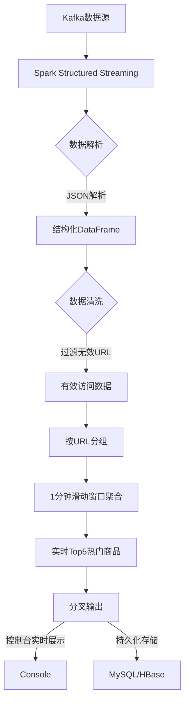

### 基于 Spark 的电商实时页面访问量统计
#### 案例场景说明
本案例基于电商实时页面访问量统计场景，实现从数据生成到 Spark 流处理的完整链路。核心流程如下：
​
1. 数据生成​​：模拟用户访问日志（含 URL、IP、时间戳等字段），推送至 Kafka；
2. ​流处理​​：Spark 消费 Kafka 数据，过滤无效 URL 并统计每分钟页面访问量
3. ​结果展示​​：聚合结果实时输出到控制台。

#### 案例逻辑总体图


#### 关键流程说明与 Spark API
1. **数据源接入**  
   • **输入源**：从 Kafka 消费 JSON 格式的页面访问日志。  
   • **API 使用**：  
     ```scala
     spark.readStream
       .format("kafka")
       .option("kafka.bootstrap.servers", "localhost:9092")
       .option("subscribe", "page_views")
       .load()
     ```  

2. **数据解析与清洗**  
   - **结构化处理**：提取 `URL`、`timestamp` 等字段，过滤非商品页面（如 `/login`）。  
   - **API 使用**：  
     ```scala
     .selectExpr("CAST(value AS STRING) AS log")
     .withColumn("url", split(col("log"), " ")(2))
     .filter(col("url").like("/product/%"))
     ```  

3. **窗口聚合统计**  
   - **滑动窗口**：按 1 分钟窗口、10 秒滑动步长统计访问量。  
   - **API 使用**：  
     ```scala
     .groupBy(
       window(col("timestamp"), "1 minute", "10 seconds"),
       col("url")
     )
     .agg(count("*").alias("view_count"))
     ```  

4. **结果输出**  
   - **控制台展示**：实时输出 Top 5 热门商品。  
   - **持久化存储（可选）**：写入 MySQL 供后续查询或 HBase 供离线分析。  
   - **API 使用**：  
     ```scala
     .writeStream
     .outputMode("complete")
     .format("console")
     .start()
     ```  

#### 技术亮点（供参考学习）
• **动态水位线**：通过 `withWatermark("timestamp", "2 minutes")` 处理延迟数据。  
• **容错机制**：启用检查点保证 Exactly-Once 语义。  
• **性能优化**：对齐 Kafka 分区与 Spark 并行度，避免数据倾斜。

#### 代码实现参考

##### 1. 生成测试数据并推送至 Kafka（Python 脚本）
```python
# generate_kafka_data.py
from kafka import KafkaProducer
import json
import random
import time

producer = KafkaProducer(
    bootstrap_servers=['localhost:9092'],
    value_serializer=lambda x: json.dumps(x).encode('utf-8')
)

# 模拟商品页面 URL（引用网页6的URL生成逻辑）
url_paths = ["/product/101", "/product/205", "/product/309", "/login", "/search"]

def generate_log():
    return {
        "user_id": random.randint(1000, 9999),
        "timestamp": int(time.time() * 1000),  # 毫秒级时间戳
        "url": random.choice(url_paths),
        "ip": f"{random.randint(1,255)}.{random.randint(1,255)}.0.1"
    }

# 持续发送数据到 Kafka Topic "page_views"
while True:
    log_data = generate_log()
    producer.send('page_views', value=log_data)
    time.sleep(0.1)  # 每秒约生成10条数据
```

##### 2. Spark 流处理作业（Scala，可能转译成 Java 更简单，不用配环境）
```scala
// PageViewAnalysis.scala
import org.apache.spark.sql.SparkSession
import org.apache.spark.sql.functions._
import org.apache.spark.sql.streaming.Trigger

object PageViewAnalysis {
  def main(args: Array[String]): Unit = {
    val spark = SparkSession.builder
      .appName("RealTimePageView")
      .master("local[*]")
      .getOrCreate()

    import spark.implicits._

    // 1. 从 Kafka 消费数据（引用网页7的Kafka配置）
    val kafkaDF = spark.readStream
      .format("kafka")
      .option("kafka.bootstrap.servers", "localhost:9092")
      .option("subscribe", "page_views")
      .load()
      .selectExpr("CAST(value AS STRING) as json_data")

    // 2. 解析JSON并过滤无效URL（引用网页1的日志处理逻辑）
    val schema = new StructType()
      .add("user_id", IntegerType)
      .add("timestamp", LongType)
      .add("url", StringType)
      .add("ip", StringType)

    val parsedDF = kafkaDF
      .select(from_json($"json_data", schema).as("data"))
      .select("data.*")
      .filter($"url".like("/product/%"))  // 过滤非商品页

    // 3. 窗口聚合统计（引用网页4的滑动窗口设计）
    val windowedCounts = parsedDF
      .withWatermark("timestamp", "2 minutes")  // 允许2分钟延迟
      .groupBy(
        window(from_unixtime($"timestamp"/1000), "1 minute"),
        $"url"
      )
      .agg(count("*").alias("view_count"))

    // 4. 结果输出到控制台（引用网页8的流处理输出）
    val query = windowedCounts.writeStream
      .outputMode("update")
      .format("console")
      .option("truncate", "false")
      .trigger(Trigger.ProcessingTime("10 seconds"))
      .start()

    query.awaitTermination()
  }
}
```

#### 运行步骤
1. **启动 Kafka**：
   ```bash
   # 创建 Topic
   kafka-topics.sh --create --bootstrap-server localhost:9092 \
     --topic page_views --partitions 1 --replication-factor 1
   ```

2. **运行数据生成脚本**：
   ```bash
   python generate_kafka_data.py
   ```

3. **提交 Spark 作业**：
   ```bash
   spark-submit --class PageViewAnalysis \
     --packages org.apache.spark:spark-sql-kafka-0-10_2.12:3.5.1 \
     target/scala-2.12/pageview-analysis_2.12-1.0.jar
   ```