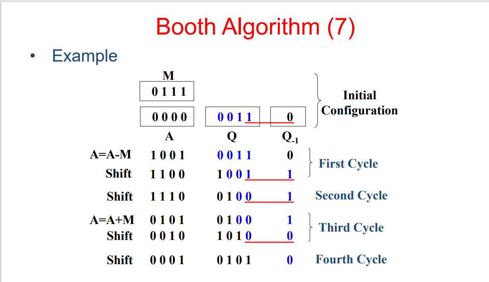

> 计算机组成原理复习文档（初稿），由 val213 编辑整理。仅供学习交流使用！
---
# overview
## 什么是 architecture 什么是 organization？
**organization is the architectural specification.**

**organization is the hardware details that are transparent to programmer such as instructions set……**

`peripherals` 外设

`transparent` 透明的，意即是`do not care`

example：family computer have **the same computer architecture and different organization.**

## 课程教材：计算机组成和嵌入式系统
### 参考书目：
《计算机体系结构与性能设计》
《计算机体系结构与与结构化方法》
《计算机组成与软硬件接口》
### 考核
6（期末考试，卷面必须过）+2（实验签到和实验报告）+2（作业和考勤）
### 计组是重难科目！
- 不过原理类科目有点像死知识。很偏硬件。不要死记硬背，不会考名词解释。
- 难点：要有整机概念，不同部件的组成和工作原理，各个部件之间是如何联系起来工作的
- 实验课：以前是实验箱，现在是模拟硬件电路的软件（体力活，考眼力）
- 不要把计算机组成原理作为纯粹的硬件课程来学习
---
# 第 1 章-计算机的基本结构
（考过简答题：列出计算机的五大部件）
## 1.1 Computer Types
### Embedded Computers
### Personal Computers
### Servers and Enterprise system
是能被大量用户共享的大型计算机，可以包含大型的数据库，为政府和商业组织提供信息处理服务
### Super computers and Grid Computers（超级计算机 和 网格计算机）
通常提供最高的性能。
超级计算机用于天气预报、工程设计与仿真以及科研等对计算要求极高的领域中。超级计算机需要很高的成本。
更加经济的网格计算机其实就是一组合作解决问题的计算机，大量物理上分散的个人计算机和磁盘存储单元物理地存储在高速网络中。形成一个分布式系统。不同于普通的互联网。通过并行运行来提供高性能。
### Cloud Computer
## 1.2 functional units

### basic function units of a computer
1. ALU
2. Control Unit 
3. Memory
4. Input Unit
5. Output Unit
   
ALU 和 control unit 构成 porcessor；

input 和 output 构成 I/O unit；

memory 构成 memory unit；

这些 unit 通过 international network 连接起来。

#### primary memory（main memory）主存

store  programs when they are being executed

主存由大量的半导体单元 cell 组成，每个 cell 能存储一位二进制信息。cell 们按照固定的大小的组进行处理，这个组叫做word。word 的长度，也就是**计算机的字长——word length** 一般有 16，32，64bits。

每个特定的 **word** 都有一个称为 **memory location （存储单元）的地址**，从 0 开始。所以只要向主存发出一条开始进行存储或检索过程的控制命令，就能对该字进行访问了。

任何单元在指明了地址后都能在一个很短的固定时间内访问到的存储器，都叫做**随机访问存储器 RAM**。访问一个字所需要的时间叫**存储器访问时间（memory access time）**。这个时间与所访问的字的位置无关。

#### cache memory 高速缓存
高速缓存的目的是为了 **提高指令的执行速率**。

tips：**main memory** 和 **cache**才叫内存，机箱里俗称的内存条其实是外存
#### secondary memory 辅助存储器（外存）

#### 什么是 RAM？
random access memory 随机存取存储器。
cache 和 primary memory 都是 **RAM**。


## 1.3 Basic operationa concepts

fetch: 完成指定操作的指令从存储器中取出，然后送入处理器中，用作指令操作数的数据也存储在存储器中。
读取地址标签 LOC 所指向的存储单元的内容，然后装入处理器寄存器R2 中。

#### 指令的构成
- opcode 操作码，如 add，load，store 等。
- address，如 R2，是寄存器的地址；如下面例子中的LOC，主存中的地址。
- 例如：$load R2,LOC$
#### 指令的执行
fetch instuction from the main memory into the IR,

> **instructions register(IR)指令寄存器**：保存当前正在执行的指令。


read the operand at LOC and load it into register R2
一条指令执行完成之后， PC 自增，指向下一条指令。

> **program counter(PC)程序寄存器**：包含下一条即将被读取和执行的指令的存储器的地址


> **general register 通用寄存器**：他们的功能有很多，包括保存从存储器中载入的待处理的操作数


- $ADD R4,R2,R3$
Ｒ4 是目的操作数，R2.R3 是源操作数，这个顺序不同体系结构可能不一样。

add 不涉及存储器的操作，都在处理器内部，并且add 内部也有寄存器，用来存储操作数。
$store R4,LOC$
这条指令将 R4 中的操作树复制到存储单元 LOC 中。单元 LOC 中的原始内容被覆盖，R4 的原始内容被保存了下来。
注意store 很特别：目的操作数地址和源操作数地址的顺序和别的指令不一样。他是先原操作数，再到目标操作数。
操作数依赖？
store 和 load 是相反的操作。

interrupt，当收到中断信号的时候，完成当前所在的 fetch cycle 和 execute cycle 后，执行 interrupt cycle，保存当前处理器的状态在存储器中（其实就是保存 PC 的内容）。当中断服务程序完成时，继续执行后续指令。

Tips：
register file：一组寄存器
## 1.6 性能
### 技术
超大规模集成电路（VLSL）技术
### 并行性
#### 1 指令级并行
连续指令的步骤重叠执行，比如正在进行
#### 2 多核处理器
单个 CPU 上可以放置多个处理单元（core）
#### 3 多处理器
- 共享存储器多处理器
- 消息传递多计算机
### 发展历程
第二代计算机：
1955-1965 AT&T transistor

IBM 捐赠了华工几台大型机：五山大型机390、大学城图书馆 7 楼，大型机z900 坏掉了
### Program Execution
- Execute instructions specified in the program
the processor reads(fetch) instructions from memory 1 at time and execute each instruction.Program execution consisit of repeating the process above.

instruction consisit of Opcode and Address.

- instruction cycle

- instruction cycle with interupt

---


# 第 9 章-算术运算（arithmetic）
## 基础数制知识
- 符号位拓展sign extension：在原有的数前面补上符号位，使得数的位数改变到指定的位数。这样代表的数值不变。
  例如-18（11101110->11……11 1101110）
- 补码和补码进行加减法运算结果也是补码表示的。补码转换为十进制数的方法是：如果符号位为1，就先求出其反码，然后再加1。如果符号位为0，就直接转换为十进制数。
### quiz结论
- the two's complement system is the most effcient method for representing addition and subtraction in a computer.
- the range of an 8-bit signed 2's complement number is -128 to 127.
- given the 8-bit binary number 10011101,what decimal number does it represent using the 2's complement system? -99
- given the 8-bit binary number 10011101,what decimal number does it represent using signed magnitude() system? -29 
## 加法部件
### 半加器
- s=xor(x,y)=x⊕y 
- c=and(x,y)=x∧y
### 全加器
- $s_i=xor(x_i,y_i,c_i)=x_i⊕y_i⊕c_i$
- $c_{i+1}=or(and(x_i,y_i),and(x_i,c_i),and(y_i,c_i))=x_i y_i+x_i z_i+y_i c_i$
## 行波进位加法器ripple carry adder
类似于串行，由一组n个全加器级联而成，每个全加器的进位输出连接到下一个全加器的进位输入。最后一个全加器的进位输出被丢弃，因为它不需要参与运算。
### 整数运算溢出检查

$s_i=x_i\otimes y_i \otimes c_i$

$c_{i+1}=y_i c_i+x_i c_i+x_i y_i$

可以证明当**前后进位不同时就发生了溢出**：$c_n\otimes c_{n+1}$
### gate delay
门延迟：门电路的输出从输入发生变化到输出发生变化所需要的时间。

假设or、and、xor的门延迟都是T，那么一个n位的行波进位加法器的$c_{n-1}:2(n-1)T$，$S_{n-1}:2(n-1)T+T=(2n-1)T$，$c_n:2nT$。


## 先行（超前）进位加法器carry lookahead adder
### 生成函数和传播函数
每个位段包含**一个与门**来生成$G_i$,**一个或门**来生成$P_i$,**一个三输入的异或门**来生成$s_i$.

$G_i=x_i y_i$

$P_i=x_i+y_i$

$c_{i+1}=G_i+P_i c_i$

后来观察发现，$G_i$ 和 $P_i$ 可以用更简单的方式来表示：

$P_i=x_i \otimes y_i$，因为只有当 $x_i$ 和 $y_i$ 都为 1 时，与$x_i+y_i$不同，此时$G_i=1$，$P_i$的值无关紧要。

对级联结构加以改进，进一步减少延迟：
### gate delay
#### delay of 4-bit CLA
- **all carries can be obtained 3 gate delays** after the input signal $X$,$Y$,$C_0$ are aplied;
- **all sum can be obtained 4 gate delays** after the input signal  $X$,$Y$,$C_0$ are aplied;
#### build longer CLA(每一个四位的CLA作为一个模块)
- $c_8$：$3T+2T=5T$;
- $c_{12}$：$5T+2T=7T$;
- $c_{16}$：$7T+2T=9T$；
- $c_{28}$：$3T+(6\times 2)T=15T$
- $s_{27}$：$15T+T=16T$
- 也就是说，更大型的由四位CLA组成的加法器，有$C_n=3T+2 (\frac{n}{4}-1)T$,$S_{n-1}=C_n+T$


## 乘法
### 无符号
#### array阵列乘法器（不考，了解）
#### sequential顺序乘法器（考）
两个 n 位数的乘法可以在一个使用单个 n 位加法器的顺序电路中实现。

顺序乘法电路：

- 寄存器 A（部分乘积和 $PP_i$）。初始时候 $PP_0$ 是 n 个 0；
- 寄存器 Q（乘数） 移位寄存器。

C（进位）、A、Q **级联**算数右移；

如果逻辑右移后的乘数Q的最低位是1，那么M （被乘数）加到（初始/右移后的） A 上；如果逻辑右移后的乘数Q的最低位是0，就不加。（控制A加不加M）

n位数乘法则重复n个周期。

n个周期之后乘积的高位部分保存在寄存器A中，低位部分保存在寄存器Q中。

多路复用器 MUX 选择 0 或者被乘数加到 $PP_i$ 上，从而产生 $PP_{i+1}$。

如图：

### 有符号数乘法
首先，考虑正乘数和负被乘数的情况。当我们将负的被乘数加到部分积时，必须将被乘数符号位的值扩展到乘积的最左边。如果前面讨论过的硬件能被扩大以提供部分积的符号扩展，那么它就可以接受负的被乘数。

注意，这个符号位拓展的要求在Booth中也是有的。
#### Booth 算法（重点）
对于正负乘数都友好的技术：Booth。用统一的方式对待正负补码形式的 n 位操作数。结果会生成2n位的乘积。


 
从右往左扫描乘数（扫描的时候还是对照原来还没编码的部分哦，而且是有重叠的），根据一套规则把连续的 1 进行重新编码（skipping over 1s），10 和 01 的第一位变成-1 和 1，11 和 00 变成 0（都是每次只变左边那一位）。
**这样做的好处是当乘数中包含大块的 1s 区域的时候效率很高。但是其实最坏的情况下（10 交替）反而会产生更多的求和项。**


编码后进行具体操作的时候，**遇上乘数是-1 的时候，部份乘积则要加上他的补码**（其实+1 也要，只是正数的补码是他自身）。
##### Booth的硬件实现（课本上好像没有，看课件的）

以四位数乘四位数为例，首先需要把**四位数的乘数Q扩展成（8+1）位数**。往前是零拓展四位，往后是最后一位空出来初始化为0，作为$Q_{-1}$（1-bit register placed logically to the right of the least significant bit $Q_0$）。

但是**被乘数M**还是四位不变。

然后每次都是先**算数右移**，然后**要根据最高位来在它前面补0或者补1**，并不是一股脑的补0。然后算术右移之后，我们就可以**看最后两位，就是 $Q_{0}$ 和 $Q_{-1} $**，一共有四种组合：00、11、01和10。

- 如果是00和11的话，就不需要进行加或减的操作，直接进入下一个循环，意即为当前循环只需要完成一个算式右移就结束了。
- 如果是**10**的话，就要**相减**（A=A-M），也就是加**M的相反数的补码**，然后再进行算术右移。
- **01**的话就要**相加**（A=A+M），然后再进行算术右移。
以上便是一个周期。有几位数就有几个cycle，四位数的乘法就要做四次这样的运算循环。

在最后一次周期结束之后，把前八位数，就是除了$Q_{-1}$的寄存器A+寄存器Q中的数都提取出来，就是乘法最终的答案。

## 快速乘法（不讲，不考）

## 除法器
建议直接看运算案例和规则，课件上抽象的描述极其繁琐，不利于理解。

### 恢复余数的除法（不考，和恢复余数的除法对比来看）
通俗来说就是拿被除数和除数来**相减****（加上除数负数的补码）**，如果结果最高位是1，说明溢出，商取0；相对应的如果结果最高位是0，说明没有溢出，商取1。

（1）然后如果是溢出的情况，就把结果加上除数的补码，所谓恢复，就是得到执行减法之前的那个被除数（其实也是不需要运算的，直接抄下来就行）。

（2）如果是不溢出的情况，就暂时不用管。

然后开始左移除数，重复上述操作，直到取得的商的位数满足字长要求。
### 不恢复余数的除法（考）
也叫加减交替法。为什么叫加减交替呢，因为对比起恢复余数的除法，这个方法不需要恢复余数，而是直**接在被除数上进行加减操作。而且溢出和不溢出都用加或者减进行处理，所以叫加减交替法**。

一开始和恢复除法一样，被除数加上除数相反数的补码，然后判断是否溢出，**如果溢出(结果最高位是1)，商（左移后Q末尾留空的那一位）取0；如果不溢出(结果最高位是0)，商（左移后Q末尾留空的那一位）取1**。


**如果刚刚取的商是0，就加上除数绝对值的补码(add)；如果是1，就加上除数相反数的补码(subtract)。**

重复上述操作，直到取得的商的位数满足字长要求。从上到下读取方框里的数，那就是商（quotient）。

求余数：最后的运算结果加上原本的被除数就是余数（remainder）。

看课件的图。
#### 例题
5.	常规乘除法器乘、除运算过程采用部分积、余数左移的做法，其好处是 **节省加法器的位数**


## 浮点数
### 定点数(不考)
### 浮点数（不考）
### IEEE 754 标准
#### **S（sign）**：符号位，0代表正数，1代表负数。1位。

#### **E（exponent）**：指数位，用**移码**表示，移码是指在原码的基础上加上一个固定的数，比如8位移码，就是在原码的基础上加上10000000，这样做的好处是可以把负数的指数也表示出来，而且可以用移码的大小来比较两个数的大小。IEEE规定单精度浮点数的指数部分占8位，双精度浮点数的指数部分占11位。

127和1023都是bias偏置位。


E 是指浮点数表示中的指数部分，其范围取决于浮点数标准和位数，而 e 是实际的指数值，其范围取决于具体的浮点数值和表示。偏置值用于将 e 和 E 相互转换。(课本上是用E来表示这里的e,E'来表示这里的E)

- 例如：E = 10010101（二进制）表示指数部分的位表示，但实际的指数值 e = 10010101（二进制） - 127 = 22（十进制）。也就是说，在这个示例中，E 表示的是指数部分的二进制表示，e 表示的是实际的指数值。


- E的取值范围：单精度：$1\leq E\leq 254$，双精度：$1\leq E\leq 2046$。（因为0和255/1024被当作特殊位了）
- 从而e=E-127或者E-1023的取值范围是：$-126\leq e\leq 127$，$-1022\leq e\leq 1023$。
- 如果来一道题，规定了新的位数，比如7=1+3+3，excss-3格式，那么他表示的E的范围是：$1\leq E\leq 6$，那么e的范围就是$-2\leq e\leq 3$。


#### **M(magnitude?mantissa?)**：尾数位，也叫有效数字，用原码表示，因为要表示小数，所以要用原码。*32-1-8=23位；64-1-11=52位。*


- 浮点数的尾数部分溢出不是真正的溢出，可以通过位移来解决。指数部分的溢出才是真的溢出。


按照IEEE 754规范，浮点数的表示方式可以写成：**$(-1)^S * 2^(E - 127) * 1.M$**，其中M是尾数部分的二进制表示，**1.M表示的是一个大于等于1小于2的数，所以尾数部分的第一位总是1。**
#### 单精度
Magnitude of numbers that can be represented is in the range:
$2^{-126}(1.0)$ to $2^{127} (2-2^{-23})$

其中$E=e+(2^{8-1}-1)=e+127$
#### 双精度
Magnitude of numbers that can be represented is in the range:
$2^{-1022}(1.0)$ to $2^{1023} (2-2^{-52})$
其中
$E=e+(2^{11-1}-1)=e+1023$
#### example
- Using 32-bit IEEE 754 single precision floating point format, show the representation of -0.6875.
- Solution:
>$0.6875 = 0.1011×2^0 = 1.011×2^{-1}$
>
>M = 01100000000000000000000
>
>E = e + 127 = -1 + 127 = +126, 表示为: 01111110
>
>所以-0.6875表示为: 1 01111110 01100000000000000000000
#### special values
#### zero
- S=0/1,E=0,M=0(0.M) Value=±0
An exponent field of zero is special; it indicates that there is no implicit leading
1 on the mantissa.
#### Infinity
- Operation that overflows
– E.g., 1.0/0.0 = 1.0/0.0 = + infinity
- S = 0/1, E = 255 or 2047, M = 0
Value = ±infinity
#### NaN (Not a Number)
- Represents case when no numeric value can be determined
– E.g., sqrt(–1),
- S = 0/1, E = 255 or 2047, M ≠ 0
Value = NaN
## 浮点数运算(FP arithmetic)
### 对齐（alignment）
如果浮点数的指数不同，是有必要统一的。这个过程叫做对齐（alignment）。
### 加减乘除
#### add/subtract
For IEEE Single Precision Floating-point Numbers
- 1. Choose the number with the smaller exponent and shift its mantissa right a number of steps equal to the difference in exponents.
- 2. Set the exponent of the result equal to the larger exponent.(1、2步对齐)
- 3. Perform addition/subtraction on the mantissas and determine the sign of the result.（对尾数进行加减）
- 4. Normalize the resulting value, if necessary
#### multiply（不需要对齐）
For IEEE Single Precision Floating-point Numbers
- 1. Add the exponents and subtract 127.（指数相加并减去 127。）
- 2. Multiply the mantissas and determine the sign of the result.（尾数相乘并确定结果的符号。）
- 3. Normalize the resulting value, if necessary.
#### divide（不需要对齐）
For IEEE Single Precision Floating-point Numbers
- 1. Subtract the exponents and add 127.（指数相减并加上 127。）
- 2. Divide the mantissas and determine the sign of the result.（尾数相除并确定结果的符号。）
- 3. Normalize the resulting value, if necessary.
### 浮点数运算的一些问题
#### 保护位（guard bits）
– 为了提高浮点计算的精度，使用保护位。
– 尾数中保留的附加位称为保护位。
– 保护位用于用 0 填充尾数的右端。
– 在中间步骤中保留保护位非常重要。 这可以保证最终结果的最大准确性。
#### 截断(truncation)
– 尾数限制为特定长度（23 位/单精度、52 位/单精度）
– 算术运算可能会产生精度更高的尾数
– 在存储浮点数之前，必须丢弃多余的位⇒截断
– 截断方法应该是无偏的
  - 误差相互补偿
– trucation methods:
  - chopping
  - 冯诺依曼舍入von neuman rounding
  - 四舍五入rounding
##### chopping
– 删除保护位并且不对保留位进行任何更改。
– 易于实施
– 有偏差，因为所有值都四舍五入到较低的尾数值
– 在保留位的最低有效位置，chopping误差范围从 0 到几乎 1。
– 不是最佳方法！
##### von neumann(冯诺依曼) rounding
- 区分"精确表示"和"四舍五入到下一个奇数边界"：
1. 如果要删除的位全为 0，则直接将其丢弃，不删除对保留位的更改。
2. 如果要删除的**任何位为 1**，则该位的最低有效位保留位设置为 1。
- 仍然比较容易实施
- 无偏见，四舍五入平均分配给正数和负值
- 误差范围在 – 1 和 +1 之间保留位的 LSB 位置。
- 比 chopping 更好，绝对误差更高
##### rounding(四舍五入)
- 四舍五入将值映射到其最接近的可表示值,区分三种情况。总结一句话就是按照MSB、any和LSB的优先级顺序来判别是否有1。
1. 被截断的尾数部分的**MSB为零**⇒执行chopping
2. 截断尾数部分的 **MSB 为 1，任何其他要截断的位为1** ⇒ 保留的 LSB 加 1
3. 截断尾数部分的 **MSB 为 1，所有其他要截断的位均为零**：
  - 如果保留的 **LSB 为零**则进行chopping
  - 如果保留的 **LSB 为 1**，则将其加 1
- 相对来说实现起来需要花更多功夫
- 无偏，四舍五入均匀分布到正值和负值
- 保留位的 LSB 位置的误差范围为 – 1/2 至 + 1/2。
#### 标准化
- IEEE 单精度归一化 FP 数
  - E 不等于 000…0（8 位）且 E 不等于 111…1（8 位）
  - E 用偏置值进行编码
  - 标准化有效位数为 1.M
- 如果数字未标准化，则始终可以通过移动尾数和调整指数将其置于标准化形式。
#### 溢出
随着计算的进行，可能会生成一个不属于正常数字可表示范围的数字。
- 指数溢出
  - 正指数超过最大可能指数值。
  - 示例：在 IEEE 单精度中，e > 127
  - 在某些系统中，它可能被指定为正无穷大或负无穷大。
- 指数下溢
  - 负指数小于可能的最小指数值。
  - 示例：在 IEEE 单精度中，e < – 126
  - 这意味着数字太小而无法表示，可能会报告为0。
- 尾数溢出
  - 两个相同符号的尾数相加可能会导致最高有效位进位。
  - 如果是，则结果的尾数右移并且指数递增。
-  尾数下溢
  - 在对齐尾数的过程中，数字可能会从尾数的右端流出。
  - 这可以通过使用保护位和某种截断方法来解决。
### 例题
>把-1.7表示为12位浮点数（用于练习简易而采用的标准），（1+5（偏移量为15）+6）。
1. 首先提取符号位1.然后把1.7转换为二进制浮点数：1.7=1.1 0110 0110（0110无限循环）。
2. 然后尾数保留6位，用rounding方法截断，得到1.10011。
3. 注意到规格化的指数为0（小数点需要移动的位数为0），偏移为15（01111），则5位指数位为01111。
4. 综上，用12位标准表示的-1.7：1 01111 011011


# 第 8 章-存储器系统（the memory system）
## 8.1 基本概念
- 处理器和存储器之间的连接由**地址线、数据线和控制线**组成。
  处理器通过**地址线**向存储器发送**地址（memory location）**，通过**数据线**向存储器发送**数据**，通过**控制线**向存储器发送**控制信号**（指示**读or写**以及**传输一个字节还是一个字**，同时提供**必要的时序信息**，也可以**被存储器用来指明它何时完成所请求收的操作**）。
- **存储器访问时间**和**存储器周期时间**
  前者指的是开始传输一个数据字到结束传输所需要的时间，后者指的是两次连续的访问之间所需要的时间。由于存储器具体的实现细节，存储器周期时间通常大于存储器访问时间。
- 什么是word？
  Each group of fixed size of bits is referred to as a word.
- word length？
  The number of bits in each word is referred to as word length.It typically ranges from 16 to 64 bits.
- 什么是块传输？
  一次性传输多个字节或字的操作。
- 为什么要块传输？
  - 为了提高存储器的带宽，减少存储器的访问时间。
  - 为了减少处理器和存储器之间的通信次数，提高系统的效率。
- 大小端
  - big-endian: the lower byte addresses are used for the more significant bytes (the leftmost bytes) of the word.
  - little-endian: the lower byte addresses are used for the less significant bytes (the rightmost bytes) of the word.
- accessing method:
  - Sequential Access,
    - Memory is organized into units of data, called records.
    - If current record is 1, then in order to read record N, it is necessary to read records 1 through N-1.
    - The time to access an arbitrary record is highly variable.
    - Example: Magnetic Tape
  - Direct Access, 
    - Individual blocks or records have a unique address based on physical location.
    - Access is accomplished by direct access to reach a general vicinity plus sequential searching, counting or waiting to reach the final location.
    - Access time is variable.
    - Example: Magnetic Disk
  - Random Access
    - Any memory location can be selected at random and directly addressed and accessed.
    - The time to access a given location is independent of the location’s address and is constant.
    - Example: Semiconductor RAM Memory
- volatile/nonvolatile（易失/非易失）, Information decays naturally or is lost when electrical power is switched off.
- erasable/nonerasable（可擦除/不可擦除）,The contents of the memory can/can't be altered.
- Capacity
  For main memory, **If memory capacity is 4K×8, then its word size is 8, and the number of word is 4K.**
### cache memory 和 virtual memory

对cache memory的介绍省去了，这里简单介绍一下**virtual memory**。


使用虚拟内存只需要将**程序的活动部分存放在主存储器中**，**剩余部分存放在较大容量的辅助存储设备中**。程序段在主存储器和辅助存储设备中间来回传输。但是这对应用程序来说是transparent的，因此应用程序看到的存储空间比实际的主存储器中的物理存储空间大得多。

> *用于管理和扩展实际物理内存（RAM）的可用性。它允许程序在运行时使用比实际物理内存更大的地址空间，将数据从磁盘等辅助存储器中加载到内存中，从而提供更大的可用内存容量，使得大型和复杂的程序能够运行而不会受到内存限制的限制。虚拟内存的优势在于它允许多个程序同时运行，而不受物理内存大小的限制。然而，虚拟内存的使用可能会导致性能下降，因为磁盘访问速度比内存慢得多。因此，在设计和开发程序时，需要考虑内存使用情况，以最大程度地减少对虚拟内存的依赖。*

### 块传输
实际上在主存和cache、主存和辅助存储器之间的数据传输都是**以块传输的方式**进行的。主存和图形显示器或者以太网接口这样的高速设备之间的数据传输也包含大块的数据。**因此主存性能的一个关键参数就是其高速读写数据块的能力。**

## 8.2 半导体随机访问存储器RAM
### 8.2.1 存储器芯片的内部组织结构
存储器单元通常按照阵列的形式构成，其中每个cell存储1bit的信息。

联想一下word的概念，word的长度是固定的，但是存储器的长度是可变的，存储器的长度是以word为单位的。

**字线（word line）** 由**芯片的地址译码器**驱动，把**一行中的所有cell**连接到一起。

**每一列的cell**通过**两条位线（bit line）**连接到**读出/写（Sense/Write）电路**上，这个电路再连接**到芯片的数据输入/输出线**上。

即：row 行word line(字线是字与字之间)，Colum 列 bit line（位线是位与位之间）。

还有**两条控制线 R/W和CS**，前者输入请求的操作，后者用于选择芯片（片选），可以在多芯片存储器系统选择一个给定的芯片。

#### 外部引脚
**地址总线**：位数与**存储单元个数**n为$2^n$关系，用于选择存储单元
**数据总线**：位数与存储单元**字长**相同，用于传送数据信息


### SRAM
#### the advantage and disadvantage of SRAM?
- Advantage: Fast
- Disadvantage: Low density, High cost
#### Organization of SRAM Chips 
- 16 × 8 SRAM
  存储了 128 位数据，需要为地址、数据和控制提供14条外部连接线(4+8+2)。它还需要两条线(+2)用于电源支持和接地(一共16条)。
- 1k × 1 SRAM
  1K(1024)个存储器单元可以被组织成128 x 8的阵列，总共需要 19（19=7+8+4） 根外部连接线。换一种方式，我们还可以把这个电路组织成1Kx1的形式。在这种情况下，需要 10位地址，但只需要一根数据线，因此共需要 15 （15=10+1+4）根外部连接线。
### DRAM
#### Advantages
- High density, low cost
#### Disadvantage
- Longer access times
- Leaky, needs to be refreshed
- Cannot be easily integrated with CMOS
#### Organization of DRAM Chips 
- 32M × 8：（$1M=2^20$）存储器单元被组织成16Kx16K的阵列，需要 23（23=20+1+2）根外部连接线。每行的16384个单元被分成2048 组，每组8个单元，从而形成2048字节的数据。选择一行需要 14位地址，**在一个选定的行中指定一个8位的组还需要 11 位地址。**因此，在这个存储器中访问一个字节总共需要 25 位地址，高14位和低11 位分别构成一个字节的行地址和列地址。为了减少外部连接的引脚数，行地址和列地址多路复用 14 根引脚在读或写操作期间，行地址首先被加载。芯片响应被称为行地址选通(RAS)的输入控制线上的脉冲信号，把行地址装人行地址锁存器中。这将导致一个读操作开始，选定行中的所有单元被读取和刷新。
#### Synchronous DRAM(SDRAM)半导体
- Latency and Bandwidth are two parameters indicating the performance of a memory system.
- Latency: Refers to the amount of time it takes to transfer a word of data to or from the memory.
- Note: In block transfers, latency is used to **denote the time before it takes to transfer the first word of data.**
##### Bandwidth
- The number of bits or bytes that can be transferred in one second is referred to as bandwidth.
- Unit: bit per second or byte per second.
- The bandwidth of a memory unit depends on the speed of access to the stored data and on the number of bits that can be accessed in parallel.
- The effective bandwidth also depends on the transfer capability of the links that connect the memory and the processor.
- Effective Bandwidth = Bus Speed × Bus Width
#### SDRAM brust operation
SDRAMs have several different modes of operation, which can
be selected by writing control information into a mode register.
- The burst operations use the block transfer capability.
- The mode register holds a 12-bit value that the SDRAM looks at in order to determine how many columns it should BURST and in what order it should BURST them.
##### 例题
- brust length: 如果脉冲长度为8，连续传输8个字，传输一次需要8个时钟周期
- Assume that 32 bits of data are transferred in parallel. If a 400-MHz clockis used, how much time does it take to transfer。每一次有32位数据并行传输
- 8*32bits=8*4bytes=32bytes
- 行列转换激活需要额外的2个时钟周期
- 最开始传输的时候还有lantency，需要5个时钟周期
#### quiz
- 某一DRAM芯片，容量为64K×1，除电源线、接地线和刷新线外，该芯片的最小引脚数目应为多少？
- $64K=2^16$ ，**由于地址线引脚只引出一半，因此地址线引脚数为8（注意这是DRAM特有的）**。数据线引脚数为1 (有的芯片数据输入线与数据输出线是分开的，则数据线引脚数就为2)。
- 它**有R/W信号，而没有CS信号**。它有**行地址选通信号RAS和列地址选通信号CAS**。综上所述，除电源线、接地线和刷新线外，该芯片的最小引脚数目应为12。


### strucue of large memory system

#### static memory system
8K*32 SRAM：
- 地址线：2^(3+10)->13根
- 数据线：32根

##### 字拓展&位拓展
位拓展和字拓展是存储器容量扩充的两种方法，它们的目的是利用多个存储芯片构成一个更大的存储器。

- **字拓展**是指在每个单元的位数不变的情况下，增加总的单元个数，也就是增加地址总线的宽度。(增加的是×前面的数字)
- **位拓展**是指在存储单元数不变的情况下，增加每个单元的位数（字长），也就是增加数据总线的宽度。(增加的是×后面的数字)


例如，如果我们要用$1K\times4$的SRAM芯片构成一个$1K\times8$的存储器，我们可以采用**位拓展**的方法，将两个$1K\times4$的SRAM芯片**并联**，其中一个芯片提供低4位数据，另一个芯片提供高4位数据，地址线和控制线直接连接。这样，我们就可以实现每个单元由4位扩展到8位，而单元个数仍然为1K。

如果我们要用$1K\times8$的SRAM芯片构成一个$2K\times8$的存储器，我们可以采用**字拓展**的方法，将两个$1K\times8$的SRAM芯片**串联**，其中一个芯片存储低1K地址空间，另一个芯片存储高1K地址空间，**数据线直接连接，控制线直接连接**，地址线中低10位直接连接，高1位用来产生片选信号（如果芯片拓展的更多，可以让高位经过译码器来进行片选）。这样，我们就可以实现单元个数由1K扩展到2K，而每个单元仍然为8位。

如果我们要同时进行位拓展和字拓展，我们可以先进行位拓展，形成满足位要求的存储芯片组；再使用存储芯片组进行字拓展。例如，如果我们要用$1K\times4$的SRAM芯片构成一个$2K\times8$的存储器，我们可以先将两个$1K\times4$的SRAM芯片进行位拓展，形成一个$1K\times8$的存储芯片组；再将两个$1K\times8$的存储芯片组进行字拓展，形成一个$2K\times8$的存储器。


#### dynamic memory system
基本和static memory system一样。

Packaging: Memory Modules
- Memory module: Assembly memory chips on a small board
that plugs into a socket on the computer’s motherboard
  - SIMM(single in-line memory module)
  - DIMM(dual in-line memory module)

## 8.5 存储器层次结构
Quiz
1. A memory hierarchy __C___.
- A. limits programs' size but allows them to execute more quickly
存储器层次结构不会限制程序大小
- B. is a way of structuring memory allocation decisions
存储器层次结构不是一种存储器分配方式
- C. takes advantage of the speed of SRAM and the capacity of disk
存储器层次结构利用了SRAM的速度和磁盘的容量，给用户造成存储器速 度快、容量大的假象
- D. makes programs execute more slowly but allows them to be bigger
存储器层次结构使得程序执行得更快
## 8.6 高速缓存cache
### cache的基本概念
- Cache memories are small, fast SRAM-based memories
managed automatically in hardware.
- Serves as a buffer between CPU and main memory
- Cache line
- cache 和CPU之间的数据传输是以字传输的方式进行的；**cache和主存之间的数据传输是以块传输**的方式进行的。

### cache访问策略
两种策略，先访问cache，没有命中再去访问内存，或者同时访问cache和内存，如果cache命中，就直接返回，如果cache没有命中，就从内存中取出数据，同时把数据放到cache中，下次访问的时候就可以直接从cache中取出数据了。

cache和内存同时访问，花费的平均时间更短。

1. 高速缓存命中：所需要的数据在cache中
2. 高速缓存失效：所需要的数据不在cache中
3. 高速缓存命中率：高速缓存命中次数/总访问次数
### 8.6.1 Mapping Scheme映射功能
那么就有个问题，如何区分是内存的哪一块数据呢？

采用**标记+有效位的方法**。标记是主存块的块号，有效位(vaild bit)用来指示cache中的数据是否有效。所有的映射策略都在cache中对每一行做了标记，也就是**主存块的块号**，称为`tag`，**每一块中不同字又用`word`来区分**。在此基础上不同映射策略有其他的标志位划分。

需要注意的是，主存分块后每一块包含字的数量应该和cache行包含的字数相同，这样才能保证主存块和cache行之间的数据交换是整块进行的。这在一些运算的考察中也有用到。

word的位数w，也就是对每块中的字数$k$取对数,$2^w=k$。
#### 直接映射（Direct Mapping）
同一块主存的块只能映射到固定位置：**主存块在cache中的位置=主存块号 mod cache总行数。**

在二进制中，取模操作的本质其实就是**取低位**,主存块号（s）末尾几位（r）直接决定在cache中的行号。

例如cache有m行,$m=2^r$,模$2^r$,那么其实就是等价于最后r位的信息已经通过在cache里的位置表示出来了，所以只需要把剩下的前（s-r）位作为tag即可。

主存中每个字的地址编码：tag（s-r bit）、line（r bit）、word（w bit）：

在这种操作规则下，cache的总行数$m=2^r$,r其实就可以作为line的位数来表示cache中的行号。

访问的时候直接先根据r位的line号找到对应的行，然后再比较tag，如果tag相同，就说明命中了，如果tag不同，就说明没有命中。

**tag唯一标识主存块,tag相同的块会被一起放进cache哦！！**。

直接映射的特点是查找标记速度最快，但是cache利用不充分，命中率低。

##### Advantages
- Simple, easy to implement
- Inexpensive
##### Disadvantage
- Fixed location for given block
- If a program accesses 2 blocks that map to the same line
repeatedly, cache misses are very high
#### 全相联映射（Associative Mapping）
随意放。No mapping functions. A main memory block can load into any line of cache

主存中每个字的地址编码：tag（s bit）、word（w bit），可能还会有。**tag唯一标识主存块,tag相同的块会被一起放进cache哦！！**。

cache 存储空间利用充分，命中率高，缺点是查找标记最慢。
##### What are advantage and disadvantage of associative mapping?
- Its advantage is that it gives complete freedom in choosing the cache location in which to place the memory blocks.
- Its disadvantage is that it requires complex circuitry to examine the tags of all cache blocks in parallel.
#### 组相联映射（Set Associative Mapping）、
主存块可以存放在cache**特定分组中的任意位置**。**所属分组=主存块号%分组数量**

The cache is divided into v ($=2^d$) sets, **each of which consists of k lines. ( k-way set associative mapping)**
分为$v=2^d$组，其中**n路组相联映射，代表n个cache行作为一组**。

主存中每个字的地址编码：tag（s-d bit）、set（d bit）、word（w bit）

是前两种方式的折中。

#### quiz
- A set-associative cache consists of a total of 64 blocks divided into 4-block sets.
The main memory contains 4096 blocks, each consisting of 128 words. How many bits are there in a main memory address? 19

- 主存有4096个块，所以需要12位指定块地址；每个块中有128个字，所以需要7位指定字地址。
12+7=19，所以主存地址是19位。
- A set-associative cache consists of a total of 64 blocks divided into 4-block sets. The main memory contains 4096 blocks, each consisting of 128 words. How many bits are there in each of the TAG, SET, and WORD fields?8,4,7
- 主存地址总共19位，word部分7位，cache划分为16个set，故set部分4位，剩下19-7-4=8位是tag部分。
### 8.6.2 替换策略
前面说到cache的存储空间是有限的，当cache满了的时候，访问主存块如果没有命中，就需要替换掉一些数据，以便为新的数据腾出空间。
#### RAND随机替换
  随便选一个主存块替换，太随机了效果很差
#### FIFO先进先出
  选中的主存块是最早进入cache的，效果也不好
#### LRU——"最近最少使用"
  每个cache块都有一个**计时器**，**记录每个cache距离最近一次被访问已经过去的访问周期个数，替换时选数值最大的**。所在的cache块计数器清零，原本比他小的其他计数器都+1，其他保持不变。
  
  $2^n$个cache块，计数器只需要n位。

  **基于局部性原理，最近被访问的主存块很可能在不久的将来还会被访问，所以LRU的效果很好。**

  细节：假如cache只有4块可以保证cache满的时候，他们的值都是0，1，2，3。而且每个cache块的计数数值都是唯一的。

  LRU算法实际效果最好，命中率最高。
#### LFU——"最不常用"
  每个cache块都有一个**计时器**，**记录每个cache块近期被访问的次数，替换时选数值最小的**。

  有可能出现多个cache块计数次数都最多的情况，这个时候还要继续按照序号或者FIFO确定替换哪一块。

  **实际运行效果并不好**，因为最经常使用的内存块不一定未来就一定会继续被使用，例如微信打语音电话，这段时间语音通话的模块内存肯定一直被访问，累计了很多次数，但是一旦挂掉电话，cache中这部分要很久之后才会被替换。

### 8.6.3 写策略
CPU修改了cache中的数据副本，如何保证数据一致性？
#### 写命中（要写入cache命中的块）
##### 全写法（写直通法，write-through）
CPU写数据的时候**直接写入cache，同时写入主存**。
- 这样更能保证数据一致性，也不再需要把cache中的内容写回去主存了。
- 但是访问速度很慢，因为要写两次。

所以一般采用**写缓冲**，用**一个SRAM来暂时存放要写入主存的数据**，然后再写入内存。**但是有限的SRAM容量，如果写很频繁，SRAM饱和，会造成阻塞。**

- Advantage
  - Keeps cache main memory consistent at the same time.
- Disadvantages
  - All writes require main memory access (bus transaction).
  - Slows down the system.If the there is another read request for main memory due to miss in cache, the read request has to wait until the earlier write was serviced.
- 优势
   - 同时保持缓存主内存一致。
- 缺点
   - 所有写入都需要主存储器访问（总线事务）。
   - 减慢系统速度。如果由于缓存未命中而有另一个对主内存的读取请求，则该读取请求必须等待，直到先前的写入得到服务。
##### 写回法（write back）
CPU **只需要先写cache，如果cache中的块被改变了，当这个cache块被推出的时候才同步到主存**。这样写入速度快，但是会造成数据不一致的问题。

需要用一个**脏位**来标记 cache 中的数据是否被修改过，如果被修改过，就要写回主存。没被修改过就不用写回去主存了。

- Advantages
  - Faster than write-through, time is not spent accessing main memory.
  - Writes to multiple words within a block require only one write to the main-memory.
- Disadvantages
  - Portions of main memory are invalid, and hence accesses by I/O modules can be allowed only through the cache.
  - Need extra bit in cache to indicate which block has been modified. Adds to size of the cache.
- 优点
   - 比直写式更快，无需花费时间访问主内存。
   - 写入一个块内的多个字只需向主存储器写入一次。
- 缺点
   - 部分主存无效，因此只能通过高速缓存允许 I/O 模块进行访问。
   - 高速缓存中需要额外的位来指示哪个块已被修改。 添加缓存的大小。

#### 写不命中（要写入cache没有命中的块）
##### 写分配法（write allocate）
把要**写的块调到cache里再进行写操作**。然后常常搭配写回法

##### 非写分配法
非写分配法就**直接对主存上的块进行写操作，不把块调到cache里**。常常搭配全写法。**而且只有读操作才调入cache**。

### 多级cache
在多级cache中，cache之间使用非写分配法＋全写法，最后一级cache和主存之间使用写分配法＋写回法。


### TIPS
- Q1:The effectiveness of the cache mechanism is based on a property of computer programs called _____.
- A1:. **locality of reference(局部性原理)**
- Q2:Which of the following manages the transfer of data between the cache and main memory?
- A2: **hardware（cache-主存系统完全由硬件管理）**
- In direct-mapped caches, there is no choice about which line to evict, since the incoming line can only be placed in one location in the cache.

## 8.7 虚拟存储器
### 页式存储管理
程序在执行的时候是先由**逻辑地址转换为物理地址**的。CPU负责读取进程的操作码和逻辑地址，并进行转换操作。

Relevant Terms
- Physical Memory: memory actually available in the computer.
- Logical or virtual Memory: memory that the OS allows a program to believe it has.
- Physical Address: real location in physical memory; identifies actual storage.
- Logical or virtual Address: conventional addressing used by a program which the OS must translate into a physical address.

MMU (Memory Management Unit): The hardware converts virtual addresses into physical addresses via an OS-managed lookup table (page table).
#### Implementation of Virtual Memory
逻辑地址分为**页号和页内地址**，首先在**快表（tlb,Translation Lookaside Buffer）**中查询是否有对应的页项。如果命中，则把页项对应的主存块号跟页内地址拼接起来，得到所需要的物理主存地址，然后再到cache里去找。

如果在快表中没有命中，则需要根据**页表基址寄存器**拿到页表基地址，再去到**主存**的**慢表/页表**中去执行一次访存，同样为了获得主存中的块号。

与此同时，同样因为局部性原理，CPU还会把当前的页项存到快表中。下一次进行地址转换的时候就能更快。（因为**快表和慢表的关系就有点类似于cache和主存的关系**，一个用SRAM实现小而快，一个用DRAM大而慢。而且快表还是个“相联存储器”，是可以通过内容来查找的）

##### Page Table Entry
  - Page number: Physical page number OR pointer to secondary storage
  - Valid bit (Presence bit): Indicate whether the page is actually loaded in the main memory
  - Modify bit: Indicate whether the page has been modified during its residency in the main memory
  - Use bit (Reference bit): Indicate whether the page has been used recently
  - Access Control bit: Read, write, execute, etc.
### 虚拟存储器
操作系统把程序/进程分页。从辅存到主存，这部分主要是由硬件和操作系统来完成的。

虚拟存储器主要也是由操作系统承担的任务。虚存的作用是解决主存空间不足，其实和cache-主存机制差不多，只不过所在的存储层次不同。

页表的拓展：需要有有效位判断是否已经从辅存加载到主存、脏位来判断是否被改变、需要外存块号来指示辅存中的块号、需要访问位来执行替换策略。

页面替换算法，跟cache的替换策略相同。
- Page Replacement
  - LRU (Needs Use bit)
  - FIFO
  - Software (OS) implementation
- Write Policy
  - Write back
  - Write through is not suitable for virtual memory

#### Disadvantage
- Internal fragmentation problem
  - Last page is unlikely to be full
  - If the page size is n bytes, the average amount of space wasted in the last page of a program by internal fragmentation will be n/2 bytes.

#### Page Size
- Choosing a page size is a question of balancing forces that favor a larger page size versus those favoring a smaller size.
##### Advantages of choosing larger page size
- The size of the page table is inversely proportional to the page size: Memory can therefore be saved by making the pages bigger.
- Transferring larger pages to or from secondary storage, possiblyover a network, **is more efficient than transferring smaller pages**.
##### Disadvantages of choosing larger page size
- A large page size will result in **more wasted storage (internal fragmentation)** when *a contiguous region of virtual memory is not equal in size to a multiple of the page size.*


#### quiz
5. About TLB, which of the following is true?(A,D)
- A. It’s a small cache which consists of a small portion of the page table
- B. When a TLB miss occurs, the operating system must copy the requested page from
the disk into the main memory
- C. TLB misses can only be handled in hardware
- D. Its content is accessed based on the address

9. Under what circumstances do **page faults** occur? Describe the actions taken by the operating system when a page fault occurs.
- A page fault occurs when an access to a page that has not been brought into main memory takes place.
- The operating system verifies the memory access, aborting the program if it is invalid. If it is valid, a free frame is located and I/O is requested to read the needed page into the free frame. Upon completion of I/O, the process table and page table are updated and the instruction is restarted.

#### segmentation(段式存储)
##### Address Structure
- Virtual Address (2 fields):**Virtual Segment Number Offset**
##### Segment Table
- each table entry has
  - Address of start of segment
  - Segment size
  - Some control bits
- Segment Table Base Register: points to the segment table’s location in memory.


- Advantages
  - Resolve internal fragmentation problem.
  - Simplify the handling of data structures that are shrinking or growing.
  - The linking up of procedures compiled separately is greatly simplified.
  - Facilitate sharing procedures or data between several programs.
  - Different segments can have different kinds of  protection.
- Disadvantages
  - Programmer must be aware of the memory model in use (at the assembly level, anyway).
  - The start address is added to the offset, a process much more time consuming than concatenation.
  - Segmentation has a problem called external fragmentation.
  - Segments may be too large to fit in physical memory.

#### Segmentation with paging(段页式存储)
- Take advantage of the best features of both by assigning fixed-size pages within variable-sized segments.
- Each program has a segment table. Each segment has a page
table. This means that a virtual memory address will have **three fields.**
  - Segment number
  - Page number
  - Offset
- Advantages (compared to segmentation)
  - The allocation of segments to physical memory is simpler.
  - It is no longer necessary to explicitly store the size of the segment in the segment table.
  - When the frame number is generated explicitly, it is no longer necessary to add the offset to a generated value.
- Disadvantages
  - Internal fragmentation problem.
  - The time cost of a second level of table lookup.
## 8.10 辅助存储器
### 8.10.1 磁盘存储器
#### 磁盘的组成
每块磁盘含有若干个记录面，每个记录面划分为若干个磁道，每个磁道又划分为若干个扇区。每个扇区（块）是磁盘读写的最小单位。
- 磁头(heads)：也就是记录面数，表示磁盘总共有多少个磁头，磁头用于读写盘片上记录面的数据。一个磁头对应一个记录面。
  - Read/Write Head
    - Fixed Head
      - One read-write head per track
      - Heads mounted on fixed ridged arm
    - **Movable Head**
      - **One read-write head per surface**
      - Heads mounted on a movable arm
- 柱面（cylinders）：每一面盘片上的磁道(track)数。不同记录面的相同位置上的这些磁道组成一个柱面。
  - Each track has the same number of sectors
  - Outer tracks have more sectors. (Applied in large disks)
  - Tracks: 500 ~ 2000 tracks per surface
- 扇区(sectors)：每条磁道上的扇区数。
  - 10 ~ 100 sectors per track
  - Sectors: Typically 512 bytes
- Disk address: (surface number, track number, sector number)
#### 性能指标
##### 容量
- $容量=磁头数\times柱面数\times扇区数\times每个扇区的字节数$
- Disk Access Time
  - Access Time = Seek Time + Rotational Time
##### 磁道寻道时间 Seek Time
- The time required to **move the read/write head to the proper track.**
- Average value : 5ms ~ 8ms.
##### 磁盘旋转时间 Rotational Tim(Latency Time)
- The amount of time that elapses after the head is positioned over the correct track until the starting position of the addressed sector passes under the read/write head.
- Average value: the time for half a rotation of the disk.
##### 数据传输率 Transfer Rate
- $数据传输率=每个扇区的字节数\times每分钟传输的扇区数$

tips:
- 访问同一柱面上的所有磁道都不需要移动磁头
- 每个盘面对应一个读写磁头

## 全章习题总结
- 按字编址/按字节编址
- 主存地址=主存块号+块内地址
- cache entry=
# 第 2 章-指令集体系结构（machine instructions & programs）
## Instruction Formats
- operation code (opcode)
- source operand reference
- result operand reference
### instruction representation
The instruction is divided into two fields
- Operation code field
  - Specify the operation to be performed
- Address field
#### Instruction Address Field Formats
- Zero-address Instruction
- One-address Instruction
- Two-address Instruction
- Three-address Instruction

#### instruction length
- Fixed-length instruction
- Variable-length instruction

##### Variable-length Opcode (Expanding Opcode)
操作码数位和操作数地址的位数相互影响，操作码数位越多，操作数地址的位数越少，反之亦然。

指令长度一定的时候，低位都是操作数地址，所有操作数地址的位数是一致的。高位是操作码，其中n操作数的指令数量是可以人为规定的，这影响了操作码的规则。操作码还承担了标识当前指令操作数数量的作用。因此指令数量一定是奇数，因为要留出一种排列来表示操作数数量。

这里最好看课件的例子，很清楚。
## 指令寻址
确定下一段要执行的指令的存放地址。不管主存是是按照字编码还是按照字节编码，最终都是由程序计数器PC指出的。

每一条指令的执行都分为取指令和执行指令两个阶段，取指令阶段需要访问主存，执行指令阶段不一定需要访问主存。
### 顺序寻址
$(PC)+'1'\rightarrow PC$

这里的‘1’要理解为一个**指令字长**，每一次取指令之后都会变成PC+'1'。

### 跳跃寻址
转移类指令jmp、jg等。
## 数据寻址模式
假设指令字长=机器字长=存储字长。**数据地址=寻址方式（E）加上形式地址（A，contents of an address field in the instruction）**

### 直接寻址（direct addressing\Absolute mode）
$EA=A$

不足是**寻址范围小，只能访问主存中的一部分数据。**

### 间接寻址（indirect addressing）
$EA=(A)$

一共访存3次：
1. 取指令1次
2. 执行指令2次（Instruction execution requires two memory references to fetch the operand: one to get its address and a second to get its value.）

优点：
- 扩大了寻址的范围（有效地址EA的位数大于形式地址A的位数）
- 多次间接寻址便于编制程序有利于子程序返回。

### 寄存器寻址（register addressing）
The operand is the contents of a processorregister; the address of the register is given in the instruction.

$EA=R_i$

Example:  Add R4, R2, R3

优点：
- **指令在执行阶段不访问主存**，只访问寄存器；指令字短而且执行速度快，支持向量/矩阵运算

缺点：
- 寄存器贵，少，**寻址范围也有限**

### 寄存器间接寻址（register indirect addressing）
$EA=(R_i)$，共有2次访存，取指令和执行指令。**操作数在主存单元中**。
优点：
- 比一般的间接寻址要快，但指令的执行阶段还是需要访问主存。
### 隐含寻址（implicit addressing）
不是显式地给出操作数的地址，而是在指令中隐含着操作数的地址。

优点：
- 有利于缩短指令字长
- 需增加存储操作数或者隐含地址的硬件

### 立即寻址（immediate addressing）
用#来表示立即寻址，形式地址A就是数据本身，又称为立即数，一般是用补码形式。

优点：
- 指令执行阶段不访问主存，指令执行时间最短

缺点：
- A的位数限制了立即数的范围，用补码的时候可表示的数据范围是$-2^{n-1}~2^{n-1}-1$。

### 偏移寻址（offset addressing）
偏移寻址是个大类，可以包括相对寻址，基址寻址和变址寻址。区别就在于偏倚的起点不一样。
#### 相对寻址（relative addressing）
$EA=PC+A$。**以程序计数器PC所指的地址作为起点。**和**变址寻址**的区别就在于用PC代替了通用寄存器。

按照课本写法记作$A(PC)$。

把程序计数器PC的内容加上指令格式中的形式地址A而形成操作数的有效地址，即$EA=PC+A$。**其中A是相对于PC所指地址的位移量，可正可负，补码表示。**

优点：
- 操作数的地址不是固定的，随着程序计数器PC的值变化而变化，并且与指令地址之间的差值是固定的。因此便于程序浮动。相对寻址广泛应用于转移指令。

程序浮动我的理解是，程序执行顺序的变化不影响指令的实现，因为地址是相对的。

#### 基址寻址（base addressing）
$EA=(BR)+A$
以程序的起始存放地址作为起点，可以浮动。

有的机器采用专门的寄存器——基址寄存器（BR,base address register）也就是OS中的重定位寄存器。有的机器没有专门的基址寄存器，而是用通用寄存器来实现基址寻址。不过就要在指令中指明用哪个寄存器，至于要用几个bit指明，看通用寄存器的数量。


优点：
- 扩大了寻址范围。

注意：
- 基址寄存器是面向操作系统的，内容由操作系统或者管理程序确定，在程序执行过程中不允许改变。
- 当使用通用寄存器作为基址寄存器的时候，可由用户决定哪个寄存器作为基址寄存器，但是在程序执行过程中不允许改变，内容仍然由操作系统确定。

#### 变址寻址（index addressing）课件上 是indexed mode
程序员自己决定起点。

变址寄存器（IX,index register）
$EA=(IX)+A$

按照课本写法记作$A(R_i)$。


和基址寻址的区别就在于变址寄存器是面向用户的，在程序执行过程中，变址寄存器的内容可由用户改变，会把IX作为偏移量，形式地址A作为基址。

在数组处理过程中，可设定A为数组的首地址，IX为数组的下标，不断改变变址寄存器IX的内容，便可很容易形成数组中任意数据的地址，特别适合编制循环程序。


注意，除了寄存器的值加上一个常数，还可以用第二个寄存器的值存偏移量。课本记作$(R4,45)$，还有两个寄存器加上常数的版本$A(R4,R5)$


#### 基址变址复合寻址（索引寻址）（indexed addressing）
先基址后变址寻址，$EA=(IX)+((BR)+A)$

#### 堆栈寻址（stack addressing）
隐含使用栈顶指针SP作为操作数地址。堆栈是存储器或者专用寄存器组中一块特殊的按照FILO管理的存储区。读写单元地址使用特定的寄存器给出的，该寄存器被称为堆栈指针。指向栈顶元素的地址。

硬堆栈：在寄存器中实现堆栈。不访存。

软堆栈：在主存中划分一块区域作为堆栈。访存一次。

##### 自增寻址（auto-increment addressing）和自减寻址（auto-decrement addressing）
我们在一个特定的寄存器外加括号表示这个寄存器中的内容要用作有效地址。

自增寻址按照课本写法记作$(R_i)+$,也就是在后面加一个+号表示**访问过操作数后递增寄存器的值**。

自减寻址按照课本写法记作$-(R_i)$，在前面加一个-号表示**在把寄存器的值读作操作数地址之前要先递减寄存器的值**。

为什么一个先一个后？这样的原因是更容易用这样的方式去实现一个栈。（隐含使用栈顶指针SP作为操作数地址）

**注意！每次递增/递减，对于一个字节大（8位）的操作数增量是1位，对于16位的操作数增量是2位，对于32位的操作数增量是4位。**

## subroutine子程序
子程序嵌套和处理器堆栈。
### subroutine linkage
链路寄存器（linkage register）LR，用于存放返回地址。
处理器堆栈：用于存放返回地址的栈，也就是LR的栈。

第一次子程序调用之后，LR的内容就是第一次子程序的返回地址，第二次子程序调用之后，LR的内容就是第二次子程序的返回地址（覆盖了）。但是在第二次子程序调用之前，第一次子程序的返回地址就已经被压入了处理器堆栈中，所以第二次子程序执行完之后，可以从处理器堆栈中弹出第一次子程序的返回地址，然后再把LR的内容赋值给PC，就可以返回到第一次子程序的执行位置了。

### Condition Codes
Processor can maintain information on results to affect
subsequent conditional branches

Results from arithmetic/comparison & Move

psw：程序状态字，用于存放程序执行过程中的状态信息，如进位标志（C,carry）、溢出标志（V,overflow）、零标志（Z，zero）、符号标志（N，negative）等。

Condition code flags in a status register:
- N (negative) 1 if result negative, else 0
- Z (zero) 1 if result zero, else 0
- V (overflow) 1 if overflow occurs, else 0
- C (carry) 1 if carry-out occurs, else 0

## RISC和CISC styles
对比表格：
|对比的项目| RISC | CISC |
| ---- | ---- | ---- |
|  指令系统 | 精简 | 复杂庞大 |
|  指令字长 | 指令字长固定 | 指令字长可变 |
|  指令格式 | 指令格式简单 | 指令格式复杂 |
|  指令数目 | 指令数目少，一般少于100 | 指令数目多，一般大于200 |
|  指令执行时间 | 绝大多数在一个周期内完成 | 相差较大 |
|  指令使用频率 | 都比较常用 | 相差很大 |
|  控制方式 | 绝大多数采用组合逻辑控制（效率更高） | 绝大多数采用微程序控制（效率更低） |
|  通用寄存器数量 | 多 | 较少 |
|  允许访存的指令 | **只有load和store** | 都可以，不加限制 |
|  指令流水线 | **必须实现指令流水线** | 可以通过一定方式实现指令流水线 |
|  目标代码 | 目标代码采用优化的编译程序，生成代码更为高效 | 难以用优化编译生成高效的目标代码程序 |

### RISC characteristics include:
- **simple** addressing modes
- all instructions **fitting in a single word**
- **fewer** total instructions
- arithmetic/logic operations on **registers**
- **load/store** architecture for data transfers
- **more instructions executed per program**
- Simpler instructions make it **easier to design faster hardware** (e.g., use of pipelining)
#### 例题
- 下列几项中，不符合RISC指令系统的特点是___B___
	  - A．**指令长度固定，指令种类少**
	  - B．寻址方式种类尽量减少，指令功能尽可能强
	  - C．**增加寄存器的数目，以尽量减少访存次数**
	  - D．**选取使用频率最高的一些简单指令，以及很有用但不复杂的指令**

### CISC characteristics include:
- more complex addressing modes
- instructions spanning more than one word
- more instructions in the instruction set
- arithmetic/logic operations **on memory**
- **memory-to-memory** data transfers
- fewer instructions executed per program
- Complexity makes it somewhat more difficult to design fast hardware, but still possible


## tips
- Q1:In the following addressing mode, which does not belong to RISC style computer?
- A1:indirect addressing mode（间接寻址）

- 区分index和indexed寻址
- 大多数CISC处理器都有所有的五种基本寻址方式（立即寻址、寄存器寻址、直接寻址、间接寻址和变址寻址），除此之外通常还有三种寻址方式（自动增量寻址、自动减量寻址和相对寻址）。其中自动增量减量寻址其实就是堆栈寻址。


>RISC是一种精简指令集计算机，它的指令集设计更加简单和高效，只包含一些基本的指令，如算术操作和数据传输。RISC支持以下几种数据寻址的方法：
>
>- 立即寻址，即操作数是指令中的一个常数。
>- 寄存器寻址，即操作数是一个寄存器。
>- 基址或偏移寻址，即操作数在内存中的地址是一个寄存器和指令中的一个常数的和。
>- PC相关寻址，即操作数在内存中的地址是当前PC和指令中的一个常数的和。
>- 绝对地址寻址，即操作数在内存中的地址是指令中的一个常数。
>
>RISC不支持以下几种数据寻址的方法：
>
>- **间接寻址**，即操作数在内存中的地址是另一个内存单元中的值。
>- **索引寻址**（indexed），即操作数在内存中的地址是一个索引寄存器和指令中的一个常数的和。
>- **栈寻址**，即操作数在一个后入先出的栈中。
>
>源: 与必应的对话， 11/4/2023
>(1) RISC-V中的寻址模式及链接器中的Relocation和Relaxation - 知乎. https://bing.com/search?q=RISC%e6%95%b0%e6%8d%ae%e5%af%bb%e5%9d%80%e6%96%b9%e6%b3%95.
>(2) 4.5 指令的寻址方式（CISC与RISC比较） - CSDN博客. https://blog.csdn.net/qq_58099084/article/details/120603884.
>(3) RISC-V中的寻址模式及链接器中的Relocation和Relaxation - 知乎. https://zhuanlan.zhihu.com/p/640874862.
>(4) risc-v的寻址模式 - yiyedada - 博客园. https://www.cnblogs.com/yiyedada/p/12621508.html.
>(5) RISC架构简介 - 知乎. https://zhuanlan.zhihu.com/p/326838518.
# 第 5 章-基本处理部件（basic processing unit）（老师和网上都说比较难，是408最难的一章，好好学！）
## 5.1 some fundamental concepts
Processing Unit
- Instruction Set Processor or Central Processing Unit
(CPU)
- A processor is the responsible for reading program
instructions from the computer’s memory and executing
them.
- It fetches one instruction at a time.
- It decodes (interprets) the instruction.
- Then, it carries out the actions specified.
## 5.2 instruction execution
> 以Load R5, X(R7)为例
>
> 该指令的目的是：Load a word of data from memory location X+[R7] into R5 using Index addressing mode.


Five steps required for execution of this instruction:
1. Fetch the instruction and increment the program counter.
2. Decode the instruction and read the contents of register R7 in the register file.
3. Compute the effective address X + [R7].
4. Read the memory source operand.
5. Load the operand into the destination register, R5.

A computational instruction:
> 以Add R3, R4, R5为例
>
>The Add instruction does not require access to an operand
in the memory, so it can be completed in four steps.
>
>It is advantageous to use the same multi-stage processing
hardware for all instructions. We can add a step in which
no action takes place.
1. Fetch the instruction and increment the program counter.
2. Decode the instruction and read register R4 and R5.
3. Compute the sum [R4] + [R5].
4. No action.
5. Load the result into the destination register, R3.

A memory access instruction:
> 以Store R6, X(R8)为例
>
> The instruction does not require access to the final step of loading the result into a destination register.
1. Fetch the instruction and increment the program counter.
2. Decode the instruction and read register R6 and R8.
3. Compute the effective address X + [R8].
4. Store the contents of register R6 into memory location X + [R8].
5. No action.


补充说明**RISC指令集中load和store**的区别：Load从内存读取数据到寄存器，而Store将寄存器中的数据写回到内存的指定位置。这种分离的设计有助于简化指令集并提高执行效率。

## 5.3 hardware components
Main Hardware components of Processor
- **PC** provides instruction address
- Instruction is fetched into **IR**
- **Instruction address generator** updates PC
- **Control circuitry** interpret instruction and generate control signals to perform the actions needed.
- register file
- ALU
- processor-memory interface

### Register file
- 需要 2 端口寄存器文件来同时读取两个源寄存器。
- 两个独立的输出（A 和 B）和两个地址输入，用于选择要读取的两个寄存器，它们连接到 IR 中指定源寄存器的字段。
- 还有一个数据输入 C 和一个用于选择目标寄存器的相应地址输入，该地址输入连接到指定目标寄存器的 IR 字段。
### 5.3.2 ALU
- Both source operands and the destination location are in the register file.
- One of the source operands is the immediate value in the IR.
### 5.3.3 数据通路Datapath
将硬件组织成多阶段结构示例（一个5阶段的结构，每个阶段执行的动作都要在一个时钟周期内完成）：
- 第1阶段：取指令
- 第2阶段：源寄存器
- 第3阶段：ALU
- 第4阶段：存储器访问
- 第5阶段：目的寄存器
> Inter-stage registers needed to carry data from one stage to the next.

数据通路就对应于第2到第5阶段。从**寄存器文件**中读取的数据被放置到**RA、RB**中,为**ALU的输入端InA和InB**提供数据。InB中的数据也可能来自于IR中的立即数。(多路复用器MuxB 选择从**RB**中读取的数据或者是立即数。)

**ALU的输出被放置到寄存器 RZ 中**，要写入存储器的数据从**RB**传送到**RM**。RM provides data for a memory write operation.

#### Memory stage
- **For a memory instruction**, **RZ provides memory address**, and MuxY selects **Memory data read to be placed in RY**.
- RM provides data for a memory write operation.
- **For a calculation instruction**, MuxY selects [RZ] to be placed in RY.
- Input 2 of MuxY is used in subroutine calls.

MuxY再选择将RZ传给RY，RY再传回给寄存器文件。

对于Load 和 Store 指今而言，ALU在第3步中计算出存储器操作数的有效地址并将其装入寄存器 RZ中。在第4阶段，该地址从RZ 发送至存储器。

对于Load 指令，多路复用器MuxY 选择从存储器中读取的数据并将其放置在寄存器 RY中，以便在下一个时钟周期将其传送给寄存器文件。对于Store 指令来说，数据是在第2阶段从寄存器文件中读出的并被放置到寄存器 RB 中。由于存储器访问是在第 4 阶段进行的，所以需要在多阶段结构中增加一个段间寄存器以保持数据流的正确性。引人寄存器 RM就是出于这个目的。在第3 步中，将需要存储的数据从RB移到 RM中，继而在第4步中再将其存人存储器中。在这种情况下第5无需采取任何动作。

所以这里有一个问题：
> Q:为什么RISC风格的指令集不支持LOAD R3, (R5)+?
> A:因为这样的话，就需要在第3步中把R5的值加1，然后在第4步中再把R5的值加1，这样就会出现冲突。所以RISC风格的指令集只支持LOAD R3, (R5)这样的指令。
## 5.4 instruction fetch and execute（重中之重）
### example1:Add R2,R4,R5
1. Memory Address Register(MAR) $\leftarrow$ PC

## 5.5 control signals
- RF_write = T5 · (ALU + Load + Call)，其中ALU表示所有执行算术或者逻辑运算的指令，Load表示所有的Load指令，Call表示所有的子程序调用和软件中断指令。
- B_select = Immediate
- Y_select =
- Counter_enable = WMFC + MFC
- PC_enable = T1 · MFC + T3 · BR，其中BR表示所有的转移指令。
## 5.6 hardwired control 硬布线控制（不考，了解即可）(也不是考研的重点)
控制信号的设置取决于：
- 步计数器（control step counter）：T1、T2、T3、T4、T5
- 指令寄存器（instruction register）：IR
- 计算结果或比较操作的结果（condition code flags）
- 外部输入信号

控制信号发生器其实是一个组合电路，它的输入是上面的那些信号，输出是控制信号。控制信号所需要的设置信息由实现每条指令（INS1~INSm）的动作序列确定。


## 微程序
Microprogramming
- Microinstruction (Control word)
- Microprogram (Microroutine)
- Control store
### 微程序控制器
**总结起来就是一连串一对多的包含关系：程序->指令=微程序->微指令->微操作**
一个程序由多个指令组成，每条指令相当于一组微程序，微程序是由微指令构成的。

微指令的基本格式：n位操作控制+m位顺序控制

- 控制单元CU中有一个**控制存储器CM**：用于存放各指令对应的微程序（微指令序列），由ROM构成（读取速度快，不易失）。

- 微地址寄存器CMAR：别名是$\mu PC$，可以看作是PC和MAR 功能的集合体。

- CMDR微指令寄存器$\mu IR$，用于存储从CM中拿出来的微指令。他的位数和微指令的字长相等。而CMDR根据微指令的控制字段，向CPU内部或者系统总线发送对应的控制信号。

- 微地址形成部件：产生初始为地址和后继为地址，以保证微指令的连续执行。


从指令的维度一步步向下理解的话，有这样一个流程：**微地址的形成部件**利用从**IR**来的**指令的操作码**来确定该指令操作对应的**微程序的起始地址**。然后通过顺序逻辑确定下一条要执行的微指令的地址。

然后CMAR接收微地址形成部件送过来的微地址，为在CM中读取微指令做准备。经过地址译码之后把地址送到CM，然后CMDR再把从CM中拿出来的微指令存下来。同时根据微指令的控制字段，向CPU内部或者系统总线发送对应的控制信号。下一步回到顺序逻辑继续确定下一条要执行的微指令。


指令周期：从主存取出并执行一条机器指令所需的时间。

微（指令）周期：从CM中取出一条微指令并执行响应微操作所需要的时间。
### 微程序控制器的工作原理、
**逻辑上一条指令对应一个微程序整体**，其中一个微程序整体分为多个为程序段（物理上），例如：取指周期、间址周期，中断周期和执行周期。

取指周期的微程序段通常是共用的，所以如果某指令系统中有n条机器指令，则CM中微程序（段）的个数至少是N+1个。因为可能共用1个取指周期，各自又有一个执行周期，并且简址周期和中断周期的微程序段在某些场合下是不提供的。


## 5.7 CISC-cycle processor

## quiz
1. In hardwired control unit, the required control signals are determined by the following information except **D** .（考察控制信号的设置取决于）
- A. contents of the control step counter
- B. contents of the condition code flags
- C. contents of the instruction register
- D. contents of the program counter

2. In microprogram-controlled machines, the control signals
required by a machine instruction are generated by a C .
- A. control store
- B. control word
- C. microroutine
- D. microinstruciton

在微程序控制的机器中，机器指令所需的控制信号是由微程序生成的。

解释：

控制存储（选项 A）：控制存储是保存微指令的存储单元。它包含一组微指令，这些指令对应于执行机器指令所需的控制信号。

控制字（选项 B）：控制字是一个术语，通常与硬连线控制相关联，而不是微程序控制。它通常是指以硬连线方式直接控制处理器各个组件的二进制位模式。

微例程（选项 C）：微例程是存储在控制存储中的一系列微指令。它表示特定机器指令的控制逻辑。

微指令（选项 D）：微指令是微程序中最小的控制单元。它通常包含控制处理器中各种组件操作的控制信号。

在微程序控制机器的上下文中，存储在控制存储中的微指令序列称为微程序。因此，正确答案是 C. microroutine。

3. The microprograms for all instructions in the instruction set of a computer are stored in a special memory called the D .
- A. memory controller
- B. main memory
- C. cache
- D. control store

4. In microprogram-controlled machines, the relationship between the machine instruction and the microinstruction is  C.
- A. a machine instruction is executed by a microinstruction
- B. a microinstruciton is composed of several machine
instructions
- C. a machine instruction is executed by a microprogram,
which is composed of several microinstructions
- D. None of the above

5. What are the advantage(s) and disadvantage(s) of hardwired and microprogramed control?
- The main advantage of hardwired control is fast operation.
- The disadvantages include: higher cost, inflexibility when changes or additions are to be made, and longer time required to design and implement such units.
- Microprogrammed control is characterized by low cost and
high flexibility. Lower speed of operation becomes a
problem in high-performance computers.

4. In hardwired control unit, the required control signals are determined by the following information :
- A. contents of the control step counter
- B. contents of the instruction register
- C. contents of the condition code flags
# 第 6 章-流水线（pipelining）
## pipelining基本概念
流水线：多条指令重叠（overlapped）执行

流水CPU是以**时间并行性为原理**构造的处理器

Pipeline Organization，Five stages: 
1. Instruction Fetch
2. Instruction Decode and Register Read
3. Execution operation or calculate address
4. Memory access
5. Write result into register

简化：**F**etch, **D**ecode, **C**ompute, **M**emory, **W**rite

- Pipe Stage / Pipe Segment（流水线阶段）：A step in the pipeline to complete the instruction
- Pipeline Depth（流水线深度）：Number of stages in a pipeline.
- Latency（延迟）：How long does it take to execute a single instruction in a pipeline.
- Throughput（吞吐量）：The number of instructions completed per second.

## 6.2 流水线结构
- 使用程序计数器（PC）获取指令
- 每个周期都有一条新指令进入流水线
- 在指令流经不同阶段时携带指令特定信息
- 使用**interstage buffers（级间缓冲区）**来保存此信息（每个stage之间都有缓冲区的存在）
- 这些缓冲区包含第 5 章中的 RA、RB、RM、RY、RZ、IR 和 PC-Temp 寄存器
- 缓冲器还保存控制信号设置
### summary
- Pipelining doesn't improve the latency of instructions (each instruction still requires the same amount of time to
complete).
- It reduces the average execution time per instruction.
- It does improve the overall throughput.
## 6.3 流水线问题issues
Any condition that causes a pipeline to **stall**(中止) is called a **hazard**.

Three Types of Hazard：
- Data Hazard
  Any condition in which either the source or the destination operands of an instruction are not available at the time expected in the pipeline. So some operation has to be delayed, and the pipeline stalls.
- Instruction (control) Hazard
  A delay in the availability of an instruction causes the pipeline to stall.
- Structural Hazard
  The situation when two instructions require the use of a given hardware resource at the same time.

三种危险：
- 数据危险
   指令的源操作数或目标操作数在流水线中预期的时间不可用的任何情况。 因此某些操作必须延迟，管道就会停止。
- 指令（控制）危险
   指令可用性的延迟会导致流水线停止。
- 结构性危险
   两条指令同时需要使用给定硬件资源的情况。

Pipeline issues (hazards)
① Data dependencies: pipeline stalling & operand forwarding
② Memory delays
③ Resource limitations
④ Branch delays
## 6.4 数据依赖性
```
Add R2, R3, #100
Subtract R9, R2, #30
```
Destination R2 of Add is a source for Subtract.

There is a data dependency between them because R2 carries data from Add to Subtract.

如果不加任何处理，遇到这种情况，一般来说就会在指令2的decode阶段被识别出来（compare destination identifier in Compute stage against source(s) in Decode，R2 matches），于是"stall Subtract for 3 cycles in Decode stage. New value of R2 is then available in cycle 6".

### 操作数转发operand forwarding
RZ是**段间缓冲器**B3的一部分，硬件可以将这个值从RZ转发到需要它的地方。

操作数转发也可以在第四阶段的末尾，转发RY中的结果到需要它的地方（第五阶段就是把RY中的内容转发到Register File了）。
#### 操作数转发流水线习题中的经验！！！
- 算术运算指令的结果在第3阶段的末尾就可以转发到需要它的地方了。
- Load指令的结果在第5阶段的末尾才可以转发到需要它的地方。
- Store指令的结果在第4阶段的末尾就可以转发到需要它的地方了。
#### 软件处理数据依赖性
NOP指令：no operation，什么都不做，只是为了占用一个时钟周期，让后面的指令有时间执行。
## 6.5 存储器延迟
Memory delays can also cause pipeline stalls.

A cache memory can hold instructions and data from the main memory, and it is faster to access.

With a cache, typical access time is one cycle.

But a cache miss requires accessing slower main memory with a much longer delay.

In pipeline, memory delay for one instruction causes subsequent instructions to be delayed:

还有另外一种与存储器有关的停顿，当存在涉及 Load 指令的数据依赖性时会发生。考虑指令:
```
Load R2,(R3)
Subtract R9.R2,#30
```
假设 Load 指令的数据可以在高速缓存中找到，那么只需要一个周期来访问操作数。而 Load指令的目标寄存器R2是Subtract 指令的一个源存器。这里不能用图6-4 所示的同样的方式来进行操作数转发，因为从存储器(在本例中是高速缓存)中读取的数据直到它们在第5个周期的开始处被装入寄存器RY时才可用。因此，Subtract 指令必须被暂停一个周期，以推迟ALU操作。在第5个周期存储器操作数已装入寄存器 RY 中之后才可以将其转发到ALU的输人端

为了向跟在 Load 指令之后的指令转发操作数，需要引人停顿
编译器可以为这种类型的数据依赖性消除这一个周期的停顿，对指令进行重新排序，在Load 指令和依赖于存储器数据的指令之间插入一条有用的指令即可。这条插入的指令将填充本来会产生的那个气泡。如果编译器找不到一条有用的指令，那么硬件将自动引人一个周期的停顿。如果处理器硬件不能处理依赖性，那么编译器就必须插人一条显式的 NOP 指令。
## 6.6 转移延迟（不考）
## 6.7 资源限制
Two instructions may need to access the same resource in
the same clock cycle.

One instruction must be stalled to allow the other instruction to use the resource.

This can be prevented by providing additional hardware.

例如，如果 Fetch 和 Memory 阶段都连接到缓存
– 通常，Fetch 阶段在每个周期都会访问缓存。
– 当 Memory 阶段有一条加载或存储指令也需要访问高速缓存时，该活动必须暂停一个周期。
– 我们可以对指令和数据使用单独的缓存，以允许获取和内存阶段同时进行而不会停止。
## branch delays分支延迟
Branch instructions alter execution sequence, but they must be processed to determine: Whether and where to branch

Any delay for determining branch outcome leads to an 
increase in total execution time.

### 非条件分支
branch penalty: the number of cycles lost due to a branch instruction.

考虑指令$I_j$、$I_{j+1}$、$I_{j+2}$是连续的指令。$I_j$是具有目标$I_k$的无条件分支。

- 在流水线中，目标$I_{k}$在周期4中为$I_{j}$所知，但指令$I_{j+1}$、$I_{j+2}$在周期2和3中获取。

- 目标$I_{k}$应立即跟随$I_{j}$，因此丢弃$I_{j+1}$、$I_{j+2}$，并招致两个循环分支惩罚。
#### 减少分支惩罚的方法
在流水线的早期计算分支目标地址。在解码阶段而不是计算阶段确定目标地址并更新PC。因此，在“解码”阶段仅为分支引入第二个加法器。对于前面的例子，现在只提取$I_{j+1}$。所以只需要丢弃一条指令。分支惩罚减少到一个周期。
### 条件分支
考虑一条条件转移指令，比如:
```
Branch if[R5]=[R6] LOOP
```
这条指令的执行第三步中的比较结果决定是否进行转移。

对于流水线来说，必须尽可能早地测试转移条件以减少转移代价。我们刚刚描述了一条无条件转移指令如何在译码阶段确定目标地址。同样，**测试转移条件的比较器也可以移到译码阶段，使得在确定目标地址的同时做出条件转移决策**。在这种情况下，比较器直接使用寄存器文件的输出端A和B的值。

**将转移决策移到译码阶段保证了所有转移指令都只有一个周期的转移代价**。在接下来的两节中，我们将介绍另外的技术来进一步减轻转移对执行时间的影响。

#### condition branch delay slot（分支延迟槽）：
无论分支决策如何，总是紧接在分支之后的指令。此指令将被丢弃，但不执行条件分支时除外。

跟在转移指令后面的单元被称为**转移延迟槽(branch delay slot)**。我们不是有条件地丢弃延迟槽中的指令，而是可以合理安排以使得无论转移是否发生，流水线始终执行这条指令。在延迟槽中的指令不能是$I_{j+1}$，因为根据转移条件它可能被丢弃。

相反，编译器试图找到一条合适的指令占据延迟槽，**即使发生转移，这条指令也需要被执行**。这可以通过将转移指令之前的一条指令移到延迟槽中来完成。当然，只有在保持被移动指令的数据依赖性的前提下才可以这样做。**如果能找到一条有用的指令，那么将不会有转移代价**。如果因为数据依赖性的限制而没有有用的指令可以放到延迟槽中，那么必须改放一条NOP 指令在这里。在这种情况下不管是否发生转移，都会有一个周期的转移代价。
# 第 3/7 章-基本输入/输出（basic i/o）
Computer system components communicate through an interconnection network.

Each I/O device must consist of some addressable
locations.
- These locations are accessed with Load and Store instructions.
- These locations are implemented as I/O registers.
## I/O设备访问
### 存储器映射I/O（memory-mapped I/O）：
使用存储器映射I/O时，任何可以访存的机器指令也都可以用来与I/O设备进行数据传送。
- Advantage
Any machine instruction that can access memory can be used to transfer data to or from an I/O device.
- Disadvantage
Valuable memory address space is used up.
### Separated I/O (Isolated I/O)
- Separate address spaces.
- Special I/O instructions to perform I/O transfers. E.g., IN, OUT
- Advantage
I/O devices deal with few address lines.
- Note
A separate I/O address space does not necessarily mean that the I/O address lines are physically separate from the memory address lines.
## I/O设备接口
一个I/O设备通过一个称为**设备接口(device interface)的电路**连接到互连网络中，这个电路提供了便于数据传输和管理设备操作所需的数据传输方法以及状态和控制信息的交换方法。**这个接口包括一些可以被处理器访问的寄存器，一个寄存器可作为数据传输的缓冲区，另一个可以保存关于设备当前状态的信息，还有一个则可以存储控制设备操作行为的信息。****这些数据(data)、状态(status)和控制(control)寄存器**是通过程序指令来访问的，就好像它们是存储单元一样。典型的信息传输是在 I/O 寄存器和处理器寄存器之间发生的。
## program-controlled I/O
Implement this task with a program that performs all of the relevant functions.This approach called program-controlled I/O.

How can we ensure correct timing of actions and synchronized transfers between devices?
### Signaling Protocol for I/O Devices
**The “ready” signal in each case is a status flag in *status* register that is polled by processor.**

For example, keyboard has **KIN status flag** in bit $b_1$ of KBD_STATUS register at address 0x4004. Processor polls(轮询) KBD_STATUS register, checking whether KIN flag is 0 or 1. If KIN is 1, processor reads KBD_DATA register. Circuit clears KIN flag when KBD_DATA is read.

Program-controlled I/O implemented with a wait loop(READWAIT) for **polling keyboard status register.**

## interrupt-driven I/O 中断
在program-controlled I/O的例子中，当程序进入等待循环后，不停地重复测试设备状态。这期间，处理器不进行任何有效的计算。但在很多情况下，处理器在等待 I/O 设备就绪期间可以执行其他的任务。为此，我们安排 I/O 设备在准备就绪时主动通知处理器，这可以通过发送一个称为**中断请求(interrupt request)**的硬件信号给处理器来实现。**既然处理器不再需要连续地轮询IO设备的状态，那么便可以利用等待时间来执行其他有用的任务**。实际上，使用中断可以很理想地消除这些等待时间。

例如，该任务可以使用一个包括两个子程序COMPUTE和DISPLAY的程序来实现。处理器连续地执行COMPUTE子程序。当它从定时器接收到中断请求时，将暂停 COMPUTE子程序的执行，转去执行那个将最新结果发送到显示设备的 DISPLAY子程序。DISPLAY 子程序完成后，处理器恢复COMPUTE 子程序的执行。由于将结果发送到显示设备所需的时间与10 秒钟的时间间隔相比是非常小的，所以实际上处理器几乎所有的时间都花费在执行 COMPUTE 子程序上。这个例子阐明了中断的概念。**响应中断请求时执行的程序称为中断服务程序(interruptservice routine)该例子中的 DISPLAY程序便是中断服务程序。**

- interrupt latency（中断等待）

因为保存和恢复寄存器的过程中包括存储器传递，它将增加总的执行时间，因而增加执行开销。并且，保存寄存器也会增加从接收中断请求到开始执行中断服务程序之间的时间延迟。这一延迟被称为中断等待(interrupt latency)。过长的中断等待是不可接受的，所以一般处理器只会保存程序计数器和处理器状态寄存器的内容。如果要保存其他内容必须要有现实的指令在中断服务程序开始时保存起来。
### interrupt process flowchart
#### hardware
1. device controller or other system hardware issues an interrupt request signal to the processor.
2. processor finishes execution of the current instruction.
3. processor signals acknowledgement of the interrupt request.
4. processor pushes PSW and PC onto the stack. (PSW: program status word)
5. processor loads new PC value based on interrupt.
#### software
6. save reminder of processor state information
7. process interrupt
8. restore processor state information
9. restore old PC and PSW values
### 中断和子程序的区别！
从目前来看，对中断程序的处理和子程序十分相似。***但需要注意的是二者有着重要的区别。***

- 子程序被调用时执行的是调用程序请求的功能，因此，对**状态信息和寄存器内容的潜在改变是可以预期的。**
- **而中断服务程序可能与收到中断请求时正在执行的程序毫不相关。**


因此在开始执行中断服务程序之前，必须将该中断服务程序执行期间可能会改变的状态信息和处理器寄存器的内容都保存起来。这些保存的信息在被中断的程序重新开始执行前必须被重新装入。这样，原来的程序就可以继续执行，除了时间延迟以外不受中断的任何影响。


### Advantages of Interrupt-Driven I/O
- Overcomes CPU waiting
- No repeated CPU checking of device
  - In the examples of Figures 3.4 and 3.5, the program enters a wait loop in which it repeatedly tests the device status.
  - During this period, the processor is not performing any useful computation.
- I/O module interrupts when ready
  - By sending a hardware signal called interrupt request to the processor


### enabling and disabling interrupts（中断的允许与禁止）
在有些情况下，可能需要保证特定的指令序列没有中断地执行下去，因为中断服务程序可能会改变序列中某些指令所需要的数据。出于这些原因，我们必须提供一些允许和禁止中断的方法供程序员使用。在处理器和I/O 设备端都可以很方便地允许和禁止中断。处理器可以接受或忽略中断请求，I/0 设备也可以被允许或被禁止提出中断请求。实现这一点的一种常用机制是使用一些可以被程序指令访问的寄存器控制位。

**处理器**中有一个**状态寄存器(status register, PS )**，其中包含有关其当前操作状态的信息该寄存器的一个位 **IE** 被分配用于允许/禁止中断。然后程序员可以设置或清除IE 位来执行所需的动作。**当IE=1时，I/O设备的中断请求被处理器接受并处理。当IE=0时，处理器就简单地忽略所有 IO设备的中断请求**。

**I/O设备的接口包括一个控制寄存器**，其中包含可以管理设备操作模式的信息。该寄存器的一个位可以专门用于中断控制。**只有在该位被设置为1时 I/0 设备才能被允许发出中断请求**。

当一台设备激活中断请求信号时，它会保持这个信号直到确认处理器已经接收了该中断请求。这就是说中断请求信号在中断服务程序执行期间将保持有效，也许要持续到访问该设备的指令到达。**另一方面也要保证这个有效的请求信号不会导致连续的中断，而使系统进入一个无法恢复的死循环**。一个不错的方法是使处理器在开始执行中断服务程序之前自动禁止中断。处理器保存程序计数器和处理器状态寄存器的内容。将 PS 寄存器的内容保存后，此时IE 位的1也被保存了下来，之后处理器将 PS 寄存器中的IE 位清0，从而禁止新的中断发生。然后处理器开始执行中断服务程序。当执行中断返回指令时，PS 寄存器恢复之前保存的内容，IE 位被重置为1这样，中断被重新允许。

在继续学习更复杂的中断内容前，我们总结一下处理来自单一设备的中断请求时所包含的事件序列。假设在处理器和设备端都是允许中断的，下面是一个一般的过程:
1. 设备发出一个中断请求。
2. 处理器中止当前正在执行的程序并保存PC与PS存器中的内容。
3. 将PS寄存器中的IE位清零来禁止中断。
4. 中断服务程序执行中断所请求的操作。在此期间，通知设备其中断请求已经被识别然后设备撤销中断请求信号。
5. 中断服务程序执行结束后，PC与PS存器恢复之前保存的内容(IE位随着PS的恢复也被恢复为1而允许中断)，被中断的程序继续执行。

### 7.4 多设备中断系统
#### ientify the interrupt source
- case1：multiple interrupt request lines（多个中断请求线）
  - 在处理器和 I/O 接口之间提供多条中断线。
  - 即使使用多条线路，每条线路也可能连接有多个 I/O 接口。
- case2：common interrupt request line
  - polling轮询(Non-vectored Interrupt)
  - 中断向量法

##### 向量中断和非向量中断（22级考过）
向量中断（Vector Interrupt）：
- What is vectored Interrupt?
- An interrupt scheme where the device identifies itself by sending interrupt vector code to the processor when requesting an interrupt.


- Interrupt Vector
- An interrupt vector is the memory address of an interrupt handler.
- Interrupt vector table contains the memory addresses of all interrupt handlers.
- Interrupt vector code is an index into the interrupt vector table.
- 定义：向量中断是一种中断处理方式，其中每个中断类型都被分配一个唯一的向量号。向量号是一个地址，该地址包含了中断服务程序的入口点。
- 触发方式：当中断发生时，处理器会跳转到相应中断向量的地址处执行中断服务程序。
- 使用场景：常见于一些体系结构，如早期的 x86 架构，其中中断控制器使用向量中断。
非向量中断（Non-Vector Interrupt）：
- What is non-vectored Interrupt?
- An interrupt is received by the CPU, and it jumps the program counter to a fixed address in hardware.
- Useful for small systems where there are few interrupt sources and the software structure is straightforward.
- 定义：非向量中断是一种中断处理方式，其中没有为每个中断类型分配唯一的向量号。相反，中断服务程序的入口地址通常通过中断服务程序的地址寄存器（ISR，Interrupt Service Routine）来确定。
- 触发方式：当中断发生时，处理器通过查找中断服务程序的地址寄存器来确定中断服务程序的入口地址，然后跳转到该地址执行中断服务程序。
- 使用场景：现代体系结构（如ARM、MIPS等）中常见非向量中断，其中通过中断控制器或异常处理机制实现。
#### polling(Non-vectored Interrupt)
读取设备的状态寄存器中的信息可以确定一个设备是否正在请求中断。

当设备发出中断请求后，它的状态寄存器中的一位被置成 1，这一位称为**IRO 位**。最简单的识别中断设备的方法就是**用中断服务程序去轮询系统中所有的 I/0 设备。查询到的第一个IRO位被置1的设备是发出中断请求的设备，然后调用相应的处理子程序来提供所请求的服务**。

轮询方式非常容易实现。它的主要缺点是:设备即使没有发出任何服务请求，系统也要花费时间去检查其IRO位。

另一种可供选择的方法是使用向量中断。
#### vector interrupt（向量中断法）
为了减少轮询过程所花费的时间，**请求中断的设备可以直接向处理器标明它自己。然后处理器就可以立即开始执行相应的中断服务程序。**术语向量中断(vectored interrupt)指的就是基于这种方法的中断处理方式。

如果请求中断的设备有它自己的中断请求信号，就可以利用中断请求信号来标识自己或者它可以通过互连网络向处理器发送一个专门的代码来标识自己。处理器的电路会确定所请求的中断服务程序的存储器地址。

**一个常用的方案是在存储器中永久地分配一个区域来保存中断服务程序的地址。这些地址通常被称为中断向量 (interrupt vector)而中断向量构成一个中断向量表(interrupt-vector table)。**

例如，可以分配128个字节来保存一个包含32个中断向量的表。通常情况下，中断向量表会保存在最低的地址范围内。中断服务程序则可能位于存储器中的任何位置。当一个中断请求到达时，发出请求的设备所提供的信息用来作为中断向量表中的一个指针，相应的中断向量地址会被自动地加载到程序计数器中。

中断向量码：中断向量表的索引
### 多级中断
- 单级中断：中断服务程序执行完之后，再去处理下一个中断请求。
- 多级中断：中断服务程序执行过程中，又有新的更高优先级中断请求发生，这时候就要把当前的中断请求挂起，去处理新的中断请求。这样的中断系统叫做多级中断系统。
- 为实现多重中断，保护断点和现场使用**堆栈**
#### 多级中断的优先级
多级优先级：中断请求的优先级不同，优先级高的中断请求可以打断优先级低的中断请求的处理。
- privilege instruction：特权指令，只有在特权模式下才能执行的指令。
- 处理器的优先级：处理器的优先级是当前正在执行的指令的优先级。
- 当某些设备的中断服务例程开始执行时，处理器的优先级将提高到该设备的优先级。
- psw寄存器：程序状态字寄存器，用于存放程序执行过程中的状态信息，如进位标志（C,carry）、溢出标志（V,overflow）、零标志（Z，zero）、符号标志（N，negative）等。**也可以存储优先级信息。**
- priority arbitration circuit：优先级仲裁电路，用于确定当前中断请求的优先级。
### simultaneous（同时） interrupt：同时中断，多个中断请求同时发生。
  - case1(独立请求总线仲裁): 不同的设备拥有各自的中断请求线，这些中断请求线都接到优先级仲裁电路上，由**优先级仲裁电路**确定当前中断请求的优先级。
    - 优点：仲裁速度快，并对优先次序的控制更加灵活，可以预先固定优先次序，也可以通过程序来改变优先次序，并且可以在必要时屏蔽某些设备的请求。
    - 缺点：需要较多的控制线，控制线的数量限制了设备的数量。
  - case2（）: 不同的设备共享同一条中断请求线。只知道有中断请求不知道是谁发起的。需要有一个识别中断源的过程。
    - software polling：软件轮询，由软件来识别中断源。
    - daisy chain：级联，由硬件来识别中断源。
      – In the daisy chain arrangement, the device that is electrically closest to the processor has the highest priority.
      – The second device along the chain has second highest priority, and so on.
    - priority gruop：优先级组，把中断源分成几组，每组有一个优先级，每组内部采用daisy chain的方式来识别中断源，然后再把每组的优先级接到优先级仲裁电路上。

### 例题
6.	一次中断处理过程中，最多可有几次关中断和开中断，它们分别是基于什么目的？
答：各两次。
第一次关中断：保证在保存断点和现场的一段时间内，CPU不能响应其他的中断；
第一次开中断：允许中断嵌套，可以响应优先级更高的中断请求；
第二次关中断：确保在恢复现场的过程中不响应其他的中断。；
第二次开中断：现场恢复结束后开中断便于响应新的中断请求。


## DMA（Direct Memory Access）
### 其他的方式存在问题
Interrupt driven and programmed I/O require active CPU intervention.**中断驱动和编程 I/O 需要 CPU 主动干预**
- Transfer rate is limited.传输速率有限
- CPU is tied up in managing an I/O transfer.CPU 忙于管理 I/O 传输

### Solution: Direct Memory Access (DMA, 直接内存访问)
- Used for high-speed block transfers directly between an external device and the main memory.**用于外部设备和主存储器之间直接高速块传输**
- A DMA controller is provided to take over control of the system from CPU.提供 **DMA 控制器**来**从 CPU 接管系统控制**
- During the transfer, the CPU is not involved.传输过程中，CPU不参与

### 基本部件
- DMA controller(DMAC)：直接存储器访问控制器，用于控制DMA传输。
  The CPU “prepares” the DMA operation by transferring information to a DMA controller(DMAC).
  - Location of the data on the device
  - Location of the data in memory
  - Size of the block to transfer
  - Direction of the transfer
  - Mode of transfer (burst, cycle steal)

- BR(Bus **Request**)：总线**请求**信号，DMA用于向CPU请求总线使用权。
- BG(Bus **Grant**)：总线**授权**信号，用于CPU授权DMA使用总线。
### Function of DMA Controller
**Take over control of the data transfer between the memory and I/O devices.**
接管内存和I/O设备之间的数据传输控制。

For words transferred, the DMA controller
- Provides the memory address
- Provides all the bus signal that control data transfer
- Increases the memory address for successive words
- Keeps track of the number of transfers

#### I/O Interrupt in DMA
DMAC sends interrupt to CPU when finished.
### Registers in DMA interface
- starting address register：起始地址寄存器，用于存放主存中的起始地址。
- word count register：字计数寄存器，用于存放要传送的字数。
- status and control register：状态和控制寄存器，用于存放DMA传送的状态信息和控制信息。
  - IRQ：中断请求信号，用于向CPU请求中断。
  - IE:中断使能信号，用于CPU控制是否响应DMA的中断请求。
  - Done:传送完成信号，用于指示DMA传送是否完成。
  - R/W:读写信号，用于指示DMA传送的方向。
### DMA Transfer MODE
- **burst mode(Block Mode)**：突发传送模式，一次性传送多个字。这个时候cpu被挂起了，无法占用总线周期。
  - disadvantage：
    - Render the processor inactive for relatively long periods of time 使得处理器在相对较长的时间内处于非活动状态
    - Low CPU efficiency 低CPU效率
- **cycle stealing mode**：窃取周期模式，
  - Once the DMA controller obtains access to the system bus, it
transfers one byte of data and then returns the control of system
bus to the processor. DMA控制器获得系统总线的访问权后，传输一个字节的数据，然后将系统总线的控制权返回给处理器。
  - It continually issues requests, transferring one byte of data per
request, until it has transferred its entire block of data. 它不断发出请求，每次请求传输一个字节的数据，直到传输完整个数据块。
  - **一次只传送一个字，但是不占用CPU的总线周期。这时候cpu不会被挂起，不会停止执行他的程序**。但是需要复杂的硬件来检测cpu的空闲时间，钻空子。
- **transparent mode**：透明模式。
  - The DMA controller **only transfers data when the CPU is performing operations that do not use the system bus**.只有在CPU不使用系统总线时，DMA控制器才传输数据。
  - Note: The DMA controller does not need to request the control of the system bus. DMA控制器不需要请求系统总线的控制权。
  - Advantage：Processor never stops executing its program. CPU不会停止执行程序。
  - Disadvantage：The hardware needed to determine when the processor is not using the system bus can be quite complex and relatively expensive. 硬件需要确定什么时候处理器不使用系统总线，实现起来相当复杂和昂贵。


### DMA configurations
- **single-bus**,**detached DMA Controller**：单总线，独立DMA控制器。DMA控制器和CPU共用一条总线，但是DMA控制器有自己的地址总线和数据总线。
  DMA、I/O设备和CPU都连接到system bus上
  - Each transfer uses bus twice（I/O to DMA then DMA to memory）
  - CPU is suspended twice 

- **single-bus**,**integrated DMA Controller**：单总线，集成DMA控制器。DMA控制器和CPU共用一条总线，DMA控制器没有自己的地址总线和数据总线（和IO设备们一起用了）。
  DMA直接连着I/O设备们，任何连接到system bus上
  - Controller may support more than one device
  - Each transfer uses bus once（DMA to memory）
  - CPU is suspended once

- separate I/O bus
  DMA 同时连接着system bus 和 I/O bus（是的，比起上面两种多了一条单独的IO bus）。
  - Bus supports all DMA enabled devices
  - Each transfer uses bus once(DMA to memory)
  - CPU is suspended once


#### quiz
1. __C__ is used for high-speed block transfers directly between **an external device and the main memory.**
   - A. Program-controlled I/O 		
   - B. Interrupt-driven I/O
   - C. DMA approach 			
   - D. Event-driven
2. 一旦输入数据寄存器被读取，接口电路中的输入状态位就会被清空。为什么要这么做？
  To ensure that the given data are **read only once**.
3. 比较子例程和中断服务：**A subroutine** is called by a program instruction to **perform a function needed by the calling program**. **An interrupt-service routine** is initiated by an event such as an **input operation or a hardware error.** The function it performs may not be at all related to the program being executed at the time of interruption. Hence, it must not affect any of the data or status information relating to that program.

4.	Which of the following is **not the basic I/O method** in a computer system? ___C__
- A. DMA approach				
- B. interrupt-driven
- C. event-driven					
- D. program-controlled I/O


5.	试比较**程序中断方式与DMA方式**有哪些不同。
答：程序中断方式与DMA方式主要有以下几点不同：
- (1)	程序中断是用中断服务程序处理中断事件，其实质是CPU的程序切换，所以**要进行CPU现场的保护和恢复操作**；DMA方式是由DMA控制器控制数据的交换，每交换一次，**CPU让出一个存取周期(周期挪用)，不改变CPU现场**。
- (2)	**程序中断不仅具有数据传送能力，而且还能处理异常事件，完成较复杂的处理；DMA只能实现数据的传输和简单的数据加工。**
- (3)	**程序中断开销大于DMA，DMA是以硬件为代价换取CPU的时间**。
- (4)	**CPU响应中断与响应DMA请求的时机不同**。CPU对中断的响应是在执行完一条指令之后，而对DMA的响应则可以在指令执行过程中的任何两个存储周期之间。
- (5)	**DMA请求的优先权高于一般的程序中断**。当一条指令执行结束时，CPU先检测是否有DMA请求。若有DMA请求，则响应DAM请求。主要是为了避免DMA所连接的高速外设丢失数据。

## 划重点
请看 wgh 老师的 overview PPT。
