## 线程池
### 线程池的工作机制
线程池的工作机制通常包括以下几个步骤：
1. 提交任务：
当有新任务提交到线程池时，线程池会首先检查核心线程是否有空闲，如果有空闲核心线程，则直接交给核心线程执行。
2. 等待队列：
如果核心线程都在忙碌，线程池会将新任务放入等待队列中。
3. 创建新线程：
如果等待队列已满，且线程池中的线程数还没有达到最大线程数，线程池会创建新的线程来处理任务。
4. 拒绝策略：
如果线程池中的线程数已经达到最大线程数，并且等待队列也已满，线程池会根据预设的拒绝策略来处理新任务，例如抛出异常、丢弃任务或调用自定义的处理逻辑。
### 常见问题
- Q：线程池的核心线程数用完了之后为什么不是直接打到最大线程，而是先进入等待队列？
- A： 
    - 资源管理：
        - 创建和销毁线程是有开销的，频繁地创建和销毁线程会消耗系统资源。通过使用等待队列，可以减少线程的频繁创建和销毁，节省资源。
    - 提高效率：
        - 核心线程数是线程池在正常情况下保持的线程数量，这些线程通常是长期存活的。通过先将任务放入等待队列，可以充分利用现有的核心线程，提高线程的利用率。
    - 避免过载：
        - 如果任务直接创建新的线程，可能会导致系统在短时间内创建大量线程，增加系统负担，甚至导致系统过载。等待队列可以起到缓冲作用，防止系统过载。
- Q：线程池还是 MQ ？
- A：线程池和 MQ 都能实现**异步化和削峰**，而线程池比较易用，不需要维护中间件，但是无法持久化。MQ 原生支持重试，适合用在分布式系统中一致性的解决方案里面。拥有异步任务的堆积能力，可以去集群扩展内存。所以对比线程池，对可靠性和堆积能力要求高的场景就可以选择使用消息队列。
- Q：如何设置最大线程数和核心线程数？
- A：在实际使用中，设置线程池的最大线程数和核心线程数需要根据具体的应用场景和系统资源来进行权衡。以下是一些常见的考虑因素和设置方法：
    1. **CPU 密集型任务**：
   - 对于 CPU 密集型任务，线程数不宜过多，因为过多的线程会导致频繁的上下文切换，反而降低性能。通常建议设置核心线程数接近于 CPU 核心数。

    2. **I/O 密集型任务**：
   - 对于 I/O 密集型任务，可以设置更多的线程，因为这些任务大部分时间在等待 I/O 操作完成。线程数可以设置为 CPU 核心数的几倍。

    3. **系统资源**：
   - 需要考虑系统的内存和 CPU 资源，避免设置过多的线程导致系统资源耗尽。

    4. **任务特性**：
   - 根据任务的执行时间和频率来调整线程数。例如，短时间高频率的任务可以设置更多的线程，而长时间低频率的任务可以设置较少的线程。

在 Java 中，可以使用 `ThreadPoolExecutor` 来设置线程池的核心线程数和最大线程数。以下是一个示例：

```java
import java.util.concurrent.Executors;
import java.util.concurrent.ThreadPoolExecutor;
import java.util.concurrent.TimeUnit;

public class ThreadPoolExample {
    public static void main(String[] args) {
        // 核心线程数
        int corePoolSize = 4;
        // 最大线程数
        int maximumPoolSize = 10;
        // 线程空闲时间
        long keepAliveTime = 60;
        // 时间单位
        TimeUnit unit = TimeUnit.SECONDS;

        // 创建线程池
        ThreadPoolExecutor executor = new ThreadPoolExecutor(
            corePoolSize,
            maximumPoolSize,
            keepAliveTime,
            unit,
            new LinkedBlockingQueue<Runnable>()
        );

        // 提交任务
        for (int i = 0; i < 20; i++) {
            executor.submit(() -> {
                System.out.println("Thread: " + Thread.currentThread().getName());
                try {
                    Thread.sleep(2000);
                } catch (InterruptedException e) {
                    Thread.currentThread().interrupt();
                }
            });
        }

        // 关闭线程池
        executor.shutdown();
    }
}
```
- **核心线程数**：通常设置为 CPU 核心数或稍高一些。
- **最大线程数**：根据任务类型和系统资源进行设置，I/O 密集型任务可以设置为核心线程数的几倍。
- **等待队列**：选择合适的等待队列类型，如 `LinkedBlockingQueue` 或 `SynchronousQueue`。

通过合理设置线程池的核心线程数和最大线程数，可以提高系统的并发性能和资源利用率。

实际开发场景中其实很难判断，更多是根据经验值或者是根据一些研究给出的公式设置。或者是使用动态线程池。
## 锁的分类
## Mybatis
MyBatis 是一款优秀的持久层框架，MyBatis 帮助我们做了很多事情：建立连接、操作 Statment、ResultSet、处理 JDBC 相关异常等，简化了开发流程。
## Redis
## 消息队列 MQ
原生支持重试，适合用在分布式系统中一致性的解决方案里面。
异步任务的堆积能力，可以去集群扩展内存。所以对比线程池，对可靠性和堆积能力要求高的场景就可以选择使用消息队列。
### RabbitMQ 
1. 简介 
RabbitMQ 是一个由 erlang 开发的消息队列。消息队列用于应用间的异步协作。
2. 基本概念 
- Message：由消息头和消息体组成。消息体是不透明的，而消息头则由一系列的可选属性组成，这些属性包括routing-key、priority、delivery-mode（是否持久性存储）等。
- Publisher：消息的生产者。
- Exchange：接收消息并将消息路由到一个或多个Queue。default - exchange 是默认的直连交换机，名字为空字符串，每个新建队列都会自动绑定到默认交换机上，绑定的路由键名称与队列名称相同。
- Binding：通过Binding将Exchange和Queue关联，这样Exchange就知道将消息路由到哪个Queue中。
- Queue：存储消息，队列的特性是先进先出。一个消息可分发到一个或多个队列。
- Virtual host：每个 vhost 本质上就是一个 mini 版的 RabbitMQ 服务器，拥有自己的队列、交换器、绑定和权限机制。vhost 是 AMQP 概念的基础，必须在连接时指定，RabbitMQ 默认的 vhost 是 / 。当多
个不同的用户使用同一个RabbitMQ server提供的服务时，可以划分出多个vhost，每个用户在自己的vhost创建exchange和queue。
- Broker：消息队列服务器实体。
3. 为什么要使用消息队列？ 
总结一下，主要三点原因：解耦、异步、削峰。
1、解耦。比如，用户下单后，订单系统需要通知库存系统，假如库存系统无法访问，则订单减库存将失
败，从而导致订单操作失败。订单系统与库存系统耦合，这个时候如果使用消息队列，可以返回给用户
成功，先把消息持久化，等库存系统恢复后，就可以正常消费减去库存了。
2、异步。将消息写入消息队列，非必要的业务逻辑以异步的方式运行，不影响主流程业务。
3、削峰。消费端慢慢的按照数据库能处理的并发量，从消息队列中慢慢拉取消息。在生产中，这个短暂的高峰期积压是允许的。比如秒杀活动，一般会因为流量过大，从而导致流量暴增，应用挂掉。这个时候加上消息队列，服务器接收到用户的请求后，首先写入消息队列，如果消息队列长度超过最大数量，则直接抛弃用户请求或跳转到错误页面。
4. 使用了消息队列会有什么缺点 
- 系统可用性降低。引入消息队列之后，如果消息队列挂了，可能会影响到业务系统的可用性。
- 系统复杂性增加。加入了消息队列，要多考虑很多方面的问题，比如：一致性问题、如何保证消息不被重复消费、如何保证消息可靠性传输等。
## Apache Kafka
[【kafka 为什么这么快？RocketMQ 哪里不如 Kafka？】](https://www.bilibili.com/video/BV1Zy411e7qY/?share_source=copy_web&vd_source=589ae6273d7e5597533c35b38ecfdb77)
### 零拷贝
零拷贝是什么？
消息队列为了防止进程崩溃后消息丢失，一般会将消息持久化到磁盘。在消息持久化到磁盘的过程中，会涉及到数据的拷贝。**零拷贝技术就是指在数据传输过程中，尽量减少数据的拷贝次数，提高数据传输的效率**。
#### 传统 IO
传统 IO 操作，如果用户想要**将数据从磁盘发送到网络**。那么就会发生下面这几件事：
- 程序会发起**系统调用 read()**，尝试读取磁盘数据，
    - **磁盘数据从设备拷贝到内核空间的缓冲区**。
    - **再从内核空间的缓冲区拷贝到用户空间**。
- 程序再发起**系统调用 write()**，将读到的数据发到网络：
    - **数据从用户空间拷贝到 socket 发送缓冲区**
    - **再从 socket 发送缓冲区拷贝到网卡**。

整个过程，本机内发生了 2 次系统调用，对应 4 次用户空间和内核空间的切换，以及 4 次数据拷贝
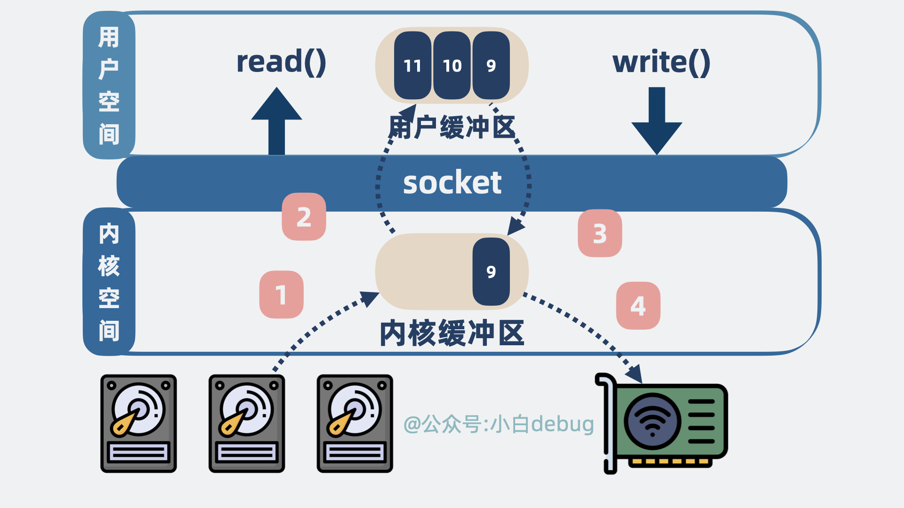
#### mmap
mmap 是操作系统内核提供的一个方法，可以**将内核空间的缓冲区映射到用户空间**。
mmap 作为一种零拷贝技术，**指的是用户空间到内核空间这个过程不需要拷贝**，而不是指数据从磁盘到发送到网卡这个过程零拷贝。
- 程序发起系统调用 mmap()，尝试读取磁盘数据，具体情况如下：
    - 磁盘数据从设备拷贝到内核空间的缓冲区。
    - **内核空间的缓冲区映射到用户空间**，这里不需要拷贝。

- 程序再发起系统调用 write()，将读到的数据发到网络：
    - 数据从内核空间缓冲区拷贝到 socket 发送缓冲区。
    - 再从 socket 发送缓冲区拷贝到网卡。

整个过程，发生了 2 次系统调用，对应 4 次用户空间和内核空间的切换，以及 3 次数据拷贝，**对比之前，省下一次内核空间到用户空间的拷贝**。
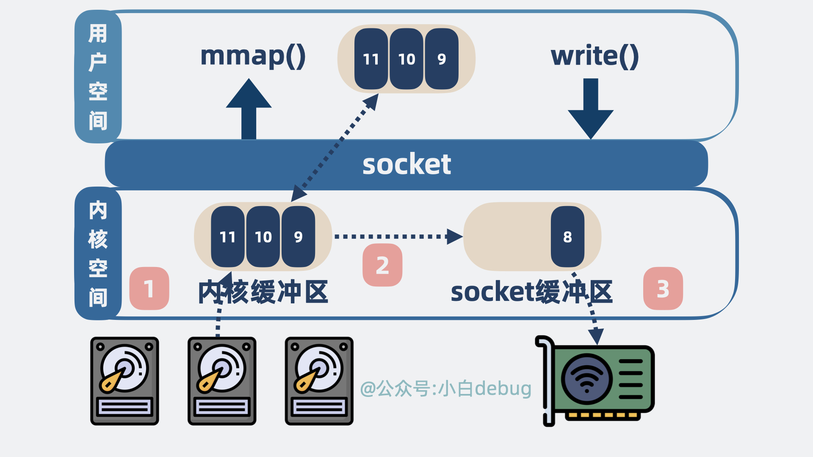
#### sendfile
sendfile，也是内核提供的一个方法，从名字可以看出，就是用来发送文件数据的。
程序发起系统调用 sendfile()，**内核会尝试读取磁盘数据然后发送**，具体情况如下：

- 磁盘数据从设备拷贝到内核空间的缓冲区。
- 内核空间缓冲区里的数据可以直接拷贝到网卡。

整个过程，发生了 1 次系统调用，对应 2 次用户空间和内核空间的切换，以及 2 次数据拷贝。
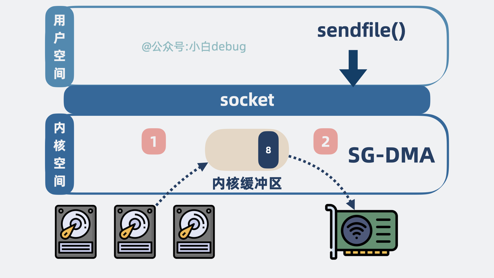
其实，这里的**零拷贝指的是零 CPU 拷贝**。
也就是说 **sendfile 场景下，需要的两次拷贝，都不是 CPU 直接参与的拷贝，而是其他硬件设备技术（SG-DMA）做的拷贝，不耽误我们 CPU 跑程序**。
>SG-DMA（Scatter-Gather Direct Memory Access，分散-聚集直接内存访问）是一种高级的 DMA 技术，用于高效地处理非连续内存块的数据传输。与传统的 DMA 不同，SG-DMA 可以在一次传输操作中处理多个不连续的内存块，从而减少了 CPU 的参与，提高了数据传输的效率。
#### RocketMQ 为什么不使用 sendfile？
聊完两种零拷贝技术，我们回过头来看下 kafka 为什么性能比 RocketMQ 好。
**这是因为 RocketMQ 使用的是 mmap 零拷贝技术，而 kafka 使用的是 sendfile**。kafka 以更少的拷贝次数以及系统内核切换次数，获得了更高的性能。
但问题又来了，为什么 RocketMQ 不使用 sendfile？

- mmap 返回的是数据的具体内容，**应用层能获取到消息内容并进行一些逻辑处理**。
- 而 sendfile 返回的则是发送成功了几个字节数，具体发了什么内容，**应用层根本不知道**。

而 `RocketMQ` 的一些功能，却需要了解具体这个消息内容，**方便二次投递等**，比如将消费失败的消息重新投递到死信队列中，如果 RocketMQ 使用 sendfile，那根本没机会获取到消息内容长什么样子，也就没办法实现一些好用的功能了。

`RocketMQ` 和 `kafka` 相比，**在架构上做了减法，在功能上做了加法**。
跟 kafka 的架构相比，RocketMQ 简化了协调节点和分区以及备份模型。同时增强了消息过滤、消息回溯和事务能力，加入了延迟队列，死信队列等新特性。

**凡事皆有代价，RocketMQ 牺牲了一部分性能，换取了比 kafka 更强大的功能特性**。

## 后端接口性能优化有哪些方法？ 
有以下这些方法：
1、优化索引。给where条件的关键字段，或者 order by 后面的排序字段，加索引。
2、优化sql语句。比如避免使用select *、批量操作、避免深分页、提升group by的效率等
3、避免大事务。使用@Transactional注解这种声明式事务的方式提供事务功能，容易造成大事务，引发其他的问题。应该避免在事务中一次性处理太多数据，将一些跟事务无关的逻辑放到事务外面执行。
4、异步处理。剥离主逻辑和副逻辑，副逻辑可以异步执行，异步写库。比如用户购买的商品发货了，需要发短信通知，短信通知是副流程，可以异步执行，以免影响主流程的执行。
5、降低锁粒度。在并发场景下，多个线程同时修改数据，造成数据不一致的情况。这种情况下，一般会加锁解决。但如果锁加得不好，导致锁的粒度太粗，也会非常影响接口性能。
6、加缓存。如果表数据量非常大的话，直接从数据库查询数据，性能会非常差。可以使用Redis 和memcached提升查询性能，从而提高接口性能。
7、分库分表。当系统发展到一定的阶段，用户并发量大，会有大量的数据库请求，需要占用大量的数据库连接，同时会带来磁盘IO的性能瓶颈问题。或者数据库表数据非常大，SQL查询即使走了索引，也很耗时。这时，可以通过分库分表解决。分库用于解决数据库连接资源不足问题，和磁盘IO的性能瓶颈问题。分表用于解决单表数据量太大，sql语句查询数据时，即使走了索引也非常耗时问题。
8、避免在循环中查询数据库。循环查询数据库，非常耗时，最好能在一次查询中获取所有需要的数据。
## Elastic Search
[【Elastic Search是什么？Lucene是什么？架构是怎么样的？】 ](https://www.bilibili.com/video/BV1yb421J7oX/?share_source=copy_web&vd_source=589ae6273d7e5597533c35b38ecfdb77)
ES 是一个开源的搜索引擎，它提供了一个分布式多用户能力的全文搜索引擎，基于 RESTful web 接口。ES 是用 Java 语言开发的，并作为 Apache 许可条款下的开放源码发布，是当前企业级应用中最受欢迎的搜索引擎之一。
Lucene 是一个全文检索引擎的工具包，而 ElasticSearch 是基于 Lucene 构建的搜索引擎。
- segment 的概念：
segment 是一个复合文件，包含下面四种结构，构成一个拥有完整搜索功能的最小单元。
    - inverted index：倒排索引 = term dictionary + 对应的文档ID列表 posting list。二分查找。但是太大了，只能放在磁盘中
    - 前缀树 term index 减小了term dictionary 的体积，可以存放在内存中
    - stored fields：拥有了分词和文档ID的信息之后，还需要一个存放完整文档的行式存储结构
    - doc values：列式存储结构，空间换时间，用于针对多种不同排序方式返回文档
    - segment 并发读取，为了不耗尽文件句柄，定期merge segment

在 Luence 的基础上，ElasticSearch 实现了高性能、高扩展性、高可用、Node 角色分化和去中心化。
- 高性能：多个针对同一个 Lucene 的读写会造成争抢和等待，浪费时间，那么可以使用 index name 对不同类别的写入信息进行分类，不同的信息写入不同的Lucene ；再在每个 index name 内部进行分片，每个 shard 分片其实都是一个 Lucene 。这样就可以实现多个 Lucene 的并行写入，提高了写入的效率。
- 高拓展性：分片过多，如果都只在一个节点上，那么这个节点的负载会很大，所以可以将每个 shard 分片放在不同的节点上，这样就可以实现分布式的存储，提高了读取的效率。
- 高可用：如果某个节点挂了，那么这个节点上的 shard 分片就会丢失，所以可以设置 replica 副本，将每个 shard 分片的副本放在不同的节点上，这样就可以实现高可用，当某个节点挂了，可以从副本节点上读取数据。
- Node 角色分化：ES 有 Master 节点、Data 节点、Client 节点，Master 节点主要负责集群的管理，Data 节点主要负责数据的存储和检索，Client 节点主要负责客户端的请求转发。如果不去做这个角色分化，那么一个节点上负责的某个功能需要扩容的时候，其他功能也扩容了，就会造成资源的冗余浪费。所以，集群小的时候，可以让一个节点充当多个角色，集群大了之后，最好进行角色分化。
- 去中心化：需要有一个协调机制来同步 Node 之间的数据。如果不想像 kafka 那样维护一个中心节点 zookeeper，那么也可以用去中心化的方法，在 Node 中引入一个魔改的 raft 模块，在节点间相互同步数据，Node 参与选组，还能了解到Node集群中的消息（哪个 Node 挂了等等）

- 流程：
    - 写入：
    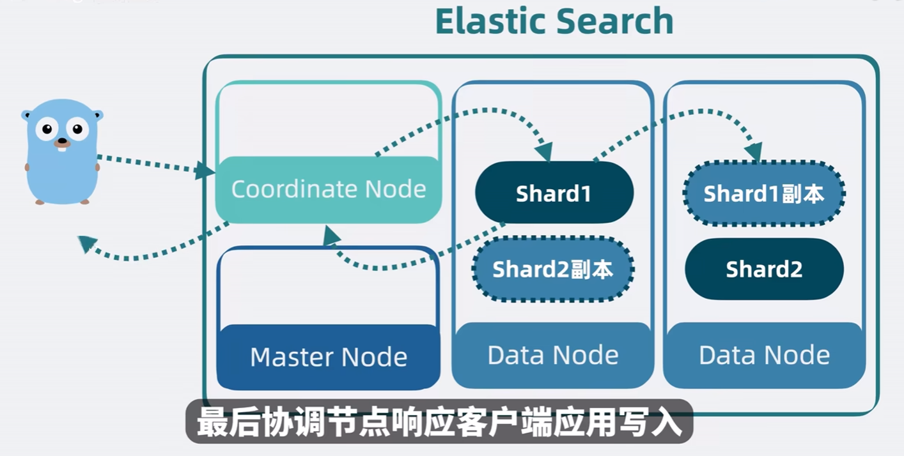
    - 搜索：query phrase + fetch phrase
    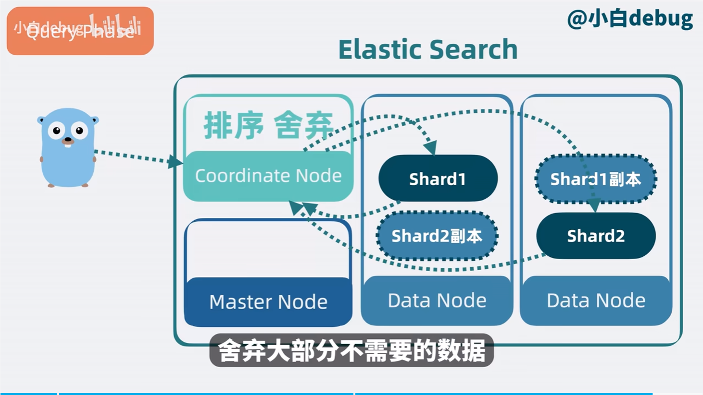
    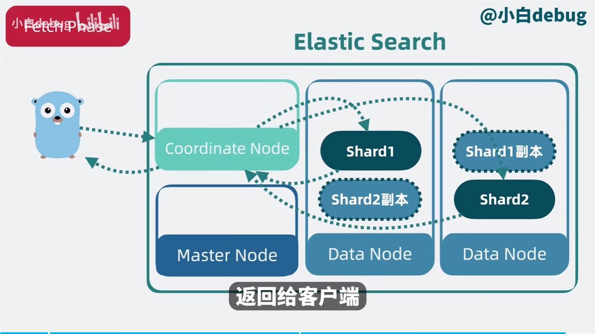
## 微服务
SpringCloud 
现在面试基本都会问到微服务相关的内容，最好了解下微服务相关的知识。服务注册与发现、负载均衡、服务降级、API网关等。推荐书籍《spring cloud微服务实战》

## 分布式事务
### 一致性
- 强一致性：任何一次读都能读到某个数据的最近一次写的数据。系统中的所有进程，看到的操作顺序，都和全局时钟下的顺序一致。简言之，在任意时刻，所有节点中的数据是一样的。
- 弱一致性：数据更新后，如果能容忍后续的访问只能访问到部分或者全部访问不到，则是弱一致性。
- 最终一致性：不保证在任意时刻任意节点上的同一份数据都是相同的，但是随着时间的迁移，不同节点上的同一份数据总是在向趋同的方向变化。简单说，就是在一段时间后，节点间的数据会最终达到一致状态。
### CAP 理论
CAP 理论是分布式系统设计中的一个重要理论，指的是在一个分布式系统中，一致性（Consistency）、可用性（Availability）、分区容错性（Partition Tolerance）这三个特性不可能同时兼得。

- CA系统（放弃P）：指将所有数据（或者仅仅是那些与事务相关的数据）都放在一个分布式节点上，就不会存在网络分区。所以强一致性以及可用性得到满足。
- CP系统（放弃A）：如果要求数据在各个服务器上是强一致的，然而网络分区会导致同步时间无限延长，那么如此一来可用性就得不到保障了。坚持事务ACID（原子性、一致性、隔离性和持久性）的传统数据库以及对结果一致性非常敏感的应用通常会做出这样的选择。
- AP系统（放弃C）：这里所说的放弃一致性，并不是完全放弃数据一致性，而是**放弃数据的强一致性，而保留数据的最终一致性**。如果即要求系统高可用又要求分区容错，那么就要放弃一致性了。因为一旦发生网络分区，节点之间将无法通信，为了满足高可用，每个节点只能用本地数据提供服务，这样就会导致数据不一致。一些遵守 BASE 原则的数据库，（如：Cassandra、CouchDB 等）往往会放宽对一致性的要求（满足最终一致性即可），一次来获取基本的可用性。

### BASE 理论
BASE是Basically Available（基本可用）、Soft state（软状态）和Eventually consistent（最终一致性）三个短语的缩写。BASE理论是对CAP中AP的一个扩展，通过牺牲强一致性来获得可用性，当出现故障时允许部分不可用但要保证核心功能可用，允许数据在一段时间内是不一致性，但最终达到一致状态。满足BASE理论的事务，我们称之为“柔性事务”。

基本可用：分布式系统在出现故障时，允许损失部分可用功能，保证核心功能可用。如，电商网站交易付款出现问题了，商品依然可以正常浏览
软状态：由于不要求强一致性，所以BASE允许系统中存在中间状态（也叫软状态），这个状态不影响系统可用性，如订单的“支付中”、“数据同步中“等状态，待数据最终一致后状态改为”成功“状态。
### 幂等操作
在编程中一个幂等操作的特点是其**任意多次执行所产生的影响均与一次执行的影响相同**。幂等函数，或幂等方法，是指可以使用相同参数重复执行，并能获得相同结果的函数。这些函数不会影响系统状态，也不用担心重复执行会对系统造成改变。例如，**支付流程中第三方支付系统告知系统中某个订单支付成功，接收该支付回调接口在网络正常的情况下无论操作多少次都应该返回成功**。
### 分布式事务解决方案
- 2PC
- TCC
- 本地消息表
- MQ 事务
- Saga 事务
- 最大努力通知

#### 2PC
2PC 是两阶段提交的缩写，是一种保证分布式事务一致性的协议。2PC 的基本思想是引入一个协调者来协调参与者的行为，以保证事务要么完全提交，要么完全回滚。2PC 的过程分为两个阶段：
- 准备阶段：协调者询问参与者是否可以提交事务，参与者执行事务操作，但不提交，而是将 Undo 和 Redo 信息记录到事务日志中，并向协调者反馈事务执行结果。
- 提交阶段：如果所有参与者都反馈可以提交事务，则协调者通知参与者提交事务；否则，协调者通知参与者回滚事务。

2PC 的优点是保证了分布式事务的一致性，但缺点也很明显：
- 同步阻塞：2PC 的整个过程是同步阻塞的，如果协调者出现故障，会导致参与者一直等待，无法完成事务。
- 单点故障：2PC 的协调者是单点，一旦协调者出现故障，整个事务无法继续进行。
- 数据不一致：2PC 的准备阶段参与者执行事务操作，但不提交，这时数据处于不一致状态，如果在提交阶段出现故障，会导致数据不一致。

#### TCC
TCC（Try-Confirm-Cancel）是一种基于补偿事务的分布式事务解决方案。TCC 的基本思想是将一个分布式事务拆分为三个阶段：
- Try 阶段：尝试执行业务，预留必须的资源。
- Confirm 阶段：确认执行业务，真正执行业务。
- Cancel 阶段：取消执行业务，释放之前预留的资源。

TCC 的优点是可以保证分布式事务的一致性，但缺点也很明显：
- 实现复杂：TCC 需要业务系统实现 Try、Confirm 和 Cancel 三个阶段的业务逻辑，实现复杂。
- 业务耦合：TCC 需要业务系统实现 Try、Confirm 和 Cancel 三个阶段的业务逻辑，业务系统和 TCC 框架耦合度高。
- 性能开销：TCC 需要实现 Try、Confirm 和 Cancel 三个阶段的业务逻辑，性能开销较大。

#### 本地消息表
本地消息表是一种基于可靠消息最终一致性的分布式事务解决方案。本地消息表的基本思想是引入一个本地消息表，将分布式事务拆分为本地事务和消息事务：
- 本地事务：执行业务逻辑，将消息发送到消息中间件。
- 消息事务：消费消息，执行业务逻辑。

本地消息表的核心是将需要分布式处理的任务通过消息日志的方式来异步执行。消息日志可以存储到本地文本、数据库或消息队列，再通过业务规则自动或人工发起重试。人工重试更多的是应用于支付场景，通过对账系统对事后问题的处理。对于本地消息队列来说核心是把大事务转变为小事务。

本地消息表的优点是实现简单，性能开销低，但缺点也很明显：
- 数据不一致：本地消息表的本地事务和消息事务是两个独立的事务，可能出现数据不一致。
- 消息重复：本地消息表的消息可能重复消费，需要业务系统实现幂等性。
- 依赖消息中间件：本地消息表依赖消息中间件，消息中间件出现故障会影响分布式事务。

#### MQ 事务
MQ 事务是一种基于消息队列的分布式事务解决方案。MQ 事务的基本思想是引入消息队列，将分布式事务拆分为本地事务和消息事务：
- 本地事务：执行业务逻辑，将消息发送到消息队列。
- 消息事务：消费消息，执行业务逻辑。

MQ 事务的优点是实现简单，性能开销低，但缺点也很明显：
- 数据不一致：MQ 事务的本地事务和消息事务是两个独立的事务，可能出现数据不一致。
- 消息重复：MQ 事务的消息可能重复消费，需要业务系统实现幂等性。
- 依赖消息队列：MQ 事务依赖消息队列，消息队列出现故障会影响分布式事务。

#### Saga 事务
Saga 事务是一种基于补偿事务的分布式事务解决方案。Saga 事务的基本思想是将一个分布式事务拆分为多个本地事务，每个本地事务都有一个补偿操作：
- 本地事务：执行业务逻辑。
- 补偿操作：撤销业务逻辑。

Saga 事务的优点是实现简单，性能开销低，但缺点也很明显：
- 数据不一致：Saga 事务的本地事务和补偿操作是两个独立的事务，可能出现数据不一致。
- 依赖业务系统：Saga 事务需要业务系统实现补偿操作，业务系统和 Saga 框架耦合度高。
- 性能开销：Saga 事务需要实现补偿操作，性能开销较大。

#### 最大努力通知
最大努力通知是一种基于可靠消息最终一致性的分布式事务解决方案。最大努力通知的基本思想是引入一个最大努力通知器，将分布式事务拆分为本地事务和通知事务：
- 本地事务：执行业务逻辑，将通知发送到最大努力通知器。
- 通知事务：通知接收者，执行业务逻辑。

最大努力通知的优点是实现简单，性能开销低，但缺点也很明显：
- 数据不一致：最大努力通知的本地事务和通知事务是两个独立的事务，可能出现数据不一致。


## 场景设计
## 海量数据场景
## k8s
### Kubernetes 架构原理
Kubernetes 会将我们的服务器划为两部分，一部分叫控制平面（control plane，以前叫 master），另一部分叫工作节点，也就是 Node。
控制平面负责控制和管理各个 Node，而 Node 则负责实际运行各个应用服务。
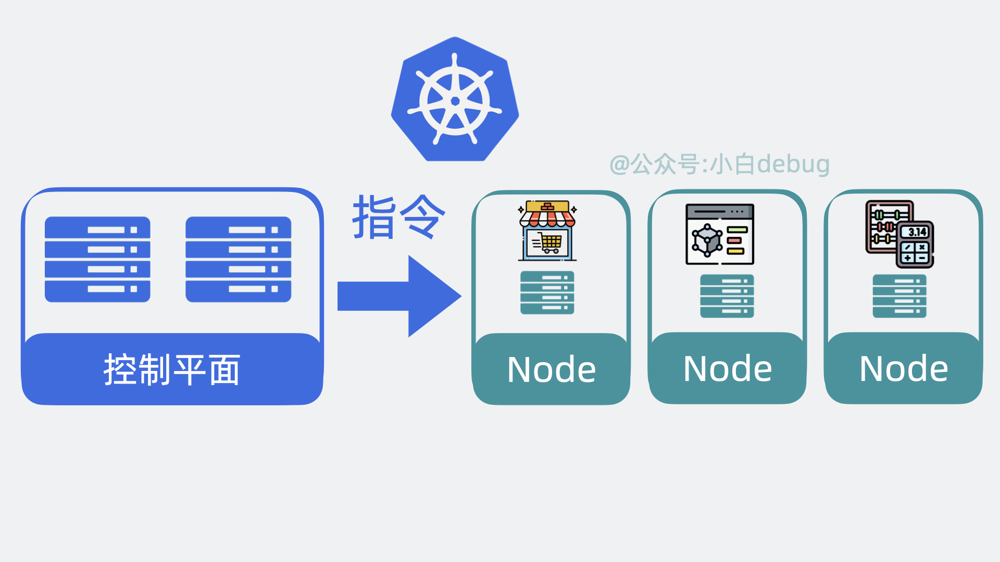
#### 控制平面内部组件
以前我们需要登录到每台服务器上，手动执行各种命令，现在我们只需要调用 k8s 的提供的 api 接口，就能操作这些服务资源，这些接口都由 **API Server** 组件提供。

以前我们需要到处看下哪台服务器 cpu 和内存资源充足，然后才能部署应用，现在这部分决策逻辑由 **Scheduler**（调度器）来完成。

找到服务器后，以前我们会手动创建，关闭服务，现在这部分功能由 **Controller Manager**（控制器管理器）来负责。

上面的功能都会产生一些数据，这些数据需要被保存起来，方便后续做逻辑，因此 k8s 还会需要一个**存储层**，用来存放各种数据信息，目前是用的 **etcd**，这部分源码实现的很解耦，后续可能会扩展支持其他中间件。

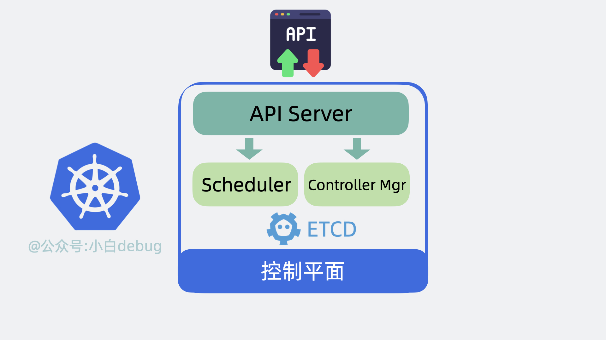
#### Node 内部组件
Node 是实际的工作节点，它既可以是裸机服务器，也可以是虚拟机。它会负责实际运行各个应用服务。多个应用服务共享一台 Node 上的内存和 CPU 等计算资源。

部署多个应用服务的场景，以前我们需要上传代码到服务器，而用了 k8s 之后，我们只需要将服务代码打包成Container ../image/image(容器镜像)，就能一行命令将它部署。

为了下载和部署镜像，Node 中会有一个 Container runtime 组件。

每个应用服务都可以认为是一个 Container（容器）, 并且大多数时候，我们还会为应用服务搭配一个日志收集器 Container 或监控收集器 Container，多个 Container 共同组成一个一个 Pod，它运行在 Node 上。

k8s 可以将 pod 从某个 Node 调度到另一个 Node，还能以 pod 为单位去做重启和动态扩缩容的操作。
所以说 Pod 是 k8s 中最小的调度单位。

另外，前面提到控制平面会用 Controller Manager （通过 API Server）控制 Node 创建和关闭服务，那 Node 也得有个组件能接收到这个命令才能去做这些动作，这个组件叫 **kubelet**，它主要负责管理和监控 Pod。

最后，Node 中还有个 **Kube Proxy** ，它负责 Node 的网络通信功能，有了它，外部请求就能被转发到 Pod 内。

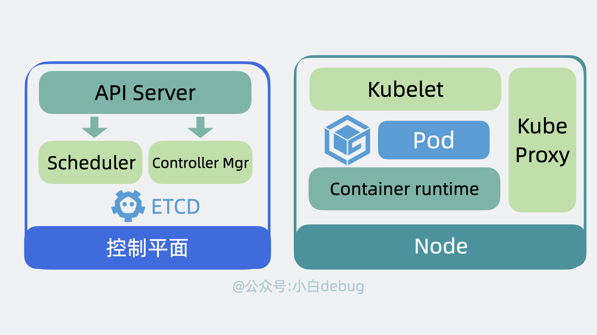
#### cluster
控制平面和 Node 共同构成了一个 Cluster，也就是集群。在公司里，我们一般会构建多个集群, 比如测试环境用一个集群，生产环境用另外一个集群。同时，为了将集群内部的服务暴露给外部用户使用，我们一般还会部署一个入口控制器，比如 **Ingress 控制器（比如 Nginx）**，它可以提供一个入口让外部用户访问集群内部服务。
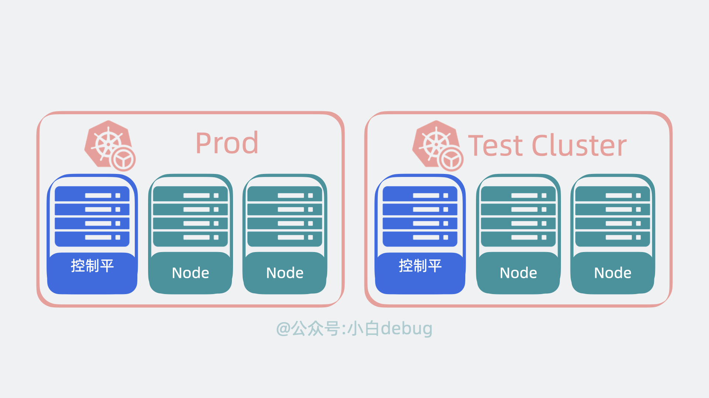

#### kubectl
k8s 为我们准备了一个命令行工具 kubectl，我们只需要执行命令，它内部就会调用 k8s 的 API。
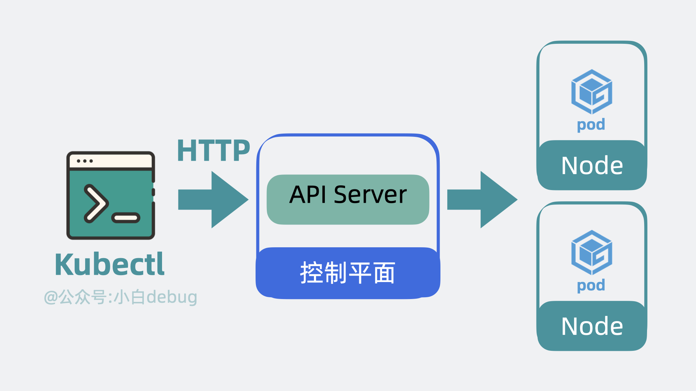
#### k8s怎么部署服务
首先我们需要编写 YAML 文件，在里面定义 Pod 里用到了哪些镜像，占用多少内存和 CPU 等信息。
然后使用 kubectl 命令行工具执行 `kubectl apply -f xx.yaml` ，此时 kubectl 会读取和解析 YAML 文件，将解析后的对象通过 API 请求发送给 Kubernetes 控制平面内 的 API Server。 API Server 会根据要求，驱使 Scheduler 通过 etcd 提供的数据寻找合适的 Node， Controller Manager 会通过 API Server 控制 Node 创建服务，Node 内部的 kubelet 在收到命令后会开始基于 Container runtime 组件去拉取镜像创建容器，最终完成 Pod 的创建。

至此服务完成创建。

整个过程下来，我们只需要写一遍 yaml 文件，和执行一次 kubectl 命令

#### k8s怎么调用服务
以前外部用户小明，直接在浏览器上发送 http 请求，就能打到我们服务器上的 Nginx，然后转发到部署的服务内。
用了 k8s 之后，外部请求会先到达 k8s 集群的 Ingress 控制器，然后请求会被转发到 k8s 内部的某个 Node 的 Kube Proxy 上，再找到对应的 pod，然后才是转发到内部容器服务中，处理结果原路返回，到这就完成了一次服务调用。
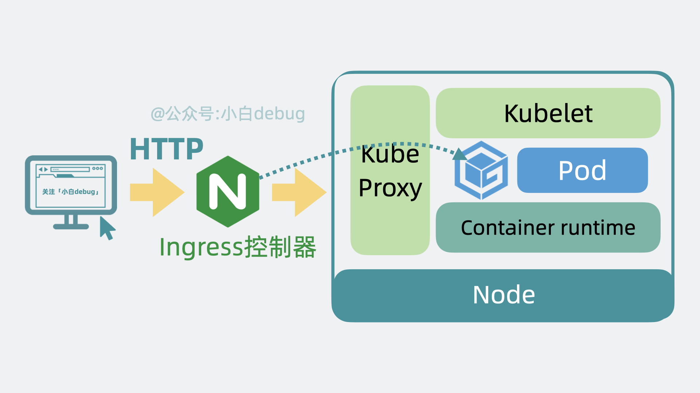

## QPS
QPS（Queries Per Second）,也就是“每秒查询数”，它表示服务器每秒能够处理的请求数量，是一个衡量服务器性能的重要指标。

>带了数据库的服务一般写性能在 5k 以下，读性能一般在 10k 以下，能到 10k 以上的话，那很可能是在数据库前面加了层缓存。如果你的服务还带了个文本算法模型，那使用了 gpu 的情况下 API 一般支持 100~400QPS 左右，如果是个同时支持文本和图片的模型，也就是所谓的多模态模型，那一般在 100QPS 以内。
比如候选人上来就说服务单实例 API 读写性能都有上万 QPS, 那我可以大概猜到这应该是个纯 cpu+内存的 API 链路。但如果候选人还说这里面没做缓存且有数据库调用，那我可能会追问这里头用的是哪款数据库，底层是什么存储引擎？如果候选人还说这里面带了个文本检测的算法模型，那有点违反经验，那我会多聊聊细节，说不定这对我来说是个开眼界的机会。

### 如何计算 QPS ？
#### 监控场景
监控服务 QPS 是最常见的场景，它**对实时性要求不高**。
如果我们想要查看服务的 QPS，可以在服务代码内部接入 Prometheus 的代码库，然后在每个需要计算 QPS 的地方，加入类似 `Counter.Inc()` 这样的代码，意思是函数执行次数加 1。这个过程也就是所谓的打点。

当函数执行到打点函数时，`Prometheus 代码库`内部会计算这个函数的调用次数，将数据写入到 `counter_xx.db` 的文件中，再同步到公司的**时序数据库**中，然后我们可以通过一些监控面板，比如 grafana 调取时序数据库里的打点数据，在监控面板上通过特殊的表达式，也就是 PromQL ，对某段时间里的打点进行求导计算速率，这样就能看到这个函数的调用 QPS 啦。
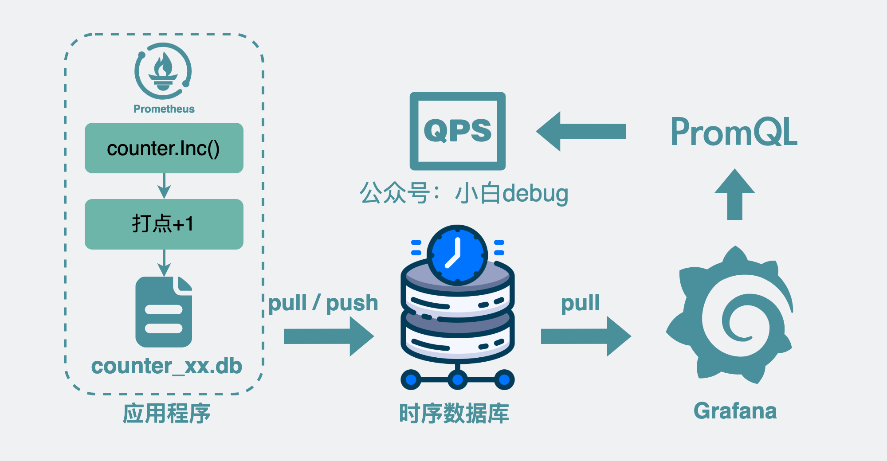
#### 服务治理场景
跟监控面板查看服务 QPS 不同的是，我们有时候需要以更高的实时性获取 QPS。
比如在服务治理这一块，我们需要在服务内部加入一些中间层，实时计算服务 api 当前的 QPS，当它大于某个阈值时，可以做一些自定义逻辑，比如是直接拒绝掉一些请求，还是将请求排队等一段时间后再处理等等，也就是所谓的限流。
这样的场景都要求我们实时计算出准确的 QPS，那么接下来就来看下这是怎么实现的？

##### 基本思路
计算某个函数的执行 QPS 说白了就是计算每秒内这个函数被执行了多少次。
我们可以参考监控场景的思路，用一个临时变量 cnt 记录某个函数的执行次数，每执行一次就给变量+1，然后计算单位时间内的变化速率。
```sh
QPS = (cnt(t) - cnt(t - Δt)) / Δt
```
##### 引入 bucket
但这样会有个问题，到了第 10 秒的时候，有时候我还想回去知道第 5 和第 6 秒的 QPS，光一个变量的话，数据老早被覆盖了，根本不够用。
于是我们可以将临时变量 cnt，改成了一个数组，数组里每个元素都用来存放(cnt(t) - cnt(t - Δt)) 的值。数组里的每个元素，都叫 bucket
##### 调整 bucket 范围粒度
我们默认每个 bucket 都用来存放 1s 内的数据增量，但这粒度比较粗，我们可以调整为 200ms，这样我们可以获得更细粒度的数据。粒度越细，意味着我们计算 QPS 的组件越灵敏，那基于这个 QPS 做的服务治理能力响应就越快。
于是，原来用 1 个 bucket 存放 1s 内的增量数量，现在就变成要用 5 个 bucket 了。
##### 引入环形数组
但这样又引入一个新的问题，随着时间变长，数组的长度就越长，需要的内存就越多，最终导致进程申请的内存过多，被 oom（Out of Memory） kill 了。
为了解决这个问题，我们可以为数组加入最大长度的限制，超过最大长度的部分，就从头开始写，覆盖掉老的数据。这样的数组，就是所谓的环状数组。

虽然环状数组听起来挺高级了，但说白了就是一个用%取模来确定写入位置的定长数组，没有想象的那么高端。
比如数组长度是 5，数组 index 从 0 开始，要写 index=6 的 bucket， 计算 6%5 = 1，那就是写入 index=1 的位置上。
#### 加入滑动窗口
有了环形数组之后，现在我们想要计算 qps，就需要引入滑动窗口的概念。这玩意听着玄乎，其实就是 start 和 end 两个变量。通过它来圈定我们要计算 qps 的 bucket 数组范围。
将当前时间跟 bucket 的粒度做取模操作，可以大概知道 end 落在哪个 bucket 上，确定了 end 之后，将 end 的时间戳减个 1s就能大概得到 start 在哪个 bucket 上，有了这两个值，再将 start 到 end 范围内的 bucket 取出。对范围内的 bucket 里的 cnt 求和，得到这段时间内的总和，再除以 Δt，也就是 1s。就可以得到 qps。
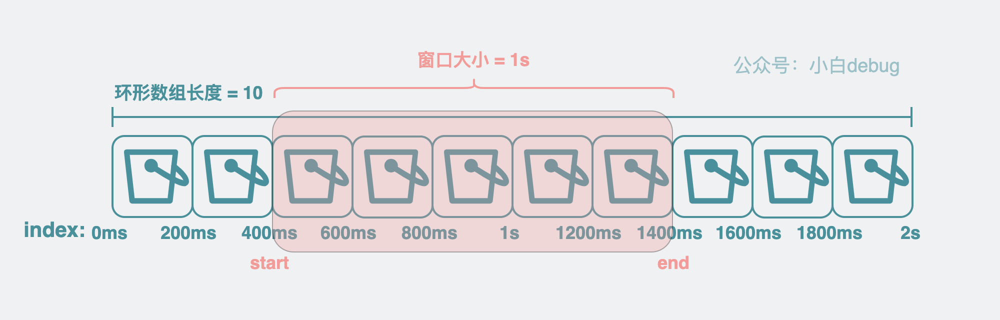
#### 如何计算平均耗时
既然 qps 可以这么算，那同理，我们也可以计算某个函数的平均耗时，实现也很简单，上面提到 bucket 有个用来统计调用次数的变量 cnt，现在再加个用来统计延时的变量 Latency 。每次执行完函数，就给 bucket 里的 Latency 变量 加上耗时。
再通过滑动窗口获得对应的 bucket 数组范围，计算 Latency 的总和，再除以这些 bucket 里的调用次数 cnt 总和，就能得到平均耗时了。
#### sentinel-golang
sentinel-golang 是阿里巴巴开源的一款 Golang 版本的流量控制组件，它提供了丰富的流量控制功能，比如熔断、限流、降级等。
其实，上面的思路，就是阿里开源的sentinel-golang中 QPS 计算组件的实现方式。
sentinel-golang 是个著名的服务治理库，它会基于 QPS 和 Latency 等信息提供一系列限流熔断策略。
如果你想了解具体的代码实现，可以去看下。链接是：
[sentinel-golang](https://github.com/alibaba/sentinel-golang)

但茫茫码海，从何看起呢？下面给出一些关键词，大家可以作为入口去搜索看下。

首先可以基于 `sliding_window_metric.go` 里的 `GetQPS` 开始看起，它是实时计算 QPS 的入口函数。
这里面会看到很多上面提到的内容细节，其中前面提到的滑动窗口，它在 `sentinel-golang` 中叫 `LeapArray`。
bucket 环形数组，在 `sentinel-golang` 中叫 `AtomicBucketWrapArray`。
环形数组里存放的 `bucket` 在代码里就是 `MetricBucket`，但需要注意的是 `MetricBucket` 里的 count 并不是一个数字类型，而是一个 map 类型，它将上面提到的 `cnt` 和 `Latency` 等都作为一种 key-value 来存放。以后想要新增字段就不需要改代码了，提高了代码扩展性。
## docker
Docker 的架构是经典的 Client/Server 架构。Client 对应 Docker-cli， Server 对应 Docker daemon。

Docker-cli 会解析我们输入的 cmd 命令，然后调用 Docker daemon 守护进程提供的 RESTful API，守护进程收到命令后，会根据指令创建和管理各个容器。
再具体点，Docker Daemon 内部分为 Docker Server、Engine 两层。Docker Server 本质上就是个 HTTP 服务，负责对外提供操作容器和镜像的 api 接口，接收到 API 请求后，会分发任务给 Engine 层，Engine 层负责创建 Job，由 Job 实际执行各种工作。

Docker 本质上就是一个将程序和环境打包并运行的工具软件，而 Docker 容器本质上只是个自带独立运行环境的特殊进程，底层用的其实是宿主机的操作系统内核。
### 实现原理
#### namespaces
系统调用构建一个相对隔离的shell环境，这个环境里的进程只能看到自己的进程，看不到其他进程，这就是namespace的作用。
|namespace|系统调用参数|隔离内容|
|---|---|---|
|UTS|CLONE_NEWUTS|主机名和域名|
|IPC|CLONE_NEWIPC|信号量、消息队列和共享内存|
|PID|CLONE_NEWPID|进程ID|
|NET|CLONE_NEWNET|网络设备、网络栈、端口等|
|MNT|CLONE_NEWNS|文件系统挂载点|
|USER|CLONE_NEWUSER|用户和用户组|

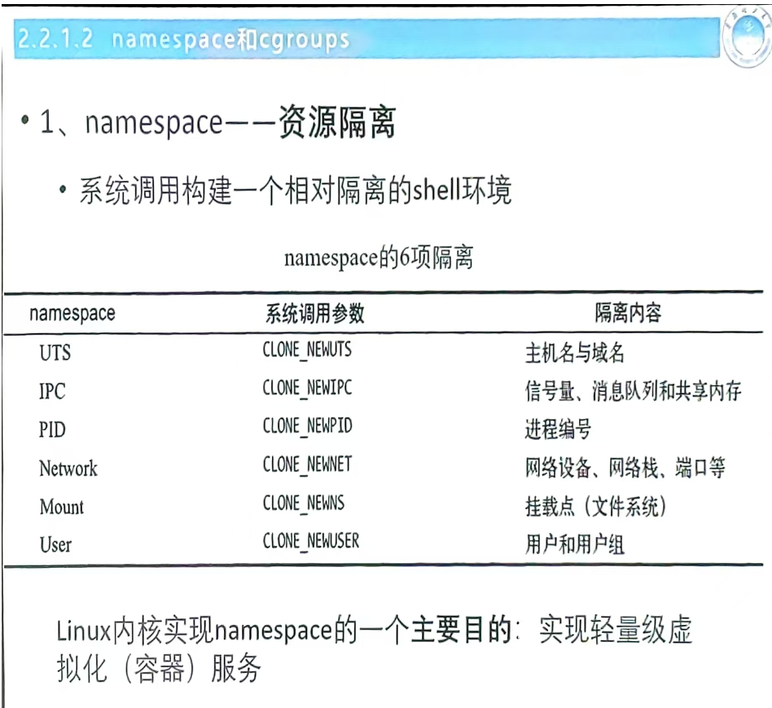
#### cgrops
cgroups是Linux内核提供的一种资源限制和分配的机制，可以限制一个进程组能够使用的资源上限，比如CPU、内存、磁盘IO等。

内核使用cgroup结构体来表示一个control 对一个或者某几个 cgruops 子系统的资源限制。

cgruop树是一个层级结构，每个cgroup都可以有子cgroup，每个cgroup都可以有一个或者多个进程，每个进程只能属于一个cgroup。

### Docker Swarm 是什么？
Docker 解决的是一个容器的部署。
Docker Compose 解决的是多个容器组成的一整套服务的部署。
那 Docker Swarm 就更高维度了，它解决的其实是这一整套服务在多台服务器上的集群部署问题。
比如在 A 服务器坏了，就将服务在 B 服务器上重新部署一套，实现迁移，还能根据需要对服务做扩缩容。


## MySQL
### 基础
#### 执行一条 select 语句，期间发生了什么？
#### mysql（innoDB） 一行记录是如何存储的？
```sql
SHOW VARIABLES LIKE 'datadir';
+---------------+-----------------+
| Variable_name | Value           |
+---------------+-----------------+
| datadir       | /var/lib/mysql/ |
+---------------+-----------------+
1 row in set (0.00 sec)
```
该目录下，每个 database 会有一个文件夹，每个 table 会有一个 .frm 文件，存储表结构，和一个 .ibd 文件，来存储数据。
.ibd 是独占表空间，每个表都有一个独立的 .ibd 文件，存储表的数据和索引。也有一种 .ibdata 文件，是共享表空间，存储系统表空间和共享表空间。
还有一个 db.opt，用来存储当前数据库的默认字符集和字符校验规则。
##### 表空间文件的结构是怎么样的？
表空间由段，区，页，行组成。
- **段**：表空间的最大逻辑单位，一个表空间可以包含多个段，比如数据段，索引段，回滚段等。
表空间是由各个段(segment)组成的，段是由多个区(extent)组成的。段一般分为数据段、索引段和回滚段等。
    - 索引段:存放 B+树的非叶子节点的区的集合
    - 数据段:存放 B+树的叶子节点的区的集合，
    - 回滚段:存放的是回滚数据的区的集合，MVCC 就是利用了回滚段实现了多版本查询数据
- **区**：段由区组成，一个区包含多个页，每个区的大小是固定的。
    - InnoDB 存储引擎是用 B+ 树来组织数据的。B+ 树中每一层都是通过双向链表连接起来的，如果是以页为单位来分配存储空间，那么链表中相邻的两个页之间的物理位置并不是连续的，可能离得非常远，那么磁盘查询时就会有大量的随机I/0，随机 I/O是非常慢的。
    - 解决这个问题的方法，就是让链表中相邻的页的物理位置也相邻，这样就可以使用顺序 /0 了，那么在范围查询(扫描叶子节点)的时候性能就会很高。
    - 在表中数据量大的时候，为某个索引分配空间的时候就不再按照页为单位分配了，而是按照区(extent)为单位分配。每个区的大小为 1MB，对于 16KB 的页来说，连续的 64 个页会被划为一个区，这样就使得链表中相邻的页的物理位置也相邻，就能使用顺序 I/O 了。
- **页**：区由页组成，页是表空间的最小读取单位，每个页的大小是固定为 16KB。页的类型有数据页，索引页，undo页等。
- **行**：页由行组成，每一行对应一个记录。

##### InnoDB 行格式有哪些？
- **Compact**：紧凑格式，适合大部分应用，存储空间小，性能高。
- **Redundant**：冗余格式，存储空间大，性能低，不推荐使用。
- **Dynamic**：动态格式，存储空间和性能介于 Compact 和 Redundant 之间，适合特定场景。
- **Compressed**：压缩格式，存储空间小，性能低，适合存储大量历史数据。

Compact 行格式

| 字段             | 描述                   |
|------------------|------------------------|
| 变长字段长度列表 | 记录变长字段的长度信息 |
| NULL 值列表      | 记录哪些字段为 NULL    |
| 记录头信息       | 包含记录的元数据       |
| row_id           | 行的唯一标识符         |
| trx_id           | 事务 ID                |
| roll_ptr         | 回滚指针               |
| 列1              | 第一列的数据           |
| 列2              | 第二列的数据           |
| ...              | 更多列的数据           |
| 列n              | 第 n 列的数据          |

#### 为什么「变长字段长度列表」的信息要按照逆序存放？
InnoDB 存储引擎的行格式中，变长字段长度列表的信息是按照逆序存放的，这是考虑到记录头信息中
### 索引
数据库索引是一种用于提高数据库查询性能的数据结构，它可以加快数据的检索速度，减少查询时间，提高数据库的性能。

#### 索引分类
按照四个角度分类：
- 数据结构：Hash 哈希索引、B+ 树索引、Full-text 全文索引
- 物理存储：聚集索引（主键索引）、非聚集索引（二级索引，辅助索引）
- 字段特性：主键索引，唯一索引，普通索引，前缀索引
- 字段个数：单列索引，联合索引

其他的索引都属于二级索引，也叫辅助索引。创建的主键索引和辅助索引默认都是 B+ 树索引。
##### 按数据结构分
按照数据结构分的话，mysql 常见索引有 B+ tree，Hash，Full-text 等。
- InnoDB 支持 B+ tree 索引，5.6版本之后支持 full-text 索引，不支持 Hash 索引（但是在内存结构中又一个自适应的 hash 索引）。
- MyISAM 同样是支持 B+ tree 索引和Full-text 索引，不支持 Hash 索引。
- Memory 不支持Full-text 索引，支持 B+ tree 索引和 Hash 索引。

###### 为什么 MySQL InnoDB 选择 B+tree 作为索引的数据结构？
要设计一个 MySQL 的索引数据结构，不仅仅考虑**数据结构增删改的时间复杂度**，更重要的是要考虑**磁盘 I/0 的操作次数**。因为索引和记录都是存放在硬盘，硬盘是一个非常慢的存储设备，我们在查询数据的时候，最好能在尽可能少的磁盘 I/0 的操作次数内完成。

二分查找树虽然是一个天然的二分结构，能很好的利用二分查找快速定位数据，但是它存在一种极端的情况，每当插入的元素都是树内最大的元素，就会导致**二分查找树退化成一个链表，此时查询复杂度就会从 O(logn)降低为 O(n)**。

为了解决二分查找树退化成链表的问题，就出现了**自平衡二叉树，保证了查询操作的时间复杂度就会一直维持在 O(logn)** 。但是它本质上还是一个二叉树，每个节点只能有 2 个子节点，**随着元素的增多，树的高度会越来越高**。

而**树的高度决定磁盘  I/O 操作的次数**，因为**树是存储在磁盘中的，访问每个节点，都对应一次磁盘 I/O 操作**，也就是说树的高度就等于每次查询数据时磁盘 IO 操作的次数，所以树的高度越高，就会影响查询性能。

B 树和 B+ 都是通过**多叉树的方式，会将树的高度变矮**，所以这两个数据结构非常适合检索存于磁盘中的数据。

但是 MySQL 默认的存储引擎 InnoDB 采用的是 B+ 作为索引的数据结构，原因有：

- B+ 树的非叶子节点**不存放实际的记录数据，仅存放索引**，因此数据量相同的情况下，相比存储即存索引又存记录的 B 树，B+树的非叶子节点可以存放更多的索引，因此 B+ 树可以比 B 树更「矮胖」，查询底层节点的磁盘 I/O次数会更少。

- B+ 树有**大量的冗余节点（所有非叶子节点都是冗余索引）**，这些冗余索引让 B+ 树在插入、删除的效率都更高，比如删除根节点的时候，不会像 B 树那样会发生复杂的树的变化；

- B+ 树**叶子节点之间用链表连接了起来，有利于范围查询，而 B 树要实现范围查询，因此只能通过树的遍历来完成范围查询，这会涉及多个节点的磁盘 I/O 操作，范围查询效率不如 B+ 树**。


##### 按物理存储分
从物理存储的角度来看，索引分为聚集索引（主键索引）和非聚集索引（辅助索引）。


在创建表的时候，InnoDB 存储引擎会根据不同的场景选择不同的列作为索引：
- 如果有主键，InnoDB 会选择主键作为聚集索引。
- 如果没有主键，InnoDB 会选择第一个非空唯一索引作为聚集索引。
- 如果都没有，InnoDB 会自动生成并选择隐藏的 6 字节的自增的 row_id 作为聚集索引。

###### 通过主键索引查询数据的过程
自顶向下逐层查找，直到叶子节点，然后通过二分查找法找到对应的数据。

###### 通过辅助索引查询数据的过程
主键索引的 B+ Tree 和二级索引的 B+ Tree 区别如下：
- 主键索引的叶子节点存储的是整行数据，而二级索引的叶子节点存储的是主键值。

通过辅助索引查询数据的过程：
1. 通过辅助索引找到叶子节点的对应的主键值。
2. 通过主键索引找到对应叶子节点的数据。

也就是说要查询两个 B+ Tree 才能查到数据，这就是所谓的回表查询。

不过如果查询的数据是能够在二级索引的 B+ Tree 的叶子节点里查到的话，这时候就不需要回表查询了，这就是所谓的**覆盖索引**，只需要查询一次 B+ Tree 就能查到数据。
例如：
```sql
SELECT id FROM user WHERE name = '张三';
```
##### 按字段特性分
根据字段的特性，索引可以分为主键索引，唯一索引，普通索引，前缀索引等。

###### 主键索引
主键索引就是建立在主键字段上的索引，通常在创建表的时候一起创建，一张表最多只有一个主键索引，索引列的值不允许有空值。

创建表的时候，创建主键索引的方式如下：
```sql
CREATE TABLE user (
    id INT PRIMARY KEY,
    name VARCHAR(20),
    PRIMARY KEY (id) USING BTREE
);
```

###### 唯一索引
唯一索引建立在 UNIQUE 约束上，一张表可以有多个唯一索引，保证索引列的值唯一，但允许有空值。
```sql
CREATE TABLE table_name (
    ...
    UNIQUE KEY(index_column_1, index_column_2, ...)
);
```
建表后如果要创建唯一索引，可以用：
```sql
ALTER TABLE table_name ADD UNIQUE KEY index_name (index_column_1, index_column_2, ...);
```
或者
```sql
CREATE UNIQUE INDEX index_name
ON table_name (index_column_1, index_column_2, ...);
```
###### 普通索引
普通索引就是建立在普通字段上的索引，既不要求字段为主键，也不要求字段唯一。
```sql
CREATE TABLE table_name (
    ...
    INDEX(index_column_1, index_column_2, ...)
);
```
建表后如果要创建普通索引，可以用：
```sql
CREATE INDEX index_name
ON table_name (index_column_1, index_column_2, ...);
```
###### 前缀索引
前缀索引是指对字符类型字段的前几个字符建立的索引，而不是在整个字段上建立的索引。
前缀索引可以建立在字段类型为 CHAR、VARCHAR、binary、varbinary 的字段上，可以指定索引的长度。
使用前缀索引可以减少索引的存储空间，提高查询效率，但是会降低索引的选择性，可能会导致查询性能下降。
```sql
CREATE TABLE table_name (
    ...
    INDEX column_name (length)
);
```
建表后，如果要创建前缀索引，可以用：
```sql
CREATE INDEX index_name
ON table_name (column_name(length));
```
##### 按字段个数分
根据索引的字段个数，索引可以分为单列索引和联合索引。
- **单列索引**：只包含一个字段的索引。
- **联合索引**：包含多个字段的索引，多个字段按照顺序组成一个索引。

###### 联合索引
联合索引是指在多个字段上建立的索引，可以提高查询效率，但是也会增加索引的存储空间，降低索引的更新速度。
```sql
CREATE INDEX index_product_no_name ON products (product_no, name);
```
联合索引的非叶子节点用 n 个字段的值作为 B+ Tree 的 key。查询的时候，先按照第一个字段查找，再按照第二个字段查找，以此类推。

使用联合索引的时候，存在最左匹配原则，即查询条件必须使用索引的最左边的字段，才能使用联合索引。否则联合索引会失效。
例如，如果有联合索引 (a, b, c)，那么查询条件必须使用 a，b，c 中的一个或多个字段，才能使用联合索引。
比如
```sql
SELECT * FROM table_name WHERE a = 1;
SELECT * FROM table_name WHERE a = 1 AND b = 2;
SELECT * FROM table_name WHERE a = 1 AND b = 2 AND c = 3;
```
这三个查询都可以使用联合索引，但是如果查询条件是
```sql
SELECT * FROM table_name WHERE b = 2;
SELECT * FROM table_name WHERE b = 2 AND c = 3;
```
这两个查询就不能使用联合索引。因为 b 和 c 是局部有序，全局无序的，无法使用联合索引。

###### 联合索引范围查询
范围查询的字段可以用到联合索引，但是在范围查询字段后面的字段就不能用到联合索引了。

###### 索引下推
MySQL 5.6 引入了索引下推优化（index condition pushdown），可以在索引中进行查询条件的判断，直接过滤掉不满足条件的记录，减少回表查询的次数。
例如：
```sql
SELECT * FROM table_name WHERE a = 1 AND b = 2;
```
如果 a 是联合索引的第一个字段，b 是第二个字段，那么 MySQL 可以在索引中直接判断 a = 1，然后再判断 b = 2，直接过滤掉不满足条件的记录，减少回表查询的次数。

可以通过 `explain` 命令查看查询的执行计划，

```sql
EXPLAIN SELECT * FROM table_name WHERE a = 1 AND b = 2;
```

如果**查询语句的执行计划**中有 Using index condition，说明 MySQL 使用了索引下推优化。


###### 索引区分度
索引的区分度是指索引列中不同值的个数与表中记录总数的比值，区分度越高，索引的效率越高。实际开发工作中建立联合索引的时候，把区分度大的字段排在前面，这样区分度大的字段越有可能被更多的SQL使用到，从而提高索引的效率。

$$区分度 = distinct(column) / count(*)$$

比如性别的区分度就很小，而 UUID 这类字段就比较适合做索引活排在联合索引的前面。
MySQL 有一个查询优化器，如果他发现某个值出现在表的数据行中的频率百分比（惯用的是30%），那么他就不会使用索引，而是会直接扫描全表。
###### 联合索引进行排序
```sql
select * from order where status = 1 order by create_time desc;
```
如何通过联合索引来优化这个查询呢？
```sql
create index idx_order_status_create_time on order (status, create_time);
```
这样就可以通过索引来完成排序，而不需要再进行文件排序了。
> 文件排序是指 MySQL 在无法利用索引进行排序时，需要在内存或磁盘上进行的额外排序操作。
#### 什么时候建立索引？
使用索引可以提高查询速度，但是需要占用物理空间；创建和维护索引也有时间开销；会降低增删改的效率，因为每次都需要 B+ Tree 进行动态维护。
##### 适合建立索引
- 有唯一性约束的字段
- 经常用于 WHERE 查询条件的字段
- 经常用于 GROUP BY 和 ORDER BY 的字段，这样查询的时候就不需要再去做一次排序了，因为建立索引之后在 B+ Tree 中的记录已经是有序的了。
##### 不适合建立索引
- WHERE, GROUP BY, ORDER BY 用不到的字段
- 存在大量重复值的字段
- 表数据太少
- 经常更新的字段不适合建立索引，因为每次更新都需要维护索引，会降低数据库的性能。
#### 优化索引
- 前缀索引优化
- 覆盖索引优化
- 主键索引最好是自增的
- 防止索引失效
##### 前缀索引优化
前缀索引就是使用某个字段中字符串的前几个字符来创建索引，而不是使用整个字段来创建索引。
使用前缀索引减小了索引字段大小，可以增加一个索引页中存储的索引值，有效提高索引的查询速度。在一些大字符的字段作为索引的时候，可以考虑使用前缀索引来减小索引项的大小。

局限性：
- order by 不能使用前缀索引：
    - 前缀索引是对字符串类型字段的前几个字符建立的索引。
    - 由于前缀索引只包含字段的部分内容，无法保证完整的排序顺序。

- 无法把前缀索引用于覆盖索引：
    - 覆盖索引是指查询所需的所有字段都能从索引中获取，而无需访问数据表。
    - 由于前缀索引只包含字段的部分内容，无法提供完整的字段值。
##### 覆盖索引优化
覆盖索引是指查询所需的所有字段都能从索引中获取，而无需访问数据表。
假设我们只需要查询商品的名称，价格，有什么方式可以避免回表呢？
```sql
SELECT name, price FROM products WHERE id = 1;
```
可以通过创建联合索引来实现覆盖索引：
```sql
CREATE INDEX idx_name_price ON products (id, name, price);
```
这样就可以通过索引来完成查询，而不需要再进行回表查询了。
因为 InnoDB 的索引是聚集索引，叶子节点存储的是整行数据，所以只要索引中包含了查询的字段，就可以通过索引来完成查询，而不需要再进行回表查询去查询出包含整行记录的所有信息，也就减少了大量的 I/O 操作。

##### 主键索引最好是自增的
如果我们使用自增主键，那么每次插入的新数据就会按顺序添加到当前索引节点的位置，不需要移动已有的数据。当页面写满了，就会自动开辟一个新页面。因为每次插入一条新记录都是追加操作，这样就不会引起数据的频繁移动，也就不会引起索引的频繁更新，从而提高了插入的效率。

另外，主键字段不要太长。因为主键字段长度越小，意味着二级索引的叶子节点可以存储更多的索引值，这样就可以减少树的高度，提高查询效率。

索引最好设置为 NOT NULL，因为 NULL 值也会占用索引空间，如果索引字段允许 NULL 值，那么索引的区分度就会降低，从而影响索引的效率，并且进行索引统计和值比较的时候，也会增加额外的开销。
此外，InnoDB 存储记录的时候，如果表中存在允许为NULL的字段，那么行格式中会有一个字节的空间来存储是否为 NULL 的标志，这样就会增加额外的存储空间。
##### 防止索引失效
常见的索引失效情况有：
- 使用左或者左右模糊匹配的时候，也就是使用 `like %xxx` 或者 `like %xx%` 的时候，索引会失效。
    - 因为 B+ Tree 索引是有序的，只能用于查找某个范围的值，而不能用于查找某个范围之外的值。
    - 例如：
    ```sql
    SELECT * FROM table_name WHERE name LIKE '%张三%';
    ```
    这个查询就会导致索引失效，因为 B+ Tree 索引无法用于查找某个范围之外的值。
- 在查询的时候，如果对索引列进行了计算、函数、类型转换，也会导致索引失效。
    - 因为索引是按照索引列的值来排序的，如果对索引列进行了计算、函数、类型转换，那么索引列的值就会发生变化，就无法命中索引了。例如：
    ```sql
    SELECT * FROM table_name WHERE YEAR(create_time) = 2021;
    ```
    这个查询就会导致索引失效，因为 YEAR(create_time) 对 create_time 进行了计算，导致无法命中索引。
- 违背最左优先的原则，也会导致索引失效。
- 在 WHERE 子句中，如果在 OR 前的条件列是索引列，而在 OR 后的条件列不是索引列，那么索引会失效。
    - 因为 OR 前的条件列是索引列，可以使用索引，而 OR 后的条件列不是索引列，无法使用索引，所以整个查询就无法使用索引了。
###### 执行计划
执行计划的主要参数：
- possible_keys：可能使用的索引
- key：实际使用的索引
- key_len：索引字段的长度
- rows: 扫描的行数
- type: 数据扫描类型，常见的有 ALL，index，range，ref，eq_ref，const

常见的扫描类型执行效率从低到高：
- ALL：全表扫描
- index：全索引扫描
- range：索引范围扫描
- ref：非唯一索引扫描
- eq_ref：唯一索引扫描
- const：常量扫描，结果只有一条的主键或唯一索引扫描

从 range 开始，索引的作用会越来越明显，因此我们需要尽量让查询能用 range 级别及以上的扫描方式。

ref 表示采用了非唯一索引，或者是唯一索引的非唯一前缀，返回的数据可能多条。即使找到了一个符合条件的记录，也需要继续扫描，直到找到所有符合条件的记录。好处是不需要全表扫描。

ep_ref 表示使用了主键或者唯一索引，返回的数据只有一条。通常使用在多表联查中。比如
```sql
SELECT * FROM table1 JOIN table2 ON table1.id = table2.id;
```

const 类型表示使用了主键或者唯一索引，只有一条记录。例如：
```sql
SELECT * FROM table_name WHERE id = 1;
```

需要注意，const 和 eq_ref 都使用了主键或者唯一索引，但是 const 是在查询条件中是与常量进行比较，查询效率更高，而 eq_ref 通常多用于多表联查。
 
除了 type，我们也要关注extra字段，常见的参数有：
- Using filesort：需要额外的排序操作。需要避免。无法利用索引完成的排序操作。
- Using temporary：需要额外的临时表。需要避免，常见于 GROUP BY 和 ORDER BY 操作
- Using index：使用了覆盖索引。效率较高
### 事务
#### MVCC
MVCC（多版本并发控制，Multiversion Concurrency Control）是一种用于数据库管理系统（DBMS）中的并发控制技术，旨在提高并发访问的性能，同时保证事务的一致性和隔离性。

MVCC通过为每个数据库对象（如行或记录）维护多个版本来实现并发控制，而不是通过加锁来避免多个事务对同一数据的同时修改。每个事务在执行时会看到一个数据的“快照”，即它开始时的数据状态。事务对数据的修改不会立即影响到其他事务，直到该事务提交。这样，多个事务可以在不互相阻塞的情况下同时进行操作。

##### MVCC的基本原理：
1. **数据版本化**：每次对数据的修改都会创建数据的新版本，并记录事务的开始时间（或提交时间）以及修改的版本信息。
2. **快照隔离**：事务只能看到在其开始时已经提交的数据版本，其他事务在未提交之前的更改对其不可见。
3. **版本管理**：每个数据项都存储了多个版本，通常包括以下信息：
   - **数据值**：实际的数据内容。
   - **事务ID**：修改此版本数据的事务ID。
   - **时间戳**：记录版本的时间戳，用于决定版本的可见性。

##### MVCC的优点：
- **高并发性**：因为事务之间不会锁定数据，而是通过快照和版本控制来管理数据的可见性，所以可以大幅提高并发性能。
- **减少锁冲突**：通过避免对数据的锁定，减少了事务之间的竞争，降低了锁等待和死锁的可能性。
- **提高事务隔离性**：MVCC能够提供较高的事务隔离级别（如快照隔离），保证事务执行的一致性。

##### MVCC的缺点：
- **存储开销**：每次修改都会生成新的数据版本，这可能会导致数据库存储空间的增加，尤其是在高并发的环境中。
- **版本清理**：随着时间的推移，旧版本的数据会逐渐增多，必须定期清理过期版本，避免存储资源浪费。这通常需要额外的后台任务进行版本回收。

##### 应用：
MVCC在很多现代数据库系统中都有应用，如：
- **PostgreSQL**：使用MVCC来处理并发事务，允许不同事务读取数据库的不同版本。
- **MySQL（InnoDB存储引擎）**：也实现了MVCC，通过隐藏锁定来减少事务之间的干扰，提高并发能力。

总体来说，MVCC是一种有效的技术，可以提高数据库在高并发环境下的性能和可扩展性，同时确保数据的一致性和隔离性。

##### read view 在 MVCC 中是如何工作的？

read_view 有四个字段：
- m_ids：事务的 id，用于判断事务是否处于活跃状态。
- min_trx_id：当前事务开始时的最小事务 id
- max_trx_id：当前事务开始时的最大事务 id
- creator_trx_id：创建 read view 的事务 id

对于使用 InnoDB 存储引擎的数据库表，它的聚簇索引记录中都包含下面两个隐藏列：
- itx_id：记录的创建事务 id
- del_mark：删除标记，用于标记记录是否被删除


#### 并发事务会引发什么问题
并发事务是指多个事务同时对数据库进行操作，可能会导致以下问题：
- **脏读**：一个事务读取到另一个事务未提交的数据，可能导致数据不一致。
- **不可重复读**：一个事务多次读取同一数据，但由于其他事务的修改，导致数据不一致。
- **幻读（Phantom Read）**：一个事务读取到其他事务插入或删除的数据，导致数据不一致。

#### 事务隔离级别
事务隔离级别是数据库管理系统（DBMS）中用于控制并发事务之间相互影响的一种机制。不同的隔离级别提供了不同的事务隔离程度，以满足不同的应用需求。

#### 四种标准隔离级别：
1. **读未提交（Read Uncommitted）**：最低级别的隔离，允许一个事务读取另一个事务未提交的数据。这可能导致脏读、不可重复读和幻读等问题。
2. **读提交（Read Committed）**：允许一个事务读取另一个事务已提交的数据。这可以**避免脏读，但仍可能出现不可重复读和幻读**。
3. **可重复读（Repeatable Read）**：保证在同一事务中多次读取相同数据时，数据保持一致。这可以**避免脏读和不可重复读，但仍可能出现幻读**。可重复读级别下能很大程度上避免幻读，但不是完全避免。不过如果为了避免幻读，不建议再使用更高的串行化级别，因为串行化级别会对性能有很大的影响。MySQL InnoDB 的默认隔离级别就是可重复读。
4. **串行化（Serializable）**：最高级别的隔离，确保事务之间的并发执行不会导致任何问题。这**可以避免脏读、不可重复读和幻读**，但可能会降低并发性能。

#### 隔离级别的实现：
- **读未提交**：允许事务读取未提交的数据，因此不需要额外的锁机制，直接读取数据即可。
- **串行化**：通过对数据进行严格的加读写锁，确保事务之间的并发执行不会导致任何问题。
- **读提交**和**可重复读**：通过 Read View 来实现，但是他们创建 read view 的时机不同。具体来说，读提交是在每个语句执行之前都会重新生成 read view，而可重复读是在事务开始的时候生成 read view，整个事务过程中都使用这个 read view。

#### 隔离级别的选择：
- **读未提交**：最低级别的隔离，可能导致脏读，不建议使用。
- **读提交**：可以避免脏读，但仍可能出现不可重复读和幻读，适用于对数据一致性要求不高的场景。
- **可重复读**：可以避免脏读和不可重复读，但仍可能出现幻读，适用于对数据一致性要求较高的场景。
- **串行化**：最高级别的隔离，可以避免脏读、不可重复读和幻读，但可能会降低并发性能，适用于对数据一致性要求非常高的场景。

总体来说，隔离级别的选择应根据应用需求和数据一致性要求来确定，以确保事务的正确执行和数据的一致性。

#### 如何解决幻读
1. 针对快照读（普通的 select 语句），通过 MVCC 解决幻读，因为可重复读隔离级别下，事务执行过程中看到的数据，都是事务开始时的快照数据，不会受到其他事务的影响。

2. 针对当前读（select for update），通过 next-key 锁解决幻读，next-key 锁（记录锁+间隙锁）是 InnoDB 存储引擎的一种锁机制，它会锁定索引记录和索引之间的间隙，确保其他事务无法插入新数据（阻塞），从而避免幻读的发生。

##### 可重复读下的幻读
在可重复读（Repeatable Read）隔离级别下，MVCC（多版本并发控制）可以避免脏读和不可重复读，但不能完全避免幻读。幻读是指在同一个事务中，两次执行相同的查询，结果集却不同，因为其他事务在此期间插入或删除了数据行。

- 场景1

假设有一个银行账户表 `accounts`，包含以下数据：

| id  | balance |
|-----|---------|
| 1   | 100     |
| 2   | 200     |

事务A和事务B同时运行：

1. 事务A开始，执行以下查询：
    ```sql
    SELECT * FROM accounts WHERE balance > 150;
    ```
    结果集为：
    | id  | balance |
    |-----|---------|
    | 2   | 200     |

2. 事务B开始，插入一条新记录：
    ```sql
    INSERT INTO accounts (id, balance) VALUES (3, 300);
    ```
    提交事务B。

3. 事务A再次执行相同的查询：
    ```sql
    SELECT * FROM accounts WHERE balance > 150;
    ```
    结果集为：
    | id  | balance |
    |-----|---------|
    | 2   | 200     |
    | 3   | 300     |

在这个例子中，事务A在两次相同的查询中得到了不同的结果集，这就是幻读。尽管MVCC在可重复读隔离级别下可以避免脏读和不可重复读，但它无法避免其他事务插入新记录，从而导致幻读。

- 场景2
    - T1 时刻，事务 A 先执行快照读，读取到了 1 行数据。
    - T2 时刻，事务 B 插入了 1 行数据。
    - T3 时刻，事务 A 再次执行当前读，读取到了 2 行数据。

至此，事务 A 在两次读取之间，发生了幻读。
要避免这种场景的幻读，就是尽量在开启事务后，马上执行当前读，对记录加 next_key lock，从而避免其他事务插入新记录。
### 锁
### 日志
MySQL日志：undo log、redo log、binlog 有什么用？
- **undo log**：是 Innodb 存储引擎层生成的日志。用于事务回滚，MVCC 实现，实现了事务中的原子性。
- **redo log**：是 Innodb 存储引擎层生成的日志。用于崩溃恢复，例如掉电等故障恢复，保证事务的持久性。
- **binlog**：是 Server 生成的日志。用于数据备份和主从复制。

#### undo log
undolog 的原理很简单，为了满足事务的原子性，在操作任何数据之前，都会先将数据备份到 undo log 中，然后再对数据进行修改。如果事务失败/用户rollback，可以通过 undo log 进行回滚，恢复到事务开始之前的状态。

数据库写入数据到磁盘之前，会把数据先缓存在内存中，事务提交时才会写入磁盘中。

用 undo log 实现原子性和持久性的事务的简化过程：
1. 事务开始
2. 记录A=1
3. 修改A=2
4. 记录B=2
5. 修改B=3
6. 将undo log写入磁盘
7. 将数据写入磁盘
8. 事务提交

- 如何保证持久性？
事务提交之前，会把数据写入磁盘，所以只要事务提交了，数据肯定就持久化了
- 如何保证原子性？
    - 每次对数据库修改，都会把修改前的数据写入 undo log，如果事务失败，可以通过 undo log 进行回滚，恢复数据。
    - 若系统在数据写入磁盘之后，但事务提交之前崩溃，那么系统重启后会根据 undo log 进行回滚，保证了原子性。

具体来说，发生回滚的时候，读取 undo log 中的数据，然后做和原先相反的操作，比如 delete 就 insert，update 就 update 回原来的值。
针对 delete 和 update 有一些特殊的处理：
- 对于 delete 操作，实际上不会立即直接删除，而是将 delete 对象打上一个标记，表示这个对象已经被删除了，但是数据还在，只是不可见了。最终的删除操作是 purge 线程完成的，会将这个对象从数据库中删除。
- update 分两种情况：
    - 如果不是主键列，直接进行
    - 如果是主键列，update分为两步，先删除该行，再插入一行目标行

不同的操作需要记录的内容也是不同的，所以不同类型的操作（修改，删除，新增）产生的 undo log 格式也是不同的/

一条记录的每一次更新操作产生的 undo log 格式都有一个 roll_pointer 和一个 trx_id 事务id，roll_pointer 指向上一次的 undo log，这样就形成了一个链表结构。这个链表就称为版本链。trx_id 则可以知道记录是被哪个事务修改的。

undo log 还有一个作用，那就是通过 ReadView + undo log 来实现 MVCC。

对于 读提交 和 可重复读 隔离级别，他们的快照读（select 语句）是通过 ReadView + undo log 实现的，区别在与 ReadView的时机不同。详见事务篇。

##### undo log 是怎么刷盘的？
// TODO 
#### 为什么需要 Buffer Pool？
MySQL 的数据都是存在磁盘中的，那么我们要更新一条记录的时候，得先从磁盘获取该记录，然后在内存中修改这条记录。修改完之后这条记录缓存起来，下次有查询语句命中了这条记录，就可以直接读取缓存中的记录，不需要从磁盘获取了。

为此，InnoB 设计了一个 Buffer Pool 来提高数据库的读写性能。Buffer Pool 是一个内存区域，用于存储 InnoDB 存储引擎的数据和索引。Buffer Pool 的大小是可以配置的，一般设置为物理内存的 70% - 80%。

- 读取数据时如果数据存在于 Buffer Pool 中，就直接返回数据，否则再去磁盘中读取数据。
- 修改数据的时候如果数据存在于 Buffer Pool 中，就直接修改 Buffer Pool 中的数据，然后将数据标记为脏页，等待后续的刷盘操作（后台线程选择一个合适的时机将脏页写入磁盘）。

##### Buffer Pool 缓存什么？
Innodb 会把存储的数据划分为若干个页，以页作为磁盘和内存交互的基本单位。每个页的大小是 16KB。Buffer Pool 缓存的是页，而不是行。当我们查询一条记录的时候，实际上是查询这条记录所在的页，如果这个页在 Buffer Pool 中，就直接返回这个页，否则就需要从磁盘中读取这个页。

MySQL刚启动的时候，使用的虚拟内存空间很大，而使用到的物理内存空间很小。因为只有这些虚拟内存空间被访问之后，操作系统才会触发缺页中断，申请物理内存，然后将虚拟地址和物理地址建立映射关系。

- Buffer Pool 除了缓存索引页和数据页，还包括 undo 页，插入缓存、自适应哈希索引，锁信息等等。
    - **undo 页**：用于存储 undo log，用于事务回滚。
    - **插入缓存**：用于存储插入的数据，当插入数据的时候，先插入到插入缓存中，然后再定期批量插入到数据页中。
    - **自适应哈希索引**：用于存储自适应哈希索引，用于加速查询。
    - **锁信息**：用于存储锁信息，用于事务并发控制。

- 查询一条记录，就只需要缓存一条记录吗？
当我们查询一条记录的时候，Innodb会把整个页的数据加载到 Buffer Pool 中，将页加载到 Buffer Pool 后，再通过页里的**页目录**去定位到某条具体的记录。
#### redo log
与 uddo log 相反，redo log 记录的是新数据的备份，在事务提交之前，只要将redo log 写入磁盘，即可保证事务的持久性。不需要将数据持久化，减少了磁盘 I/O 次数，提高了性能。
问题来了， Buffer Pool 是基于内存的，而内存万一断电了，没来得及落盘的数据就丢失了。所以 redo log 是用来保证事务的持久性的。

所以，当有一条记录需要更新的时候，Innodb就先更新内存，标记为脏页，然后将更新操作写入 redo log，这个时候更新就算完成了。后续会有一个后台线程，在适当的时候，定期将 redo log 写入磁盘，这个过程叫做 redo log 的刷盘。这就是 WAL（Write-Ahead Logging）技术的原理。


##### 被修改 undo 页面，需要记录对应的 redo 日志吗？
需要的。undo log 也需要实现持久性的保护。
##### redo log 和 undo log 的区别？
- redo 主要是用于事务崩溃恢复，保证事务的持久性。
- undo 主要是用于事务回滚，保证事务的原子性。

##### undo + redo 事务的简化过程
1. 事务开始
2. 记录 A=1 到 undo log buffer
3. 修改 A=2
4. 记录 A=2 到 redo log buffer
5. 将 undo log buffer 写入磁盘
6. 将 redo log buffer 写入磁盘
7. 事务提交
8. 事务提交后，异步将数据写入磁盘

##### 为何要多此一举？
写入 redo log 是追加操作，顺序写的，写入 redo log 的时候，不需要进行随机 I/O，所以性能很高。

##### 产生的 redo log 是直接写入磁盘的吗？
不是，redo log 也是先写入 Buffer Pool 中的 redo log buffer，后续再持久化到硬盘。
redo log buffer 默认大小是 16MB，可以通过 innodb_log_buffer_size 参数进行配置。增大 redo log buffer 的大小可以让部分 MYSQL 处理大事务的时候不必写入磁盘，提高性能。

##### redo log 什么时候刷盘？
主要有下面几个时机：
- MySQL 正常关闭时；
- 当 redo log buffer 中记录的写入量大于 redo log buffer 的一半时；
- Innodb 后台线程每秒会将 redo log buffer 中的数据刷盘到磁盘；
- 每次事务提交时，会将 redo log buffer 中的 redo log 刷盘到磁盘（这个策略可由 innodb_flush_log_at_trx_commit 参数控制）。
###### innodb_flush_log_at_trx_commit 参数的控制策略
单独执行一个更新语句的时候，InnoDB 会自己启动一个事务，在执行更新语句的过程中，生成的 redo log 先写入到 redo log buffer 中，然后等事务提交的时候，再将 redo log buffer 中的 redo log **按组顺序写**入到磁盘中。

除此之外，还有一个参数 innodb_flush_log_at_trx_commit，用于控制 redo log 何时刷盘到磁盘。这个参数有三个值：
- 0：表示每次事务提交时，还是将 redo log 留在 redo log buffer 中，不刷盘到磁盘。该模式在事务提交的时候，不会主动触发写入磁盘的操作。这样性能最好，但是如果数据库宕机，会丢失事务。
- 1：表示每次事务提交时，都将 redo log 刷盘到磁盘。该模式在事务提交的时候，会主动触发写入磁盘的操作。这样性能最差，但是如果数据库宕机，不会丢失事务。
- 2：表示每次事务提交时，将缓存在 redo log buffer 中的 redo log 写入到 redo log 文件。但是这里并不是直接写入磁盘，而是写入了操作系统的 **Page Cache** 中。
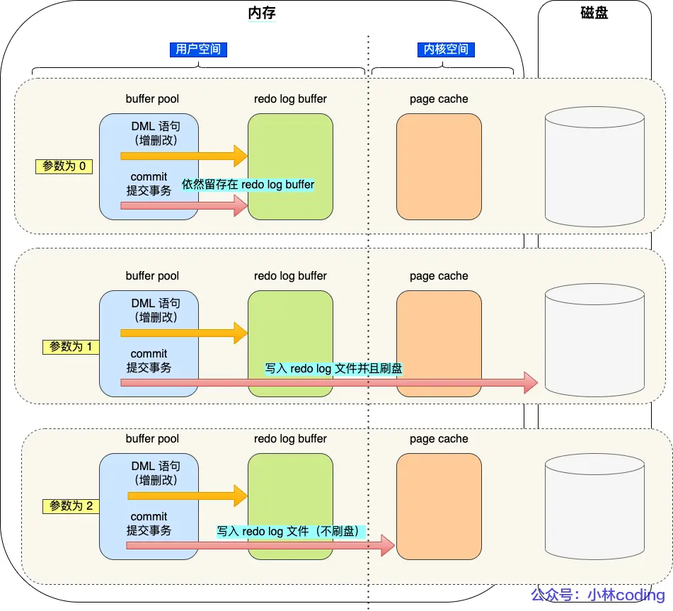

既然如此，当参数值为 0 和 2 的时候，redo log 什么时候写入磁盘呢？
后台线程每隔一秒：
- 针对参数值 0，会把缓存在 redo log buffer 中的 redo log 通过调用 write() 写到 PageCache ，然后调用 fsync() 将 PageCache 中的数据刷到磁盘。所以参数为 0 的时候，MySQL 进程的崩溃会导致上一秒的所有事务丢失。
- 针对参数值 2，调用 fsync() 将 PageCache 中的数据刷到磁盘。所以比 0 更安全，因为 PageCache 中的数据在 MySQL 进程崩溃时不会丢失，只有在操作系统崩溃或者断电的时候，上一秒的所有事务才有可能丢失。
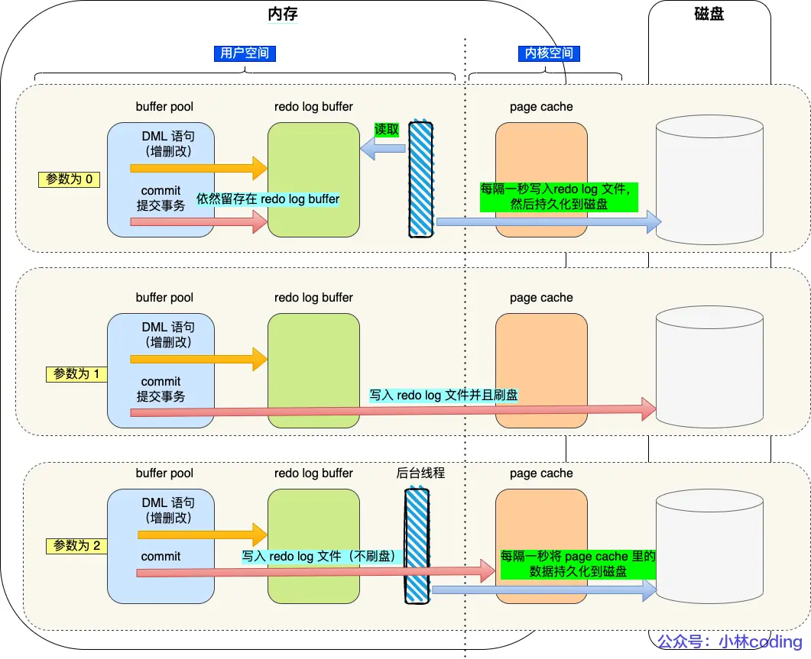
##### redo log 文件满了怎么办？
ib_logfile0 和 ib_logfile1 是 redo log 文件，redo log 文件满了之后，会切换到另一个 redo log 文件，循环写入。
#### binlog
undo log 和 redo log 都是 Innodb 存储引擎层的日志，而 binlog 是 Server 层的日志。

MySQL 在完成了一条更新操作后，Server 层会生成一条 binlog 日志，等事务提交的时候，会将改事务执行过程中锁产生的所有 binlog 统一写入 binlog 文件。

binlog 文件时记录了所有**数据库表结构变更和表数据修改**的日志，不会记录查询类的操作，比如 SELECT 和 SHOW 操作。

###### 为什么有了 binlog，还需要 redo log？
最开始 MySQL 是没有 InnnoDB 的，而是自带 MyISAM 存储引擎。但是 MyISAM 没有 crash-safe 的能力，所以 MySQL 引入了 redo log 来保证事务的持久性。

而 InnoDB 是以插件形式引入 MySQL 的，所以为了实现 crash-safe，InnoDB 也实现了自己的 redo log。

###### binlog 和 redolog 的对比
| 特性         | binlog                                | redolog                              |
|--------------|---------------------------------------|--------------------------------------|
| 适用对象     | MySQL Server 层                       | InnoDB 存储引擎层                    |
| 文件格式     | 基于事件的日志格式（statement-based、row-based、mixed） | 物理日志，记录页的物理变化           |
| 写入方式     | 事务提交时统一写入                    | 事务执行过程中实时写入               |
| 用途         | 数据恢复、主从复制                    | 保证事务的持久性（crash-safe）       |
| 记录内容     | 数据库表结构变更和表数据修改          | 页的物理变化                         |
##### 主从复制是如何实现的？
主从复制是指将主数据库的数据同步到从数据库，从而实现**数据的备份和读写分离**。

MySQL 的主从复制依赖于 binlog 日志。也就是记录 MySQL 服务器上的所有更新操作，并以二进制形式存在磁盘上，复制的过程就是将 binlog 中的数据从主库传输到从库上。

这个过程一般是异步的，主库上执行事务操作的线程并不会等待复制 binlog 的线程同步完成。

MySQL 集群的主从复制过程：
1. 写入 binlog：主库写 binlog 日志，提交事务，并跟更新本地存储数据
2. 同步 binlog：把 binlog 复制到所有从库上，每个从库把 binlog写到暂存日志中
3. 重放 binlog：回放 binlog，从库执行 binlog 中的 SQL 语句，更新本地存储引擎中的数据

具体来说，主从复制的过程如下：
1. 主库上执行一个事务，生成 binlog 日志。
2. 从库连接到主库，获取 binlog 日志。
3. 从库将 binlog 日志写入 relay log 中。
4. 从库读取 relay log 中的 binlog 日志，执行 SQL 语句，更新数据。

> relay log 是从库的 binlog，用于存储主库的 binlog 日志。

##### 主从复制的优点
在完成主从复制后，就可以写数据的时候只写主库，读数据的时候只读从库，这样就可以实现读写分离，提高数据库的读取性能。这样就算写请求会锁表，也不会影响读请求。
- **数据备份**：主从复制可以实现数据的备份，当主库数据丢失时，可以通过从库恢复数据。
- **读写分离**：主从复制可以将读操作分发到从库，减轻主库的压力，提高读取性能。
- **高可用**：主从复制可以实现故障切换，当主库宕机时，可以快速切换到从库提供服务。

###### 从库越多越好吗？
从库数量增加，从库连接到主库的并发连接、 I/O 线程也会增加，主库也需要创建同样多的 log dump 线程，这样会增加主库的负担，还会受限于网络带宽，所以从库数量也不能无限增加。不是越多越好。

实际使用中，一个主库一般会有 2-3 个从库，这样可以保证数据的备份和读写分离。
###### MySQL 主从复制的还有什么类型？
- 同步复制
    - 实际根本没法用
    - 性能太差：主库要等待所有从库都执行完事务，才能提交事务，这样会大大降低主库的性能。
    - 可用性也很差：主库和从库谁出问题都会导致整个系统不可用，因为主库和从库都是同步的，主库一旦出问题，从库也会出问题，而从库出问题，因为主库会等待从库的响应，所以主库也会出问题。
- 异步复制
    - 默认模型
    - 主库执行完事务后，就会立即提交事务，不会等待从库的响应，这样可以提高主库的性能。
    - 一旦主库宕机，就会可能发生数据丢失。
- 半同步复制
    - 主库执行完事务后，会等待至少一个从库执行完事务，然后主库才会提交事务。
    - 兼顾了性能和可用性

###### binlog 何时刷盘？
// TODO
#### 为什么需要两阶段提交？
// TODO
# 操作系统
## 线程与进程的比较
线程与进程的比较如下:
- 进程是资源(包括内存、打开的文件等)分配的单位，线程是CPU 调度的单位
- 进程拥有一个完整的资源平台，而线程只独享必不可少的资源，如寄存器和栈
- 线程同样具有就绪、阻塞、执行三种基本状态，同样具有状态之间的转换关系
- 线程能减少并发执行的时间和空间开销
**线程相比进程能减少开销**，体现在:
    - 线程的创建时间比进程快，因为进程在创建的过程中，还需要资源管理信息，比如内存管理信息、文件管理信息，而**线程在创建的过程中，不会涉及这些资源管理信息，而是共享它们**;
    - 线程的终止时间比进程快，因为**线程释放的资源相比进程少很多**;
    - 同一个进程内的线程切换比进程切换快，因为**线程具有相同的地址空间(虚拟内存共享)，这意味着同一个进程的线程都具有同一个页表，那么在切换的时候不需要切换页表**。而对于进程之间的切换，切换的时候要把页表给切换掉，而页表的切换过程开销是比较大的;
    - 由于同一进程的各线程间共享内存和文件资源，那么在**线程之间数据传递的时候，就不需要经过内核了**，这就使得线程之间的数据交互效率更高了；

所以，不管是时间效率，还是空间效率线程比进程都要高。

## 进程间通信
### 进程间通信的方式
- **管道（pipe）**：管道是一种半双工的通信方式，数据只能单向流动，而且只能在具有亲缘关系的进程间使用。
- **命名管道（FIFO）**：命名管道是一种半双工的通信方式，与无名管道不同的是，它允许无亲缘关系进程间的通信。
-  **信号（signal）**：信号是一种比较复杂的通信方式，用于通知接收进程某个事件已经发生。
- **消息队列（message queue）**：消息队列是消息的链表，存放在内核中并由消息队列标识符标识。
- **信号量（semaphore）**：信号量是一个计数器，用于多个进程间共享数据的同步问题。
- **共享内存（shared memory）**：共享内存是最快的一种 IPC 方式，它允许多个进程共享一个给定的存储区。
- **套接字（socket）**：套接字是一种更为通用的进程间通信机制，可用于不同机器间的进程通信。

#### 共享内存
共享内存是一种高效的进程间通信方式，它允许多个进程共享同一块内存区域，从而实现数据共享。共享内存的优点是速度快，适合大量数据的传输，但缺点是需要进程间进行同步，以避免数据的冲突。

共享内存的实现过程如下：

1. 创建共享内存

进程通过系统调用 `shmget` 创建共享内存段，并得到一个共享内存标识符（shmid）。

```c
#include <sys/ipc.h>
#include <sys/shm.h>

key_t key = ftok("somefile", 65); // 生成一个唯一的键值
int shmid = shmget(key, 1024, 0666|IPC_CREAT); // 创建共享内存段，大小为1024字节
```

2. 连接共享内存

进程通过系统调用`shmat`连接共享内存段，得到共享内存的地址。

```c
char *str = (char*) shmat(shmid, (void*)0, 0); // 连接共享内存段
```

3. 读写共享内存

进程可以通过共享内存的地址直接读写数据。

```c
strcpy(str, "Hello, World!"); // 写入数据到共享内存
printf("Data read from shared memory: %s\n", str); // 从共享内存读取数据
```

4. 分离共享内存

进程使用完共享内存后，通过系统调用`shmdt`分离共享内存。

```c
shmdt(str); // 分离共享内存段
```

5. 删除共享内存

当所有进程都分离共享内存后，可以通过系统调用`shmctl`删除共享内存段。

```c
shmctl(shmid, IPC_RMID, NULL); // 删除共享内存段
```

##### 示例

以下是一个完整的示例，展示了如何创建、连接、读写、分离和删除共享内存：

```c
#include <stdio.h>
#include <sys/ipc.h>
#include <sys/shm.h>
#include <string.h>

int main() {
    // 创建共享内存
    key_t key = ftok("somefile", 65);
    int shmid = shmget(key, 1024, 0666|IPC_CREAT);

    // 连接共享内存
    char *str = (char*) shmat(shmid, (void*)0, 0);

    // 写入数据到共享内存
    strcpy(str, "Hello, World!");

    // 从共享内存读取数据
    printf("Data read from shared memory: %s\n", str);

    // 分离共享内存
    shmdt(str);

    // 删除共享内存
    shmctl(shmid, IPC_RMID, NULL);

    return 0;
}
```

这个示例展示了如何在一个进程中创建、使用和删除共享内存。多个进程可以通过相同的`key`值来访问同一个共享内存段，从而实现进程间通信。

#### 应用场景：
- **多进程间共享数据**：多个进程需要共享数据时，可以使用共享内存，避免数据拷贝和传输的开销。
- **进程间通信**：共享内存可以用于进程间通信，实现高效的数据传输。

## 内存管理
### 预读失效和缓存污染
- **预读失效**：CPU 在读取数据时，会预读取一定范围的数据到缓存中，以提高读取效率。如果程序访问的数据不在预读取的范围内，就会导致预读失效，此时 CPU 需要重新从内存中读取数据，降低了读取效率。
- **缓存污染**：缓存污染是指缓存中存储了无用的数据，占用了缓存空间，导致有用的数据无法被缓存，降低了缓存的命中率。

#### Linux 的做法
- active list：活跃页面链表，包含了最近被访问的页面，这些页面可能会被再次访问。
- inactive list：非活跃页面链表，包含了很长时间没有被访问的页面，这些页面可能会被换出到磁盘。

## I/O 多路复用
I/O 多路复用（I/O Multiplexing）是一种高效管理多个输入/输出操作的技术，特别在网络编程中非常重要。**它允许一个程序同时处理多个文件描述符（File Descriptor），而无需为每个 I/O 操作创建独立的线程或进程**。

### I/O 多路复用如何工作？
I/O 多路复用通过调用一些特殊的系统函数（如 select、poll 和 epoll）来实现。以下是它们的核心步骤：

1. 注册监听的 I/O 事件： 程序告诉操作系统要关注哪些文件描述符，以及它们的哪些事件（例如“有数据可读”或“可以写入”）。

2. 等待事件发生： 操作系统挂起程序，直到至少有一个事件准备好。程序在这段时间会被阻塞（或在非阻塞模式下定期检查）。

3. 处理事件： 当事件发生时，操作系统会通知程序，程序再去处理对应的文件描述符。

#### 核心函数解释
- select： 最早的 I/O 多路复用机制。程序传入一组文件描述符，select 检查哪些文件描述符准备好了。缺点是它有文件描述符数量的限制，而且性能会随着监控的文件描述符增多而下降。

- poll： 类似于 select，但没有文件描述符数量限制，并用链表代替位图管理描述符。性能稍有改进，但还是会随着文件描述符数量线性增长。

- epoll（Linux 特有）： 更高效的实现。通过内核维护一个事件列表，程序只需通知哪些描述符需要关注。相比于 select 和 poll，它的性能不会随着描述符数量的增多而明显下降。

#### 请描述 select、poll、epoll 这三种IO多路复用技术的执行原理
>IO 多路复用（IO Multiplexing）是一种在单个线程中同时监控多个文件描述符（如网络套接字、文件等）的方法。当其中任何一个文件描述符变得可读、可写或发生错误时，程序可以进行相应的处理。IO 多路复用的主要目的是提高系统的并发处理能力，尤其是在网络编程中。

>**常见的 IO 多路复用机制**
select：最早的 IO 多路复用机制，支持监控多个文件描述符，但存在文件描述符数量限制和性能问题。
poll：类似于 select，但没有文件描述符数量限制，性能稍有改善。
epoll：Linux 特有的 IO 多路复用机制，性能优于 select 和 poll，适用于大规模并发连接。
kqueue：FreeBSD 和 macOS 上的 IO 多路复用机制，类似于 epoll。
- A：select、poll、epoll 都是 IO 多路复用的机制，都是通过一个线程来监听多个文件描述符的可读、可写、异常等事件。select 是最早的实现，poll 是对 select 的改进，epoll 是对 poll 的改进。
##### select
select 是通过一个 `fd_set` 来存储文件描述符，通过 `select` 函数来监听这些文件描述符的事件。
1. 将当前进程的所有文件描述符，**一次性从用户态拷贝到内核态**。
2. **在内核中快速的无差别遍历每一个fd**，判断是否有数据到达
3. 将**所有的fd状态从内核态拷贝到用户态**，并返回已就绪遇到fd数量
4. **在用户态遍历判断具体是哪个fd已经就绪，然后再进行对应的事件处理**；
###### select 的缺点
- 每次调用 `select` 函数都需要将 `fd_set` 从**用户态拷贝到内核态，然后内核再将结果拷贝到用户态，这样的开销比较大**；
- 而且**文件描述符表有大小限制**，一般是 1024 个；遍历的轮询时间复杂度是 O(n)。
##### poll
poll 是通过一个 `pollfd` 结构体来存储文件描述符，通过 `poll` 函数来监听这些文件描述符的事件。
```C
struct pollfd {
    int fd; // 文件描述符
    short events; // 事件类型
    short revents; // 返回的事件类型
};
``` 
网卡 -> 内核环形缓冲区 -> 数据接受队列，谁的数据接受队列有数据，revents就置位为1；遍历fd，**被检测到之后重新恢复为0**。
**具体的工作流程和原理和 select 类似，只是 poll 使用 pollfd 结构体来存储文件描述符，poll 函数来监听文件描述符的事件**。
###### poll 的优缺点
- `pollfd` 结构体的大小是固定的，**不需要像 select 一样需要重新设置 fd_set 的大小**，能承受**更高的并发**。
- 但是 poll 也有一个缺点，就是 `pollfd` 结构体是**线性存储**的，当文件描述符比较多的时候，遍历查询效率会比较低。**其他轮询和频繁切换拷贝的问题和 `select` 一样**。
##### epoll
epoll 是通过一个 `epoll_event` 结构体来**存储文件描述符**，通过 `epoll_ctl` 函数来**注册文件描述符**，通过 `epoll_wait` 函数来**监听这些文件描述符的事件**。
1. 在 `epoll_ctl()` 函数中，**为每个文件描述符都指定了回调函数**，基于回调函数把就绪事件放到就绪队列中，因此，把时间复杂度从O(n)降到了O(1)。
2. 只需要在 `epoll_ctl()` 时传递一次文件描述符，`epoll_wait()`不需要再次传递文件描述符。
3. epoll 基于**红黑树+双链表**存事件，**没有最大连接数的限制，不存在 C10K 问题**（C10K 全称是 "Concurrent 10,000 connections problem"。它指的是如何在一台服务器上同时处理一万个并发连接的问题。这个问题的提出是为了应对高并发网络服务器的性能挑战）。
4. 注意: epoll 没有使用 MMAP 零拷贝技术（详见 "RocketMQ 为什么性能不如 Kafka ?"）
5. **为什么 epoll 用双链表？**
`epoll`采用双链表的主要原因是为了高效地管理和处理就绪事件。具体来说，双链表在以下几个方面具有优势：
    1. **高效的插入和删除操作**

    双链表允许在任意位置进行高效的插入和删除操作，时间复杂度为O(1)。在`epoll`中，**当一个文件描述符的事件就绪时，可以快速地将其插入到就绪事件队列中；当事件处理完毕后，可以快速地将其从队列中删除**。

    2. 遍历效率高

    双链表可以高效地遍历所有就绪事件。在`epoll_wait`调用时，可以快速遍历就绪事件队列，处理所有就绪的文件描述符。

    3. 无需重新分配内存

    由于双链表的节点是动态分配的，`epoll`在处理大量文件描述符时无需频繁地重新分配内存。这避免了内存分配和释放带来的开销，提高了性能。

    4. 适应性强

    双链表可以灵活地适应不同数量的就绪事件，无论是少量还是大量的就绪事件，双链表都能高效地管理。

    在`epoll`的实现中，**红黑树用于管理所有注册的文件描述符，而双链表用于管理就绪事件。当一个文件描述符的事件就绪时，会将其从红黑树中移动到双链表中；当事件处理完毕后，再将其从双链表中移除**。


    以下是一个简化的示例，展示了如何使用双链表来管理就绪事件：

    ```c
    struct epoll_event {
        uint32_t events; // 事件类型
        epoll_data_t data; // 用户数据
        struct epoll_event *next; // 指向下一个就绪事件
        struct epoll_event *prev; // 指向上一个就绪事件
    };

    struct epoll_event_list {
        struct epoll_event *head; // 就绪事件链表头
        struct epoll_event *tail; // 就绪事件链表尾
    };

    // 插入就绪事件到双链表
    void add_event(struct epoll_event_list *list, struct epoll_event *event) {
        if (list->tail) {
            list->tail->next = event;
            event->prev = list->tail;
            list->tail = event;
        } else {
            list->head = list->tail = event;
        }
    }

    // 从双链表中移除就绪事件
    void remove_event(struct epoll_event_list *list, struct epoll_event *event) {
        if (event->prev) {
            event->prev->next = event->next;
        } else {
            list->head = event->next;
        }
        if (event->next) {
            event->next->prev = event->prev;
        } else {
            list->tail = event->prev;
        }
    }
    ```
    `epoll`采用双链表来管理就绪事件，主要是为了高效地插入、删除和遍历就绪事件，从而提高事件处理的性能。双链表的这些特性使得`epoll`在处理大量并发连接时具有显著的性能优势。
###### epoll 的优缺点
`epoll_event` 结构体是一个链表结构，可以快速的查询到需要的文件描述符，而且 `epoll_wait` 函数是一个**阻塞函数**，只有当有文件描述符的事件发生的时候，才会返回，**不需要像 select 和 poll 一样需要轮询查询**。

epoll 的缺点是，`epoll_event` 结构体的大小是动态的，**需要动态的分配内存，这样会增加内存的开销。**

# 计网
## 基础
### 从浏览器输入一个url到页面展示发生了什么？越详细越好
1. **URL解析**：
   - 浏览器解析用户输入的URL，判断是HTTP还是HTTPS协议。

2. **DNS解析**：
   - 浏览器检查本地缓存是否有该域名的IP地址。
   - 如果没有，向本地DNS服务器发送查询请求。
   - 本地DNS服务器查询根DNS服务器、顶级域DNS服务器、权威DNS服务器，最终获取域名对应的IP地址，并返回给浏览器。

3. **建立TCP连接**：
   - 浏览器使用IP地址和服务器建立TCP连接（三次握手）。
   - 三次握手过程：
     1. 客户端发送SYN包给服务器。
     2. 服务器收到SYN包，回复SYN-ACK包。
     3. 客户端收到SYN-ACK包，回复ACK包，连接建立。

4. **发送HTTP请求**：
   - 浏览器通过已建立的TCP连接发送HTTP请求（GET请求）到服务器。
   - 请求头包含：请求方法、URL、协议版本、请求头字段（如User-Agent、Accept等）。

5. **服务器处理请求**：
   - 服务器接收到HTTP请求，处理请求（如查询数据库、读取文件等）。
   - 服务器生成HTTP响应，包含响应状态码、响应头、响应体（HTML、CSS、JS等）。

6. **传输数据**：
   - 服务器将HTTP响应通过TCP连接发送回浏览器。
   - 数据在传输过程中经过多个网络设备（如交换机、路由器等），通过IP协议进行路由选择，通过MAC地址进行数据链路层传输。

7. **浏览器接收响应**：
   - 浏览器接收到HTTP响应，解析响应头和响应体。
   - 如果响应体包含HTML，浏览器开始解析HTML文档，构建DOM树。

8. **资源加载**：
   - 浏览器解析HTML过程中，遇到外部资源（如CSS、JS、图片等），发送相应的HTTP请求获取资源。
   - 资源加载完成后，浏览器继续解析和渲染页面。

9. **页面渲染**：
   - 浏览器根据DOM树和CSSOM树构建渲染树。
   - 计算每个元素的布局（位置和大小）。
   - 绘制页面内容到屏幕上。

10. **交互处理**：
    - 页面加载完成后，用户可以与页面进行交互（如点击、输入等）。
    - 浏览器通过事件驱动机制处理用户交互，并更新页面显示。

这个过程涉及到多个协议和技术，包括HTTP、DNS、TCP/IP、MAC地址、网络设备（网卡、交换机、路由器）等。操作系统（OS）在其中负责网络协议栈的实现、网络接口的管理、数据包的发送和接收等。
## HTTP
### HTTP 和 HTTPS 的区别
### HTTP 和 RPC 的区别

## TCP

## IP
### IPv4 和 IPv6 的区别

## 中间件
### clickhouse
### ES
### Kafka
### RabbitMQ
### Redis