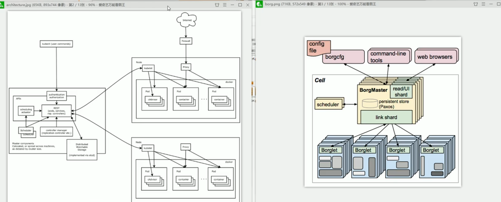

## docker
### 基本概念
#### ../image/image镜像
类似于虚拟机中的snapshot快照，里面包含我们要部署的应用程序以及它先关联的所有库。

#### container容器
通过镜像我们可以创建许多个不同的container容器，每个容器都是一个独立的运行环境（就像虚拟机），每一个容器是独立运行的。
#### dockerfile
自动化脚本。用于创建镜像。就像我们在虚拟机中安装操作系统和软件一样。


### dockerfile编写语法
- FROM：指定基础镜像，必须是第一条指令
- MAINTAINER：指定作者信息
- RUN：创建镜像时执行的命令
- ADD：添加文件
- WORKDIR：指定工作目录
- ENV：设置环境变量
- EXPOSE：暴露端口
- CMD：指定容器启动时执行的命令

#### 示例
```dockerfile
FROM centos:7
MAINTAINER zhangsan
RUN yum install -y vim
ADD test.txt /opt/test.txt
WORKDIR /opt
ENV MYPATH /usr/local
EXPOSE 80
CMD echo $MYPATH
```

### docker desktop

### docker 命令
- docker ../image/images：查看本地镜像
- docker ps：查看正在运行的容器
- docker ps -a：查看所有容器
- docker run -d -p 80:5000 nginx：运行镜像，其中-d表示后台运行，-p表示端口映射，80是宿主机端口，5000是容器端口，nginx是镜像名。
- docker start 容器id：启动容器
- docker stop 容器id：停止容器
- docker rm 容器id：删除容器
- docker rmi 镜像id：删除镜像
- docker exec -it 容器id /bin/bash：进入容器

### volume数据卷
数据卷是一个可供一个或多个容器使用的特殊目录，它绕过 UFS，可以提供很多有用的特性：
- 数据卷可以在容器之间共享和重用
- 对数据卷的修改会立马生效
- 对数据卷的更新，不会影响镜像
- 数据卷默认会一直存在，即使容器被删除
- 数据卷的生命周期一直持续到没有容器使用它为止
- 数据卷的使用，类似于 Linux 下对目录或文件进行 mount，Docker 下的数据卷，也可以被类比为 Linux 下的目录挂载。不同的是，Docker 下的数据卷，不需要你自己进行 mount，Docker 自己会完成这些工作。

#### 数据卷的使用
- docker volume create my-vol：创建数据卷
- 启动容器的时候使用参数 -v my-vol:/opt：将数据卷挂载（mount）到容器的/opt目录下。向这个路径写入的数据，会永久保存到这个数据卷中。


### docker-compose
多个容器共同协作：例如用一个容器运行web应用，一个容器运行mysql数据库。这样可以实现数据和应用的分离，方便管理和维护。当web容器宕机的时候，mysql容器不会受到影响，仍然正常运转。我们只需要修复web容器即可。

而docker-compose就是用来管理多个容器的工具。
#### docker-compose.yml
```yml
services:
  web:
    ../image/image: nginx
    ports:
      - "80:5000"
    depends_on:
      - mysql
  mysql:
    ../image/image: mysql
    environment:
      MYSQL_DATABASE: test
      MYSQL_ROOT_PASSWORD: pswd
    volumes:
      - ./nginx.conf:/etc/nginx/nginx.conf
  volumes:
    my-vol:
    /var/lib/mysql
```
#### 常用命令
启动所有容器：
```shell
$ docker-compose up -d
```
停止并删除所有容器：
```shell
$ docker-compose down
```
以上操作也可以用图形化界面进行。

### docker & kubernetes
一句话概括：docker是容器，kubernetes是容器编排工具。

k8s所做的就是把你的各个容器分发到一个集群（cluster）上运行，可以实现负载均衡、故障转移等。


#### docker hub
类似于github，是一个docker镜像的仓库，可以在上面找到各种各样的镜像，也可以上传自己的镜像。

# kubernetes
## 基本概念
- node：节点，一个k8s集群由多个node组成，每个node都有自己的ip地址，可以是物理机或虚拟机。
- pod：最小的部署单元。每一个节点运行了若干个相互独立的pod。一个pod可以包含一个或多个容器，这些容器共享网络和存储资源。
- control plane：（中心计算机）控制平面，通过专有的API与各个节点进行通信，实时监控集群的状态，并作出相应的调整。
- replica set：副本集合。后台预先准备好的、随时待命的备用容器来替换掉出故障的容器。
- cluster：集群。以上所有的节点、pod、control plane、replica set等都组成了一个k8s集群。

### 云服务商的集群/miniKube


### deployment.yaml
类似于docker中的dockerfile，一个自动化脚本，里面定义了我们应用的基本信息，比如由哪些pod组成，每个pod里有哪些容器等等。

### 服务
每个pod拥有一个外网不可见的ip地址，这样就无法通过ip地址访问到pod里的容器。所以我们需要一个**服务**来将外网的请求转发到pod里的容器。
#### nodeport
nodeport是一种服务类型，它会在每个node上开放一个端口，这样就可以通过node的ip地址和端口号访问到pod里的容器了。这是一个最原始的把pod暴露到外网的方法，但是不够灵活，因为每个node上的端口号都是固定的，如果我们想要修改端口号，就需要修改deployment.yaml文件，然后重新部署。

#### loadbalancer
loadbalancer是一种服务类型，它会在云服务商上创建一个负载均衡器，然后将请求转发到各个node上。这种方法比nodeport更加灵活，因为我们可以在云服务商的控制台上修改负载均衡器的配置，而不需要修改deployment.yaml文件。

#### ingress
ingress是一种服务类型，它会在集群内部创建一个负载均衡器，然后将请求转发到各个node上。这种方法比loadbalancer更加灵活，因为我们可以在集群内部修改负载均衡器的配置，而不需要修改deployment.yaml文件。

### kubectl
kubectl是k8s的命令行工具，可以用来管理集群。所有平台都可以使用kubectl，包括云服务商的控制台和minicube模拟的k8s集群。
```shell
$ kubectl get nodes # 查看集群中的节点
$ kubectl get pods # 查看集群中的pod
$ kubectl get services # 查看集群中的服务
$ kubectl get deployments # 查看集群中的部署
$ kubectl get replicaset # 查看集群中的副本集合
$ kubectl get ingress # 查看集群中的负载均衡器
$ kubectl get all # 查看集群中的所有资源
$ kubectl describe pod/pod名 # 查看pod的详细信息
$ kubectl describe service/服务名 # 查看服务的详细信息
$ kubectl describe deployment/部署名 # 查看部署的详细信息
$ kubectl describe replicaset/副本集合名 # 查看副本集合的详细信息
$ kubectl describe ingress/负载均衡器名 # 查看负载均衡器的详细信息
$ kubectl describe node/节点名 # 查看节点的详细信息
$ kubectl apply -f deployment.yaml # 部署应用
$ kubectl delete -f deployment.yaml # 删除应用
```
### 进一步学习
以上只是最基本的概念和命令，实际生产环境中更复杂的安全配置、网络管理、故障排除甚至是GPU调度等等都需要学习。下面是一些学习资源：
- [kubernetes官方文档](https://kubernetes.io/zh/docs/home/)
- [kubernetes中文指南](https://www.bookstack.cn/read/kubernetes-handbook/README.md)

## 架构组件
borg: 谷歌内部的集群管理系统，k8s的前身。

- 主从节点：主节点负责调度，从节点负责运行容器。

客户端：可以是kubectl命令行工具，也可以是云服务商的控制台。
### Master components（控制面板组件）
- API Server：提供了k8s的API，用于管理集群。基于 RESTful 风格。
- kube-Controller-Manager：负责控制器。针对集群中的资源对象，控制器会不断地调节集群的状态，使其符合预期的状态。
  - Node Controller：负责管理节点。
  - Replication Controller：负责维护系统中的副本集合。
  - Endpoints Controller：负责维护端点对象。
  - Service Account & Token Controllers：负责为新的命名空间创建默认账户和 API 访问令牌。
- cloud-controller-manager：用于云服务商的集成，比如负载均衡器。
  - Node Controller：负责管理节点。
  - Route Controller：负责路由。
  - Service Controller：负责服务。
- Scheduler：负责调度，将 pod 分配到合理的 node 上。
- etcd：保存了整个集群的状态。理解为一个 k8s 的 K-V 数据库。基于 Raft 算法实现分布式一致性。老版本基于内存，新版本基于持久化存储。

### Node（节点组件）
- Kubelet：负责与Master节点通信，接收Master节点的指令，管理容器。
- Kube-proxy：负责维护网络规则，实现负载均衡。
- Container runtime：负责运行容器。

### 附加组件

## 服务的分类
### 有状态
- StatefulSet：有状态服务，比如数据库。
- PersistentVolume：持久化存储。
- PersistentVolumeClaim：持久化存储的声明。
### 无状态
- Deployment：无状态服务，比如web应用。
- ReplicaSet：副本集合。

## 对象状态及规约（spec）
- spec：用户定义的期望状态。
- status：k8s定义的实际状态。
## 对象与资源
- 对象：k8s中的一切都是对象，包括pod、service、deployment等等。
- 资源：k8s中的对象都是资源，资源是对象的实例。

1. 元数据（metadata）：资源的描述数据
2. 集群级别的资源：
3. 命名空间的资源：逻辑上的隔离，不同命名空间的资源不会相互干扰。逻辑意义上的集群

### 元数据
- HPA（Horizontal Pod Autoscaler）：根据CPU利用率或自定义指标自动扩展或缩减pod数量。
- podTemplate：定义pod的模板，可以在多个地方引用。
- LimitRange：限制资源的使用，比如CPU、内存等。
  - limits：定义资源的上限。
  - requests：定义资源的下限。

## 集群级别的资源
- Namespace
- Node
- ClusterRole：看作是权限组，用于集群资源之上的权限控制。
- ClusterRoleBinding：将角色和用户绑定。

## 命名空间的资源
### 工作负载型
#### Pod
##### pod 的生命周期
Pod 遵循预定义的生命周期，起始于 Pending 阶段， 如果至少其中有一个主要容器正常启动，则进入 Running，之后取决于 Pod 中是否有容器以失败状态结束而进入 Succeeded 或者 Failed 阶段。

Pod 在其生命周期中只会被调度一次。 将 Pod 分配到特定节点的过程称为绑定，而选择使用哪个节点的过程称为调度。 一旦 Pod 被调度并绑定到某个节点，Kubernetes 会尝试在该节点上运行 Pod。 Pod 会在该节点上运行，直到 Pod 停止或者被终止； 如果 Kubernetes 无法在选定的节点上启动 Pod（例如，如果节点在 Pod 启动前崩溃）， 那么特定的 Pod 将永远不会启动。

可以使用 Pod 调度就绪态来延迟 Pod 的调度，直到所有的调度门控都被移除。 例如，你可能想要定义一组 Pod，但只有在所有 Pod 都被创建完成后才会触发调度

如果 Pod 中的某个容器失败，Kubernetes 可能会尝试重启特定的容器。 有关细节参阅 Pod 如何处理容器问题。

然而，Pod 也可能以集群无法恢复的方式失败，在这种情况下，Kubernetes 不会进一步尝试修复 Pod； 相反，Kubernetes 会删除 Pod 并依赖其他组件提供自动修复。

如果 Pod 被调度到某个节点而该节点之后失效， Pod 会被视为不健康，最终 Kubernetes 会删除 Pod。 Pod 无法在因节点资源耗尽或者节点维护而被驱逐期间继续存活。

Kubernetes 使用一种高级抽象来管理这些相对而言可随时丢弃的 Pod 实例， 称作控制器。

###### Pod 如何处理容器问题 
Kubernetes 通过在 Pod spec 中定义的 restartPolicy 管理 Pod 内容器出现的失效。 该策略决定了 Kubernetes 如何对由于错误或其他原因而退出的容器做出反应，其顺序如下：

- 最初的崩溃：Kubernetes 尝试根据 Pod 的 restartPolicy 立即重新启动。
- 反复的崩溃：在最初的崩溃之后，Kubernetes 对于后续重新启动的容器采用**指数级回退延迟机制**， 如 `restartPolicy` 中所述。 这一机制可以防止快速、重复的重新启动尝试导致系统过载。
- CrashLoopBackOff 状态：这一状态表明，对于一个给定的、处于崩溃循环、反复失效并重启的容器， 回退延迟机制目前正在生效。
- 回退重置：如果容器成功运行了一定时间（如 10 分钟）， Kubernetes 会重置回退延迟机制，将新的崩溃视为第一次崩溃。

在实际部署中，`CrashLoopBackOff` 是在描述或列出 Pod 时从 kubectl 命令输出的一种状况或事件。 当 Pod 中的容器无法正常启动，并反复进入尝试与失败的循环时就会出现。

换句话说，当容器进入崩溃循环时，Kubernetes 会应用 `restartPolicy` 中提到的**指数级回退延迟机制**。这种机制可以**防止有问题的容器因不断进行启动失败尝试而导致系统不堪重负**。

###### restartPolicy
Pod 的 spec 中包含一个 restartPolicy 字段，其可能取值包括 Always、OnFailure 和 Never。默认值是 Always。

`restartPolicy` 应用于 Pod 中的应用容器和常规的 `Init` 容器。 `Sidecar` 容器忽略 Pod 级别的 restartPolicy 字段：在 Kubernetes 中，Sidecar 被定义为 `initContainers` 内的一个条目，其容器级别的 restartPolicy 被设置为 `Always`。 对于因错误而退出的 Init 容器，如果 Pod 级别 restartPolicy 为 OnFailure 或 Always， 则 kubelet 会重新启动 Init 容器。

- Always：只要容器终止就自动重启容器。
- OnFailure：只有在容器错误退出（退出状态非零）时才重新启动容器。
- Never：不会自动重启已终止的容器。
当 kubelet 根据配置的重启策略处理容器重启时，仅适用于同一 Pod 内替换容器并在同一节点上运行的重启。当 Pod 中的容器退出时，kubelet 会以指数级回退延迟机制（10 秒、20 秒、40 秒......）重启容器， 上限为 300 秒（5 分钟）。一旦容器顺利执行了 10 分钟， kubelet 就会重置该容器的重启延迟计时器。 Sidecar 容器和 Pod 生命周期中解释了 init containers 在指定 restartpolicy 字段时的行为。

#### 容器探针
##### 探针类型
- Liveness Probe：用于确定容器是否正在运行。如果探针失败，Kubernetes 将重启容器。
- Readiness Probe：用于确定容器是否准备好接收流量。如果探针失败，Kubernetes 将停止将流量发送到容器。
- startup Probe：用于确定容器是否已经启动。如果探针失败，Kubernetes 将重启容器。
Pod 可以定义两种类型的探针：`livenessProbe` 和 `readinessProbe`。探针是一种对容器的检查，用于确定容器是否正在运行以及是否准备好接收流量。
##### 探针机制
- exec：在容器内执行命令。
- httpGet：向容器的 IP 地址和端口发送 HTTP GET 请求。
- tcpSocket：向容器的 IP 地址和端口发送 TCP 消息。
- gRPC：向容器的 IP 地址和端口发送 gRPC 消息。

#### 副本

#### 控制器
##### 适用 satetful
- StatefulSet：有状态服务，比如数据库。
  - Headless Service：无头服务，用于 StatefulSet。
  -volumeClaimTemplates：持久化存储。
##### 适用无状态
- RC（Replication Controller）：副本控制器，确保指定数量的 Pod 始终在运行。可以动态更新 Pod 的数量。
- RS（ReplicaSet）：副本集，是 RC 的升级版，支持集合选择器。可以通过指定 selector 来选择对哪些 Pod 生效。
  - Label 和 Selector：Label 是键值对，Selector 是用于选择对象的标签。
- Deployment：部署控制器，用于管理 Pod 和 ReplicaSet。滚动更新、回滚、扩容、缩容等操作。
#### 守护进程
- DaemonSet：守护进程集，确保每个节点上都运行一个 Pod 的副本。
#### 任务/定时任务
- Job：独立的任务，执行完毕后退出。
- CronJob：定时任务，周期性地执行 Job。
### 服务发现
#### Service(横向)
集群内部的服务发现，通过 Service 可以让 Pod 之间相互通信。Service 会为 Pod 提供一个虚拟 IP 和 DNS 名称，这样就可以通过 Service 的虚拟 IP 和 DNS 名称来访问 Pod。相当于是集群级别的端口映射。
- ContainerPort：容器端口。
#### Ingress（纵向）
将k8s集群内部的服务暴露到外部的服务。
- ingress-nginx：Ingress 控制器，负责将外部流量路由到集群内的服务。七层负载均衡。

### 存储
#### Volume
#### CSI (Container Storage Interface)
### 特殊类型存储
#### ConfigMap
#### secret
#### Downward API
### 其他
#### Role
#### RoleBinding