# Rust基本功修炼
## 所有权
### 所有权规则、内存与分配
#### stack and heap
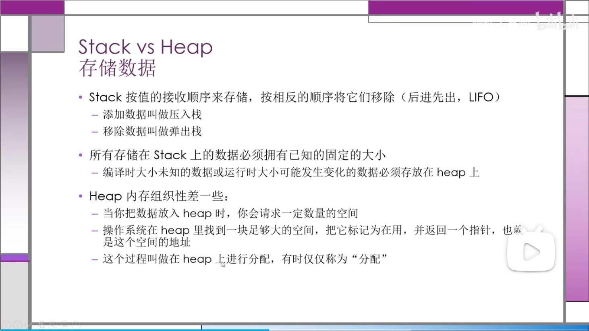
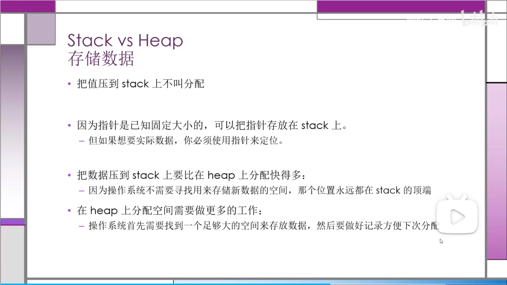
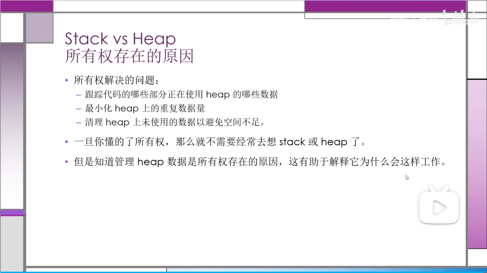
### Drop
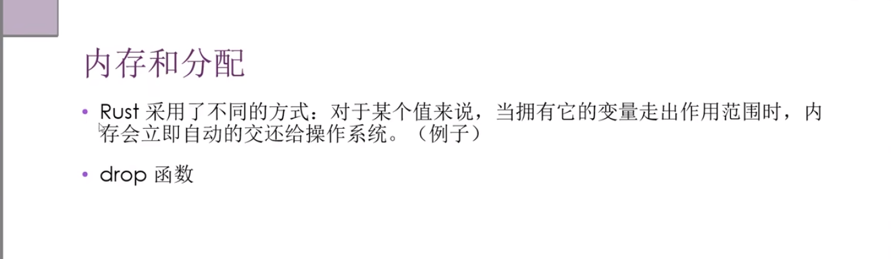
#### 移动
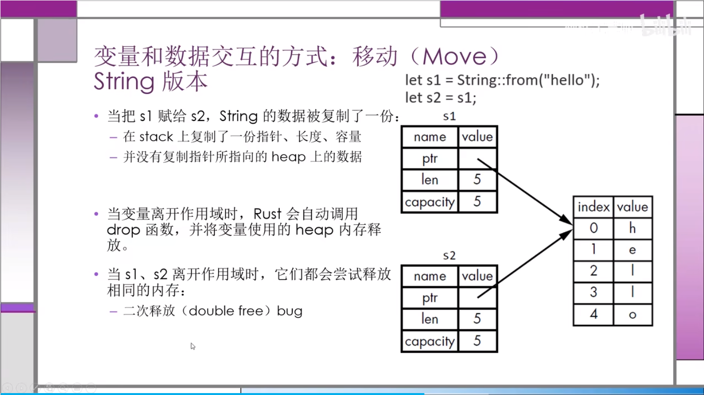
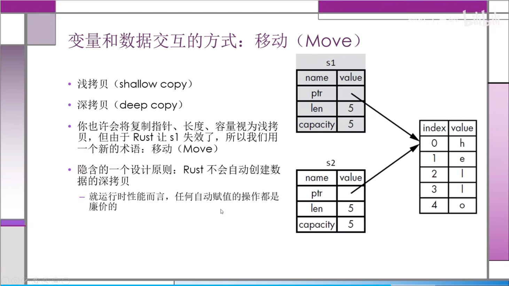
#### Clone
针对堆上的数据，使用clone方法，会在堆上重新分配内存，将数据复制到新的内存中，返回新的指针。
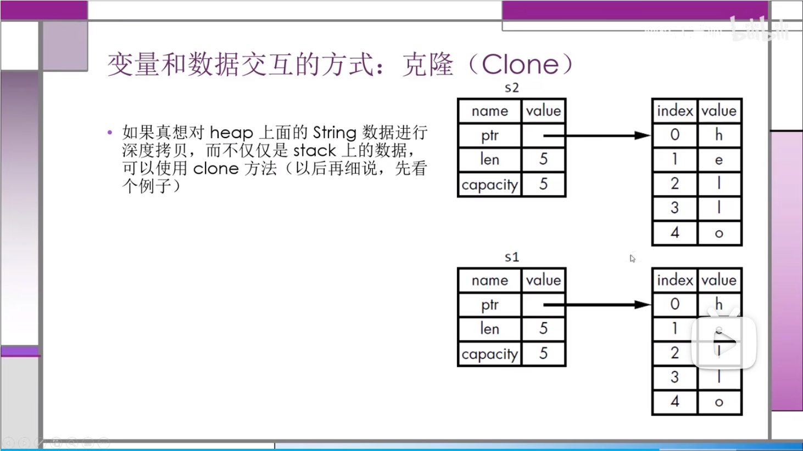
#### Copy
针对栈上的数据，使用copy方法，会直接复制数据，不需要重新分配内存。
对于只存在于栈上的数据，实现了copy trait的类型，可以直接复制数据，不需要重新分配内存。对他们来说，深度拷贝和浅度拷贝没有区别。
Copy trait：
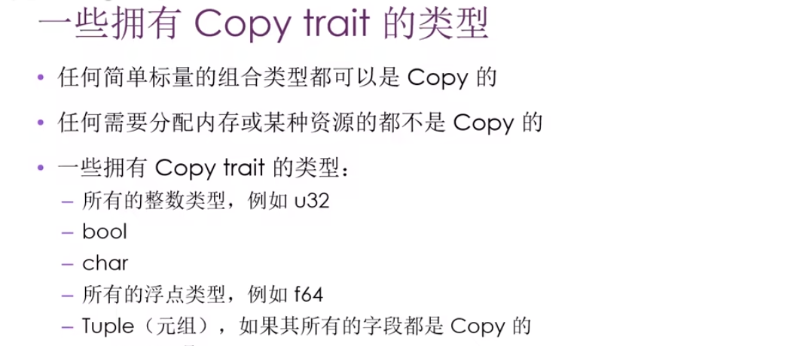
Drop trait：
实现了copy trait的类型，不允许实现drop trait。因为drop trait会在变量离开作用域时，释放内存，而copy trait的类型不需要释放内存。
### 所有权与函数
在语义上，将值传递给函数和把值赋给变量是类似的：会发生移动或者复制。函数的参数也是变量的一种。
#### 返回值与作用域
- 函数在返回值的过程中也会发生所有权的转移。
- 一个变量的所有权总是遵循同样的模式
    - 把一个值赋给另一个变量时，发生移动。
    - 当一个包含堆上数据的变量离开作用域时，它的值会被drop。除非数据的所有权被移动到另一个变量中。
#### reference
- 引用允许你使用值但不获取其所有权。
### 引用和借用
-  `&String` 和 `String` 是不同的类型，`&String` 是一个指向 `String` 的引用。
- 把引用作为函数参数这个行为叫做借用。
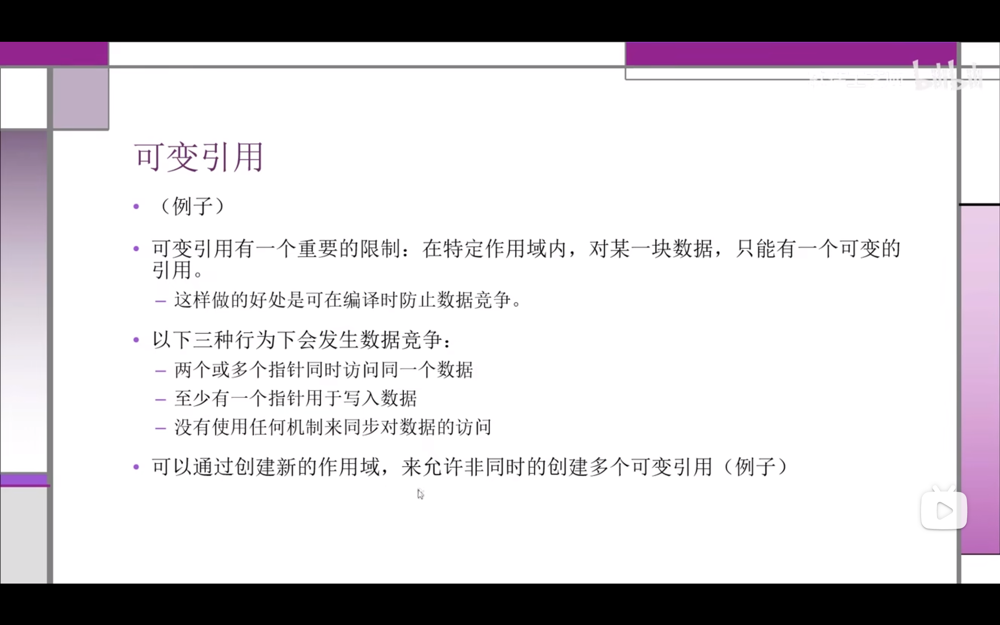
- 不可以同时存在可变引用和不可变引用。
- 多个不可变引用是可以的。
#### 悬空引用
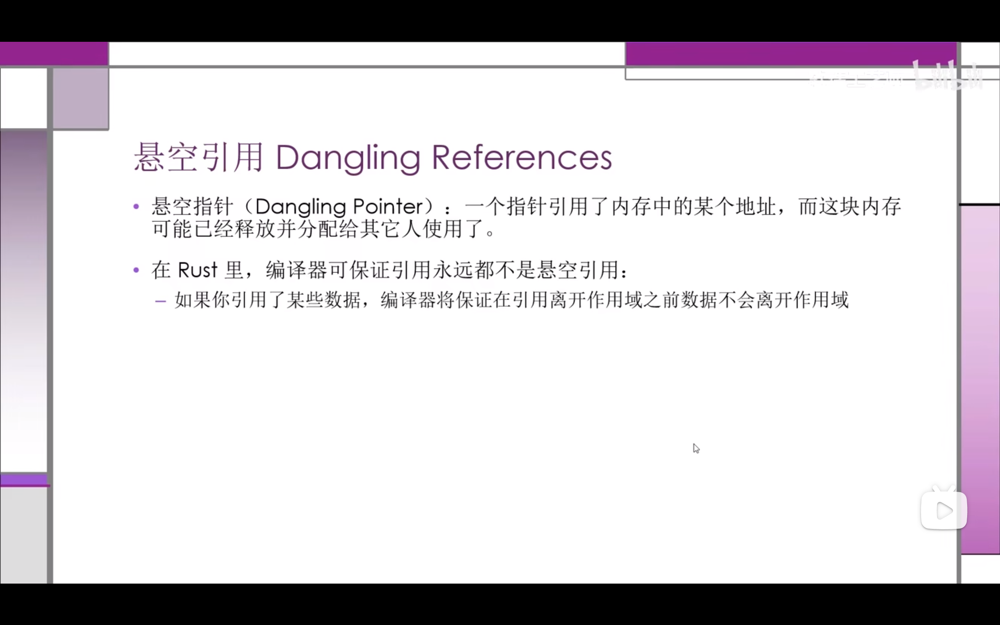
```rust
fn main() {
    let reference_to_nothing = dangle();
}
fn dangle() -> &String {
    let s = String::from("hello");
    &s
}
```
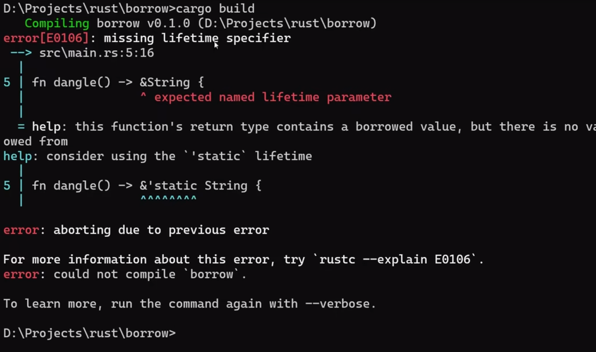
- 引用必须一直有效。
#### slice（&str）
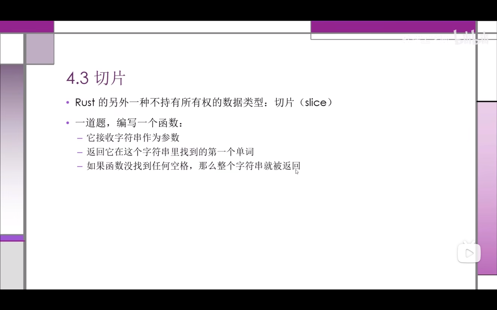
- 为了防止与字符串相关的某个数变量跟字符串没有联系，导致字符串释放后该变量没有意义，rust提供了slice。
##### 例子
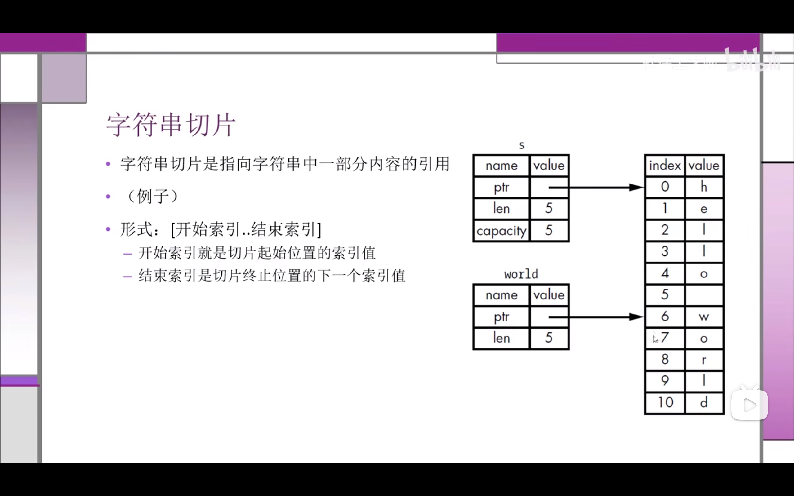
- 不使用slice：
```rust
fn first_word(s: &String) -> usize {
    let bytes = s.as_bytes();
    for (i, &item) in bytes.iter().enumerate() {
        if item == b' ' {
            return i;
        }
    }
    s.len()
}
```
- slice的基本用法：
```rust
fn main() {
    let s = String::from("hello world");
    let hello = &s[0..5];
    let word = &s[6..s.len()];
    let whole = &s[..];
}
```
- 使用字符串slice：
```rust
fn first_word(s: &String) -> &str {
    let bytes = s.as_bytes();
    for (i, &item) in bytes.iter().enumerate() {
        if item == b' ' {
            return &s[..i];
        }
    }
    &s[..]
}
```
> 注意：
>1. 字符串切片的范围是左闭右开的。
>2. slice的范围索引必须发生在有效的UTF-8字符边界内。
>3. 如果尝试从一个多字节的字符中创建slice，程序会报错退出。
>4. s.clear() 会清空字符串，但是slice还是有效的，这是一个可变引用

##### 字符串字面值其实就是字符串slice
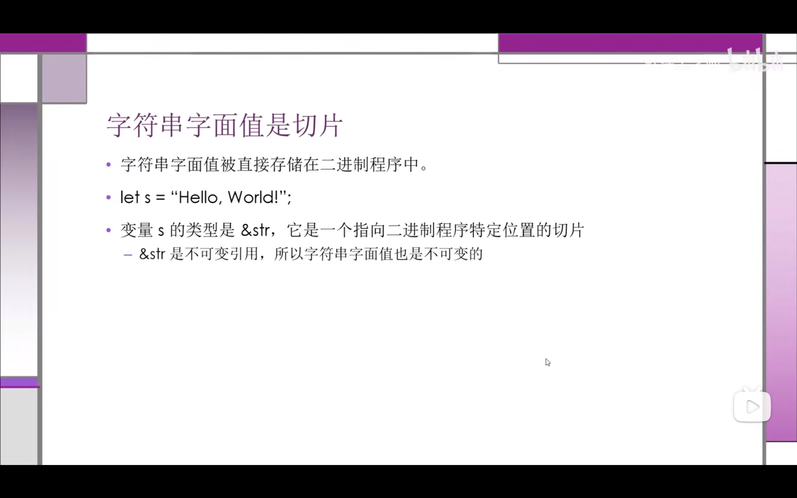

##### 把字符串slice作为参数传递：
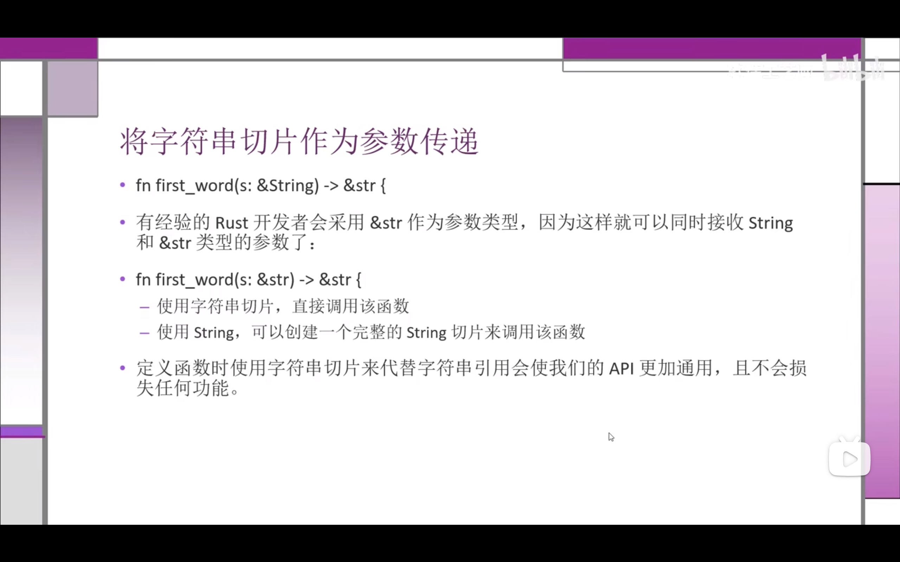

##### 其他slice
- 数组slice
```rust
fn main() {
    let a = [1, 2, 3, 4, 5];
    let slice = &a[1..3];
}
```
## 生命周期
生命周期存在的主要目标是避免悬垂引用（dangling references）。
### 借用检查器
- 借用检查器：编译器的一个组件，通过比较作用域来确保所有的引用都是有效的。
### 生命周期注解
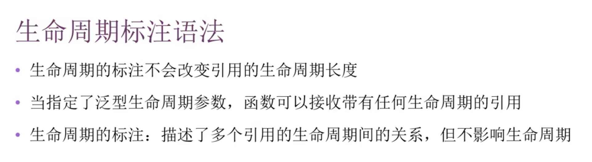
#### 生命周期注解语法
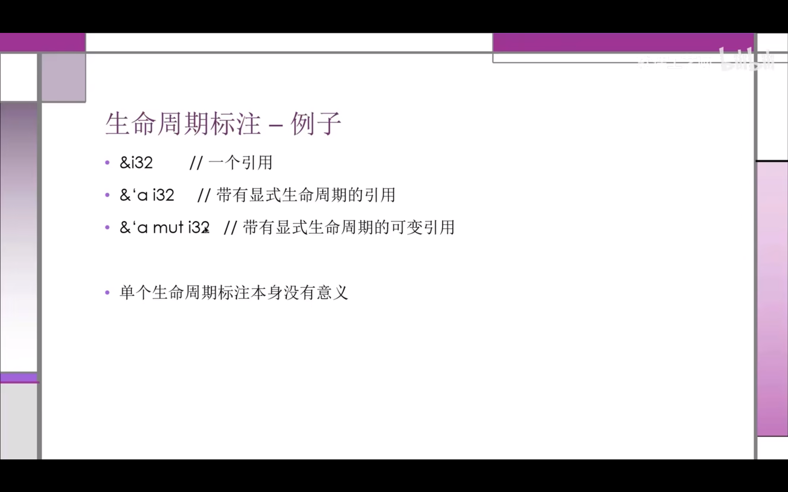
用于描述多个引用的生命周期的关系。因此单个引用的生命周期注解通常无意义。
例子：
```rust
fn longest<'a>(x: &'a str, y: &'a str) -> &'a str {
    if x.len() > y.len() {
        x
    } else {
        y
    }
}
```
- 泛型生命周期参数声明在函数名和参数列表之间的 <> 中。
- `'a` 的实际生命周期是：`x` 和 `y` 的生命周期中较短的那个。
### 深入理解生命周期
#### 生命周期省略规则
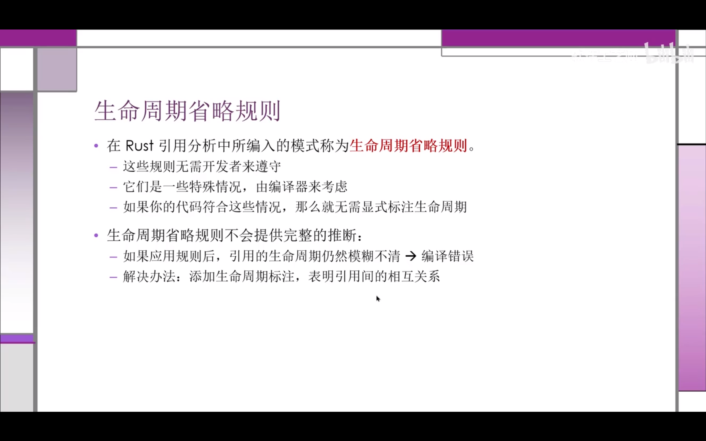
##### 输入、输出生命周期
- 函数参数的生命周期被称为输入生命周期，而返回值的生命周期被称为输出生命周期。
##### 生命周期省略的三个规则
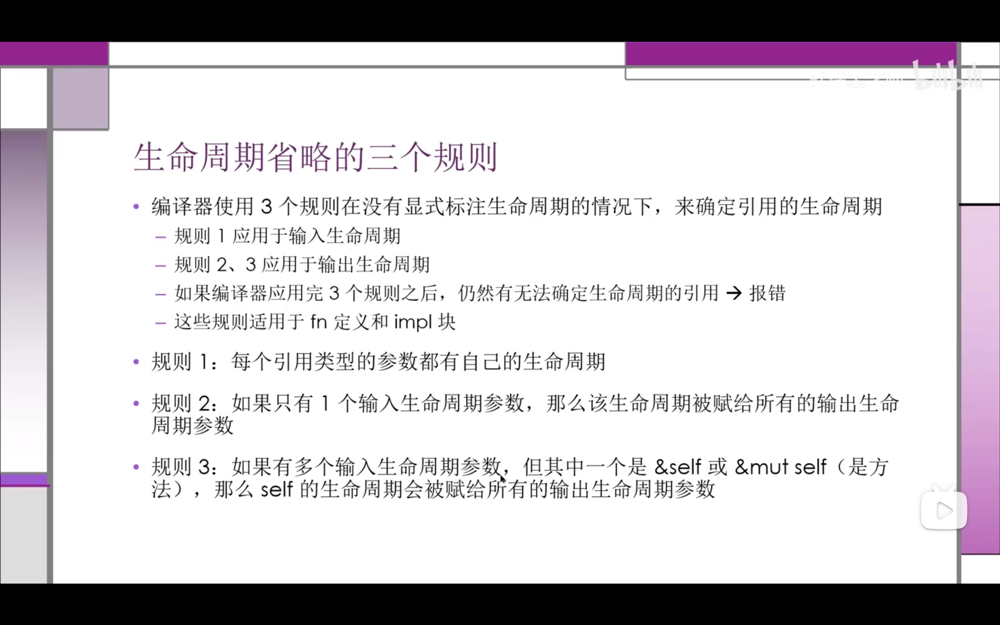
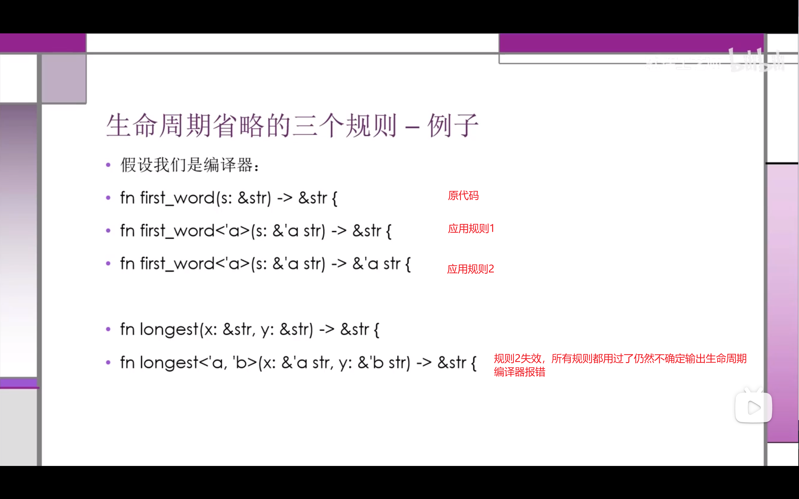
#### 方法中的生命周期标注
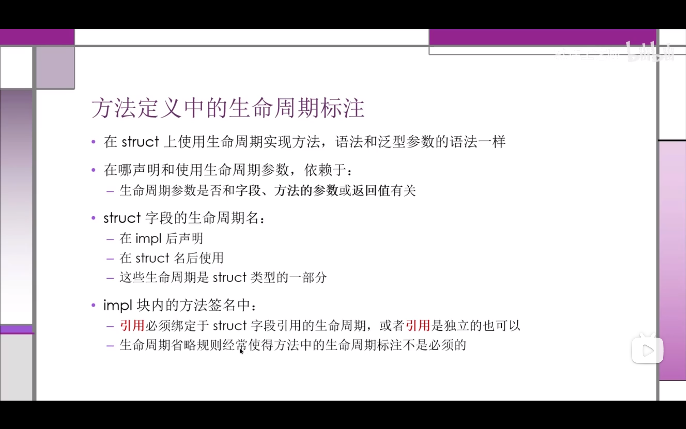
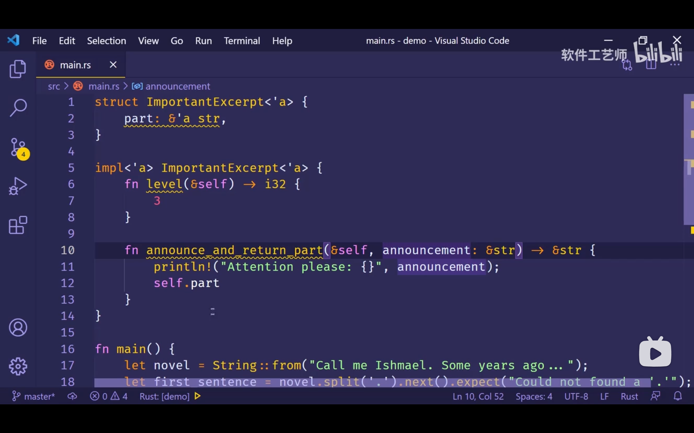
#### 静态生命周期
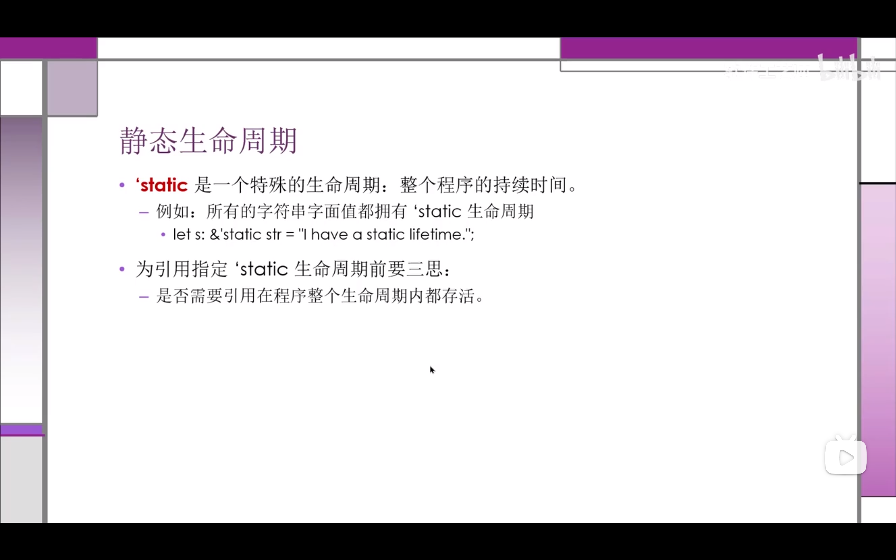
#### 泛型参数类型、trait bound、生命周期
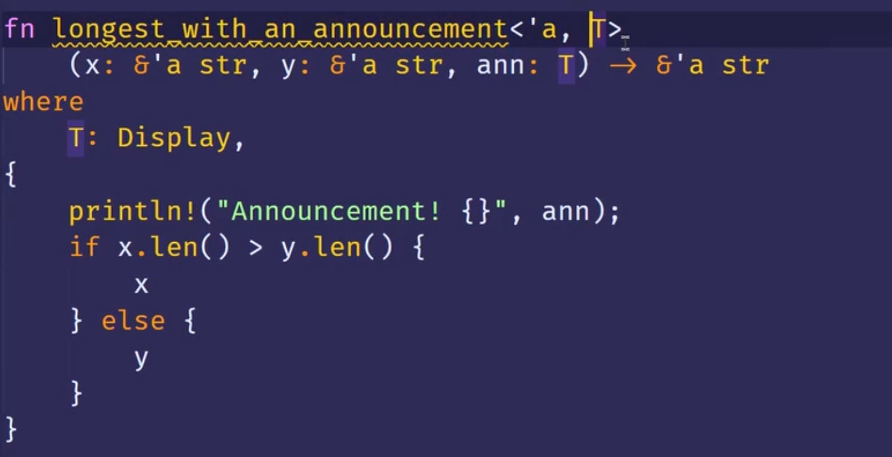