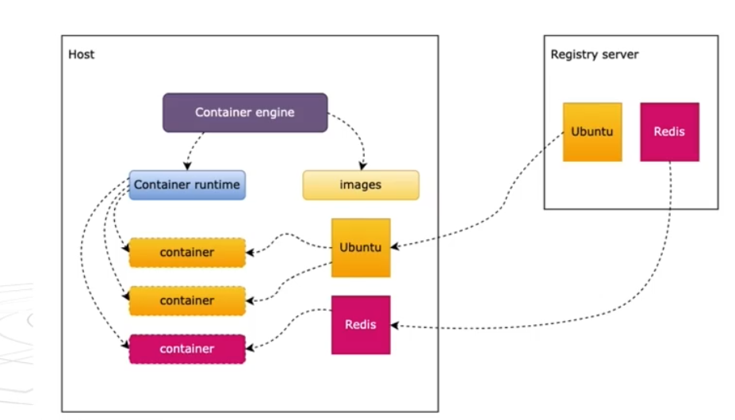
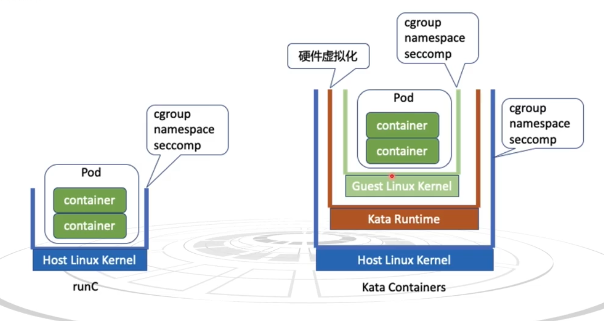
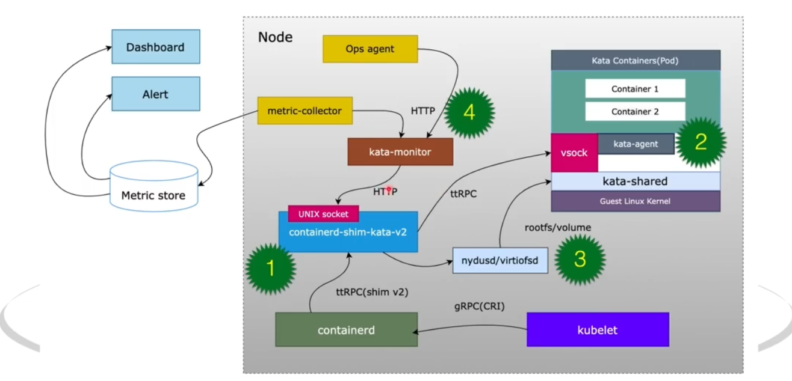
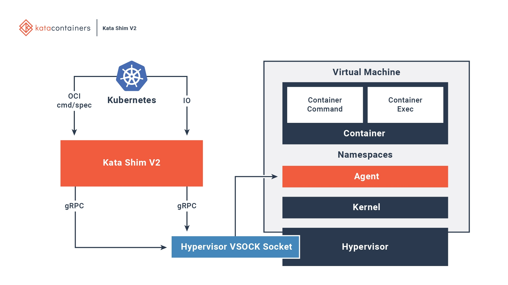

# kata container
## 感性认知
- K8s
- High-level container runtime(container engine): docker,containerd,cri-o
- Low-level container runtime:kata containers、runc、gVisor、youki

## OCI：Open Container Initiative
- runtime-spec 运行时规范（底层运行时）
- image-spec 镜像规范
- distribution-spec 分发规范

- registry server 仓库服务器

runc
containerd
cri-o