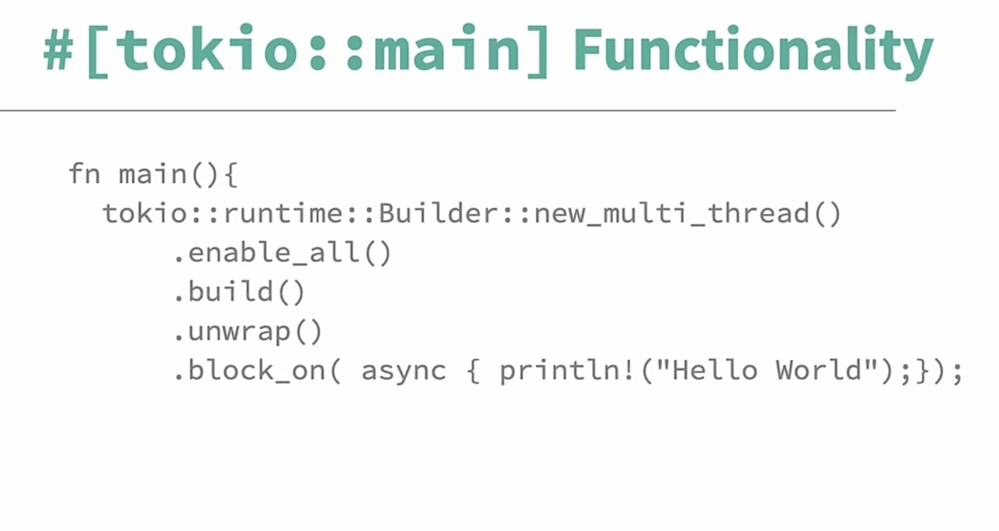

首先，我们需要了解什么是 I/O 密集型任务和 CPU 密集型任务。
- CPU-bound tasks：CPU 密集型任务，指的是任务需要大量的 CPU 计算资源，而不是 I/O 操作。CPU 密集型任务的特点是 CPU 使用率高，计算时间长，I/O 操作少。
- I/O-bound tasks：I/O 密集型任务，指的是任务需要大量的 I/O 操作，而不是 CPU 计算资源。I/O 密集型任务的特点是 CPU 使用率低，计算时间短，I/O 操作多。

异步编程是一种编程模型，用于处理 I/O 密集型任务。在异步编程中，任务的执行不会被阻塞，而是在等待 I/O 操作完成的过程中，可以执行其他任务。这样可以充分利用 CPU 资源，提高系统的性能。


async/await 是 Rust 语言提供的异步编程特性。通过 async/await 关键字，可以定义异步函数。异步函数可以在执行过程中暂停，等待 I/O 操作完成，然后继续执行。这样可以避免线程阻塞，提高系统的并发能力。


暂不关心底层，从高层看，`#[tokio::main]` 宏的作用是，启动一个 tokio 运行时，然后复制函数体给这个运行时执行。


tokio 提供了 `tokio::task` 模块，用于创建异步任务。异步任务是一个可以在 tokio 运行时中执行的异步函数。异步任务可以通过 `tokio::spawn` 函数创建。

Join handle 是一个用于等待异步任务完成的句柄。Join handle 的 `await` 方法会等待异步任务完成，并返回任务的执行结果。

```rust
use tokio::task::JoinHandle;
async fn hello() {
    println!("Hello, world!");
}

#[tokio::main]
async fn main() {
    let handle: JoinHandle<()> = tokio::spawn(hello());
    handle.await.unwrap();
}
```


> spwan blocking tasks 
CPU 密集的任务尤其需要用线程的方式去处理，例如使用 spawn_blocking 创建一个阻塞的线程去完成相应 CPU 密集任务。使用 spawn_blocking 后，会创建一个单独的 OS 线程，该线程并不会被 tokio 所调度( 被 OS 所调度 )，因此它所执行的 CPU 密集任务也不会导致 tokio 调度的那些异步任务被饿死


`#[tokio::test]` 宏用于定义异步测试函数。异步测试函数是一个异步函数，可以在 tokio 运行时中执行。异步测试函数可以通过 `tokio::test` 宏创建。因为异步函数只能从其他异步函数中调用，不能从同步函数中调用。


`tokio::sync::mpsc` 模块提供了多生产者单消费者通道。多生产者单消费者通道是一种异步通道，用于在多个生产者和单个消费者之间传递消息。多生产者单消费者通道可以通过 `tokio::sync::mpsc` 模块创建。

```rust
use tokio::sync::mpsc;
use tokio::time::{sleep, Duration};

#[tokio::main]
async fn main() {
    let (tx, mut rx) = mpsc::channel(32);

    tokio::spawn(async move {
        for i in 0..5 {
            tx.send(i).await.unwrap();
            sleep(Duration::from_secs(1)).await;
        }
    });

    while let Some(i) = rx.recv().await {
        println!("Received: {}", i);
    }
}
```

`tokio::sync::oneshot` 模块提供了一次性通道。一次性通道是一种异步通道，用于在一个生产者和一个消费者之间传递单个消息。一次性通道可以通过 `tokio::sync::oneshot` 模块创建。

```rust
use tokio::sync::oneshot;
use tokio::time::{sleep, Duration};

#[tokio::main]
async fn main() {
    let (tx, rx) = oneshot::channel();

    tokio::spawn(async move {
        sleep(Duration::from_secs(2)).await;
        tx.send("Hello, world!").unwrap();
    });

    let msg = rx.await.unwrap();
    println!("{}", msg);
}
```

`tokio::sync::watch` 模块提供了观察者模式。观察者模式是一种设计模式，用于在多个观察者和一个主题之间建立一对多的依赖关系。观察者模式可以通过 `tokio::sync::watch` 模块创建。

```rust
use tokio::sync::watch;
use tokio::time::{sleep, Duration};

#[tokio::main]
async fn main() {
    let (tx, mut rx) = watch::channel("Hello, world!");

    tokio::spawn(async move {
        sleep(Duration::from_secs(2)).await;
        tx.send("Hello, tokio!").unwrap();
    });

    while let Some(msg) = rx.recv().await {
        println!("{}", msg);
    }
}
```

`tokio::sync::broadcast` 模块提供了广播通道。广播通道是一种异步通道，用于在一个生产者和多个消费者之间传递消息。广播通道可以通过 `tokio::sync::broadcast` 模块创建。

```rust
use tokio::sync::broadcast;
use tokio::time::{sleep, Duration};

#[tokio::main]
async fn main() {
    let (tx, mut rx1) = broadcast::channel(32);
    let mut rx2 = tx.subscribe();

    tokio::spawn(async move {
        for i in 0..5 {
            tx.send(i).unwrap();
            sleep(Duration::from_secs(1)).await;
        }
    });

    tokio::spawn(async move {
        while let Ok(i) = rx1.recv().await {
            println!("Received1: {}", i);
        }
    });

    tokio::spawn(async move {
        while let Ok(i) = rx2.recv().await {
            println!("Received2: {}", i);
        }
    });

    tokio::time::sleep(Duration::from_secs(10)).await;
}
```


`tokio::sync::Barrier` 屏障是一种用于同步多个任务的同步原语。屏障可以让多个任务在某个点上等待，然后同时继续执行。屏障可以通过 `tokio::sync::Barrier` 模块创建。

```rust
use tokio::sync::Barrier;
use tokio::time::{sleep, Duration};


#[tokio::main]
async fn main() {
    let barrier = Barrier::new(2);

    tokio::spawn(async move {
        println!("Task1: before wait");
        barrier.wait().await;
        println!("Task1: after wait");
    });

    tokio::spawn(async move {
        println!("Task2: before wait");
        barrier.wait().await;
        println!("Task2: after wait");
    });

    tokio::time::sleep(Duration::from_secs(10)).await;
}
```

`tokio::sync::RwLock` 读写锁是一种用于控制并发访问的同步原语。读写锁允许多个线程同时读取共享资源，但只允许一个线程写入共享资源。读写锁可以通过 `tokio::sync::RwLock` 模块创建。

```rust
use tokio::sync::RwLock;
use tokio::time::{sleep, Duration};

#[tokio::main]
async fn main() {
    let rwlock = RwLock::new(0);

    tokio::spawn(async move {
        let mut lock = rwlock.write().await;
        *lock += 1;
        println!("Task1: write lock = {}", *lock);
    });

    tokio::spawn(async move {
        let lock = rwlock.read().await;
        println!("Task2: read lock = {}", *lock);
    });

    tokio::time::sleep(Duration::from_secs(10)).await;
}
```

`tokio::sync::Mutex` 互斥锁是一种用于控制并发访问的同步原语。互斥锁允许一个线程访问共享资源，其他线程必须等待该线程释放锁后才能访问共享资源。互斥锁可以通过 `tokio::sync::Mutex` 模块创建。

```rust
use tokio::sync::Mutex;
use tokio::time::{sleep, Duration};

async fn person (name: &str, remote_arc: Arc<Mutex<i32>>, new_channel: i32) {
    let mut remote = remote.lock().await;
    *remote = new_channel;
    println!("{} changed the channel to {}", name, new_channel);
    sleep(Duration::from_secs(1)).await;
}

#[tokio::main]
async fn main() {
    let tv_channel = 10;
    let remote = Mutex::new(tv_channel);
    let remote_arc = Arc::new(remote);

    let mut task_handles = Vec::new();
    for (name, new_channel) in vec![("Alice", 5), ("Bob", 3), ("Carol", 2)] {
        task_handles.push(tokio::spawn(person(
            name.to_string(),
            remote_arc.clone(),
            new_channel
        )));
    }
    for task in task_handles {
        task.await.unwrap();
    }
}
```


`tokio::sync::Semaphore` 信号量是一种用于控制并发访问的同步原语。信号量可以限制同时访问共享资源的线程数量。信号量可以通过 `tokio::sync::Semaphore` 模块创建。

```rust
use std::sync::Arc;
use tokio::sync::Semaphore;
use tokio::time::{sleep, Duration};

async fn person (semaphore: Arc<Semaphore>, name: String) {
    println!("{} is waiting", name);

    teller(&semaphore, name).await;
}

async fn teller(semaphore: &Arc<Semaphore>, name: String) {
    // Acquire a permit
    let permit = semaphore.clone().acquire().await.unwrap();
    println!("{} is in", name);
    sleep(Duration::from_secs(1)).await;
    drop(permit);
    println!("{} is out", name);
}

#[tokio::main]
async fn main() {
    let semaphore_arc = Arc::new(Semaphore::new(2));

    let mut task_handles = Vec::new();
    for name in vec!["Alice", "Bob", "Carol", "Dave", "Eve"] {
        task_handles.push(tokio::spawn(person(
            semaphore_arc.clone(),
            name.to_string()
        )));
    }
    for task in task_handles {
        task.await.unwrap();
    }
}
```


notify 用于通知异步任务完成。notify 会返回一个通知器，通知器可以用于通知异步任务完成。通知器是一个 Future，可以通过 await 关键字等待通知器完成。通知器完成后，会返回一个通知结果，通知结果是一个 Result 类型，包含通知的结果。

```rust
use tokio::sync::Notify;
use tokio::time::{sleep, Duration};

#[tokio::main]
async fn main() {
    let notify = Notify::new();
    let notify_clone = notify.clone();

    tokio::spawn(async move {
        sleep(Duration::from_secs(2)).await;
        notify_clone.notify();
    });

    notify.notified().await;
    println!("Notified");
}
```
