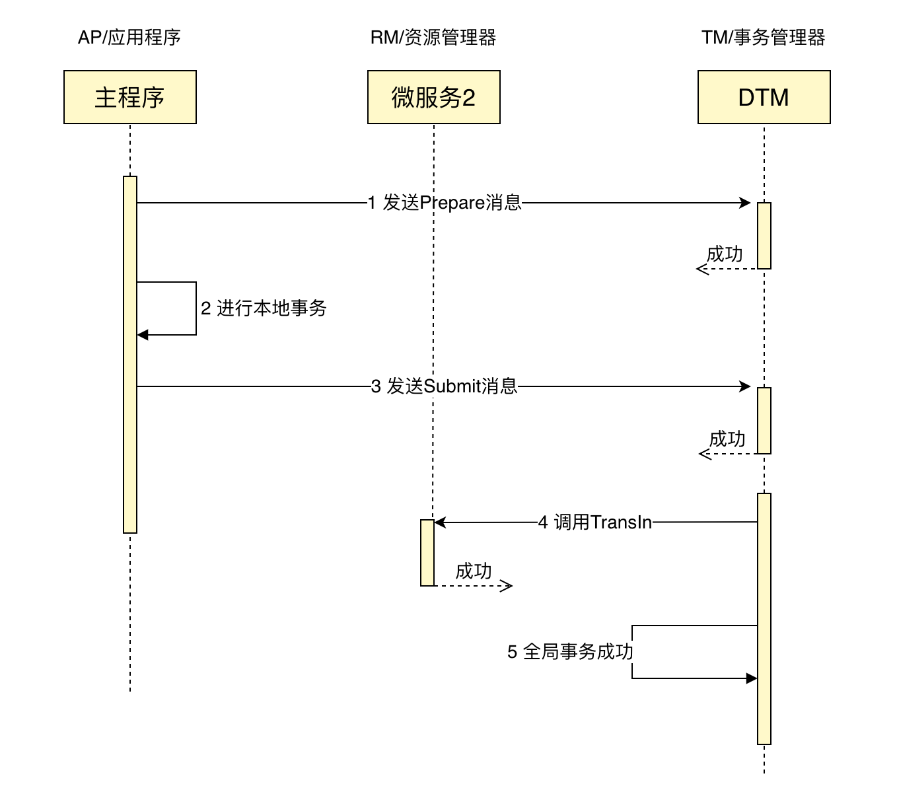
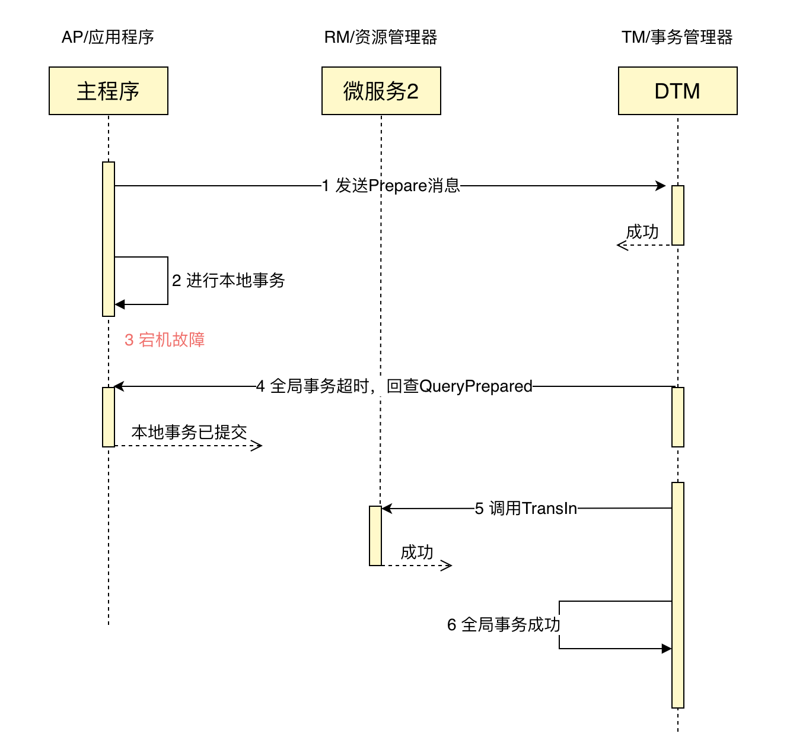
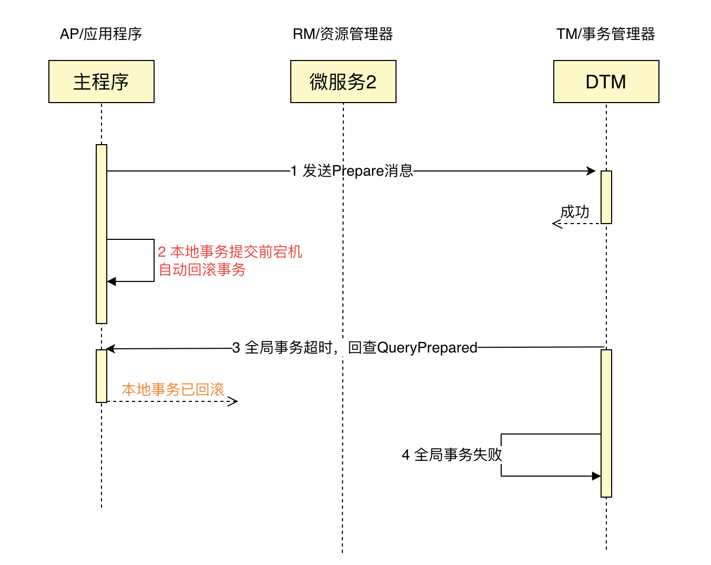

# DTM 分布式事务管理器
https://dtm.pub/

# qs（Quick Start）


# 二阶段消息
>二阶段消息，可以完美替代现有的事务消息或本地消息表架构。无论从复杂度、便利性、性能，还是代码量，新架构都完胜现有架构方案，是这个领域的革命性架构。

二阶段消息是 dtm 首创的事务模式，用于替换本地事务表和事务消息这两种现有的方案。它能够保证本地事务的提交和全局事务提交是“原子的”，适合解决不需要回滚的分布式事务场景。下面我们来看看二阶段消息，如何解决这个业务场景的问题。

## http_msg_doAndCommit 流程分析
### 定义和实现与分布式事务相关的业务逻辑和数据库操作
`data.go` 的主要作用是定义和实现与分布式事务相关的业务逻辑和数据库操作。在这里，我们定义了一个名为 `SagaAdjustBalance` 的函数，用于调整用户的余额。在这个函数中，我们首先判断事务的执行结果，如果事务执行失败，则返回错误；否则，我们执行核心的业务逻辑，即调整用户的余额。
```go
// SagaAdjustBalance 1
func SagaAdjustBalance(db dtmcli.DB, uid int, amount int, result string) error {
	if strings.Contains(result, dtmcli.ResultFailure) {
		return dtmcli.ErrFailure
	}
	// 核心业务代码：调整用户余额
	_, err := dtmimp.DBExec(BusiConf.Driver, db, "update dtm_busi.user_account set balance = balance + ? where user_id = ?", amount, uid)
	return err
}
```
### 定义和实现分布式事务中的屏障（Barrier）机制
`barrier.go` 的主要作用是定义和实现分布式事务中的屏障（Barrier）机制，用于确保事务的幂等性和一致性。
在这里，我们定义了一个名为 `BarrierSetup` 的函数，用于设置分布式事务的屏障。

在这个函数中，我们首先定义了一个名为 `SagaBTransIn` 的接口，用于处理分布式事务的提交。在这个接口中，首先获取事务的屏障，然后调用 `barrier.CallWithDB` 函数，用于处理幂等，保证重复调用不会多次调整余额。详见下面的 *异常处理与子事务屏障*。
```go
func init() {
	setupFuncs["BarrierSetup"] = func(app *gin.Engine) {
		app.POST(BusiAPI+"/SagaBTransIn", dtmutil.WrapHandler(func(c *gin.Context) interface{} {
			barrier := MustBarrierFromGin(c)
			// barrier.CallWithDB 用于处理幂等，保证重复调用不会多次调整余额
			return barrier.CallWithDB(pdbGet(), func(tx *sql.Tx) error {
				return SagaAdjustBalance(tx, TransInUID, reqFrom(c).Amount, reqFrom(c).TransInResult)
			})
		}))
        // 其他接口...
    }
}
```
### 二阶段事务
各个子事务的处理函数完成之后，下一步就是开启二阶段消息事务，进行分支调用：

```go
AddCommand("http_msg_doAndCommit", func() string {
		gid := shortuuid.New()
		req := busi.GenReqHTTP(30, false, false)
		msg := dtmcli.NewMsg(DtmServer, gid).
			Add(busi.Busi+"/SagaBTransIn", req)
		err := msg.DoAndSubmitDB(busi.Busi+"/QueryPreparedB", dtmutil.DbGet(busi.BusiConf).ToSQLDB(), func(tx *sql.Tx) error {
			return busi.SagaAdjustBalance(tx, busi.TransOutUID, -req.Amount, "SUCCESS")
		})
		logger.FatalIfError(err)
		return gid
	})
```
#### DoAndSubmitDB
注意到 DoAndSubmitDB，DoAndSubmitDB是如何保证业务成功执行与msg 提交的原子性的呢？
##### 参数
- 第一个参数为回查URL，用于 TM 在回查 AP 的本地事务提交状态时调用
- 第二个参数为 sql.DB，是业务访问的数据库对象
- 第三个参数是业务函数，我们这个例子中的业务是给 A 扣减30元余额
##### 成功例子

DTM 收到 Prepare 调用后，不会调用分支事务，而是等待后续的Submit。只有收到了Submit，才开始分支调用，最终完成全局事务。

##### 失败例子(提交后宕机)

如果在**本地事务提交之后，在发送 Submit 前**，出现了进程 Crash 或者机器宕机会怎么样？这个时候 DTM 会在一定超时时间之后，取出**只 Prepare但未 Submit 的 msg 事务**，调用 msg 事务指定的回查服务（QueryPreparedB），如果回查服务返回成功，DTM 会继续提交分支事务，否则回滚分支事务。

>这个回查函数，会到表里面查询，本地事务是否：
>- 已提交： 返回成功，DTM进行下一步子事务调用
>- 已回滚： 返回失败，DTM终止全局事务，不再进行子事务调用
>- 进行中： 这个回查会等待最终结果，然后按照前面的已提交/已回滚的情况处理
>- 未开始： 这个回查会往 RM 本地数据库插入数据，保证本地事务最终失败

##### 失败例子(提交前宕机)

如果在 DTM 收到 Prepare 调用后，AP 在事务提交前，遇见故障宕机，那么**数据库会检测到 AP 的连接断开，自动回滚本地事务**。

后续 DTM 轮询取出已经超时的，只 Prepare 但没有 Submit 的全局事务，进行回查。**回查服务发现本地事务已回滚，返回结果给 DTM。DTM收到已回滚的结果后，将全局事务标记为失败，并结束该全局事务。**

### 按 topic 投递消息
// todo
## 二阶段消息 vs 本地消息表
如果采用本地消息表，需要的工作包括：

- 在本地事务中执行本地业务逻辑，将消息插入消息表并最后提交
- 编写轮询任务，将本地消息表的消息，发给消息队列
- 消费消息，并将消息发给相应的处理服务

两者对比，二阶段消息有以下优点：

- 无需学习或维护任何消息队列
- 不需要处理轮询任务
- 不需要消费消息
## 二阶段消息 vs 事务消息
- 无需学习或维护任何消息队列
- 本地事务与发送消息之间的复杂操作需要手动处理，一不小心，可能出现bug。而二阶段消息则是全自动处理
- 不需要消费消息


## 其他优点
- 二阶段消息整个暴露的接口，完全与队列无关，只跟实际的业务和服务调用相关，对开发人员更加友好
- 二阶段消息不用考虑消息队列消息堆积及其他故障等问题，因为二阶段消息只依赖DTM，开发人员可以认为DTM与系统中其他一个普通无状态服务一样，只依赖背后的存储 MySQL/Redis。
- 消息队列是异步的，而二阶段消息同时支持异步和同步，默认异步，只需要打开msg.WaitResult=true，那么可以同步等待下游服务完成
- 二阶段消息还支持同时指定多个下游服务


## 回查
// todo!()
## topic
// todo!()

## 普通消息
# 异常与子事务屏障
## NPC 的挑战
分布式系统最大的敌人可能就是 **NPC** 了，在这里它是 Network Delay, Process Pause, Clock Drift 的首字母缩写。我们先看看具体的 NPC 问题是什么：

Network Delay，网络延迟。虽然网络在多数情况下工作的还可以，虽然TCP保证传输顺序和不会丢失，但它无法消除网络延迟问题。
Process Pause，进程暂停。有很多种原因可以导致进程暂停：比如编程语言中的GC（垃圾回收机制）会暂停所有正在运行的线程；再比如，我们有时会暂停云服务器，从而可以在不重启的情况下将云服务器从一台主机迁移到另一台主机。我们无法确定性预测进程暂停的时长，你以为持续几百毫秒已经很长了，但实际上持续数分钟之久进程暂停并不罕见。
Clock Drift，时钟漂移。现实生活中我们通常认为时间是平稳流逝，单调递增的，但在计算机中不是。计算机使用时钟硬件计时，通常是石英钟，计时精度有限，同时受机器温度影响。为了在一定程度上同步网络上多个机器之间的时间，通常使用NTP协议将本地设备的时间与专门的时间服务器对齐，这样做的一个直接结果是设备的本地时间可能会突然向前或向后跳跃。
分布式事务既然是分布式的系统，自然也有NPC问题。因为没有涉及时间戳，带来的困扰主要是NP。
# TCC

# XA

# AT vs XA