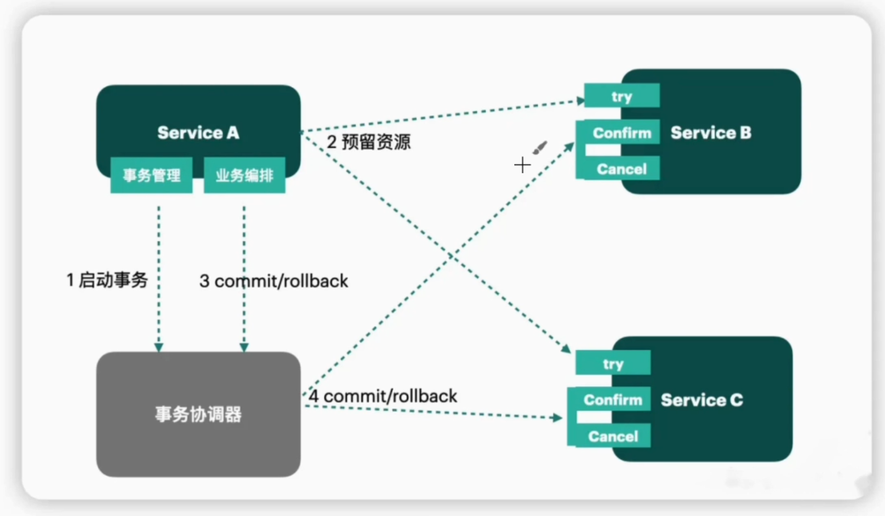

https://www.cnblogs.com/crazymakercircle/p/13917517.html
https://www.bilibili.com/video/BV1bM4y1z71o/?spm_id_from=333.788.player.switch&vd_source=847221b55474b08239f9c09c5099e6ac&p=7
# 什么是分布式事务？
分布式事务是指一个业务流程跨越多个分布式系统或服务的事务处理。他需要确保在多个参与者之间的数据一致性和原子性。

分布式事务中只有最合适的方案，没有最好的方案。根据业务场景的不同，选择不同的分布式事务解决方案。
# 请解释 2PC 协议的基本过程
2PC 协议是指两阶段提交协议，是一种保证分布式事务的一致性的协议。
## 基本组成：
- 1个协调者（Coordinator）：负责协调事务的提交和回滚。例如事务管理器。
- n个参与者（Participant）：事务的执行者，根据协调者的指令执行事务。例如数据库、消息队列等。
## 它的基本过程如下：
1. 准备阶段：协调者询问所有参与者是否可以提交事务（voting），参与者返回事务的执行结果。
2. 提交阶段：如果所有参与者都返回可以提交事务，协调者向所有参与者发送提交请求，参与者执行事务提交操作。

## 2pc解决了什么问题？比起一阶段提交有什么好处？
两阶段提交（2PC, Two-Phase Commit）是一种分布式事务协议，旨在确保跨多个节点的分布式事务能够**原子性地提交或回滚**，从而解决**单阶段提交无法协调多节点一致性的问题**。

---

### **一阶段提交的问题**
一阶段提交（One-Phase Commit, 1PC）指的是直接让每个参与者节点在收到请求后执行事务（提交或回滚）而不进行协调。这种方式的问题在于：
1. **缺乏协调机制**：
   - 每个参与者独立决策，可能导致部分节点成功提交，部分节点失败，事务结果不一致（**数据不一致性**）。
   
2. **无法处理失败情况**：
   - 若某些节点提交成功，但其他节点失败或因网络问题无法响应，事务的整体状态无法回滚或重试，导致数据不完整。

3. **缺少分布式原子性**：
   - 没有机制保证事务要么在所有节点上完成，要么在所有节点上回滚。

---

### **2PC 解决的问题**
两阶段提交通过将事务拆分为两个阶段（**准备阶段**和**提交阶段**），引入协调者角色，确保所有节点在提交事务前达成一致，解决了一阶段提交中的核心问题：

#### **1. 保证分布式事务的原子性**
- 通过 **准备阶段**，协调者会询问所有参与者是否可以提交事务。只有所有参与者都回复 “准备好”（即返回 `Yes`）时，事务才会进入 **提交阶段**。
- 如果有任何一个参与者返回 `No`，协调者会指示所有参与者回滚事务，避免数据不一致。

#### **2. 提高容错能力**
- 在准备阶段，事务状态会被持久化（例如日志存储）。即使协调者或某个参与者节点在提交过程中发生故障，事务状态可以在恢复后重新处理。

#### **3. 引入事务协调者**
- 协调者充当全局决策者，负责统一管理参与者的状态：
  - 参与者仅执行协调者的指令，避免节点独立决策造成的冲突。

---

### **2PC 相比 1PC 的好处**
| 特性                 | 一阶段提交（1PC）                                | 两阶段提交（2PC）                                |
|----------------------|-----------------------------------------------|-----------------------------------------------|
| **一致性**           | 可能导致数据不一致（部分提交，部分失败）。             | 确保所有节点的一致性：要么全提交，要么全回滚。         |
| **容错能力**         | 节点失败后无法恢复事务状态。                        | 通过日志或状态记录，支持故障恢复。                   |
| **原子性**           | 无法保证事务的原子性。                             | 事务提交和回滚是全局一致的，确保原子性。              |
| **协调机制**         | 无统一协调，节点独立操作。                          | 协调者统一管理事务的状态与提交流程。                  |
| **复杂性**           | 简单，适合单节点事务或对一致性要求较低的场景。          | 较复杂，但适用于高一致性、高可靠性的分布式场景。        |

---

### **2PC 的局限性**
虽然 2PC 在一致性和原子性方面较 1PC 有明显优势，但也存在以下问题：
1. **性能开销**：
   - 多次通信和日志记录增加了事务提交的延迟。
   - 长时间的资源占用，可能会导致系统的吞吐量下降。
2. **同步阻塞问题**：
   - 如果协调者或某些参与者发生故障，其他节点可能会阻塞等待，影响系统并发性能。

3. **单点故障**：
   - 协调者（事务管理器）如果发生宕机，可能导致事务状态无法推进。尽管可以通过备份协调器，日志来实现一定程度上容错，但是也存在

4. **脑裂问题**：
   - 如果协调者和参与者之间的通信发生故障，可能**导致事务状态不一致**，需要额外的机制来解决。
---

### **总结**
相比一阶段提交，2PC 提供了一种简单但有效的方式来解决分布式事务的一致性和原子性问题，适用于小规模分布式系统或对事务性能要求不高的场景。然而，在需要高性能、高可用的分布式系统中，通常会选择改进的分布式协议（如 3PC、Paxos、Raft）或弱一致性事务模型（如 BASE 理论）来解决 2PC 的性能和可用性问题。

## 2PC 协议中，如何处理协调者和参与者之间的通信故障？请列举一些解决方案。
在 2PC 协议中，协调者和参与者之间的通信故障是不可避免的。为了保证分布式事务的一致性和可靠性，需要采取一些措施来处理这种故障情况。以下是一些常见的解决方案：
- 超时机制（Timeout）：协调者和参与者之间的通信需要设置超时时间，如果在规定时间内没有收到对方的响应，可以认为对方发生了故障。此时直接通知其他参与者回滚事务。
- 心跳检测（Heartbeat）：协调者和参与者之间定期发送心跳消息，检测对方的存活状态。如果长时间未收到心跳消息，可以认为对方发生了故障。
- 预备性提交（Prepared Commit）：在 2PC 的准备阶段，协调者会询问所有参与者是否可以提交事务。如果某个参与者在准备阶段返回“可以提交”，但在提交阶段发生通信故障，无法收到参与者的确认请求，那么向该参与者发送回滚请求。
- 备份协调器（Backup Coordinator）：为了防止协调者发生故障，可以引入备份协调器。备份协调器会定期同步协调者的状态，一旦协调者发生故障，备份协调器可以接管事务的协调工作。

## 说说你了解的3PC协议，它在2PC的基础上有什么改进？
3PC 协议（Three-Phase Commit）是一种改进的分布式事务协议，相比 2PC 协议，引入了一个额外的准备阶段，以减少 2PC 中的同步阻塞和单点故障的风险。

### 3PC 协议的基本过程
1. **CanCommit 阶段**：协调者询问所有参与者是否可以提交事务。如果所有参与者都返回“可以提交”，则进入第二阶段；否则直接回滚。
2. **PreCommit 阶段**：协调者向所有参与者发送预提交请求，参与者执行事务的预提交操作，但是不会立即提交，而是处于就绪状态，等待协调者的下一步指示。如果所有参与者都成功，进入第三阶段；否则回滚。
3. **DoCommit 阶段**：如果所有参与者都处于就绪状态，那么协调者向所有参与者发送提交请求，参与者执行事务的提交操作；否则协调者会向所有参与者发送 Abort 请求回滚，要求他们放弃事务。

#### 3PC 对 2PC 的改进
3PC 的改进点可以总结为以下几个方面：

1. **非阻塞性**
- 引入超时机制：3PC 在预提交阶段加入超时检测，使参与者在无法与协调者通信时，根据状态独立决策（如回滚或提交）。
-状态更加细化：通过 “预提交” 阶段，参与者能清楚知道事务的中间状态，避免了因为协调者失败而陷入两难。
2. **减少单点故障的影响**
在协调者失败的情况下，参与者可以依据自己的状态（是已预提交还是未提交）决定下一步操作，而不是一直等待协调者。
3. **容错性更高**
如果某些参与者或协调者出现网络分区，系统可以尝试根据已有的状态继续达成一致，而不会因网络问题导致全局阻塞。

### 3PC 的局限性
尽管 3PC 相比 2PC 改进了非阻塞性，但它仍然有以下局限：

- **网络分区下可能违背一致性**：在严重的网络分区中，可能存在 “脑裂” 问题，即不同分区内的节点可能做出不同的决策。
- **性能开销更大**：引入了一个额外的阶段，增加了事务延迟和网络通信开销。
- **并未完全消除阻塞**：虽然概率更低，但某些极端情况下仍可能发生阻塞。

## 请描述 AT 模式的基本过程
AT 模式（自动补偿型事务模式，Automatic Compensation Transaction）是一种基于补偿机制的分布式事务模式，通过在事务执行过程中记录补偿操作，实现事务的原子性和一致性。

在分布式事务中，AT 模式通过使用一种称为“业务补偿”的方法，对事务过程进行改进：每个参与者都会在完成本地事务后，生成一个补偿操作。补偿操作用于在事务失败时，将已完成的本地事务回滚到之前的状态。通过这种方式解决了 2PC 中的阻塞问题，提高了系统的可用性。

### AT 模式的基本过程
1. **Try 阶段**：参与者执行本地事务，并生成补偿操作。如果所有参与者都成功，进入 Confirm 阶段；否则进入 Cancel 阶段。
   - 保存本地快照：在执行本地事务前，保存当前状态的快照，以便在回滚时恢复数据。
   - 执行本地事务：参与者执行本地事务，生成补偿操作。
   - 保存新快照：在事务执行成功后，保存新的快照，用于回滚操作。
   - 生成行锁：为了保证事务的一致性，可以在执行本地事务时生成行锁，避免数据冲突。
2. **Confirm 阶段**：在协调者收到所有参与者的执行结果后，会对这些结果进行汇总和分析。如果所有参与者都成功执行了本地事务，则协调者会向所有参与者发送提交事务的请求，参与者收到请求后会提交本地事务并向协调者返回提交结果。如果任何一个参与者在执行本地事务的时候出现了错误或者超时，协调者会向所有参与者发送回滚事务的请求，参与者收到请求后会撤销本地事务并向协调者返回回滚结果。
   - 删除行锁和两个快照：在确认阶段，如果所有参与者都成功，可以删除行锁和两个快照，释放资源。
3. **Cancel 阶段**：参与者执行补偿操作，回滚本地事务。如果所有参与者都成功，事务回滚成功；否则需要人工介入处理。

### AT 模式的应用场景
AT 模式适用于以下场景：
- **高可用性要求**：AT 模式通过补偿机制，避免了 2PC 中的阻塞问题，提高了系统的可用性。
- **异步通信**：AT 模式中，参与者在 Try 阶段执行本地事务，生成补偿操作，不需要等待其他参与者的响应，适用于异步通信的场景。
- **业务逻辑简单**：AT 模式通过补偿机制实现事务的原子性和一致性，适用于业务逻辑相对简单的场景。

### AT 模式的局限性
尽管 AT 模式在可用性和性能方面有一定优势，但也存在以下局限性：
- AT 模式无法处理参与者之间存在依赖关系的事务，例如一个事务的结果依赖于另一个事务的结果，则无法使用 AT 模式来处理。
- 在尝试阶段，参与者需要锁定涉及的资源，会增加系统的并发性能开销
- 如果在确认阶段出现协调者故障，则需要使用一些额外的机制来恢复事务，否则可能导致数据不一致。

## 请描述 TCC 模式的基本过程
其他需要锁定资源的协议不太适用于高并发的场景。而 TCC 协议则是一种更加适用于高并发场景的分布式事务协议。TCC 协议是一种基于“尝试”、“确认”、“取消”三个操作的分布式事务协议，通过这三个操作来实现事务的原子性和一致性。

### TCC 模式的基本过程

1. **Try 阶段**：在 Try 阶段，参与者会尝试执行本地事务，并预留资源。如果所有参与者都成功，进入 Confirm 阶段；否则进入 Cancel 阶段。
   - **Try**：参与者执行本地事务，尝试锁定资源。
   - **Confirm**：参与者确认执行本地事务，释放资源。
   - **Cancel**：参与者取消执行本地事务，释放资源。
2. **Confirm 阶段**：在 Confirm 阶段，协调者会向所有参与者发送确认请求，参与者执行本地事务并释放资源。如果所有参与者都成功，事务提交成功；否则进入 Cancel 阶段。
   - 具备幂等性：Confirm 阶段的操作需要具备幂等性，即多次执行结果相同。
3. **Cancel 阶段**：在 Cancel 阶段，协调者会向所有参与者发送取消请求，参与者撤销本地事务并释放资源。如果所有参与者都成功，事务回滚成功；否则需要人工介入处理。

### TCC 模式的优劣
- TCC 还是一种2阶段的提交协议，但是相比于2PC，TCC 更加适用于高并发的场景，因为 TCC 在 Try 阶段只是尝试锁定资源，并不会阻塞其他事务的执行。另外，TCC 通过 Confirm 和 Cancel 两个操作，实现了更加细粒度的事务控制，可以根据业务逻辑来决定事务的提交或回滚。

- TCC 开发成本更高：2pc、3pc 对业务代码没有侵入性，而 TCC 模式需要业务代码实现 Try、Confirm、Cancel 三个操作，因此需要在业务代码中实现这三个操作，增加了业务代码的复杂性。

## Saga 模式的基本过程
Saga 模式是一种基于补偿机制的分布式事务模式，通过将事务拆分为多个子事务，并在每个子事务中引入补偿操作，实现事务的原子性和一致性。

### Saga 模式的基本过程
1. **分解事务**：将整个事务拆分为多个子事务，每个子事务对应一个业务操作。
2. **执行事务**：依次执行每个子事务，如果所有子事务都执行成功，则事务提交成功；否则进入补偿阶段。
3. **补偿事务**：对于执行失败的子事务，按照相反的顺序执行补偿操作，将事务回滚到之前的状态。

### Saga 模式的优势

### Saga 的实现方式
#### 基于事件的 saga

- 基于事件的方式中，第一个服务执行完本地事务后，会产生一个事件，其他服务会监听这个事件，触发该服务本地事务的执行，并产生新的事件。

- 每个服务需要实现两个接口：`handle` 和 `compensate`。`handle` 用于执行业务操作，`compensate` 用于执行补偿操作，将事务回滚到之前的状态。
##### 优缺点
- 优点
   - 简单且容易理解。各参与方之间没有直接沟通，完全解耦。比较适合整个分布式事务只有 2~4 个参与方的场景。
   - 而且没有中心化的协调者，各个参与方可以自己决定是否执行补偿操作。
- 缺点
   - 如果涉及过多的业务参与方，则比较容易失控。各业务参与方可以随意监听对方的消息，以至于最后没有人知道到底有哪些系统在监听哪些信息；
   - 有可能会产生环形监听：两个事务相互监听对方产生的事件
#### 基于命令的 saga
基于命令的 saga 模式会定义一个新的服务——协调中心，告诉各个参与方什么时候该做什么事情。协调中心通过命令/回复的方式来和 Saga 中其他服务进行交互。

# 本地消息表
# MQ 事务消息

# 最大努力通知