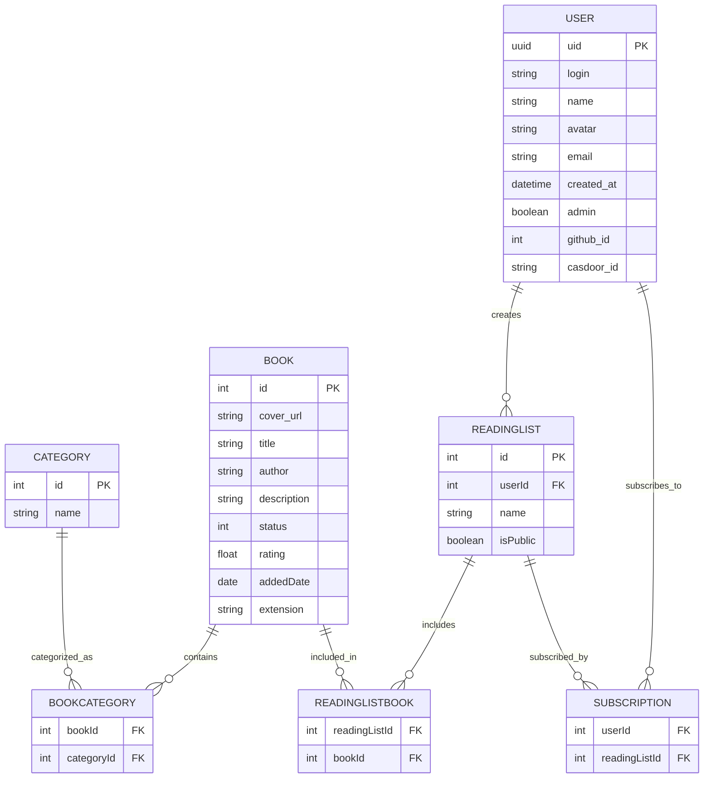

### 关系型数据库——Postgres
#### E-R Diagram

ModernLibre 的数据库设计包含了多个实体及其关系，主要用于管理书籍、用户及其书单。以下是对每个实体及其关系的详细说明：

#### Entity Set

1. **BOOK**
    - `id`: 主键，唯一标识一本书。
    - `cover_url`: 书籍封面图片的OSS URL。
    - `title`: 书名。
    - `author`: 作者，可以为空。
    - `description`: 书籍描述，可以为空。
    - `status`: 书籍状态。
    - `rating`: 评分，可以为空。
    - `addedDate`: 添加日期。
    - `extension`: 文件扩展名。

2. **CATEGORY**
    - `id`: 主键，唯一标识一个类别。
    - `name`: 类别名称。

3. **USER**
    - `uid`: 主键，唯一标识一个用户。
    - `login`: 用户登录名。
    - `name`: 用户姓名，可以为空。
    - `avatar`: 用户头像URL，可以为空。
    - `email`: 用户邮箱。
    - `created_at`: 用户创建时间。
    - `admin`: 是否为管理员。
    - `github_id`: GitHub ID，可以为空。
    - `casdoor_id`: Casdoor ID，可以为空。

4. **READINGLIST**
    - `id`: 主键，唯一标识一个阅读列表。
    - `userId`: 外键，指向USER表的uid。
    - `name`: 阅读列表名称。
    - `isPublic`: 是否公开。
#### Relationship Set
5. **BOOKCATEGORY**
    - `bookId`: 外键，指向BOOK表的id。
    - `categoryId`: 外键，指向CATEGORY表的id。

6. **READINGLISTBOOK**
    - `readingListId`: 外键，指向READINGLIST表的id。
    - `bookId`: 外键，指向BOOK表的id。

7. **SUBSCRIPTION**
    - `userId`: 外键，指向USER表的uid。
    - `readingListId`: 外键，指向READINGLIST表的id。

#### 业务相关的关系阐释

- **BOOK** 和 **BOOKCATEGORY** 之间的关系：一本书可以属于多个类别，一个类别可以包含多本书。
- **CATEGORY** 和 **BOOKCATEGORY** 之间的关系：一个类别可以包含多本书。
- **USER** 和 **READINGLIST** 之间的关系：一个用户可以创建多个阅读列表。
- **READINGLIST** 和 **READINGLISTBOOK** 之间的关系：一个阅读列表可以包含多本书。
- **BOOK** 和 **READINGLISTBOOK** 之间的关系：一本书可以包含在多个阅读列表中。
- **USER** 和 **SUBSCRIPTION** 之间的关系：一个用户可以订阅多个阅读列表。
- **READINGLIST** 和 **SUBSCRIPTION** 之间的关系：一个阅读列表可以被多个用户订阅。

### K-V 缓存——Redis（ValKey）
技术选型：Redis（ValKey）
Redis 公司在2024年将其核心代码库的许可证从BSD许可证变更为专有许可证。在Linux 基金会的领导下，社区对Redis代码进行了分支，创建了名为Valkey的新项目，并保留了BSD许可证。ModernLibre 在此时就计划选择将K-V数据库的选型定为 ValKey，从何降低未来可能的迁移成本。现阶段可以先等同看作 Redis。

### 对象关系映射——Diesel
基于主力开发语言 Rust，ModernLibre 选用了 Diesel 来作为数据层的 ORM（对象关系映射） 库。Diesel 是一个用于 Rust 的强类型、基于查询生成器的 ORM库。它简化数据库操作的同时，提供 Migrations 功能，方便管理数据库模式的变更。

#### migration
Diesel 提供了强大的数据库迁移（migrations）功能，用于管理数据库模式的变更。

- 版本控制: 每个迁移都有一个唯一的时间戳，确保迁移的顺序和版本控制。
- 可回滚: 每个迁移都包含应用和回滚的 SQL 脚本，确保可以安全地回滚变更。
- 自动化: 使用 Diesel CLI 工具可以方便地生成、运行和管理迁移。