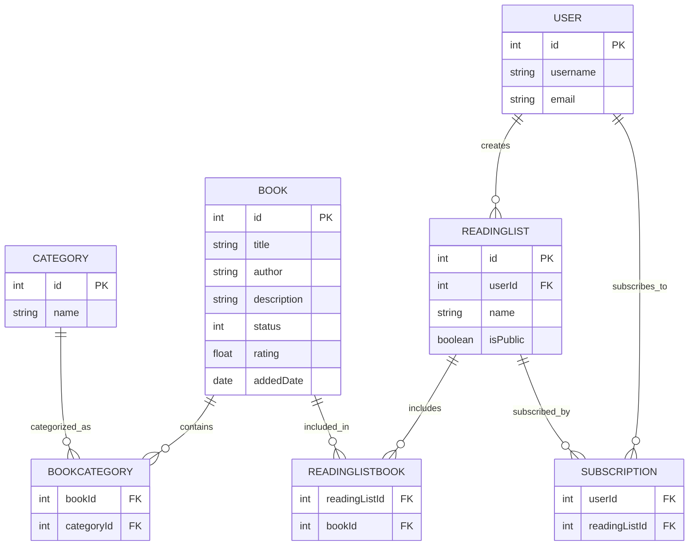

E-R 图如下：

### 解释

1. **BOOK** 和 **CATEGORY** 之间是多对多关系，通过 **BOOKCATEGORY** 表来实现。
2. **USER** 和 **READINGLIST** 之间是一对多关系，一个用户可以创建多个阅读列表。
3. **READINGLIST** 和 **BOOK** 之间是多对多关系，通过 **READINGLISTBOOK** 表来实现。
4. **USER** 和 **READINGLIST** 之间通过 **SUBSCRIPTION** 表来维护订阅关系，一个用户可以订阅多个阅读列表，一个阅读列表可以被多个用户订阅。

这个 Mermaid 代码可以在支持 Mermaid 的环境中渲染成 E-R 关系图。根据具体需求，可以进一步扩展和细化这些实体和关系。