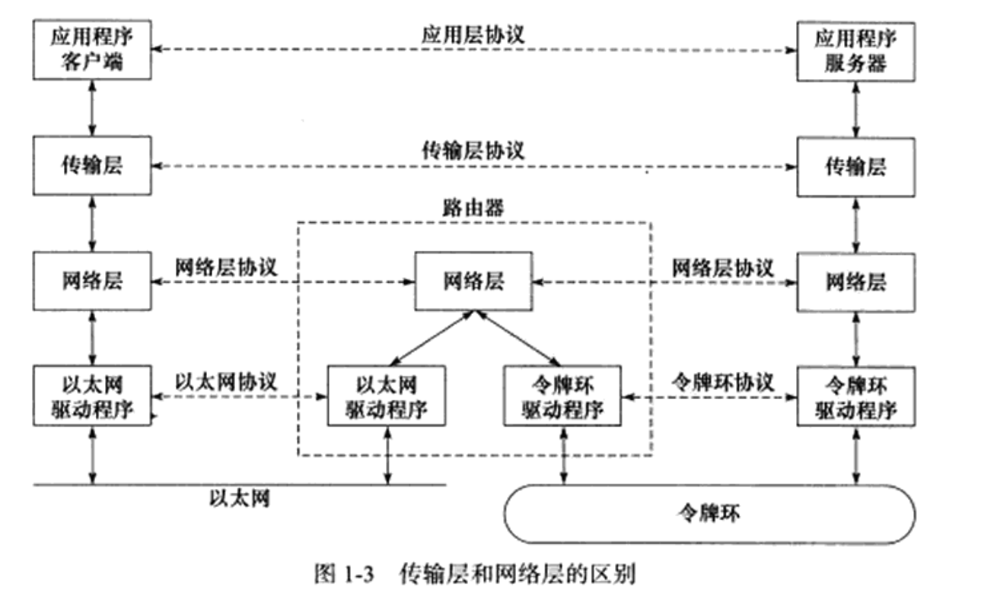
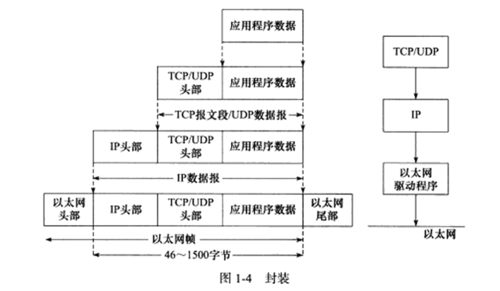
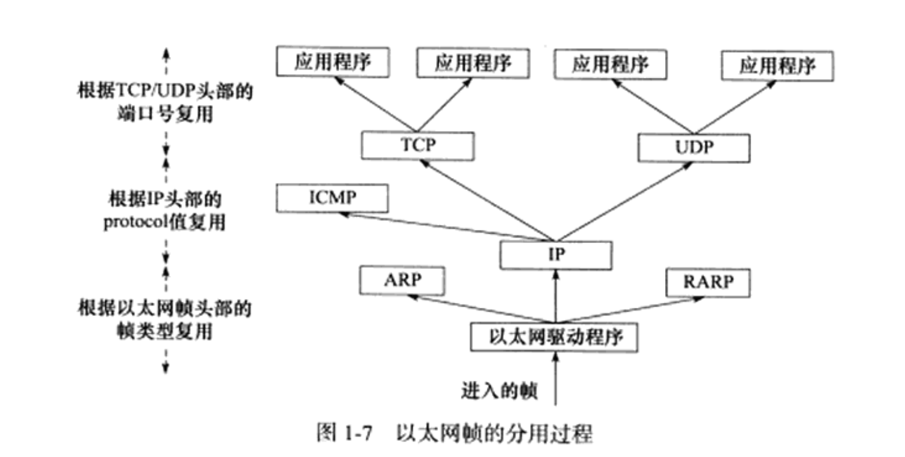

# TCP/IP 协议栈详解
## TCP/IP 协议族
| 协议栈层次 | 具体协议            |
|------------|---------------------|
| 应用层     | telnet, OSPF, DNS   |
| 传输层     | TCP, UDP            |
| 网络层     | ICMP, IP            |
| 数据链路层 | ARP, RARP           |
### 数据链路层
- ARP （Adress Resolution Protocol）地址解析协议
- RARP （Reverse Address Resolution Protocol）反向地址解析协议
实现了 IP 地址到 MAC 地址的映射。RARP通常用于（无盘）磁盘less工作站，因为这些工作站没有存储自己的 IP 地址。
### 网络层
网络层实现数据包的路由和转发，主要协议有 IP 和 ICMP。
- IP（Internet Protocol）互联网协议
- ICMP（Internet Control Message Protocol）互联网控制报文协议
ICMP 是 IP 协议的重要补充，主要用于网络故障的诊断和错误报告。ICMP的报文是封装在 IP 数据包中的。报文格式如下：
```c
struct icmp {
    u_int8_t icmp_type;     // 类型
    u_int8_t icmp_code;     // 代码
    u_int16_t icmp_cksum;   // 校验和
    union {
        struct ih_idseq {
            u_int16_t icd_id;
            u_int16_t icd_seq;
        } ih_idseq;
        u_int32_t ih_void;
    } icmp_hun;
    #define icmp_id icmp_hun.ih_idseq.icd_id
    #define icmp_seq icmp_hun.ih_idseq.icd_seq
    u_int32_t icmp_void;
    u_int8_t icmp_data[1];
};
```
ICMP 的报文内容取决于报文类型。
8位类型字段用于指定 ICMP 报文的类型，它把 ICMP 报文分为两大类：差错报文和查询报文。差错报文用于指示出现了某种差错，例如目标不可达（3）和重定向（5），而查询报文用于请求某种信息，比如 ping 请求（查看目标是否可达，8）和时间戳请求（13）。有的 ICMP 报文还需要使用8位代码字段进一步细分不同的条件。例如，重定向报文用代码值0表示网络重定向，1表示主机重定向。

ICMP用16位校验和字段来检验 ICMP 报文的正确性。循环冗余校验（CRC）算法用于计算校验和。校验和字段的值是报文中所有16位字的和的反码。如果校验和字段的值为0，表示校验和正确。
### 传输层
传输层为两台主机上的应用程序提供端到端的通信。与网络层使用的逐跳通信不同，传输层只关心通信的起始端和目的端，而不在乎数据包的中转过程。

数据链路层（驱动程序）封装了物理网络的电气细节，网络层（IP）封装了数据包的路由和转发这种网络连接的细节，传输层则为应用程序封装了一条端到端的逻辑通信链路，负责数据的收发，链路的超时重传等。

传输层主要有两个协议：TCP、UDP 和 SCTP。
TCP 协议（Transmission Control Protocol，传输控制协议）为应用层提供可靠的面向连接的基于流的服务。TCP 用超时重传，数据确认等方式来确保数据包被正确地发送到目的端。建立TCP连接时，内核中会为该连接分配一些资源，如缓冲区，定时器等。
通信结束必须关闭连接以释放这些内核资源。TCP 是基于流的，基于流的数据没有边界（长度）限制，源源不断。发送端和接收端都可以逐个字节地发送/接收数据，TCP 会自动将数据分割成合适的数据包发送。

UDP 协议（User Datagram Protocol，用户数据报协议）是一种无连接的协议，它不保证数据包的可靠传输。UDP 适用于一些对数据传输速度要求高，但对数据传输的可靠性要求不高的应用场景，如视频流传输，音频流传输等。
基于数据报的服务是相对于基于流的服务而言的，每个UDP数据报都有一个长度，接收端必须以该商都为最小单位将其内容一次性读出，否则数据将被截断。

SCTP 协议（Stream Control Transmission Protocol，流控制传输协议）是为了在因特网上传输电话信号而设计的。
### 应用层
应用层负责处理应用程序的逻辑。可以通过 /etc/services 文件查看所有知名的应用层协议以及他们都能使用哪些传输层服务。

应用层可能跳过传输层直接使用网络层提供的服务，比如 ping 和 OSPF 协议。应用层通常既可以使用 TCP 也可以使用 UDP。比如 DNS。
## 封装与分用
### 封装

每层协议都在上层数据的基础上加上自己的头部（有时候还包括尾部）信息以实现该层的功能，这个过程称为封装。

- 经过 TCP 封装后的数据成为TCP报文段。TCP 协议为双方维持一个连接，并在内核中存储相关数据，这部分数据中的TCP头部信息和 TCP 内核缓冲区数据一起构成了 TCP 报文段。
- 经过 UDP 封装后的数据称为 UDP 数据报。和 TCP 不同的是，UDP 无需为应用层数据保存副本，因为他提供的是无连接的服务，不需要维护连接状态。
    - 当一个 UDP 数据报被发送出去后，内核就会释放这个数据报的内存，不再关心这个数据报的状态。如果应用程序检测到数据报未能被接收端正确接收并打算重发，那么应用程序需要重新从用户空间将这份数据报拷贝到内核的 UDP 发送缓冲区中。
- 经过 IP 封装后的数据称为 IP 数据报。IP 也包括头部信息和数据部分，其中数据部分就是一个 TCP/UDP/IOCMP 报文。IP 数据报是网络层的数据单位，它包含了目的地址和源地址等信息。
- 以太网帧使用6字节的目的物理地址和6字节的源物理地址来表示通信的双方。4字节CRC字段对帧的其他部分提供循环冗余校验。
- 帧的最大传输单元 MTU(MTU, Maximum Transmission Unit) 即帧最多能携带多少上层协议数据（比如 ip 数据报），通常是受到网络类型的限制。以太网帧的 MTU 为 1500 字节。过长的 IP 数据报可能需要被分片（fragment）传输。
示例：以太网帧封装
```
| 目的物理地址 | 源物理地址   | 类型  | 数据      | CRC |
|--------------|------------|------|-----------|-----|
| 6            | 6          | 2    | 46-1500   | 4   |
```
### 分用
各个协议层依次处理帧中本层负责的头部数据，以获取所需的信息，并最终将处理后的帧交给目标应用程序。这个过程称为分用（demultiplexing）。是依靠头部信息中的类型字段实现的。


## IP 协议详解

## TCP 协议详解

## TCP/IP 通信案例


# 深入解析高性能服务器编程
## 网络编程基础 API
## 高级 I/O 函数
## 程序规范
## 程序框架
## I/O 复用
## 信号
## 定时器
## Libevent
## 多进程
## 多线程
## 进程池和线程池
# 高性能服务器优化与监测
## 调制，调试和测试
## 系统监测工具
