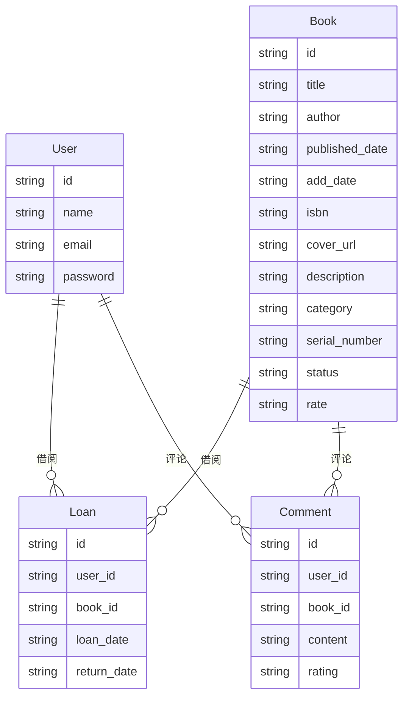

E-R 图如下：

```mermaid
erDiagram
    User {
        string id
        string name
        string email
        string password
    }
    Book {
        string id
        string title
        string author
        string published_date
        string add_date
        string isbn
        string cover_url
        string description
        string category
        string serial_number
        string status
        string rate
    }
    Loan {
        string id
        string user_id
        string book_id
        string loan_date
        string return_date
    }
    Comment {
        string id
        string user_id
        string book_id
        string content
        string rating
    }
    User ||--o{ Loan : "借阅"
    Book ||--o{ Loan : "借阅"
    Book ||--o{ Comment : "评论"
    User ||--o{ Comment : "评论"
```
