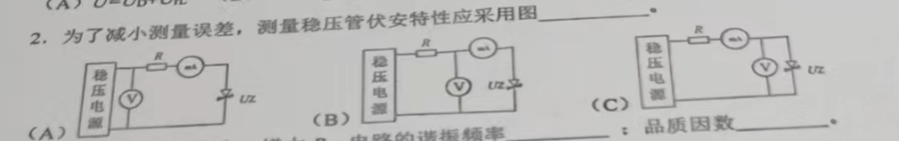
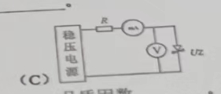
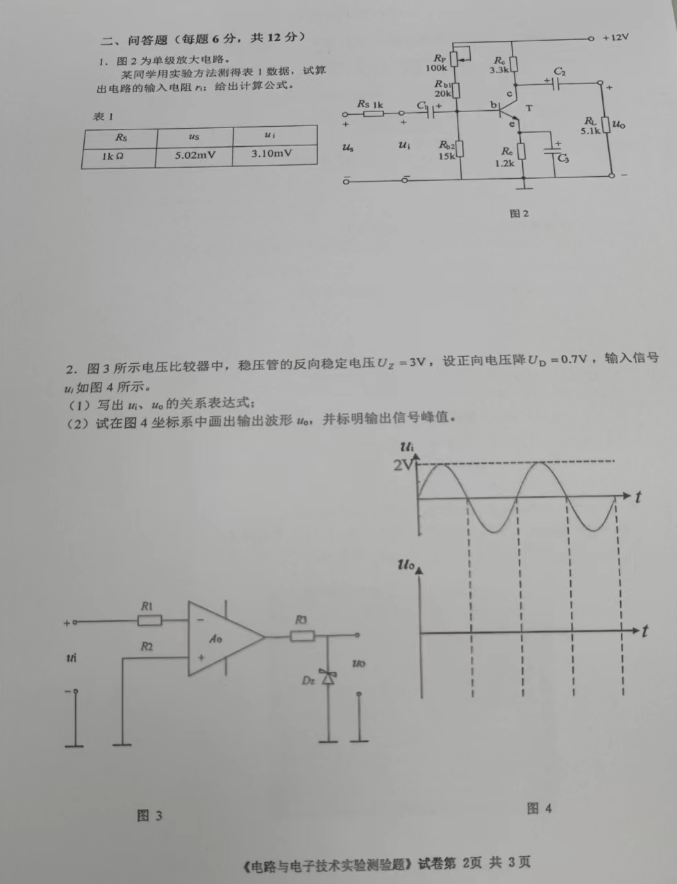
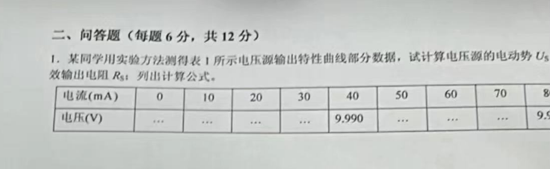

# 真题出发
## 实验六 RLC串联谐振电路的研究
3. 当L、C不变，R变化时，谐振频率不变，品质因数Q变化
    - $Q=\frac{1}{R}\sqrt{\frac{L}{C}}$
    - $f_0=\frac{1}{2\pi\sqrt{LC}}$
## 实验五 一阶RC串联电路暂态过程的研究
- 在一阶RC电路中，当电路状态改变时，不能产生跃变的是
    -  a. 电容电压
    -  b. 电容电流
    -  c. 电阻电流
## 实验八 RL串联电路及其功率因素的提高
1. 灯管电压 $U_D$, 镇流器电压 $U_{rl}$, 输入电压 $U$ 的关系是矢量关系：
    - $U=U_D+U_{rl}$
- 在RL串联电路中，当功率因数 $cos \theta<1$ 时，电路有功功率 P 和输入电压 U 的关系为：
    - $P=UIcos\theta$，$P<UI$
## 实验一 电路元件伏安特性测试

2. 为了减小测量误差，测量稳压管伏安特s性应采用: C

## 未知
- 频率变化时不影响其阻抗值的理想元件是 电阻
- 下列TTL电路中，输出端能直接连接的是（与非门、或门、OC门）？ OC门
## 实验十三 单管共射放大电路
- 在单管放大器实验中，测量输入正弦波信号须选用 A
    - (A)交流毫伏表
    - (B)万用表直流电压档
    - (C)万用表交流电压档
- 在单级晶体管放大器实验中，测量静态工作点Q值应选用 A
    - (A)万用表直流电压档
    - (B)万用表交流电压档
    - (C)交流毫伏表
## 实验十四 运算放大器的基本应用
- 运算放大器：(A)只能放大直流信号(B)只能放大交流信号(C)既能放大直流信号 C
- 输入电阻、输出电阻和（ 增益 ）是放大器的主要性能指标。：
## 实验二十 组合逻辑电路的设计与实现
在设计组合逻辑电路时，需要把多余输入引脚接低电平的是：a. 与门 b. 或门 c. 与非门 ：C

## 实验器材的使用
- 示波器波形的阅读，周期、幅值

## 大题

1. 单级放大电路的输出电阻计算公式：$$r_i=\frac{R_s U_i}{U_s-U_i}$$

2. 电压比较器，稳压管的反向电压、正向电压降已知。输入信号u_i如图所示，写出u_i、u_o的关系表达式。

1. 根据电压源输出特性曲线的部分数据，计算电压源的电动势$U_s$和有效输出电阻$R_s$，列出计算公式。
    - $U=U_s-R_sI$, 解方程
